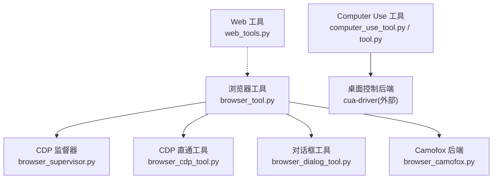
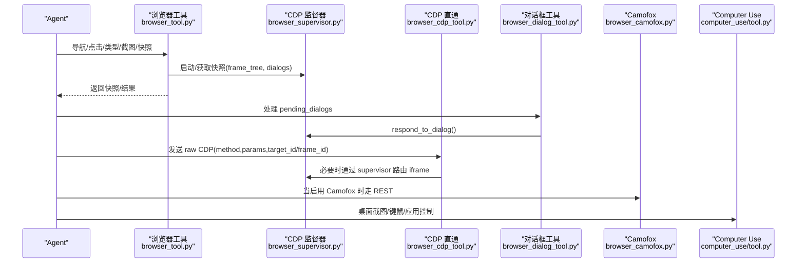
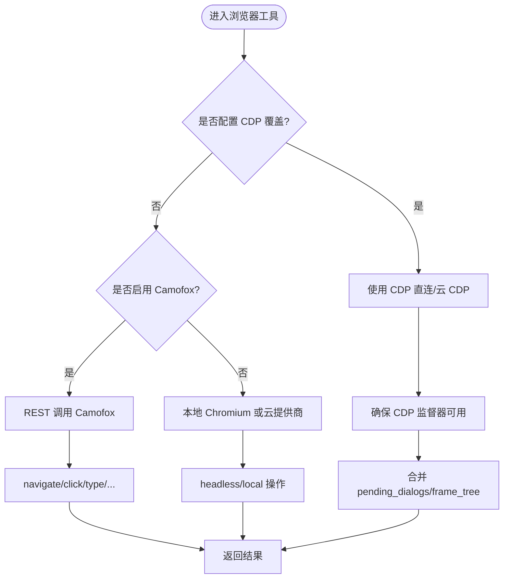
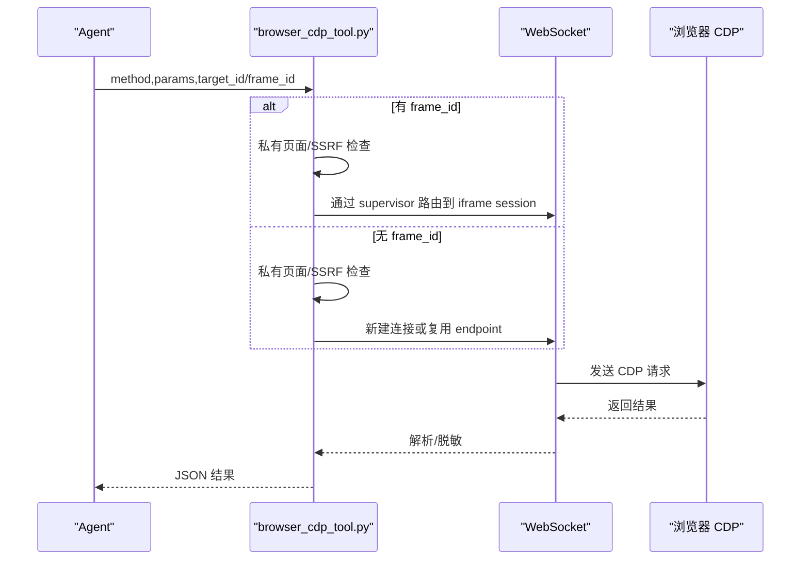
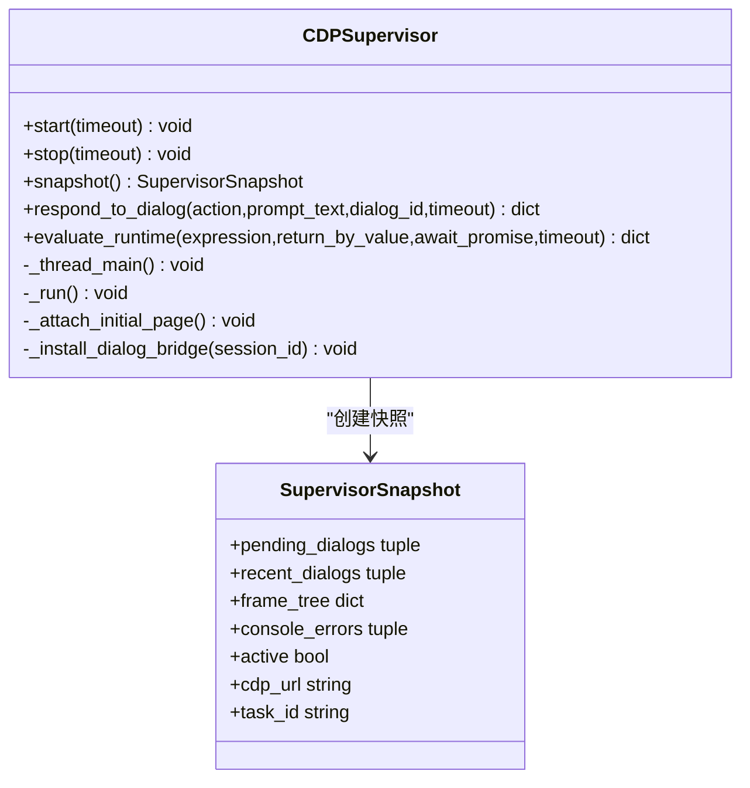
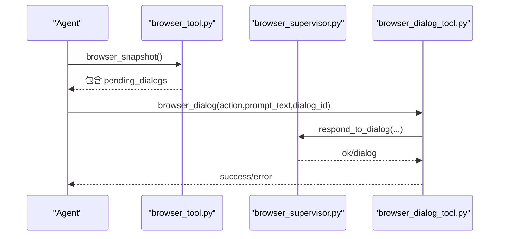
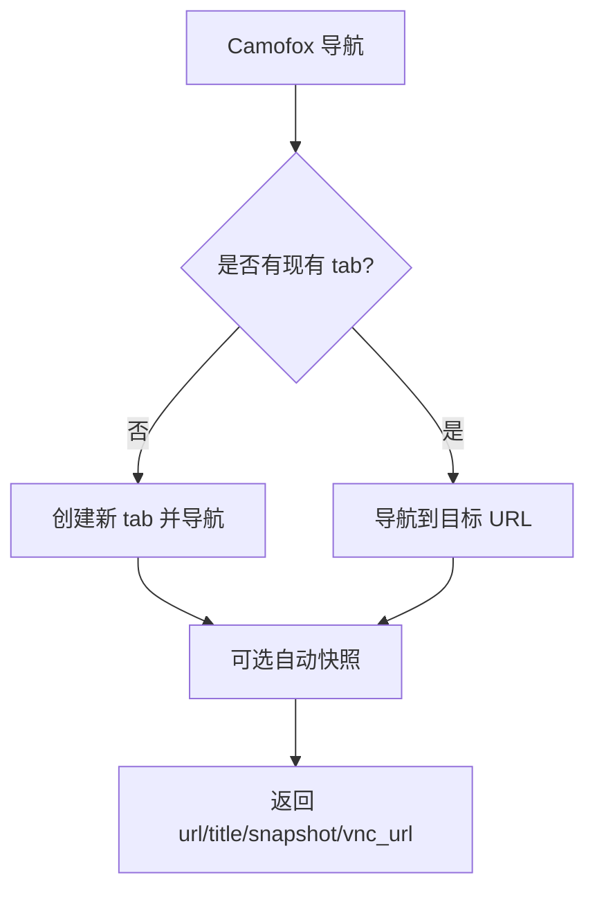
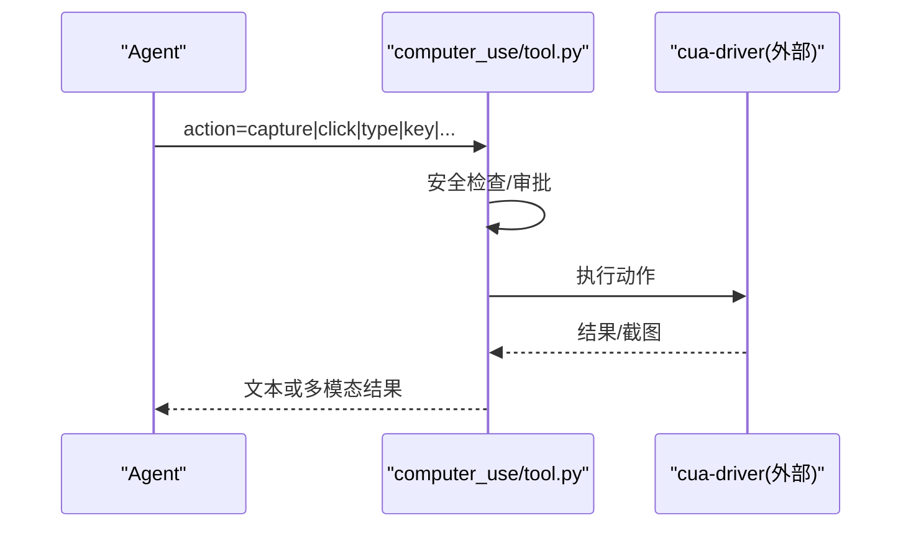
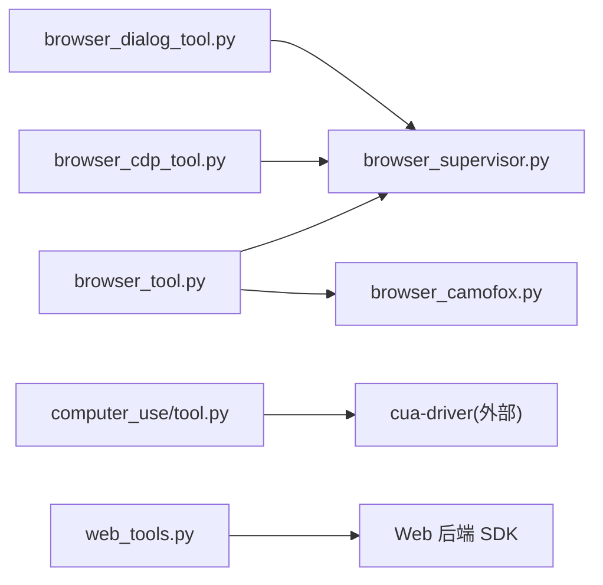

# 浏览器自动化

<cite>
**本文引用的文件**
- [tools/browser_tool.py](file://tools/browser_tool.py)
- [tools/browser_cdp_tool.py](file://tools/browser_cdp_tool.py)
- [tools/browser_supervisor.py](file://tools/browser_supervisor.py)
- [tools/browser_dialog_tool.py](file://tools/browser_dialog_tool.py)
- [tools/browser_camofox.py](file://tools/browser_camofox.py)
- [tools/computer_use_tool.py](file://tools/computer_use_tool.py)
- [tools/computer_use/tool.py](file://tools/computer_use/tool.py)
- [tools/web_tools.py](file://tools/web_tools.py)
</cite>

## 目录
1. [简介](#简介)
2. [项目结构](#项目结构)
3. [核心组件](#核心组件)
4. [架构总览](#架构总览)
5. [详细组件分析](#详细组件分析)
6. [依赖关系分析](#依赖关系分析)
7. [性能考量](#性能考量)
8. [故障排查指南](#故障排查指南)
9. [结论](#结论)
10. [附录：使用场景与示例路径](#附录使用场景与示例路径)

## 简介
本文件面向 Hermes Agent 的“浏览器自动化”能力，系统性说明基于 CDP 的浏览器控制、页面导航、元素操作、数据提取、对话框处理、多标签页与会话管理，以及计算机使用工具（Computer Use）的屏幕截图、鼠标键盘操作与应用控制。文档同时覆盖异步执行、错误恢复、安全边界与最佳实践，并提供可落地的网页抓取、表单填写、截图生成等场景的使用指引与代码片段路径。

## 项目结构
Hermes 的浏览器自动化由多个模块协作完成：
- 高层浏览器工具：统一入口与后端选择（本地 Chromium、Browserbase、Browser Use、Firecrawl、Camofox）。
- CDP 直通工具：直接发送 Chrome DevTools Protocol 命令，用于高级/兜底操作。
- CDP 监督器：维护持久 WebSocket 连接，捕获对话框、帧树、控制台事件，提供线程安全的快照。
- 对话框工具：响应原生 JS 对话框（alert/confirm/prompt/beforeunload）。
- Camofox 后端：通过 REST API 驱动防检测浏览器，提供等价的操作接口。
- Computer Use：跨平台桌面控制（截图、键鼠、应用聚焦、内置浏览器操作）。
- Web 工具：通用网页搜索与内容提取（与浏览器工具互补）。

图表来源
- [tools/browser_tool.py:1-120](file://tools/browser_tool.py#L1-L120)
- [tools/browser_supervisor.py:1-120](file://tools/browser_supervisor.py#L1-L120)
- [tools/browser_cdp_tool.py:1-60](file://tools/browser_cdp_tool.py#L1-L60)
- [tools/browser_dialog_tool.py:1-40](file://tools/browser_dialog_tool.py#L1-L40)
- [tools/browser_camofox.py:1-30](file://tools/browser_camofox.py#L1-L30)
- [tools/computer_use_tool.py:1-35](file://tools/computer_use_tool.py#L1-L35)
- [tools/computer_use/tool.py:1-60](file://tools/computer_use/tool.py#L1-L60)
- [tools/web_tools.py:1-40](file://tools/web_tools.py#L1-L40)

章节来源
- [tools/browser_tool.py:1-120](file://tools/browser_tool.py#L1-L120)
- [tools/browser_supervisor.py:1-120](file://tools/browser_supervisor.py#L1-L120)
- [tools/browser_cdp_tool.py:1-60](file://tools/browser_cdp_tool.py#L1-L60)
- [tools/browser_dialog_tool.py:1-40](file://tools/browser_dialog_tool.py#L1-L40)
- [tools/browser_camofox.py:1-30](file://tools/browser_camofox.py#L1-L30)
- [tools/computer_use_tool.py:1-35](file://tools/computer_use_tool.py#L1-L35)
- [tools/computer_use/tool.py:1-60](file://tools/computer_use/tool.py#L1-L60)
- [tools/web_tools.py:1-40](file://tools/web_tools.py#L1-L40)

## 核心组件
- 浏览器工具（browser_tool.py）
  - 负责后端选择（本地 Chromium、Browserbase、Browser Use、Firecrawl、Camofox），会话隔离、超时控制、URL 安全校验、截图与快照摘要、CDP 监督器启动与清理。
- CDP 直通工具（browser_cdp_tool.py）
  - 暴露 raw CDP 调用，支持按 target_id 或 frame_id 路由到具体页面/iframe；内置私有页面/SSRF 防护；结果脱敏。
- CDP 监督器（browser_supervisor.py）
  - 单任务一个 supervisor，维护持久 WebSocket，自动附加目标、启用域、安装对话框桥接脚本，提供 pending_dialogs/frame_tree/console_errors 快照。
- 对话框工具（browser_dialog_tool.py）
  - 读取 browser_snapshot 中的 pending_dialogs，调用 accept/dismiss 处理原生对话框。
- Camofox 后端（browser_camofox.py）
  - 通过 REST 接口实现 navigate/click/type/scroll/back/press/close/snapshot 等，支持 VNC 查看、循环地址重写、受管持久化。
- Computer Use（computer_use_tool.py + computer_use/tool.py）
  - 统一桌面控制入口，支持 capture（截图）、click/drag/scroll/type/key/focus_app/list_apps/list_windows 等，含审批与安全策略。
- Web 工具（web_tools.py）
  - 提供 web_search_tool 与 web_extract_tool，支持多种后端（Exa、Firecrawl、Parallel、Tavily 等），与浏览器工具互补。

章节来源
- [tools/browser_tool.py:1-120](file://tools/browser_tool.py#L1-L120)
- [tools/browser_cdp_tool.py:1-60](file://tools/browser_cdp_tool.py#L1-L60)
- [tools/browser_supervisor.py:1-120](file://tools/browser_supervisor.py#L1-L120)
- [tools/browser_dialog_tool.py:1-40](file://tools/browser_dialog_tool.py#L1-L40)
- [tools/browser_camofox.py:1-30](file://tools/browser_camofox.py#L1-L30)
- [tools/computer_use_tool.py:1-35](file://tools/computer_use_tool.py#L1-L35)
- [tools/computer_use/tool.py:1-60](file://tools/computer_use/tool.py#L1-L60)
- [tools/web_tools.py:1-40](file://tools/web_tools.py#L1-L40)

## 架构总览
下图展示浏览器自动化在 Hermes 中的整体交互：上层工具根据配置与凭据选择后端；CDP 模式通过监督器维持长连接并捕获对话框与帧树；Camofox 走 REST 通道；Computer Use 通过 cua-driver 控制桌面。

图表来源
- [tools/browser_tool.py:594-650](file://tools/browser_tool.py#L594-L650)
- [tools/browser_supervisor.py:289-350](file://tools/browser_supervisor.py#L289-L350)
- [tools/browser_cdp_tool.py:188-276](file://tools/browser_cdp_tool.py#L188-L276)
- [tools/browser_dialog_tool.py:82-117](file://tools/browser_dialog_tool.py#L82-L117)
- [tools/browser_camofox.py:496-574](file://tools/browser_camofox.py#L496-L574)
- [tools/computer_use/tool.py:440-512](file://tools/computer_use/tool.py#L440-L512)

## 详细组件分析

### 浏览器工具（browser_tool.py）
- 功能要点
  - 后端选择：优先 CDP 直连（BROWSER_CDP_URL/config.browser.cdp_url），否则选择云提供商（Browserbase/Browser Use/Firecrawl）或本地 headless Chromium；若设置 CAMOFOX_URL 且无 CDP 覆盖则走 Camofox。
  - 会话隔离：按 task_id 隔离浏览器会话与 CDP 监督器。
  - 超时与重试：命令超时、首次打开超时、截图清理节流。
  - 安全：URL 安全校验、敏感信息脱敏、私有页面访问限制。
  - 快照与摘要：文本型页面快照，超过阈值进行 LLM 摘要或截断。
  - CDP 监督器集成：自动启动/停止，合并 pending_dialogs/frame_tree 到快照。
- 关键流程
  - 导航/点击/类型/截图/快照：统一入口，内部根据后端分发。
  - CDP 监督器启动：_ensure_cdp_supervisor(task_id) 在需要时建立连接并订阅事件。
  - 清理：进程退出或任务结束时释放资源。

图表来源
- [tools/browser_tool.py:434-556](file://tools/browser_tool.py#L434-L556)
- [tools/browser_tool.py:594-650](file://tools/browser_tool.py#L594-L650)
- [tools/browser_camofox.py:115-132](file://tools/browser_camofox.py#L115-L132)

章节来源
- [tools/browser_tool.py:1-120](file://tools/browser_tool.py#L1-L120)
- [tools/browser_tool.py:434-556](file://tools/browser_tool.py#L434-L556)
- [tools/browser_tool.py:594-650](file://tools/browser_tool.py#L594-L650)

### CDP 直通工具（browser_cdp_tool.py）
- 功能要点
  - 暴露 raw CDP 方法，支持 target_id（页面级）与 frame_id（OOPIF iframe）两种作用域。
  - 私有页面/SSRF 防护：对 Page.navigate/Runtime.evaluate 等方法进行 URL 与表达式检查。
  - 结果脱敏：对浏览器返回的敏感文本进行脱敏。
  - 超时与异常：WebSocket 连接、超时、协议错误均有明确错误提示。
- 典型用法
  - 列出标签页：Target.getTargets
  - 处理原生对话框：Page.handleJavaScriptDialog
  - 获取 Cookie：Network.getAllCookies
  - 在指定标签页执行 JS：Runtime.evaluate
  - 设置视口：Emulation.setDeviceMetricsOverride

图表来源
- [tools/browser_cdp_tool.py:188-276](file://tools/browser_cdp_tool.py#L188-L276)
- [tools/browser_cdp_tool.py:394-531](file://tools/browser_cdp_tool.py#L394-L531)

章节来源
- [tools/browser_cdp_tool.py:1-60](file://tools/browser_cdp_tool.py#L1-L60)
- [tools/browser_cdp_tool.py:188-276](file://tools/browser_cdp_tool.py#L188-L276)
- [tools/browser_cdp_tool.py:394-531](file://tools/browser_cdp_tool.py#L394-L531)

### CDP 监督器（browser_supervisor.py）
- 功能要点
  - 单任务单实例，后台线程运行独立 asyncio loop，维护单一 WebSocket。
  - 自动附加页面目标、启用 Page/Runtime/Target 域、安装对话框桥接脚本。
  - 捕获 pending_dialogs/recent_dialogs/frame_tree/console_events，提供线程安全快照。
  - 支持 evaluate_runtime 在页面上下文执行 JS，自动降级序列化失败。
- 生命周期
  - start(): 启动线程、连接 CDP、附加页面、就绪。
  - snapshot(): 同步读取状态。
  - respond_to_dialog(): 接受/取消对话框。
  - stop(): 关闭 WebSocket、清理任务、标记非活跃。

图表来源
- [tools/browser_supervisor.py:289-350](file://tools/browser_supervisor.py#L289-L350)
- [tools/browser_supervisor.py:353-443](file://tools/browser_supervisor.py#L353-L443)
- [tools/browser_supervisor.py:445-610](file://tools/browser_supervisor.py#L445-L610)

章节来源
- [tools/browser_supervisor.py:1-120](file://tools/browser_supervisor.py#L1-L120)
- [tools/browser_supervisor.py:289-350](file://tools/browser_supervisor.py#L289-L350)
- [tools/browser_supervisor.py:353-443](file://tools/browser_supervisor.py#L353-L443)
- [tools/browser_supervisor.py:445-610](file://tools/browser_supervisor.py#L445-L610)

### 对话框工具（browser_dialog_tool.py）
- 功能要点
  - 仅当 CDP 可达时注册（与 browser_cdp 一致）。
  - 先调用 browser_snapshot 获取 pending_dialogs，再调用 browser_dialog 处理。
  - 支持 prompt 输入文本、多对话框时指定 dialog_id。
- 工作流
  - 读取 pending_dialogs -> 选择 action=accept|dismiss -> 通过 supervisor.respond_to_dialog 执行。

图表来源
- [tools/browser_dialog_tool.py:28-79](file://tools/browser_dialog_tool.py#L28-L79)
- [tools/browser_dialog_tool.py:82-117](file://tools/browser_dialog_tool.py#L82-L117)

章节来源
- [tools/browser_dialog_tool.py:1-40](file://tools/browser_dialog_tool.py#L1-L40)
- [tools/browser_dialog_tool.py:28-79](file://tools/browser_dialog_tool.py#L28-L79)
- [tools/browser_dialog_tool.py:82-117](file://tools/browser_dialog_tool.py#L82-L117)

### Camofox 后端（browser_camofox.py）
- 功能要点
  - 通过 REST API 实现 navigate/click/type/scroll/back/press/close/snapshot/images。
  - 支持 VNC 实时查看、循环地址重写（Docker 环境）、受管持久化（跨重启保持登录态）。
  - 私有页面保护：在非本地后端下阻止读取当前页面内容。
- 会话管理
  - 按 task_id 维护用户 ID、tab_id、session_key；支持采用已有 tab 以恢复上下文。

图表来源
- [tools/browser_camofox.py:496-574](file://tools/browser_camofox.py#L496-L574)
- [tools/browser_camofox.py:359-421](file://tools/browser_camofox.py#L359-L421)

章节来源
- [tools/browser_camofox.py:1-30](file://tools/browser_camofox.py#L1-L30)
- [tools/browser_camofox.py:496-574](file://tools/browser_camofox.py#L496-L574)
- [tools/browser_camofox.py:359-421](file://tools/browser_camofox.py#L359-L421)

### Computer Use（computer_use_tool.py + computer_use/tool.py）
- 功能要点
  - 统一入口 handle_computer_use，支持 capture/wait/list_apps/list_windows/focus_app 及输入类操作（click/drag/scroll/type/key/set_value）。
  - 内置浏览器操作命名空间（cua_browser_*），与原生浏览器工具不冲突。
  - 安全策略：危险组合键硬拦截、type 文本模式匹配拦截、破坏性操作需审批。
  - 后端选择：默认 cua-driver，可通过环境变量切换；支持 per-session 权限模式。
- 审批与隔离
  - 审批回调支持 approve_once/approve_session/always_approve/deny，按 (action, delivery_mode) 与作用域隔离。
  - 进程退出时清理所有后端，避免子进程泄漏。

图表来源
- [tools/computer_use/tool.py:440-512](file://tools/computer_use/tool.py#L440-L512)
- [tools/computer_use/tool.py:590-788](file://tools/computer_use/tool.py#L590-L788)

章节来源
- [tools/computer_use_tool.py:1-35](file://tools/computer_use_tool.py#L1-L35)
- [tools/computer_use/tool.py:440-512](file://tools/computer_use/tool.py#L440-L512)
- [tools/computer_use/tool.py:590-788](file://tools/computer_use/tool.py#L590-L788)

### Web 工具（web_tools.py）
- 功能要点
  - 提供 web_search_tool 与 web_extract_tool，支持 Exa、Firecrawl、Parallel、Tavily、SearXNG、Brave Free、DDGS、xai 等后端。
  - 智能内容提取与压缩，减少 token 消耗；支持调试日志。
- 与浏览器工具的关系
  - 适合无需打开浏览器的纯文本抓取与搜索；浏览器工具适合需要交互、截图、JS 执行的场景。

章节来源
- [tools/web_tools.py:1-40](file://tools/web_tools.py#L1-L40)
- [tools/web_tools.py:106-200](file://tools/web_tools.py#L106-L200)

## 依赖关系分析
- 耦合关系
  - browser_tool 依赖 browser_supervisor（CDP 监督器）与 browser_camofox（REST 后端），并通过 _get_cdp_override 决定 CDP 直连。
  - browser_cdp_tool 依赖 websockets 与 browser_tool 的安全函数，必要时通过 SUPERVISOR_REGISTRY 路由到 iframe。
  - browser_dialog_tool 依赖 browser_supervisor 的对话处理能力。
  - computer_use/tool 依赖 cua-driver 后端，提供统一的审批与安全策略。
- 外部依赖
  - websockets（CDP WebSocket 通信）
  - requests（Camofox HTTP 调用）
  - cua-driver（桌面控制驱动，外部二进制/服务）
  - 各 Web 后端 SDK（Firecrawl、Tavily、Parallel、Exa 等）

图表来源
- [tools/browser_tool.py:594-650](file://tools/browser_tool.py#L594-L650)
- [tools/browser_cdp_tool.py:284-391](file://tools/browser_cdp_tool.py#L284-L391)
- [tools/browser_dialog_tool.py:82-117](file://tools/browser_dialog_tool.py#L82-L117)
- [tools/computer_use/tool.py:201-253](file://tools/computer_use/tool.py#L201-L253)
- [tools/web_tools.py:159-200](file://tools/web_tools.py#L159-L200)

章节来源
- [tools/browser_tool.py:594-650](file://tools/browser_tool.py#L594-L650)
- [tools/browser_cdp_tool.py:284-391](file://tools/browser_cdp_tool.py#L284-L391)
- [tools/browser_dialog_tool.py:82-117](file://tools/browser_dialog_tool.py#L82-L117)
- [tools/computer_use/tool.py:201-253](file://tools/computer_use/tool.py#L201-L253)
- [tools/web_tools.py:159-200](file://tools/web_tools.py#L159-L200)

## 性能考量
- 超时与节流
  - 命令超时、首次打开超时、截图清理节流，避免长时间阻塞与频繁磁盘扫描。
- 连接复用
  - CDP 监督器复用 WebSocket，减少每调用一次子进程/连接的开销。
- 快照大小控制
  - 文本快照超过阈值进行摘要或截断，限制存储与传输成本。
- 后端选择
  - 优先 CDP 直连或云 CDP，其次 Camofox REST，最后本地 headless；合理选择可降低延迟与资源占用。
- 并发与隔离
  - 按 task_id/session_id 隔离会话与后端，避免竞争条件与状态污染。

[本节为通用指导，不直接分析具体文件]

## 故障排查指南
- 无法连接 CDP
  - 检查 BROWSER_CDP_URL 或 config.browser.cdp_url 是否正确；确认浏览器已开启调试端口。
  - 参考错误消息中的重连与诊断建议。
- 对话框未出现或无法响应
  - 确保已通过 browser_snapshot 获取 pending_dialogs；确认 CDP 监督器处于活跃状态。
- Camofox 不可用
  - 检查 CAMOFOX_URL 与服务健康；确认 Docker 端口映射与循环地址重写配置。
- Computer Use 不可用
  - 检查 cua-driver 安装与健康报告；确认系统显示服务器与无障碍栈可用。
- 网络与安全
  - 注意私有页面/SSRF 防护；避免在受限环境下访问内网地址。

章节来源
- [tools/browser_cdp_tool.py:498-531](file://tools/browser_cdp_tool.py#L498-L531)
- [tools/browser_supervisor.py:353-443](file://tools/browser_supervisor.py#L353-L443)
- [tools/browser_camofox.py:134-163](file://tools/browser_camofox.py#L134-L163)
- [tools/computer_use/tool.py:494-512](file://tools/computer_use/tool.py#L494-L512)

## 结论
Hermes 的浏览器自动化提供了从高层工具到底层 CDP 的完整能力链，支持多后端、多标签页、对话框处理、截图与数据提取，并通过 Computer Use 扩展至桌面控制。其设计强调安全边界（私有页面/SSRF 防护）、性能优化（连接复用、快照摘要、超时控制）与健壮性（错误恢复、会话隔离）。在实际使用中，应根据场景选择合适的后端与工具组合，遵循安全与最佳实践建议。

[本节为总结，不直接分析具体文件]

## 附录：使用场景与示例路径
- 网页抓取（无需交互）
  - 使用 Web 工具：web_search_tool/web_extract_tool
  - 参考路径：[tools/web_tools.py:1-40](file://tools/web_tools.py#L1-L40)
- 页面导航与元素操作
  - 使用浏览器工具：navigate/click/type/scroll/back/press
  - 参考路径：[tools/browser_tool.py:1-120](file://tools/browser_tool.py#L1-L120)
- 截图生成
  - 使用浏览器工具或 Computer Use 的 capture
  - 参考路径：[tools/computer_use/tool.py:590-610](file://tools/computer_use/tool.py#L590-L610)
- 表单填写
  - 使用浏览器工具的 type 或 Computer Use 的 type/set_value
  - 参考路径：[tools/browser_camofox.py:680-718](file://tools/browser_camofox.py#L680-L718)
- 原生对话框处理
  - 先 browser_snapshot 获取 pending_dialogs，再 browser_dialog 处理
  - 参考路径：[tools/browser_dialog_tool.py:28-79](file://tools/browser_dialog_tool.py#L28-L79)
- 高级 CDP 操作
  - 使用 browser_cdp 发送 Target/Page/Runtime/Network 等方法
  - 参考路径：[tools/browser_cdp_tool.py:394-531](file://tools/browser_cdp_tool.py#L394-L531)
- 多标签页与会话管理
  - 通过 Target.getTargets 与 task_id 隔离会话
  - 参考路径：[tools/browser_cdp_tool.py:188-276](file://tools/browser_cdp_tool.py#L188-L276)
- 异步操作与错误恢复
  - 监督器后台线程与重连机制；超时与异常处理
  - 参考路径：[tools/browser_supervisor.py:644-740](file://tools/browser_supervisor.py#L644-L740)

章节来源
- [tools/web_tools.py:1-40](file://tools/web_tools.py#L1-L40)
- [tools/browser_tool.py:1-120](file://tools/browser_tool.py#L1-L120)
- [tools/computer_use/tool.py:590-610](file://tools/computer_use/tool.py#L590-L610)
- [tools/browser_camofox.py:680-718](file://tools/browser_camofox.py#L680-L718)
- [tools/browser_dialog_tool.py:28-79](file://tools/browser_dialog_tool.py#L28-L79)
- [tools/browser_cdp_tool.py:394-531](file://tools/browser_cdp_tool.py#L394-L531)
- [tools/browser_cdp_tool.py:188-276](file://tools/browser_cdp_tool.py#L188-L276)
- [tools/browser_supervisor.py:644-740](file://tools/browser_supervisor.py#L644-L740)