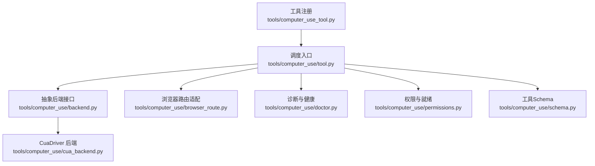
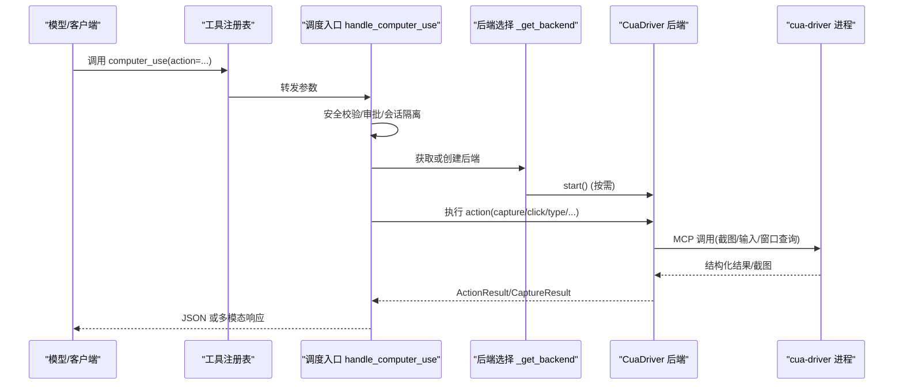
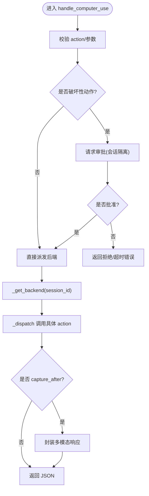
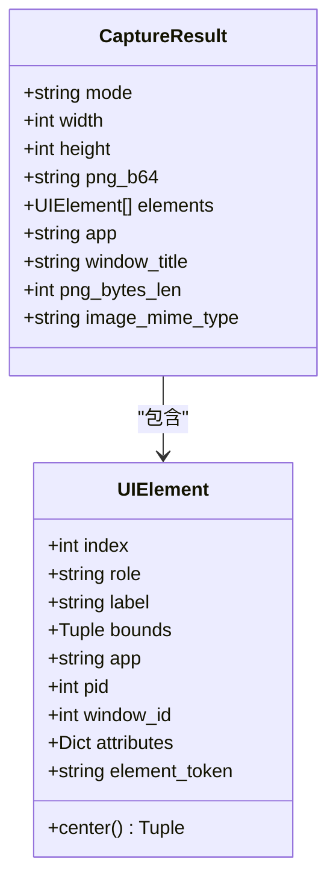
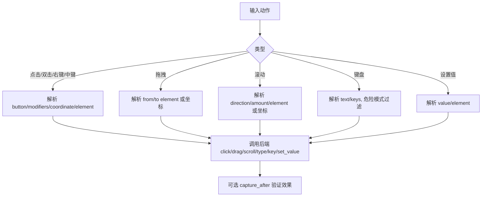
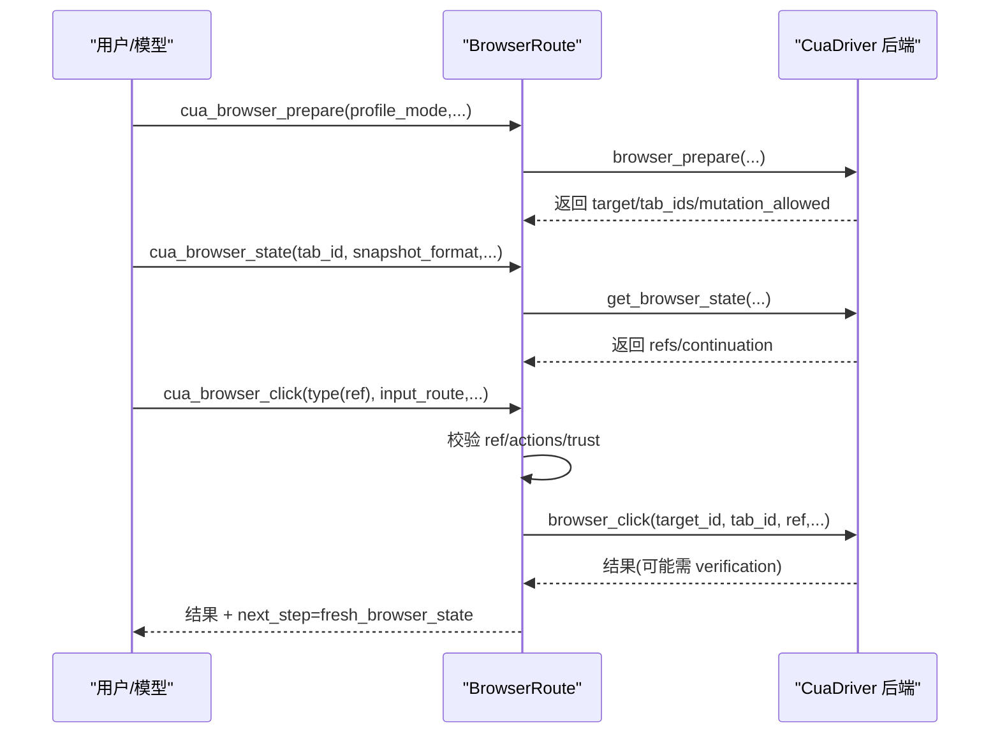
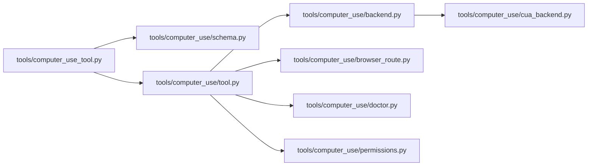

# 计算机使用工具

<cite>
**本文引用的文件**
- [tools/computer_use/tool.py](file://tools/computer_use/tool.py)
- [tools/computer_use/schema.py](file://tools/computer_use/schema.py)
- [tools/computer_use/backend.py](file://tools/computer_use/backend.py)
- [tools/computer_use/cua_backend.py](file://tools/computer_use/cua_backend.py)
- [tools/computer_use/permissions.py](file://tools/computer_use/permissions.py)
- [tools/computer_use/doctor.py](file://tools/computer_use/doctor.py)
- [tools/computer_use/browser_route.py](file://tools/computer_use/browser_route.py)
- [tools/computer_use_tool.py](file://tools/computer_use_tool.py)
</cite>

## 目录
1. [简介](#简介)
2. [项目结构](#项目结构)
3. [核心组件](#核心组件)
4. [架构总览](#架构总览)
5. [详细组件分析](#详细组件分析)
6. [依赖关系分析](#依赖关系分析)
7. [性能与优化](#性能与优化)
8. [权限与安全限制](#权限与安全限制)
9. [故障排除指南](#故障排除指南)
10. [结论](#结论)
11. [附录：常见用法与示例路径](#附录：常见用法与示例路径)

## 简介
本文件面向“计算机使用工具”（computer_use），系统性说明 Hermes Agent 如何通过该工具实现桌面应用控制与屏幕交互，包括模拟鼠标点击、键盘输入、滚动、拖拽、截图、窗口管理与浏览器内操作。文档解释其工作原理（屏幕捕获、图像识别、坐标定位、跨平台兼容性）、权限配置、安全限制、性能优化与故障排除，并提供实际场景的参考路径以便快速上手。

## 项目结构
computer_use 工具采用“统一入口 + 抽象后端 + 具体实现”的分层设计：
- 工具注册与调度：通过顶层 shim 将 computer_use 注册到工具集，暴露统一的 action 分发入口。
- 抽象后端接口：定义 capture、click、drag、scroll、type、key、list_apps、focus_app、set_value 等能力契约。
- 具体后端实现：cua-driver 后端通过 MCP 与原生驱动通信，覆盖 macOS、Windows、Linux。
- 浏览器路由：在统一工具下提供命名空间化的 cua_browser_* 动作，用于精确绑定并操作浏览器标签页。
- 诊断与权限：doctor 负责健康检查；permissions 聚合平台就绪状态与授权提示。

**图表来源**
- [tools/computer_use_tool.py:1-43](file://tools/computer_use_tool.py#L1-L43)
- [tools/computer_use/tool.py:440-511](file://tools/computer_use/tool.py#L440-L511)
- [tools/computer_use/backend.py:111-250](file://tools/computer_use/backend.py#L111-L250)
- [tools/computer_use/cua_backend.py:1-800](file://tools/computer_use/cua_backend.py#L1-L800)
- [tools/computer_use/browser_route.py:179-574](file://tools/computer_use/browser_route.py#L179-L574)
- [tools/computer_use/doctor.py:1-800](file://tools/computer_use/doctor.py#L1-L800)
- [tools/computer_use/permissions.py:121-161](file://tools/computer_use/permissions.py#L121-L161)
- [tools/computer_use/schema.py:16-348](file://tools/computer_use/schema.py#L16-L348)

**章节来源**
- [tools/computer_use_tool.py:1-43](file://tools/computer_use_tool.py#L1-L43)
- [tools/computer_use/tool.py:440-511](file://tools/computer_use/tool.py#L440-L511)
- [tools/computer_use/backend.py:111-250](file://tools/computer_use/backend.py#L111-L250)
- [tools/computer_use/cua_backend.py:1-800](file://tools/computer_use/cua_backend.py#L1-L800)
- [tools/computer_use/browser_route.py:179-574](file://tools/computer_use/browser_route.py#L179-L574)
- [tools/computer_use/doctor.py:1-800](file://tools/computer_use/doctor.py#L1-L800)
- [tools/computer_use/permissions.py:121-161](file://tools/computer_use/permissions.py#L121-L161)
- [tools/computer_use/schema.py:16-348](file://tools/computer_use/schema.py#L16-L348)

## 核心组件
- 统一工具 Schema：以单一 tool 暴露 action 枚举，包含 capture、click/double_click/right_click/middle_click、drag、scroll、type、key、set_value、wait、list_apps、list_windows、focus_app，以及 cua_browser_* 系列动作。支持 som/vision/ax 三种捕获模式，元素索引优先于像素坐标。
- 调度与审批：handle_computer_use 负责参数校验、危险动作审批、会话隔离、后端选择与调用，返回文本或带图片的多模态结果。
- 抽象后端：ComputerUseBackend 定义所有能力契约与数据结构（UIElement、CaptureResult、ActionResult）。
- CuaDriver 后端：跨平台实现，通过 MCP stdio 与 cua-driver 通信，处理进程生命周期、环境清理、更新检查、无覆盖模式、Wsl 路径兼容等。
- 浏览器路由：对 cua_driver 的 get_browser_state / browser_* 进行严格的状态与引用管理，确保精确绑定、防越权与可验证性。
- 诊断与权限：doctor 调用 health_report 或回退探针生成报告；permissions 汇总平台就绪与 TCC 授权状态。

**章节来源**
- [tools/computer_use/schema.py:16-348](file://tools/computer_use/schema.py#L16-L348)
- [tools/computer_use/tool.py:440-511](file://tools/computer_use/tool.py#L440-L511)
- [tools/computer_use/backend.py:15-109](file://tools/computer_use/backend.py#L15-L109)
- [tools/computer_use/cua_backend.py:1-800](file://tools/computer_use/cua_backend.py#L1-L800)
- [tools/computer_use/browser_route.py:179-574](file://tools/computer_use/browser_route.py#L179-L574)
- [tools/computer_use/doctor.py:1-800](file://tools/computer_use/doctor.py#L1-L800)
- [tools/computer_use/permissions.py:121-161](file://tools/computer_use/permissions.py#L121-L161)

## 架构总览
下图展示从模型调用到系统级操作的完整链路：模型通过统一 tool 发起 action，调度器执行安全校验与审批，选择后端并调用具体实现，最终由 cua-driver 完成屏幕捕获与输入注入。

**图表来源**
- [tools/computer_use/tool.py:440-511](file://tools/computer_use/tool.py#L440-L511)
- [tools/computer_use/cua_backend.py:1-800](file://tools/computer_use/cua_backend.py#L1-L800)

## 详细组件分析

### 调度与审批流程
- 参数校验：action 必填；type/key 存在危险模式过滤；key 组合硬拦截（如登出、锁屏等）。
- 审批门控：destructive actions 需审批；foreground delivery 与 bring_to_front 单独作用域；支持 once/session/always 策略与会话隔离。
- 后端选择：按 session_id 缓存后端实例；支持环境变量切换后端；异常时给出安装提示。
- 结果封装：文本型直接返回 JSON；带 capture_after 的动作返回多模态内容（文本摘要+图片）。

**图表来源**
- [tools/computer_use/tool.py:440-511](file://tools/computer_use/tool.py#L440-L511)
- [tools/computer_use/tool.py:514-588](file://tools/computer_use/tool.py#L514-L588)
- [tools/computer_use/tool.py:590-788](file://tools/computer_use/tool.py#L590-L788)

**章节来源**
- [tools/computer_use/tool.py:440-511](file://tools/computer_use/tool.py#L440-L511)
- [tools/computer_use/tool.py:514-588](file://tools/computer_use/tool.py#L514-L588)
- [tools/computer_use/tool.py:590-788](file://tools/computer_use/tool.py#L590-L788)

### 截图与视觉识别
- 捕获模式：
  - som：默认，返回带编号叠加层的截图与 AX 元素映射，便于按 element 索引点击。
  - vision：纯截图。
  - ax：仅无障碍树（适合纯文本模型）。
- 目标选择：可按 app/pid/window_id 限定；支持“screen/desktop”捕获桌面/任务栏。
- 元素上限：max_elements 控制 AX 节点数量，避免上下文爆炸。
- 响应：CaptureResult 包含尺寸、base64 图片、elements 列表、mime 类型等。

**图表来源**
- [tools/computer_use/backend.py:15-68](file://tools/computer_use/backend.py#L15-L68)

**章节来源**
- [tools/computer_use/schema.py:67-130](file://tools/computer_use/schema.py#L67-L130)
- [tools/computer_use/backend.py:15-68](file://tools/computer_use/backend.py#L15-L68)

### 鼠标与键盘输入
- 指针动作：click/double_click/right_click/middle_click 支持 element 或 coordinate 定位、按钮与修饰键、delivery_mode（background/foreground）与 bring_to_front。
- 拖拽：支持 from/to element 或坐标，按钮与修饰键。
- 滚动：direction/amount，支持 element 或坐标。
- 键盘：type_text 与 key 组合；key 组合会被规范化并做危险组合拦截。
- set_value：针对 select/滑块等 AXValue 元素直接设置值，无需打开菜单。

**图表来源**
- [tools/computer_use/tool.py:718-788](file://tools/computer_use/tool.py#L718-L788)

**章节来源**
- [tools/computer_use/schema.py:131-229](file://tools/computer_use/schema.py#L131-L229)
- [tools/computer_use/tool.py:718-788](file://tools/computer_use/tool.py#L718-L788)

### 窗口与应用管理
- list_apps：列出运行中的应用（名称、bundle ID、PID、窗口数）。
- list_windows：列出可见原生窗口（pid、window_id、z_index 等）。
- focus_app：将输入路由到指定应用，可选择 raise_window 提升窗口（需要审批）。

**章节来源**
- [tools/computer_use/backend.py:190-205](file://tools/computer_use/backend.py#L190-L205)
- [tools/computer_use/tool.py:611-624](file://tools/computer_use/tool.py#L611-L624)

### 浏览器内操作（typed browser）
- 准备阶段：cua_browser_prepare 支持 isolated_new/isolated_named/existing_profile，受驱动权限模式约束。
- 观察阶段：cua_browser_state 读取当前标签页语义快照，维护 ref 与 continuation。
- 变更阶段：navigate/click/type/pointer/dialog/set_input_files/download 等，要求 exact binding、mutation_allowed 与最新 ref，失败时提示 native fallback。
- 安全：ref 仅在当前会话有效；每次突变后失效，必须重新观察；信任降级（trusted→dom_event）需显式声明。

**图表来源**
- [tools/computer_use/browser_route.py:179-574](file://tools/computer_use/browser_route.py#L179-L574)
- [tools/computer_use/tool.py:630-711](file://tools/computer_use/tool.py#L630-L711)

**章节来源**
- [tools/computer_use/browser_route.py:179-574](file://tools/computer_use/browser_route.py#L179-L574)
- [tools/computer_use/tool.py:630-711](file://tools/computer_use/tool.py#L630-L711)

### 跨平台与诊断
- 平台支持：macOS、Windows、Linux（X11/Wayland 通过 XWayland）。
- 诊断：doctor 调用 health_report 或回退探针，输出整体状态与各检查项；permissions 聚合 TCC 授权与就绪信号。
- 安装与更新：cua_backend 支持 check-update 与 manifest 解析，自动选择 mcp 子命令与 no-overlay 标志。

**章节来源**
- [tools/computer_use/doctor.py:1-800](file://tools/computer_use/doctor.py#L1-L800)
- [tools/computer_use/permissions.py:121-161](file://tools/computer_use/permissions.py#L121-L161)
- [tools/computer_use/cua_backend.py:133-254](file://tools/computer_use/cua_backend.py#L133-L254)

## 依赖关系分析
- 工具注册：top-level shim 将 computer_use 注册到 registry，描述跨平台背景控制能力。
- 调度依赖：tool.py 依赖 backend 抽象与 cua_backend 实现；schema.py 提供统一参数定义。
- 浏览器路由：browser_route.py 作为适配器，严格管理会话状态与引用，屏蔽底层差异。
- 诊断与权限：doctor.py 与 permissions.py 为运维与用户反馈提供依据。

**图表来源**
- [tools/computer_use_tool.py:1-43](file://tools/computer_use_tool.py#L1-L43)
- [tools/computer_use/tool.py:440-511](file://tools/computer_use/tool.py#L440-L511)
- [tools/computer_use/backend.py:111-250](file://tools/computer_use/backend.py#L111-L250)
- [tools/computer_use/cua_backend.py:1-800](file://tools/computer_use/cua_backend.py#L1-L800)
- [tools/computer_use/browser_route.py:179-574](file://tools/computer_use/browser_route.py#L179-L574)
- [tools/computer_use/doctor.py:1-800](file://tools/computer_use/doctor.py#L1-L800)
- [tools/computer_use/permissions.py:121-161](file://tools/computer_use/permissions.py#L121-L161)

**章节来源**
- [tools/computer_use_tool.py:1-43](file://tools/computer_use_tool.py#L1-L43)
- [tools/computer_use/tool.py:440-511](file://tools/computer_use/tool.py#L440-L511)

## 性能与优化
- 截图尺寸限制：可通过配置限制最大边长，减少传输与处理开销。
- 无障碍节点裁剪：max_elements 限制 AX 节点数量，避免单次捕获过大。
- 光标覆盖层：在 macOS/WSL/无显示环境下自动禁用 overlay，降低 CPU 占用。
- 会话隔离：每个 session_id 拥有独立后端实例与审批状态，避免并发干扰。
- 等待与节流：wait 默认上限 30s，避免长时间阻塞。

**章节来源**
- [tools/computer_use/cua_backend.py:243-254](file://tools/computer_use/cua_backend.py#L243-L254)
- [tools/computer_use/schema.py:109-130](file://tools/computer_use/schema.py#L109-L130)
- [tools/computer_use/backend.py:244-250](file://tools/computer_use/backend.py#L244-L250)

## 权限与安全限制
- 危险动作审批：click/double_click/right_click/middle_click、drag、scroll、type、key、set_value、focus_app 等需审批；foreground delivery 与 bring_to_front 单独作用域。
- 危险组合拦截：禁止触发注销、锁屏、强制退出等系统快捷键。
- 危险文本过滤：禁止通过 type 注入 shell 管道、sudo rm 等危险模式。
- 平台权限：macOS 需要 Accessibility 与 Screen Recording；非 macOS 以驱动健康为准。
- 隐私与遥测：默认关闭 cua-driver 遥测；子进程环境会剥离敏感变量。

**章节来源**
- [tools/computer_use/tool.py:80-143](file://tools/computer_use/tool.py#L80-L143)
- [tools/computer_use/tool.py:453-477](file://tools/computer_use/tool.py#L453-L477)
- [tools/computer_use/tool.py:514-561](file://tools/computer_use/tool.py#L514-L561)
- [tools/computer_use/permissions.py:121-161](file://tools/computer_use/permissions.py#L121-L161)
- [tools/computer_use/cua_backend.py:187-241](file://tools/computer_use/cua_backend.py#L187-L241)

## 故障排除指南
- 驱动未安装/不可用：若后端初始化失败，提示安装 cua-driver；可通过 doctor 查看健康报告。
- 权限不足：macOS 需在系统设置中授予 Accessibility 与 Screen Recording；可使用权限命令引导授权。
- 截图为空/目标错误：在 Linux/X11 上跳过桌面辅助窗口；必要时指定 pid/window_id。
- 浏览器操作失败：若 typed browser 不可用或拒绝，遵循 native_fallback_required 提示改用原生 AX/PX/foreground 方式。
- 版本不一致：doctor 会对比 CLI 版本与 health_report 中的 driver_version，提示不匹配情况。

**章节来源**
- [tools/computer_use/tool.py:495-502](file://tools/computer_use/tool.py#L495-L502)
- [tools/computer_use/permissions.py:164-199](file://tools/computer_use/permissions.py#L164-L199)
- [tools/computer_use/cua_backend.py:324-356](file://tools/computer_use/cua_backend.py#L324-L356)
- [tools/computer_use/browser_route.py:201-208](file://tools/computer_use/browser_route.py#L201-L208)
- [tools/computer_use/doctor.py:797-800](file://tools/computer_use/doctor.py#L797-L800)

## 结论
computer_use 工具通过统一 Schema 与抽象后端，结合 cua-driver 的跨平台能力，提供了稳定可靠的桌面自动化方案。它以元素索引优先、严格的审批与安全过滤、会话隔离与诊断工具为核心优势，适用于表单填写、数据录入、界面测试与软件操作自动化等场景。配合浏览器路由，可在受控范围内精确操作网页元素，同时保持安全边界与可验证性。

## 附录：常见用法与示例路径
以下列举典型场景及对应代码位置，便于快速定位实现与扩展：
- 截图并识别元素后点击
  - 参考：[tools/computer_use/schema.py:67-130](file://tools/computer_use/schema.py#L67-L130)、[tools/computer_use/tool.py:590-604](file://tools/computer_use/tool.py#L590-L604)
- 后台输入文本与快捷键
  - 参考：[tools/computer_use/tool.py:771-779](file://tools/computer_use/tool.py#L771-L779)
- 滚动与拖拽
  - 参考：[tools/computer_use/tool.py:740-769](file://tools/computer_use/tool.py#L740-L769)
- 聚焦应用与窗口管理
  - 参考：[tools/computer_use/tool.py:611-624](file://tools/computer_use/tool.py#L611-L624)
- 浏览器导航与点击
  - 参考：[tools/computer_use/tool.py:630-711](file://tools/computer_use/tool.py#L630-L711)、[tools/computer_use/browser_route.py:462-574](file://tools/computer_use/browser_route.py#L462-L574)
- 诊断与权限检查
  - 参考：[tools/computer_use/doctor.py:797-800](file://tools/computer_use/doctor.py#L797-L800)、[tools/computer_use/permissions.py:121-161](file://tools/computer_use/permissions.py#L121-L161)