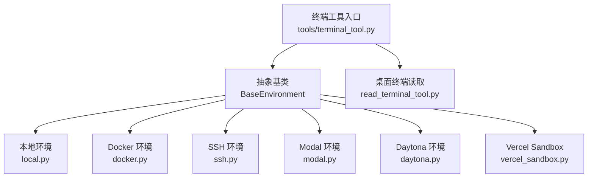
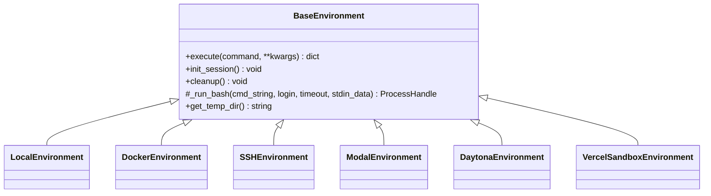
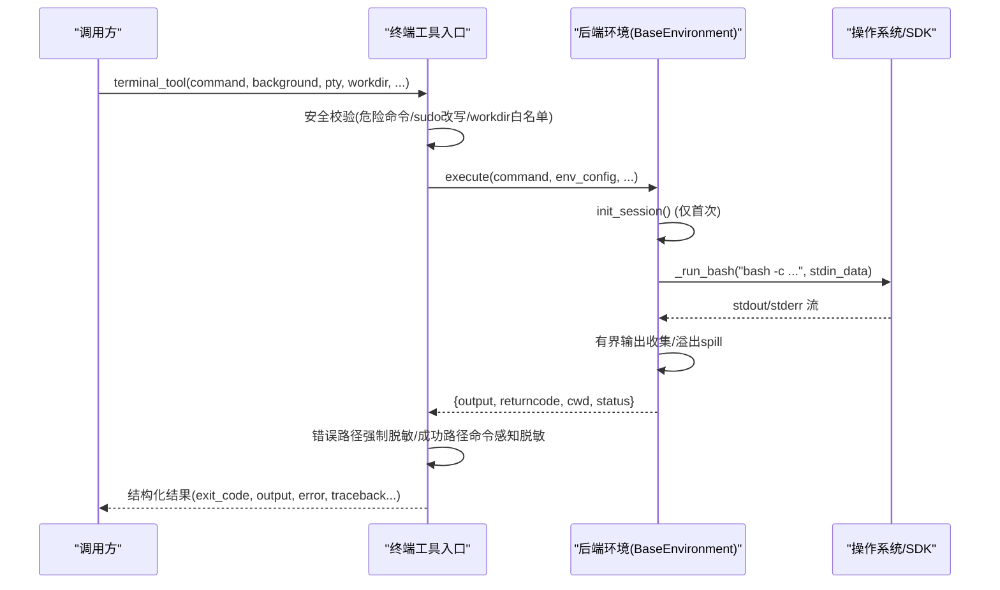
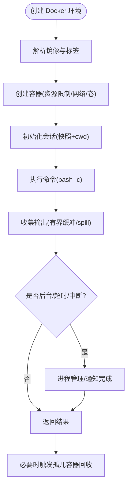
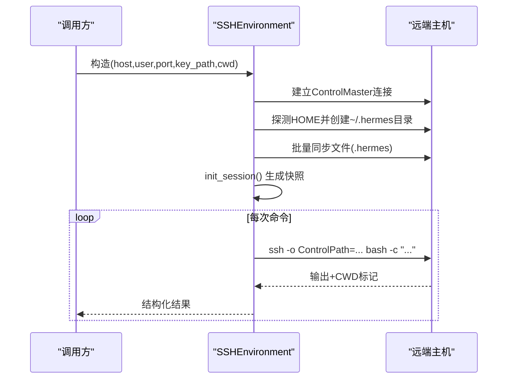
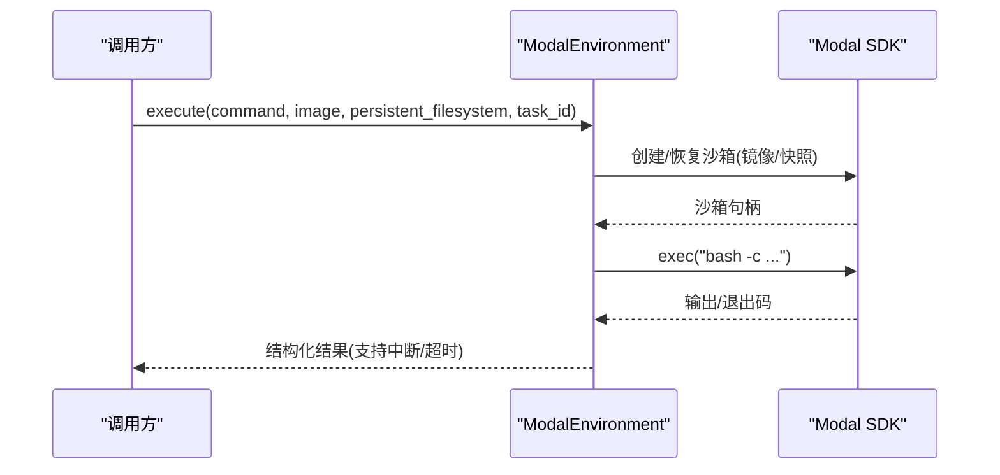
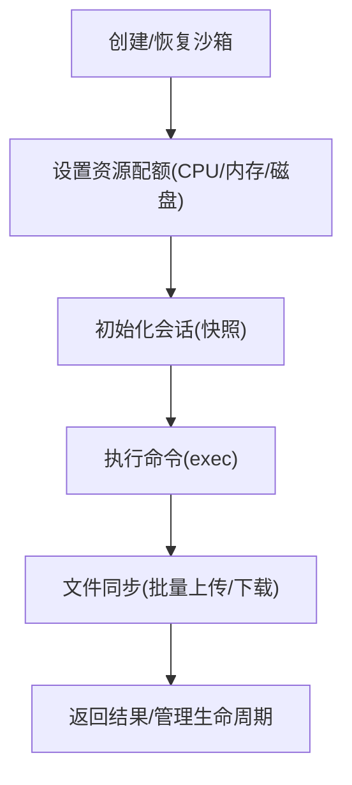
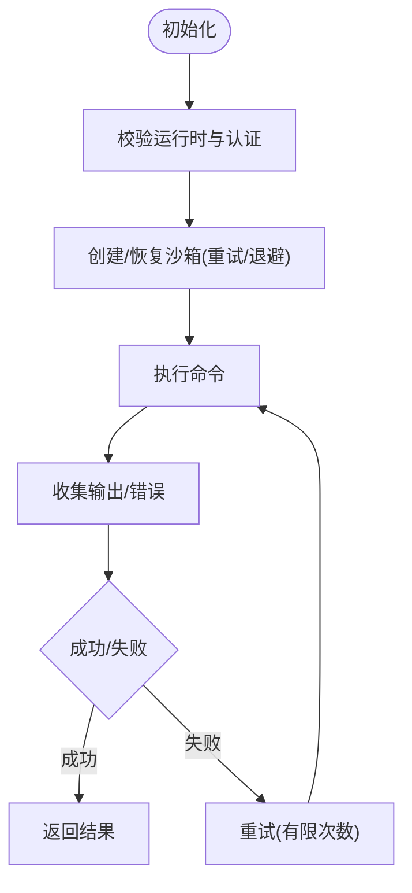
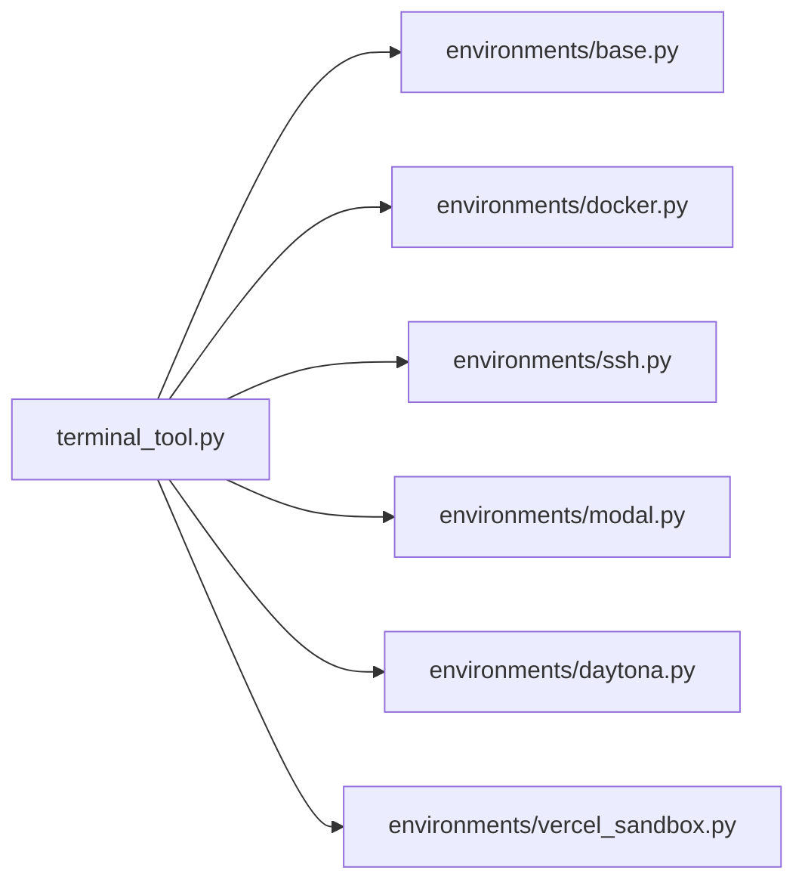

# 终端工具

<cite>
**本文引用的文件**
- [tools/terminal_tool.py](file://tools/terminal_tool.py)
- [tools/environments/base.py](file://tools/environments/base.py)
- [tools/environments/docker.py](file://tools/environments/docker.py)
- [tools/environments/modal.py](file://tools/environments/modal.py)
- [tools/environments/ssh.py](file://tools/environments/ssh.py)
- [tools/environments/daytona.py](file://tools/environments/daytona.py)
- [tools/environments/vercel_sandbox.py](file://tools/environments/vercel_sandbox.py)
- [tools/read_terminal_tool.py](file://tools/read_terminal_tool.py)
- [tests/tools/test_terminal_error_redaction.py](file://tests/tools/test_terminal_error_redaction.py)
</cite>

## 目录
1. [简介](#简介)
2. [项目结构](#项目结构)
3. [核心组件](#核心组件)
4. [架构总览](#架构总览)
5. [详细组件分析](#详细组件分析)
6. [依赖关系分析](#依赖关系分析)
7. [性能考虑](#性能考虑)
8. [故障排除指南](#故障排除指南)
9. [结论](#结论)
10. [附录：配置与使用示例](#附录：配置与使用示例)

## 简介
本文件面向 Hermes Agent 的“终端工具”能力，系统性说明命令执行、会话管理、输出处理、错误处理、超时控制与资源管理等核心机制；并覆盖本地、Docker、SSH、Modal、Daytona、Vercel Sandbox 等后端环境的配置与使用方式。文档同时提供性能优化建议、故障排除指南以及扩展开发指导，帮助开发者快速理解并安全高效地使用终端工具。

## 项目结构
终端工具由“统一入口 + 多后端抽象 + 具体环境实现”构成：
- 统一入口：tools/terminal_tool.py，负责参数解析、安全校验、环境选择、生命周期管理、结果封装与敏感信息脱敏。
- 抽象基类：tools/environments/base.py，定义统一的执行模型（每命令一次 bash -c）、会话快照、CWD 跟踪、中断与超时、输出收集等。
- 后端实现：
  - 本地：tools/environments/local.py（通过 base 提供的通用流程）
  - Docker：tools/environments/docker.py
  - SSH：tools/environments/ssh.py
  - Modal：tools/environments/modal.py
  - Daytona：tools/environments/daytona.py
  - Vercel Sandbox：tools/environments/vercel_sandbox.py
- 桌面端读取：tools/read_terminal_tool.py，用于在桌面 GUI 中读取内置终端缓冲区内容。

**图表来源**
- [tools/terminal_tool.py:1064-1073](file://tools/terminal_tool.py#L1064-L1073)
- [tools/environments/base.py:553-619](file://tools/environments/base.py#L553-L619)

**章节来源**
- [tools/terminal_tool.py:1-35](file://tools/terminal_tool.py#L1-L35)
- [tools/environments/base.py:1-8](file://tools/environments/base.py#L1-L8)

## 核心组件
- 命令执行与安全校验
  - 危险命令检测与审批：通过统一守卫函数进行命令白名单/黑名单检查，支持 CLI 交互审批回调。
  - sudo 增强：自动改写真实 sudo 调用为交互式或无密码模式，支持缓存与失败回退。
  - 工作目录安全：对 workdir 做字符级白名单校验，防止注入。
- 会话与状态
  - 会话快照：初始化时捕获登录 shell 环境（变量、函数、别名），后续命令复用，避免重复加载开销。
  - CWD 跟踪：通过内带标记或临时文件记录当前工作目录，跨命令持久化。
  - 任务级覆盖：允许按 task_id 注册镜像/CWD 等覆盖，隔离不同任务。
- 输出与缓冲
  - 有界输出收集器：保留头部与尾部片段，溢出时写 spill 文件，避免内存膨胀。
  - 命令感知脱敏：成功输出可走命令感知的脱敏管线；错误路径强制脱敏。
- 超时与中断
  - 前台命令超时上限可通过环境变量限制；后台任务支持进程管理与通知完成。
  - 全局中断事件：可在执行期间立即终止长耗时子进程。
- 资源清理
  - Docker 孤儿容器回收：进程异常退出后清理残留容器。
  - 磁盘用量告警：定期扫描 scratch 目录，超过阈值提示清理。

**章节来源**
- [tools/terminal_tool.py:348-420](file://tools/terminal_tool.py#L348-L420)
- [tools/terminal_tool.py:665-783](file://tools/terminal_tool.py#L665-L783)
- [tools/terminal_tool.py:976-1062](file://tools/terminal_tool.py#L976-L1062)
- [tools/environments/base.py:81-231](file://tools/environments/base.py#L81-L231)
- [tools/environments/base.py:660-782](file://tools/environments/base.py#L660-L782)
- [tools/terminal_tool.py:1104-1167](file://tools/terminal_tool.py#L1104-L1167)
- [tools/terminal_tool.py:205-243](file://tools/terminal_tool.py#L205-L243)

## 架构总览
终端工具采用“统一入口 + 多后端”的插件式架构。所有后端继承 BaseEnvironment，实现 _run_bash() 和 cleanup()，并通过 execute() 统一处理快照、CWD、超时、中断与输出收集。

**图表来源**
- [tools/environments/base.py:553-619](file://tools/environments/base.py#L553-L619)
- [tools/environments/docker.py:1-200](file://tools/environments/docker.py#L1-L200)
- [tools/environments/ssh.py:40-86](file://tools/environments/ssh.py#L40-L86)
- [tools/environments/modal.py:164-200](file://tools/environments/modal.py#L164-L200)
- [tools/environments/daytona.py:30-152](file://tools/environments/daytona.py#L30-L152)
- [tools/environments/vercel_sandbox.py:1-200](file://tools/environments/vercel_sandbox.py#L1-L200)

## 详细组件分析

### 终端工具入口（命令执行、会话管理、输出与错误处理）
- 功能要点
  - 环境选择：根据 TERMINAL_ENV 与配置桥接决定后端类型。
  - 安全校验：危险命令检测、sudo 改写、workdir 白名单校验。
  - 会话快照：首次执行时生成快照，后续命令 source 快照提升性能。
  - 输出收集：有界缓冲 + spill 文件，避免大输出导致内存压力。
  - 错误处理：错误路径强制脱敏，避免泄露密钥；支持降级与重试提示。
  - 后台任务：返回 session_id，配合 process(action="poll"/"wait") 管理。
- 关键流程（序列图）

**图表来源**
- [tools/terminal_tool.py:348-420](file://tools/terminal_tool.py#L348-L420)
- [tools/terminal_tool.py:976-1062](file://tools/terminal_tool.py#L976-L1062)
- [tools/environments/base.py:660-782](file://tools/environments/base.py#L660-L782)
- [tools/environments/base.py:81-231](file://tools/environments/base.py#L81-L231)

**章节来源**
- [tools/terminal_tool.py:1076-1086](file://tools/terminal_tool.py#L1076-L1086)
- [tools/terminal_tool.py:1453-1583](file://tools/terminal_tool.py#L1453-L1583)
- [tests/tools/test_terminal_error_redaction.py:47-154](file://tests/tools/test_terminal_error_redaction.py#L47-L154)

### Docker 后端（隔离执行、资源限制、持久化与清理）
- 功能要点
  - 安全加固：cap-drop ALL、no-new-privileges、PID 限制。
  - 资源配置：CPU、内存、磁盘（MB）可调；共享内存大小可调。
  - 文件系统：可选 bind mount 宿主目录到 /workspace；支持跨进程容器复用。
  - 孤儿清理：启动时扫描并清理遗留 hermes-tagged Exited 容器。
- 典型流程（流程图）

**图表来源**
- [tools/environments/docker.py:1-200](file://tools/environments/docker.py#L1-L200)
- [tools/terminal_tool.py:1104-1167](file://tools/terminal_tool.py#L1104-L1167)

**章节来源**
- [tools/environments/docker.py:1-200](file://tools/environments/docker.py#L1-L200)
- [tools/terminal_tool.py:1453-1583](file://tools/terminal_tool.py#L1453-L1583)

### SSH 后端（远程执行、连接复用、文件同步）
- 功能要点
  - ControlMaster 复用连接，减少握手开销。
  - 自动探测远程 HOME，建立 ~/.hermes 目录树并同步技能/凭据/缓存。
  - 通过 FileSyncManager 批量上传/下载，提升效率。
- 关键流程（序列图）

**图表来源**
- [tools/environments/ssh.py:40-86](file://tools/environments/ssh.py#L40-L86)
- [tools/environments/ssh.py:87-154](file://tools/environments/ssh.py#L87-L154)

**章节来源**
- [tools/environments/ssh.py:1-200](file://tools/environments/ssh.py#L1-L200)

### Modal 后端（云端沙箱、异步执行、快照恢复）
- 功能要点
  - 基于原生 Modal SDK，使用 Sandbox.create/exec 执行命令。
  - 异步执行通过 _ThreadedProcessHandle 适配，支持 cancel_fn 中断。
  - 支持持久化文件系统，按 task_id 恢复快照，加速冷启动。
- 关键流程（序列图）

**图表来源**
- [tools/environments/modal.py:164-200](file://tools/environments/modal.py#L164-L200)
- [tools/environments/modal.py:1-200](file://tools/environments/modal.py#L1-L200)

**章节来源**
- [tools/environments/modal.py:1-200](file://tools/environments/modal.py#L1-L200)

### Daytona 后端（云沙箱、资源配额、持久化）
- 功能要点
  - 通过 Daytona SDK 创建/恢复沙箱，支持 CPU/内存/磁盘配额。
  - 支持持久化文件系统，停止后下次恢复。
  - 批量文件传输优化，减少 HTTP/TLS 开销。
- 关键流程（流程图）

**图表来源**
- [tools/environments/daytona.py:30-152](file://tools/environments/daytona.py#L30-L152)

**章节来源**
- [tools/environments/daytona.py:1-200](file://tools/environments/daytona.py#L1-L200)

### Vercel Sandbox 后端（云端沙箱、运行时约束、重试策略）
- 功能要点
  - 使用 Vercel Python SDK 运行命令，默认关闭遥测。
  - 支持最小超时与运行等待策略，具备重试与退避逻辑。
  - 支持持久化快照存储，按 task_id 恢复。
- 关键流程（流程图）

**图表来源**
- [tools/environments/vercel_sandbox.py:1-200](file://tools/environments/vercel_sandbox.py#L1-L200)

**章节来源**
- [tools/environments/vercel_sandbox.py:1-200](file://tools/environments/vercel_sandbox.py#L1-L200)

### 桌面端终端读取（GUI 集成）
- 功能要点
  - 通过 gateway 阻塞提示桥读取 xterm.js 缓冲区内容。
  - 支持分页读取（start_line/count），返回 JSON 格式。
- 使用场景
  - 在桌面应用中查看嵌入式终端输出，便于调试与展示。

**章节来源**
- [tools/read_terminal_tool.py:1-90](file://tools/read_terminal_tool.py#L1-L90)

## 依赖关系分析
- 模块耦合
  - terminal_tool.py 依赖各后端实现与环境基类，解耦良好。
  - 各后端均依赖 base.py 的统一执行模型，降低重复代码。
- 外部依赖
  - Docker、SSH、Modal、Daytona、Vercel SDK 按需懒加载，避免导入期失败影响整体。
- 潜在循环依赖
  - 通过延迟 import 与接口抽象避免循环引用。

**图表来源**
- [tools/terminal_tool.py:1064-1073](file://tools/terminal_tool.py#L1064-L1073)
- [tools/environments/base.py:553-619](file://tools/environments/base.py#L553-L619)

**章节来源**
- [tools/terminal_tool.py:1064-1073](file://tools/terminal_tool.py#L1064-L1073)

## 性能考虑
- 会话快照复用：避免每次命令重新加载登录 shell，显著降低冷启动开销。
- 有界输出收集：防止大输出占用内存；溢出时写入 spill 文件，保证可恢复性。
- 批量文件传输：SSH/Docker/Modal/Daytona/Vercel 均利用批量上传/下载减少网络开销。
- 连接复用：SSH ControlMaster 复用连接，减少握手成本。
- 资源限制：Docker/Modal/Daytona 支持 CPU/内存/磁盘配额，避免资源争用。
- 磁盘用量告警：定期扫描 scratch 目录，超阈值提示清理，避免磁盘耗尽。

[本节为通用性能建议，不直接分析具体文件]

## 故障排除指南
- 常见错误与处理
  - 后端不可达（SSH/Docker/Modal/Daytona/Vercel）：抛出 EnvironmentConnectionError，附带重试提示；终端工具将其转为结构化“degraded”状态，便于重试。
  - sudo 认证失败：自动清除缓存密码，提示用户重新输入或跳过。
  - 危险命令被拦截：依据守卫策略拒绝执行，需调整命令或申请审批。
  - 输出过大：启用 spill 文件，避免内存溢出；必要时调整输出限制。
  - 超时/中断：前台命令受最大超时限制；后台任务可通过 process 管理。
- 诊断步骤
  - 检查环境变量与配置桥接是否正确（TERMINAL_*）。
  - 确认后端依赖可用（docker/ssh/modal/daytona/vercel SDK）。
  - 查看日志中的警告与错误信息，定位具体后端问题。
  - 对于 Vercel/Modal/Daytona，关注重试与退避日志，判断是否为瞬态错误。

**章节来源**
- [tools/environments/base.py:55-79](file://tools/environments/base.py#L55-L79)
- [tools/terminal_tool.py:423-483](file://tools/terminal_tool.py#L423-L483)
- [tests/tools/test_terminal_error_redaction.py:47-154](file://tests/tools/test_terminal_error_redaction.py#L47-L154)

## 结论
Hermes 终端工具通过统一抽象与多后端实现，提供了安全、可靠、高性能的命令执行能力。其会话快照、有界输出、sudo 增强、资源限制与清理机制，确保了在不同环境下的稳定运行。结合配置桥接与懒加载策略，既保证了易用性，又降低了依赖风险。开发者可基于此架构扩展新的后端或增强现有功能。

[本节为总结性内容，不直接分析具体文件]

## 附录：配置与使用示例
- 环境变量与配置键（部分）
  - TERMINAL_ENV：选择后端（local/docker/ssh/modal/daytona/vercel_sandbox）
  - TERMINAL_TIMEOUT：前台命令超时（秒）
  - TERMINAL_LIFETIME_SECONDS：容器/沙箱空闲回收时间（秒）
  - TERMINAL_CWD：工作目录（容器后端需绝对路径）
  - TERMINAL_DOCKER_*：Docker 相关配置（镜像、卷、环境变量、额外参数、共享内存等）
  - TERMINAL_SSH_*：SSH 相关配置（主机、用户、端口、密钥）
  - TERMINAL_MODAL_* / TERMINAL_DAYTONA_* / TERMINAL_VERCEL_RUNTIME：对应后端配置
- 使用示例（描述性）
  - 本地执行：设置 TERMINAL_ENV=local，直接执行命令，适合开发与调试。
  - Docker 隔离：设置 TERMINAL_ENV=docker，指定镜像与资源限制，适合构建与测试。
  - 远程执行：设置 TERMINAL_ENV=ssh，配置主机与密钥，适合远程服务器操作。
  - 云端沙箱：设置 TERMINAL_ENV=modal/daytona/vercel_sandbox，配置认证与镜像，适合云环境执行。
- 最佳实践
  - 优先使用后台任务管理长期进程，避免阻塞。
  - 合理设置超时与资源限制，避免资源耗尽。
  - 使用会话快照与 CWD 跟踪，减少重复配置。
  - 注意敏感信息脱敏，避免泄露密钥。

[本节为通用配置与实践建议，不直接分析具体文件]