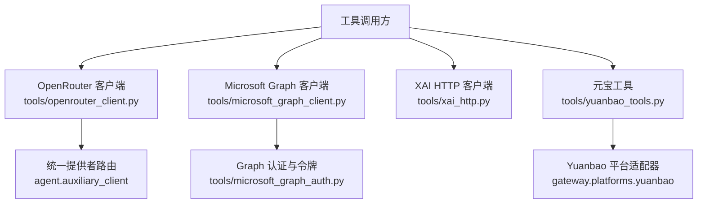
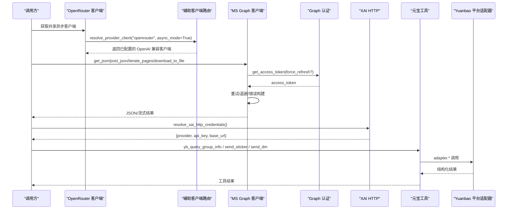
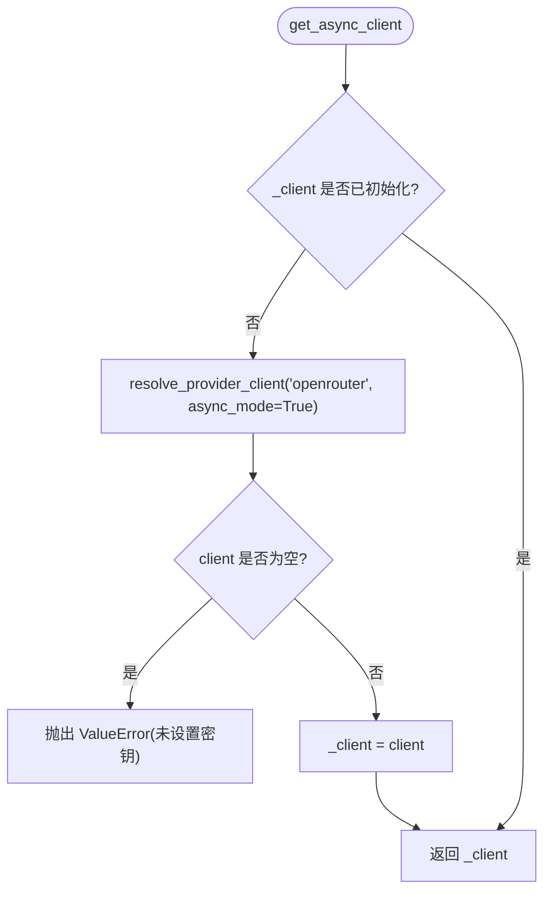
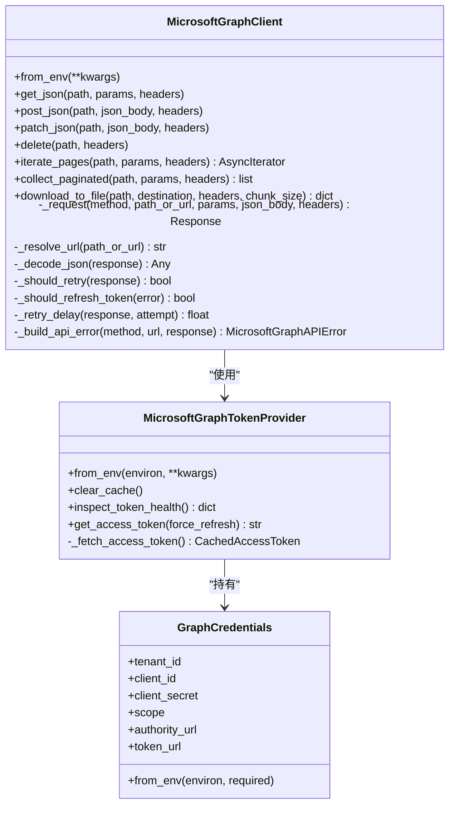
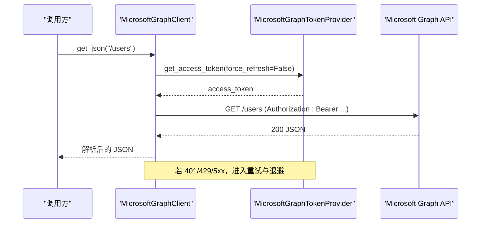
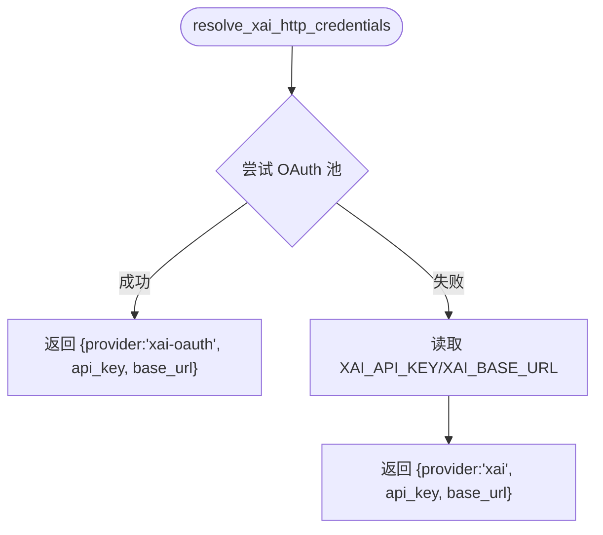
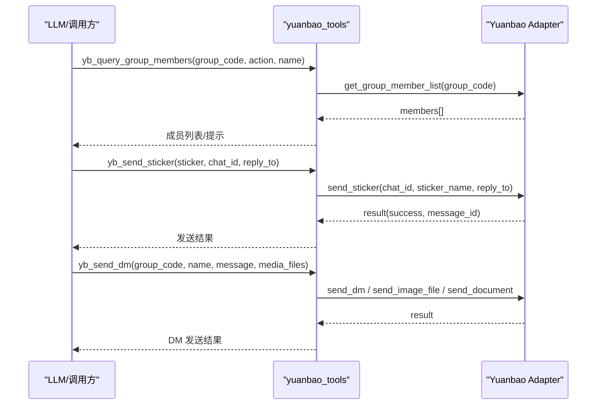
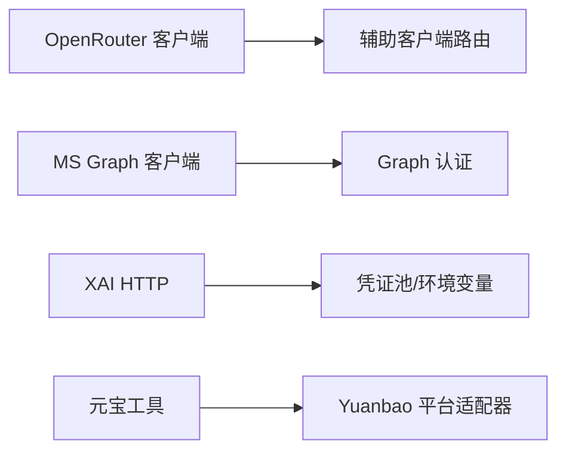

# API 客户端

<cite>
**本文引用的文件**
- [tools/openrouter_client.py](file://tools/openrouter_client.py)
- [tools/microsoft_graph_client.py](file://tools/microsoft_graph_client.py)
- [tools/microsoft_graph_auth.py](file://tools/microsoft_graph_auth.py)
- [tools/xai_http.py](file://tools/xai_http.py)
- [tools/yuanbao_tools.py](file://tools/yuanbao_tools.py)
- [cli-config.yaml.example](file://cli-config.yaml.example)
</cite>

## 目录
1. [简介](#简介)
2. [项目结构](#项目结构)
3. [核心组件](#核心组件)
4. [架构总览](#架构总览)
5. [详细组件分析](#详细组件分析)
6. [依赖关系分析](#依赖关系分析)
7. [性能与连接池](#性能与连接池)
8. [故障排查指南](#故障排查指南)
9. [结论](#结论)
10. [附录：配置与示例](#附录：配置与示例)

## 简介
本文件面向 Hermes Agent 内置的 API 客户端工具，系统性说明以下能力：
- OpenRouter 客户端：通过统一代理路由到多模型提供商，支持请求转发、响应处理与缓存。
- Microsoft Graph 客户端：基于应用身份（App-only）获取访问令牌，封装 REST 调用、分页、重试与下载流式写入。
- XAI HTTP 客户端：直接对接 xAI 推理/媒体接口，提供凭据解析、默认头、存储选项等。
- 元宝工具：在 Yuanbao 平台上下文中，提供群信息、成员查询、贴纸搜索与发送、私聊消息等工具。

文档同时给出连接池、重试机制与性能调优建议，并提供可落地的配置与调用路径指引。

## 项目结构
Hermes Agent 将第三方服务集成以“工具/客户端”形式组织在 tools 目录下，配合配置与认证模块形成完整链路：
- OpenRouter 客户端：tools/openrouter_client.py，复用 agent.auxiliary_client 的统一提供者路由。
- Microsoft Graph：tools/microsoft_graph_client.py + tools/microsoft_graph_auth.py，实现令牌获取、HTTP 调用与错误处理。
- XAI HTTP：tools/xai_http.py，负责凭据解析、默认头、存储 TTL 等。
- 元宝工具：tools/yuanbao_tools.py，注册工具集并调用平台适配器。
- 配置：cli-config.yaml.example，包含 OpenRouter 路由、响应缓存、超时等全局设置。

图表来源
- [tools/openrouter_client.py:14-28](file://tools/openrouter_client.py#L14-L28)
- [tools/microsoft_graph_client.py:46-72](file://tools/microsoft_graph_client.py#L46-L72)
- [tools/microsoft_graph_auth.py:104-165](file://tools/microsoft_graph_auth.py#L104-L165)
- [tools/xai_http.py:257-329](file://tools/xai_http.py#L257-L329)
- [tools/yuanbao_tools.py:28-34](file://tools/yuanbao_tools.py#L28-L34)

章节来源
- [tools/openrouter_client.py:1-48](file://tools/openrouter_client.py#L1-L48)
- [tools/microsoft_graph_client.py:1-401](file://tools/microsoft_graph_client.py#L1-L401)
- [tools/microsoft_graph_auth.py:1-246](file://tools/microsoft_graph_auth.py#L1-L246)
- [tools/xai_http.py:1-330](file://tools/xai_http.py#L1-L330)
- [tools/yuanbao_tools.py:1-738](file://tools/yuanbao_tools.py#L1-L738)
- [cli-config.yaml.example:159-196](file://cli-config.yaml.example#L159-L196)

## 核心组件
- OpenRouter 客户端：懒加载共享异步客户端，通过 provider 路由统一鉴权与格式；提供密钥存在性检查。
- Microsoft Graph 客户端：封装 GET/POST/PATCH/DELETE、分页迭代、大文件流式下载；内置重试与退避策略。
- Microsoft Graph 认证：应用身份凭据读取、令牌获取与缓存、过期判断与健康检查。
- XAI HTTP 客户端：凭据解析（OAuth 或 API Key）、默认 User-Agent、存储 TTL 配置与提示。
- 元宝工具：群组信息查询、成员列表、贴纸搜索与发送、DM 私聊（含媒体附件）。

章节来源
- [tools/openrouter_client.py:14-48](file://tools/openrouter_client.py#L14-L48)
- [tools/microsoft_graph_client.py:46-154](file://tools/microsoft_graph_client.py#L46-L154)
- [tools/microsoft_graph_auth.py:31-165](file://tools/microsoft_graph_auth.py#L31-L165)
- [tools/xai_http.py:16-111](file://tools/xai_http.py#L16-L111)
- [tools/yuanbao_tools.py:53-169](file://tools/yuanbao_tools.py#L53-L169)

## 架构总览
下图展示各客户端与认证、配置、平台的交互关系及数据流向。

图表来源
- [tools/openrouter_client.py:14-28](file://tools/openrouter_client.py#L14-L28)
- [tools/microsoft_graph_client.py:74-154](file://tools/microsoft_graph_client.py#L74-L154)
- [tools/microsoft_graph_auth.py:149-165](file://tools/microsoft_graph_auth.py#L149-L165)
- [tools/xai_http.py:257-329](file://tools/xai_http.py#L257-L329)
- [tools/yuanbao_tools.py:53-169](file://tools/yuanbao_tools.py#L53-L169)

## 详细组件分析

### OpenRouter 客户端
- 懒加载共享客户端：首次调用时通过统一提供者路由创建并缓存，后续复用。
- 鉴权与格式：由 agent.auxiliary_client 集中管理，保证跨工具一致。
- 密钥检测：支持按作用域读取密钥，回退到环境变量。

图表来源
- [tools/openrouter_client.py:14-28](file://tools/openrouter_client.py#L14-L28)

章节来源
- [tools/openrouter_client.py:14-48](file://tools/openrouter_client.py#L14-L48)

### Microsoft Graph 客户端
- 功能：GET/POST/PATCH/DELETE、分页迭代、批量收集、大文件流式下载。
- 认证：通过 MicrosoftGraphTokenProvider 获取并缓存访问令牌，支持强制刷新。
- 重试与退避：对网络异常、429/5xx、401 进行指数退避与重试；支持 Retry-After 解析。
- 错误：构造 MicrosoftGraphAPIError，携带状态码、方法、URL、消息与负载。

图表来源
- [tools/microsoft_graph_client.py:46-154](file://tools/microsoft_graph_client.py#L46-L154)
- [tools/microsoft_graph_auth.py:31-165](file://tools/microsoft_graph_auth.py#L31-L165)

图表来源
- [tools/microsoft_graph_client.py:74-115](file://tools/microsoft_graph_client.py#L74-L115)
- [tools/microsoft_graph_client.py:260-330](file://tools/microsoft_graph_client.py#L260-L330)
- [tools/microsoft_graph_auth.py:149-165](file://tools/microsoft_graph_auth.py#L149-L165)

章节来源
- [tools/microsoft_graph_client.py:46-401](file://tools/microsoft_graph_client.py#L46-L401)
- [tools/microsoft_graph_auth.py:31-246](file://tools/microsoft_graph_auth.py#L31-L246)

### XAI HTTP 客户端
- 凭据解析：优先从 OAuth 池选择并刷新，其次回退到环境变量；支持自定义 base_url。
- 默认头：为 OpenAI SDK 和原始 HTTP 调用注入稳定 User-Agent。
- 存储选项：为图像/视频生成提供 storage_options，控制公开 URL 与过期时间。
- 可用性探测：快速检查是否存在可用凭据，避免热路径中的磁盘锁或网络刷新。

图表来源
- [tools/xai_http.py:257-329](file://tools/xai_http.py#L257-L329)

章节来源
- [tools/xai_http.py:16-111](file://tools/xai_http.py#L16-L111)
- [tools/xai_http.py:165-235](file://tools/xai_http.py#L165-L235)
- [tools/xai_http.py:257-329](file://tools/xai_http.py#L257-L329)

### 元宝工具
- 工具集：yb_query_group_info、yb_query_group_members、yb_search_sticker、yb_send_sticker、yb_send_dm。
- 适配器：通过 gateway.platforms.yuanbao 的 active adapter 执行实际平台调用。
- 工作流：先查询成员/贴纸，再执行发送；DM 支持文本与媒体附件（图片/文档）。

图表来源
- [tools/yuanbao_tools.py:53-169](file://tools/yuanbao_tools.py#L53-L169)
- [tools/yuanbao_tools.py:208-283](file://tools/yuanbao_tools.py#L208-L283)
- [tools/yuanbao_tools.py:290-410](file://tools/yuanbao_tools.py#L290-L410)

章节来源
- [tools/yuanbao_tools.py:53-738](file://tools/yuanbao_tools.py#L53-L738)

## 依赖关系分析
- OpenRouter 客户端依赖统一提供者路由，确保鉴权与请求格式一致性。
- Microsoft Graph 客户端强依赖认证模块获取令牌，并在请求中注入 Authorization。
- XAI HTTP 客户端依赖凭证池与环境变量，提供稳定的默认头与存储配置。
- 元宝工具依赖平台适配器，解耦具体平台实现。

图表来源
- [tools/openrouter_client.py:14-28](file://tools/openrouter_client.py#L14-L28)
- [tools/microsoft_graph_client.py:46-72](file://tools/microsoft_graph_client.py#L46-L72)
- [tools/microsoft_graph_auth.py:104-165](file://tools/microsoft_graph_auth.py#L104-L165)
- [tools/xai_http.py:257-329](file://tools/xai_http.py#L257-L329)
- [tools/yuanbao_tools.py:28-34](file://tools/yuanbao_tools.py#L28-L34)

章节来源
- [tools/openrouter_client.py:14-48](file://tools/openrouter_client.py#L14-L48)
- [tools/microsoft_graph_client.py:46-154](file://tools/microsoft_graph_client.py#L46-L154)
- [tools/microsoft_graph_auth.py:104-165](file://tools/microsoft_graph_auth.py#L104-L165)
- [tools/xai_http.py:257-329](file://tools/xai_http.py#L257-L329)
- [tools/yuanbao_tools.py:28-34](file://tools/yuanbao_tools.py#L28-L34)

## 性能与连接池
- 连接复用：Microsoft Graph 客户端每次请求新建 httpx.AsyncClient，适合短生命周期任务；如需高并发场景，可在上层复用传输或连接池。
- 重试与退避：
  - 网络异常、429、5xx 自动重试；401 触发令牌清理与刷新。
  - 退避策略：优先使用 Retry-After，否则指数退避上限 8 秒。
- 流式下载：大文件分块写入临时文件，成功后原子替换，避免内存峰值。
- OpenRouter 路由与缓存：
  - 可通过配置启用响应缓存与 TTL，降低重复请求成本。
  - 支持按价格/吞吐/延迟排序与白名单/黑名单过滤。
- XAI 存储选项：可配置公开 URL 与过期时间，减少 CDN 链接失效问题。

章节来源
- [tools/microsoft_graph_client.py:156-258](file://tools/microsoft_graph_client.py#L156-L258)
- [tools/microsoft_graph_client.py:260-330](file://tools/microsoft_graph_client.py#L260-L330)
- [cli-config.yaml.example:159-196](file://cli-config.yaml.example#L159-L196)
- [tools/xai_http.py:165-235](file://tools/xai_http.py#L165-L235)

## 故障排查指南
- OpenRouter 客户端
  - 现象：未设置密钥时报错。
  - 处理：确保 OPENROUTER_API_KEY 存在或通过作用域密钥源提供；使用 check_api_key 快速验证。
- Microsoft Graph 客户端
  - 现象：401/429/5xx 或 JSON 解析失败。
  - 处理：检查令牌有效期与作用域；观察重试次数与退避；确认响应体是否有效 JSON。
- XAI HTTP 客户端
  - 现象：凭据不可用或 base_url 不合法。
  - 处理：优先配置 OAuth 池，其次设置 XAI_API_KEY/XAI_BASE_URL；校验 base_url 格式。
- 元宝工具
  - 现象：适配器未连接或会话上下文缺失。
  - 处理：确认运行于 Yuanbao 平台会话；检查 HERMES_SESSION_CHAT_ID 与 group_code；必要时先调用成员查询定位目标用户。

章节来源
- [tools/openrouter_client.py:31-48](file://tools/openrouter_client.py#L31-L48)
- [tools/microsoft_graph_client.py:19-44](file://tools/microsoft_graph_client.py#L19-L44)
- [tools/microsoft_graph_client.py:338-401](file://tools/microsoft_graph_client.py#L338-L401)
- [tools/xai_http.py:16-77](file://tools/xai_http.py#L16-L77)
- [tools/yuanbao_tools.py:53-80](file://tools/yuanbao_tools.py#L53-L80)

## 结论
Hermes Agent 的 API 客户端以模块化方式整合了 OpenRouter、Microsoft Graph、XAI 与 Yuanbao 等平台能力：
- 通过统一路由与认证抽象，简化多后端接入。
- 提供健壮的重试、退避与错误处理，保障稳定性。
- 结合配置项与存储选项，优化成本与用户体验。
在实际使用中，建议根据业务需求调整重试策略、超时与缓存参数，并结合监控指标持续调优。

## 附录：配置与示例

### OpenRouter 配置要点
- 模型路由：通过 provider_routing 控制排序、白名单/黑名单与参数要求。
- 响应缓存：开启 response_cache 与设置 TTL，提升重复请求性能。
- 参考位置：cli-config.yaml.example 中的 OpenRouter 相关段落。

章节来源
- [cli-config.yaml.example:159-196](file://cli-config.yaml.example#L159-L196)

### Microsoft Graph 调用示例（步骤）
- 初始化：from_env 获取凭据并构造客户端。
- 获取令牌：get_access_token，必要时 force_refresh。
- 发起请求：get_json/post_json/patch_json/delete，或使用 iterate_pages/collect_paginated。
- 下载大文件：download_to_file，流式写入本地文件。

章节来源
- [tools/microsoft_graph_client.py:68-154](file://tools/microsoft_graph_client.py#L68-L154)
- [tools/microsoft_graph_auth.py:122-165](file://tools/microsoft_graph_auth.py#L122-L165)

### XAI HTTP 调用示例（步骤）
- 解析凭据：resolve_xai_http_credentials，获取 provider/api_key/base_url。
- 设置默认头：hermes_xai_default_headers，用于 OpenAI SDK 或原始 HTTP。
- 存储选项：build_xai_storage_options，控制公开 URL 与过期时间。

章节来源
- [tools/xai_http.py:95-111](file://tools/xai_http.py#L95-L111)
- [tools/xai_http.py:196-217](file://tools/xai_http.py#L196-L217)
- [tools/xai_http.py:257-329](file://tools/xai_http.py#L257-L329)

### 元宝工具调用示例（步骤）
- 查询群信息：get_group_info(group_code)。
- 查询成员：query_group_members(group_code, action, name)，用于 @mention 或查找用户。
- 搜索贴纸：search_sticker(query, limit)，获取候选列表。
- 发送贴纸：send_sticker(sticker, chat_id, reply_to)。
- 发送私聊：send_dm(group_code, name, message, media_files)，支持图片与文档。

章节来源
- [tools/yuanbao_tools.py:53-169](file://tools/yuanbao_tools.py#L53-L169)
- [tools/yuanbao_tools.py:172-283](file://tools/yuanbao_tools.py#L172-L283)
- [tools/yuanbao_tools.py:290-410](file://tools/yuanbao_tools.py#L290-L410)