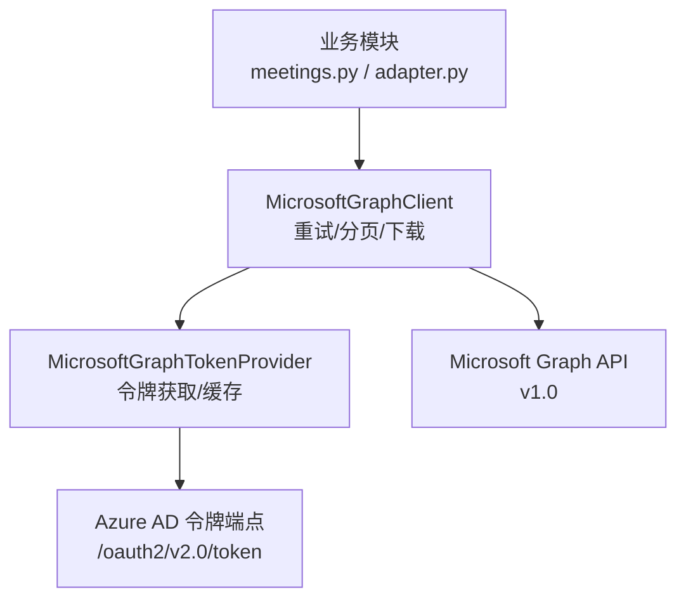
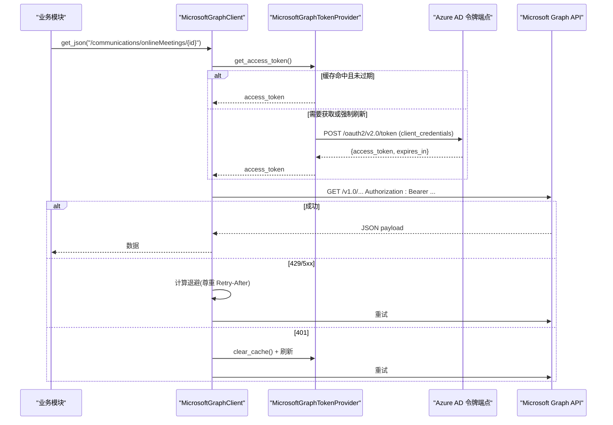
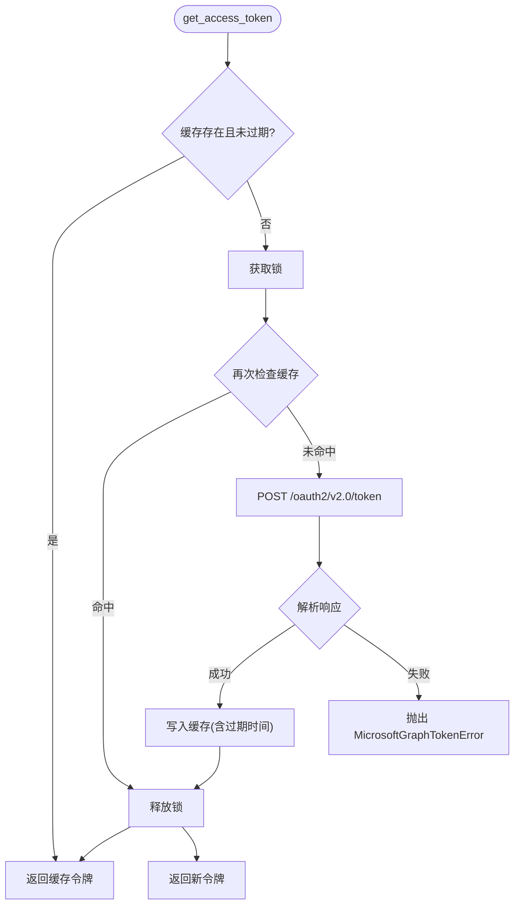
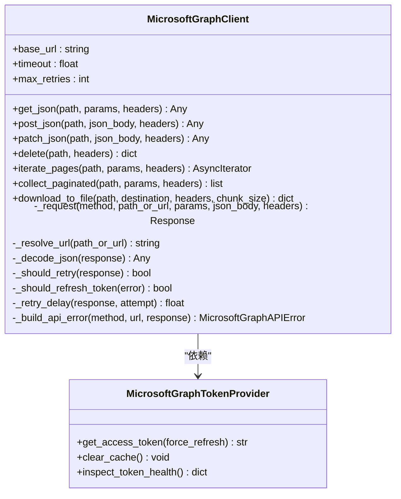
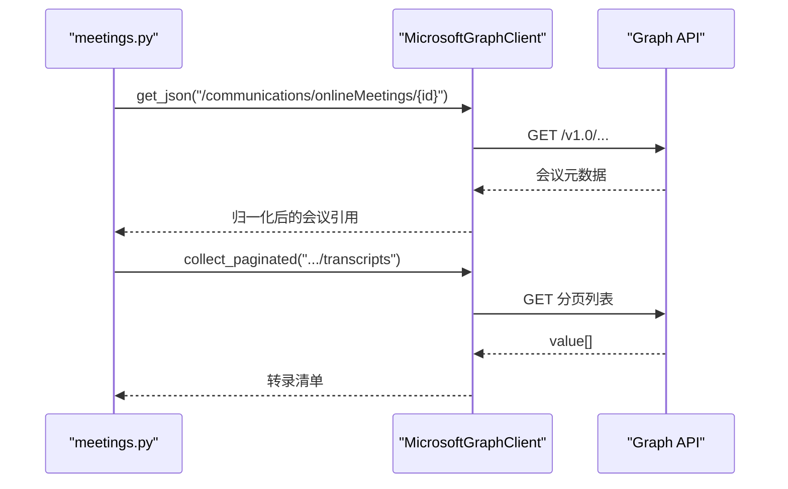
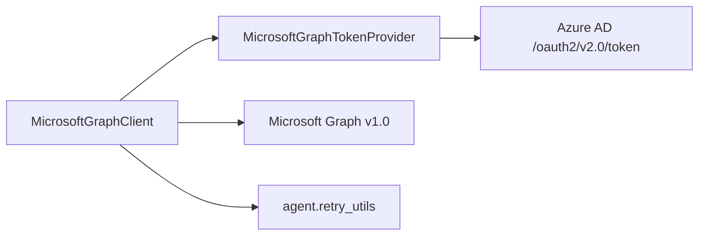

# Microsoft Graph 客户端

<cite>
**本文引用的文件**
- [tools/microsoft_graph_auth.py](file://tools/microsoft_graph_auth.py)
- [tools/microsoft_graph_client.py](file://tools/microsoft_graph_client.py)
- [website/docs/guides/microsoft-graph-app-registration.md](file://website/docs/guides/microsoft-graph-app-registration.md)
- [plugins/teams_pipeline/meetings.py](file://plugins/teams_pipeline/meetings.py)
- [plugins/platforms/teams/adapter.py](file://plugins/platforms/teams/adapter.py)
- [tests/tools/test_microsoft_graph_auth.py](file://tests/tools/test_microsoft_graph_auth.py)
- [tests/tools/test_microsoft_graph_client.py](file://tests/tools/test_microsoft_graph_client.py)
</cite>

## 目录
1. [简介](#简介)
2. [项目结构](#项目结构)
3. [核心组件](#核心组件)
4. [架构总览](#架构总览)
5. [详细组件分析](#详细组件分析)
6. [依赖关系分析](#依赖关系分析)
7. [性能与可靠性](#性能与可靠性)
8. [故障排查指南](#故障排查指南)
9. [结论](#结论)
10. [附录：权限范围与示例调用](#附录：权限范围与示例调用)

## 简介
本文件面向需要在 Hermes Agent 中集成 Microsoft Graph API 的开发者，系统性说明以下主题：
- 身份认证流程：应用凭据（client_credentials）获取访问令牌、令牌缓存与刷新策略。
- 权限范围（scopes）：如何配置与应用权限，覆盖会议、转录、录制、消息等常见场景。
- 客户端初始化：从环境变量构建凭证与客户端实例。
- 请求构造与响应处理：统一封装 GET/POST/PATCH/DELETE、分页迭代、大文件流式下载。
- 错误恢复机制：重试、退避、限流、401 自动刷新令牌、异常分类与可观测信息。
- 最佳实践：请求限流、缓存策略、异常处理、安全与最小权限原则。

## 项目结构
Microsoft Graph 相关能力集中在 tools 层，被上层插件（如 Teams Pipeline、Teams 平台适配器）复用：
- 认证与令牌管理：tools/microsoft_graph_auth.py
- REST 客户端与重试/分页：tools/microsoft_graph_client.py
- 使用示例与权限指引：website/docs/guides/microsoft-graph-app-registration.md
- 实际业务调用：plugins/teams_pipeline/meetings.py、plugins/platforms/teams/adapter.py
- 单元测试：tests/tools/test_microsoft_graph_auth.py、tests/tools/test_microsoft_graph_client.py

图表来源
- [tools/microsoft_graph_client.py:46-72](file://tools/microsoft_graph_client.py#L46-L72)
- [tools/microsoft_graph_auth.py:104-165](file://tools/microsoft_graph_auth.py#L104-L165)
- [plugins/teams_pipeline/meetings.py:137-184](file://plugins/teams_pipeline/meetings.py#L137-L184)
- [plugins/platforms/teams/adapter.py:306-322](file://plugins/platforms/teams/adapter.py#L306-L322)

章节来源
- [tools/microsoft_graph_auth.py:1-246](file://tools/microsoft_graph_auth.py#L1-L246)
- [tools/microsoft_graph_client.py:1-401](file://tools/microsoft_graph_client.py#L1-L401)
- [website/docs/guides/microsoft-graph-app-registration.md:1-181](file://website/docs/guides/microsoft-graph-app-registration.md#L1-L181)
- [plugins/teams_pipeline/meetings.py:1-200](file://plugins/teams_pipeline/meetings.py#L1-L200)
- [plugins/platforms/teams/adapter.py:300-350](file://plugins/platforms/teams/adapter.py#L300-L350)

## 核心组件
- GraphCredentials：规范化应用凭据（租户、客户端 ID、密钥、scope、authority），支持从环境变量读取并校验必填项。
- CachedAccessToken：带过期时间的访问令牌缓存对象，提供过期判断与剩余秒数。
- MicrosoftGraphTokenProvider：基于 client_credentials 流程获取并缓存访问令牌，支持并发安全、健康检查、强制刷新。
- MicrosoftGraphClient：异步 HTTP 客户端封装，内置重试、退避、限流、401 自动刷新、分页迭代与大文件流式下载。

章节来源
- [tools/microsoft_graph_auth.py:31-165](file://tools/microsoft_graph_auth.py#L31-L165)
- [tools/microsoft_graph_client.py:46-155](file://tools/microsoft_graph_client.py#L46-L155)

## 架构总览
下图展示了从业务模块到 Azure AD 与 Graph API 的完整调用链，包括令牌获取、缓存、重试与分页。

图表来源
- [tools/microsoft_graph_client.py:260-330](file://tools/microsoft_graph_client.py#L260-L330)
- [tools/microsoft_graph_auth.py:149-220](file://tools/microsoft_graph_auth.py#L149-L220)
- [plugins/teams_pipeline/meetings.py:137-184](file://plugins/teams_pipeline/meetings.py#L137-L184)

## 详细组件分析

### 认证与令牌管理（MicrosoftGraphTokenProvider）
- 输入：通过 GraphCredentials.from_env 读取 MS* 环境变量，构造 tenant_id、client_id、client_secret、scope、authority_url。
- 流程：使用 httpx 向 Azure AD 发起 client_credentials 请求，解析 access_token、token_type、expires_in，写入本地缓存。
- 并发安全：使用 asyncio.Lock 保证同一时间仅一次网络请求；双重检查避免重复拉取。
- 过期策略：默认提前 120 秒视为即将过期，避免边界抖动导致请求失败。
- 健康检查：inspect_token_health 返回当前配置与缓存状态，便于监控与诊断。

图表来源
- [tools/microsoft_graph_auth.py:149-220](file://tools/microsoft_graph_auth.py#L149-L220)

章节来源
- [tools/microsoft_graph_auth.py:31-165](file://tools/microsoft_graph_auth.py#L31-L165)
- [tests/tools/test_microsoft_graph_auth.py:44-115](file://tests/tools/test_microsoft_graph_auth.py#L44-L115)

### REST 客户端（MicrosoftGraphClient）
- 初始化：支持 from_env 直接创建；可自定义 base_url、超时、最大重试次数、User-Agent、sleep 钩子、传输层。
- 请求方法：get_json、post_json、patch_json、delete，统一在内部 _request 中组装 Authorization、Content-Type、Accept 头。
- 重试与退避：对 429、5xx 进行重试；优先读取 Retry-After 头部；否则指数退避（上限 8 秒）。
- 401 处理：自动清理令牌缓存并刷新后重试，提升容错性。
- 分页：iterate_pages 按 @odata.nextLink 迭代；collect_paginated 聚合 value 列表。
- 大文件下载：download_to_file 流式写入临时文件，完成后原子替换，支持重试与错误清理。

图表来源
- [tools/microsoft_graph_client.py:46-155](file://tools/microsoft_graph_client.py#L46-L155)
- [tools/microsoft_graph_client.py:260-401](file://tools/microsoft_graph_client.py#L260-L401)
- [tools/microsoft_graph_auth.py:104-165](file://tools/microsoft_graph_auth.py#L104-L165)

章节来源
- [tools/microsoft_graph_client.py:1-401](file://tools/microsoft_graph_client.py#L1-L401)
- [tests/tools/test_microsoft_graph_client.py:32-95](file://tests/tools/test_microsoft_graph_client.py#L32-L95)

### 业务集成示例（Teams 会议管线）
- 会议解析：根据 meeting_id 或 join_web_url 查询在线会议元数据。
- 转录与录制：列出并选择最优转录，必要时回退到录制内容。
- 错误包装：将 Graph 错误映射为领域错误（权限不足、资源不存在等）。

图表来源
- [plugins/teams_pipeline/meetings.py:137-184](file://plugins/teams_pipeline/meetings.py#L137-L184)

章节来源
- [plugins/teams_pipeline/meetings.py:1-200](file://plugins/teams_pipeline/meetings.py#L1-L200)

### 平台适配器中的客户端注入
- Teams 平台适配器在运行时按需构建 MicrosoftGraphClient：若配置中包含 access_token，则使用静态令牌提供者；否则从环境变量加载应用凭据。
- 该设计允许灵活切换用户委派令牌或应用凭据模式。

章节来源
- [plugins/platforms/teams/adapter.py:306-322](file://plugins/platforms/teams/adapter.py#L306-L322)

## 依赖关系分析
- 外部依赖：httpx（异步 HTTP）、asyncio（并发锁与睡眠钩子）。
- 内部依赖：agent.retry_utils.parse_retry_after_seconds（解析 Retry-After 头部）。
- 耦合度：
  - TokenProvider 与 Azure AD 强耦合，但通过 transport 可注入 Mock 以进行测试。
  - Client 与 TokenProvider 松耦合，可通过接口替换实现不同认证策略。
- 循环依赖：无。

图表来源
- [tools/microsoft_graph_client.py:12-13](file://tools/microsoft_graph_client.py#L12-L13)
- [tools/microsoft_graph_auth.py:11-16](file://tools/microsoft_graph_auth.py#L11-L16)

章节来源
- [tools/microsoft_graph_client.py:1-72](file://tools/microsoft_graph_client.py#L1-L72)
- [tools/microsoft_graph_auth.py:1-16](file://tools/microsoft_graph_auth.py#L1-L16)

## 性能与可靠性
- 令牌缓存：默认提前 120 秒失效，减少边界抖动导致的 401 错误。
- 并发安全：异步锁确保同一时刻仅一次令牌拉取，避免风暴。
- 重试与退避：
  - 网络异常：指数退避，上限 8 秒。
  - 限流（429）：优先遵循 Retry-After，否则退避。
  - 服务端错误（5xx）：有限重试。
  - 401：清理缓存并刷新令牌后重试一次。
- 分页与内存：iterate_pages 流式产出页面；collect_paginated 聚合列表，适合中小结果集。
- 大文件下载：流式写入磁盘，避免内存峰值；临时文件原子替换保障一致性。
- 可观测性：inspect_token_health 暴露缓存、过期、配置等信息，便于监控告警。

[本节为通用指导，不直接分析具体文件]

## 故障排查指南
- 令牌获取失败：
  - 检查环境变量是否齐全：MSGRAPH_TENANT_ID、MSGRAPH_CLIENT_ID、MSGRAPH_CLIENT_SECRET。
  - 确认 scope 与管理员同意的应用权限一致。
  - 查看 inspect_token_health 输出，确认 cached、expires_in_seconds、is_expired。
- 401/403 访问拒绝：
  - 401：可能令牌过期或被撤销，客户端会自动刷新；若仍失败，检查权限与租户配置。
  - 403：通常因缺少管理员同意或权限不足，需回到应用注册步骤添加并同意权限。
- 429 限流：
  - 客户端会尊重 Retry-After；若未设置，将指数退避。
  - 建议在上层增加节流与队列控制，避免突发流量。
- 无效 JSON 响应：
  - 客户端会抛出 MicrosoftGraphClientError；检查服务端返回或代理层拦截。
- 下载失败：
  - 关注临时文件清理与重试逻辑；检查网络稳定性与目标路径权限。

章节来源
- [tools/microsoft_graph_auth.py:18-29](file://tools/microsoft_graph_auth.py#L18-L29)
- [tools/microsoft_graph_client.py:19-43](file://tools/microsoft_graph_client.py#L19-L43)
- [website/docs/guides/microsoft-graph-app-registration.md:138-161](file://website/docs/guides/microsoft-graph-app-registration.md#L138-L161)

## 结论
Hermes 的 Microsoft Graph 客户端提供了生产可用的认证、重试、分页与下载能力，并通过清晰的错误模型与健康检查提升可维护性与可观测性。结合最小权限原则与合理的限流策略，可在 Teams 会议、邮件、日历、联系人等场景中稳定调用 Graph API。

[本节为总结，不直接分析具体文件]

## 附录：权限范围与示例调用

### 权限范围（scopes）配置与使用
- 应用凭据模式使用 .default 作为 scope，由 Azure AD 根据已同意的应用权限决定最终授权范围。
- 常见权限（需在 Azure 门户中添加并管理员同意）：
  - 会议与转录：OnlineMeetings.Read.All、OnlineMeetingTranscript.Read.All
  - 录制与通话记录：OnlineMeetingRecording.Read.All、CallRecords.Read.All
  - 消息投递：ChannelMessage.Send、Chat.ReadWrite.All
- 生产环境建议使用 Application Access Policy 限制可访问的用户范围。

章节来源
- [website/docs/guides/microsoft-graph-app-registration.md:52-87](file://website/docs/guides/microsoft-graph-app-registration.md#L52-L87)
- [website/docs/guides/microsoft-graph-app-registration.md:89-120](file://website/docs/guides/microsoft-graph-app-registration.md#L89-L120)

### 客户端初始化与基本调用
- 从环境变量初始化：
  - 使用 MicrosoftGraphClient.from_env() 或 MicrosoftGraphTokenProvider.from_env()。
- 基本请求：
  - 获取会议元数据：GET /communications/onlineMeetings/{meeting_id}
  - 列出转录：GET /communications/onlineMeetings/{meeting_id}/transcripts
  - 下载录制：GET /communications/onlineMeetings/{meeting_id}/recordings/{recording_id}/content
- 分页与聚合：
  - iterate_pages 用于逐页处理；collect_paginated 用于收集全部条目。
- 会话状态管理：
  - 令牌由 TokenProvider 内部管理；如需跨进程共享，应持久化凭据并在服务重启时重建客户端。

章节来源
- [tools/microsoft_graph_client.py:68-155](file://tools/microsoft_graph_client.py#L68-L155)
- [plugins/teams_pipeline/meetings.py:137-184](file://plugins/teams_pipeline/meetings.py#L137-L184)

### 错误恢复与最佳实践
- 重试与退避：
  - 利用内置重试逻辑；必要时在上层增加幂等与去重。
- 限流与缓存：
  - 遵循 Retry-After；对频繁读的数据（如组织单位、模板）做应用级缓存。
- 异常处理：
  - 捕获 MicrosoftGraphAPIError 与 MicrosoftGraphClientError，区分网络错误、鉴权错误与业务错误。
- 安全与最小权限：
  - 仅申请必要权限；生产环境启用 Application Access Policy 限制范围；定期轮换客户端密钥。

章节来源
- [tools/microsoft_graph_client.py:348-401](file://tools/microsoft_graph_client.py#L348-L401)
- [website/docs/guides/microsoft-graph-app-registration.md:162-171](file://website/docs/guides/microsoft-graph-app-registration.md#L162-L171)