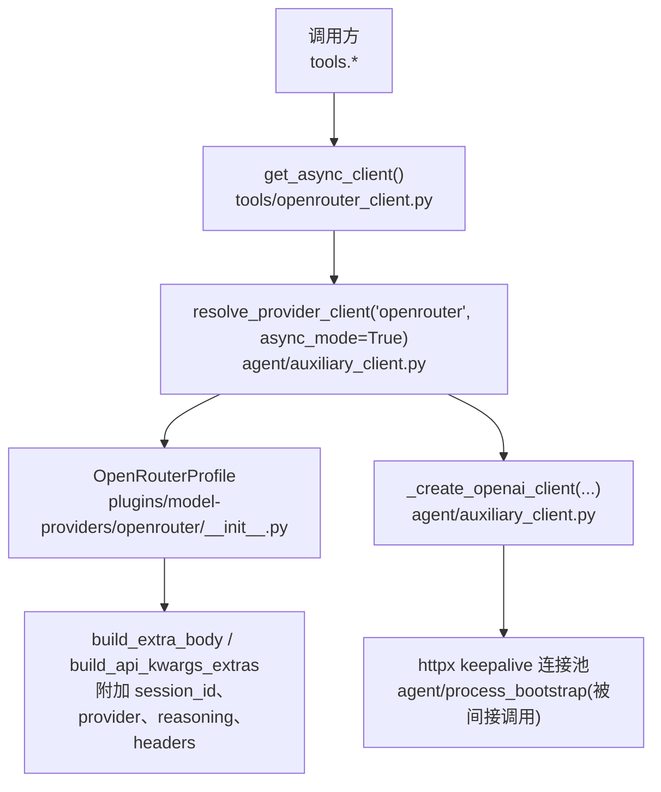
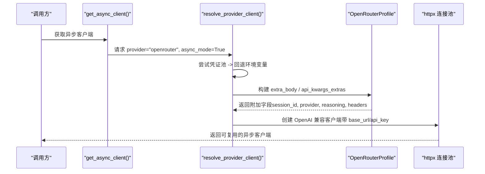
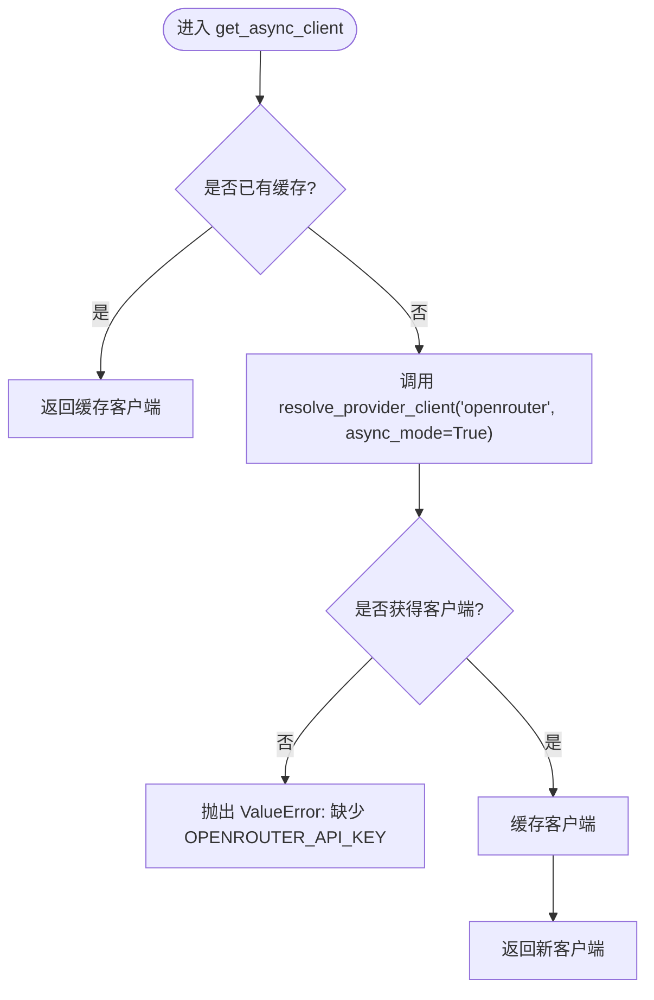
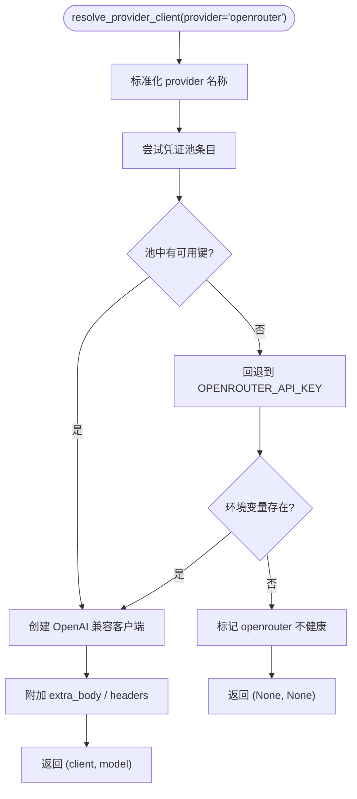
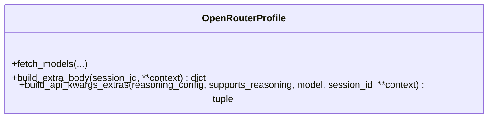
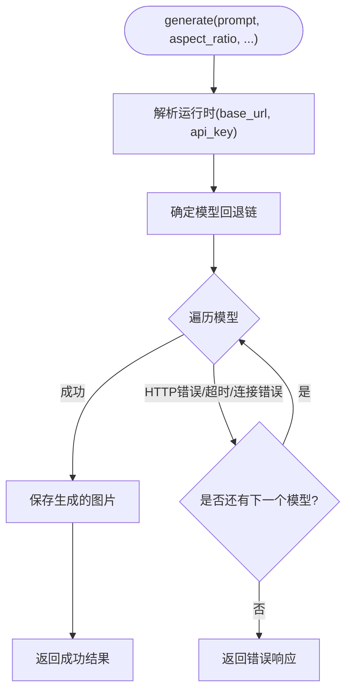
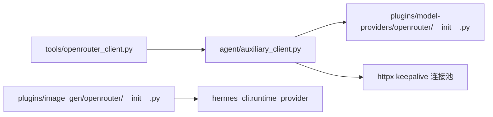

# OpenRouter 客户端

<cite>
**本文引用的文件**
- [tools/openrouter_client.py](file://tools/openrouter_client.py)
- [agent/auxiliary_client.py](file://agent/auxiliary_client.py)
- [plugins/model-providers/openrouter/__init__.py](file://plugins/model-providers/openrouter/__init__.py)
- [plugins/image_gen/openrouter/__init__.py](file://plugins/image_gen/openrouter/__init__.py)
- [agent/retry_utils.py](file://agent/retry_utils.py)
</cite>

## 目录
1. [简介](#简介)
2. [项目结构](#项目结构)
3. [核心组件](#核心组件)
4. [架构总览](#架构总览)
5. [详细组件分析](#详细组件分析)
6. [依赖关系分析](#依赖关系分析)
7. [性能考量](#性能考量)
8. [故障排查指南](#故障排查指南)
9. [结论](#结论)
10. [附录：使用示例与最佳实践](#附录使用示例与最佳实践)

## 简介
本文件面向 Hermes Agent 中的 OpenRouter API 客户端，聚焦以下目标：
- 解释懒加载机制与单例模式在 OpenRouter 客户端中的实现
- 说明如何通过集中式提供商路由器进行认证与客户端构建
- 给出 OPENROUTER_API_KEY 环境变量配置方法、密钥存在性检查逻辑与错误处理机制
- 提供获取异步客户端、验证 API 密钥和处理连接问题的完整代码示例路径
- 给出连接池管理与请求重试策略等性能优化建议

## 项目结构
OpenRouter 相关能力由多个模块协作完成：
- tools/openrouter_client.py：对外暴露的共享异步客户端入口，采用模块级单例与懒加载
- agent/auxiliary_client.py：集中式提供商路由器，负责认证、基地址、模型选择与客户端构造
- plugins/model-providers/openrouter/__init__.py：OpenRouter 提供商配置文件（别名、默认模型、额外请求体/头部）
- plugins/image_gen/openrouter/__init__.py：基于 OpenRouter 兼容端点的图像生成后端（含模型回退链与超时/重试）
- agent/retry_utils.py：通用重试工具（抖动指数退避、速率限制自适应等待）

图表来源
- [tools/openrouter_client.py:14-28](file://tools/openrouter_client.py#L14-L28)
- [agent/auxiliary_client.py:5709-5899](file://agent/auxiliary_client.py#L5709-L5899)
- [plugins/model-providers/openrouter/__init__.py:49-193](file://plugins/model-providers/openrouter/__init__.py#L49-L193)

章节来源
- [tools/openrouter_client.py:1-48](file://tools/openrouter_client.py#L1-L48)
- [agent/auxiliary_client.py:1-45](file://agent/auxiliary_client.py#L1-L45)
- [plugins/model-providers/openrouter/__init__.py:1-214](file://plugins/model-providers/openrouter/__init__.py#L1-L214)

## 核心组件
- 共享异步客户端（懒加载 + 单例）
  - 通过模块级变量缓存客户端实例，首次调用时创建并复用
  - 若未配置 OPENROUTER_API_KEY，抛出明确异常
- 集中式提供商路由器
  - 统一解析 provider、model、base_url、api_key
  - 对 OpenRouter 优先从凭证池读取，否则回退到环境变量
  - 注入 OpenRouter 特有头部与请求体（如 session_id、provider、reasoning）
- OpenRouter 提供商配置
  - 声明别名、默认模型、fallback 模型、base_url、models_url
  - 为特定模型族（如 Anthropic Claude 4.6+）调整 reasoning/verbosity 行为
  - 为 xAI Grok 附加会话粘性头以稳定后端
- 图像生成后端（可选）
  - 基于 OpenRouter 兼容端点，支持文本到图与参考图引导
  - 内置模型回退链与超时/连接错误处理

章节来源
- [tools/openrouter_client.py:14-48](file://tools/openrouter_client.py#L14-L48)
- [agent/auxiliary_client.py:2500-2527](file://agent/auxiliary_client.py#L2500-L2527)
- [plugins/model-providers/openrouter/__init__.py:49-214](file://plugins/model-providers/openrouter/__init__.py#L49-L214)
- [plugins/image_gen/openrouter/__init__.py:176-483](file://plugins/image_gen/openrouter/__init__.py#L176-L483)

## 架构总览
OpenRouter 客户端的调用链路如下：
- 调用方通过 get_async_client() 获取共享异步客户端
- 内部委托 resolve_provider_client("openrouter", async_mode=True) 完成认证与构建
- 路由器优先尝试凭证池（pool），失败则回退至环境变量 OPENROUTER_API_KEY
- 构建完成后，附加 OpenRouter 专属的请求体与头部（session_id、provider、reasoning、x-grok-conv-id 等）
- 底层通过 httpx keepalive 连接池发起请求，提升吞吐与降低延迟

图表来源
- [tools/openrouter_client.py:14-28](file://tools/openrouter_client.py#L14-L28)
- [agent/auxiliary_client.py:5709-5899](file://agent/auxiliary_client.py#L5709-L5899)
- [plugins/model-providers/openrouter/__init__.py:78-193](file://plugins/model-providers/openrouter/__init__.py#L78-L193)

## 详细组件分析

### 懒加载与单例：get_async_client()
- 首次调用时通过 resolve_provider_client 创建客户端并缓存于模块级变量
- 后续调用直接返回缓存实例，避免重复初始化开销
- 若未检测到可用密钥，抛出 ValueError，提示缺少 OPENROUTER_API_KEY

图表来源
- [tools/openrouter_client.py:14-28](file://tools/openrouter_client.py#L14-L28)

章节来源
- [tools/openrouter_client.py:14-28](file://tools/openrouter_client.py#L14-L28)

### 集中式提供商路由器：resolve_provider_client()
- 统一处理 provider 别名、模型选择、API 模式（chat_completions/codex_responses）
- 对 OpenRouter：
  - 优先从凭证池选取条目；若无可用条目，回退到环境变量 OPENROUTER_API_KEY
  - 若仍无可用凭据，标记 provider 不健康并返回 None
- 对非 OpenRouter 的 auto 路由，会按优先级尝试主提供商、OpenRouter、Nous Portal、自定义端点等

图表来源
- [agent/auxiliary_client.py:2500-2527](file://agent/auxiliary_client.py#L2500-L2527)
- [agent/auxiliary_client.py:5709-5899](file://agent/auxiliary_client.py#L5709-L5899)

章节来源
- [agent/auxiliary_client.py:2500-2527](file://agent/auxiliary_client.py#L2500-L2527)
- [agent/auxiliary_client.py:5709-5899](file://agent/auxiliary_client.py#L5709-L5899)

### OpenRouter 提供商配置：OpenRouterProfile
- 声明 provider 元信息（name、aliases、env_vars、base_url、models_url、fallback_models）
- 构建请求体：
  - 注入 session_id（来自会话上下文或显式参数），用于 OpenRouter 的粘性路由与提示缓存
  - 注入 provider preferences（provider_preferences）
  - 针对特定模型（如 openrouter/pareto-code）附加插件配置
- 构建 API 参数扩展：
  - 对支持 reasoning 的模型，根据模型族决定是否发送 reasoning 或映射 effort 到 verbosity
  - 对 xAI Grok 模型附加 x-grok-conv-id 头以稳定后端

图表来源
- [plugins/model-providers/openrouter/__init__.py:49-193](file://plugins/model-providers/openrouter/__init__.py#L49-L193)

章节来源
- [plugins/model-providers/openrouter/__init__.py:49-193](file://plugins/model-providers/openrouter/__init__.py#L49-L193)

### 图像生成后端（可选）：OpenRouterCompatImageProvider
- 通过统一的运行时解析器获取 (base_url, api_key)，支持 OpenRouter 与 Nous Portal
- 维护模型回退链：首选高质量模型，失败后自动回退到备选模型
- 处理超时、连接错误、无效响应等异常，并返回结构化错误对象
- 支持参考图片输入（本地路径或 URL），限制最大引用图片数量

图表来源
- [plugins/image_gen/openrouter/__init__.py:282-483](file://plugins/image_gen/openrouter/__init__.py#L282-L483)

章节来源
- [plugins/image_gen/openrouter/__init__.py:176-483](file://plugins/image_gen/openrouter/__init__.py#L176-L483)

## 依赖关系分析
- tools/openrouter_client.py 依赖 agent/auxiliary_client.resolve_provider_client
- agent/auxiliary_client.py 依赖：
  - 凭证池与运行时解析（credential_pool、runtime_provider）
  - OpenRouter 基础 URL 常量（hermes_constants.OPENROUTER_BASE_URL）
  - httpx keepalive 客户端构建（agent.process_bootstrap.build_keepalive_http_client）
- plugins/model-providers/openrouter/__init__.py 注册 ProviderProfile，影响请求体与头部
- plugins/image_gen/openrouter/__init__.py 依赖 hermes_cli.runtime_provider 解析运行时

图表来源
- [tools/openrouter_client.py:14-28](file://tools/openrouter_client.py#L14-L28)
- [agent/auxiliary_client.py:172-200](file://agent/auxiliary_client.py#L172-L200)
- [plugins/model-providers/openrouter/__init__.py:195-214](file://plugins/model-providers/openrouter/__init__.py#L195-L214)
- [plugins/image_gen/openrouter/__init__.py:209-214](file://plugins/image_gen/openrouter/__init__.py#L209-L214)

章节来源
- [tools/openrouter_client.py:14-28](file://tools/openrouter_client.py#L14-L28)
- [agent/auxiliary_client.py:172-200](file://agent/auxiliary_client.py#L172-L200)
- [plugins/model-providers/openrouter/__init__.py:195-214](file://plugins/model-providers/openrouter/__init__.py#L195-L214)
- [plugins/image_gen/openrouter/__init__.py:209-214](file://plugins/image_gen/openrouter/__init__.py#L209-L214)

## 性能考量
- 连接池管理
  - 通过 httpx keepalive 客户端减少握手开销，提升并发性能
  - 当版本不一致导致 keepalive 不可用时，降级为默认 httpx 客户端并记录警告
- 请求重试策略
  - 使用抖动指数退避避免“惊群效应”
  - 针对特定供应商过载（如 Z.AI Coding Plan）采用自适应长等待策略
  - 图像生成后端内置模型回退链，遇到超时/连接错误自动切换下一模型
- 会话粘性与缓存
  - 通过 session_id 与 x-grok-conv-id 将请求路由到同一后端，提高缓存命中率
  - 合理设置 reasoning/verbosity，避免不必要的计算与错误

章节来源
- [agent/auxiliary_client.py:172-200](file://agent/auxiliary_client.py#L172-L200)
- [agent/retry_utils.py:90-128](file://agent/retry_utils.py#L90-L128)
- [agent/retry_utils.py:162-209](file://agent/retry_utils.py#L162-L209)
- [plugins/image_gen/openrouter/__init__.py:282-483](file://plugins/image_gen/openrouter/__init__.py#L282-L483)

## 故障排查指南
- 常见错误与定位
  - 缺少 OPENROUTER_API_KEY：get_async_client() 抛出 ValueError；可通过 check_api_key() 提前检测
  - 凭证池耗尽：辅助客户端日志提示“OpenRouter pool exhausted”，回退到环境变量路径
  - 连接超时/网络错误：图像生成后端捕获 requests.Timeout/ConnectionError，返回结构化错误
  - 访问受限模型：图像生成后端识别 402/403/404 等状态码，给出启用图像访问或切换模型的提示
- 调试步骤
  - 检查环境变量是否存在且有效
  - 查看辅助客户端日志中关于 OpenRouter 可用性描述
  - 对于图像生成，确认模型链与超时设置是否合理

章节来源
- [tools/openrouter_client.py:31-48](file://tools/openrouter_client.py#L31-L48)
- [agent/auxiliary_client.py:2500-2527](file://agent/auxiliary_client.py#L2500-L2527)
- [plugins/image_gen/openrouter/__init__.py:344-413](file://plugins/image_gen/openrouter/__init__.py#L344-L413)
- [plugins/image_gen/openrouter/__init__.py:139-161](file://plugins/image_gen/openrouter/__init__.py#L139-L161)

## 结论
Hermes Agent 的 OpenRouter 客户端通过懒加载与单例模式实现了高效复用，借助集中式提供商路由器完成认证、模型选择与请求增强。配合连接池与重试策略，系统在稳定性与性能之间取得平衡。对于图像生成场景，模型回退链与错误分类进一步提升了鲁棒性。

## 附录：使用示例与最佳实践
- 获取异步客户端
  - 调用路径：tools/openrouter_client.get_async_client()
  - 若未配置密钥，将抛出 ValueError
- 验证 API 密钥
  - 调用路径：tools/openrouter_client.check_api_key()
  - 支持作用域感知（secret scope）与环境变量回退
- 处理连接问题
  - 图像生成后端捕获超时与连接错误，返回结构化错误对象
  - 可根据错误类型提示用户启用图像访问或切换模型
- 性能优化建议
  - 保持 httpx keepalive 连接池启用，避免频繁握手
  - 使用抖动指数退避与自适应长等待策略应对速率限制
  - 利用 session_id 与 x-grok-conv-id 提升缓存命中与后端稳定性

章节来源
- [tools/openrouter_client.py:14-48](file://tools/openrouter_client.py#L14-L48)
- [plugins/image_gen/openrouter/__init__.py:282-483](file://plugins/image_gen/openrouter/__init__.py#L282-L483)
- [agent/retry_utils.py:90-128](file://agent/retry_utils.py#L90-L128)
- [agent/retry_utils.py:162-209](file://agent/retry_utils.py#L162-L209)