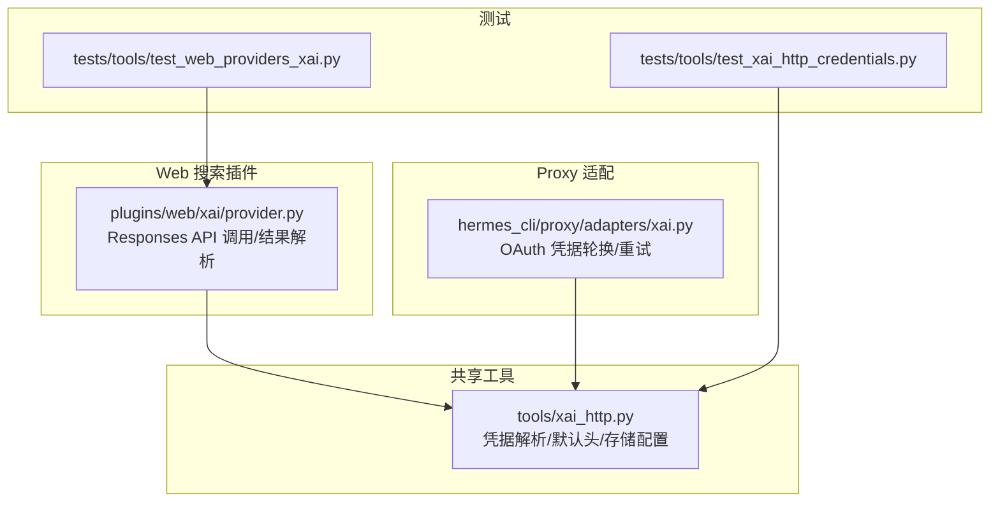
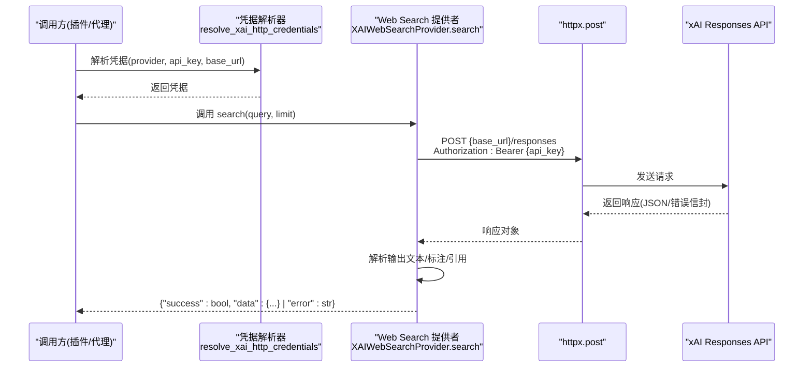
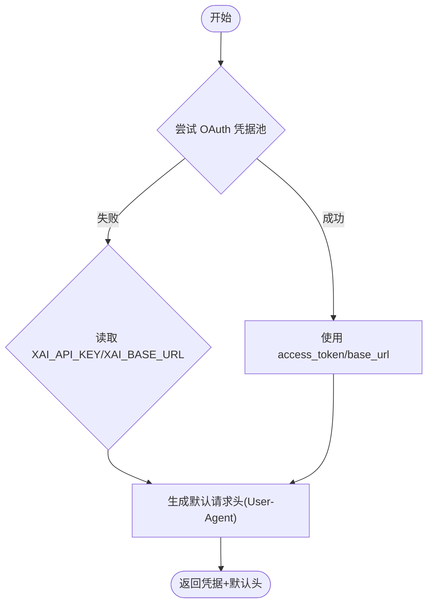
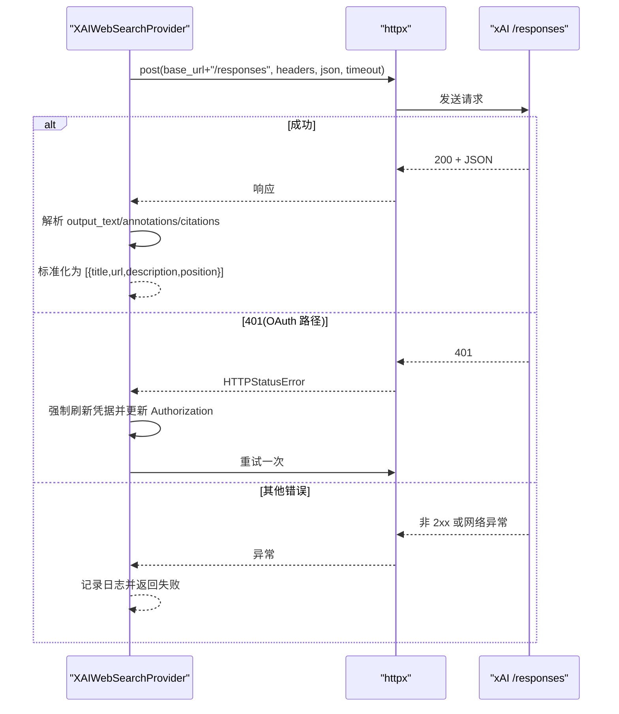
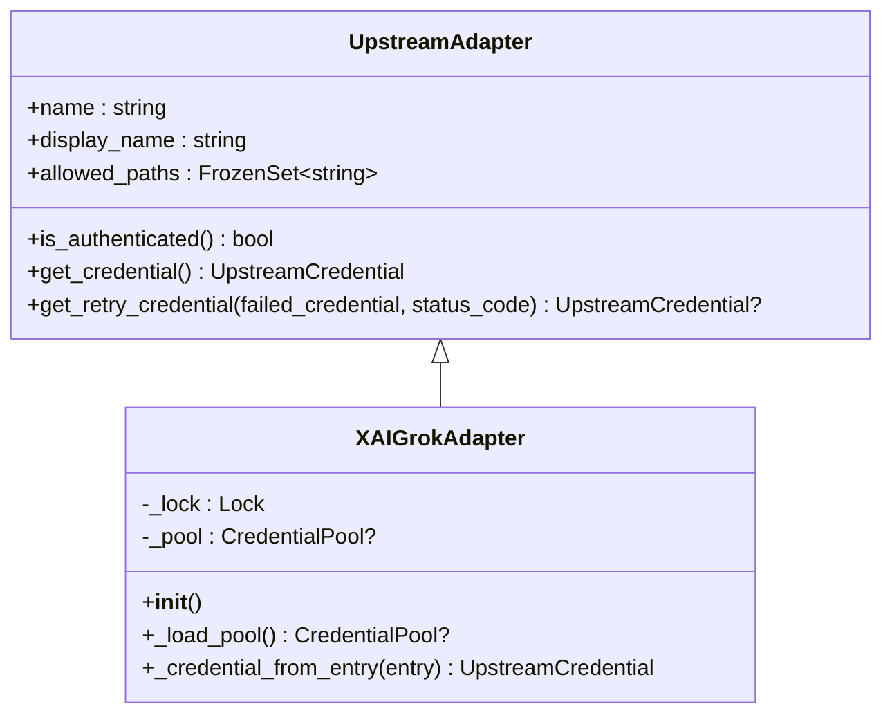
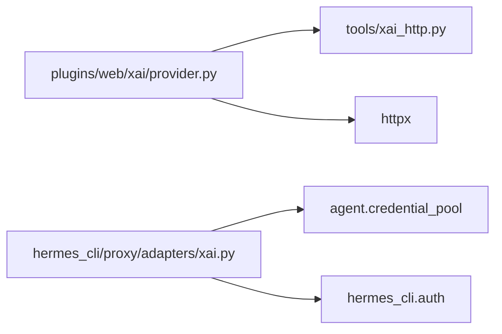

# XAI HTTP 客户端

<cite>
**本文引用的文件**
- [tools/xai_http.py](file://tools/xai_http.py)
- [plugins/web/xai/provider.py](file://plugins/web/xai/provider.py)
- [hermes_cli/proxy/adapters/xai.py](file://hermes_cli/proxy/adapters/xai.py)
- [tests/tools/test_web_providers_xai.py](file://tests/tools/test_web_providers_xai.py)
- [tests/tools/test_xai_http_credentials.py](file://tests/tools/test_xai_http_credentials.py)
</cite>

## 目录
1. [简介](#简介)
2. [项目结构](#项目结构)
3. [核心组件](#核心组件)
4. [架构总览](#架构总览)
5. [详细组件分析](#详细组件分析)
6. [依赖关系分析](#依赖关系分析)
7. [性能与调优](#性能与调优)
8. [故障排查指南](#故障排查指南)
9. [结论](#结论)
10. [附录：配置与示例](#附录配置与示例)

## 简介
本文件面向在 Hermes Agent 中集成 xAI 服务的开发者，系统性说明“XAI HTTP 客户端”的实现架构、通信协议、认证方式、错误处理、配置项（超时、重试、连接池）、以及性能调优建议。代码基于仓库中的共享工具与插件实现，覆盖 OAuth 与 API Key 两种认证路径，并通过 httpx 发起 HTTP 请求，统一封装了默认请求头、凭据解析、存储选项等能力。

## 项目结构
围绕 xAI HTTP 客户端的关键位置如下：
- 共享工具层：提供凭据解析、默认请求头、存储配置等通用能力
- Web Search 插件：以 Responses API 调用 xAI 的 web_search 工具，并解析结构化结果
- Proxy 适配器：将 xAI Grok OAuth 作为上游代理，支持凭据轮换与失败重试
- 测试用例：覆盖可用性探测、请求载荷、错误路径、OAuth 刷新与写回等场景

图表来源
- [tools/xai_http.py:1-330](file://tools/xai_http.py#L1-L330)
- [plugins/web/xai/provider.py:1-561](file://plugins/web/xai/provider.py#L1-L561)
- [hermes_cli/proxy/adapters/xai.py:1-146](file://hermes_cli/proxy/adapters/xai.py#L1-L146)
- [tests/tools/test_web_providers_xai.py:1-585](file://tests/tools/test_web_providers_xai.py#L1-L585)
- [tests/tools/test_xai_http_credentials.py:1-58](file://tests/tools/test_xai_http_credentials.py#L1-L58)

章节来源
- [tools/xai_http.py:1-330](file://tools/xai_http.py#L1-L330)
- [plugins/web/xai/provider.py:1-561](file://plugins/web/xai/provider.py#L1-L561)
- [hermes_cli/proxy/adapters/xai.py:1-146](file://hermes_cli/proxy/adapters/xai.py#L1-L146)
- [tests/tools/test_web_providers_xai.py:1-585](file://tests/tools/test_web_providers_xai.py#L1-L585)
- [tests/tools/test_xai_http_credentials.py:1-58](file://tests/tools/test_xai_http_credentials.py#L1-L58)

## 核心组件
- 凭据解析器：统一从 OAuth 凭据池或环境变量解析访问令牌与基础 URL，支持强制刷新与多账户选择
- 默认请求头：为所有 xAI HTTP 调用注入稳定的 User-Agent，便于服务端归因
- Web Search 提供者：通过 Responses API 调用 xAI 的 web_search 工具，构造结构化提示词，解析 JSON/标注/引用三种结果形式
- Proxy 适配器：对上游 xAI 端点做白名单过滤，管理凭据生命周期，并在 401/429 时自动轮换或冷却

章节来源
- [tools/xai_http.py:16-112](file://tools/xai_http.py#L16-L112)
- [tools/xai_http.py:257-330](file://tools/xai_http.py#L257-L330)
- [plugins/web/xai/provider.py:96-339](file://plugins/web/xai/provider.py#L96-L339)
- [hermes_cli/proxy/adapters/xai.py:31-142](file://hermes_cli/proxy/adapters/xai.py#L31-L142)

## 架构总览
下图展示了从调用方到 xAI 服务端的完整链路，包括凭据解析、请求构建、响应解析与错误处理。

图表来源
- [plugins/web/xai/provider.py:148-339](file://plugins/web/xai/provider.py#L148-L339)
- [tools/xai_http.py:257-330](file://tools/xai_http.py#L257-L330)

章节来源
- [plugins/web/xai/provider.py:148-339](file://plugins/web/xai/provider.py#L148-L339)
- [tools/xai_http.py:257-330](file://tools/xai_http.py#L257-L330)

## 详细组件分析

### 凭据解析与默认请求头
- 凭据优先级：优先使用 OAuth 凭据池（支持多账户、刷新、基址覆盖），否则回退到环境变量 XAI_API_KEY/XAI_BASE_URL
- 强制刷新：当传入 force_refresh=True 且提供 api_key_hint 时，可精准刷新被拒绝的条目
- 默认请求头：统一注入 Hermes-Agent 的 User-Agent，避免被识别为 OpenAI SDK

图表来源
- [tools/xai_http.py:257-330](file://tools/xai_http.py#L257-L330)
- [tools/xai_http.py:95-112](file://tools/xai_http.py#L95-L112)

章节来源
- [tools/xai_http.py:95-112](file://tools/xai_http.py#L95-L112)
- [tools/xai_http.py:257-330](file://tools/xai_http.py#L257-L330)

### Web Search 提供者（Responses API）
- 请求格式：POST /responses，携带 model、input、tools（启用 web_search）、include（no_inline_citations）
- 超时控制：通过配置 web.xai.timeout 设置；默认 90 秒
- 域名过滤：allowed_domains 与 excluded_domains 互斥，最多 5 个
- 结果解析：优先解析 Grok 输出的 JSON 块；若失败则回退到 url_citation 标注；最后回退到 citations 列表
- 错误处理：捕获 HTTPStatusError/RequestError；对 200 但包含 error 信封的情况也视为失败；OAuth 路径下首次 401 会强制刷新并重试一次

图表来源
- [plugins/web/xai/provider.py:148-339](file://plugins/web/xai/provider.py#L148-L339)
- [plugins/web/xai/provider.py:342-543](file://plugins/web/xai/provider.py#L342-L543)

章节来源
- [plugins/web/xai/provider.py:148-339](file://plugins/web/xai/provider.py#L148-L339)
- [plugins/web/xai/provider.py:342-543](file://plugins/web/xai/provider.py#L342-L543)

### Proxy 适配器（OAuth 凭据轮换与重试）
- 允许的上游路径：/responses、/chat/completions、/completions、/embeddings、/models
- 认证检查：检测凭据池是否可用
- 获取凭据：从池中选取条目，组装 bearer 与 base_url
- 重试策略：
  - 429：标记当前凭据进入冷却并切换到下一个可用凭据
  - 401：尝试刷新当前凭据，若失败则切换下一个
- 线程安全：使用锁保护池加载与凭据选择

图表来源
- [hermes_cli/proxy/adapters/xai.py:31-142](file://hermes_cli/proxy/adapters/xai.py#L31-L142)

章节来源
- [hermes_cli/proxy/adapters/xai.py:31-142](file://hermes_cli/proxy/adapters/xai.py#L31-L142)

### 数据模型与协议要点
- 认证：Bearer Token（来自 OAuth 或 XAI_API_KEY）
- 基础地址：优先使用 OAuth 条目中的 base_url，其次环境变量 XAI_BASE_URL/HERMES_XAI_BASE_URL，最终回退到默认 https://api.x.ai/v1
- 请求体（web_search）：
  - model：默认 grok-build-0.1，可通过 web.xai.model 配置
  - input：[{role: user, content: prompt}]
  - tools：[{"type": "web_search", filters?: {allowed_domains/excluded_domains}}]
  - include：["no_inline_citations"]
- 响应体：
  - 成功：output 中包含 message/output_text，可能附带 annotations/url_citation；citations 为备用 URL 列表
  - 失败：顶层 error 信封（message/code）

章节来源
- [plugins/web/xai/provider.py:148-339](file://plugins/web/xai/provider.py#L148-L339)
- [plugins/web/xai/provider.py:342-543](file://plugins/web/xai/provider.py#L342-L543)
- [tools/xai_http.py:257-330](file://tools/xai_http.py#L257-L330)

## 依赖关系分析
- Web Search 提供者依赖：
  - 凭据解析器：resolve_xai_http_credentials
  - 默认请求头：hermes_xai_user_agent/hermes_xai_default_headers
  - HTTP 客户端：httpx
- Proxy 适配器依赖：
  - 凭据池：agent.credential_pool.CredentialPool
  - 默认基础地址：hermes_cli.auth.DEFAULT_XAI_OAUTH_BASE_URL

图表来源
- [plugins/web/xai/provider.py:41-45](file://plugins/web/xai/provider.py#L41-L45)
- [hermes_cli/proxy/adapters/xai.py:9-11](file://hermes_cli/proxy/adapters/xai.py#L9-L11)

章节来源
- [plugins/web/xai/provider.py:41-45](file://plugins/web/xai/provider.py#L41-L45)
- [hermes_cli/proxy/adapters/xai.py:9-11](file://hermes_cli/proxy/adapters/xai.py#L9-L11)

## 性能与调优
- 并发控制
  - Web Search 单次请求由 httpx.post 同步发起；在高并发场景建议在上层进行限流或队列化，避免瞬时峰值导致 429
  - Proxy 适配器内部使用线程锁保护凭据池操作，保证并发安全
- 资源管理
  - 合理设置超时（web.xai.timeout），避免长尾请求占用资源
  - 使用默认请求头有助于服务端侧监控与限流策略
- 内存优化
  - 结果解析仅保留必要字段（title/url/description/position），避免冗余
  - 对大响应体（如大量 citations）应限制上限（limit）
- 重试与容错
  - OAuth 路径下 401 触发一次强制刷新并重试；429 走凭据轮换
  - 对于 env var 路径不重试，避免无谓消耗配额
- 连接池
  - httpx 默认复用连接；如需更高吞吐可在上层复用 httpx.Client 实例（注意线程安全与生命周期管理）

[本节为通用指导，不直接分析具体文件]

## 故障排查指南
- 无法找到凭据
  - 现象：search 返回 success=false，提示缺少凭据
  - 排查：确认已运行 hermes auth add xai-oauth 或设置 XAI_API_KEY；检查 ~/.hermes/auth.json 与 credential pool
  - 参考：[凭据解析:257-330](file://tools/xai_http.py#L257-L330)
- 401 Unauthorized
  - OAuth 路径：自动强制刷新并重试一次；若仍失败，检查 refresh token 是否有效或被撤销
  - 环境变量路径：不会重试，需手动更换密钥
  - 参考：[错误处理与重试:242-301](file://plugins/web/xai/provider.py#L242-L301)
- 429 Too Many Requests
  - 现象：上游限流
  - 处理：Proxy 适配器会标记当前凭据冷却并切换到下一个；降低并发或增加账号数量
  - 参考：[重试策略:76-109](file://hermes_cli/proxy/adapters/xai.py#L76-L109)
- 200 OK 但包含 error 信封
  - 现象：HTTP 成功但业务失败（如模型过载、内容策略拒绝）
  - 处理：按失败分支处理，查看 error.message/error.code
  - 参考：[错误信封处理:316-329](file://plugins/web/xai/provider.py#L316-L329)
- 域名过滤冲突
  - 现象：同时设置了 allowed_domains 与 excluded_domains
  - 处理：二者互斥，只保留其一；最大 5 个
  - 参考：[配置校验:193-204](file://plugins/web/xai/provider.py#L193-L204)

章节来源
- [plugins/web/xai/provider.py:193-204](file://plugins/web/xai/provider.py#L193-L204)
- [plugins/web/xai/provider.py:242-301](file://plugins/web/xai/provider.py#L242-L301)
- [plugins/web/xai/provider.py:316-329](file://plugins/web/xai/provider.py#L316-L329)
- [hermes_cli/proxy/adapters/xai.py:76-109](file://hermes_cli/proxy/adapters/xai.py#L76-L109)
- [tools/xai_http.py:257-330](file://tools/xai_http.py#L257-L330)

## 结论
该 XAI HTTP 客户端通过统一的凭据解析、稳定的默认请求头、健壮的响应解析与错误处理，为 Hermes Agent 提供了可靠的 xAI 集成能力。其设计兼顾了 OAuth 与 API Key 双路径、多账户轮换、限流与鉴权失败的自愈能力，并通过严格的配置校验与最小化结果集，保障性能与稳定性。

[本节为总结性内容，不直接分析具体文件]

## 附录：配置与示例

### 配置项
- web.xai.model：字符串，默认 grok-build-0.1
- web.xai.timeout：浮点数秒，默认 90
- web.xai.allowed_domains / web.xai.excluded_domains：字符串数组，最多 5 个，互斥
- image_gen/video_gen.xai.storage.enabled/public_url/expires_after：媒体存储开关与 TTL（用于图片/视频生成）
- 环境变量：
  - XAI_API_KEY：API Key 模式
  - XAI_BASE_URL / HERMES_XAI_BASE_URL：自定义基础地址（OAuth 路径下会被校验）

章节来源
- [plugins/web/xai/provider.py:18-31](file://plugins/web/xai/provider.py#L18-L31)
- [plugins/web/xai/provider.py:184-195](file://plugins/web/xai/provider.py#L184-L195)
- [tools/xai_http.py:165-217](file://tools/xai_http.py#L165-L217)
- [tools/xai_http.py:295-308](file://tools/xai_http.py#L295-L308)

### 典型用法示例（步骤式）
- 初始化与可用性检查
  - 调用 is_available() 快速判断是否具备凭据（不触发网络刷新）
  - 参考：[可用性探测](file://plugins/web/xai/provider.py:128-138)
- 执行 Web Search
  - 调用 search(query, limit)，内部完成凭据解析、构建请求、发送、解析与错误处理
  - 参考：[搜索流程](file://plugins/web/xai/provider.py:148-339)
- 处理不同响应类型
  - 成功：data.web 为标准结果列表
  - 失败：error 字段包含原因（HTTP 状态、网络错误、错误信封等）
  - 参考：[结果解析与错误处理](file://plugins/web/xai/provider.py:307-339)
- 会话状态管理
  - 通过凭据池管理多账户与刷新；Proxy 适配器在 401/429 时自动轮换
  - 参考：[凭据轮换](file://hermes_cli/proxy/adapters/xai.py:76-109)

章节来源
- [plugins/web/xai/provider.py:128-138](file://plugins/web/xai/provider.py#L128-L138)
- [plugins/web/xai/provider.py:148-339](file://plugins/web/xai/provider.py#L148-L339)
- [hermes_cli/proxy/adapters/xai.py:76-109](file://hermes_cli/proxy/adapters/xai.py#L76-L109)

### 测试覆盖要点（便于理解行为）
- 可用性探测不触发网络刷新
- 请求载荷形状（model、tools、include）
- 结果解析（JSON、标注、引用）
- 错误路径（缺失凭据、401 刷新重试、429 轮换、200 错误信封）
- OAuth 凭据写回与刷新一致性

章节来源
- [tests/tools/test_web_providers_xai.py:54-98](file://tests/tools/test_web_providers_xai.py#L54-L98)
- [tests/tools/test_web_providers_xai.py:220-268](file://tests/tools/test_web_providers_xai.py#L220-L268)
- [tests/tools/test_web_providers_xai.py:275-394](file://tests/tools/test_web_providers_xai.py#L275-L394)
- [tests/tools/test_web_providers_xai.py:459-585](file://tests/tools/test_web_providers_xai.py#L459-L585)
- [tests/tools/test_xai_http_credentials.py:10-58](file://tests/tools/test_xai_http_credentials.py#L10-L58)