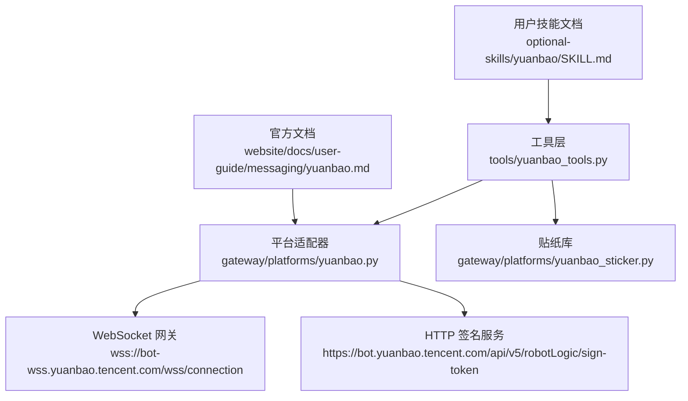
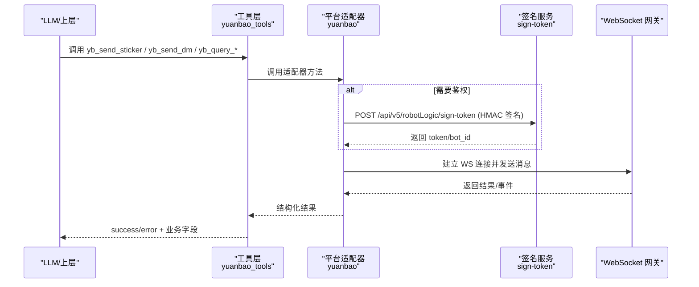
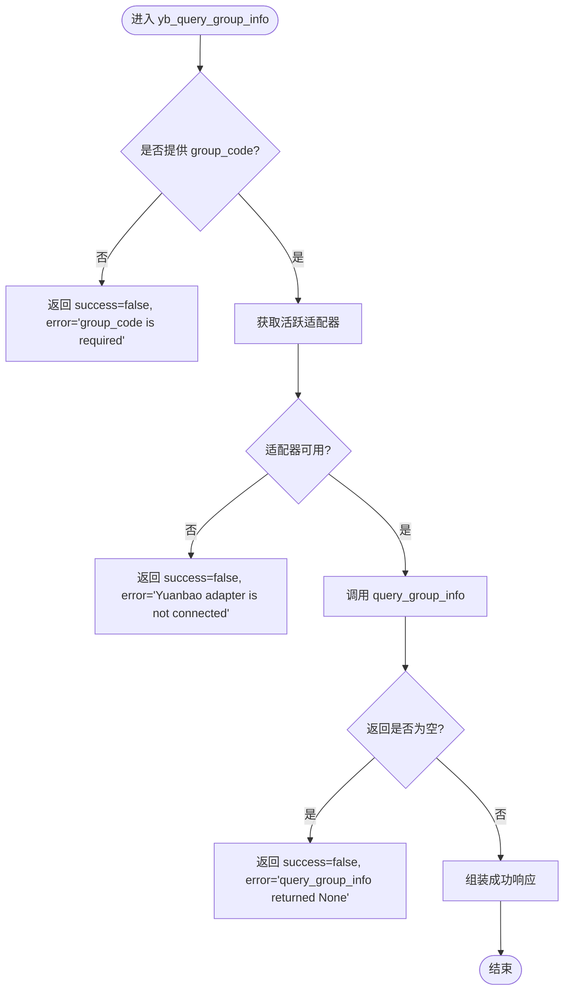
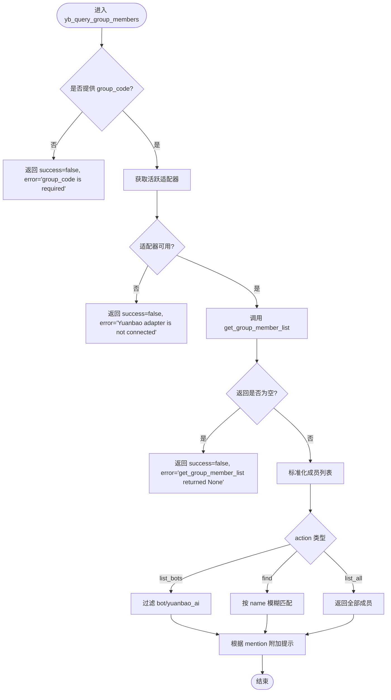
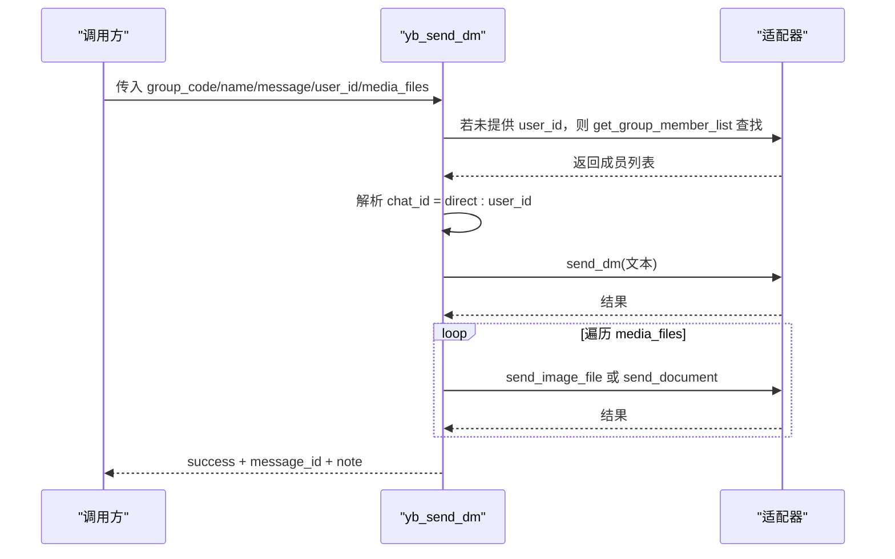
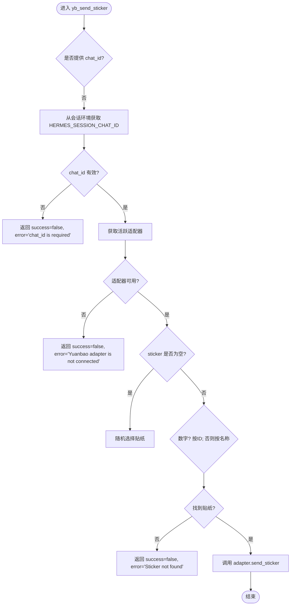
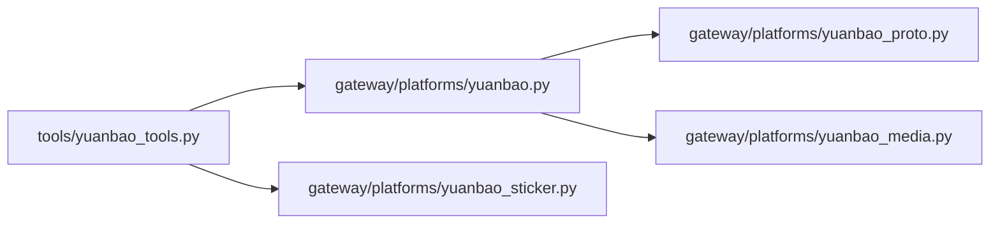

# 元宝工具集

<cite>
**本文引用的文件**
- [tools/yuanbao_tools.py](file://tools/yuanbao_tools.py)
- [gateway/platforms/yuanbao.py](file://gateway/platforms/yuanbao.py)
- [gateway/platforms/yuanbao_sticker.py](file://gateway/platforms/yuanbao_sticker.py)
- [optional-skills/yuanbao/SKILL.md](file://optional-skills/yuanbao/SKILL.md)
- [website/docs/user-guide/messaging/yuanbao.md](file://website/docs/user-guide/messaging/yuanbao.md)
- [tests/test_yuanbao_integration.py](file://tests/test_yuanbao_integration.py)
</cite>

## 目录
1. [简介](#简介)
2. [项目结构](#项目结构)
3. [核心组件](#核心组件)
4. [架构总览](#架构总览)
5. [详细组件分析](#详细组件分析)
6. [依赖关系分析](#依赖关系分析)
7. [性能与可靠性](#性能与可靠性)
8. [故障排查指南](#故障排查指南)
9. [结论](#结论)
10. [附录：API 规范与示例](#附录api-规范与示例)

## 简介
本文件为 Hermes Agent 中的“元宝工具集”技术文档，聚焦以下目标：
- 说明元宝工具集的功能模块：消息发送、群成员管理、贴纸发送等。
- 解释元宝平台 API 接口规范：认证方式（HMAC 签名 + WebSocket）、数据格式（TIMFaceElem 贴纸协议、消息体结构）和错误码分类。
- 提供工具类的初始化配置、方法参数说明与返回值结构。
- 给出在 Hermes Agent 中集成和使用元宝服务的完整流程与最佳实践。
- 提供常见异常处理与排错建议。

## 项目结构
围绕元宝工具集的核心代码分布在如下位置：
- 工具注册与调用入口：tools/yuanbao_tools.py
- 平台适配器与连接/认证：gateway/platforms/yuanbao.py
- 贴纸库与消息体构造：gateway/platforms/yuanbao_sticker.py
- 用户技能指引：optional-skills/yuanbao/SKILL.md
- 官方使用文档：website/docs/user-guide/messaging/yuanbao.md
- 集成测试用例：tests/test_yuanbao_integration.py

图表来源
- [tools/yuanbao_tools.py:1-738](file://tools/yuanbao_tools.py#L1-L738)
- [gateway/platforms/yuanbao.py:1-800](file://gateway/platforms/yuanbao.py#L1-L800)
- [gateway/platforms/yuanbao_sticker.py:1-559](file://gateway/platforms/yuanbao_sticker.py#L1-L559)
- [website/docs/user-guide/messaging/yuanbao.md:1-342](file://website/docs/user-guide/messaging/yuanbao.md#L1-L342)

章节来源
- [tools/yuanbao_tools.py:1-738](file://tools/yuanbao_tools.py#L1-L738)
- [gateway/platforms/yuanbao.py:1-800](file://gateway/platforms/yuanbao.py#L1-L800)
- [gateway/platforms/yuanbao_sticker.py:1-559](file://gateway/platforms/yuanbao_sticker.py#L1-L559)
- [website/docs/user-guide/messaging/yuanbao.md:1-342](file://website/docs/user-guide/messaging/yuanbao.md#L1-L342)

## 核心组件
- 工具注册与处理器
  - 群组信息查询：yb_query_group_info
  - 群成员查询：yb_query_group_members（支持 find/list_bots/list_all）
  - 私信发送：yb_send_dm（文本+媒体）
  - 贴纸搜索：yb_search_sticker
  - 贴纸发送：yb_send_sticker
- 平台适配器
  - 连接管理、心跳保活、重连策略
  - HMAC 签名获取 token、WebSocket 鉴权
  - 消息收发、Markdown 分块、媒体上传（COS）
- 贴纸库
  - 内置贴纸映射表、模糊搜索、随机选取
  - TIMFaceElem 消息体构造

章节来源
- [tools/yuanbao_tools.py:500-738](file://tools/yuanbao_tools.py#L500-L738)
- [gateway/platforms/yuanbao.py:398-639](file://gateway/platforms/yuanbao.py#L398-L639)
- [gateway/platforms/yuanbao_sticker.py:32-328](file://gateway/platforms/yuanbao_sticker.py#L32-L328)

## 架构总览
元宝工具集通过“工具层 -> 平台适配器 -> 平台网关”的分层架构实现：
- 工具层暴露统一函数与 schema，供 LLM 或上层调度器调用。
- 平台适配器负责与元宝 WebSocket 网关交互，完成鉴权、消息收发、媒体处理。
- 贴纸库提供表情资源与消息体构造能力。

图表来源
- [gateway/platforms/yuanbao.py:491-608](file://gateway/platforms/yuanbao.py#L491-L608)
- [tools/yuanbao_tools.py:208-283](file://tools/yuanbao_tools.py#L208-L283)
- [tools/yuanbao_tools.py:290-410](file://tools/yuanbao_tools.py#L290-L410)

## 详细组件分析

### 群组信息查询：yb_query_group_info
- 功能：查询群组基本信息（群名、群主、成员数）。
- 参数：
  - group_code: 字符串，必填。
- 返回：
  - success: 布尔
  - group_code: 字符串
  - group_name: 字符串
  - member_count: 整数
  - owner: {user_id, nickname}
  - note: 提示语
- 异常：
  - 未提供 group_code
  - 适配器未连接
  - 底层查询返回空或抛出异常

图表来源
- [tools/yuanbao_tools.py:53-79](file://tools/yuanbao_tools.py#L53-L79)

章节来源
- [tools/yuanbao_tools.py:53-79](file://tools/yuanbao_tools.py#L53-L79)

### 群成员查询：yb_query_group_members
- 功能：按 action 查询群成员（find/list_bots/list_all），支持 mention 提示。
- 参数：
  - group_code: 字符串，必填
  - action: 枚举 ["find","list_bots","list_all"]，必填
  - name: 字符串，可选（find 时用于模糊匹配）
  - mention: 布尔，可选（true 时在返回中包含 @mention 格式提示）
- 返回：
  - success: 布尔
  - msg: 描述信息
  - members: 列表，每项包含 user_id/nickname/role
  - mention_hint: 当 mention=true 时附带
- 异常：
  - 未提供 group_code
  - 适配器未连接
  - 成员列表为空或查找失败

图表来源
- [tools/yuanbao_tools.py:82-169](file://tools/yuanbao_tools.py#L82-L169)

章节来源
- [tools/yuanbao_tools.py:82-169](file://tools/yuanbao_tools.py#L82-L169)

### 私信发送：yb_send_dm
- 功能：向群内指定用户发送私聊消息，支持文本与媒体（图片/文档/语音）。
- 参数：
  - group_code: 字符串，可选（当未提供 user_id 时需要）
  - name: 字符串，可选（当未提供 user_id 时需要）
  - message: 字符串，可选（可为空，仅发媒体）
  - user_id: 字符串，可选（已知时跳过成员查找）
  - media_files: 数组，可选，元素为 {path, is_voice}
- 返回：
  - success: 布尔
  - user_id/nickname/message_id: 成功时返回
  - note: 成功或部分失败的提示
- 异常：
  - 未提供必要参数
  - 适配器未连接
  - 成员查找失败或多重匹配
  - 文本或媒体发送失败

图表来源
- [tools/yuanbao_tools.py:290-410](file://tools/yuanbao_tools.py#L290-L410)

章节来源
- [tools/yuanbao_tools.py:290-410](file://tools/yuanbao_tools.py#L290-L410)

### 贴纸搜索：yb_search_sticker
- 功能：按关键词在内置贴纸表中模糊搜索，返回 Top-N 候选（sticker_id/name/description/package_id）。
- 参数：
  - query: 字符串，可选（空表示返回前 N 条）
  - limit: 整数，可选（默认 10，最大 50）
- 返回：
  - success: 布尔
  - query/count/results: 搜索结果列表

章节来源
- [tools/yuanbao_tools.py:172-205](file://tools/yuanbao_tools.py#L172-L205)
- [gateway/platforms/yuanbao_sticker.py:468-508](file://gateway/platforms/yuanbao_sticker.py#L468-L508)

### 贴纸发送：yb_send_sticker
- 功能：向当前会话或指定 chat_id 发送一张内置贴纸（TIMFaceElem）。
- 参数：
  - sticker: 字符串，可选（名称或 sticker_id；为空时随机发送）
  - chat_id: 字符串，可选（缺省取当前会话上下文）
  - reply_to: 字符串，可选（群聊引用消息 ID）
- 返回：
  - success: 布尔
  - chat_id/sticker/message_id: 成功时返回
  - note: 行为提示
- 异常：
  - 未提供 chat_id
  - 适配器未连接
  - 找不到贴纸
  - 发送失败

图表来源
- [tools/yuanbao_tools.py:208-283](file://tools/yuanbao_tools.py#L208-L283)
- [gateway/platforms/yuanbao_sticker.py:511-559](file://gateway/platforms/yuanbao_sticker.py#L511-L559)

章节来源
- [tools/yuanbao_tools.py:208-283](file://tools/yuanbao_tools.py#L208-L283)
- [gateway/platforms/yuanbao_sticker.py:511-559](file://gateway/platforms/yuanbao_sticker.py#L511-L559)

## 依赖关系分析
- 工具层依赖：
  - gateway.platforms.yuanbao.get_active_adapter()
  - gateway.session_context.get_session_env()
  - tools.registry 注册机制
- 平台适配器依赖：
  - websockets/httpx（网络通信）
  - yuanbao_proto（协议编解码）
  - yuanbao_media（媒体下载/上传 COS）
- 贴纸库依赖：
  - 内置 STICKER_MAP 与模糊搜索算法

图表来源
- [tools/yuanbao_tools.py:28-35](file://tools/yuanbao_tools.py#L28-L35)
- [gateway/platforms/yuanbao.py:65-98](file://gateway/platforms/yuanbao.py#L65-L98)

章节来源
- [tools/yuanbao_tools.py:28-35](file://tools/yuanbao_tools.py#L28-L35)
- [gateway/platforms/yuanbao.py:65-98](file://gateway/platforms/yuanbao.py#L65-L98)

## 性能与可靠性
- 连接与心跳
  - 默认心跳间隔 30 秒，连续丢失 pong 阈值 2 次触发重连。
  - 重连上限 100 次，指数退避，关闭握手超时限制避免卡死。
- 签名缓存
  - sign-token 结果按 app_key 缓存，提前 60 秒刷新，避免频繁请求。
- 媒体并发
  - 入站媒体解析与下载默认并发度 6，上下限 1~12，平衡首包延迟与后端压力。
- Markdown 分块
  - 自动按段落边界切分长回复，保持代码块与表格原子性，适配平台大小限制。

章节来源
- [gateway/platforms/yuanbao.py:120-158](file://gateway/platforms/yuanbao.py#L120-L158)
- [gateway/platforms/yuanbao.py:398-639](file://gateway/platforms/yuanbao.py#L398-L639)
- [gateway/platforms/yuanbao.py:183-191](file://gateway/platforms/yuanbao.py#L183-L191)
- [gateway/platforms/yuanbao.py:254-291](file://gateway/platforms/yuanbao.py#L254-L291)

## 故障排查指南
- 常见问题
  - 适配器未连接：检查 YUANBAO_APP_ID/YUANBAO_APP_SECRET 是否正确，WS URL 可达。
  - 签名失败：确认 HMAC 签名计算与时间戳格式，必要时强制刷新 token。
  - 媒体上传失败：校验 COS 权限与 API_DOMAIN，确保文件可访问且未损坏。
  - 频繁断连：检查网络稳定性，适当调整心跳超时，启用详细日志。
- 定位手段
  - 查看网关日志：tail -f ~/.hermes/logs/gateway.log
  - 开启详细日志：hermes gateway run -vv
  - 验证签名服务：curl -I https://[YUANBAO_API_DOMAIN]

章节来源
- [website/docs/user-guide/messaging/yuanbao.md:198-249](file://website/docs/user-guide/messaging/yuanbao.md#L198-L249)

## 结论
元宝工具集提供了面向元宝平台的统一工具接口，覆盖群组信息查询、成员管理、私信发送与贴纸表达等高频场景。其底层通过 HMAC 签名与 WebSocket 网关进行安全可靠的通信，具备完善的连接管理、媒体处理与 Markdown 分块能力。结合官方文档与技能指引，可在 Hermes Agent 中快速集成并使用元宝服务。

## 附录：API 规范与示例

### 认证方式
- 使用 HMAC-SHA256 对 nonce、timestamp、app_key、app_secret 计算签名，POST 到 sign-token 接口获取 token。
- 通过 WebSocket 携带 token 完成鉴权，维持心跳保活。

章节来源
- [gateway/platforms/yuanbao.py:443-451](file://gateway/platforms/yuanbao.py#L443-L451)
- [gateway/platforms/yuanbao.py:491-563](file://gateway/platforms/yuanbao.py#L491-L563)

### 数据格式
- 贴纸消息体（TIMFaceElem）
  - msg_type: "TIMFaceElem"
  - msg_content: {index: 0, data: JSON 字符串}
  - data 包含 sticker_id/package_id/width/height/formats/name
- 聊天标识
  - 直聊：direct:<account>
  - 群聊：group:<group_code>

章节来源
- [gateway/platforms/yuanbao_sticker.py:6-17](file://gateway/platforms/yuanbao_sticker.py#L6-L17)
- [gateway/platforms/yuanbao_sticker.py:511-559](file://gateway/platforms/yuanbao_sticker.py#L511-L559)
- [website/docs/user-guide/messaging/yuanbao.md:107-115](file://website/docs/user-guide/messaging/yuanbao.md#L107-L115)

### 错误码定义
- 认证相关
  - 永久失败：4001/4002/4003（需重新签名）
  - 可重试：4010/4011/4099（可重试相同 token）
- 其他
  - 关闭码集合：4012/4013/4014/4018/4019/4021（不重连）

章节来源
- [gateway/platforms/yuanbao.py:139-148](file://gateway/platforms/yuanbao.py#L139-L148)

### 工具方法与参数说明
- yb_query_group_info
  - 参数：group_code
  - 返回：success/group_code/group_name/member_count/owner/note
- yb_query_group_members
  - 参数：group_code, action, name, mention
  - 返回：success/msg/members/mention_hint
- yb_send_dm
  - 参数：group_code, name, message, user_id, media_files
  - 返回：success/user_id/nickname/message_id/note
- yb_search_sticker
  - 参数：query, limit
  - 返回：success/query/count/results
- yb_send_sticker
  - 参数：sticker, chat_id, reply_to
  - 返回：success/chat_id/sticker/message_id/note

章节来源
- [tools/yuanbao_tools.py:500-738](file://tools/yuanbao_tools.py#L500-L738)

### 集成指南（在 Hermes Agent 中使用）
- 前置条件
  - 安装依赖：websockets、httpx、aiofiles
  - 创建机器人并获取 APP_ID/APP_SECRET
- 配置步骤
  - 运行 hermes gateway setup，选择 Yuanbao，填写凭据
  - 环境变量：YUANBAO_APP_ID、YUANBAO_APP_SECRET、YUANBAO_WS_URL、YUANBAO_API_DOMAIN
  - 可选：YUANBAO_HOME_CHANNEL、YUANBAO_DM_POLICY、YUANBAO_GROUP_POLICY
- 启动网关
  - hermes gateway
- 使用工具
  - 在对话中直接调用工具（如 yb_query_group_members、yb_send_dm、yb_send_sticker）
  - 参考技能文档中的工作流与示例

章节来源
- [website/docs/user-guide/messaging/yuanbao.md:15-85](file://website/docs/user-guide/messaging/yuanbao.md#L15-L85)
- [optional-skills/yuanbao/SKILL.md:14-89](file://optional-skills/yuanbao/SKILL.md#L14-L89)

### 完整示例（以工具调用为例）
- 艾特用户
  - 先调用 yb_query_group_members(action="find", name="目标昵称", mention=true)
  - 在回复文本中包含空格+@+精确昵称，网关会自动转换为真实 @mention
- 发送私信
  - 调用 yb_send_dm(group_code, name, message)，或附带 media_files
- 发送贴纸
  - 先调用 yb_search_sticker(query="关键词") 获取 sticker_id/name
  - 再调用 yb_send_sticker(sticker=..., chat_id=...)

章节来源
- [optional-skills/yuanbao/SKILL.md:30-89](file://optional-skills/yuanbao/SKILL.md#L30-L89)
- [tools/yuanbao_tools.py:431-497](file://tools/yuanbao_tools.py#L431-L497)

### 与平台其他组件的交互
- 与 Gateway Runner 集成：平台枚举包含 YUANBAO，Runner 会创建 YuanbaoAdapter
- 与 Toolset 注册：hermes-yuanbao 工具集已注册，可通过工具调度器发现与调用
- 与 Cron/Background：设置 home channel 后，定时任务与后台任务结果将投递到该渠道

章节来源
- [tests/test_yuanbao_integration.py:130-145](file://tests/test_yuanbao_integration.py#L130-L145)
- [tests/test_yuanbao_integration.py:222-229](file://tests/test_yuanbao_integration.py#L222-L229)
- [website/docs/user-guide/messaging/yuanbao.md:126-159](file://website/docs/user-guide/messaging/yuanbao.md#L126-L159)