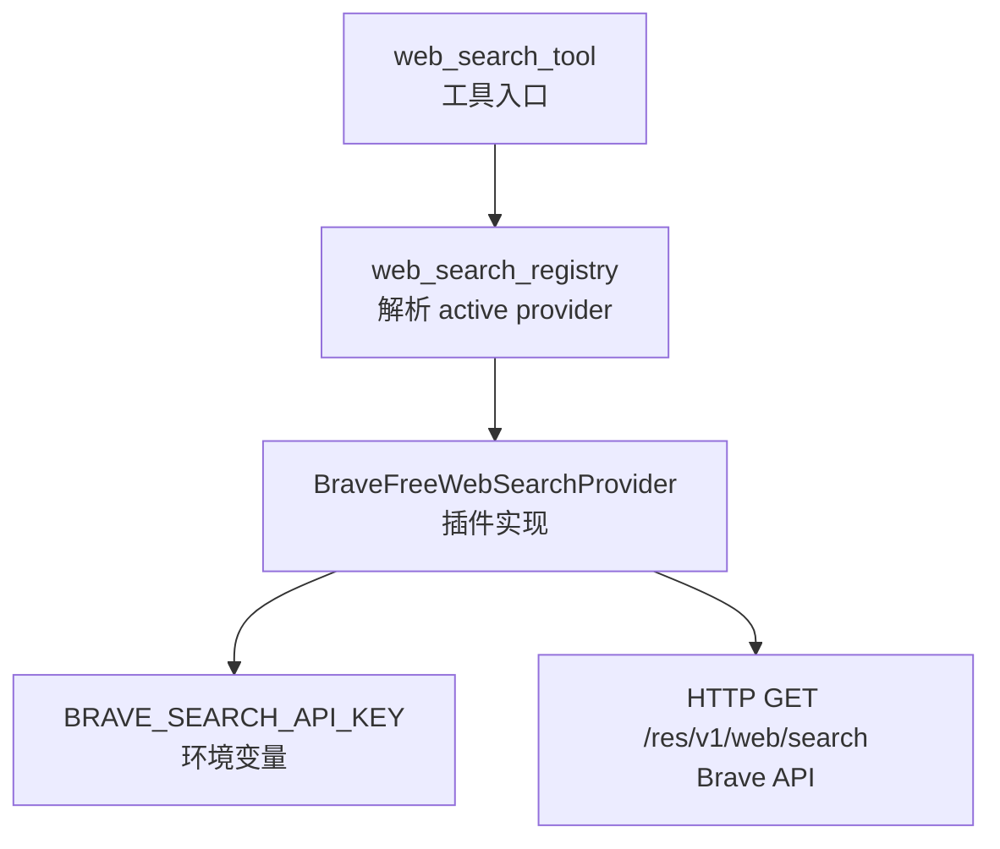
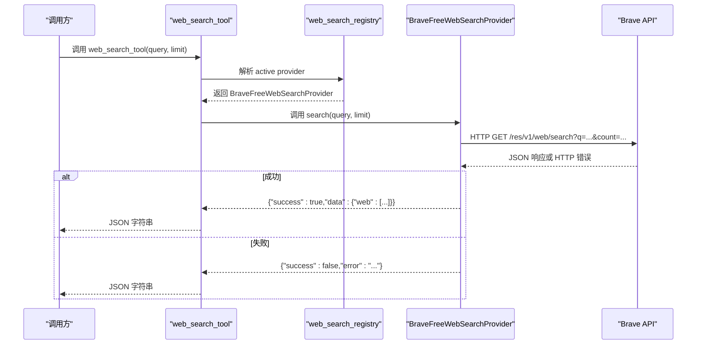
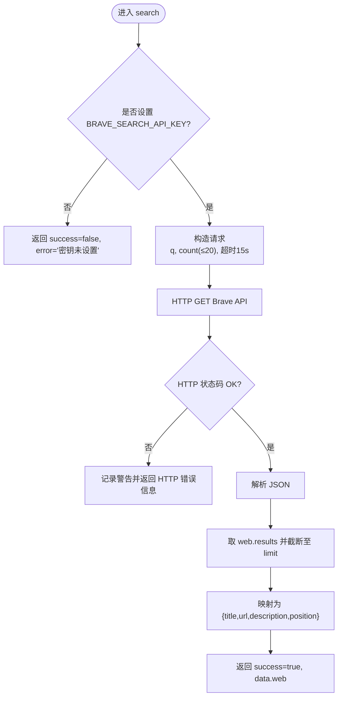
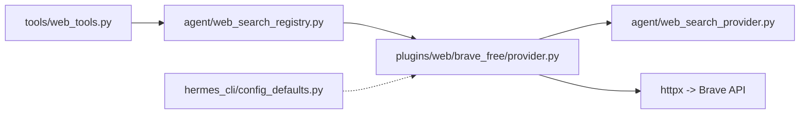

# Brave Free 搜索引擎

<cite>
**本文引用的文件**
- [plugins/web/brave_free/provider.py](file://plugins/web/brave_free/provider.py)
- [agent/web_search_provider.py](file://agent/web_search_provider.py)
- [agent/web_search_registry.py](file://agent/web_search_registry.py)
- [tools/web_tools.py](file://tools/web_tools.py)
- [hermes_cli/config_defaults.py](file://hermes_cli/config_defaults.py)
</cite>

## 目录
1. [简介](#简介)
2. [项目结构](#项目结构)
3. [核心组件](#核心组件)
4. [架构总览](#架构总览)
5. [详细组件分析](#详细组件分析)
6. [依赖关系分析](#依赖关系分析)
7. [性能与限制](#性能与限制)
8. [故障排查指南](#故障排查指南)
9. [结论](#结论)
10. [附录：使用示例与最佳实践](#附录：使用示例与最佳实践)

## 简介
本文件面向在 Hermes Agent 中集成并启用 Brave Search 免费版的用户与开发者，系统说明以下内容：
- 如何获取并配置 BRAVE_SEARCH_API_KEY
- Brave Free 的功能边界（仅搜索、无内容提取）与配额限制（每月查询次数、请求速率）
- 如何通过 web_search_tool 调用 Brave Free 进行搜索，包括参数优化与结果处理
- 与其他搜索引擎的对比及选择建议
- 错误处理、重试与性能监控建议

## 项目结构
Brave Free 作为“Web 搜索插件”被注册到统一 Web 搜索提供者体系中。关键路径如下：
- 插件实现：plugins/web/brave_free/provider.py
- 抽象接口与环境变量读取：agent/web_search_provider.py
- 提供者注册与激活选择：agent/web_search_registry.py
- 工具入口与调度：tools/web_tools.py
- 环境变量元数据与提示：hermes_cli/config_defaults.py

图表来源
- [tools/web_tools.py:618-739](file://tools/web_tools.py#L618-L739)
- [agent/web_search_registry.py:133-219](file://agent/web_search_registry.py#L133-L219)
- [plugins/web/brave_free/provider.py:33-127](file://plugins/web/brave_free/provider.py#L33-L127)

章节来源
- [tools/web_tools.py:618-739](file://tools/web_tools.py#L618-L739)
- [agent/web_search_registry.py:133-219](file://agent/web_search_registry.py#L133-L219)
- [plugins/web/brave_free/provider.py:33-127](file://plugins/web/brave_free/provider.py#L33-L127)

## 核心组件
- BraveFreeWebSearchProvider：实现搜索能力，读取环境变量，调用 Brave Data-for-Search 免费接口，返回标准化搜索结果。
- WebSearchProvider（ABC）：定义统一的搜索/抽取接口与环境变量读取方式，确保各后端一致的行为契约。
- web_search_registry：负责根据配置与可用性选择当前活跃的搜索提供者，支持显式配置、单提供者快捷路径与历史偏好回退。
- web_search_tool：对外暴露的统一搜索工具，负责参数校验、分发到活跃提供者、序列化结果与调试日志。
- 配置元数据：为 BRAVE_SEARCH_API_KEY 提供描述、提示与链接，便于在 CLI 工具中引导用户设置。

章节来源
- [plugins/web/brave_free/provider.py:33-142](file://plugins/web/brave_free/provider.py#L33-L142)
- [agent/web_search_provider.py:59-82](file://agent/web_search_provider.py#L59-L82)
- [agent/web_search_registry.py:133-219](file://agent/web_search_registry.py#L133-L219)
- [tools/web_tools.py:618-739](file://tools/web_tools.py#L618-L739)
- [hermes_cli/config_defaults.py:3716-3723](file://hermes_cli/config_defaults.py#L3716-L3723)

## 架构总览
下图展示了从工具调用到 Brave API 的完整链路，以及失败时的错误返回路径。

图表来源
- [tools/web_tools.py:618-739](file://tools/web_tools.py#L618-L739)
- [agent/web_search_registry.py:133-219](file://agent/web_search_registry.py#L133-L219)
- [plugins/web/brave_free/provider.py:62-127](file://plugins/web/brave_free/provider.py#L62-L127)

## 详细组件分析

### BraveFreeWebSearchProvider（Brave 免费版搜索插件）
- 名称与显示名：name="brave-free"，display_name="Brave Search (Free)"
- 可用性检查：is_available() 通过 get_provider_env("BRAVE_SEARCH_API_KEY") 判断密钥是否存在
- 能力声明：supports_search()=True，supports_extract()=False（仅搜索，不抽取网页内容）
- 搜索实现：
  - 构造请求：GET https://api.search.brave.com/res/v1/web/search
  - 参数：q=query，count=min(limit, 20)
  - 头部：X-Subscription-Token=密钥，Accept=application/json
  - 超时：15 秒
  - 错误处理：捕获 HTTPStatusError 与 RequestError，返回结构化错误
  - 结果归一化：取 data.web.results，截取前 limit 条，映射为 {title, url, description, position}
- 设置模式：get_setup_schema() 输出键名、提示与官方文档链接

图表来源
- [plugins/web/brave_free/provider.py:62-127](file://plugins/web/brave_free/provider.py#L62-L127)

章节来源
- [plugins/web/brave_free/provider.py:33-142](file://plugins/web/brave_free/provider.py#L33-L142)

### WebSearchProvider（抽象基类与环境变量读取）
- 提供统一的 is_available/supported_* / search / extract 接口
- get_provider_env(name) 优先通过配置层读取环境变量，否则回退到进程环境，保证在子进程/代理场景下也能读到密钥

章节来源
- [agent/web_search_provider.py:59-82](file://agent/web_search_provider.py#L59-L82)
- [agent/web_search_provider.py:89-212](file://agent/web_search_provider.py#L89-L212)

### web_search_registry（提供者注册与激活选择）
- 优先级：
  1) 显式配置 web.search_backend 或 web.backend
  2) 唯一可用提供者快捷路径
  3) 历史偏好顺序回退：firecrawl → parallel → tavily → exa → searxng → brave-free → ddgs
- 能力过滤：按 supports_search()/supports_extract() 过滤
- 禁用插件诊断：当用户显式配置了某后端但插件被禁用时，给出明确提示

章节来源
- [agent/web_search_registry.py:133-219](file://agent/web_search_registry.py#L133-L219)
- [agent/web_search_registry.py:222-278](file://agent/web_search_registry.py#L222-L278)

### web_search_tool（统一搜索工具）
- 参数校验：limit 强制范围 [1, 100]
- 分发逻辑：加载插件后，先尝试配置的 provider，否则回退到 active provider；若均不可用，返回“请运行 hermes tools 设置”的错误
- 结果封装：将 provider 返回的结构序列化为 JSON 字符串，附带调试日志

章节来源
- [tools/web_tools.py:618-739](file://tools/web_tools.py#L618-L739)

### 配置元数据（BRAVE_SEARCH_API_KEY）
- 描述、提示与官方链接已内置，便于在 CLI 工具中引导用户设置密钥

章节来源
- [hermes_cli/config_defaults.py:3716-3723](file://hermes_cli/config_defaults.py#L3716-L3723)

## 依赖关系分析
- web_search_tool 依赖 web_search_registry 解析 active provider
- web_search_registry 依赖各插件提供的 WebSearchProvider 实例（含 BraveFreeWebSearchProvider）
- BraveFreeWebSearchProvider 依赖 agent.web_search_provider.get_provider_env 读取密钥，并通过 httpx 访问 Brave API
- 配置元数据由 hermes_cli.config_defaults 提供，用于 UI/CLI 提示

图表来源
- [tools/web_tools.py:618-739](file://tools/web_tools.py#L618-L739)
- [agent/web_search_registry.py:133-219](file://agent/web_search_registry.py#L133-L219)
- [plugins/web/brave_free/provider.py:62-127](file://plugins/web/brave_free/provider.py#L62-L127)
- [agent/web_search_provider.py:59-82](file://agent/web_search_provider.py#L59-L82)
- [hermes_cli/config_defaults.py:3716-3723](file://hermes_cli/config_defaults.py#L3716-L3723)

## 性能与限制
- 查询次数限制：免费层每月约 2,000 次查询（以插件注释为准）
- 请求速率：约 1 qps（以插件注释为准）
- 单次结果上限：count 最大为 20（provider 内部对 limit 做裁剪）
- 超时控制：HTTP 请求默认超时 15 秒
- 结果数量：最终返回条数受 limit 与 API 实际返回共同影响，provider 会截断至 limit

建议
- 合理设置 limit（例如 5~10），避免频繁拉取大量结果造成配额消耗
- 在高并发场景下对调用端进行节流，避免超过 1 qps 导致限流
- 结合业务缓存热点查询结果，减少重复请求

章节来源
- [plugins/web/brave_free/provider.py:33-38](file://plugins/web/brave_free/provider.py#L33-L38)
- [plugins/web/brave_free/provider.py:76-88](file://plugins/web/brave_free/provider.py#L76-L88)

## 故障排查指南
常见问题与定位要点：
- 未设置密钥：is_available() 为 False，search() 直接返回“密钥未设置”
- HTTP 错误：捕获 HTTPStatusError，返回包含状态码的错误信息
- 网络异常：捕获 RequestError，返回“无法连接 Brave Search”的错误
- JSON 解析失败：返回“无法解析响应为 JSON”的错误
- 未配置任何搜索后端：web_search_tool 返回“请运行 hermes tools 设置一个搜索后端”
- 插件被禁用：当显式配置了某后端但插件被禁用时，registry 可识别并提示重新启用

操作建议：
- 使用 hermes tools 设置 BRAVE_SEARCH_API_KEY，或通过配置文件注入
- 若出现“插件被禁用”，根据提示执行 re-enable 命令
- 关注日志中的警告信息，快速定位网络或鉴权问题

章节来源
- [plugins/web/brave_free/provider.py:50-74](file://plugins/web/brave_free/provider.py#L50-L74)
- [plugins/web/brave_free/provider.py:89-104](file://plugins/web/brave_free/provider.py#L89-L104)
- [tools/web_tools.py:693-716](file://tools/web_tools.py#L693-L716)
- [agent/web_search_registry.py:222-278](file://agent/web_search_registry.py#L222-L278)

## 结论
Brave Free 在 Hermes Agent 中以插件形式提供稳定的搜索能力，具备清晰的配置入口、规范的结果结构与完善的错误处理。其免费层适合个人或小规模自动化场景，配合合理的 limit 与节流策略，可在配额范围内稳定工作。对于需要网页内容抽取的场景，应搭配支持 extract 的后端（如 Firecrawl/Tavily/Exa）。

## 附录：使用示例与最佳实践

### 配置步骤
- 获取密钥：前往 Brave Search API 页面申请免费层密钥
- 设置密钥：通过 hermes tools 或配置文件设置 BRAVE_SEARCH_API_KEY
- 验证可用性：运行 hermes tools 查看 Web Search 提供商列表，确认 Brave Free 可用

章节来源
- [hermes_cli/config_defaults.py:3716-3723](file://hermes_cli/config_defaults.py#L3716-L3723)
- [plugins/web/brave_free/provider.py:129-142](file://plugins/web/brave_free/provider.py#L129-L142)

### 调用 web_search_tool
- 基本调用：传入 query 与合适的 limit（建议 5~10）
- 结果处理：解析返回的 JSON，遍历 data.web 列表，提取 title/url/description 等字段
- 参数优化：
  - 控制 limit 不超过 20（provider 会自动裁剪）
  - 针对长尾查询拆分关键词，提高命中率
  - 对高频查询增加本地缓存，降低配额消耗

章节来源
- [tools/web_tools.py:618-739](file://tools/web_tools.py#L618-L739)
- [plugins/web/brave_free/provider.py:62-127](file://plugins/web/brave_free/provider.py#L62-L127)

### 与其他搜索引擎的对比与选择
- 能力差异：
  - Brave Free：仅搜索，不支持网页内容抽取
  - 其他付费/综合后端：可能同时支持搜索与抽取
- 配额与成本：
  - Brave Free：免费层有月度查询次数与速率限制
  - 付费后端：通常更高配额与更强功能
- 选择建议：
  - 仅需搜索且预算有限：首选 Brave Free
  - 需要抽取网页内容：选择支持 extract 的后端（如 Firecrawl/Tavily/Exa）
  - 高并发/大规模：评估付费后端以获得更高配额与稳定性

章节来源
- [plugins/web/brave_free/provider.py:33-38](file://plugins/web/brave_free/provider.py#L33-L38)
- [agent/web_search_registry.py:122-130](file://agent/web_search_registry.py#L122-L130)

### 错误处理、重试与监控建议
- 错误分类：
  - 密钥缺失：立即返回错误，提示配置密钥
  - HTTP 错误：记录状态码，返回友好错误信息
  - 网络异常：记录异常详情，提示重试或检查网络
  - JSON 解析失败：提示响应格式异常
- 重试机制：
  - 建议在调用端实现指数退避重试（例如最多 2 次），避免瞬时抖动
  - 对 4xx/5xx 错误区分处理，避免对限流类错误过度重试
- 性能监控：
  - 记录每次调用的耗时、返回条数、错误类型分布
  - 监控配额使用量，接近阈值时告警并降级策略（如降低 limit 或切换后端）

章节来源
- [plugins/web/brave_free/provider.py:89-104](file://plugins/web/brave_free/provider.py#L89-L104)
- [tools/web_tools.py:658-729](file://tools/web_tools.py#L658-L729)