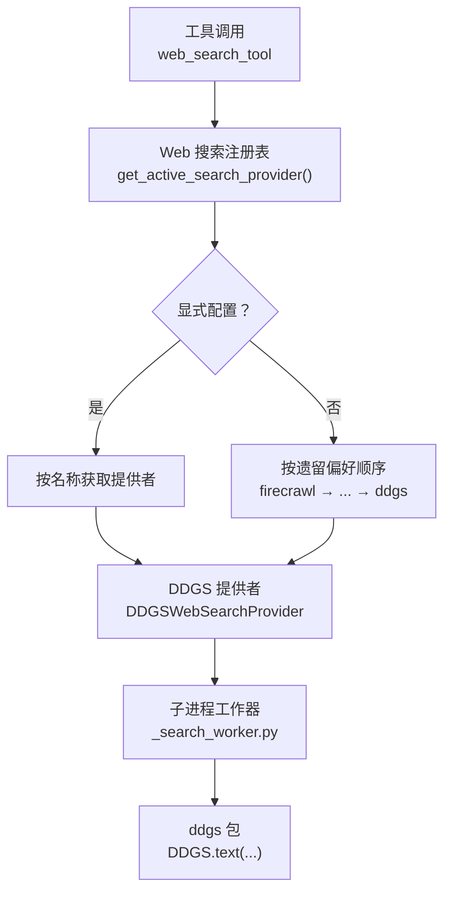
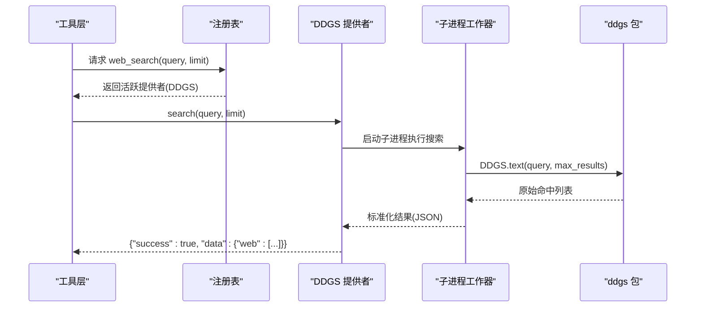
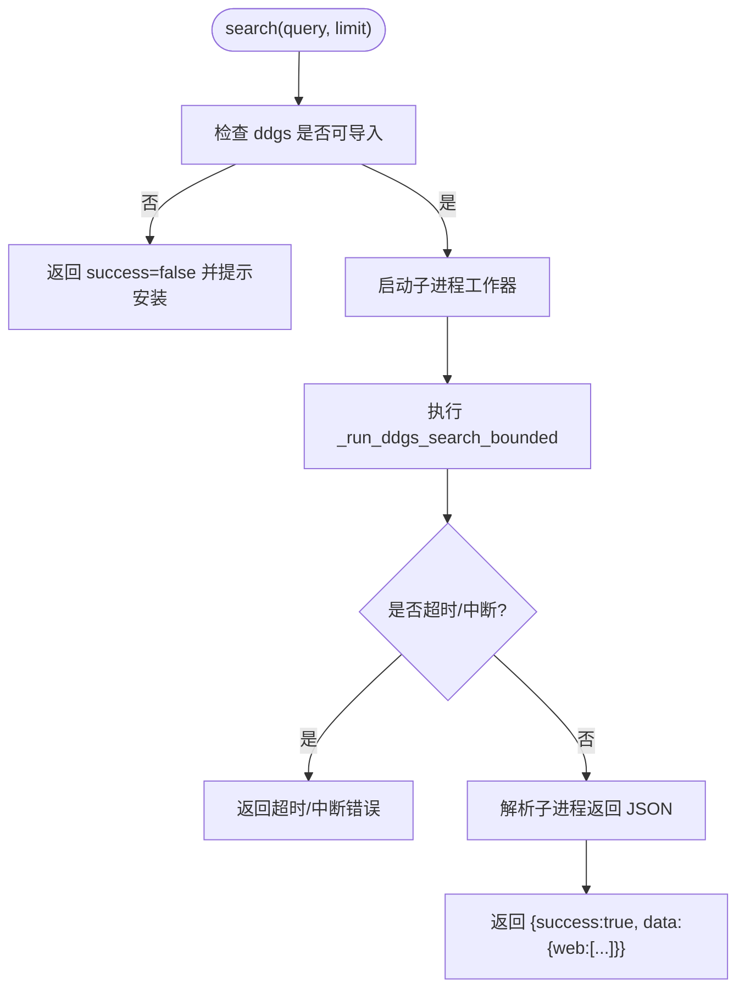
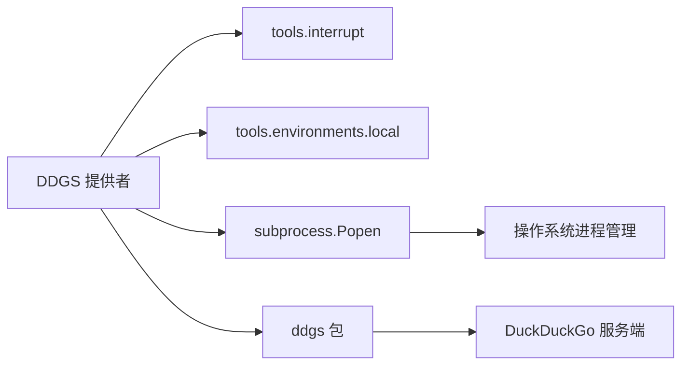
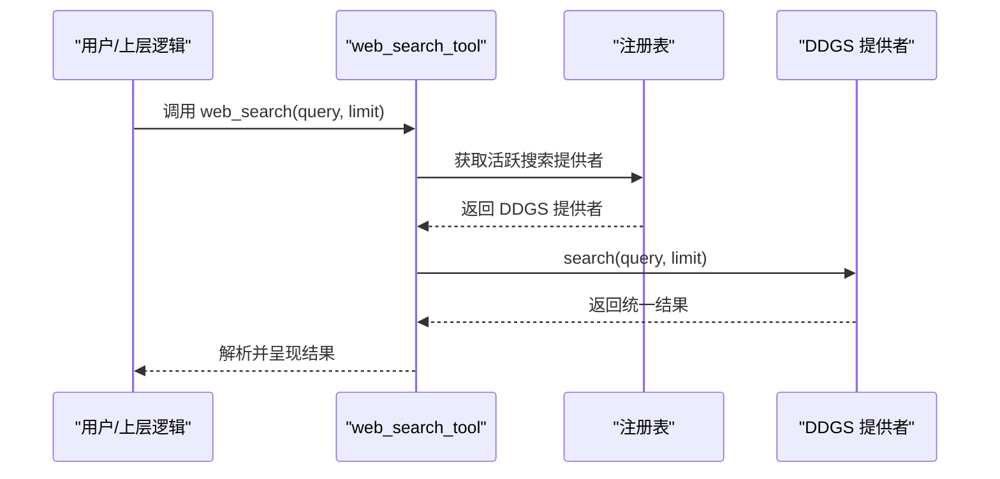

# DDGS 搜索引擎

<cite>
**本文引用的文件**
- [agent/web_search_provider.py](file://agent/web_search_provider.py)
- [agent/web_search_registry.py](file://agent/web_search_registry.py)
- [plugins/web/ddgs/provider.py](file://plugins/web/ddgs/provider.py)
- [hermes_cli/tools_config.py](file://hermes_cli/tools_config.py)
- [tests/plugins/web/test_web_search_provider_plugins.py](file://tests/plugins/web/test_web_search_provider_plugins.py)
- [tools/web_tools.py](file://tools/web_tools.py)
</cite>

## 目录
1. [简介](#简介)
2. [项目结构](#项目结构)
3. [核心组件](#核心组件)
4. [架构总览](#架构总览)
5. [详细组件分析](#详细组件分析)
6. [依赖关系分析](#依赖关系分析)
7. [性能与速率限制](#性能与速率限制)
8. [网络、代理与离线使用](#网络代理与离线使用)
9. [集成示例与错误处理](#集成示例与错误处理)
10. [故障排查指南](#故障排查指南)
11. [结论](#结论)

## 简介
本文件面向在 Hermes Agent 中集成并启用 DDGS（DuckDuckGo Search）的开发者与运维人员，覆盖安装配置、特性说明、查询构建与结果解析、错误处理、速率限制与网络配置、性能优化、调试方法以及离线/受限网络环境下的注意事项。DDGS 作为内置的免费搜索后端，无需 API Key，适合快速启用；其通过子进程隔离执行以避免原生阻塞导致的主进程冻结问题，并提供统一的搜索结果格式。

## 项目结构
Hermes 将“Web 搜索”抽象为可插拔后端，统一由 WebSearchProvider 接口定义，并通过注册表选择当前活跃的后端。DDGS 以插件形式实现该接口，位于 plugins/web/ddgs 下；CLI 提供一键安装与引导；测试覆盖了能力声明、可用性判断与解析策略。

图表来源
- [agent/web_search_registry.py:116-219](file://agent/web_search_registry.py#L116-L219)
- [plugins/web/ddgs/provider.py:267-351](file://plugins/web/ddgs/provider.py#L267-L351)
- [tools/web_tools.py:618-618](file://tools/web_tools.py#L618-L618)

章节来源
- [agent/web_search_registry.py:1-31](file://agent/web_search_registry.py#L1-L31)
- [agent/web_search_provider.py:1-50](file://agent/web_search_provider.py#L1-L50)
- [plugins/web/ddgs/provider.py:1-17](file://plugins/web/ddgs/provider.py#L1-L17)

## 核心组件
- WebSearchProvider 抽象：定义 name、is_available、supports_search/extract、search/extract、get_setup_schema 等统一契约，保证所有后端返回一致的响应形状。
- Web 搜索注册表：负责从配置或遗留偏好顺序解析出当前活跃的搜索后端，并对不可用提供者进行安全降级。
- DDGS 提供者：实现搜索能力，封装 ddgs 包的调用，并以子进程方式运行，避免原生阻塞影响主进程；对外返回标准 JSON 结构。
- CLI 安装引导：在用户首次选择 DDGS 时自动安装 ddgs Python 包，并提示无 API Key 且受服务端限速。
- 测试套件：验证各提供者的能力标志、可用性判定、解析策略与错误响应形状。

章节来源
- [agent/web_search_provider.py:89-212](file://agent/web_search_provider.py#L89-L212)
- [agent/web_search_registry.py:44-219](file://agent/web_search_registry.py#L44-L219)
- [plugins/web/ddgs/provider.py:267-363](file://plugins/web/ddgs/provider.py#L267-L363)
- [hermes_cli/tools_config.py:1861-1881](file://hermes_cli/tools_config.py#L1861-L1881)
- [tests/plugins/web/test_web_search_provider_plugins.py:70-129](file://tests/plugins/web/test_web_search_provider_plugins.py#L70-L129)

## 架构总览
下图展示了从工具调用到最终返回结果的完整流程，包括配置解析、提供者选择、子进程隔离执行与结果标准化。

图表来源
- [tools/web_tools.py:618-618](file://tools/web_tools.py#L618-L618)
- [agent/web_search_registry.py:281-298](file://agent/web_search_registry.py#L281-L298)
- [plugins/web/ddgs/provider.py:303-351](file://plugins/web/ddgs/provider.py#L303-L351)

## 详细组件分析

### WebSearchProvider 抽象
- 职责：定义统一的提供者接口与响应形状，屏蔽不同后端差异。
- 关键点：
  - name/display_name：用于配置与展示。
  - is_available：轻量检查（不发起网络请求）。
  - supports_search/supports_extract：能力开关，供注册表路由。
  - search/extract：默认抛出异常，子类按需实现。
  - get_setup_schema：为“hermes tools”选择器提供元数据与 post_setup 钩子。

章节来源
- [agent/web_search_provider.py:89-212](file://agent/web_search_provider.py#L89-L212)

### Web 搜索注册表
- 职责：根据配置与可用性选择当前活跃提供者。
- 解析优先级：
  1) 显式配置（web.search_backend / web.extract_backend / web.backend），即使不可用也返回以便给出精确错误。
  2) 唯一可用提供者快捷路径。
  3) 遗留偏好顺序过滤可用性（firecrawl → parallel → tavily → exa → searxng → brave-free → ddgs）。
- 健壮性：对 is_available 异常做保护，避免崩溃。

章节来源
- [agent/web_search_registry.py:10-31](file://agent/web_search_registry.py#L10-L31)
- [agent/web_search_registry.py:116-219](file://agent/web_search_registry.py#L116-L219)
- [agent/web_search_registry.py:281-298](file://agent/web_search_registry.py#L281-L298)

### DDGS 提供者（DDGSWebSearchProvider）
- 特点：
  - 无需 API Key，仅依赖 ddgs Python 包。
  - 搜索能力开启，提取能力关闭。
  - 子进程隔离执行，避免原生阻塞导致主进程冻结。
  - 超时控制：整体墙钟时间上限（约 30 秒），防止无限等待。
  - 中断感知：支持工具层中断信号，及时终止子进程。
- 结果形状：遵循统一约定 {"success": True, "data": {"web": [...]}}。
- 安装引导：get_setup_schema 暴露 post_setup="ddgs"，触发 CLI 安装。

图表来源
- [plugins/web/ddgs/provider.py:283-351](file://plugins/web/ddgs/provider.py#L283-L351)
- [plugins/web/ddgs/provider.py:142-265](file://plugins/web/ddgs/provider.py#L142-L265)

章节来源
- [plugins/web/ddgs/provider.py:1-17](file://plugins/web/ddgs/provider.py#L1-L17)
- [plugins/web/ddgs/provider.py:52-77](file://plugins/web/ddgs/provider.py#L52-L77)
- [plugins/web/ddgs/provider.py:142-265](file://plugins/web/ddgs/provider.py#L142-L265)
- [plugins/web/ddgs/provider.py:267-363](file://plugins/web/ddgs/provider.py#L267-L363)

### CLI 安装与引导
- 行为：当用户选择 DDGS 后，若未安装 ddgs 包，则自动通过 pip 安装；安装完成后提示“无需 API Key”，并建议搭配内容提取后端使用。
- 超时与回退：安装过程设置超时，失败时输出手动安装命令。

章节来源
- [hermes_cli/tools_config.py:1861-1881](file://hermes_cli/tools_config.py#L1861-L1881)

### 测试覆盖要点
- 插件发现与能力标志：确认 ddgs 为搜索专用（不支持 extract）。
- 可用性判定：ddgs 仅在包可导入时可用；测试确保 is_available 不会抛异常。
- 解析策略：显式配置优先于可用性；未知名称会回退到可用提供者。

章节来源
- [tests/plugins/web/test_web_search_provider_plugins.py:70-129](file://tests/plugins/web/test_web_search_provider_plugins.py#L70-L129)
- [tests/plugins/web/test_web_search_provider_plugins.py:206-221](file://tests/plugins/web/test_web_search_provider_plugins.py#L206-L221)
- [tests/plugins/web/test_web_search_provider_plugins.py:239-295](file://tests/plugins/web/test_web_search_provider_plugins.py#L239-L295)

## 依赖关系分析
- 运行时依赖：
  - ddgs Python 包：可选依赖，安装后 provider.is_available() 为真。
  - 子进程执行：依赖操作系统进程管理（POSIX session 或 Windows 新进程组）。
- 内部依赖：
  - tools.interrupt：检测中断信号，及时终止子进程。
  - tools.environments.local._sanitize_subprocess_env：清理子进程环境变量。
- 外部服务：
  - DuckDuckGo 服务端：实施速率限制与反爬策略。

图表来源
- [plugins/web/ddgs/provider.py:142-265](file://plugins/web/ddgs/provider.py#L142-L265)
- [plugins/web/ddgs/provider.py:283-295](file://plugins/web/ddgs/provider.py#L283-L295)

章节来源
- [plugins/web/ddgs/provider.py:142-265](file://plugins/web/ddgs/provider.py#L142-L265)
- [plugins/web/ddgs/provider.py:283-295](file://plugins/web/ddgs/provider.py#L283-L295)

## 性能与速率限制
- 超时控制：单次搜索有整体墙钟上限（约 30 秒），避免慢速或限速场景导致主进程长时间阻塞。
- 子进程隔离：每个搜索在独立进程中执行，父进程只轮询通信，避免原生代码持锁导致的死锁。
- 结果限流：传入 safe_limit 限制最大命中数，防止过多结果拖慢后续处理。
- 速率限制：DuckDuckGo 在服务端实施限速；频繁查询可能触发临时限制，建议合理间隔与重试。
- 日志与诊断：记录查询与结果数量，便于定位性能瓶颈。

章节来源
- [plugins/web/ddgs/provider.py:34-46](file://plugins/web/ddgs/provider.py#L34-L46)
- [plugins/web/ddgs/provider.py:303-351](file://plugins/web/ddgs/provider.py#L303-L351)

## 网络、代理与离线使用
- 代理与网络：
  - 子进程继承经清理的环境变量；如需代理，请在宿主环境中配置系统级代理或 HTTP_PROXY/HTTPS_PROXY 等环境变量。
  - 子进程创建时采用平台相关参数以确保进程组与会话隔离，便于终止与回收。
- 离线与受限网络：
  - 若无网络连接或 DuckDuckGo 不可达，搜索将返回错误信息（超时或服务端错误）。
  - 在无网络环境下，建议切换到本地缓存或离线知识库，或暂时禁用 web_search。
- 安装与环境：
  - 首次选择 DDGS 时会尝试安装 ddgs 包；若安装失败，可按提示手动执行 uv pip install -U ddgs。

章节来源
- [plugins/web/ddgs/provider.py:159-199](file://plugins/web/ddgs/provider.py#L159-L199)
- [hermes_cli/tools_config.py:1861-1881](file://hermes_cli/tools_config.py#L1861-L1881)

## 集成示例与错误处理
- 启用步骤：
  1) 在“hermes tools”中选择 DDGS 作为 Web 搜索后端。
  2) 若未安装 ddgs 包，CLI 将自动安装；安装完成后即可使用。
  3) 如需网页内容提取，请另行配置支持 extract 的后端（如 firecrawl、parallel、tavily、exa）。
- 查询构建与调用：
  - 通过 web_search_tool 传入 query 与 limit，框架会自动选择活跃后端并返回统一结果。
- 结果解析：
  - 成功：{"success": True, "data": {"web": [{"title", "url", "description", "position"}, ...]}}
  - 失败：{"success": False, "error": "..."}
- 错误处理建议：
  - 超时/中断：提示稍后重试或切换后端。
  - 包缺失：提示安装 ddgs。
  - 服务端错误：记录日志并提示网络或限速问题。

图表来源
- [tools/web_tools.py:618-618](file://tools/web_tools.py#L618-L618)
- [agent/web_search_registry.py:281-298](file://agent/web_search_registry.py#L281-L298)
- [plugins/web/ddgs/provider.py:303-351](file://plugins/web/ddgs/provider.py#L303-L351)

章节来源
- [tools/web_tools.py:618-618](file://tools/web_tools.py#L618-L618)
- [plugins/web/ddgs/provider.py:303-351](file://plugins/web/ddgs/provider.py#L303-L351)

## 故障排查指南
- 症状：搜索返回空或报错
  - 检查 ddgs 包是否已安装（provider.is_available 应返回真）。
  - 查看日志中的超时或中断提示，评估网络状况与 DuckDuckGo 限速。
- 症状：安装失败
  - 按 CLI 提示手动执行 uv pip install -U ddgs。
  - 检查网络与镜像源，必要时配置代理。
- 症状：主进程卡顿
  - 确认子进程已被正确终止与回收；检查是否存在残留进程。
  - 降低并发查询频率，避免触发服务端限速。
- 症状：配置不生效
  - 确认 web.search_backend 或 web.backend 指向了正确的提供者名称（如 ddgs）。
  - 若配置了不存在或禁用的插件，注册表会回退到可用提供者。

章节来源
- [plugins/web/ddgs/provider.py:283-351](file://plugins/web/ddgs/provider.py#L283-L351)
- [hermes_cli/tools_config.py:1861-1881](file://hermes_cli/tools_config.py#L1861-L1881)
- [agent/web_search_registry.py:116-219](file://agent/web_search_registry.py#L116-L219)

## 结论
DDGS 作为无需 API Key 的免费搜索后端，易于集成且具备完善的隔离与超时机制，适合在 Hermes Agent 中快速启用。结合 CLI 安装引导与统一的结果格式，开发者可以专注于查询构建与结果解析。在生产环境中，建议关注 DuckDuckGo 的服务端限速与网络稳定性，并在受限或离线场景下准备替代方案。