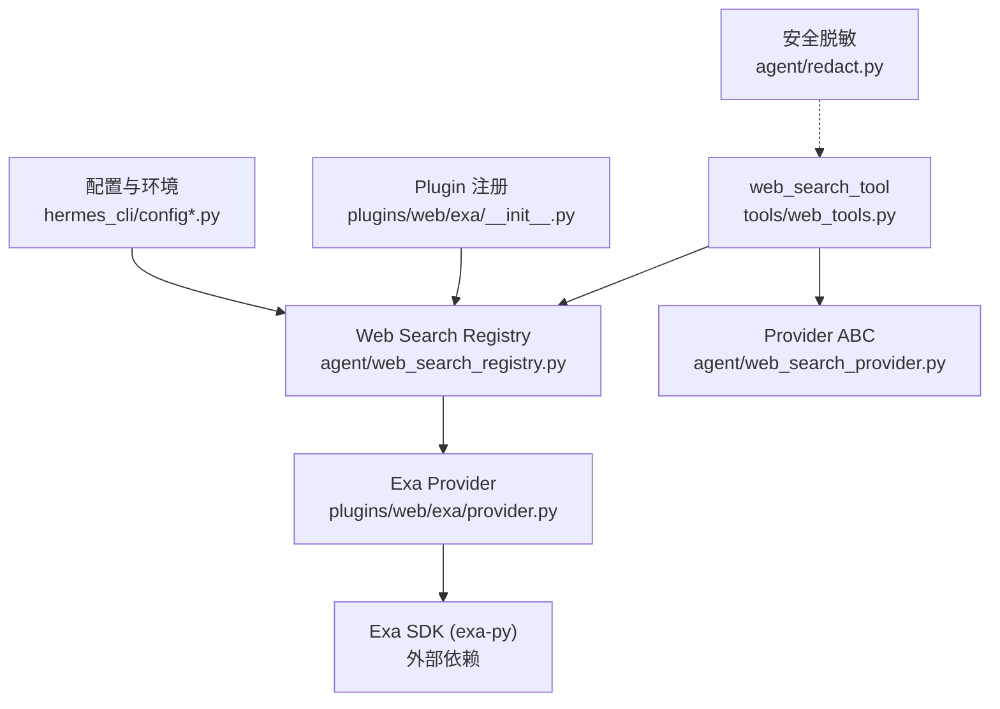
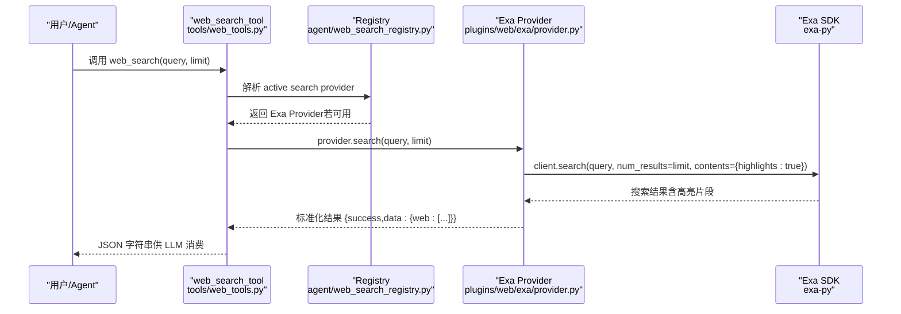
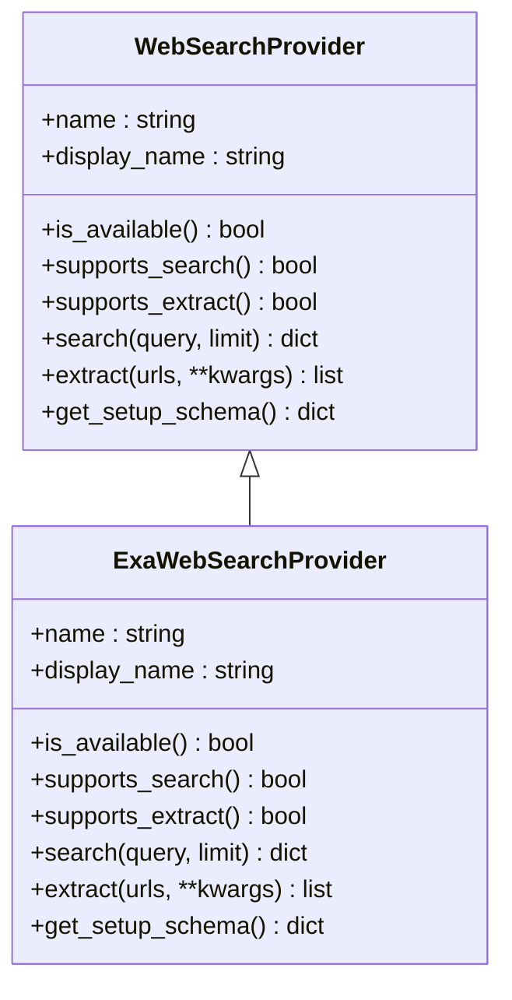
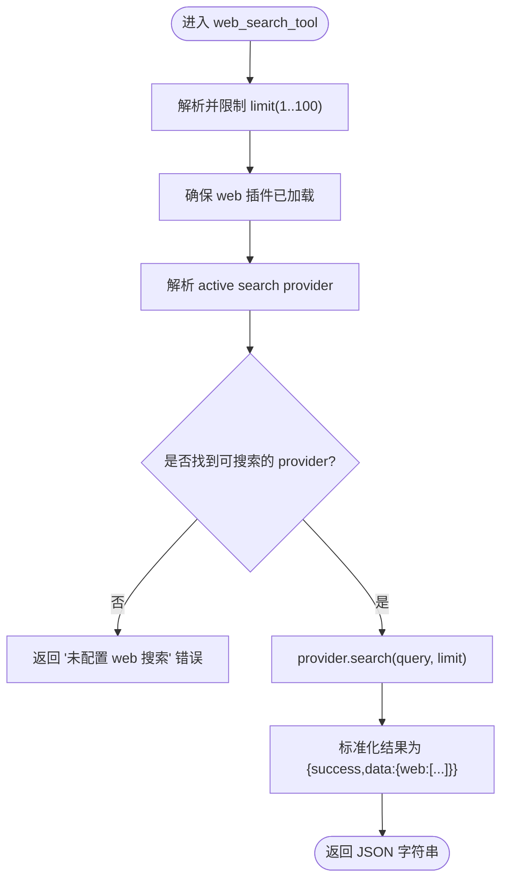
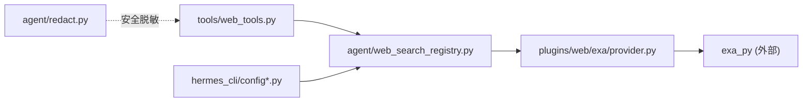

# Exa 搜索引擎

<cite>
**本文引用的文件**
- [plugins/web/exa/provider.py](file://plugins/web/exa/provider.py)
- [plugins/web/exa/__init__.py](file://plugins/web/exa/__init__.py)
- [agent/web_search_provider.py](file://agent/web_search_provider.py)
- [agent/web_search_registry.py](file://agent/web_search_registry.py)
- [tools/web_tools.py](file://tools/web_tools.py)
- [hermes_cli/config_defaults.py](file://hermes_cli/config_defaults.py)
- [hermes_cli/config.py](file://hermes_cli/config.py)
- [hermes_cli/nous_subscription.py](file://hermes_cli/nous_subscription.py)
- [hermes_cli/setup.py](file://hermes_cli/setup.py)
- [agent/redact.py](file://agent/redact.py)
</cite>

## 目录
1. [简介](#简介)
2. [项目结构](#项目结构)
3. [核心组件](#核心组件)
4. [架构总览](#架构总览)
5. [详细组件分析](#详细组件分析)
6. [依赖关系分析](#依赖关系分析)
7. [性能与速率限制](#性能与速率限制)
8. [故障排除指南](#故障排除指南)
9. [结论](#结论)
10. [附录：配置与使用要点](#附录配置与使用要点)

## 简介
本文件面向在 Hermes Agent 中集成并使用 Exa 搜索引擎的读者，系统说明以下主题：
- 如何配置并验证 EXA_API_KEY 环境变量
- Exa 搜索能力（语义/神经检索、内容提取）及与其他后端（Tavily、Parallel、Firecrawl、SearXNG、Brave Free、DuckDuckGo）的差异
- 通过 web_search_tool 调用 Exa 搜索、处理搜索结果格式、优化查询参数
- 错误处理、常见故障定位与排错建议
- 在 Hermes Agent 中的自动检测机制与配置优先级

## 项目结构
Exa 以插件形式提供，遵循统一的 Web Search Provider 抽象。关键路径如下：
- 插件注册入口：plugins/web/exa/__init__.py
- 插件实现：plugins/web/exa/provider.py
- 统一抽象与工具分发：agent/web_search_provider.py、tools/web_tools.py
- 提供者选择与自动发现：agent/web_search_registry.py
- 配置与环境变量来源：hermes_cli/config.py、hermes_cli/config_defaults.py
- 安全脱敏：agent/redact.py

图表来源
- [tools/web_tools.py:618-739](file://tools/web_tools.py#L618-L739)
- [agent/web_search_registry.py:133-219](file://agent/web_search_registry.py#L133-L219)
- [plugins/web/exa/provider.py:87-155](file://plugins/web/exa/provider.py#L87-L155)
- [agent/web_search_provider.py:89-184](file://agent/web_search_provider.py#L89-L184)
- [plugins/web/exa/__init__.py:13-15](file://plugins/web/exa/__init__.py#L13-L15)
- [hermes_cli/config.py:1159,4321:1159-1159](file://hermes_cli/config.py#L1159-L1159)
- [hermes_cli/config_defaults.py:3636](file://hermes_cli/config_defaults.py#L3636-L3636)
- [agent/redact.py:109](file://agent/redact.py#L109-L109)

章节来源
- [tools/web_tools.py:618-739](file://tools/web_tools.py#L618-L739)
- [agent/web_search_registry.py:133-219](file://agent/web_search_registry.py#L133-L219)
- [plugins/web/exa/provider.py:87-155](file://plugins/web/exa/provider.py#L87-L155)
- [agent/web_search_provider.py:89-184](file://agent/web_search_provider.py#L89-L184)
- [plugins/web/exa/__init__.py:13-15](file://plugins/web/exa/__init__.py#L13-L15)
- [hermes_cli/config.py:1159,4321:1159-1159](file://hermes_cli/config.py#L1159-L1159)
- [hermes_cli/config_defaults.py:3636](file://hermes_cli/config_defaults.py#L3636-L3636)
- [agent/redact.py:109](file://agent/redact.py#L109-L109)

## 核心组件
- ExaWebSearchProvider：实现 search() 与 extract()，封装 Exa SDK 调用，返回统一结果格式；支持 is_available() 探测 EXA_API_KEY。
- WebSearchProvider（ABC）：定义 provider 的统一接口与响应契约（search/extract 成功/失败结构）。
- Web Search Registry：负责按配置与可用性解析当前活跃的 provider，维护“显式配置 > 单可用 > 历史偏好”的选择顺序。
- tools.web_tools：对外暴露 web_search_tool / web_extract_tool，完成参数校验、SSRF 防护、截断存储、调试日志等。
- 插件注册：Exa 插件在启动时向 registry 注册自身。

章节来源
- [plugins/web/exa/provider.py:87-217](file://plugins/web/exa/provider.py#L87-L217)
- [agent/web_search_provider.py:22-50](file://agent/web_search_provider.py#L22-L50)
- [agent/web_search_registry.py:10-31](file://agent/web_search_registry.py#L10-L31)
- [tools/web_tools.py:1169-1237](file://tools/web_tools.py#L1169-L1237)
- [plugins/web/exa/__init__.py:13-15](file://plugins/web/exa/__init__.py#L13-L15)

## 架构总览
下图展示从工具调用到 Exa 后端调用的完整链路，包括配置读取、提供者选择、SDK 调用与结果归一化。

图表来源
- [tools/web_tools.py:618-739](file://tools/web_tools.py#L618-L739)
- [agent/web_search_registry.py:133-219](file://agent/web_search_registry.py#L133-L219)
- [plugins/web/exa/provider.py:115-155](file://plugins/web/exa/provider.py#L115-L155)

## 详细组件分析

### Exa 插件与提供者
- 插件注册：在 __init__.py 中注册 ExaWebSearchProvider 实例。
- 提供者能力：
  - name/display_name：标识为 exa/Exa
  - is_available：检查 EXA_API_KEY 是否非空
  - supports_search/supporst_extract：均返回 True
  - search：调用 Exa SDK 执行语义搜索，返回统一结构
  - extract：批量获取页面文本，返回统一结构
  - get_setup_schema：声明需要 EXA_API_KEY 的环境变量提示

图表来源
- [agent/web_search_provider.py:89-212](file://agent/web_search_provider.py#L89-L212)
- [plugins/web/exa/provider.py:87-217](file://plugins/web/exa/provider.py#L87-L217)

章节来源
- [plugins/web/exa/__init__.py:13-15](file://plugins/web/exa/__init__.py#L13-L15)
- [plugins/web/exa/provider.py:87-217](file://plugins/web/exa/provider.py#L87-L217)

### web_search_tool 调用流程
- 参数校验：limit 被限制在 1..100
- 插件加载：确保 web 插件已发现并注册
- 提供者选择：优先按 web.search_backend/web.backend 配置，否则回退到可用 provider 或历史偏好
- 调用 provider.search：得到统一结果结构
- 输出：JSON 字符串，包含 success/data/web 列表

图表来源
- [tools/web_tools.py:618-739](file://tools/web_tools.py#L618-L739)
- [agent/web_search_registry.py:133-219](file://agent/web_search_registry.py#L133-L219)

章节来源
- [tools/web_tools.py:618-739](file://tools/web_tools.py#L618-L739)
- [agent/web_search_registry.py:133-219](file://agent/web_search_registry.py#L133-L219)

### 搜索结果格式与处理
- 搜索返回结构：
  - success: true/false
  - data.web: 数组，每项包含 url/title/description/position
- 提取返回结构：
  - results: 数组，每项包含 url/title/content/raw_content/metadata/error（可选）
- 大页处理：超过字符预算的页面会被 head+tail 截断，并将全文保存到缓存目录，同时在结果中给出 read_file 指示行号与路径

章节来源
- [agent/web_search_provider.py:22-50](file://agent/web_search_provider.py#L22-L50)
- [tools/web_tools.py:516-576](file://tools/web_tools.py#L516-L576)
- [tools/web_tools.py:973-1035](file://tools/web_tools.py#L973-L1035)

### 配置与环境变量
- 环境变量：EXA_API_KEY
  - 来源：进程环境或 Hermes 配置层（config/.env），由 get_provider_env 统一读取
  - 验证：is_available() 会检查该键是否存在且非空
- 配置优先级（选择活跃 provider）：
  1) web.search_backend / web.extract_backend（按能力覆盖）
  2) web.backend（共享回退）
  3) 仅一个可用 provider 时直接选用
  4) 历史偏好顺序：firecrawl → parallel → tavily → exa → searxng → brave-free → ddgs
  5) 否则无可用 provider，工具返回引导错误
- 工具元数据：requires_env 包含 EXA_API_KEY 等，用于工具启用开关

章节来源
- [agent/web_search_provider.py:59-81](file://agent/web_search_provider.py#L59-L81)
- [agent/web_search_registry.py:10-31](file://agent/web_search_registry.py#L10-L31)
- [agent/web_search_registry.py:116-130](file://agent/web_search_registry.py#L116-L130)
- [tools/web_tools.py:223-308](file://tools/web_tools.py#L223-L308)
- [tools/web_tools.py:379-401](file://tools/web_tools.py#L379-L401)
- [hermes_cli/config.py:1159,4321:1159-1159](file://hermes_cli/config.py#L1159-L1159)
- [hermes_cli/config_defaults.py:3636](file://hermes_cli/config_defaults.py#L3636-L3636)

### 自动检测与配置优先级（Hermes Agent）
- 自动检测：当未显式配置 backend 时，系统按历史偏好顺序扫描已注册的 provider 及其 is_available()，从而自动选择具备凭据的后端（如设置了 EXA_API_KEY 则可能选中 exa）。
- 显式配置优先：若设置 web.search_backend/web.extract_backend/web.backend，将优先使用该名称对应的 provider（即使其 is_available 为假，也会在下层给出更精确的错误信息）。
- 插件禁用提示：若配置的 backend 对应内置插件被禁用，工具会明确提示重新启用插件。

章节来源
- [agent/web_search_registry.py:133-219](file://agent/web_search_registry.py#L133-L219)
- [tools/web_tools.py:678-716](file://tools/web_tools.py#L678-L716)

### 与其他搜索引擎的区别
- Exa：语义/神经检索，支持 highlights；同时提供内容提取（text=True）
- Tavily/Parallel/Firecrawl：同样提供搜索与提取，但各自 API 与行为不同
- SearXNG/Brave Free/DuckDuckGo：多为搜索能力，不一定支持提取
- 选择策略：默认历史偏好中 paid 优先，便于已有付费凭据的用户保持行为一致

章节来源
- [agent/web_search_registry.py:116-130](file://agent/web_search_registry.py#L116-L130)
- [plugins/web/exa/provider.py:115-155](file://plugins/web/exa/provider.py#L115-L155)

## 依赖关系分析
- tools/web_tools 依赖 agent/web_search_registry 进行 provider 解析
- agent/web_search_registry 依赖各 provider 的 is_available()/supports_* 能力
- plugins/web/exa/provider 依赖 exa_py SDK（懒加载）
- hermes_cli 配置模块提供环境变量读取与默认值

图表来源
- [tools/web_tools.py:618-739](file://tools/web_tools.py#L618-L739)
- [agent/web_search_registry.py:133-219](file://agent/web_search_registry.py#L133-L219)
- [plugins/web/exa/provider.py:41-77](file://plugins/web/exa/provider.py#L41-L77)
- [hermes_cli/config.py:1159,4321:1159-1159](file://hermes_cli/config.py#L1159-L1159)
- [hermes_cli/config_defaults.py:3636](file://hermes_cli/config_defaults.py#L3636-L3636)
- [agent/redact.py:109](file://agent/redact.py#L109-L109)

章节来源
- [tools/web_tools.py:618-739](file://tools/web_tools.py#L618-L739)
- [agent/web_search_registry.py:133-219](file://agent/web_search_registry.py#L133-L219)
- [plugins/web/exa/provider.py:41-77](file://plugins/web/exa/provider.py#L41-L77)
- [hermes_cli/config.py:1159,4321:1159-1159](file://hermes_cli/config.py#L1159-L1159)
- [hermes_cli/config_defaults.py:3636](file://hermes_cli/config_defaults.py#L3636-L3636)
- [agent/redact.py:109](file://agent/redact.py#L109-L109)

## 性能与速率限制
- 本地性能
  - 插件懒加载：仅在首次调用时导入 exa-py，避免冷启动开销
  - 客户端缓存：模块级缓存 _exa_client，减少重复初始化
  - 大页截断：web_extract 对超长页面进行 head+tail 截断，避免上下文爆炸
- 上游速率限制
  - 代码库未内置针对 Exa 的专用重试/退避逻辑；若遇到上游限流，建议在应用层（上层调度器或任务编排）实现指数退避与重试
  - 可通过降低 limit、拆分请求、错峰调用等方式缓解瞬时压力

章节来源
- [plugins/web/exa/provider.py:41-77](file://plugins/web/exa/provider.py#L41-L77)
- [tools/web_tools.py:516-576](file://tools/web_tools.py#L516-L576)

## 故障排除指南
- 未配置 EXA_API_KEY
  - 现象：search/extract 返回 success=false，error 提示缺少环境变量
  - 解决：设置 EXA_API_KEY（进程环境或 Hermes 配置层）
- SDK 未安装
  - 现象：ImportError 提示未安装 Exa SDK
  - 解决：安装 search.exa 相关依赖（懒加载会在缺失时报错）
- 插件被禁用
  - 现象：配置了 web.search_backend/web.extract_backend 但工具仍报“未配置”
  - 解决：重新启用对应插件（hermes plugins enable ...）
- SSRF/敏感 URL 拦截
  - 现象：web_extract 拒绝包含内部地址或敏感参数的 URL
  - 解决：清理 URL 或使用浏览器工具访问受限资源
- 密钥泄露防护
  - 现象：错误消息或日志中不应出现真实密钥
  - 说明：redact 规则包含对 exa_* 类密钥的匹配与脱敏

章节来源
- [plugins/web/exa/provider.py:148-155](file://plugins/web/exa/provider.py#L148-L155)
- [tools/web_tools.py:775-817](file://tools/web_tools.py#L775-L817)
- [agent/redact.py:109](file://agent/redact.py#L109-L109)

## 结论
Exa 在 Hermes Agent 中以插件形式提供，具备语义搜索与内容提取能力。通过统一的 Web Search Provider 抽象与 Registry 选择机制，Exa 可与其它后端共存并按配置/可用性自动选择。正确设置 EXA_API_KEY、理解配置优先级与结果格式，即可稳定使用 web_search_tool 与 web_extract_tool。对于上游速率限制，建议在上层实现重试与退避策略。

## 附录：配置与使用要点
- 环境变量
  - EXA_API_KEY：Exa 服务认证密钥
  - 读取方式：通过 get_provider_env 统一读取（进程环境或 Hermes 配置层）
- 配置键
  - web.search_backend：指定搜索后端（如 "exa"）
  - web.extract_backend：指定提取后端（如 "exa"）
  - web.backend：共享回退后端
- 工具参数
  - web_search：query（必填）、limit（1..100，默认 5）
  - web_extract：urls（最多 5）、char_limit（默认约 15000，可调）
- 结果字段
  - 搜索：data.web 每项包含 url/title/description/position
  - 提取：results 每项包含 url/title/content/raw_content/metadata/error
- 最佳实践
  - 使用精准查询词与限定符（如 site:、filetype:、intitle:、“精确短语”）以提升相关性
  - 控制 limit 与 char_limit，平衡成本与上下文大小
  - 对超大页面采用截断+read_file 分页阅读
  - 避免在 URL 中携带敏感参数，防止被安全策略拦截

章节来源
- [agent/web_search_provider.py:59-81](file://agent/web_search_provider.py#L59-L81)
- [tools/web_tools.py:1169-1237](file://tools/web_tools.py#L1169-L1237)
- [tools/web_tools.py:223-308](file://tools/web_tools.py#L223-L308)
- [hermes_cli/config.py:1159,4321:1159-1159](file://hermes_cli/config.py#L1159-L1159)
- [hermes_cli/config_defaults.py:3636](file://hermes_cli/config_defaults.py#L3636-L3636)
- [hermes_cli/setup.py:447](file://hermes_cli/setup.py#L447-L447)
- [hermes_cli/nous_subscription.py:426,892:426-426](file://hermes_cli/nous_subscription.py#L426-L426)