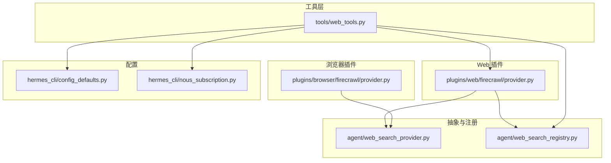
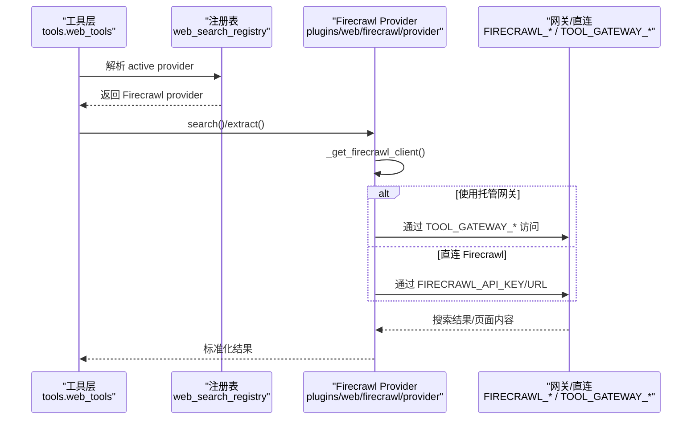
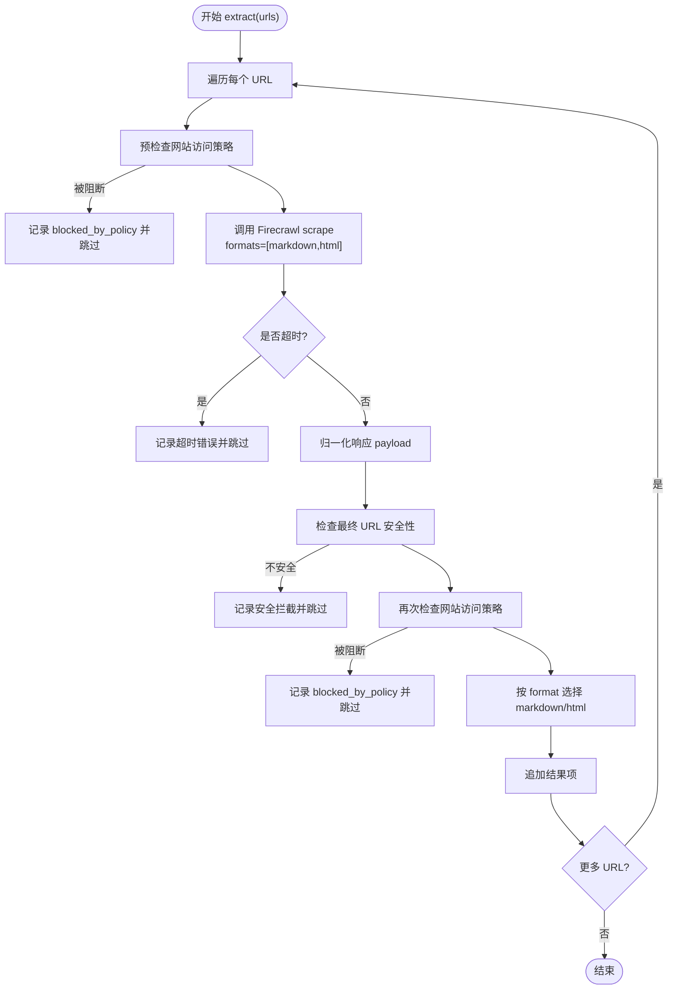
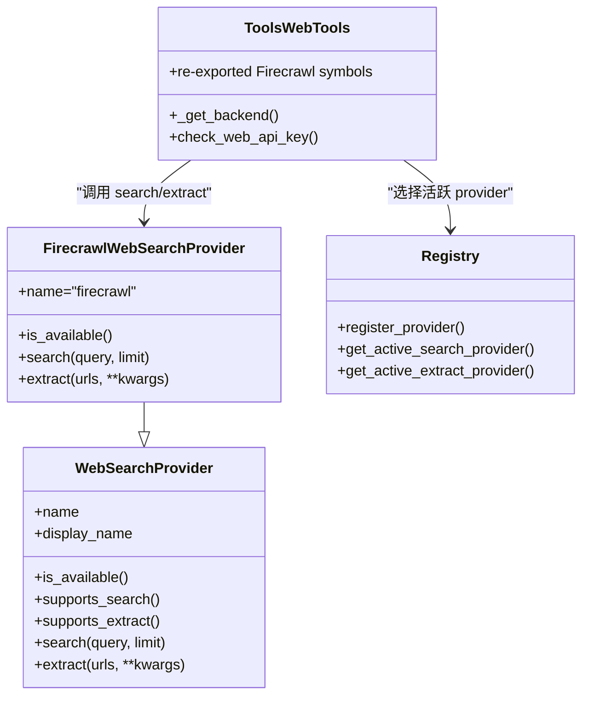

# Firecrawl 搜索引擎

<cite>
**本文引用的文件**
- [plugins/web/firecrawl/provider.py](file://plugins/web/firecrawl/provider.py)
- [plugins/browser/firecrawl/provider.py](file://plugins/browser/firecrawl/provider.py)
- [agent/web_search_provider.py](file://agent/web_search_provider.py)
- [agent/web_search_registry.py](file://agent/web_search_registry.py)
- [tools/web_tools.py](file://tools/web_tools.py)
- [hermes_cli/config_defaults.py](file://hermes_cli/config_defaults.py)
- [hermes_cli/nous_subscription.py](file://hermes_cli/nous_subscription.py)
</cite>

## 目录
1. [简介](#简介)
2. [项目结构](#项目结构)
3. [核心组件](#核心组件)
4. [架构总览](#架构总览)
5. [详细组件分析](#详细组件分析)
6. [依赖关系分析](#依赖关系分析)
7. [性能与调优](#性能与调优)
8. [故障排查指南](#故障排查指南)
9. [结论](#结论)
10. [附录：配置示例](#附录配置示例)

## 简介
本文件面向 Hermes Agent 中 Firecrawl 搜索引擎集成的使用与排障，重点说明双重配置模式（直接使用 FIRECRAWL_API_KEY 或通过 Nous 托管的工具网关），并覆盖网页抓取、内容提取、结构化数据获取等能力。文档同时给出代理/超时/重试的配置建议、与 Hermes 的集成要点（内容压缩、缓存策略、错误恢复）、性能调优与常见问题解决方案。

## 项目结构
Firecrawl 在 Hermes 中以“插件 + 注册表”的方式接入：
- Web 搜索与内容提取：由 web 插件提供，实现 WebSearchProvider 接口，并通过注册表选择活跃后端。
- 浏览器云会话：由 browser 插件提供，用于远程浏览器执行（与 web 插件不同端点）。
- 工具层：tools.web_tools 作为统一入口，负责后端选择、客户端构造、响应归一化与调试输出。
- 配置层：通过 config.yaml 与环境变量控制行为；Nous 订阅可通过 use_gateway 切换至托管网关。

图表来源
- [plugins/web/firecrawl/provider.py:1-618](file://plugins/web/firecrawl/provider.py#L1-L618)
- [plugins/browser/firecrawl/provider.py:1-175](file://plugins/browser/firecrawl/provider.py#L1-L175)
- [agent/web_search_provider.py:1-212](file://agent/web_search_provider.py#L1-L212)
- [agent/web_search_registry.py:1-305](file://agent/web_search_registry.py#L1-L305)
- [tools/web_tools.py:1-400](file://tools/web_tools.py#L1-L400)
- [hermes_cli/config_defaults.py:3668-3692](file://hermes_cli/config_defaults.py#L3668-L3692)
- [hermes_cli/nous_subscription.py:414-474](file://hermes_cli/nous_subscription.py#L414-L474)

章节来源
- [plugins/web/firecrawl/provider.py:1-618](file://plugins/web/firecrawl/provider.py#L1-L618)
- [plugins/browser/firecrawl/provider.py:1-175](file://plugins/browser/firecrawl/provider.py#L1-L175)
- [agent/web_search_provider.py:1-212](file://agent/web_search_provider.py#L1-L212)
- [agent/web_search_registry.py:1-305](file://agent/web_search_registry.py#L1-L305)
- [tools/web_tools.py:1-400](file://tools/web_tools.py#L1-L400)
- [hermes_cli/config_defaults.py:3668-3692](file://hermes_cli/config_defaults.py#L3668-L3692)
- [hermes_cli/nous_subscription.py:414-474](file://hermes_cli/nous_subscription.py#L414-L474)

## 核心组件
- FirecrawlWebSearchProvider：实现搜索与提取，支持直接 API 与 Nous 托管网关双路径，内置 60s 超时、SSRF 重检、网站访问策略检查、格式选择（markdown/html）。
- FirecrawlBrowserProvider：管理云端浏览器会话生命周期（创建/关闭/紧急清理），走 /v2/browser 端点。
- WebSearchProvider/Registry：抽象接口与提供者注册、选择逻辑（显式配置 > 单提供者快捷 > 历史偏好顺序）。
- tools.web_tools：统一工具入口，负责后端选择、客户端缓存、环境变量读取、调试日志与错误包装。

章节来源
- [plugins/web/firecrawl/provider.py:370-618](file://plugins/web/firecrawl/provider.py#L370-L618)
- [plugins/browser/firecrawl/provider.py:44-175](file://plugins/browser/firecrawl/provider.py#L44-L175)
- [agent/web_search_provider.py:89-212](file://agent/web_search_provider.py#L89-L212)
- [agent/web_search_registry.py:133-219](file://agent/web_search_registry.py#L133-L219)
- [tools/web_tools.py:223-352](file://tools/web_tools.py#L223-L352)

## 架构总览
Hermes 调用 web_search/web_extract 时，先由 tools.web_tools 解析当前后端（优先显式配置，其次自动探测），再路由到对应 provider。Firecrawl provider 内部根据是否启用 use_gateway 或是否存在 direct 凭据，决定直连 Firecrawl 或经由 Nous Tool Gateway。

图表来源
- [tools/web_tools.py:223-352](file://tools/web_tools.py#L223-L352)
- [agent/web_search_registry.py:133-219](file://agent/web_search_registry.py#L133-L219)
- [plugins/web/firecrawl/provider.py:212-265](file://plugins/web/firecrawl/provider.py#L212-L265)

## 详细组件分析

### Firecrawl 双重配置模式
- 直接模式：设置 FIRECRAWL_API_KEY（或 FIRECRAWL_API_URL 指向自托管实例）。
- 托管网关模式：通过 Nous 订阅，设置 TOOL_GATEWAY_DOMAIN/SCHEME/USER_TOKEN 或 FIRECRAWL_GATEWAY_URL，并在配置中启用 use_gateway。

关键行为
- 当同时存在 direct 与 gateway 配置时，若 web.use_gateway 为真则优先走托管网关；否则优先直连。
- 客户端构造会缓存于 tools.web_tools 模块级变量，避免重复初始化。
- 可用性检测 check_firecrawl_api_key 会同时考虑 direct 与 gateway 路径。

章节来源
- [plugins/web/firecrawl/provider.py:123-177](file://plugins/web/firecrawl/provider.py#L123-L177)
- [plugins/web/firecrawl/provider.py:212-265](file://plugins/web/firecrawl/provider.py#L212-L265)
- [tools/web_tools.py:379-400](file://tools/web_tools.py#L379-L400)
- [hermes_cli/config_defaults.py:3668-3692](file://hermes_cli/config_defaults.py#L3668-L3692)
- [hermes_cli/nous_subscription.py:414-474](file://hermes_cli/nous_subscription.py#L414-L474)

### 搜索与提取流程
- 搜索：调用 client.search(query, limit)，对 SDK/direct/gateway 多种响应形状进行归一化，返回标准列表。
- 提取：按 URL 逐个抓取，默认请求 markdown+html，优先返回 markdown；每步包含：
  - 网站访问策略检查（pre/post redirect）
  - SSRF 安全检查（最终 URL 重检）
  - 60s 超时保护（异步线程封装）
  - 异常捕获并以 per-URL 错误项返回，不中断整体批量

图表来源
- [plugins/web/firecrawl/provider.py:423-600](file://plugins/web/firecrawl/provider.py#L423-L600)

章节来源
- [plugins/web/firecrawl/provider.py:321-363](file://plugins/web/firecrawl/provider.py#L321-L363)
- [plugins/web/firecrawl/provider.py:391-421](file://plugins/web/firecrawl/provider.py#L391-L421)
- [plugins/web/firecrawl/provider.py:423-600](file://plugins/web/firecrawl/provider.py#L423-L600)

### 浏览器云会话（可选）
- 通过 /v2/browser 创建会话，携带 TTL；关闭/紧急清理均调用删除端点。
- 仅依赖 FIRECRAWL_API_KEY/FIRECRAWL_API_URL，独立于 web 插件。

章节来源
- [plugins/browser/firecrawl/provider.py:44-175](file://plugins/browser/firecrawl/provider.py#L44-L175)

### 与 Hermes 的深度集成
- 内容压缩：web_tools 头部注释表明会使用 LLM 对提取内容进行摘要以减少 token 使用（具体压缩逻辑位于上层处理管线）。
- 缓存策略：Firecrawl 客户端在 tools.web_tools 中缓存，避免重复初始化；provider 内部对响应做轻量归一化。
- 错误恢复：
  - 搜索/提取失败以结构化错误返回，便于上层重试或降级。
  - 提取过程对单个 URL 的错误隔离，不影响其他 URL。
  - 超时保护防止长尾请求阻塞。

章节来源
- [tools/web_tools.py:1-37](file://tools/web_tools.py#L1-L37)
- [tools/web_tools.py:77-99](file://tools/web_tools.py#L77-L99)
- [plugins/web/firecrawl/provider.py:423-600](file://plugins/web/firecrawl/provider.py#L423-L600)

## 依赖关系分析
- 插件与抽象：FirecrawlWebSearchProvider 继承 WebSearchProvider，并通过 web_search_registry 注册与选择。
- 工具层耦合：tools.web_tools 通过 re-export 暴露 Firecrawl 相关符号，保持向后兼容。
- 配置依赖：config_defaults 定义受管环境变量键；nous_subscription 中的 use_gateway 影响后端选择。

图表来源
- [agent/web_search_provider.py:89-212](file://agent/web_search_provider.py#L89-L212)
- [plugins/web/firecrawl/provider.py:370-618](file://plugins/web/firecrawl/provider.py#L370-L618)
- [agent/web_search_registry.py:48-91](file://agent/web_search_registry.py#L48-L91)
- [tools/web_tools.py:77-99](file://tools/web_tools.py#L77-L99)

章节来源
- [agent/web_search_provider.py:89-212](file://agent/web_search_provider.py#L89-L212)
- [agent/web_search_registry.py:48-91](file://agent/web_search_registry.py#L48-L91)
- [tools/web_tools.py:77-99](file://tools/web_tools.py#L77-L99)
- [plugins/web/firecrawl/provider.py:370-618](file://plugins/web/firecrawl/provider.py#L370-L618)

## 性能与调优
- 超时设置
  - 提取单次抓取默认 60s 超时，适合大多数页面；超大页面可考虑改用浏览器导航方式。
  - 浏览器会话创建/关闭分别设置 30s/10s/5s 超时，避免长时间阻塞。
- 并发与并行
  - 提取按 URL 串行处理，但每个抓取在后台线程执行，避免阻塞事件循环；如需更高吞吐，可在调用方分批并发。
- 缓存
  - Firecrawl 客户端在工具层缓存，减少重复初始化开销；如需切换配置，请重置缓存（测试场景常用）。
- 网络与代理
  - 直连模式：通过系统/HTTP 代理环境变量生效（如 HTTP_PROXY/HTTPS_PROXY），或由底层 SDK 处理。
  - 托管网关模式：通过 TOOL_GATEWAY_* 或 FIRECRAWL_GATEWAY_URL 指定网关地址；代理策略由网关侧或运行时环境决定。
- 重试机制
  - 代码未内建指数退避重试；建议在调用层对瞬时错误（网络抖动、限流）实施重试，并结合业务幂等性。
- 内容大小与格式
  - 默认请求 markdown+html，优先返回 markdown；若仅需 HTML，可传入 format=html 减少传输量。
- 安全与策略
  - 每次抓取前后均进行网站访问策略检查与 SSRF 校验，避免误访问内网或受限站点。

章节来源
- [plugins/web/firecrawl/provider.py:423-600](file://plugins/web/firecrawl/provider.py#L423-L600)
- [plugins/browser/firecrawl/provider.py:81-157](file://plugins/browser/firecrawl/provider.py#L81-L157)
- [tools/web_tools.py:77-99](file://tools/web_tools.py#L77-L99)

## 故障排查指南
- 无法选择 Firecrawl 后端
  - 检查是否设置了 FIRECRAWL_API_KEY 或 FIRECRAWL_API_URL，或已启用 use_gateway 且配置了 TOOL_GATEWAY_*。
  - 确认 web.search_backend/web.extract_backend/web.backend 配置正确；若未设置，将按历史偏好顺序自动选择。
- 搜索/提取报错
  - 查看返回的错误字段；提取中对单个 URL 的错误不会中断整体流程，定位具体 URL 即可。
  - 超时错误提示建议改用浏览器导航；SSRF 拦截表示目标为私有/内网地址。
- 托管网关不可用
  - 检查 TOOL_GATEWAY_DOMAIN/SCHEME/USER_TOKEN 或 FIRECRAWL_GATEWAY_URL 是否正确。
  - 确认订阅状态与权限；use_gateway 为真时会优先走网关。
- 浏览器会话问题
  - 创建/关闭失败时检查 FIRECRAWL_API_KEY 与网络连通性；必要时开启调试日志。

章节来源
- [tools/web_tools.py:223-352](file://tools/web_tools.py#L223-L352)
- [plugins/web/firecrawl/provider.py:423-600](file://plugins/web/firecrawl/provider.py#L423-L600)
- [plugins/browser/firecrawl/provider.py:81-157](file://plugins/browser/firecrawl/provider.py#L81-L157)
- [hermes_cli/config_defaults.py:3668-3692](file://hermes_cli/config_defaults.py#L3668-L3692)
- [hermes_cli/nous_subscription.py:414-474](file://hermes_cli/nous_subscription.py#L414-L474)

## 结论
Firecrawl 在 Hermes 中以插件形式提供强大的搜索与内容提取能力，并支持直连与 Nous 托管网关两种模式。通过统一的工具层与注册表，Hermes 能灵活选择后端、缓存客户端、规范化响应并保障安全与稳定性。结合合理的超时、重试与格式选择策略，可在保证质量的同时获得良好性能。

## 附录：配置示例
以下为常见配置场景（以键名与用途为主，不含具体密钥值）：

- 直连 Firecrawl
  - 环境变量：FIRECRAWL_API_KEY、FIRECRAWL_API_URL（可选，指向自托管）
  - 配置：web.backend 或 web.search_backend/web.extract_backend 设为 firecrawl
  - 适用：拥有自有 Firecrawl 账号或自建实例

- 托管网关（Nous 订阅）
  - 环境变量：TOOL_GATEWAY_DOMAIN、TOOL_GATEWAY_SCHEME、TOOL_GATEWAY_USER_TOKEN 或 FIRECRAWL_GATEWAY_URL
  - 配置：web.use_gateway=true（或在订阅流程中启用）
  - 适用：希望统一管理凭据与流量，走 Nous 托管网关

- 浏览器云会话（可选）
  - 环境变量：FIRECRAWL_API_KEY、FIRECRAWL_API_URL、FIRECRAWL_BROWSER_TTL（可选）
  - 适用：需要远程浏览器执行的任务

- 代理与网络
  - 直连模式：通过系统/HTTP 代理环境变量生效（如 HTTP_PROXY/HTTPS_PROXY）
  - 托管网关：通过 TOOL_GATEWAY_* 指定网关地址；代理策略由网关或运行环境决定

- 超时与重试
  - 提取默认 60s 超时；浏览器会话创建/关闭分别设置 30s/10s/5s 超时
  - 建议在调用层对瞬时错误实施重试（结合业务幂等性）

章节来源
- [plugins/web/firecrawl/provider.py:123-177](file://plugins/web/firecrawl/provider.py#L123-L177)
- [plugins/web/firecrawl/provider.py:423-600](file://plugins/web/firecrawl/provider.py#L423-L600)
- [plugins/browser/firecrawl/provider.py:81-157](file://plugins/browser/firecrawl/provider.py#L81-L157)
- [tools/web_tools.py:379-400](file://tools/web_tools.py#L379-L400)
- [hermes_cli/config_defaults.py:3668-3692](file://hermes_cli/config_defaults.py#L3668-L3692)
- [hermes_cli/nous_subscription.py:414-474](file://hermes_cli/nous_subscription.py#L414-L474)