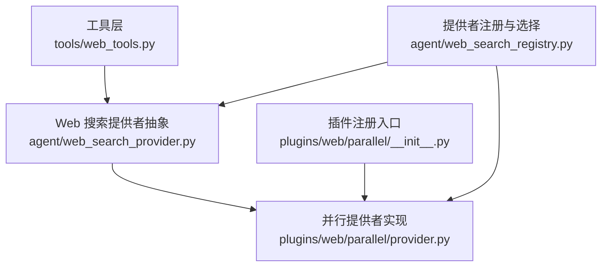
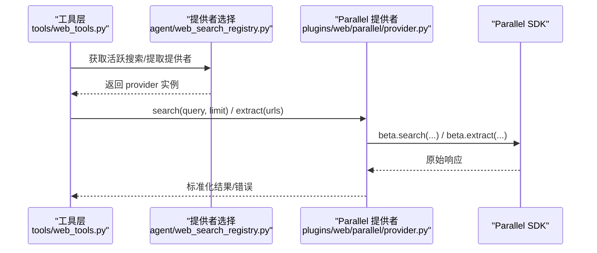
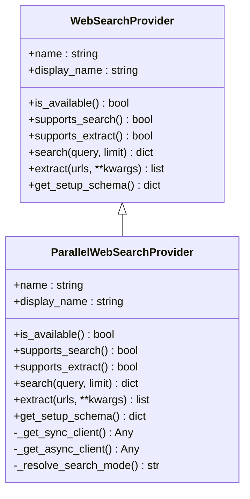
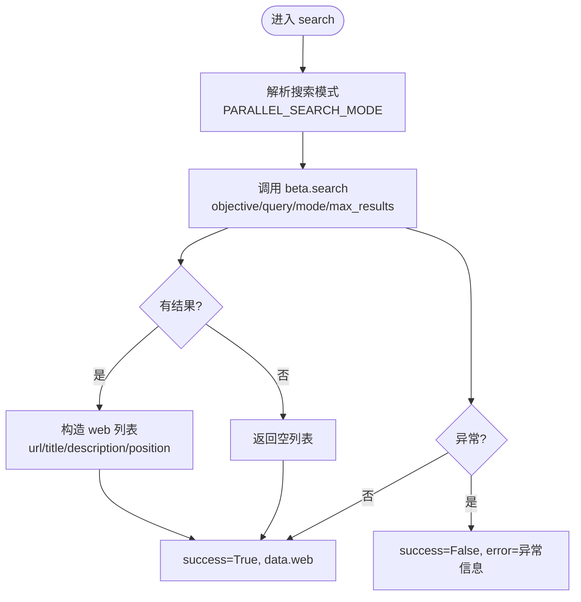
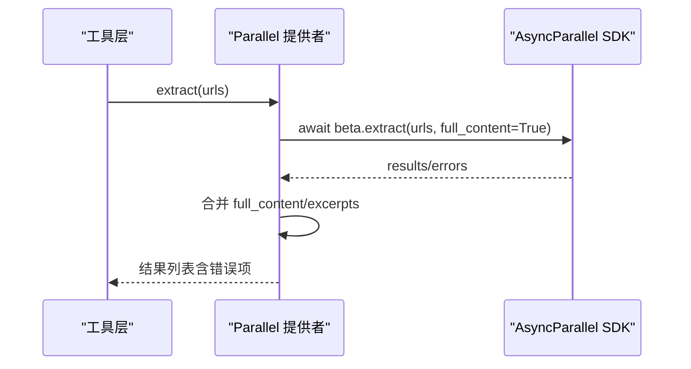
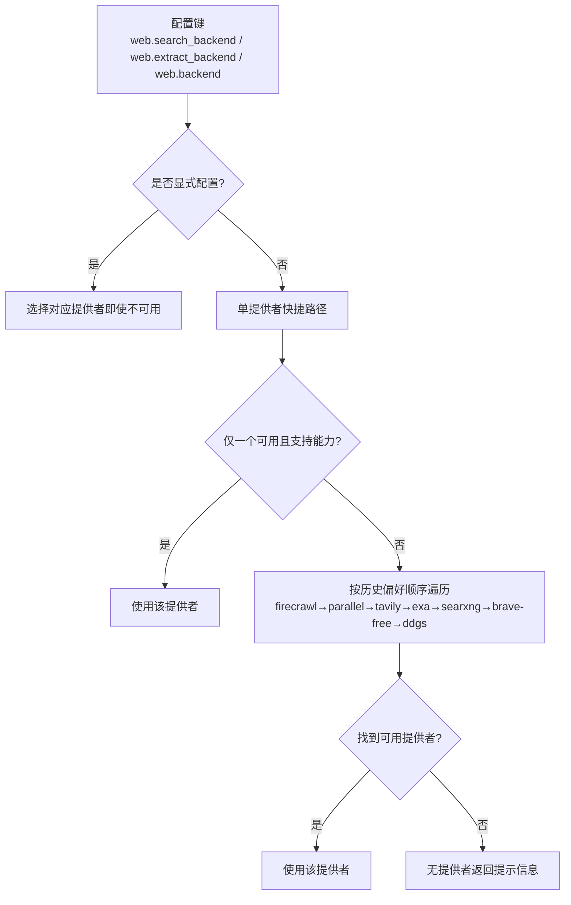
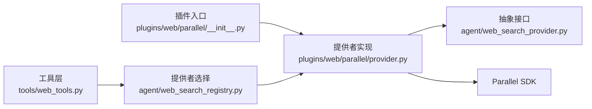
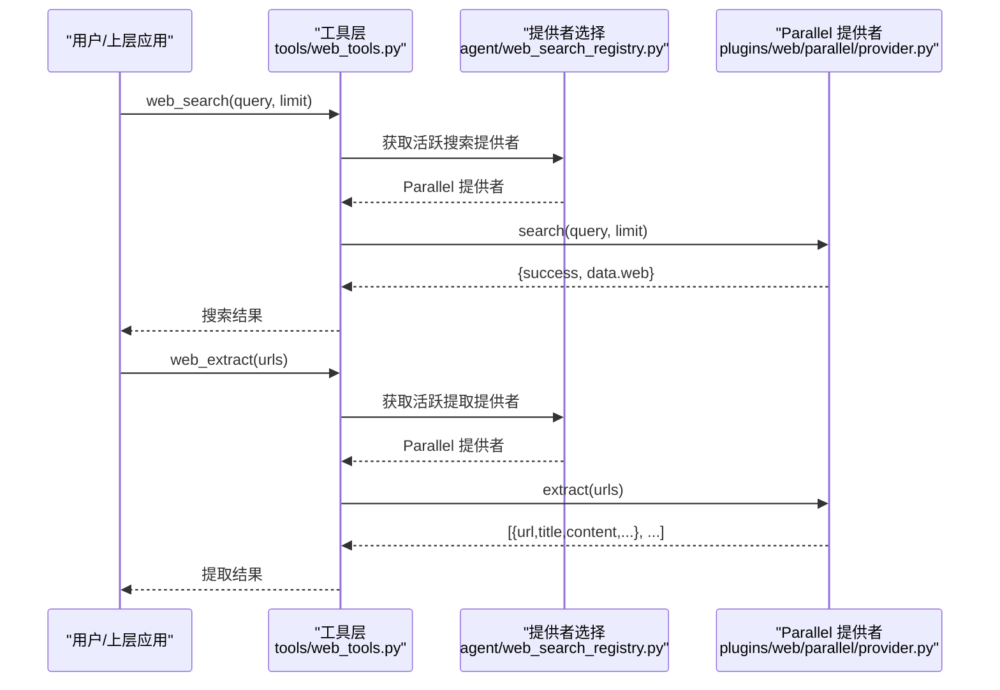

# Parallel 搜索引擎

<cite>
**本文引用的文件**
- [plugins/web/parallel/provider.py](file://plugins/web/parallel/provider.py)
- [plugins/web/parallel/__init__.py](file://plugins/web/parallel/__init__.py)
- [agent/web_search_provider.py](file://agent/web_search_provider.py)
- [agent/web_search_registry.py](file://agent/web_search_registry.py)
- [tools/web_tools.py](file://tools/web_tools.py)
</cite>

## 目录
1. [简介](#简介)
2. [项目结构](#项目结构)
3. [核心组件](#核心组件)
4. [架构总览](#架构总览)
5. [详细组件分析](#详细组件分析)
6. [依赖关系分析](#依赖关系分析)
7. [性能与特性](#性能与特性)
8. [配置与认证](#配置与认证)
9. [集成示例与调用流程](#集成示例与调用流程)
10. [调试、日志与常见问题](#调试日志与常见问题)
11. [结论](#结论)

## 简介
本文件面向在 Hermes Agent 中集成 Parallel.ai 网页搜索与内容提取能力的开发者，系统说明：
- 如何通过插件机制注册 Parallel 作为 Web 搜索/提取后端
- 如何设置 PARALLEL_API_KEY 并完成认证
- 搜索模式（agentic/fast/one-shot）与结果解析
- 异步提取能力与错误处理策略
- 与其他搜索引擎（Exa、Tavily 等）的默认选择顺序与差异点
- 调试技巧、日志配置与常见故障排查

## 项目结构
Parallel 以“插件”形式提供 Web 搜索与提取能力，并通过统一的抽象基类接入工具层。关键路径如下：
- 插件入口：plugins/web/parallel/__init__.py
- 提供者实现：plugins/web/parallel/provider.py
- 统一接口：agent/web_search_provider.py
- 提供者注册与选择：agent/web_search_registry.py
- 工具调用桥接：tools/web_tools.py

**图表来源**
- [plugins/web/parallel/__init__.py:14-16](file://plugins/web/parallel/__init__.py#L14-L16)
- [plugins/web/parallel/provider.py:147-168](file://plugins/web/parallel/provider.py#L147-L168)
- [agent/web_search_provider.py:89-184](file://agent/web_search_provider.py#L89-L184)
- [agent/web_search_registry.py:133-219](file://agent/web_search_registry.py#L133-L219)

**章节来源**
- [plugins/web/parallel/__init__.py:1-17](file://plugins/web/parallel/__init__.py#L1-L17)
- [plugins/web/parallel/provider.py:1-298](file://plugins/web/parallel/provider.py#L1-L298)
- [agent/web_search_provider.py:1-212](file://agent/web_search_provider.py#L1-L212)
- [agent/web_search_registry.py:1-305](file://agent/web_search_registry.py#L1-L305)

## 核心组件
- ParallelWebSearchProvider：实现 Web 搜索与异步内容提取，封装 Parallel SDK 的同步与异步客户端，负责参数校验、结果映射与异常处理。
- WebSearchProvider（ABC）：定义搜索/提取的统一接口、环境读取方式、能力声明与返回格式契约。
- Web Search Registry：根据配置与可用性选择当前活跃的搜索/提取提供者，并维护内置候选优先级。
- 插件注册：通过 __init__.py 将 Parallel 提供者注入到全局注册表。

**章节来源**
- [plugins/web/parallel/provider.py:147-298](file://plugins/web/parallel/provider.py#L147-L298)
- [agent/web_search_provider.py:89-212](file://agent/web_search_provider.py#L89-L212)
- [agent/web_search_registry.py:48-219](file://agent/web_search_registry.py#L48-L219)
- [plugins/web/parallel/__init__.py:14-16](file://plugins/web/parallel/__init__.py#L14-L16)

## 架构总览
下图展示了从工具调用到 Parallel 后端的完整链路，包括配置读取、提供者选择、SDK 调用与结果归一化。

**图表来源**
- [agent/web_search_registry.py:281-298](file://agent/web_search_registry.py#L281-L298)
- [plugins/web/parallel/provider.py:170-216](file://plugins/web/parallel/provider.py#L170-L216)
- [plugins/web/parallel/provider.py:218-283](file://plugins/web/parallel/provider.py#L218-L283)

## 详细组件分析

### 提供者实现：ParallelWebSearchProvider
- 名称与显示名：name="parallel"，display_name="Parallel"
- 可用性检查：is_available() 基于 PARALLEL_API_KEY 是否存在
- 搜索能力：supports_search()=True；search() 使用同步客户端调用 beta.search，支持 mode 参数（来自 PARALLEL_SEARCH_MODE），limit 上限为 20
- 提取能力：supports_extract()=True；extract() 使用异步客户端调用 beta.extract，返回每 URL 的结果或错误项
- 环境读取：通过 get_provider_env("PARALLEL_API_KEY") 读取密钥，兼容配置文件与环境变量
- 安装依赖：懒加载 parallel SDK，必要时触发依赖安装提示
- 设置元数据：get_setup_schema() 暴露 PARALLEL_API_KEY 的配置提示

**图表来源**
- [agent/web_search_provider.py:89-212](file://agent/web_search_provider.py#L89-L212)
- [plugins/web/parallel/provider.py:147-298](file://plugins/web/parallel/provider.py#L147-L298)

**章节来源**
- [plugins/web/parallel/provider.py:147-298](file://plugins/web/parallel/provider.py#L147-L298)

### 搜索流程与结果映射
- 查询构建：传入 query、mode（来自 PARALLEL_SEARCH_MODE）、max_results=min(limit, 20)
- 结果映射：将 SDK 返回的 excerpts 拼接为 description，保留 url/title/position
- 错误处理：捕获 ValueError/ImportError/通用异常，返回 success=False 及 error 信息

**图表来源**
- [plugins/web/parallel/provider.py:139-216](file://plugins/web/parallel/provider.py#L139-L216)

**章节来源**
- [plugins/web/parallel/provider.py:139-216](file://plugins/web/parallel/provider.py#L139-L216)

### 异步提取流程与错误处理
- 调用方式：await AsyncParallel.beta.extract(urls, full_content=True)
- 结果合并：优先使用 full_content，否则拼接 excerpts；每个成功 URL 生成一条结果
- 错误聚合：对 response.errors 中的每个错误生成带 error 字段的结果项
- 中断与异常：检测中断信号，捕获 ImportError/ValueError/通用异常，返回 per-URL 的错误条目

**图表来源**
- [plugins/web/parallel/provider.py:218-283](file://plugins/web/parallel/provider.py#L218-L283)

**章节来源**
- [plugins/web/parallel/provider.py:218-283](file://plugins/web/parallel/provider.py#L218-L283)

### 插件注册与提供者选择
- 插件注册：__init__.py 在 register(ctx) 中调用 ctx.register_web_search_provider(ParallelWebSearchProvider())
- 提供者选择：registry 按配置优先级与可用性选择活跃提供者；未显式配置时遵循历史偏好顺序（firecrawl → parallel → tavily → exa → searxng → brave-free → ddgs）

**图表来源**
- [agent/web_search_registry.py:133-219](file://agent/web_search_registry.py#L133-L219)
- [plugins/web/parallel/__init__.py:14-16](file://plugins/web/parallel/__init__.py#L14-L16)

**章节来源**
- [agent/web_search_registry.py:133-219](file://agent/web_search_registry.py#L133-L219)
- [plugins/web/parallel/__init__.py:14-16](file://plugins/web/parallel/__init__.py#L14-L16)

## 依赖关系分析
- 插件与提供者：插件入口负责注册，提供者实现具体逻辑
- 提供者与抽象：实现 WebSearchProvider 接口，保证与工具层的契约一致
- 提供者与 SDK：懒加载 parallel SDK，分别使用同步与异步客户端
- 工具层与提供者：通过 registry 选择活跃提供者，再调用 search/extract

**图表来源**
- [plugins/web/parallel/__init__.py:14-16](file://plugins/web/parallel/__init__.py#L14-L16)
- [plugins/web/parallel/provider.py:147-298](file://plugins/web/parallel/provider.py#L147-L298)
- [agent/web_search_provider.py:89-212](file://agent/web_search_provider.py#L89-L212)
- [agent/web_search_registry.py:133-219](file://agent/web_search_registry.py#L133-L219)

**章节来源**
- [plugins/web/parallel/__init__.py:14-16](file://plugins/web/parallel/__init__.py#L14-L16)
- [plugins/web/parallel/provider.py:147-298](file://plugins/web/parallel/provider.py#L147-L298)
- [agent/web_search_provider.py:89-212](file://agent/web_search_provider.py#L89-L212)
- [agent/web_search_registry.py:133-219](file://agent/web_search_registry.py#L133-L219)

## 性能与特性
- 并行处理能力：提取使用异步客户端并发请求多个 URL，提升吞吐；搜索端限制 max_results 为 20，避免过大负载
- 搜索质量特点：支持 objective-tuned 搜索模式（agentic/fast/one-shot），可通过 PARALLEL_SEARCH_MODE 切换
- 性能优势：异步提取减少阻塞；懒加载 SDK 降低启动开销；结果归一化便于上层高效消费
- 适用场景：需要高质量目标导向搜索结果与批量页面内容提取的研究型任务、自动化调研、知识检索增强

[本节为通用性能讨论，不直接分析具体文件]

## 配置与认证
- 环境变量
  - PARALLEL_API_KEY：必需，用于认证 Parallel API
  - PARALLEL_SEARCH_MODE：可选，取值 agentic | fast | one-shot，默认 agentic
- 配置键
  - web.search_backend：指定搜索后端（如 "parallel"）
  - web.extract_backend：指定提取后端（如 "parallel"）
  - web.backend：共享后备后端
- 认证流程
  - 首次调用 search/extract 时懒加载 SDK 并创建客户端
  - 若未设置 PARALLEL_API_KEY，抛出明确错误提示
  - 支持通过 hermes_cli.config.get_env_value 读取密钥（兼容 .env 与进程环境）

**章节来源**
- [plugins/web/parallel/provider.py:14-27](file://plugins/web/parallel/provider.py#L14-L27)
- [plugins/web/parallel/provider.py:64-118](file://plugins/web/parallel/provider.py#L64-L118)
- [plugins/web/parallel/provider.py:139-144](file://plugins/web/parallel/provider.py#L139-L144)
- [agent/web_search_provider.py:59-81](file://agent/web_search_provider.py#L59-L81)

## 集成示例与调用流程
- 启用 Parallel 作为搜索/提取后端
  - 在配置中设置 web.search_backend 或 web.extract_backend 为 "parallel"
  - 或通过 web.backend 统一指定
- 执行搜索
  - 调用工具层 web_search，内部通过 registry 选择 Parallel 提供者
  - 提供者调用 beta.search，返回标准化的 web 结果列表
- 执行提取
  - 调用工具层 web_extract，内部选择 Parallel 提供者
  - 提供者调用 beta.extract，返回包含 content/raw_content/metadata 的结果列表，失败 URL 携带 error 字段

**图表来源**
- [agent/web_search_registry.py:281-298](file://agent/web_search_registry.py#L281-L298)
- [plugins/web/parallel/provider.py:170-216](file://plugins/web/parallel/provider.py#L170-L216)
- [plugins/web/parallel/provider.py:218-283](file://plugins/web/parallel/provider.py#L218-L283)

**章节来源**
- [agent/web_search_registry.py:281-298](file://agent/web_search_registry.py#L281-L298)
- [plugins/web/parallel/provider.py:170-216](file://plugins/web/parallel/provider.py#L170-L216)
- [plugins/web/parallel/provider.py:218-283](file://plugins/web/parallel/provider.py#L218-L283)

## 调试、日志与常见问题
- 日志定位
  - 搜索：记录查询、模式与限制，便于追踪调用参数
  - 提取：记录 URL 数量与错误信息，便于定位失败页面
- 常见问题
  - 未设置 PARALLEL_API_KEY：会抛出明确错误，需设置环境变量或配置文件
  - SDK 未安装：导入时报错，需确保依赖已安装
  - 搜索模式无效：非 agentic/fast/one-shot 的值会被回退为 agentic
  - 结果过多：服务端限制 max_results 为 20，超出将被截断
- 建议实践
  - 在开发环境开启详细日志，观察 search/extract 调用链
  - 针对高频 URL 分批提取，控制单次请求规模
  - 结合中断检测，避免长时间阻塞

**章节来源**
- [plugins/web/parallel/provider.py:177-216](file://plugins/web/parallel/provider.py#L177-L216)
- [plugins/web/parallel/provider.py:228-283](file://plugins/web/parallel/provider.py#L228-L283)
- [plugins/web/parallel/provider.py:139-144](file://plugins/web/parallel/provider.py#L139-L144)

## 结论
Parallel 搜索引擎在 Hermes Agent 中以插件形式提供高质量的 Objective-tuned 搜索与高效的异步内容提取能力。通过统一的 WebSearchProvider 接口与提供者选择机制，用户可以灵活配置并使用 Parallel 作为搜索/提取后端。合理设置 PARALLEL_API_KEY 与 PARALLEL_SEARCH_MODE，并结合日志与错误处理，可在多种研究、自动化与知识检索场景中发挥显著的性能与质量优势。