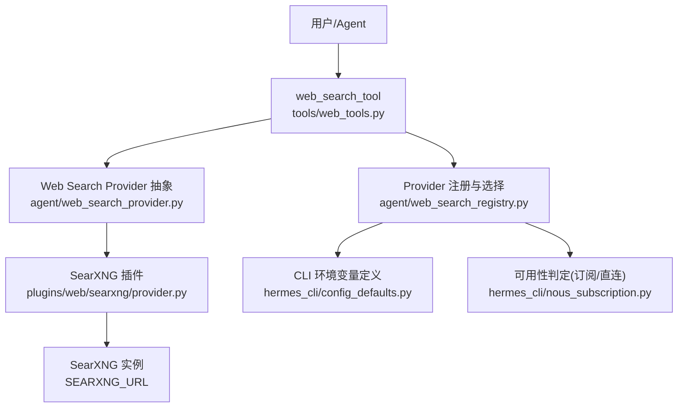
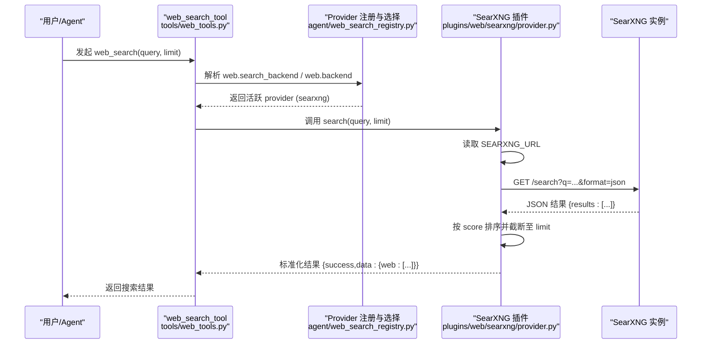
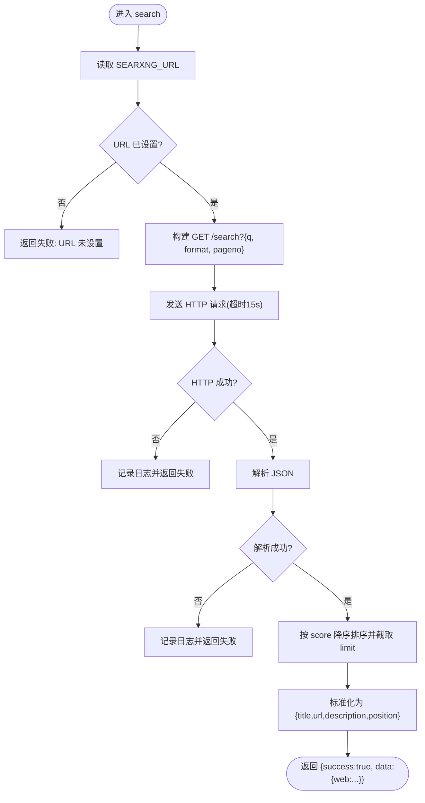
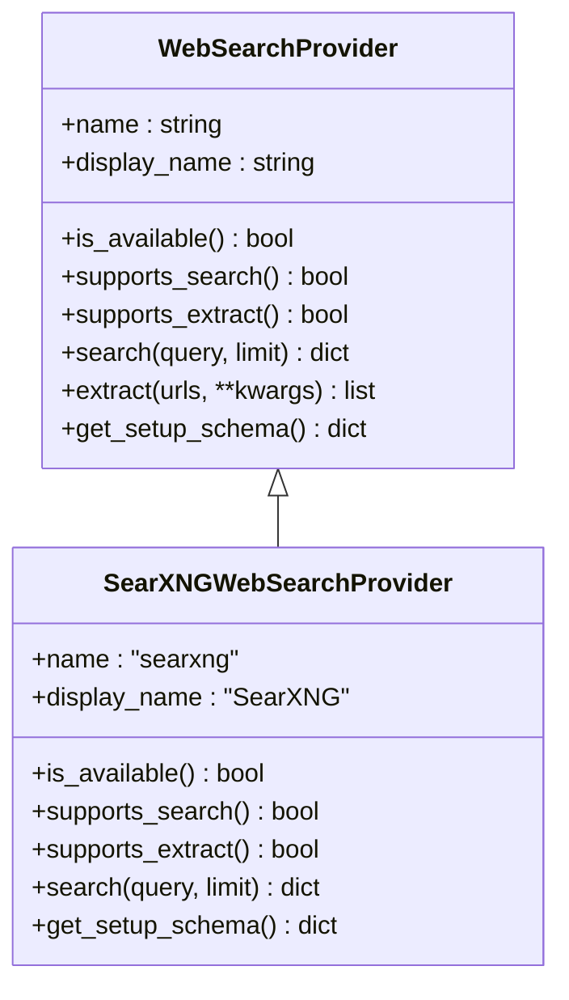
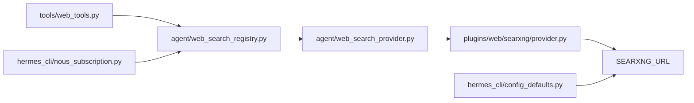

# SearXNG 搜索引擎

<cite>
**本文引用的文件**
- [plugins/web/searxng/provider.py](file://plugins/web/searxng/provider.py)
- [plugins/web/searxng/__init__.py](file://plugins/web/searxng/__init__.py)
- [agent/web_search_provider.py](file://agent/web_search_provider.py)
- [agent/web_search_registry.py](file://agent/web_search_registry.py)
- [hermes_cli/config_defaults.py](file://hermes_cli/config_defaults.py)
- [hermes_cli/nous_subscription.py](file://hermes_cli/nous_subscription.py)
- [tools/web_tools.py](file://tools/web_tools.py)
</cite>

## 目录
1. [简介](#简介)
2. [项目结构](#项目结构)
3. [核心组件](#核心组件)
4. [架构总览](#架构总览)
5. [详细组件分析](#详细组件分析)
6. [依赖关系分析](#依赖关系分析)
7. [性能与可用性](#性能与可用性)
8. [部署与配置指南](#部署与配置指南)
9. [故障排除](#故障排除)
10. [结论](#结论)

## 简介
本文件面向在 Hermes Agent 中集成并运行自托管 SearXNG 搜索引擎的用户与运维人员，说明如何通过环境变量 SEARXNG_URL 启用“搜索”能力，如何在本地或远程实例之间切换，以及 SearXNG 在 Hermes Agent 中的完整调用链路。SearXNG 作为隐私优先、无广告的多引擎聚合元搜索引擎，适合对数据主权和隐私有较高要求的场景。

## 项目结构
Hermes Agent 将 SearXNG 以插件形式提供，并通过统一的 Web Search Provider 抽象接入工具层与注册中心：
- 插件实现：位于 plugins/web/searxng/，提供搜索能力与设置元信息。
- 抽象接口：位于 agent/web_search_provider.py，定义 provider 的统一契约。
- 注册与选择：位于 agent/web_search_registry.py，负责按配置与可用性选择活跃 provider。
- CLI 环境定义：位于 hermes_cli/config_defaults.py，声明 SEARXNG_URL 等环境变量。
- 订阅与可用性判定：位于 hermes_cli/nous_subscription.py，用于判断是否启用 web 搜索能力。
- 工具层桥接：位于 tools/web_tools.py，统一暴露 web_search_tool 等工具入口。

图表来源
- [tools/web_tools.py:121-200](file://tools/web_tools.py#L121-L200)
- [agent/web_search_provider.py:89-212](file://agent/web_search_provider.py#L89-L212)
- [plugins/web/searxng/provider.py:47-154](file://plugins/web/searxng/provider.py#L47-L154)
- [agent/web_search_registry.py:116-219](file://agent/web_search_registry.py#L116-L219)
- [hermes_cli/config_defaults.py:3708-3715](file://hermes_cli/config_defaults.py#L3708-L3715)
- [hermes_cli/nous_subscription.py:426-549](file://hermes_cli/nous_subscription.py#L426-L549)

章节来源
- [tools/web_tools.py:121-200](file://tools/web_tools.py#L121-L200)
- [agent/web_search_provider.py:89-212](file://agent/web_search_provider.py#L89-L212)
- [plugins/web/searxng/provider.py:47-154](file://plugins/web/searxng/provider.py#L47-L154)
- [agent/web_search_registry.py:116-219](file://agent/web_search_registry.py#L116-L219)
- [hermes_cli/config_defaults.py:3708-3715](file://hermes_cli/config_defaults.py#L3708-L3715)
- [hermes_cli/nous_subscription.py:426-549](file://hermes_cli/nous_subscription.py#L426-L549)

## 核心组件
- SearXNG 插件（搜索）：实现 WebSearchProvider 的 search()，仅支持搜索，不支持内容提取；通过 SEARXNG_URL 指向实例。
- Provider 抽象：定义 name、is_available、supports_search、search、get_setup_schema 等统一接口。
- 注册与选择：根据显式配置、唯一可用 provider、历史偏好顺序自动选择活跃 provider。
- CLI 环境变量：SEARXNG_URL 被声明为工具类环境变量，供 setup 与检测流程使用。
- 订阅/可用性：检测 direct_searxng（即 SEARXNG_URL 存在），参与 web 能力激活判定。

章节来源
- [plugins/web/searxng/provider.py:47-154](file://plugins/web/searxng/provider.py#L47-L154)
- [agent/web_search_provider.py:89-212](file://agent/web_search_provider.py#L89-L212)
- [agent/web_search_registry.py:116-219](file://agent/web_search_registry.py#L116-L219)
- [hermes_cli/config_defaults.py:3708-3715](file://hermes_cli/config_defaults.py#L3708-L3715)
- [hermes_cli/nous_subscription.py:426-549](file://hermes_cli/nous_subscription.py#L426-L549)

## 架构总览
下图展示了从工具调用到 SearXNG 实例请求的端到端流程，包括配置读取、provider 选择、HTTP 请求与结果归一化。

图表来源
- [tools/web_tools.py:121-200](file://tools/web_tools.py#L121-L200)
- [agent/web_search_registry.py:116-219](file://agent/web_search_registry.py#L116-L219)
- [plugins/web/searxng/provider.py:68-139](file://plugins/web/searxng/provider.py#L68-L139)

## 详细组件分析

### SearXNG 插件（搜索）
- 功能边界：仅支持搜索，不支持提取（supports_extract=False）。
- 可用性：当 SEARXNG_URL 非空时可用。
- 搜索流程：
  - 读取 SEARXNG_URL（优先通过 Hermes 配置感知的环境读取，回退到进程环境）。
  - 构造查询参数 q、format=json、pageno=1。
  - 发送 HTTP GET 到 {base_url}/search，超时 15 秒，Accept: application/json。
  - 捕获 HTTP 错误与网络错误，返回结构化失败信息。
  - 解析 JSON，取 results 列表，按 score 降序排序，截取前 limit 条。
  - 标准化输出为 {title, url, description, position} 数组。
- 设置元信息：提供名称、徽章、标签与环境变量提示，便于 UI 引导。

图表来源
- [plugins/web/searxng/provider.py:34-139](file://plugins/web/searxng/provider.py#L34-L139)

章节来源
- [plugins/web/searxng/provider.py:34-154](file://plugins/web/searxng/provider.py#L34-L154)

### Provider 抽象与注册选择
- 抽象接口：统一 name、display_name、is_available、supports_search/extract、search/extract、get_setup_schema。
- 注册机制：插件在启动时向注册表注册 provider；重复注册会覆盖并记录调试日志。
- 选择策略：
  1) 显式配置优先（web.search_backend 或 web.backend）。
  2) 若仅有一个具备该能力且可用的 provider，则直接选用。
  3) 否则按历史偏好顺序遍历（firecrawl → parallel → tavily → exa → searxng → brave-free → ddgs），选取首个可用者。
  4) 均不满足时返回 None，由上层给出“请配置 provider”的提示。

图表来源
- [agent/web_search_provider.py:89-212](file://agent/web_search_provider.py#L89-L212)
- [plugins/web/searxng/provider.py:47-154](file://plugins/web/searxng/provider.py#L47-L154)

章节来源
- [agent/web_search_provider.py:89-212](file://agent/web_search_provider.py#L89-L212)
- [agent/web_search_registry.py:48-219](file://agent/web_search_registry.py#L48-L219)

### 工具层桥接与配置感知
- 工具入口：tools/web_tools.py 暴露 web_search_tool 等工具，内部通过注册表选择 provider。
- 配置感知：工具层与 provider 均通过“配置感知的环境读取”获取 SEARXNG_URL，确保通过 hermes config/.env 设置的值生效。
- 兼容性：保留 legacy 后端集合，使旧安装路径仍可工作。

章节来源
- [tools/web_tools.py:121-200](file://tools/web_tools.py#L121-L200)
- [agent/web_search_provider.py:59-81](file://agent/web_search_provider.py#L59-L81)

## 依赖关系分析
- 插件与抽象：SearXNG 插件继承 WebSearchProvider 抽象，遵循统一契约。
- 注册与选择：注册表维护 provider 映射，并在运行时按配置与可用性选择。
- 环境与配置：SEARXNG_URL 在 CLI 默认配置中声明，并在订阅/可用性逻辑中被探测。
- 工具调用：web_tools 通过注册表找到 searxng provider 并执行搜索。

图表来源
- [tools/web_tools.py:121-200](file://tools/web_tools.py#L121-L200)
- [agent/web_search_registry.py:116-219](file://agent/web_search_registry.py#L116-L219)
- [agent/web_search_provider.py:89-212](file://agent/web_search_provider.py#L89-L212)
- [plugins/web/searxng/provider.py:34-154](file://plugins/web/searxng/provider.py#L34-L154)
- [hermes_cli/config_defaults.py:3708-3715](file://hermes_cli/config_defaults.py#L3708-L3715)
- [hermes_cli/nous_subscription.py:426-549](file://hermes_cli/nous_subscription.py#L426-L549)

章节来源
- [tools/web_tools.py:121-200](file://tools/web_tools.py#L121-L200)
- [agent/web_search_registry.py:116-219](file://agent/web_search_registry.py#L116-L219)
- [hermes_cli/config_defaults.py:3708-3715](file://hermes_cli/config_defaults.py#L3708-L3715)
- [hermes_cli/nous_subscription.py:426-549](file://hermes_cli/nous_subscription.py#L426-L549)

## 性能与可用性
- 超时控制：SearXNG 请求默认超时 15 秒，避免长时间阻塞。
- 结果裁剪：按 score 降序排序后仅返回前 limit 条，减少后续处理开销。
- 可用性快速检查：is_available() 仅检查环境变量，不发起网络请求，保证工具列表渲染与注册阶段快速响应。
- 并发与线程：provider 抽象允许同步实现，由调度器按需异步化；SearXNG 插件采用同步 httpx 调用，适合轻量搜索场景。

[本节为通用指导，无需特定文件引用]

## 部署与配置指南

### 环境变量与配置项
- SEARXNG_URL：指向你的 SearXNG 实例地址（例如 http://localhost:8080）。
  - 在 CLI 默认配置中声明，可用于 hermes tools 引导与检测。
  - 工具层与 provider 均通过“配置感知的环境读取”获取该值，确保通过 hermes config/.env 设置的值生效。
- 选择策略：
  - 显式配置：web.search_backend 或 web.backend 设置为 "searxng"。
  - 自动选择：若无显式配置，且仅有 searxng 可用，将自动选择；否则按历史偏好顺序匹配。

章节来源
- [hermes_cli/config_defaults.py:3708-3715](file://hermes_cli/config_defaults.py#L3708-L3715)
- [tools/web_tools.py:121-200](file://tools/web_tools.py#L121-L200)
- [agent/web_search_registry.py:116-219](file://agent/web_search_registry.py#L116-L219)

### 连接本地或远程实例
- 本地开发：设置 SEARXNG_URL=http://localhost:8080，并确保 SearXNG 服务在本机监听。
- 远程实例：设置 SEARXNG_URL=https://your-searxng.example.com，确保网络可达且端口开放。
- 认证与安全：
  - 当前插件实现未内置认证头传递；如需鉴权，请在反向代理层（如 Nginx/Caddy）或 SearXNG 实例本身配置访问控制（IP 白名单、Basic Auth、Token 等）。
  - 建议通过 HTTPS 与域名证书保护传输安全。

章节来源
- [plugins/web/searxng/provider.py:68-139](file://plugins/web/searxng/provider.py#L68-L139)

### 在 Hermes Agent 中的搜索流程
- 调用入口：web_search_tool。
- Provider 选择：根据配置与可用性选择 searxng。
- 请求构造：GET /search?q=...&format=json，超时 15 秒。
- 结果处理：按 score 排序并限制数量，标准化为统一格式。
- 输出：返回包含 title、url、description、position 的结果列表。

章节来源
- [tools/web_tools.py:121-200](file://tools/web_tools.py#L121-L200)
- [plugins/web/searxng/provider.py:68-139](file://plugins/web/searxng/provider.py#L68-L139)

### 最佳实践
- 将 SearXNG 部署在受信任的网络内，并使用 HTTPS 与访问控制。
- 合理设置 limit 与超时，平衡速度与结果质量。
- 使用 hermes config/.env 集中管理 SEARXNG_URL，避免硬编码。
- 若需多 provider 共存，可通过 web.search_backend 明确指定 searxng。

[本节为通用指导，无需特定文件引用]

## 故障排除
- 现象：搜索失败，提示 URL 未设置
  - 原因：SEARXNG_URL 为空或未正确加载。
  - 处理：确认通过 hermes config/.env 设置了 SEARXNG_URL，且可被“配置感知的环境读取”获取。
- 现象：HTTP 错误或无法到达 SearXNG
  - 原因：网络不可达、端口错误、反向代理拦截、SearXNG 未启动。
  - 处理：检查网络连通性、防火墙、反向代理配置与 SearXNG 服务状态；查看日志中的 HTTP 错误码与请求错误信息。
- 现象：JSON 解析失败
  - 原因：SearXNG 返回非 JSON 或格式异常。
  - 处理：验证 /search 接口返回格式；检查自定义中间件或代理是否修改了响应体。
- 现象：结果为空或很少
  - 原因：上游引擎未返回结果或 limit 过小。
  - 处理：增大 limit；检查 SearXNG 配置的引擎与权重；尝试不同关键词。

章节来源
- [plugins/web/searxng/provider.py:68-139](file://plugins/web/searxng/provider.py#L68-L139)

## 结论
通过 SEARXNG_URL 即可在 Hermes Agent 中启用基于自托管 SearXNG 的隐私优先搜索能力。插件实现了标准化的搜索流程与结果归一化，配合注册与选择机制，可在多种环境下稳定工作。结合反向代理的安全加固与合理的超时/限流策略，可获得高可用、低延迟的搜索体验。