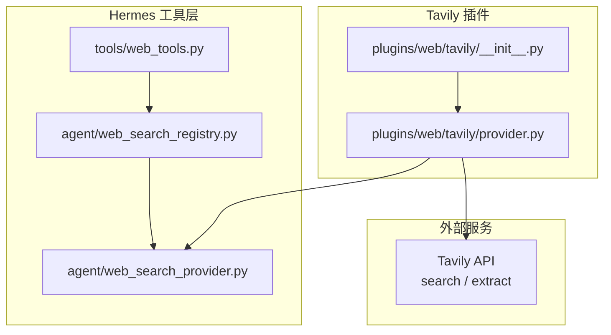
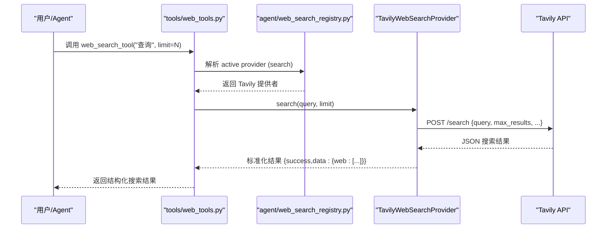
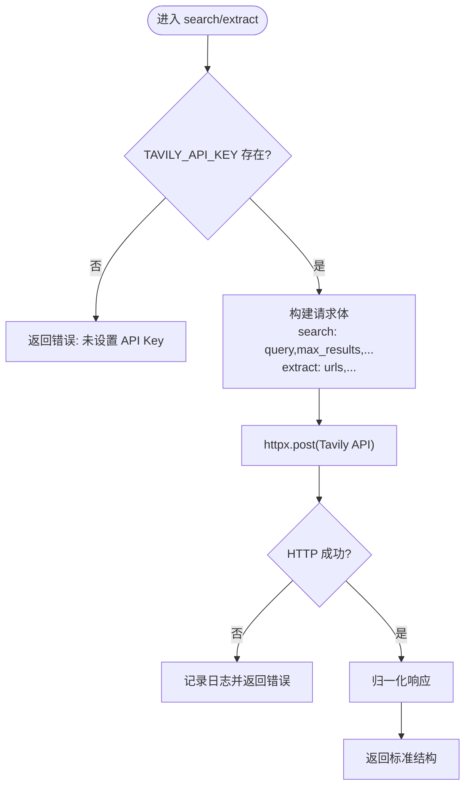
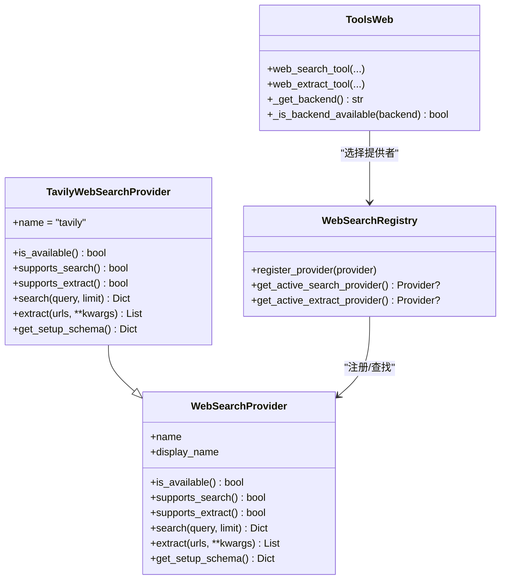

# Tavily 搜索引擎

<cite>
**本文引用的文件**
- [plugins/web/tavily/provider.py](file://plugins/web/tavily/provider.py)
- [plugins/web/tavily/__init__.py](file://plugins/web/tavily/__init__.py)
- [agent/web_search_provider.py](file://agent/web_search_provider.py)
- [agent/web_search_registry.py](file://agent/web_search_registry.py)
- [tools/web_tools.py](file://tools/web_tools.py)
- [tests/tools/test_web_tools_tavily.py](file://tests/tools/test_web_tools_tavily.py)
- [hermes_cli/config_defaults.py](file://hermes_cli/config_defaults.py)
- [hermes_cli/nous_subscription.py](file://hermes_cli/nous_subscription.py)
</cite>

## 目录
1. [简介](#简介)
2. [项目结构](#项目结构)
3. [核心组件](#核心组件)
4. [架构总览](#架构总览)
5. [详细组件分析](#详细组件分析)
6. [依赖关系分析](#依赖关系分析)
7. [性能与配额管理](#性能与配额管理)
8. [故障排查指南](#故障排查指南)
9. [结论](#结论)
10. [附录：配置与使用示例](#附录配置与使用示例)

## 简介
本文件面向在 Hermes Agent 中集成并使用 Tavily 搜索引擎的开发者与运维人员，系统说明以下要点：
- 如何获取并设置 TAVILY_API_KEY（以及可选的 TAVILY_BASE_URL）
- Tavily 搜索与内容提取能力在 Hermes 中的实现位置、数据流转与返回结构
- 如何通过 web_search_tool 调用 Tavily，如何处理返回结果，如何使用高级参数
- 配额与错误处理建议、性能优化实践
- 在 Hermes Agent 中的插件化注册与选择机制

## 项目结构
Tavily 以“Web 搜索/提取提供者”插件形式集成到 Hermes。关键路径如下：
- 插件入口：plugins/web/tavily/__init__.py
- 提供者实现：plugins/web/tavily/provider.py
- Web 搜索抽象与工具层：agent/web_search_provider.py、agent/web_search_registry.py、tools/web_tools.py
- 测试用例：tests/tools/test_web_tools_tavily.py
- 配置默认值与订阅逻辑：hermes_cli/config_defaults.py、hermes_cli/nous_subscription.py

图表来源
- [tools/web_tools.py:223-352](file://tools/web_tools.py#L223-L352)
- [agent/web_search_registry.py:133-219](file://agent/web_search_registry.py#L133-L219)
- [agent/web_search_provider.py:89-212](file://agent/web_search_provider.py#L89-L212)
- [plugins/web/tavily/__init__.py:8-10](file://plugins/web/tavily/__init__.py#L8-L10)
- [plugins/web/tavily/provider.py:35-61](file://plugins/web/tavily/provider.py#L35-L61)

章节来源
- [tools/web_tools.py:223-352](file://tools/web_tools.py#L223-L352)
- [agent/web_search_registry.py:133-219](file://agent/web_search_registry.py#L133-L219)
- [agent/web_search_provider.py:89-212](file://agent/web_search_provider.py#L89-L212)
- [plugins/web/tavily/__init__.py:8-10](file://plugins/web/tavily/__init__.py#L8-L10)
- [plugins/web/tavily/provider.py:35-61](file://plugins/web/tavily/provider.py#L35-L61)

## 核心组件
- TavilyWebSearchProvider：实现搜索与内容提取，封装对 Tavily API 的请求与响应归一化
- WebSearchProvider 抽象：统一搜索/提取接口，定义返回结构与可用性检测
- Web Search Registry：按配置与可用性选择当前活跃的提供者（支持 per-capability 覆盖）
- tools/web_tools：对外暴露 web_search_tool、web_extract_tool，负责后端选择与调用

章节来源
- [plugins/web/tavily/provider.py:130-225](file://plugins/web/tavily/provider.py#L130-L225)
- [agent/web_search_provider.py:89-212](file://agent/web_search_provider.py#L89-L212)
- [agent/web_search_registry.py:133-219](file://agent/web_search_registry.py#L133-L219)
- [tools/web_tools.py:223-352](file://tools/web_tools.py#L223-L352)

## 架构总览
Tavily 通过插件机制注册为 Web 搜索/提取提供者；工具层根据配置与环境变量自动选择活跃提供者；请求经 httpx 发送到 Tavily API，返回结果被归一化为统一的内部结构，供上层 LLM 或后续处理消费。

图表来源
- [tools/web_tools.py:223-352](file://tools/web_tools.py#L223-L352)
- [agent/web_search_registry.py:281-298](file://agent/web_search_registry.py#L281-L298)
- [plugins/web/tavily/provider.py:153-176](file://plugins/web/tavily/provider.py#L153-L176)
- [plugins/web/tavily/provider.py:35-61](file://plugins/web/tavily/provider.py#L35-L61)

## 详细组件分析

### Tavily 提供者实现
- 环境变量读取：TAVILY_API_KEY（必需）、TAVILY_BASE_URL（可选，默认 https://api.tavily.com）
- 搜索：POST /search，参数包含 query、max_results（上限 20）、include_raw_content=False、include_images=False
- 提取：POST /extract，参数包含 urls、include_images=False
- 响应归一化：
  - 搜索：将 results 映射为 {title, url, description, position}
  - 提取：将 results/failed_results/failed_urls 映射为标准文档列表，失败项带 error 字段
- 可用性：is_available() 基于 TAVILY_API_KEY 是否存在

图表来源
- [plugins/web/tavily/provider.py:35-61](file://plugins/web/tavily/provider.py#L35-L61)
- [plugins/web/tavily/provider.py:64-127](file://plugins/web/tavily/provider.py#L64-L127)
- [plugins/web/tavily/provider.py:153-210](file://plugins/web/tavily/provider.py#L153-L210)

章节来源
- [plugins/web/tavily/provider.py:35-225](file://plugins/web/tavily/provider.py#L35-L225)

### Web 搜索抽象与注册
- WebSearchProvider 定义了 search/extract 的统一接口与返回结构
- Registry 提供按配置与可用性的提供者选择策略，支持 per-capability 覆盖（search_backend/extract_backend/backend）
- 内置后备顺序保留历史行为，tavily 位于较高优先级

章节来源
- [agent/web_search_provider.py:89-212](file://agent/web_search_provider.py#L89-L212)
- [agent/web_search_registry.py:133-219](file://agent/web_search_registry.py#L133-L219)

### 工具层与调用流程
- tools/web_tools 暴露 web_search_tool 与 web_extract_tool
- 后端选择：优先读取 web.search_backend/web.extract_backend，其次 web.backend，再按环境变量自动探测
- 对 Tavily 的支持：_is_backend_available 检查 TAVILY_API_KEY；_get_backend/_get_capability_backend 决定实际后端

章节来源
- [tools/web_tools.py:223-352](file://tools/web_tools.py#L223-L352)

## 依赖关系分析
- 插件注册：plugins/web/tavily/__init__.py 在插件上下文注册 TavilyWebSearchProvider
- 提供者实现依赖 agent.web_search_provider.WebSearchProvider 抽象
- 工具层依赖 registry 进行提供者选择，并通过 httpx 访问 Tavily API
- 测试通过 mock httpx.post 验证请求体与响应归一化

图表来源
- [agent/web_search_provider.py:89-212](file://agent/web_search_provider.py#L89-L212)
- [plugins/web/tavily/provider.py:130-225](file://plugins/web/tavily/provider.py#L130-L225)
- [agent/web_search_registry.py:48-91](file://agent/web_search_registry.py#L48-L91)
- [tools/web_tools.py:223-352](file://tools/web_tools.py#L223-L352)

章节来源
- [plugins/web/tavily/__init__.py:8-10](file://plugins/web/tavily/__init__.py#L8-L10)
- [agent/web_search_registry.py:48-91](file://agent/web_search_registry.py#L48-L91)
- [tools/web_tools.py:223-352](file://tools/web_tools.py#L223-L352)

## 性能与配额管理
- 超时控制：Tavily 请求使用固定超时（约 60 秒），避免长时间阻塞
- 结果限制：搜索时 max_results 上限为 20，防止过大响应
- 图片与原始内容：默认不启用 include_images 与 include_raw_content，减少带宽与处理开销
- 中断支持：search/extract 过程中检测中断信号，及时返回
- 错误处理：网络异常与 HTTP 状态码异常均被捕获并转换为结构化错误响应
- 配额与速率限制：代码层未内置限流器；建议在调用侧结合业务频率控制重试与退避策略
- 多后端降级：当 Tavily 不可用时，可通过配置或环境变量切换至其他后端（如 exa、parallel、firecrawl、searxng、ddgs）

章节来源
- [plugins/web/tavily/provider.py:59-61](file://plugins/web/tavily/provider.py#L59-L61)
- [plugins/web/tavily/provider.py:162-176](file://plugins/web/tavily/provider.py#L162-L176)
- [plugins/web/tavily/provider.py:193-210](file://plugins/web/tavily/provider.py#L193-L210)
- [tools/web_tools.py:241-270](file://tools/web_tools.py#L241-L270)

## 故障排查指南
- 未设置 API Key：若 TAVILY_API_KEY 为空，search/extract 会返回明确的错误提示，指引用户前往 Tavily 控制台获取密钥
- HTTP 错误：非 2xx 响应会被 raise_for_status 抛出，调用方捕获后返回结构化错误
- 网络异常：httpx 异常被捕获并记录日志，返回错误信息
- 配置生效：确认 web.search_backend/web.extract_backend/web.backend 是否正确；或通过环境变量自动探测
- 插件禁用：若 Tavily 插件被禁用，需重新启用或在配置中指定其他后端

章节来源
- [plugins/web/tavily/provider.py:46-51](file://plugins/web/tavily/provider.py#L46-L51)
- [plugins/web/tavily/provider.py:172-176](file://plugins/web/tavily/provider.py#L172-L176)
- [plugins/web/tavily/provider.py:203-210](file://plugins/web/tavily/provider.py#L203-L210)
- [tools/web_tools.py:311-352](file://tools/web_tools.py#L311-L352)

## 结论
Tavily 在 Hermes Agent 中以插件化方式提供搜索与内容提取能力，具备清晰的配置入口、稳定的返回结构与良好的错误处理。通过合理的参数设置与调用侧限流策略，可在保证性能的同时获得高质量的 AI 优化搜索结果与网页内容提取。

## 附录：配置与使用示例

### 配置步骤
- 获取 TAVILY_API_KEY：前往 Tavily 控制台创建并复制 API Key
- 设置环境变量：
  - 必需：TAVILY_API_KEY
  - 可选：TAVILY_BASE_URL（用于覆盖默认端点）
- 在 Hermes 配置中选择后端：
  - 全局共享：web.backend = "tavily"
  - 按能力覆盖：web.search_backend = "tavily"、web.extract_backend = "tavily"

章节来源
- [plugins/web/tavily/provider.py:18-22](file://plugins/web/tavily/provider.py#L18-L22)
- [hermes_cli/config_defaults.py:3700-3703](file://hermes_cli/config_defaults.py#L3700-L3703)
- [tools/web_tools.py:223-352](file://tools/web_tools.py#L223-L352)

### 使用示例（web_search_tool）
- 调用方式：web_search_tool("查询关键词", limit=5)
- 返回结构：{success: True, data: {web: [{title, url, description, position}, ...]}}
- 高级参数：
  - limit：最大结果数（内部限制为 20）
  - 其他 Tavily 搜索参数由提供者内部构造（如 include_raw_content、include_images）

章节来源
- [plugins/web/tavily/provider.py:153-176](file://plugins/web/tavily/provider.py#L153-L176)
- [tests/tools/test_web_tools_tavily.py:142-158](file://tests/tools/test_web_tools_tavily.py#L142-L158)

### 使用示例（web_extract_tool）
- 调用方式：web_extract_tool(["https://example.com"], format="markdown")
- 返回结构：列表，每项包含 url、title、content、raw_content、metadata；失败项含 error
- 注意：默认不包含图片，如需可调整 include_images（由提供者内部构造）

章节来源
- [plugins/web/tavily/provider.py:178-210](file://plugins/web/tavily/provider.py#L178-L210)
- [tests/tools/test_web_tools_tavily.py:174-191](file://tests/tools/test_web_tools_tavily.py#L174-L191)

### 错误码与处理建议
- 未设置 API Key：返回明确错误消息，引导用户设置 TAVILY_API_KEY
- HTTP 状态错误：如 401/403/429 等，调用方应捕获并提示用户检查权限或配额
- 网络异常：记录日志并返回错误信息，建议重试与退避

章节来源
- [plugins/web/tavily/provider.py:46-61](file://plugins/web/tavily/provider.py#L46-L61)
- [plugins/web/tavily/provider.py:172-176](file://plugins/web/tavily/provider.py#L172-L176)
- [plugins/web/tavily/provider.py:203-210](file://plugins/web/tavily/provider.py#L203-L210)

### 在 Hermes Agent 中的集成架构与数据流
- 插件注册：Tavily 插件在启动时注册为 Web 搜索/提取提供者
- 提供者选择：根据配置与可用性确定当前活跃提供者
- 请求发送：通过 httpx 向 Tavily API 发起搜索或提取请求
- 响应归一化：将不同来源的结果统一为标准结构，便于上层处理
- 错误处理：捕获异常并返回结构化错误，确保工具调用稳定

章节来源
- [plugins/web/tavily/__init__.py:8-10](file://plugins/web/tavily/__init__.py#L8-L10)
- [agent/web_search_registry.py:281-298](file://agent/web_search_registry.py#L281-L298)
- [tools/web_tools.py:223-352](file://tools/web_tools.py#L223-L352)
- [plugins/web/tavily/provider.py:35-61](file://plugins/web/tavily/provider.py#L35-L61)