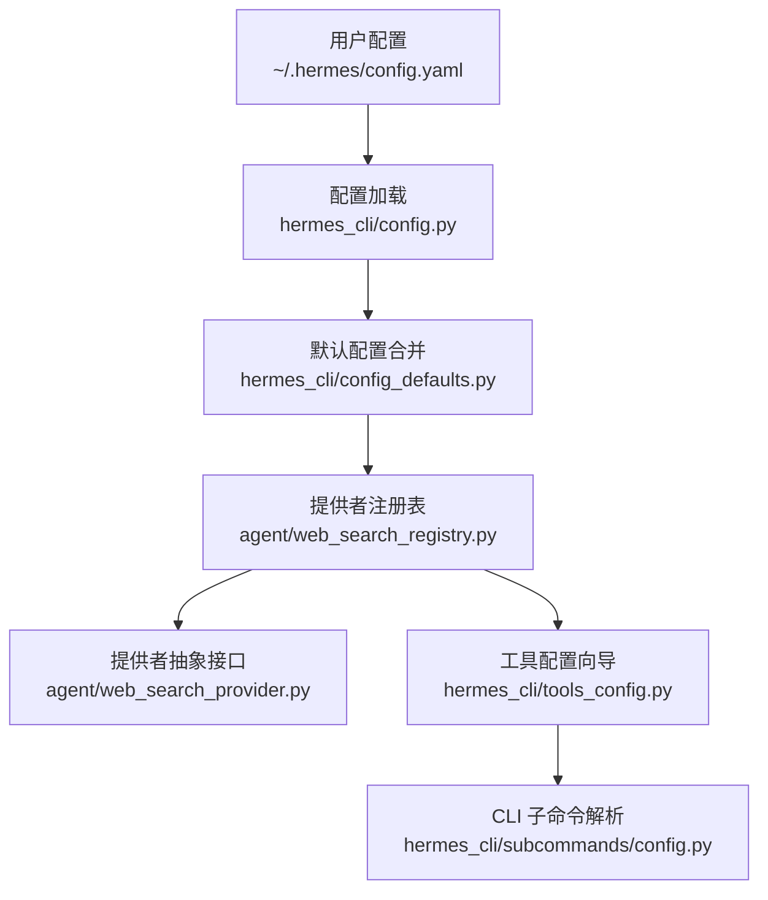
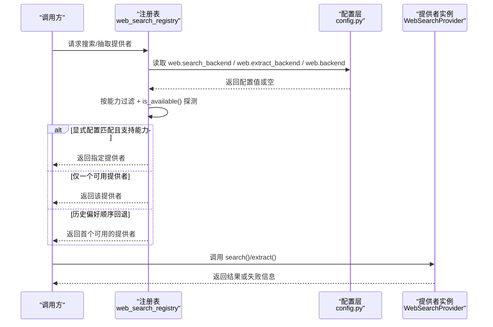
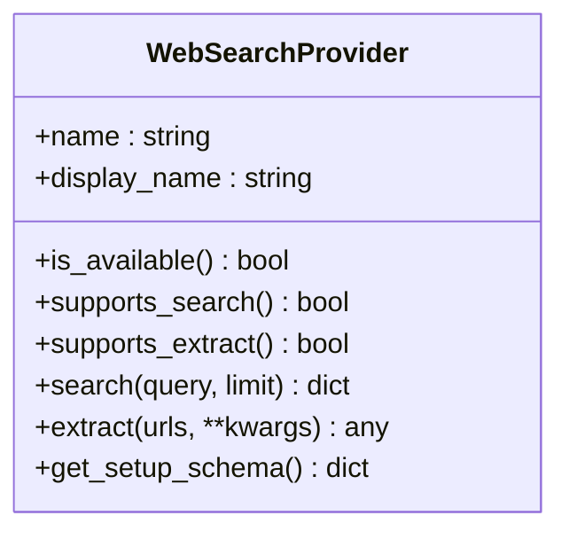
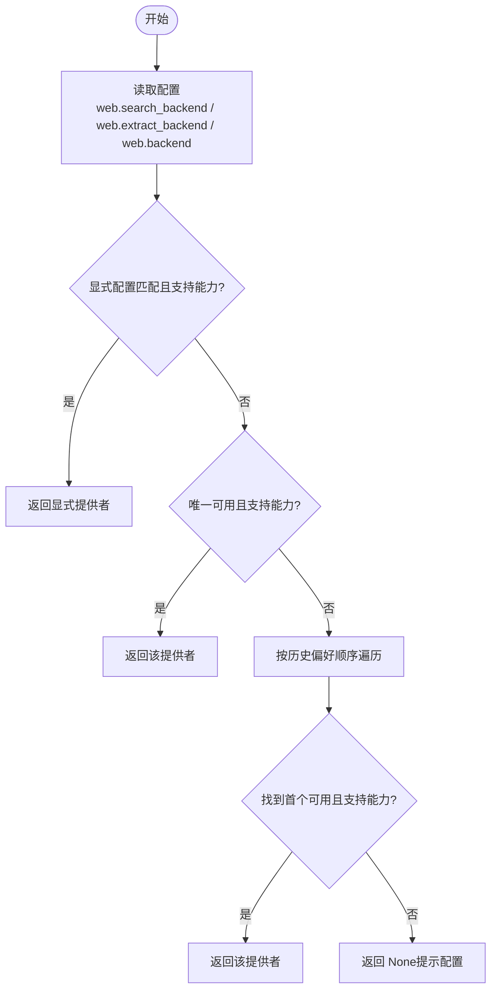
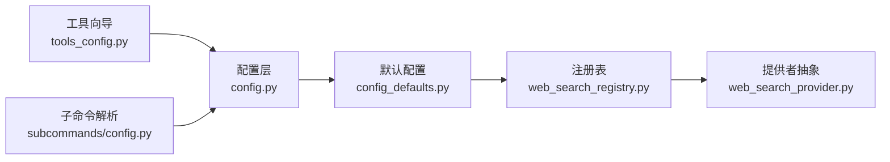

# 搜索引擎配置管理

<cite>
**本文引用的文件**
- [agent/web_search_provider.py](file://agent/web_search_provider.py)
- [agent/web_search_registry.py](file://agent/web_search_registry.py)
- [hermes_cli/config_defaults.py](file://hermes_cli/config_defaults.py)
- [hermes_cli/config.py](file://hermes_cli/config.py)
- [hermes_cli/tools_config.py](file://hermes_cli/tools_config.py)
- [hermes_cli/subcommands/config.py](file://hermes_cli/subcommands/config.py)
</cite>

## 目录
1. [简介](#简介)
2. [项目结构](#项目结构)
3. [核心组件](#核心组件)
4. [架构总览](#架构总览)
5. [详细组件分析](#详细组件分析)
6. [依赖关系分析](#依赖关系分析)
7. [性能考量](#性能考量)
8. [故障排查指南](#故障排查指南)
9. [结论](#结论)
10. [附录](#附录)

## 简介
本文件面向 Hermes Agent 的“搜索引擎配置管理”，聚焦以下目标：
- 说明搜索引擎的自动检测机制：环境变量检查、API Key 验证与可用性探测。
- 解释配置文件结构与语法，尤其是 config.yaml 中 web 部分的选项（backend、search_backend、extract_backend 等）。
- 提供多种配置场景示例：单搜索引擎、多搜索引擎切换、条件配置。
- 说明搜索引擎的选择优先级、故障转移与回退策略。
- 介绍配置验证工具使用方法（hermes tools 配置向导与诊断能力）。
- 给出最佳实践与常见错误解决方案。

## 项目结构
围绕搜索引擎的配置与选择，涉及的关键模块如下：
- 提供者抽象与接口定义：WebSearchProvider ABC，统一搜索/抽取能力契约。
- 提供者注册与活跃选择：web_search_registry，负责读取配置、按能力筛选、按优先级选择。
- 默认配置项：config_defaults.py 中的 web.* 键值。
- CLI 配置读写与校验：hermes_cli/config.py。
- 工具配置向导与 Web 类别：hermes_cli/tools_config.py。
- 子命令解析入口：hermes_cli/subcommands/config.py。

图表来源
- [hermes_cli/config.py:694-700](file://hermes_cli/config.py#L694-L700)
- [hermes_cli/config_defaults.py:398-403](file://hermes_cli/config_defaults.py#L398-L403)
- [agent/web_search_registry.py:98-113](file://agent/web_search_registry.py#L98-L113)
- [agent/web_search_provider.py:89-140](file://agent/web_search_provider.py#L89-L140)
- [hermes_cli/tools_config.py:484-519](file://hermes_cli/tools_config.py#L484-L519)
- [hermes_cli/subcommands/config.py:12-68](file://hermes_cli/subcommands/config.py#L12-L68)

章节来源
- [hermes_cli/config.py:694-700](file://hermes_cli/config.py#L694-L700)
- [hermes_cli/config_defaults.py:398-403](file://hermes_cli/config_defaults.py#L398-L403)
- [agent/web_search_registry.py:98-113](file://agent/web_search_registry.py#L98-L113)
- [agent/web_search_provider.py:89-140](file://agent/web_search_provider.py#L89-L140)
- [hermes_cli/tools_config.py:484-519](file://hermes_cli/tools_config.py#L484-L519)
- [hermes_cli/subcommands/config.py:12-68](file://hermes_cli/subcommands/config.py#L12-L68)

## 核心组件
- WebSearchProvider 抽象类：定义 name、display_name、is_available、supports_search、supports_extract、search、extract、get_setup_schema 等能力与元数据接口。
- 提供者注册表：维护已注册的提供者集合，实现按能力筛选、显式配置优先、单提供者快捷路径、历史偏好顺序回退等选择逻辑。
- 配置项：web.backend（共享回退）、web.search_backend（搜索专用）、web.extract_backend（抽取专用）、web.extract_char_limit（抽取字符限制）。
- 工具配置向导：在 hermes tools 中为 Web Search & Extract 提供提供商选择与 API Key 引导流程。

章节来源
- [agent/web_search_provider.py:89-212](file://agent/web_search_provider.py#L89-L212)
- [agent/web_search_registry.py:44-90](file://agent/web_search_registry.py#L44-L90)
- [hermes_cli/config_defaults.py:398-403](file://hermes_cli/config_defaults.py#L398-L403)
- [hermes_cli/tools_config.py:484-519](file://hermes_cli/tools_config.py#L484-L519)

## 架构总览
Hermes 的搜索引擎通过插件化提供者接入，运行时依据配置与可用性动态选择。选择流程遵循“显式配置优先 → 单提供者快捷 → 历史偏好回退”的策略，确保无配置时也能基于可用凭据自动选择最合适的后端。

图表来源
- [agent/web_search_registry.py:133-219](file://agent/web_search_registry.py#L133-L219)
- [agent/web_search_registry.py:281-298](file://agent/web_search_registry.py#L281-L298)
- [agent/web_search_provider.py:116-184](file://agent/web_search_provider.py#L116-L184)

## 详细组件分析

### 提供者抽象与能力声明
- name/display_name：用于配置键与界面显示的稳定标识。
- is_available：轻量检查（环境变量存在、可选依赖可导入、实例 URL 设置），禁止网络调用。
- supports_search/supports_extract：声明是否实现对应能力，供注册表按能力筛选。
- search/extract：具体实现；返回兼容旧版工具的响应形状。
- get_setup_schema：为 hermes tools 提供元数据（名称、徽章、标签、所需环境变量提示）。

图表来源
- [agent/web_search_provider.py:89-212](file://agent/web_search_provider.py#L89-L212)

章节来源
- [agent/web_search_provider.py:89-212](file://agent/web_search_provider.py#L89-L212)

### 提供者注册与活跃选择
- 注册：register_provider 将提供者加入全局映射，支持重注册并记录日志。
- 列表与查找：list_providers/get_provider 提供查询能力。
- 活跃选择：_resolve 实现选择策略：
  1) 显式配置优先（即使不可用也返回，以便下游给出精确错误）；
  2) 若仅有一个具备能力且可用的提供者，直接返回；
  3) 按历史偏好顺序（firecrawl → parallel → tavily → exa → searxng → brave-free → ddgs）遍历，取首个满足能力且可用的提供者；
  4) 否则返回 None，由上层提示配置。
- 辅助：_disabled_web_plugin_for 检测用户禁用了内置 web 插件但配置了相应后端的情况，便于给出更准确的修复建议。

图表来源
- [agent/web_search_registry.py:133-219](file://agent/web_search_registry.py#L133-L219)
- [agent/web_search_registry.py:222-278](file://agent/web_search_registry.py#L222-L278)

章节来源
- [agent/web_search_registry.py:44-90](file://agent/web_search_registry.py#L44-L90)
- [agent/web_search_registry.py:133-219](file://agent/web_search_registry.py#L133-L219)
- [agent/web_search_registry.py:222-278](file://agent/web_search_registry.py#L222-L278)

### 配置结构与语法（web 部分）
- web.backend：共享回退，适用于搜索与抽取未单独指定时的共用后端。
- web.search_backend：覆盖搜索能力使用的后端。
- web.extract_backend：覆盖抽取能力使用的后端。
- web.extract_char_limit：抽取时每页字符预算，超出会截断并将全文缓存。

这些键在默认配置中定义，可通过 hermes config 子命令查看、编辑、迁移与校验。

章节来源
- [hermes_cli/config_defaults.py:398-403](file://hermes_cli/config_defaults.py#L398-L403)
- [hermes_cli/subcommands/config.py:12-68](file://hermes_cli/subcommands/config.py#L12-L68)

### 环境变量检查、API Key 验证与可用性探测
- 环境变量读取：WebSearchProvider.get_provider_env 使用配置层的环境变量读取（优先 ~/.hermes/.env，其次进程环境），保证在 gateway/session/子进程中也能读到密钥。
- 可用性探测：is_available 必须轻量且不发起网络调用，通常检查环境变量是否存在、可选依赖是否可导入、实例 URL 是否设置。
- 注册表保护：_is_available_safe 捕获异常，避免某个提供者的可用性检查失败影响整体选择。

章节来源
- [agent/web_search_provider.py:59-81](file://agent/web_search_provider.py#L59-L81)
- [agent/web_search_provider.py:116-123](file://agent/web_search_provider.py#L116-L123)
- [agent/web_search_registry.py:173-179](file://agent/web_search_registry.py#L173-L179)

### 选择优先级、故障转移与回退策略
- 优先级：
  1) web.search_backend / web.extract_backend（按能力覆盖）；
  2) web.backend（共享回退）；
  3) 唯一可用提供者；
  4) 历史偏好顺序（firecrawl → parallel → tavily → exa → searxng → brave-free → ddgs），按能力与可用性过滤；
  5) 否则返回 None，提示配置。
- 故障转移：当显式配置的提供者不支持某能力或未注册时，自动回退到可用提供者；若所有路径均不可用，则提示用户通过 hermes tools 配置。
- 禁用插件检测：若用户禁用了内置 web 插件但配置了对应后端，系统会识别并提示重新启用插件。

章节来源
- [agent/web_search_registry.py:10-31](file://agent/web_search_registry.py#L10-L31)
- [agent/web_search_registry.py:133-219](file://agent/web_search_registry.py#L133-L219)
- [agent/web_search_registry.py:222-278](file://agent/web_search_registry.py#L222-L278)

### 工具配置向导与诊断
- 工具类别：tools_config.py 中定义了 Web Search & Extract 的类别与提供商行（包括 Nous Subscription、Firecrawl Self-Hosted 等），并在运行时注入插件提供的提供商。
- 向导流程：hermes tools 进入 Web 类别后，根据提供商要求提示输入 API Key 或实例 URL，并写入配置与环境变量。
- 诊断能力：hermes config check/migrate 可用于检查缺失或过期的配置项，并进行迁移更新。

章节来源
- [hermes_cli/tools_config.py:484-519](file://hermes_cli/tools_config.py#L484-L519)
- [hermes_cli/subcommands/config.py:56-68](file://hermes_cli/subcommands/config.py#L56-L68)

## 依赖关系分析
- 配置层依赖：config.py 提供配置读取、保存、校验与迁移；config_defaults.py 提供默认 web.* 键。
- 注册表依赖：web_search_registry.py 依赖配置层读取 web.* 键，并依赖各 WebSearchProvider 实例的能力与可用性。
- 工具向导依赖：tools_config.py 提供 Web 类别的提供商矩阵与向导流程，最终落盘到配置与环境变量。

图表来源
- [hermes_cli/config.py:694-700](file://hermes_cli/config.py#L694-L700)
- [hermes_cli/config_defaults.py:398-403](file://hermes_cli/config_defaults.py#L398-L403)
- [agent/web_search_registry.py:98-113](file://agent/web_search_registry.py#L98-L113)
- [agent/web_search_provider.py:89-140](file://agent/web_search_provider.py#L89-L140)
- [hermes_cli/tools_config.py:484-519](file://hermes_cli/tools_config.py#L484-L519)
- [hermes_cli/subcommands/config.py:12-68](file://hermes_cli/subcommands/config.py#L12-L68)

章节来源
- [hermes_cli/config.py:694-700](file://hermes_cli/config.py#L694-L700)
- [hermes_cli/config_defaults.py:398-403](file://hermes_cli/config_defaults.py#L398-L403)
- [agent/web_search_registry.py:98-113](file://agent/web_search_registry.py#L98-L113)
- [agent/web_search_provider.py:89-140](file://agent/web_search_provider.py#L89-L140)
- [hermes_cli/tools_config.py:484-519](file://hermes_cli/tools_config.py#L484-L519)
- [hermes_cli/subcommands/config.py:12-68](file://hermes_cli/subcommands/config.py#L12-L68)

## 性能考量
- 可用性检查必须轻量：is_available 不得进行网络调用，避免在工具注册与每次 hermes tools 渲染时产生延迟。
- 注册表选择过程对性能敏感：_resolve 使用快照与锁，避免并发问题；异常被安全捕获，防止单个提供者拖慢整体选择。
- 配置缓存：配置加载包含缓存与原子写入，减少重复解析开销。

章节来源
- [agent/web_search_provider.py:116-123](file://agent/web_search_provider.py#L116-L123)
- [agent/web_search_registry.py:44-46](file://agent/web_search_registry.py#L44-L46)
- [agent/web_search_registry.py:173-179](file://agent/web_search_registry.py#L173-L179)
- [hermes_cli/config.py:235-260](file://hermes_cli/config.py#L235-L260)

## 故障排查指南
- 现象：搜索/抽取工具报错“未配置任何后端”。
  - 可能原因：未设置 web.search_backend / web.extract_backend / web.backend，且无可用提供者。
  - 处理：运行 hermes tools 配置向导，选择并配置提供商；或使用 hermes config set 设置相关键。
- 现象：显式配置了后端但无法使用。
  - 可能原因：提供者未注册（插件被禁用）、不支持当前能力、is_available 失败。
  - 处理：检查插件是否启用；确认 provider 支持 search/extract；检查环境变量与实例 URL。
- 现象：配置变更后不生效。
  - 可能原因：YAML 解析失败导致回退到默认配置。
  - 处理：运行 hermes config check；查看备份的 .bak 文件；修正 YAML 后重启。

章节来源
- [agent/web_search_registry.py:133-219](file://agent/web_search_registry.py#L133-L219)
- [agent/web_search_registry.py:222-278](file://agent/web_search_registry.py#L222-L278)
- [hermes_cli/config.py:99-156](file://hermes_cli/config.py#L99-L156)
- [hermes_cli/subcommands/config.py:56-68](file://hermes_cli/subcommands/config.py#L56-L68)

## 结论
Hermes 的搜索引擎配置管理以插件化提供者为核心，通过清晰的配置键与严格的优先级规则，实现了灵活、健壮且可诊断的后端选择机制。结合 hermes tools 的配置向导与 hermes config 的诊断能力，用户可以快速完成从单引擎到多引擎切换、条件配置与故障恢复的全流程管理。

## 附录

### 配置场景示例
- 单搜索引擎配置：
  - 设置 web.backend 为某一后端（如 searxng），同时搜索与抽取共用该后端。
- 多搜索引擎切换：
  - 分别设置 web.search_backend 与 web.extract_backend，使搜索与抽取走不同后端。
- 条件配置：
  - 根据环境变量或平台特性，在不同部署中切换后端（例如本地 searxng vs 云端 firecrawl）。

章节来源
- [hermes_cli/config_defaults.py:398-403](file://hermes_cli/config_defaults.py#L398-L403)
- [agent/web_search_registry.py:133-219](file://agent/web_search_registry.py#L133-L219)

### 常用命令参考
- 查看配置：hermes config show
- 编辑配置：hermes config edit
- 获取/设置/删除键：hermes config get/set/unset
- 打印路径：hermes config path/env-path
- 检查/迁移：hermes config check/migrate

章节来源
- [hermes_cli/subcommands/config.py:12-68](file://hermes_cli/subcommands/config.py#L12-L68)

### 最佳实践
- 明确区分搜索与抽取后端：如需不同能力，优先使用 web.search_backend 与 web.extract_backend。
- 保持 is_available 轻量：避免在网络不可达环境中引入额外延迟。
- 使用 hermes tools 向导：通过交互式流程填写 API Key 与实例 URL，减少手工配置错误。
- 定期运行 hermes config check：及时发现缺失或过期配置。

章节来源
- [agent/web_search_provider.py:116-123](file://agent/web_search_provider.py#L116-L123)
- [hermes_cli/tools_config.py:484-519](file://hermes_cli/tools_config.py#L484-L519)
- [hermes_cli/subcommands/config.py:56-68](file://hermes_cli/subcommands/config.py#L56-L68)