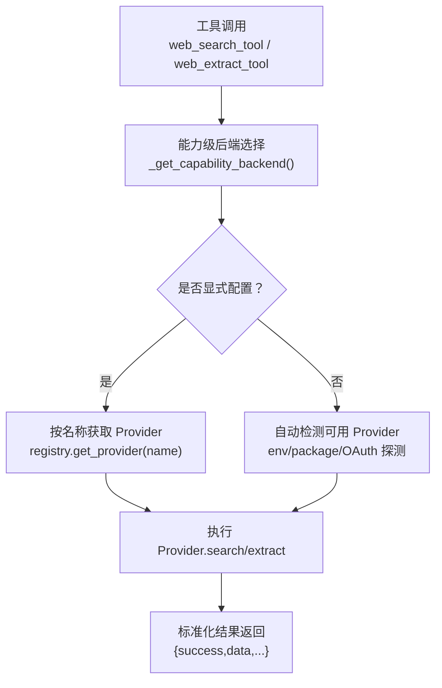
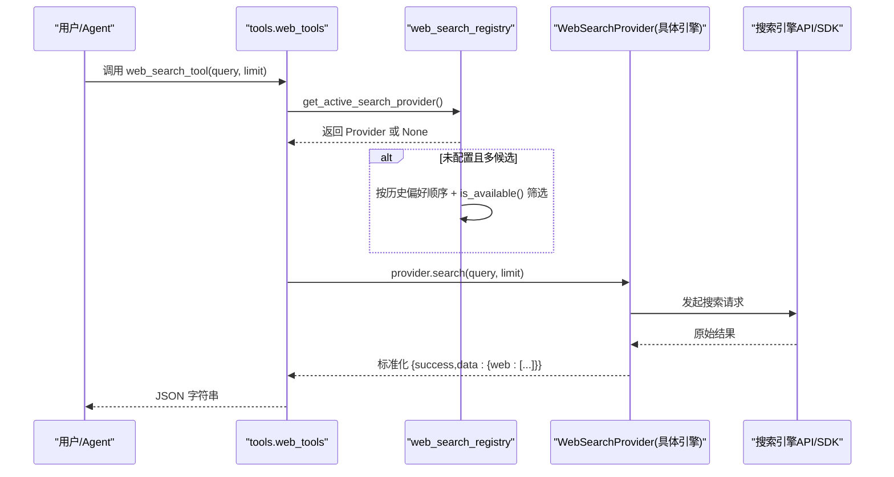
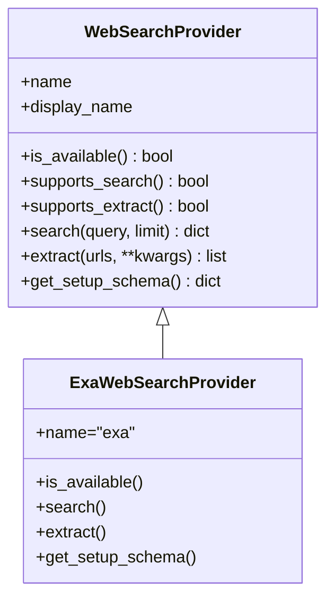
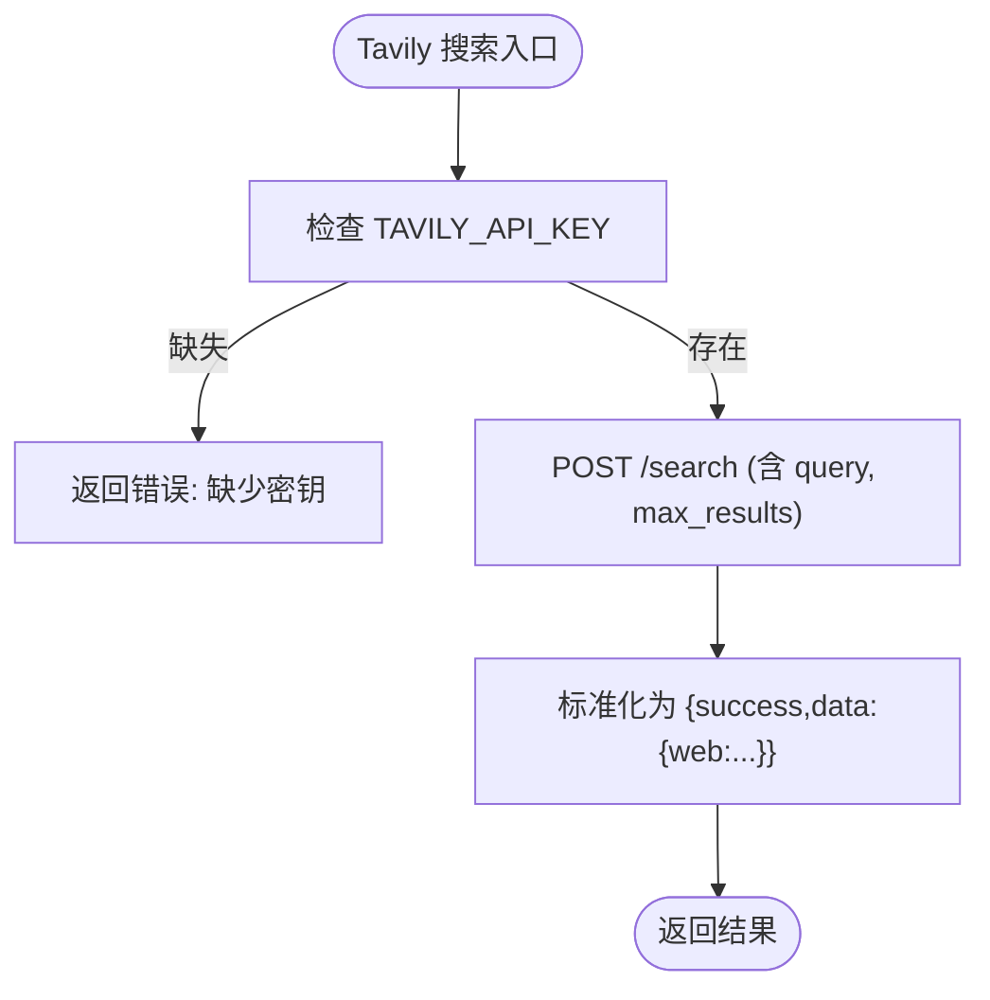
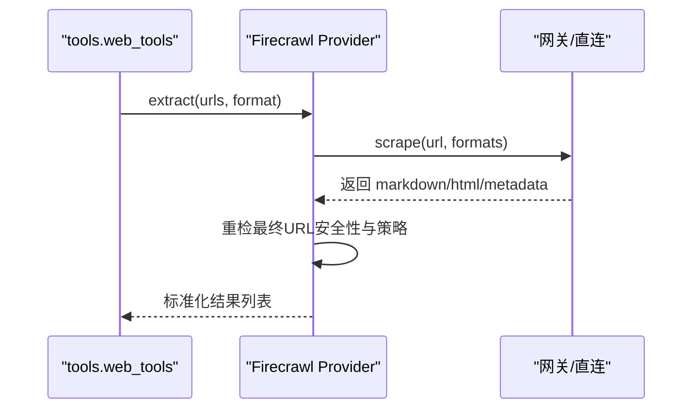
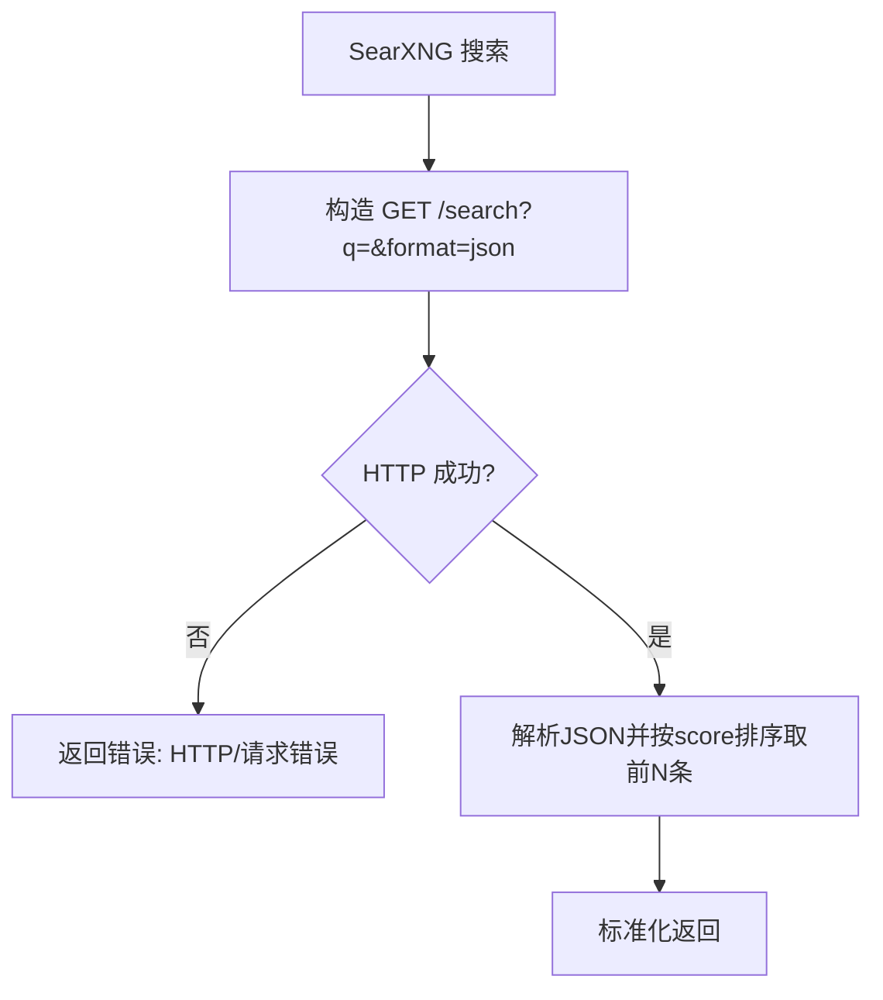
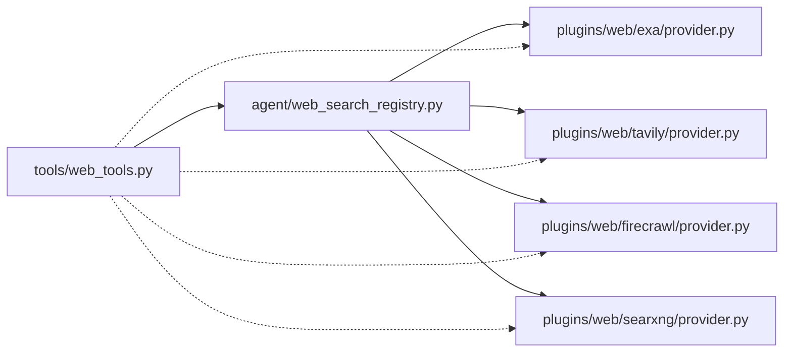

# 搜索引擎集成

<cite>
**本文引用的文件**
- [agent/web_search_provider.py](file://agent/web_search_provider.py)
- [agent/web_search_registry.py](file://agent/web_search_registry.py)
- [tools/web_tools.py](file://tools/web_tools.py)
- [plugins/web/exa/provider.py](file://plugins/web/exa/provider.py)
- [plugins/web/tavily/provider.py](file://plugins/web/tavily/provider.py)
- [plugins/web/firecrawl/provider.py](file://plugins/web/firecrawl/provider.py)
- [plugins/web/searxng/provider.py](file://plugins/web/searxng/provider.py)
</cite>

## 目录
1. [简介](#简介)
2. [项目结构](#项目结构)
3. [核心组件](#核心组件)
4. [架构总览](#架构总览)
5. [详细组件分析](#详细组件分析)
6. [依赖关系分析](#依赖关系分析)
7. [性能与可用性](#性能与可用性)
8. [故障排查指南](#故障排查指南)
9. [结论](#结论)
10. [附录：配置与使用示例](#附录配置与使用示例)

## 简介
本文件面向 Hermes Agent 的“网络搜索/内容提取”能力，系统性说明其支持的搜索引擎后端（Exa、Parallel、Tavily、Firecrawl、SearXNG、Brave Free、DDGS）的配置方式、参数与结果格式、选择机制、自动检测与故障转移逻辑，并提供 web_search_tool 的使用范式、结果处理建议以及优化实践。文档同时给出代码级架构图与时序图，帮助读者快速定位问题并高效调优。

## 项目结构
Hermes 将“Web 搜索/提取”抽象为可插拔的后端提供者（Provider），并通过统一的注册表进行发现与调度。核心文件职责如下：
- agent/web_search_provider.py：定义 WebSearchProvider 抽象接口与统一响应契约。
- agent/web_search_registry.py：维护 Provider 注册表、解析配置、按能力（search/extract）选择活跃 Provider。
- tools/web_tools.py：对外暴露 web_search_tool / web_extract_tool；负责能力级后端选择、环境变量读取、兼容层与调试输出。
- plugins/web/*：各搜索引擎的具体实现（Exa、Tavily、Firecrawl、SearXNG 等），均继承 WebSearchProvider 并实现 search/extract。

图表来源
- [tools/web_tools.py:223-308](file://tools/web_tools.py#L223-L308)
- [agent/web_search_registry.py:133-219](file://agent/web_search_registry.py#L133-L219)

章节来源
- [agent/web_search_provider.py:89-212](file://agent/web_search_provider.py#L89-L212)
- [agent/web_search_registry.py:1-31](file://agent/web_search_registry.py#L1-L31)
- [tools/web_tools.py:121-308](file://tools/web_tools.py#L121-L308)

## 核心组件
- WebSearchProvider（抽象基类）
  - 提供 name、display_name、is_available、supports_search、supports_extract、search、extract、get_setup_schema 等统一接口。
  - 统一响应形状：搜索返回 {success, data:{web:[...]}}；提取返回列表项，每项包含 url/title/content/raw_content/metadata/error 等字段。
- 注册表（Registry）
  - 维护 Provider 映射，支持按 capability 过滤与优先级回退。
  - 解析配置键：web.search_backend / web.extract_backend / web.backend。
  - 内置“历史偏好顺序”用于无显式配置时的自动选择。
- 工具层（Tools）
  - web_search_tool：封装查询、限流、中断检查、调试日志，委托给当前活跃的搜索 Provider。
  - web_extract_tool：URL 安全校验、截断与缓存策略、base64 图片替换、异步抓取超时控制、政策拦截等。

章节来源
- [agent/web_search_provider.py:89-212](file://agent/web_search_provider.py#L89-L212)
- [agent/web_search_registry.py:98-219](file://agent/web_search_registry.py#L98-L219)
- [tools/web_tools.py:618-739](file://tools/web_tools.py#L618-L739)
- [tools/web_tools.py:742-800](file://tools/web_tools.py#L742-L800)

## 架构总览
下图展示从工具调用到具体搜索引擎后端的完整流程，包括配置解析、Provider 选择、能力过滤、异常回退与结果标准化。

图表来源
- [tools/web_tools.py:618-739](file://tools/web_tools.py#L618-L739)
- [agent/web_search_registry.py:133-219](file://agent/web_search_registry.py#L133-L219)

## 详细组件分析

### Exa（语义+内容提取）
- 能力：search=True，extract=True
- 认证与环境变量：EXA_API_KEY（通过 get_provider_env 读取，优先于进程环境）
- 搜索参数：query、limit（num_results）、highlights
- 结果格式：
  - 搜索：{success:true, data:{web:[{title,url,description,position}]}}
  - 提取：列表项含 url/title/content/raw_content/metadata
- 特点：语义检索能力强，适合知识型问答；提取质量高但受限于 SDK 行为与配额。

图表来源
- [agent/web_search_provider.py:89-212](file://agent/web_search_provider.py#L89-L212)
- [plugins/web/exa/provider.py:87-217](file://plugins/web/exa/provider.py#L87-L217)

章节来源
- [plugins/web/exa/provider.py:41-117](file://plugins/web/exa/provider.py#L41-L117)
- [plugins/web/exa/provider.py:115-217](file://plugins/web/exa/provider.py#L115-L217)

### Tavily（搜索+提取一体化）
- 能力：search=True，extract=True
- 认证与环境变量：TAVILY_API_KEY（必需），TAVILY_BASE_URL（可选）
- 搜索参数：query、max_results（<=20）、include_raw_content=False、include_images=False
- 结果格式：
  - 搜索：{success:true, data:{web:[{title,url,description,position}]}}
  - 提取：列表项含 url/title/content/raw_content/metadata；失败项带 error
- 特点：轻量 HTTP 调用，稳定易用；适合通用搜索与页面内容提取。

图表来源
- [plugins/web/tavily/provider.py:35-77](file://plugins/web/tavily/provider.py#L35-L77)
- [plugins/web/tavily/provider.py:153-176](file://plugins/web/tavily/provider.py#L153-L176)

章节来源
- [plugins/web/tavily/provider.py:35-127](file://plugins/web/tavily/provider.py#L35-L127)
- [plugins/web/tavily/provider.py:153-225](file://plugins/web/tavily/provider.py#L153-L225)

### Firecrawl（搜索+提取，直连/托管网关双模式）
- 能力：search=True，extract=True
- 认证与环境变量：
  - 直连：FIRECRAWL_API_KEY、FIRECRAWL_API_URL（可选）
  - 托管网关：FIRECRAWL_GATEWAY_URL 或通过 TOOL_GATEWAY_* 组合（订阅者）
- 搜索参数：query、limit
- 提取参数：format=markdown/html（默认两者都请求，优先 markdown）
- 结果格式：
  - 搜索：{success:true, data:{web:[...]}}
  - 提取：列表项含 url/title/content/raw_content/metadata；失败项带 error
- 特性：
  - 懒加载 SDK，减少冷启动开销
  - 每 URL 抓取超时 60s，SSRF 重检、网站访问策略二次校验
  - 支持 direct/gateway 双路径，按配置优先选择

图表来源
- [plugins/web/firecrawl/provider.py:212-265](file://plugins/web/firecrawl/provider.py#L212-L265)
- [plugins/web/firecrawl/provider.py:423-600](file://plugins/web/firecrawl/provider.py#L423-L600)

章节来源
- [plugins/web/firecrawl/provider.py:77-110](file://plugins/web/firecrawl/provider.py#L77-L110)
- [plugins/web/firecrawl/provider.py:123-177](file://plugins/web/firecrawl/provider.py#L123-L177)
- [plugins/web/firecrawl/provider.py:370-421](file://plugins/web/firecrawl/provider.py#L370-L421)
- [plugins/web/firecrawl/provider.py:423-618](file://plugins/web/firecrawl/provider.py#L423-L618)

### SearXNG（聚合搜索，仅搜索）
- 能力：search=True，extract=False
- 认证与环境变量：SEARXNG_URL（指向自托管实例）
- 搜索参数：q=query、format=json、pageno=1
- 结果格式：{success:true, data:{web:[{title,url,description,position}]}}
- 特点：隐私友好、可私有化部署；适合本地/内网聚合搜索场景。

图表来源
- [plugins/web/searxng/provider.py:68-139](file://plugins/web/searxng/provider.py#L68-L139)

章节来源
- [plugins/web/searxng/provider.py:34-66](file://plugins/web/searxng/provider.py#L34-L66)
- [plugins/web/searxng/provider.py:68-154](file://plugins/web/searxng/provider.py#L68-L154)

### Parallel（搜索+提取）
- 能力：search=True，extract=True
- 认证与环境变量：PARALLEL_API_KEY
- 说明：该 Provider 由插件系统注册，工具层通过 registry 选择并调用；其客户端构造在工具层以兼容名导出。

章节来源
- [tools/web_tools.py:68-75](file://tools/web_tools.py#L68-L75)
- [tools/web_tools.py:311-352](file://tools/web_tools.py#L311-L352)

### Brave Free（免费搜索）
- 能力：search=True，extract=False（通常）
- 认证与环境变量：BRAVE_SEARCH_API_KEY
- 说明：作为内置“免费”候选参与自动选择；若未安装或未配置则不可用。

章节来源
- [tools/web_tools.py:241-250](file://tools/web_tools.py#L241-L250)
- [tools/web_tools.py:338-341](file://tools/web_tools.py#L338-L341)

### DDGS（DuckDuckGo 搜索）
- 能力：search=True，extract=False（通常）
- 可用性：依赖 ddgs Python 包可导入
- 说明：无需 API Key，适合快速体验与离线/受限环境。

章节来源
- [tools/web_tools.py:355-367](file://tools/web_tools.py#L355-L367)
- [tools/web_tools.py:241-250](file://tools/web_tools.py#L241-L250)

## 依赖关系分析
- 工具层依赖注册表进行 Provider 选择；注册表依赖配置与 Provider.is_available()。
- 各 Provider 依赖各自的环境变量/包/SDK；部分 Provider 还依赖网站访问策略与安全校验。
- 工具层对第三方 SDK（如 firecrawl、exa-py）采用懒加载，降低冷启动成本。

图表来源
- [tools/web_tools.py:618-739](file://tools/web_tools.py#L618-L739)
- [agent/web_search_registry.py:133-219](file://agent/web_search_registry.py#L133-L219)

章节来源
- [tools/web_tools.py:121-308](file://tools/web_tools.py#L121-L308)
- [agent/web_search_registry.py:1-31](file://agent/web_search_registry.py#L1-L31)

## 性能与可用性
- 冷启动优化：Firecrawl/Exa SDK 懒加载，避免无关依赖影响 CLI 启动速度。
- 超时保护：Firecrawl 单 URL 抓取 60s 超时，避免阻塞。
- 内容裁剪：web_extract_tool 对大页面进行 head+tail 截断，并将全文写入缓存，提示模型分页读取，减少上下文占用。
- base64 图片替换：将内联 base64 图片替换为占位符，显著降低 token 消耗。
- 可用性探测：is_available() 仅做轻量检查（环境变量/包导入/配置），不发起网络请求，保证工具列表渲染与选择快速。

章节来源
- [plugins/web/firecrawl/provider.py:77-110](file://plugins/web/firecrawl/provider.py#L77-L110)
- [plugins/web/firecrawl/provider.py:423-510](file://plugins/web/firecrawl/provider.py#L423-L510)
- [tools/web_tools.py:450-577](file://tools/web_tools.py#L450-L577)
- [agent/web_search_provider.py:116-140](file://agent/web_search_provider.py#L116-L140)

## 故障排查指南
- “未配置任何搜索后端”
  - 现象：web_search_tool 返回错误提示运行 hermes tools 设置。
  - 可能原因：未设置任何后端环境变量；或显式配置的插件被禁用。
  - 处理：设置对应环境变量（如 EXA_API_KEY/TAVILY_API_KEY/FIRECRAWL_API_KEY/SEARXNG_URL/BRAVE_SEARCH_API_KEY），或在已禁用时启用插件。
- “API Key 未设置”
  - 现象：Provider 抛出缺少密钥的错误。
  - 处理：根据 Provider 要求设置环境变量；可通过 hermes tools 界面配置。
- “SearXNG 无法连接”
  - 现象：HTTP 错误或请求错误。
  - 处理：确认 SEARXNG_URL 可达，端口/防火墙/代理正确。
- “Firecrawl 抓取超时/被策略拦截”
  - 现象：超时或 blocked_by_policy。
  - 处理：缩短 limit、重试、更换更具体的 URL；检查网站访问策略与目标域白名单。
- “DDGS 不可用”
  - 现象：ddgs 包未安装导致不可用。
  - 处理：安装 ddgs 或切换到其他后端。

章节来源
- [tools/web_tools.py:685-716](file://tools/web_tools.py#L685-L716)
- [plugins/web/searxng/provider.py:68-139](file://plugins/web/searxng/provider.py#L68-L139)
- [plugins/web/firecrawl/provider.py:486-599](file://plugins/web/firecrawl/provider.py#L486-L599)
- [tools/web_tools.py:355-367](file://tools/web_tools.py#L355-L367)

## 结论
Hermes 通过统一的 WebSearchProvider 抽象与注册表机制，实现了搜索引擎后端的松耦合接入与灵活选择。工具层提供健壮的错误处理、性能优化与安全策略，覆盖从搜索到内容提取的全链路。推荐在生产环境中：
- 明确配置 web.search_backend / web.extract_backend，避免隐式回退带来的不确定性。
- 针对高频任务选择稳定、低延迟的 Provider（如 Tavily/Firecrawl）。
- 对大页面提取启用截断与缓存策略，结合 read_file 分页阅读。
- 利用网站访问策略与 SSRF 防护，确保提取过程安全可控。

## 附录：配置与使用示例

### 环境变量与配置键
- 通用
  - web.search_backend / web.extract_backend / web.backend：指定搜索/提取后端或共享默认值。
- 各后端关键环境变量
  - Exa：EXA_API_KEY
  - Tavily：TAVILY_API_KEY，可选 TAVILY_BASE_URL
  - Firecrawl：FIRECRAWL_API_KEY 或 FIRECRAWL_API_URL；或使用 TOOL_GATEWAY_* 组合的托管网关
  - SearXNG：SEARXNG_URL
  - Brave Free：BRAVE_SEARCH_API_KEY
  - DDGS：无需 Key，需安装 ddgs 包

章节来源
- [agent/web_search_registry.py:133-219](file://agent/web_search_registry.py#L133-L219)
- [plugins/web/exa/provider.py:15-18](file://plugins/web/exa/provider.py#L15-L18)
- [plugins/web/tavily/provider.py:18-22](file://plugins/web/tavily/provider.py#L18-L22)
- [plugins/web/firecrawl/provider.py:27-44](file://plugins/web/firecrawl/provider.py#L27-L44)
- [plugins/web/searxng/provider.py:18-21](file://plugins/web/searxng/provider.py#L18-L21)

### 使用 web_search_tool 进行搜索
- 输入
  - query：搜索关键词
  - limit：结果数量上限（默认 5，范围 1..100）
- 输出
  - JSON 字符串，包含 success 与 data.web 列表，每项有 title/url/description/position
- 典型流程
  - 工具层读取配置与环境变量，选择 Provider；调用 Provider.search；标准化结果返回。

章节来源
- [tools/web_tools.py:618-739](file://tools/web_tools.py#L618-L739)
- [agent/web_search_provider.py:22-49](file://agent/web_search_provider.py#L22-L49)

### 使用 web_extract_tool 提取内容
- 输入
  - urls：URL 字符串或包含 url/href 的对象列表
  - format：markdown/html（可选）
  - char_limit：每页字符预算（默认来自配置或 15000）
- 输出
  - JSON 字符串，包含 results 列表；每项含 url/title/content/raw_content/metadata/error
- 特性
  - URL 安全校验、base64 图片替换、大页面截断与缓存、SSRF/策略二次检查、超时保护

章节来源
- [tools/web_tools.py:742-800](file://tools/web_tools.py#L742-L800)
- [plugins/web/firecrawl/provider.py:423-600](file://plugins/web/firecrawl/provider.py#L423-L600)

### 搜索引擎选择机制与自动检测
- 优先级
  1) 显式配置：web.search_backend / web.extract_backend
  2) 共享默认：web.backend
  3) 唯一可用 Provider 快捷路径
  4) 历史偏好顺序（firecrawl → parallel → tavily → exa → searxng → brave-free → ddgs），按 is_available() 过滤
  5) 否则返回 None，工具层提示配置
- 自动检测
  - 基于环境变量/包导入/配置项的轻量探测，不发起网络请求
  - 工具层对内置后端提供 _is_backend_available 判定

章节来源
- [agent/web_search_registry.py:10-31](file://agent/web_search_registry.py#L10-L31)
- [agent/web_search_registry.py:133-219](file://agent/web_search_registry.py#L133-L219)
- [tools/web_tools.py:223-352](file://tools/web_tools.py#L223-L352)

### 性能特点与适用场景
- Exa：语义检索强，适合知识问答与高质量摘要；付费服务，注意配额。
- Tavily：HTTP 调用简单稳定，适合通用搜索与页面提取。
- Firecrawl：功能最全，支持直连与托管网关；适合复杂页面与大规模抓取，注意超时与策略。
- SearXNG：隐私友好、可私有化；适合内网/合规场景。
- Brave Free：免费易上手；适合轻量搜索。
- DDGS：无需 Key，适合快速体验与受限环境。

章节来源
- [plugins/web/exa/provider.py:204-217](file://plugins/web/exa/provider.py#L204-L217)
- [plugins/web/tavily/provider.py:212-225](file://plugins/web/tavily/provider.py#L212-L225)
- [plugins/web/firecrawl/provider.py:602-618](file://plugins/web/firecrawl/provider.py#L602-L618)
- [plugins/web/searxng/provider.py:141-154](file://plugins/web/searxng/provider.py#L141-L154)

### 最佳实践与优化技巧
- 明确配置后端：生产环境建议显式设置 web.search_backend / web.extract_backend，避免隐式回退。
- 合理设置 limit：搜索限制结果数，减少后续处理成本。
- 大页面提取：使用 web_extract_tool 的 char_limit 与截断策略，配合 read_file 分页阅读。
- 安全策略：启用网站访问策略与 SSRF 防护，避免敏感/内网地址泄露。
- 监控与调试：开启 WEB_TOOLS_DEBUG 记录调用与压缩指标，便于定位问题。
- 资源隔离：对耗时抓取任务使用超时与重试策略，避免阻塞主流程。

章节来源
- [tools/web_tools.py:417-448](file://tools/web_tools.py#L417-L448)
- [tools/web_tools.py:450-577](file://tools/web_tools.py#L450-L577)
- [plugins/web/firecrawl/provider.py:486-599](file://plugins/web/firecrawl/provider.py#L486-L599)