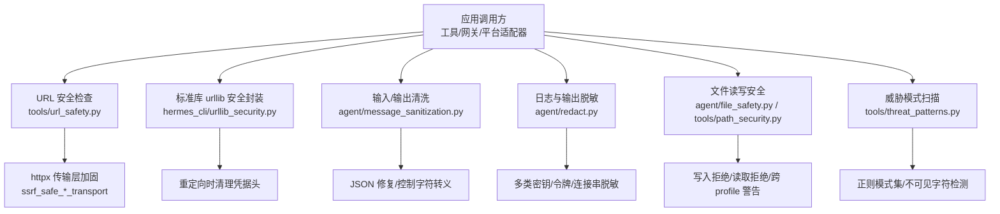
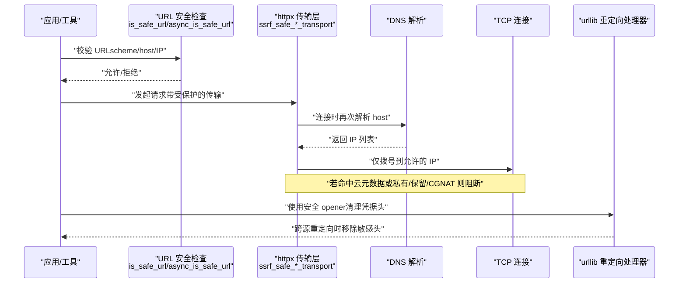
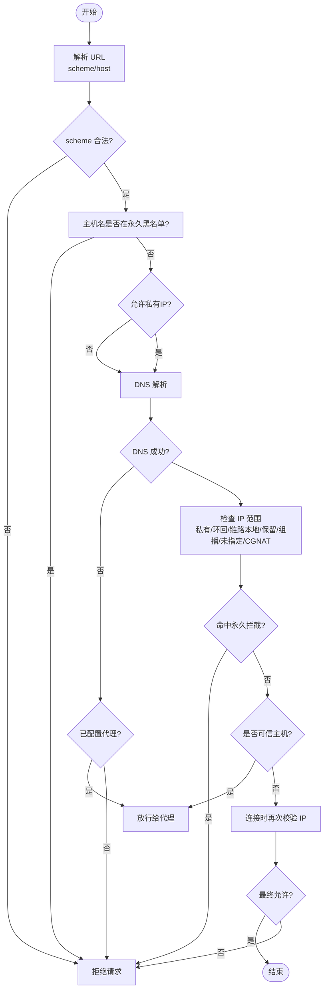
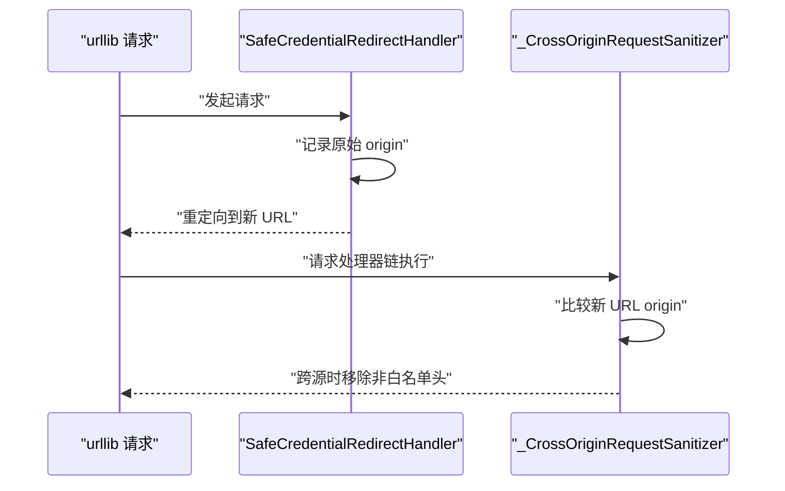
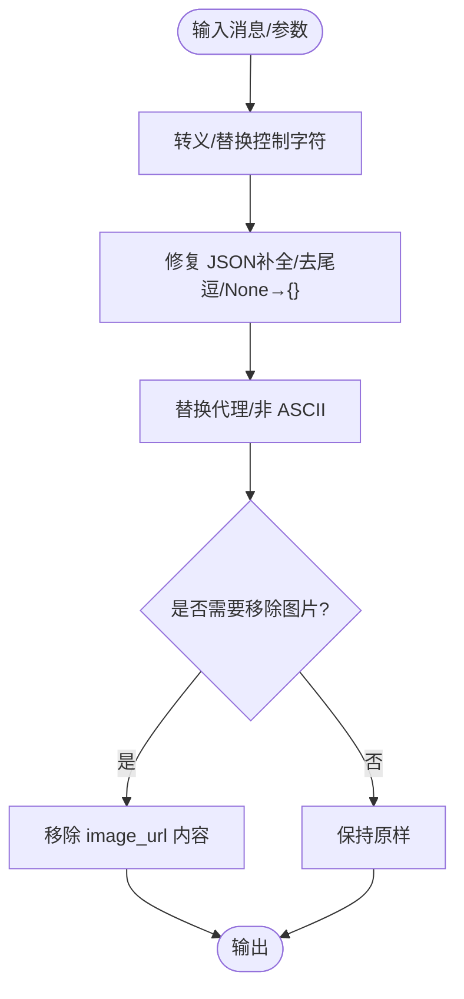
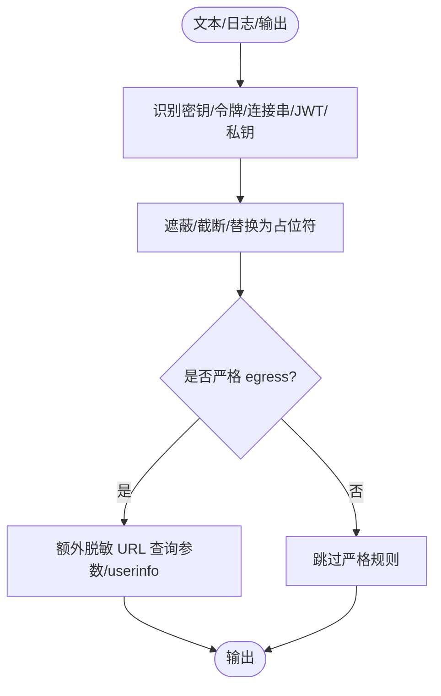
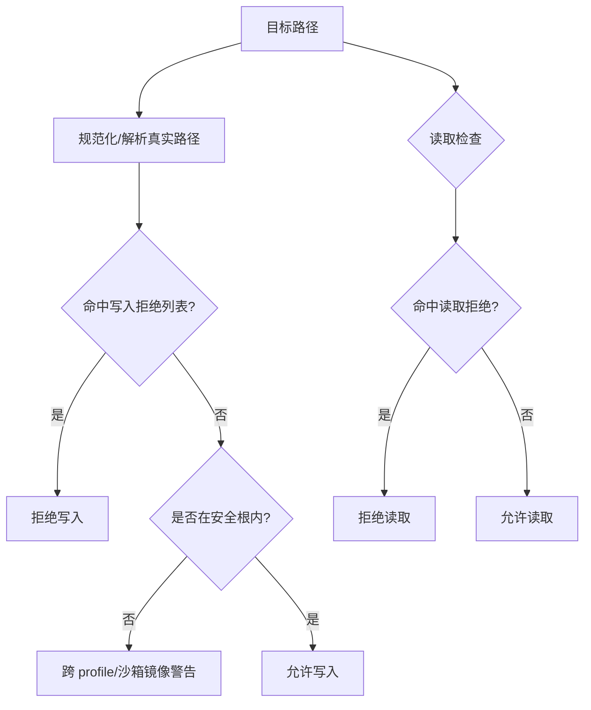
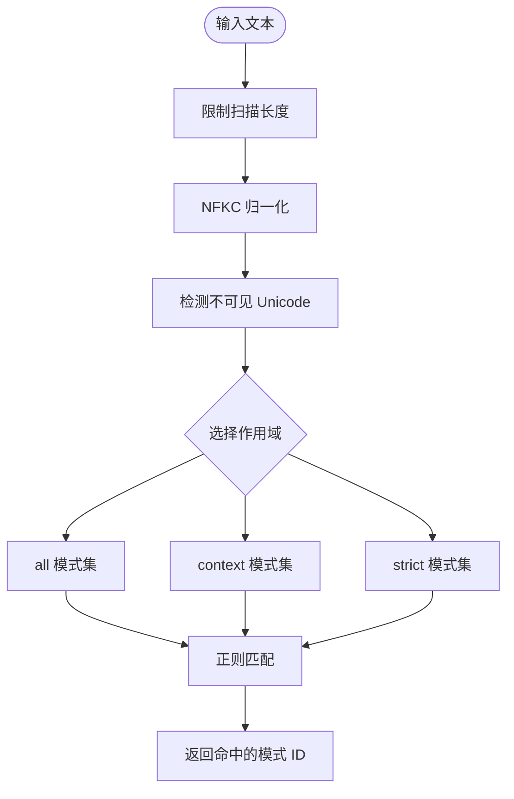
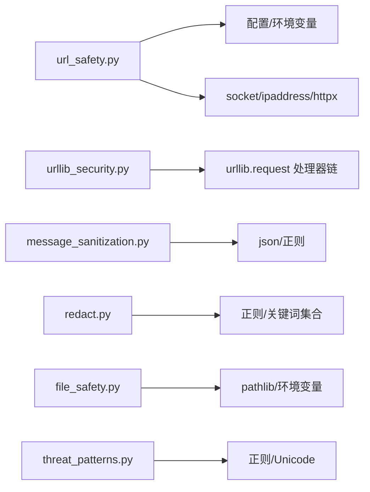

# 网络安全

<cite>
**本文引用的文件**
- [tools/url_safety.py](file://tools/url_safety.py)
- [hermes_cli/urllib_security.py](file://hermes_cli/urllib_security.py)
- [agent/redact.py](file://agent/redact.py)
- [agent/message_sanitization.py](file://agent/message_sanitization.py)
- [agent/file_safety.py](file://agent/file_safety.py)
- [tools/path_security.py](file://tools/path_security.py)
- [tools/threat_patterns.py](file://tools/threat_patterns.py)
</cite>

## 目录
1. [简介](#简介)
2. [项目结构](#项目结构)
3. [核心组件](#核心组件)
4. [架构总览](#架构总览)
5. [详细组件分析](#详细组件分析)
6. [依赖关系分析](#依赖关系分析)
7. [性能考量](#性能考量)
8. [故障排查指南](#故障排查指南)
9. [结论](#结论)
10. [附录](#附录)

## 简介
本文件聚焦 Hermes Agent 在网络请求与数据处理中的安全保护能力，覆盖以下关键主题：
- URL 安全检查机制：敏感信息检测、SSRF（服务器端请求伪造）防护、恶意链接识别。
- 威胁模式匹配算法：如何识别并阻止提示注入、C2 行为、数据外泄等攻击。
- 输入验证与输出清理：消息与工具载荷的净化、JSON 修复、控制字符处理。
- 日志脱敏：对日志、错误、工具输出的统一脱敏策略。
- 安全配置指南：如何正确启用/关闭安全选项，避免常见风险。
- 最佳实践与漏洞防护示例：结合代码路径给出可操作的安全实践。

## 项目结构
Hermes Agent 的安全能力分布在多个模块中，围绕“网络出站”“输入/输出清洗”“文件系统访问”“威胁检测”四大方向组织：
- 网络出站安全：URL 校验、连接时 DNS 校验、重定向头清理。
- 输入/输出清洗：消息结构净化、JSON 参数修复、非 ASCII/代理字符处理。
- 文件系统安全：读写白名单/黑名单、跨 profile 与沙箱镜像写保护。
- 威胁检测：基于正则的模式扫描，覆盖提示注入、C2、持久化、硬编码密钥等。

**图表来源**
- [tools/url_safety.py:415-528](file://tools/url_safety.py#L415-L528)
- [hermes_cli/urllib_security.py:31-132](file://hermes_cli/urllib_security.py#L31-L132)
- [agent/message_sanitization.py:144-293](file://agent/message_sanitization.py#L144-L293)
- [agent/redact.py:772-800](file://agent/redact.py#L772-L800)
- [agent/file_safety.py:28-163](file://agent/file_safety.py#L28-L163)
- [tools/path_security.py:15-43](file://tools/path_security.py#L15-L43)
- [tools/threat_patterns.py:207-255](file://tools/threat_patterns.py#L207-L255)

**章节来源**
- [tools/url_safety.py:1-26](file://tools/url_safety.py#L1-L26)
- [hermes_cli/urllib_security.py:1-15](file://hermes_cli/urllib_security.py#L1-L15)
- [agent/message_sanitization.py:1-13](file://agent/message_sanitization.py#L1-L13)
- [agent/redact.py:1-8](file://agent/redact.py#L1-L8)
- [agent/file_safety.py:1-8](file://agent/file_safety.py#L1-L8)
- [tools/path_security.py:1-6](file://tools/path_security.py#L1-L6)
- [tools/threat_patterns.py:1-41](file://tools/threat_patterns.py#L1-L41)

## 核心组件
- URL 安全与 SSRF 防护：解析 URL、DNS 解析、IP 范围检查、云元数据地址强制拦截、连接时二次校验、可信主机例外。
- 标准库 urllib 安全：重定向时清理凭据头，防止跨源泄露。
- 输入/输出清洗：替换非法代理字符、修复 JSON、剥离非 ASCII、移除图片内容等。
- 日志与输出脱敏：识别多种密钥前缀、表单/URL/配置/JSON 字段、数据库连接串、JWT、私钥块等并脱敏。
- 文件安全：禁止写入敏感路径、限制写入到安全根、阻止读取敏感文件、跨 profile 与沙箱镜像写警告。
- 威胁模式扫描：按作用域（all/context/strict）应用正则模式，检测提示注入、C2、持久化、外泄等。

**章节来源**
- [tools/url_safety.py:415-528](file://tools/url_safety.py#L415-L528)
- [hermes_cli/urllib_security.py:31-132](file://hermes_cli/urllib_security.py#L31-L132)
- [agent/message_sanitization.py:144-293](file://agent/message_sanitization.py#L144-L293)
- [agent/redact.py:772-800](file://agent/redact.py#L772-L800)
- [agent/file_safety.py:28-163](file://agent/file_safety.py#L28-L163)
- [tools/path_security.py:15-43](file://tools/path_security.py#L15-L43)
- [tools/threat_patterns.py:207-255](file://tools/threat_patterns.py#L207-L255)

## 架构总览
下图展示从“应用调用”到“网络出站”的关键安全路径，包括预检、连接时校验与重定向防护。

**图表来源**
- [tools/url_safety.py:415-528](file://tools/url_safety.py#L415-L528)
- [tools/url_safety.py:539-595](file://tools/url_safety.py#L539-L595)
- [tools/url_safety.py:707-752](file://tools/url_safety.py#L707-L752)
- [hermes_cli/urllib_security.py:31-132](file://hermes_cli/urllib_security.py#L31-L132)

## 详细组件分析

### URL 安全检查与 SSRF 防护
- 预检阶段：
  - 仅允许 http/https；拒绝不支持 scheme。
  - 解析 hostname，屏蔽云元数据主机名（如 metadata.google.internal）。
  - 解析为 IP 后检查是否属于私有/环回/链路本地/保留/组播/未指定/CGNAT 范围。
  - 支持全局开关 security.allow_private_urls（或环境变量），但云元数据地址始终被拦截。
  - 在代理环境下 DNS 失败时，若配置了代理且非字面量 IP，则放行给代理侧解析。
- 连接阶段：
  - 通过 httpx 自定义传输层在 TCP 连接前再次解析并校验 IP，缩小 DNS 重绑定窗口。
  - 限制每个主机最多尝试若干 IP，避免过多拨号。
  - Unix socket 连接直接拒绝。
- 可信主机例外：
  - 特定 HTTPS 主机（如多媒体域名）允许解析到私有/基准网段 IP。

**图表来源**
- [tools/url_safety.py:415-528](file://tools/url_safety.py#L415-L528)
- [tools/url_safety.py:539-595](file://tools/url_safety.py#L539-L595)

**章节来源**
- [tools/url_safety.py:1-26](file://tools/url_safety.py#L1-L26)
- [tools/url_safety.py:163-210](file://tools/url_safety.py#L163-L210)
- [tools/url_safety.py:220-287](file://tools/url_safety.py#L220-L287)
- [tools/url_safety.py:289-308](file://tools/url_safety.py#L289-L308)
- [tools/url_safety.py:311-408](file://tools/url_safety.py#L311-L408)
- [tools/url_safety.py:415-528](file://tools/url_safety.py#L415-L528)
- [tools/url_safety.py:539-595](file://tools/url_safety.py#L539-L595)
- [tools/url_safety.py:707-752](file://tools/url_safety.py#L707-L752)

### 标准库 urllib 安全：重定向凭据头清理
- 目标：防止重定向到不同源时携带认证头（如 Authorization、Cookie、自定义 provider 头）造成凭据泄露。
- 实现要点：
  - 记录原始请求的 origin（scheme、hostname、端口）。
  - 重定向时若新 URL 的 origin 与原始不同，则移除不在白名单内的所有头（默认仅 accept、user-agent）。
  - 通过安装处理器链，确保后续处理器无法重新添加敏感头。

**图表来源**
- [hermes_cli/urllib_security.py:17-28](file://hermes_cli/urllib_security.py#L17-L28)
- [hermes_cli/urllib_security.py:31-83](file://hermes_cli/urllib_security.py#L31-L83)
- [hermes_cli/urllib_security.py:86-132](file://hermes_cli/urllib_security.py#L86-L132)

**章节来源**
- [hermes_cli/urllib_security.py:1-15](file://hermes_cli/urllib_security.py#L1-L15)
- [hermes_cli/urllib_security.py:31-132](file://hermes_cli/urllib_security.py#L31-L132)

### 输入验证与输出清理
- 代理字符与 JSON 修复：
  - 替换无效控制字符，避免 json.dumps 崩溃。
  - 修复尾随逗号、闭合括号、Python None 等常见畸形 JSON。
  - 对字符串值内未转义的控制字符进行转义。
- 消息结构净化：
  - 替换代理码点，避免上游 API 拒绝。
  - 剥离非 ASCII（极端环境下的兜底）。
  - 当服务端不支持图片时，移除 image_url 内容并保持消息交替不变。
- 工具调用参数修复：
  - 多轮修复策略，最终降级为空对象以保证会话不崩溃。

**图表来源**
- [agent/message_sanitization.py:144-293](file://agent/message_sanitization.py#L144-L293)
- [agent/message_sanitization.py:328-393](file://agent/message_sanitization.py#L328-L393)
- [agent/message_sanitization.py:401-446](file://agent/message_sanitization.py#L401-L446)

**章节来源**
- [agent/message_sanitization.py:1-13](file://agent/message_sanitization.py#L1-L13)
- [agent/message_sanitization.py:144-293](file://agent/message_sanitization.py#L144-L293)
- [agent/message_sanitization.py:328-393](file://agent/message_sanitization.py#L328-L393)
- [agent/message_sanitization.py:401-446](file://agent/message_sanitization.py#L401-L446)

### 日志与输出脱敏
- 覆盖范围：
  - 已知密钥前缀（OpenAI、GitHub、AWS、Stripe、SendGrid、GitLab 等家族）。
  - 表单/URL/配置/JSON 字段中的敏感键值。
  - 数据库连接串、JWT、私钥块、Telegram Bot Token、E.164 电话号。
  - 控制字符分割的 token 拼接场景。
- 策略：
  - 短 token 完全遮蔽；长 token 保留首尾用于调试。
  - 针对“非复用”标记的脱敏，避免将截断值误写回配置。
  - 对 CDP 浏览器端点 URL 额外开启严格脱敏（查询参数与 userinfo）。
- 配置：
  - 默认开启；可通过配置项或环境变量关闭（启动时会记录告警）。

**图表来源**
- [agent/redact.py:772-800](file://agent/redact.py#L772-L800)
- [agent/redact.py:549-608](file://agent/redact.py#L549-L608)
- [agent/redact.py:610-692](file://agent/redact.py#L610-L692)
- [agent/redact.py:695-717](file://agent/redact.py#L695-L717)

**章节来源**
- [agent/redact.py:1-8](file://agent/redact.py#L1-L8)
- [agent/redact.py:772-800](file://agent/redact.py#L772-L800)
- [agent/redact.py:549-608](file://agent/redact.py#L549-L608)
- [agent/redact.py:610-692](file://agent/redact.py#L610-L692)
- [agent/redact.py:695-717](file://agent/redact.py#L695-L717)

### 文件读写安全
- 写入保护：
  - 禁止写入系统/凭据敏感文件（SSH、.env、OAuth 缓存、sudoers、passwd/shadow 等）。
  - 限制写入到 HERMES_WRITE_SAFE_ROOT 白名单目录。
  - 跨 profile 写入与沙箱镜像写入提供软保护与警告。
- 读取保护：
  - 禁止读取内部缓存（skills/.hub）、凭据存储（auth.json、.env、mcp-tokens 等）、项目 .env 文件。
  - 提供明确的拒绝原因与用户可见的错误信息。
- 路径校验：
  - 规范化路径并校验是否位于允许目录内，检测 .. 穿越。

**图表来源**
- [agent/file_safety.py:28-163](file://agent/file_safety.py#L28-L163)
- [agent/file_safety.py:194-337](file://agent/file_safety.py#L194-L337)
- [agent/file_safety.py:417-506](file://agent/file_safety.py#L417-L506)
- [agent/file_safety.py:551-616](file://agent/file_safety.py#L551-L616)
- [tools/path_security.py:15-43](file://tools/path_security.py#L15-L43)

**章节来源**
- [agent/file_safety.py:28-163](file://agent/file_safety.py#L28-L163)
- [agent/file_safety.py:194-337](file://agent/file_safety.py#L194-L337)
- [agent/file_safety.py:417-506](file://agent/file_safety.py#L417-L506)
- [agent/file_safety.py:551-616](file://agent/file_safety.py#L551-L616)
- [tools/path_security.py:15-43](file://tools/path_security.py#L15-L43)

### 威胁模式匹配算法
- 设计原则：
  - 按攻击类别组织模式，而非按文件组织。
  - 作用域分级：all（通用注入/外泄）、context（上下文/记忆/工具结果更宽泛）、strict（用户介入路径更激进）。
  - 使用有界填充词防止简单插入绕过，同时避免回溯灾难。
- 检测内容：
  - 经典提示注入、角色劫持、C2 通信、反取证指令、持久化/SSH 后门、硬编码密钥、外泄命令等。
  - 不可见 Unicode 字符检测（零宽空格、方向隔离符等）。
- 扫描流程：
  - 限制最大扫描长度，保证最坏情况性能可控。
  - NFKC 归一化以抵御全角/兼容变体混淆。
  - 按作用域选择编译后的模式集合进行匹配。

**图表来源**
- [tools/threat_patterns.py:207-255](file://tools/threat_patterns.py#L207-L255)
- [tools/threat_patterns.py:137-159](file://tools/threat_patterns.py#L137-L159)
- [tools/threat_patterns.py:49-63](file://tools/threat_patterns.py#L49-L63)

**章节来源**
- [tools/threat_patterns.py:1-41](file://tools/threat_patterns.py#L1-L41)
- [tools/threat_patterns.py:49-63](file://tools/threat_patterns.py#L49-L63)
- [tools/threat_patterns.py:137-159](file://tools/threat_patterns.py#L137-L159)
- [tools/threat_patterns.py:207-255](file://tools/threat_patterns.py#L207-L255)

## 依赖关系分析
- URL 安全模块依赖：
  - 配置读取（security.allow_private_urls、browser.allow_private_urls 历史兼容）。
  - 网络栈（socket.getaddrinfo、ipaddress、httpx/httpcore 后端）。
- urllib 安全模块依赖：
  - 全局 opener 与处理器链，确保重定向时清理凭据头。
- 输入/输出清洗模块依赖：
  - JSON 解析/序列化、正则表达式、消息结构遍历。
- 脱敏模块依赖：
  - 大量正则与关键词集合，覆盖多类密钥格式与上下文。
- 文件安全模块依赖：
  - 路径解析、环境变量（HERMES_WRITE_SAFE_ROOT）、profile 与沙箱镜像路径推断。
- 威胁模式模块依赖：
  - 正则引擎、Unicode 归一化、作用域选择。

**图表来源**
- [tools/url_safety.py:220-287](file://tools/url_safety.py#L220-L287)
- [tools/url_safety.py:539-595](file://tools/url_safety.py#L539-L595)
- [hermes_cli/urllib_security.py:86-132](file://hermes_cli/urllib_security.py#L86-L132)
- [agent/message_sanitization.py:144-293](file://agent/message_sanitization.py#L144-L293)
- [agent/redact.py:772-800](file://agent/redact.py#L772-L800)
- [agent/file_safety.py:83-98](file://agent/file_safety.py#L83-L98)
- [tools/threat_patterns.py:207-255](file://tools/threat_patterns.py#L207-L255)

**章节来源**
- [tools/url_safety.py:220-287](file://tools/url_safety.py#L220-L287)
- [hermes_cli/urllib_security.py:86-132](file://hermes_cli/urllib_security.py#L86-L132)
- [agent/message_sanitization.py:144-293](file://agent/message_sanitization.py#L144-L293)
- [agent/redact.py:772-800](file://agent/redact.py#L772-L800)
- [agent/file_safety.py:83-98](file://agent/file_safety.py#L83-L98)
- [tools/threat_patterns.py:207-255](file://tools/threat_patterns.py#L207-L255)

## 性能考量
- URL 安全：
  - DNS 解析可能阻塞事件循环，提供异步版本在后台线程执行。
  - 连接时解析限制最大尝试 IP 数量，避免过多拨号。
- 威胁模式扫描：
  - 限制最大扫描字符数，避免超长文本导致正则回溯开销过大。
  - 使用 NFKC 归一化减少混淆带来的重复匹配。
- 脱敏：
  - 对控制字符分割的 token 采用“去控制字符后匹配再映射回原位置”的策略，兼顾性能与安全。
  - 对 JSON 字符串进行逐字符扫描以避免多次正则开销。

[本节为通用指导，无需具体文件引用]

## 故障排查指南
- 网络请求被拒绝：
  - 检查 URL scheme 是否合法、hostname 是否命中永久黑名单。
  - 确认是否处于代理环境，DNS 失败时是否配置了代理。
  - 查看日志中关于私有/保留/CGNAT 地址的阻断信息。
- 重定向凭据泄露：
  - 确认使用了安全 opener，跨源重定向时凭据头已被移除。
- 日志/输出仍包含敏感信息：
  - 确认脱敏功能已启用（默认开启），必要时在 egress 边界启用严格 URL 脱敏。
  - 检查是否为 CDP 浏览器端点 URL，应使用专用脱敏函数。
- 文件写入/读取被拒绝：
  - 检查目标路径是否在拒绝列表或安全根之外。
  - 对于跨 profile 或沙箱镜像写入，根据警告信息进行修正。
- 威胁模式误报/漏报：
  - 调整作用域（all/context/strict）与模式集合，关注不可见 Unicode 字符。

**章节来源**
- [tools/url_safety.py:415-528](file://tools/url_safety.py#L415-L528)
- [hermes_cli/urllib_security.py:31-132](file://hermes_cli/urllib_security.py#L31-L132)
- [agent/redact.py:695-717](file://agent/redact.py#L695-L717)
- [agent/file_safety.py:194-337](file://agent/file_safety.py#L194-L337)
- [tools/threat_patterns.py:207-255](file://tools/threat_patterns.py#L207-L255)

## 结论
Hermes Agent 在网络请求与数据处理方面提供了多层次的安全保护：
- 通过 URL 预检与连接时双重校验有效缓解 SSRF 风险，并对云元数据地址实施强制拦截。
- 标准库 urllib 安全封装防止重定向导致的凭据泄露。
- 输入/输出清洗保障消息与 JSON 的健壮性，避免上游 API 拒绝或崩溃。
- 统一的脱敏策略覆盖多种密钥形态与上下文，降低日志与输出泄露风险。
- 文件读写安全提供严格的拒绝策略与软保护，防止误写/误读敏感区域。
- 威胁模式扫描以作用域分级的方式平衡检测强度与误报率。

建议在生产环境中：
- 保持默认安全设置（URL 安全、脱敏、文件拒绝策略）。
- 仅在明确需求下启用私有 IP 允许，并确保云元数据地址始终被拦截。
- 在 egress 边界启用严格 URL 脱敏，尤其对浏览器/CDP 端点。
- 定期审查威胁模式与配置，避免误报影响业务。

[本节为总结性内容，无需具体文件引用]

## 附录
- 安全配置要点：
  - 启用/禁用私有 IP 允许：通过配置项或环境变量控制，注意云元数据地址永远被拦截。
  - 启用/禁用脱敏：默认开启；如需关闭请在配置中显式设置，并注意启动时的告警。
  - 设置写入安全根：通过环境变量限定可写入目录，避免误写敏感路径。
- 最佳实践示例：
  - 对所有外部 URL 使用 is_safe_url/async_is_safe_url 预检。
  - 使用 ssrf_safe_http_transport/ssrf_safe_async_http_transport 创建受保护的 httpx 客户端。
  - 使用 open_credentialed_url 发起标准库请求，避免跨源凭据泄露。
  - 在工具输出与日志输出处调用 redact_sensitive_text，必要时启用严格 URL 脱敏。
  - 在文件操作前调用 is_write_denied/get_read_block_error 进行前置检查。
  - 对模型生成的上下文/记忆/工具结果进行 threat_patterns 扫描，按作用域采取阻断或告警。

[本节为补充说明，无需具体文件引用]