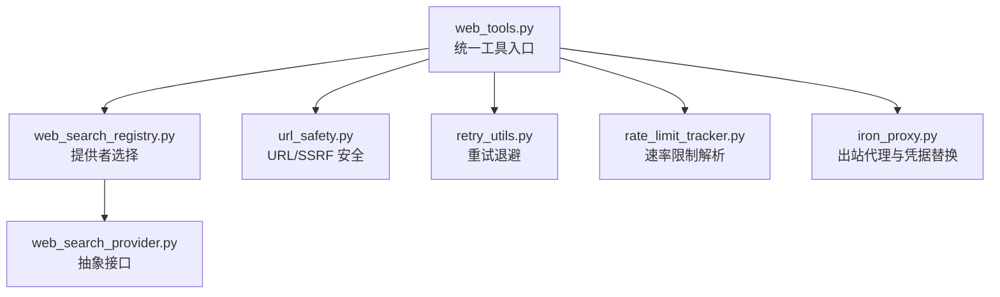
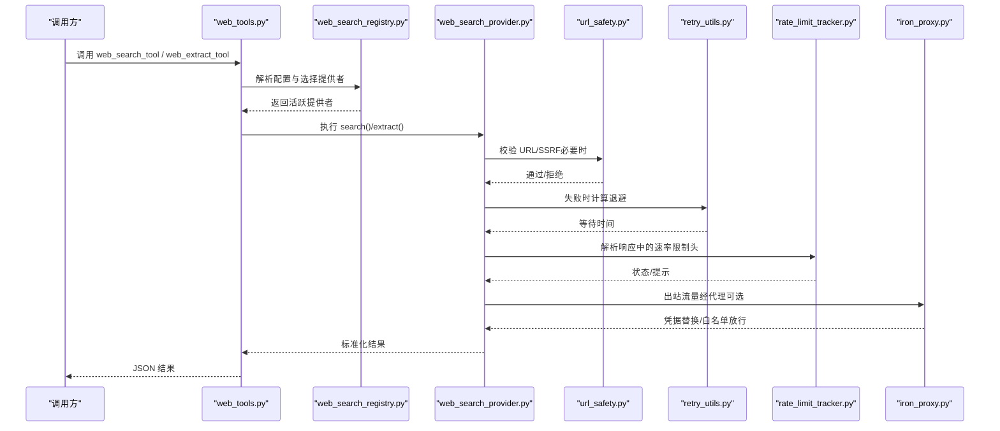
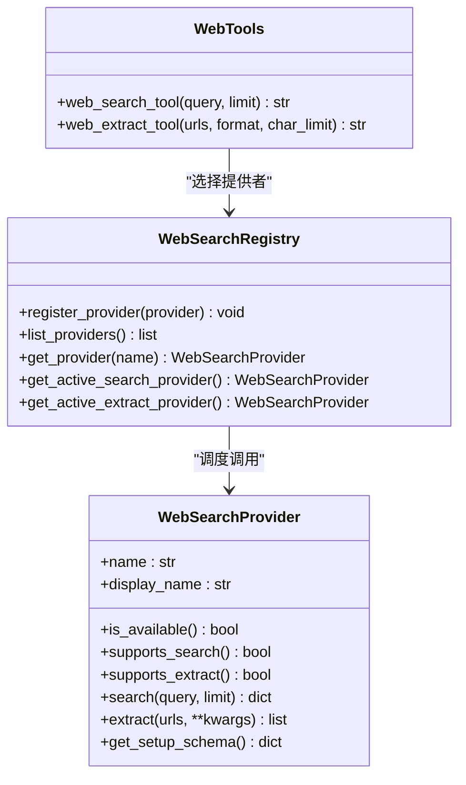
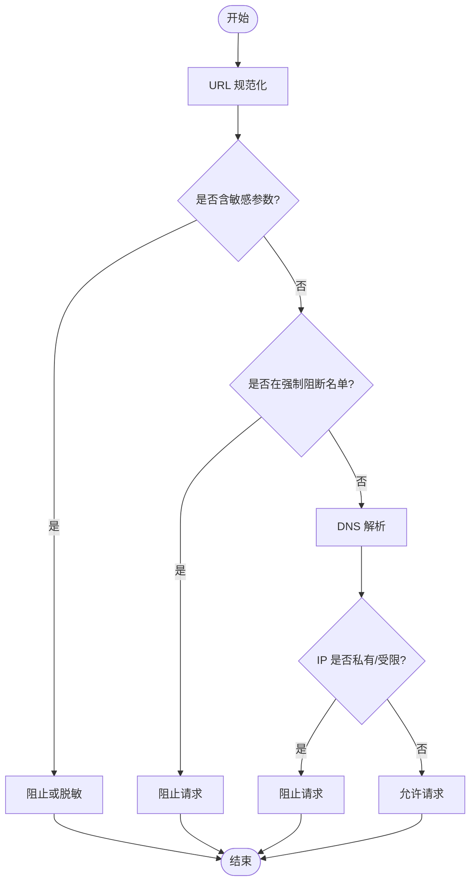
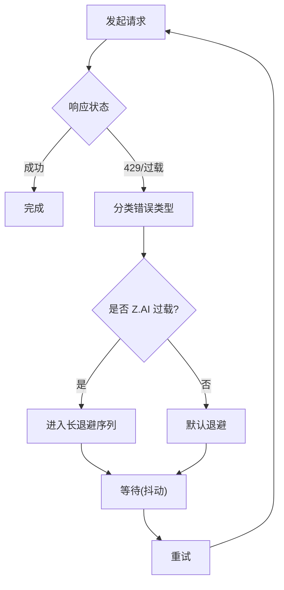
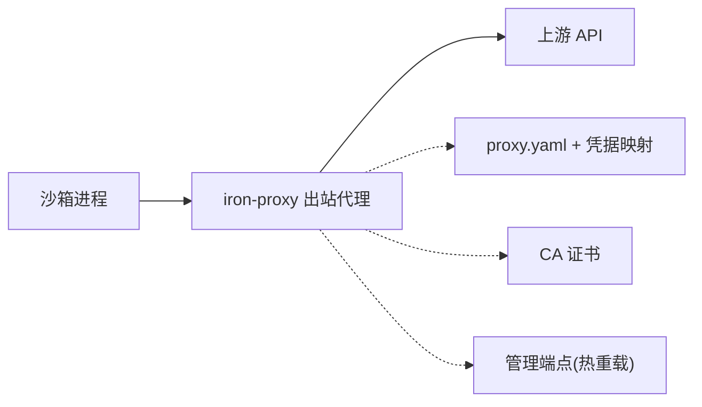
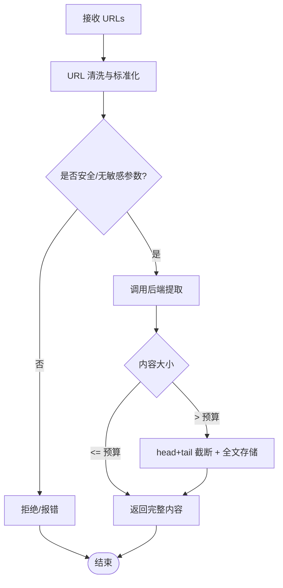
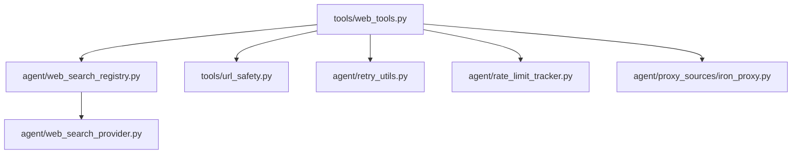

# 网络工具

<cite>
**本文引用的文件**
- [agent/web_search_provider.py](file://agent/web_search_provider.py)
- [agent/web_search_registry.py](file://agent/web_search_registry.py)
- [tools/web_tools.py](file://tools/web_tools.py)
- [agent/retry_utils.py](file://agent/retry_utils.py)
- [agent/rate_limit_tracker.py](file://agent/rate_limit_tracker.py)
- [tools/url_safety.py](file://tools/url_safety.py)
- [agent/proxy_sources/iron_proxy.py](file://agent/proxy_sources/iron_proxy.py)
</cite>

## 目录
1. [简介](#简介)
2. [项目结构](#项目结构)
3. [核心组件](#核心组件)
4. [架构总览](#架构总览)
5. [详细组件分析](#详细组件分析)
6. [依赖关系分析](#依赖关系分析)
7. [性能考量](#性能考量)
8. [故障排查指南](#故障排查指南)
9. [结论](#结论)
10. [附录](#附录)

## 简介
本文件面向 Hermes Agent 的网络能力，聚焦“网络请求与外部服务集成”。内容覆盖：
- Web 搜索与内容提取（搜索引擎、第三方服务）
- HTTP 客户端与安全策略（SSRF 防护、URL 规范化、敏感参数检测）
- 认证机制与凭据注入（代理与凭据替换）
- 重试与退避（抖动退避、速率限制感知）
- 缓存策略（大页面截断与全文存储、插件注册表）
- 错误处理（统一错误形状、可观测性）
- 实际应用场景（数据抓取、API 代理、消息发送等）

## 项目结构
围绕网络能力的核心模块分布如下：
- 抽象与注册：WebSearchProvider 抽象、WebSearchRegistry 注册与选择
- 工具层：web_search_tool / web_extract_tool 作为统一入口
- 安全层：URL 安全校验、连接时 DNS 校验、SSRF 防护传输
- 可靠性层：重试退避、速率限制解析与展示
- 代理与凭据：iron-proxy 出站控制与凭据替换

图表来源
- [tools/web_tools.py:121-352](file://tools/web_tools.py#L121-L352)
- [agent/web_search_registry.py:133-219](file://agent/web_search_registry.py#L133-L219)
- [agent/web_search_provider.py:89-212](file://agent/web_search_provider.py#L89-L212)
- [tools/url_safety.py:415-529](file://tools/url_safety.py#L415-L529)
- [agent/retry_utils.py:90-128](file://agent/retry_utils.py#L90-L128)
- [agent/rate_limit_tracker.py:92-129](file://agent/rate_limit_tracker.py#L92-L129)
- [agent/proxy_sources/iron_proxy.py:1-80](file://agent/proxy_sources/iron_proxy.py#L1-L80)

章节来源
- [tools/web_tools.py:121-352](file://tools/web_tools.py#L121-L352)
- [agent/web_search_registry.py:133-219](file://agent/web_search_registry.py#L133-L219)
- [agent/web_search_provider.py:89-212](file://agent/web_search_provider.py#L89-L212)
- [tools/url_safety.py:415-529](file://tools/url_safety.py#L415-L529)
- [agent/retry_utils.py:90-128](file://agent/retry_utils.py#L90-L128)
- [agent/rate_limit_tracker.py:92-129](file://agent/rate_limit_tracker.py#L92-L129)
- [agent/proxy_sources/iron_proxy.py:1-80](file://agent/proxy_sources/iron_proxy.py#L1-L80)

## 核心组件
- Web 搜索/提取抽象与注册
  - WebSearchProvider：定义 name、is_available、supports_search/extract、search、extract、get_setup_schema 等能力。
  - WebSearchRegistry：维护提供者集合，按配置优先级与可用性选择活跃提供者；支持 per-capability 覆盖（search_backend/extract_backend）。
- 工具封装
  - web_search_tool：统一搜索入口，返回标准化 JSON（success/data.web）。
  - web_extract_tool：统一提取入口，返回标准化结果列表（url/title/content/raw_content/metadata/error），并对大页进行截断与全文存储。
- 安全与合规
  - URL 安全：is_safe_url/async_is_safe_url、always-blocked 名单、连接时 IP 校验、敏感查询参数检测、重定向与 SSRF 防护传输。
- 可靠性与可观测性
  - 重试退避：jittered_backoff、adaptive_rate_limit_backoff、zai_coding_overload_retry_ceiling。
  - 速率限制：解析 x-ratelimit-* 头并格式化展示。
- 出站代理与凭据管理
  - iron-proxy：自动安装、CA 生成、白名单、凭据替换（Authorization/x-api-key 等）、管理端点重载。

章节来源
- [agent/web_search_provider.py:89-212](file://agent/web_search_provider.py#L89-L212)
- [agent/web_search_registry.py:48-219](file://agent/web_search_registry.py#L48-L219)
- [tools/web_tools.py:618-800](file://tools/web_tools.py#L618-L800)
- [tools/url_safety.py:106-162](file://tools/url_safety.py#L106-L162)
- [tools/url_safety.py:311-529](file://tools/url_safety.py#L311-L529)
- [agent/retry_utils.py:38-128](file://agent/retry_utils.py#L38-L128)
- [agent/rate_limit_tracker.py:30-129](file://agent/rate_limit_tracker.py#L30-L129)
- [agent/proxy_sources/iron_proxy.py:1-80](file://agent/proxy_sources/iron_proxy.py#L1-L80)

## 架构总览
下图展示了从工具调用到后端提供者的完整路径，以及安全、重试、速率限制与代理的横切关注点。

图表来源
- [tools/web_tools.py:618-800](file://tools/web_tools.py#L618-L800)
- [agent/web_search_registry.py:133-219](file://agent/web_search_registry.py#L133-L219)
- [agent/web_search_provider.py:142-184](file://agent/web_search_provider.py#L142-L184)
- [tools/url_safety.py:415-529](file://tools/url_safety.py#L415-L529)
- [agent/retry_utils.py:90-128](file://agent/retry_utils.py#L90-L128)
- [agent/rate_limit_tracker.py:92-129](file://agent/rate_limit_tracker.py#L92-L129)
- [agent/proxy_sources/iron_proxy.py:1-80](file://agent/proxy_sources/iron_proxy.py#L1-L80)

## 详细组件分析

### Web 搜索与提取（提供者抽象与注册）
- 抽象接口
  - WebSearchProvider 定义了统一的搜索/提取能力与元数据描述，便于多后端切换。
- 注册与选择
  - 优先使用显式配置（web.search_backend / web.extract_backend），否则回退到共享 backend，再按内置偏好顺序与 is_available() 筛选。
  - 单提供者快捷路径：当仅有一个具备能力且可用的提供者时直接选用。
- 工具封装
  - web_search_tool：限流 limit、中断检查、注册表加载、调用 provider.search，返回标准 JSON。
  - web_extract_tool：URL 清洗与安全校验、大页截断与全文存储、base64 图片占位替换、异步安全校验。

图表来源
- [agent/web_search_provider.py:89-212](file://agent/web_search_provider.py#L89-L212)
- [agent/web_search_registry.py:48-219](file://agent/web_search_registry.py#L48-L219)
- [tools/web_tools.py:618-800](file://tools/web_tools.py#L618-L800)

章节来源
- [agent/web_search_provider.py:89-212](file://agent/web_search_provider.py#L89-L212)
- [agent/web_search_registry.py:133-219](file://agent/web_search_registry.py#L133-L219)
- [tools/web_tools.py:618-800](file://tools/web_tools.py#L618-L800)

### 网络安全与 SSRF 防护
- URL 规范化与敏感参数检测
  - normalize_url_for_request：IRI→URI 规范化，保留语义。
  - sensitive_query_param_name：识别携带凭证的查询参数名。
- 强制阻断名单
  - always-blocked hostnames/IPs（云元数据地址、链路本地段等）。
- 安全校验流程
  - is_safe_url：DNS 解析后检查私有/内部/受限网段，支持全局开关与可信主机例外。
  - async_is_safe_url：异步版本，避免阻塞事件循环。
  - 连接时校验：_resolved_http_connect_ips 在 TCP 连接前再次校验，关闭 DNS 重绑定窗口。
  - SSRF 安全传输：ssrf_safe_http_transport/ssrf_safe_async_http_transport 为 httpx 注入受保护的网络后端。

图表来源
- [tools/url_safety.py:58-104](file://tools/url_safety.py#L58-L104)
- [tools/url_safety.py:106-162](file://tools/url_safety.py#L106-L162)
- [tools/url_safety.py:311-529](file://tools/url_safety.py#L311-L529)
- [tools/url_safety.py:539-595](file://tools/url_safety.py#L539-L595)
- [tools/url_safety.py:707-752](file://tools/url_safety.py#L707-L752)

章节来源
- [tools/url_safety.py:58-104](file://tools/url_safety.py#L58-L104)
- [tools/url_safety.py:106-162](file://tools/url_safety.py#L106-L162)
- [tools/url_safety.py:311-529](file://tools/url_safety.py#L311-L529)
- [tools/url_safety.py:539-595](file://tools/url_safety.py#L539-L595)
- [tools/url_safety.py:707-752](file://tools/url_safety.py#L707-L752)

### 重试与速率限制
- 重试退避
  - jittered_backoff：指数退避+抖动，避免雪崩。
  - adaptive_rate_limit_backoff：针对特定供应商过载（如 Z.AI Coding Plan）的自适应长退避。
  - zai_coding_overload_retry_ceiling：确保长退避序列可达。
- 速率限制解析
  - parse_rate_limit_headers：解析 x-ratelimit-* 头，构建 RateLimitState。
  - format_rate_limit_display/compact：终端友好展示与紧凑摘要。

图表来源
- [agent/retry_utils.py:90-128](file://agent/retry_utils.py#L90-L128)
- [agent/retry_utils.py:162-191](file://agent/retry_utils.py#L162-L191)
- [agent/retry_utils.py:194-209](file://agent/retry_utils.py#L194-L209)
- [agent/rate_limit_tracker.py:92-129](file://agent/rate_limit_tracker.py#L92-L129)

章节来源
- [agent/retry_utils.py:90-128](file://agent/retry_utils.py#L90-L128)
- [agent/retry_utils.py:162-191](file://agent/retry_utils.py#L162-L191)
- [agent/retry_utils.py:194-209](file://agent/retry_utils.py#L194-L209)
- [agent/rate_limit_tracker.py:92-129](file://agent/rate_limit_tracker.py#L92-L129)

### 出站代理与凭据注入（iron-proxy）
- 设计要点
  - 自动安装与校验：下载、GPG/SHA 校验、原子替换。
  - CA 证书：用于 TLS 拦截与重写请求头。
  - 白名单：默认允许的 AI 推理域名。
  - 凭据替换：将沙箱内的代理令牌替换为真实上游凭据（Authorization 或专用头部）。
  - 管理端点：热重载配置，无需重启。
- 环境变量与环境隔离
  - 子进程最小化环境白名单，剥离可能引发递归代理的环境变量。

图表来源
- [agent/proxy_sources/iron_proxy.py:1-80](file://agent/proxy_sources/iron_proxy.py#L1-L80)
- [agent/proxy_sources/iron_proxy.py:83-157](file://agent/proxy_sources/iron_proxy.py#L83-L157)
- [agent/proxy_sources/iron_proxy.py:226-280](file://agent/proxy_sources/iron_proxy.py#L226-L280)
- [agent/proxy_sources/iron_proxy.py:436-546](file://agent/proxy_sources/iron_proxy.py#L436-L546)
- [agent/proxy_sources/iron_proxy.py:730-800](file://agent/proxy_sources/iron_proxy.py#L730-L800)

章节来源
- [agent/proxy_sources/iron_proxy.py:1-80](file://agent/proxy_sources/iron_proxy.py#L1-L80)
- [agent/proxy_sources/iron_proxy.py:83-157](file://agent/proxy_sources/iron_proxy.py#L83-L157)
- [agent/proxy_sources/iron_proxy.py:226-280](file://agent/proxy_sources/iron_proxy.py#L226-L280)
- [agent/proxy_sources/iron_proxy.py:436-546](file://agent/proxy_sources/iron_proxy.py#L436-L546)
- [agent/proxy_sources/iron_proxy.py:730-800](file://agent/proxy_sources/iron_proxy.py#L730-L800)

### 数据抓取与内容提取（web_extract_tool）
- 输入清洗：接受 URL 字符串或包含 url/href 的对象。
- 安全前置：URL 解码后进行敏感前缀与参数检测。
- 大页处理：超过字符预算则 head+tail 截取，并将全文写入缓存目录，附带读取指引。
- 图片处理：内联 base64 图片替换为占位标记，保留真实链接以便后续抓取。

图表来源
- [tools/web_tools.py:742-800](file://tools/web_tools.py#L742-L800)
- [tools/web_tools.py:450-577](file://tools/web_tools.py#L450-L577)

章节来源
- [tools/web_tools.py:742-800](file://tools/web_tools.py#L742-L800)
- [tools/web_tools.py:450-577](file://tools/web_tools.py#L450-L577)

## 依赖关系分析
- 工具层依赖注册表，注册表依赖抽象接口。
- 工具层依赖安全模块进行 URL 校验。
- 工具层依赖重试与速率限制模块提升鲁棒性。
- 工具层可通过代理模块进行出站控制与凭据替换。

图表来源
- [tools/web_tools.py:121-352](file://tools/web_tools.py#L121-L352)
- [agent/web_search_registry.py:133-219](file://agent/web_search_registry.py#L133-L219)
- [agent/web_search_provider.py:89-212](file://agent/web_search_provider.py#L89-L212)
- [tools/url_safety.py:415-529](file://tools/url_safety.py#L415-L529)
- [agent/retry_utils.py:90-128](file://agent/retry_utils.py#L90-L128)
- [agent/rate_limit_tracker.py:92-129](file://agent/rate_limit_tracker.py#L92-L129)
- [agent/proxy_sources/iron_proxy.py:1-80](file://agent/proxy_sources/iron_proxy.py#L1-L80)

章节来源
- [tools/web_tools.py:121-352](file://tools/web_tools.py#L121-L352)
- [agent/web_search_registry.py:133-219](file://agent/web_search_registry.py#L133-L219)
- [agent/web_search_provider.py:89-212](file://agent/web_search_provider.py#L89-L212)
- [tools/url_safety.py:415-529](file://tools/url_safety.py#L415-L529)
- [agent/retry_utils.py:90-128](file://agent/retry_utils.py#L90-L128)
- [agent/rate_limit_tracker.py:92-129](file://agent/rate_limit_tracker.py#L92-L129)
- [agent/proxy_sources/iron_proxy.py:1-80](file://agent/proxy_sources/iron_proxy.py#L1-L80)

## 性能考量
- 连接与 DNS
  - 连接时二次校验防止 DNS 重绑定；限制最大尝试 IP 数量，减少无效连接。
- 大页处理
  - 截断策略降低上下文占用；全文落盘避免重复抓取。
- 重试与退避
  - 抖动退避分散并发重试峰值；针对特定过载场景的长退避提高恢复效率。
- 速率限制可视化
  - 解析并展示 RPM/TPM 等指标，辅助调优与告警。
- 代理与凭据
  - 白名单减少不必要出站；凭据替换避免泄露真实密钥。

[本节为通用指导，不直接分析具体文件]

## 故障排查指南
- 无法选择提供者
  - 检查 web.search_backend/web.extract_backend 配置与插件启用状态；确认 is_available() 条件满足。
- 搜索/提取失败
  - 查看返回的 success/error 字段；确认 API Key 或实例 URL 已正确配置。
- 频繁 429/限速
  - 观察 rate limit 展示；调整并发与重试策略；必要时启用更长退避。
- URL 被阻断
  - 检查是否为 always-blocked 目标；确认代理/DNS 环境；必要时开启 allow_private_urls（谨慎）。
- 代理相关问题
  - 确认 iron-proxy 二进制已安装、CA 已生成、端口可用；检查白名单与凭据映射；通过管理端点热重载配置。

章节来源
- [agent/web_search_registry.py:133-219](file://agent/web_search_registry.py#L133-L219)
- [tools/web_tools.py:618-800](file://tools/web_tools.py#L618-L800)
- [agent/rate_limit_tracker.py:182-247](file://agent/rate_limit_tracker.py#L182-L247)
- [tools/url_safety.py:311-529](file://tools/url_safety.py#L311-L529)
- [agent/proxy_sources/iron_proxy.py:436-546](file://agent/proxy_sources/iron_proxy.py#L436-L546)

## 结论
Hermes Agent 的网络工具以“抽象+注册”为核心，结合严格的安全策略、健壮的重试与速率限制处理、以及可控的出站代理与凭据注入，提供了稳定、安全、可扩展的 Web 搜索与内容提取能力。通过配置与插件体系，可灵活接入多种搜索引擎与第三方服务，并在生产环境中实现高可用与可观测性。

[本节为总结，不直接分析具体文件]

## 附录
- 典型用法参考
  - 搜索引擎集成：通过 web_search_tool 指定 query/limit，由注册表选择合适后端。
  - 内容抓取：web_extract_tool 传入 URL 列表，自动处理大页与图片。
  - API 代理：启用 iron-proxy 并配置白名单与凭据映射，使沙箱出站流量受控。
  - 消息发送：结合平台适配器（不在本文件范围）与工具网关，实现跨平台消息收发。
- 最佳实践
  - 始终使用 web_search_registry 选择提供者，避免硬编码后端。
  - 对敏感 URL 进行前置校验，避免凭证泄漏。
  - 合理设置重试次数与退避策略，避免对上游造成压力。
  - 定期审查速率限制指标，优化并发与批处理策略。

[本节为补充说明，不直接分析具体文件]