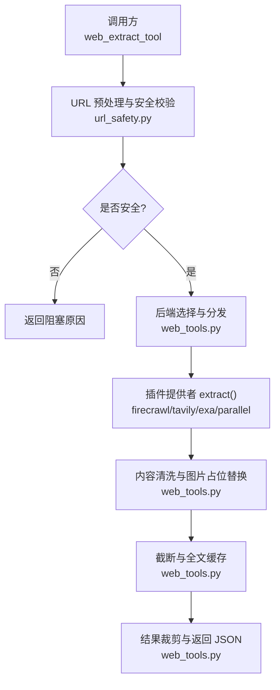
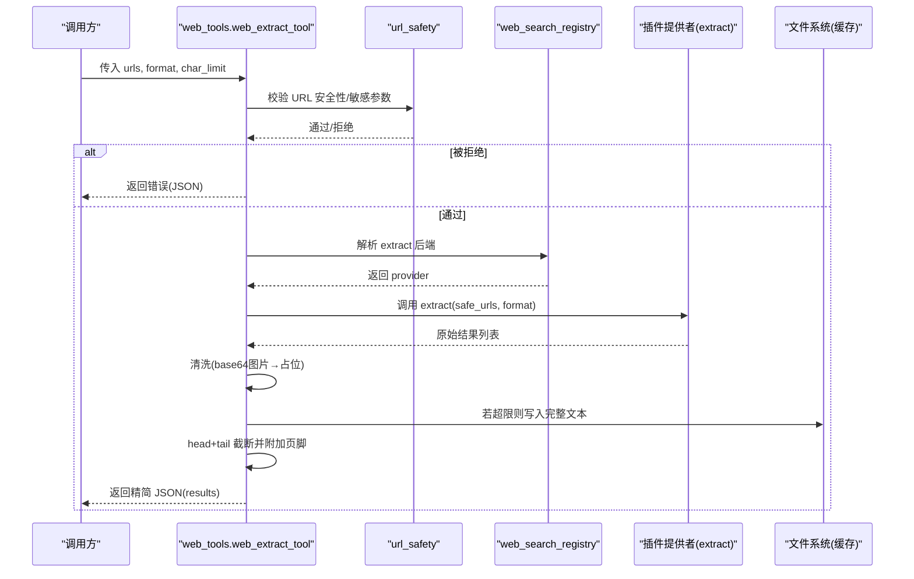
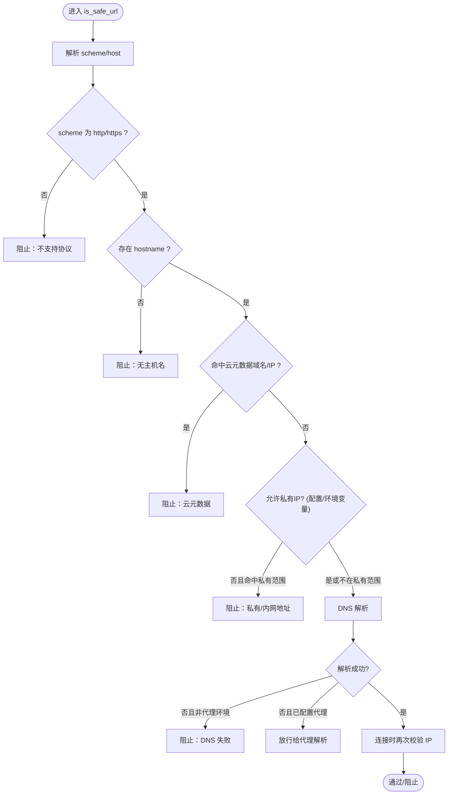
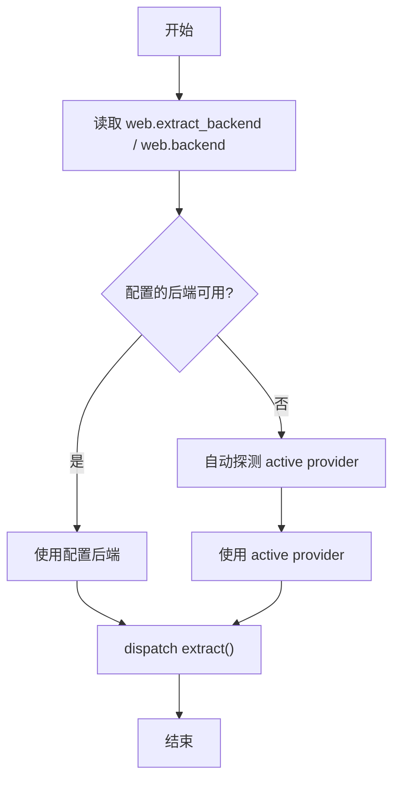
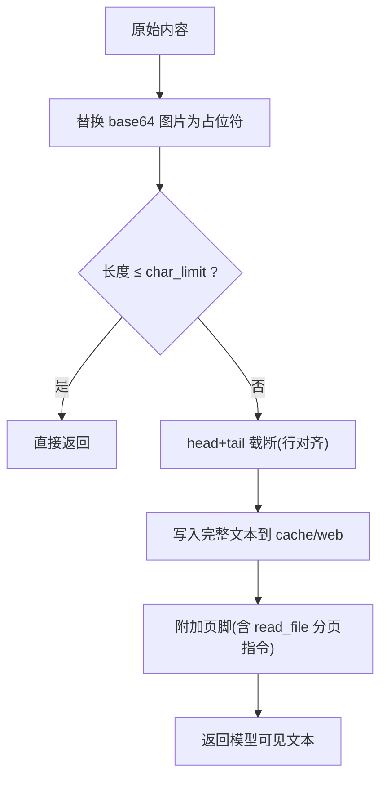
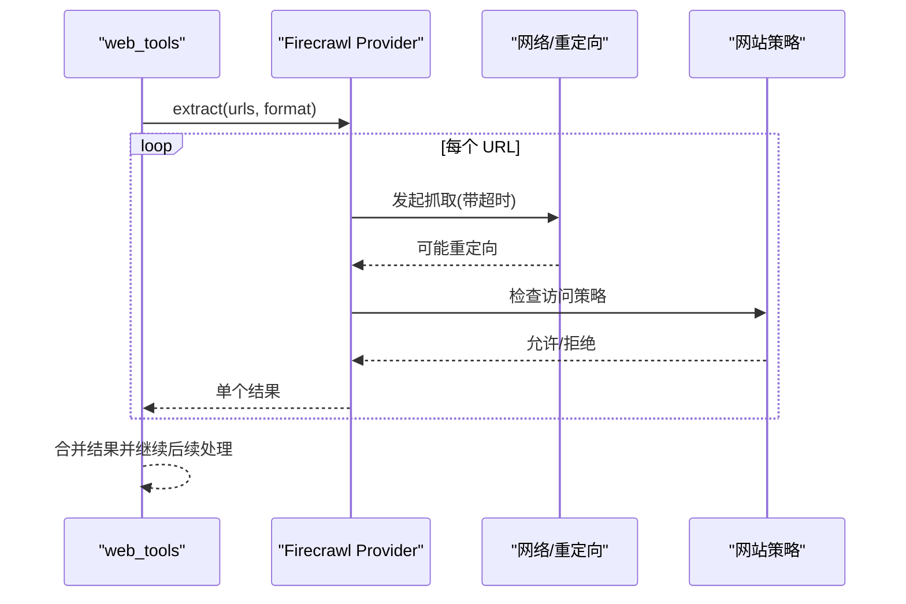
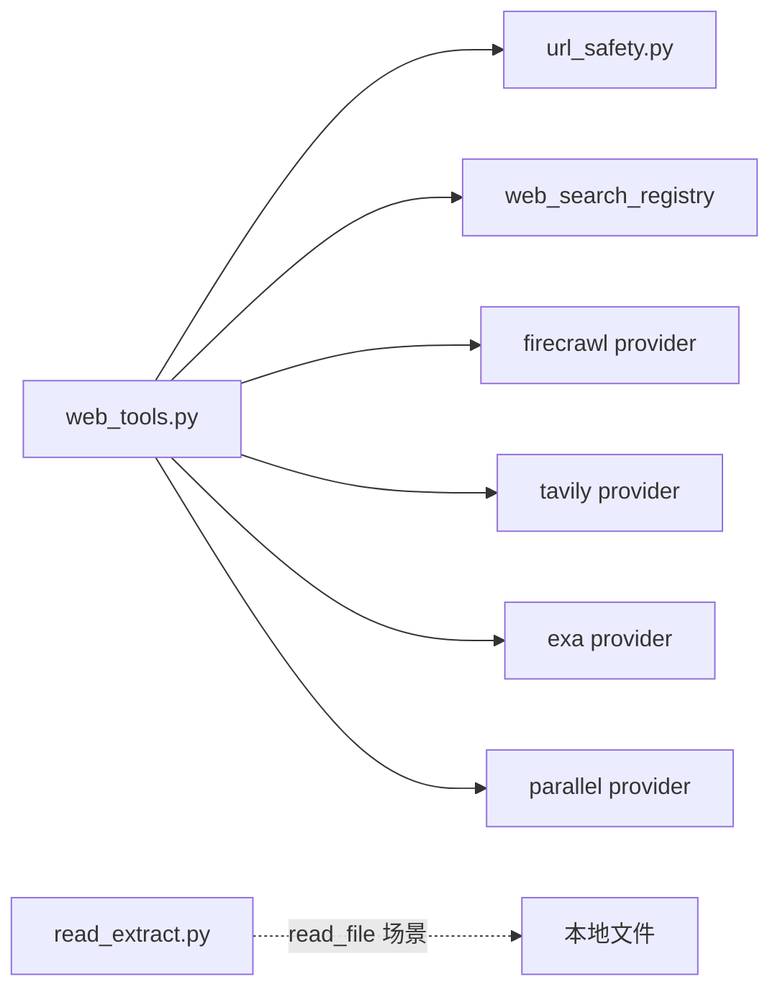

# 网页内容提取

<cite>
**本文引用的文件**
- [tools/web_tools.py](file://tools/web_tools.py)
- [tools/url_safety.py](file://tools/url_safety.py)
- [plugins/web/firecrawl/provider.py](file://plugins/web/firecrawl/provider.py)
- [tools/read_extract.py](file://tools/read_extract.py)
</cite>

## 目录
1. [简介](#简介)
2. [项目结构](#项目结构)
3. [核心组件](#核心组件)
4. [架构总览](#架构总览)
5. [详细组件分析](#详细组件分析)
6. [依赖关系分析](#依赖关系分析)
7. [性能考虑](#性能考虑)
8. [故障排除指南](#故障排除指南)
9. [结论](#结论)
10. [附录：使用示例与最佳实践](#附录使用示例与最佳实践)

## 简介
本文件面向“网页内容提取”能力，系统性说明 web_extract_tool 的使用方法与技术实现。重点覆盖：
- 工作原理：URL 安全校验、后端选择与分发、HTML/文档清洗、Markdown 输出、文本截断与全文缓存
- 安全机制：SSRF 防护、敏感查询参数拦截、云元数据域名/IP 强制阻断
- 大页面处理：head+tail 窗口化返回、完整文本落盘、分页读取指引
- 错误处理与调试：结构化错误、可观测性日志、调试会话文件
- 插件生态：Firecrawl/Tavily/Exa/Parallel 等后端统一接入
- 实用建议：性能优化、常见问题排查

## 项目结构
围绕网页内容提取的关键代码分布如下：
- tools/web_tools.py：工具入口、后端选择、URL 预处理、截断与存储、结果裁剪、注册表注册
- tools/url_safety.py：URL 安全策略（SSRF、敏感参数、云元数据黑名单）
- plugins/web/firecrawl/provider.py：Firecrawl 插件实现（异步抓取、超时控制、重定向与策略检查）
- tools/read_extract.py：本地文档到文本的提取（Notebook/DOCX/XLSX/可选 anydoc），用于 read_file 场景

**图示来源**
- [tools/web_tools.py:742-1045](file://tools/web_tools.py#L742-L1045)
- [tools/url_safety.py:415-528](file://tools/url_safety.py#L415-L528)
- [plugins/web/firecrawl/provider.py:1-200](file://plugins/web/firecrawl/provider.py#L1-L200)

**章节来源**
- [tools/web_tools.py:1-120](file://tools/web_tools.py#L1-L120)
- [tools/url_safety.py:1-26](file://tools/url_safety.py#L1-L26)

## 核心组件
- URL 安全模块（tools/url_safety.py）
  - 提供 is_safe_url / async_is_safe_url，阻止私有/内网/云元数据地址访问
  - 检测并拒绝携带敏感查询参数的 URL（如 token、api_key、password 等）
  - 支持全局开关 security.allow_private_urls 与环境变量 HERMES_ALLOW_PRIVATE_URLS
- 工具主流程（tools/web_tools.py）
  - web_extract_tool：接收 URLs，执行安全校验，选择后端，调用 extract，清洗内容，截断并缓存全文，最终返回精简 JSON
  - 截断策略：默认字符预算 15000，超过则 head+tail 窗口化，并在尾部给出完整文件路径与 read_file 分页指令
  - 图片处理：将 base64 图片替换为 [IMAGE: alt] 占位符，保留真实图片链接
- Firecrawl 插件（plugins/web/firecrawl/provider.py）
  - 异步 extract，单 URL 超时保护（60s），重定向后再次进行 SSRF 检查，网站策略门控
  - 支持直连 Firecrawl 或 Nous Tool Gateway
- 文档提取（tools/read_extract.py）
  - 对 Notebook/DOCX/XLSX 及可选 anydoc 格式进行文本提取，PDF 扫描覆盖率提示

**章节来源**
- [tools/web_tools.py:417-577](file://tools/web_tools.py#L417-L577)
- [tools/web_tools.py:742-1045](file://tools/web_tools.py#L742-L1045)
- [tools/url_safety.py:106-162](file://tools/url_safety.py#L106-L162)
- [tools/url_safety.py:311-528](file://tools/url_safety.py#L311-L528)
- [plugins/web/firecrawl/provider.py:1-200](file://plugins/web/firecrawl/provider.py#L1-L200)
- [tools/read_extract.py:1-54](file://tools/read_extract.py#L1-L54)

## 架构总览
web_extract_tool 的整体调用链如下：

**图示来源**
- [tools/web_tools.py:742-1045](file://tools/web_tools.py#L742-L1045)
- [tools/url_safety.py:415-528](file://tools/url_safety.py#L415-L528)
- [plugins/web/firecrawl/provider.py:1-200](file://plugins/web/firecrawl/provider.py#L1-L200)

## 详细组件分析

### URL 安全检查机制
- 敏感查询参数拦截：识别 token、api_key、password 等键名，直接拒绝
- 云元数据域名/IP 强制阻断：metadata.google.internal、169.254.169.254 等始终禁止
- 私有/内网地址阻断：默认阻止私有、回环、链路本地、组播、未指定、CGNAT 段；可通过配置或环境变量允许
- 代理环境容错：DNS 失败时若配置了代理，允许交由代理侧解析
- 连接时二次校验：在 httpx 传输层对实际 TCP 连接 IP 再次验证，避免 DNS 重绑定

**图示来源**
- [tools/url_safety.py:415-528](file://tools/url_safety.py#L415-L528)
- [tools/url_safety.py:522-595](file://tools/url_safety.py#L522-L595)

**章节来源**
- [tools/url_safety.py:106-162](file://tools/url_safety.py#L106-L162)
- [tools/url_safety.py:311-528](file://tools/url_safety.py#L311-L528)
- [tools/url_safety.py:522-595](file://tools/url_safety.py#L522-L595)

### 后端选择与分发
- 优先级：web.extract_backend → web.backend → 自动探测可用后端
- 支持内置后端与插件注册的后端；当配置的 backend 不支持 extract（仅搜索）会明确报错
- 同步/异步兼容：根据 provider.extract 是否为协程函数决定 await 或线程运行

**图示来源**
- [tools/web_tools.py:223-308](file://tools/web_tools.py#L223-L308)
- [tools/web_tools.py:857-943](file://tools/web_tools.py#L857-L943)

**章节来源**
- [tools/web_tools.py:223-308](file://tools/web_tools.py#L223-L308)
- [tools/web_tools.py:857-943](file://tools/web_tools.py#L857-L943)

### 内容清洗、Markdown 转换与截断策略
- 清洗：base64 图片替换为 [IMAGE: alt] 占位符，保留真实图片链接
- 截断：按 char_limit（默认 15000，可配置）进行 head+tail 窗口化，保证行边界
- 全文缓存：超限时将完整文本写入 cache/web，并在页脚中提供 read_file 分页读取命令
- 输出裁剪：仅保留 url/title/content/error 等必要字段，减少上下文开销

**图示来源**
- [tools/web_tools.py:450-577](file://tools/web_tools.py#L450-L577)
- [tools/web_tools.py:973-1016](file://tools/web_tools.py#L973-L1016)

**章节来源**
- [tools/web_tools.py:450-577](file://tools/web_tools.py#L450-L577)
- [tools/web_tools.py:973-1016](file://tools/web_tools.py#L973-L1016)

### 插件提供者（以 Firecrawl 为例）
- 异步 extract：每个 URL 独立抓取，设置超时（60s），防止挂起
- 重定向安全：每次重定向目标重新进行 SSRF 检查
- 网站策略：结合 website_policy 进行访问门控
- 双通道：支持直连 Firecrawl 或 Nous Tool Gateway

**图示来源**
- [plugins/web/firecrawl/provider.py:1-200](file://plugins/web/firecrawl/provider.py#L1-L200)

**章节来源**
- [plugins/web/firecrawl/provider.py:1-200](file://plugins/web/firecrawl/provider.py#L1-L200)

### 本地文档提取（read_file 场景）
- 支持 Notebook/DOCX/XLSX 原生提取；可选 anydoc 扩展 PDF/EPUB/RTF 等
- PDF 扫描覆盖率检测：若大量页面无文本，输出警告并给出 OCR 建议
- 限制：超大文件拒绝转换，避免内存占用过高

**章节来源**
- [tools/read_extract.py:1-54](file://tools/read_extract.py#L1-L54)
- [tools/read_extract.py:198-331](file://tools/read_extract.py#L198-L331)

## 依赖关系分析
- web_tools.py 依赖：
  - url_safety：URL 安全策略
  - web_search_registry：后端发现与可用性判断
  - 各插件 provider：具体后端实现（firecrawl/tavily/exa/parallel）
  - debug_helpers：调试会话记录
- firecrawl provider 依赖：
  - url_safety：SSRF 检查
  - website_policy：访问策略
- read_extract.py 独立于 web 提取，服务于本地文档

**图示来源**
- [tools/web_tools.py:1-120](file://tools/web_tools.py#L1-L120)
- [plugins/web/firecrawl/provider.py:1-200](file://plugins/web/firecrawl/provider.py#L1-L200)
- [tools/read_extract.py:1-54](file://tools/read_extract.py#L1-L54)

**章节来源**
- [tools/web_tools.py:1-120](file://tools/web_tools.py#L1-L120)
- [plugins/web/firecrawl/provider.py:1-200](file://plugins/web/firecrawl/provider.py#L1-L200)
- [tools/read_extract.py:1-54](file://tools/read_extract.py#L1-L54)

## 性能考虑
- 截断与缓存：默认 15000 字符预算，超限才写磁盘；可配置 extract_char_limit 调整
- 异步 I/O：provider.extract 异步执行，避免阻塞事件循环
- 插件懒加载：Firecrawl SDK 延迟导入，降低冷启动开销
- 结果裁剪：仅返回必要字段，减少上下文大小
- 图片处理：base64 图片替换为占位符，避免 token 爆炸

[本节为通用性能建议，不直接分析具体文件]

## 故障排除指南
- 无可用后端
  - 现象：返回“未配置 web 提取后端”
  - 处理：设置 web.extract_backend 为 firecrawl/tavily/exa/parallel，并确保对应凭据或网关可用
- 插件被禁用
  - 现象：配置了后端但提示插件被禁用
  - 处理：启用对应插件或使用 hermes plugins enable
- URL 被阻止
  - 现象：返回“包含疑似密钥/令牌”或“目标为私有/内部网络”
  - 处理：移除敏感查询参数；确认目标为公网；必要时开启 allow_private_urls（谨慎）
- 大页面无法完整显示
  - 现象：返回内容被截断并附带页脚
  - 处理：按页脚提示使用 read_file 分页读取完整文本
- 调试信息
  - 启用 WEB_TOOLS_DEBUG=true，查看 ./logs/web_tools_debug_*.json 中的调用与指标

**章节来源**
- [tools/web_tools.py:873-927](file://tools/web_tools.py#L873-L927)
- [tools/web_tools.py:775-818](file://tools/web_tools.py#L775-L818)
- [tools/web_tools.py:417-447](file://tools/web_tools.py#L417-L447)
- [tools/web_tools.py:1087-1161](file://tools/web_tools.py#L1087-L1161)

## 结论
web_extract_tool 提供了安全、可扩展、高性能的网页内容提取能力。通过严格的安全策略、灵活的插件后端、智能的截断与缓存机制，能够在不同规模与类型的网页上稳定工作。配合 read_file 的文档提取能力，可覆盖从在线文章到本地文档的多场景需求。

[本节为总结，不直接分析具体文件]

## 附录：使用示例与最佳实践
- 基本用法
  - 搜索：web_search_tool(query, limit)
  - 提取：await web_extract_tool(urls, format="markdown", char_limit=...)
- 大页面处理
  - 提高 char_limit 获取更多内容；或使用 read_file 按页脚指示分页读取完整文本
- 安全注意事项
  - 不要在 URL 中传递敏感参数；如需登录态，优先使用浏览器工具
  - 谨慎开启 allow_private_urls，仅在受控环境中使用
- 性能优化
  - 合理设置 char_limit；避免一次性请求过多 URL
  - 利用插件懒加载与异步 I/O 优势

[本节为概念性指导，不直接分析具体文件]