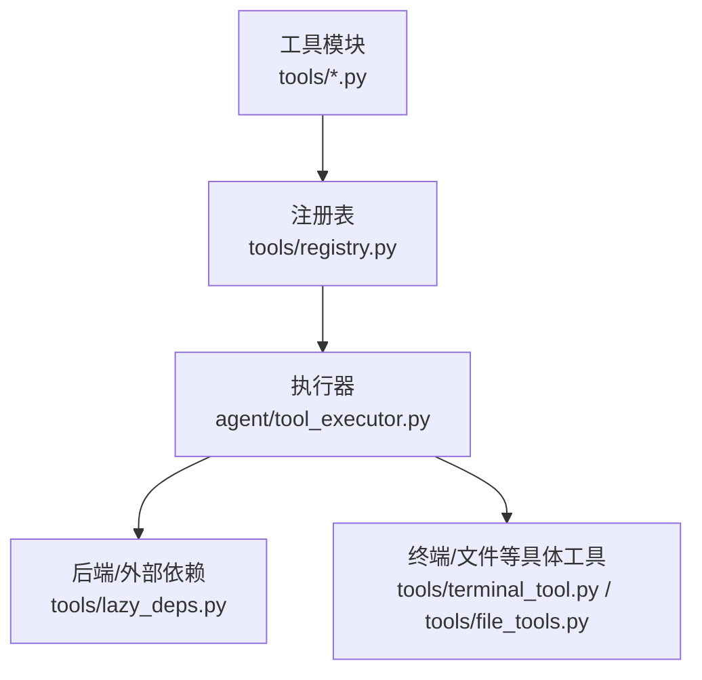
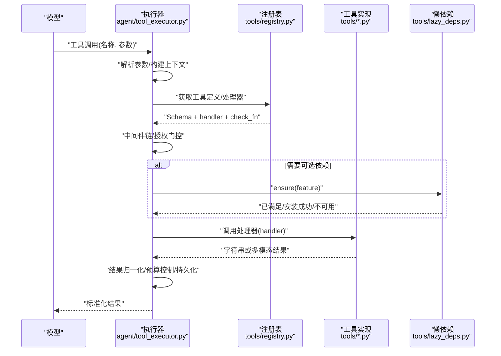
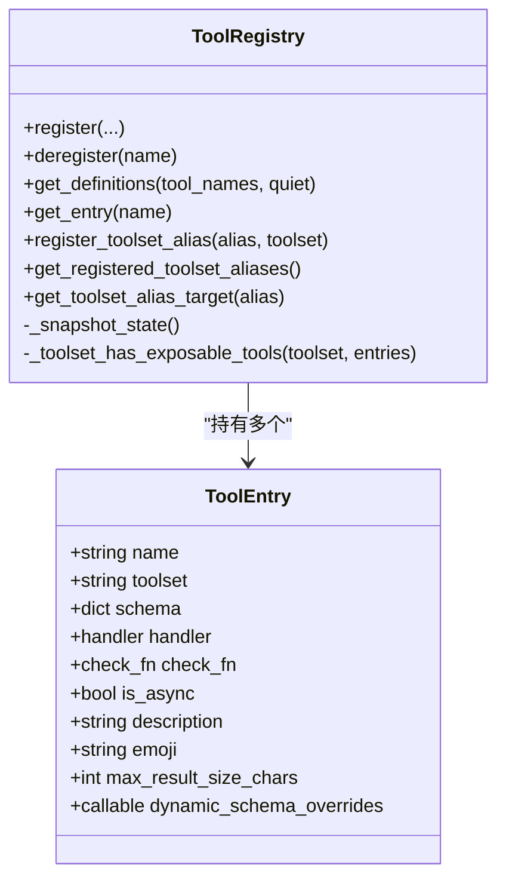
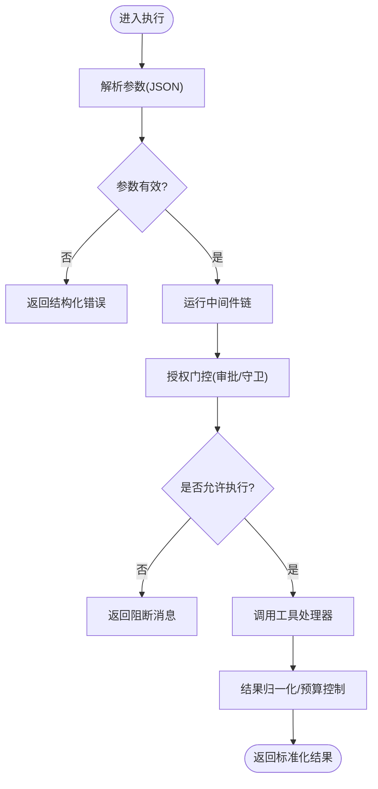
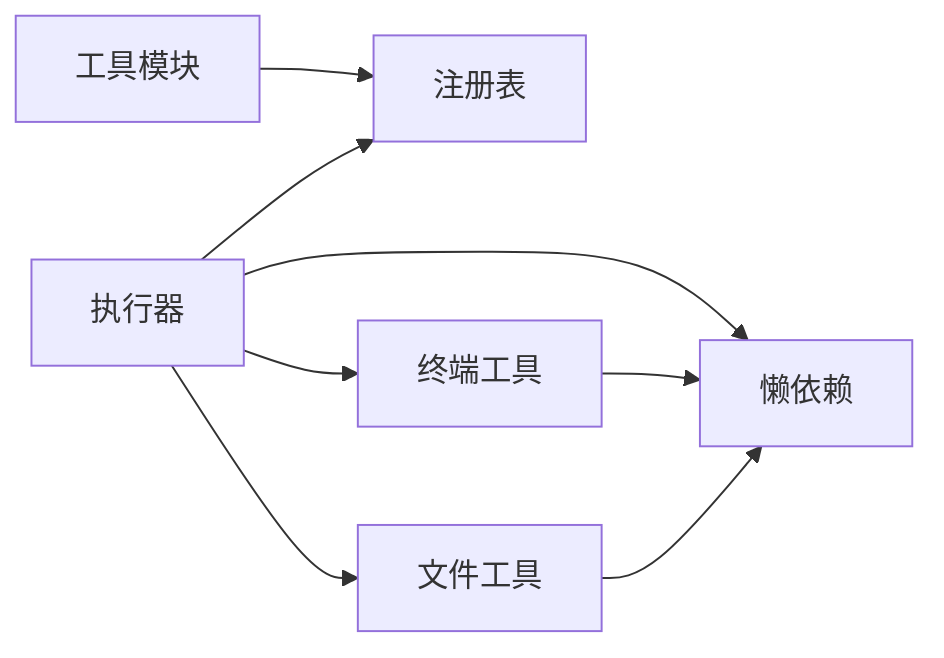

# 自定义工具开发

<cite>
**本文引用的文件**
- [tools/registry.py](file://tools/registry.py)
- [agent/tool_executor.py](file://agent/tool_executor.py)
- [tools/lazy_deps.py](file://tools/lazy_deps.py)
- [tools/terminal_tool.py](file://tools/terminal_tool.py)
- [tools/file_tools.py](file://tools/file_tools.py)
- [tests/tools/test_terminal_error_redaction.py](file://tests/tools/test_terminal_error_redaction.py)
</cite>

## 目录
1. [简介](#简介)
2. [项目结构](#项目结构)
3. [核心组件](#核心组件)
4. [架构总览](#架构总览)
5. [详细组件分析](#详细组件分析)
6. [依赖关系分析](#依赖关系分析)
7. [性能考虑](#性能考虑)
8. [故障排查指南](#故障排查指南)
9. [结论](#结论)
10. [附录](#附录)

## 简介
本指南面向希望为 Hermes Agent 开发与注册“自定义工具”的开发者。内容覆盖：
- 工具定义规范（Schema、描述、参数校验）
- 结果处理与错误处理机制
- 工具注册表、工具集与别名、动态 Schema 覆盖
- 依赖管理（按需懒加载）、可用性与检查函数缓存
- 调试与测试方法
- 性能优化、文档生成与版本管理
- 从简单命令到复杂业务逻辑的完整示例路径
- 发布、分发与社区共享最佳实践

## 项目结构
Hermes 的工具系统围绕“集中式注册表 + 模块自注册 + 执行器调度”的模式组织：
- 工具实现位于 tools/*，每个工具在模块顶层调用 registry.register() 完成自注册
- 注册表负责收集所有工具的元数据、Schema、处理器、可用性检查等
- 执行器负责解析模型调用的工具参数、编排中间件、并发执行、结果归一化与预算控制
- 可选依赖通过懒加载机制按需安装，避免冷启动开销与包体积膨胀



**图示来源**
- [tools/registry.py:1-15](file://tools/registry.py#L1-L15)
- [agent/tool_executor.py:1-12](file://agent/tool_executor.py#L1-L12)
- [tools/lazy_deps.py:1-66](file://tools/lazy_deps.py#L1-L66)

**章节来源**
- [tools/registry.py:1-15](file://tools/registry.py#L1-L15)
- [agent/tool_executor.py:1-12](file://agent/tool_executor.py#L1-L12)

## 核心组件
- 工具注册表（ToolRegistry）
  - 维护工具条目（名称、工具集、Schema、处理器、可用性检查、异步标记、描述、表情、最大结果大小、动态 Schema 覆盖）
  - 提供注册、注销、别名、查询定义、快照等方法
  - 对 check_fn 进行 TTL 缓存与瞬态失败宽容，避免偶发探测导致工具不可用
- 工具执行器（tool_executor）
  - 解析参数、运行中间件链、授权门控、并发调度、结果归一化、预算控制、进度回调
- 懒依赖（lazy_deps）
  - 白名单驱动的可按需安装依赖，支持 venv 模式与持久目标模式，保证安全与可恢复性
- 典型工具实现
  - 终端工具（terminal_tool）：多后端执行、后台任务、清理策略、错误脱敏
  - 文件工具（file_tools）：读取限制、路径解析、设备黑名单、大文件提示

**章节来源**
- [tools/registry.py:201-231](file://tools/registry.py#L201-L231)
- [tools/registry.py:414-445](file://tools/registry.py#L414-L445)
- [tools/registry.py:562-644](file://tools/registry.py#L562-L644)
- [tools/registry.py:717-764](file://tools/registry.py#L717-L764)
- [agent/tool_executor.py:141-157](file://agent/tool_executor.py#L141-L157)
- [agent/tool_executor.py:482-662](file://agent/tool_executor.py#L482-L662)
- [tools/lazy_deps.py:97-323](file://tools/lazy_deps.py#L97-L323)
- [tools/terminal_tool.py:1-34](file://tools/terminal_tool.py#L1-L34)
- [tools/file_tools.py:52-85](file://tools/file_tools.py#L52-L85)

## 架构总览
下图展示了从模型发起工具调用到最终返回结果的端到端流程，包括注册表发现、参数解析、中间件、授权、执行与结果归一化。



**图示来源**
- [agent/tool_executor.py:141-157](file://agent/tool_executor.py#L141-L157)
- [agent/tool_executor.py:482-662](file://agent/tool_executor.py#L482-L662)
- [tools/registry.py:717-764](file://tools/registry.py#L717-L764)
- [tools/lazy_deps.py:500-535](file://tools/lazy_deps.py#L500-L535)

## 详细组件分析

### 工具注册表（ToolRegistry）
- 职责
  - 收集并维护工具元数据（名称、工具集、Schema、处理器、check_fn、是否异步、描述、表情、最大结果大小、动态 Schema 覆盖）
  - 提供 get_definitions 输出 OpenAI 风格的工具定义，过滤不可用工具
  - 支持工具集别名映射、插件覆盖策略、线程安全的快照与变更计数
- 关键点
  - check_fn 缓存：TTL 约 30 秒，最近一次成功后的短暂失败会被视为瞬态，避免抖动导致工具被误判为不可用
  - 动态 Schema 覆盖：允许在运行时注入字段（如基于配置的限制），提高模型可见信息的准确性
  - 注册保护：跨工具集同名工具默认拒绝覆盖，需显式 opt-in；插件覆盖受策略约束



**图示来源**
- [tools/registry.py:201-231](file://tools/registry.py#L201-L231)
- [tools/registry.py:414-445](file://tools/registry.py#L414-L445)
- [tools/registry.py:562-644](file://tools/registry.py#L562-L644)
- [tools/registry.py:717-764](file://tools/registry.py#L717-L764)

**章节来源**
- [tools/registry.py:201-231](file://tools/registry.py#L201-L231)
- [tools/registry.py:414-445](file://tools/registry.py#L414-L445)
- [tools/registry.py:562-644](file://tools/registry.py#L562-L644)
- [tools/registry.py:717-764](file://tools/registry.py#L717-L764)

### 工具执行器（tool_executor）
- 职责
  - 解析模型传入的参数（JSON 对象），非法参数直接返回结构化错误
  - 运行中间件链（请求预处理、执行前后钩子、审计追踪）
  - 授权门控：序列化审批提示，排除人类等待时间计入批处理超时
  - 并发执行：按工具类型与配置限制并行度，收集有序结果
  - 结果归一化：仅接受字符串或多模态信封，其他类型转为错误
  - 预算控制：根据上下文窗口缩放结果长度上限，防止溢出
- 关键流程



**图示来源**
- [agent/tool_executor.py:141-157](file://agent/tool_executor.py#L141-L157)
- [agent/tool_executor.py:482-662](file://agent/tool_executor.py#L482-L662)
- [agent/tool_executor.py:758-800](file://agent/tool_executor.py#L758-L800)

**章节来源**
- [agent/tool_executor.py:141-157](file://agent/tool_executor.py#L141-L157)
- [agent/tool_executor.py:482-662](file://agent/tool_executor.py#L482-L662)
- [agent/tool_executor.py:758-800](file://agent/tool_executor.py#L758-L800)

### 懒依赖管理（lazy_deps）
- 设计要点
  - 白名单：只有 LAZY_DEPS 中声明的特性可被安装，防止任意 spec 执行
  - 安全模式：默认 venv 内安装；在只读镜像中可通过环境变量重定向到持久目标目录，追加到 sys.path 末尾，确保不会覆盖核心模块
  - 平台能力检测：某些特性在特定平台不可用（如 Windows 上的 Matrix E2EE）
  - 版本约束：使用 packaging 判断是否满足版本范围，必要时升级/降级以对齐锁定版本
- 使用方式
  - 在工具或后端首次导入路径调用 ensure("feature.name")，捕获 FeatureUnavailable 并给出清晰修复指引

```mermaid
flowchart TD
S(["调用 ensure(feature)"]) --> Check["检查是否已满足"]
Check --> |是| ReturnOK["直接返回"]
Check --> |否| Policy{"允许懒安装?"}
Policy -- 否 --> Raise["抛出 FeatureUnavailable"]
Policy -- 是 --> Install["选择 uv/pip 安装"]
Install --> Target{"持久目标模式?"}
Target -- 是 | Append["追加到 sys.path 末尾"]
Target -- 否 | Venv["安装到当前 venv"]
Append --> Done["完成"]
Venv --> Done
```

**图示来源**
- [tools/lazy_deps.py:97-323](file://tools/lazy_deps.py#L97-L323)
- [tools/lazy_deps.py:500-535](file://tools/lazy_deps.py#L500-L535)
- [tools/lazy_deps.py:701-800](file://tools/lazy_deps.py#L701-L800)

**章节来源**
- [tools/lazy_deps.py:97-323](file://tools/lazy_deps.py#L97-L323)
- [tools/lazy_deps.py:500-535](file://tools/lazy_deps.py#L500-L535)
- [tools/lazy_deps.py:701-800](file://tools/lazy_deps.py#L701-L800)

### 终端工具（terminal_tool）
- 功能
  - 支持本地、Docker、Modal、Vercel Sandbox 等多种后端
  - 前台/后台执行、生命周期管理、自动清理
  - 错误信息强制脱敏，避免泄露敏感信息
- 注意事项
  - 环境变量与认证配置校验严格，缺失将返回不可用或错误
  - 长时间任务需关注中断事件与超时

**章节来源**
- [tools/terminal_tool.py:1-34](file://tools/terminal_tool.py#L1-L34)
- [tools/terminal_tool.py:141-196](file://tools/terminal_tool.py#L141-L196)

### 文件工具（file_tools）
- 功能
  - 读取限制：单次阅读字符数上限，避免上下文爆炸
  - 路径解析：相对工作区路径解析，兼容容器环境
  - 设备黑名单：阻止读取阻塞或无限输出的设备节点
- 注意事项
  - 大文件读取会提示使用 offset+limit 分段读取

**章节来源**
- [tools/file_tools.py:52-85](file://tools/file_tools.py#L52-L85)
- [tools/file_tools.py:132-168](file://tools/file_tools.py#L132-L168)

## 依赖关系分析
- 组件耦合
  - 工具模块依赖注册表进行自注册
  - 执行器依赖注册表获取定义与处理器，并在需要时触发懒依赖安装
  - 具体工具（终端/文件）可能依赖懒依赖提供的 SDK
- 外部依赖
  - 可选后端（如 Modal、Vercel、TTS/STT、记忆提供者等）通过白名单懒安装
  - 平台能力差异由懒依赖层屏蔽



**图示来源**
- [tools/registry.py:1-15](file://tools/registry.py#L1-L15)
- [agent/tool_executor.py:1-12](file://agent/tool_executor.py#L1-L12)
- [tools/lazy_deps.py:1-66](file://tools/lazy_deps.py#L1-L66)

**章节来源**
- [tools/registry.py:1-15](file://tools/registry.py#L1-L15)
- [agent/tool_executor.py:1-12](file://agent/tool_executor.py#L1-L12)
- [tools/lazy_deps.py:1-66](file://tools/lazy_deps.py#L1-L66)

## 性能考虑
- 注册表层面
  - check_fn 缓存：TTL 约 30 秒，减少重复探测成本
  - 瞬态失败宽容：最近成功后的短时失败不立即生效，降低抖动影响
  - 动态 Schema 覆盖：仅在 get_definitions 时计算，避免频繁刷新
- 执行器层面
  - 并发执行：按工具类型与配置限制并行度，避免资源争用
  - 预算控制：依据上下文窗口缩放结果长度，防止溢出
  - 中间件与授权：序列化审批，排除人类等待时间计入批处理超时
- 懒依赖层面
  - 白名单与版本约束：避免不必要的安装与冲突
  - 持久目标模式：在只读镜像中安全追加依赖，不影响核心模块

[本节为通用指导，无需特定文件引用]

## 故障排查指南
- 常见症状
  - 工具不可用：可能是 check_fn 探测失败或被缓存为不可用
  - 参数错误：模型返回非 JSON 对象或结构不符
  - 结果过大：超出预算被截断或报错
  - 依赖缺失：FeatureUnavailable 提示需手动安装
- 定位步骤
  - 查看注册表定义与 check_fn 缓存状态
  - 检查执行器日志中的中间件与授权阶段
  - 确认懒依赖白名单与安装目标
  - 验证工具实现中的错误脱敏与返回值格式
- 参考测试用例
  - 终端工具的错误脱敏行为与异常路径

**章节来源**
- [tools/registry.py:234-380](file://tools/registry.py#L234-L380)
- [agent/tool_executor.py:141-157](file://agent/tool_executor.py#L141-L157)
- [tests/tools/test_terminal_error_redaction.py:47-154](file://tests/tools/test_terminal_error_redaction.py#L47-L154)

## 结论
Hermes 的工具系统通过“注册表 + 执行器 + 懒依赖”的解耦设计，提供了可扩展、安全且高性能的工具生态。开发者只需遵循注册规范、合理实现处理器与可用性检查、利用懒依赖管理可选组件，即可快速集成新工具。结合完善的测试、性能优化与发布流程，可在社区中高效共享与维护工具。

[本节为总结，无需特定文件引用]

## 附录

### 工具定义规范与最佳实践
- 注册入口：在模块顶层调用 registry.register(...)
- 必要字段：name、toolset、schema、handler、check_fn（可选）、is_async（可选）、description（可选）、emoji（可选）、max_result_size_chars（可选）、dynamic_schema_overrides（可选）
- 参数校验：尽量在处理器内部做细粒度校验，执行器会拦截非 JSON 对象参数
- 结果格式：优先返回字符串；如需多模态，遵循多模态信封结构
- 错误处理：统一使用工具错误封装，避免泄露敏感信息

**章节来源**
- [tools/registry.py:562-644](file://tools/registry.py#L562-L644)
- [tools/registry.py:770-800](file://tools/registry.py#L770-L800)

### 工具测试建议
- 单元测试：覆盖参数校验、错误路径、结果归一化
- 集成测试：模拟后端失败、依赖缺失、权限阻断
- 回归测试：确保错误脱敏不被绕过

**章节来源**
- [tests/tools/test_terminal_error_redaction.py:47-154](file://tests/tools/test_terminal_error_redaction.py#L47-L154)

### 性能优化清单
- 使用 check_fn 缓存与瞬态失败宽容
- 控制并发度与图像生成并行请求
- 使用预算控制与结果裁剪
- 懒依赖按需安装，避免冷启动开销

**章节来源**
- [tools/registry.py:234-380](file://tools/registry.py#L234-L380)
- [agent/tool_executor.py:209-246](file://agent/tool_executor.py#L209-L246)
- [tools/lazy_deps.py:500-535](file://tools/lazy_deps.py#L500-L535)

### 文档生成与版本管理
- 文档：基于 schema 与 description 自动生成工具说明
- 版本：通过 pyproject 与懒依赖白名单锁定版本，确保一致性
- 更新：使用懒依赖更新机制同步锁定版本，避免漂移

**章节来源**
- [tools/lazy_deps.py:97-323](file://tools/lazy_deps.py#L97-L323)

### 发布、分发与社区共享
- 发布：遵循仓库的打包与发布流程，确保依赖白名单与锁定版本一致
- 分发：通过技能/插件机制分发，保持工具集隔离
- 共享：提供清晰的 schema、描述、示例与测试，便于社区复用

[本节为通用指导，无需特定文件引用]