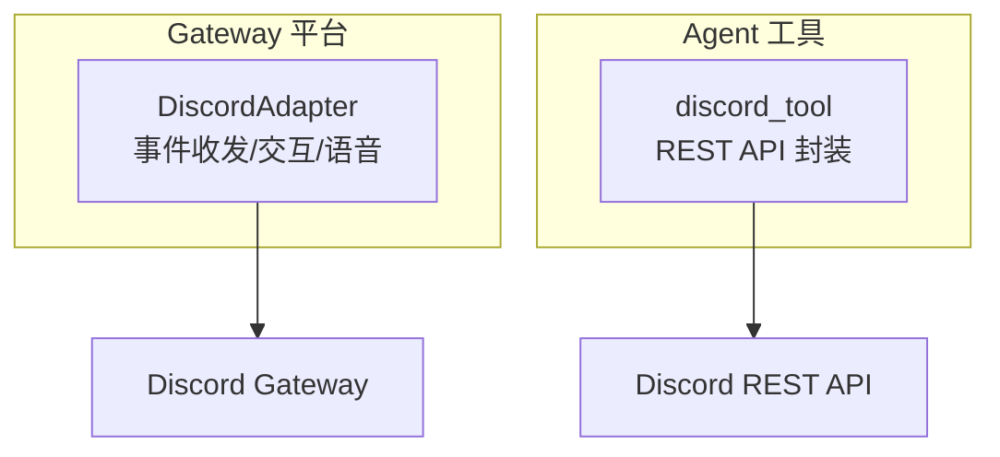
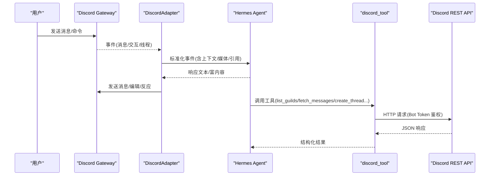
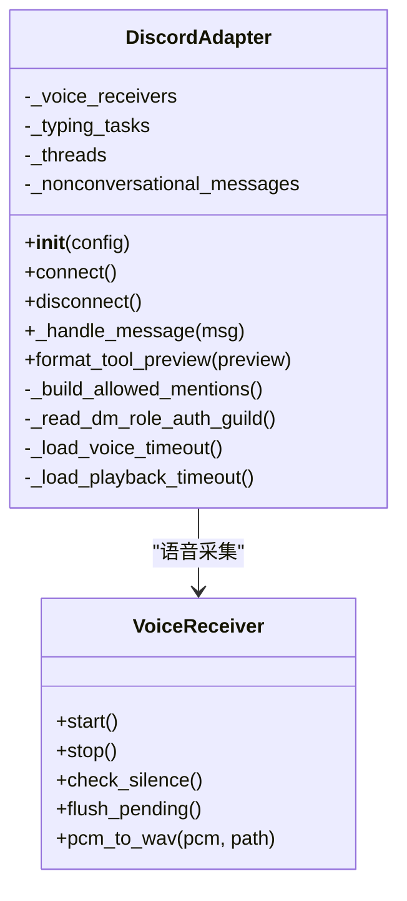
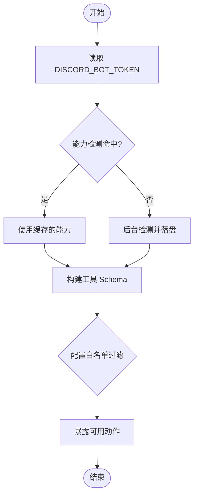
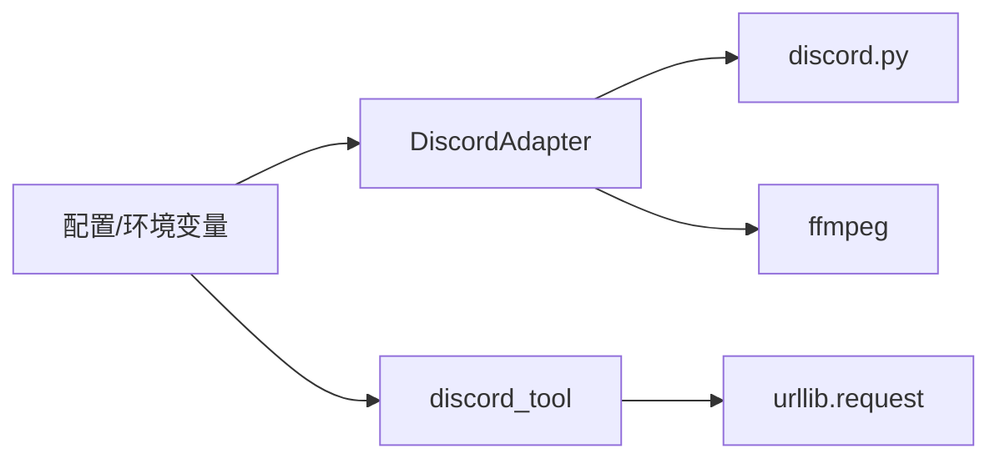

# Discord 集成

<cite>
**本文引用的文件**
- [plugins/platforms/discord/adapter.py](file://plugins/platforms/discord/adapter.py)
- [plugins/platforms/discord/__init__.py](file://plugins/platforms/discord/__init__.py)
- [plugins/platforms/discord/plugin.yaml](file://plugins/platforms/discord/plugin.yaml)
- [tools/discord_tool.py](file://tools/discord_tool.py)
- [gateway/config.py](file://gateway/config.py)
- [hermes_cli/config_defaults.py](file://hermes_cli/config_defaults.py)
- [tests/e2e/test_discord_adapter.py](file://tests/e2e/test_discord_adapter.py)
</cite>

## 目录
1. [简介](#简介)
2. [项目结构](#项目结构)
3. [核心组件](#核心组件)
4. [架构总览](#架构总览)
5. [详细组件分析](#详细组件分析)
6. [依赖关系分析](#依赖关系分析)
7. [性能与缓存](#性能与缓存)
8. [故障排除指南](#故障排除指南)
9. [结论](#结论)
10. [附录：配置与安全](#附录：配置与安全)

## 简介
本文件面向 Hermes Agent 的 Discord 集成，系统性说明机器人令牌认证、权限意图检测、消息处理、服务器/频道/角色/成员管理、线程创建、自动回复等能力。文档同时覆盖能力检测机制、缓存策略、错误处理、自动化工作流示例、配置选项、安全考虑与故障排除。

## 项目结构
Discord 集成由两部分组成：
- 平台适配器（Gateway 侧）：负责连接 Discord Gateway、接收事件、发送消息、处理交互与语音等。
- 工具层（Agent Tools 侧）：通过 REST API 直接调用 Discord 接口，提供服务器/频道/角色/成员/消息等管理能力。

图表来源
- [plugins/platforms/discord/adapter.py:987-1128](file://plugins/platforms/discord/adapter.py#L987-L1128)
- [tools/discord_tool.py:44-131](file://tools/discord_tool.py#L44-L131)

章节来源
- [plugins/platforms/discord/adapter.py:987-1128](file://plugins/platforms/discord/adapter.py#L987-L1128)
- [tools/discord_tool.py:44-131](file://tools/discord_tool.py#L44-L131)

## 核心组件
- Discord 平台适配器：基于 discord.py 实现，负责消息接收、Markdown 渲染、线程参与跟踪、打字指示器、命令同步、按钮审批、语音通道接入与音频解码、WebSocket 健康探测、断线重连等。
- Discord 工具：通过 urllib.request 直接调用 Discord REST API v10，暴露 list_guilds、server_info、list_channels、channel_info、list_roles、member_info、search_members、fetch_messages、list_pins、pin_message、unpin_message、delete_message、create_thread、add_role、remove_role 等操作。
- 插件清单：声明必需环境变量 DISCORD_BOT_TOKEN 及可选配置项。

章节来源
- [plugins/platforms/discord/adapter.py:987-1128](file://plugins/platforms/discord/adapter.py#L987-L1128)
- [tools/discord_tool.py:348-648](file://tools/discord_tool.py#L348-L648)
- [plugins/platforms/discord/plugin.yaml:1-35](file://plugins/platforms/discord/plugin.yaml#L1-L35)

## 架构总览
Discord 集成在运行时分为两条路径：
- 事件路径（Gateway）：DiscordAdapter 订阅 Gateway 事件，解析消息、命令、交互、媒体附件、引用消息、线程上下文等，并转发到 Agent 处理；同时将结果写回 Discord。
- 工具路径（Tools）：Agent 在执行过程中可调用 discord_tool 提供的工具方法，直接访问 Discord REST API，完成服务器/频道/角色/成员/消息等管理操作。

图表来源
- [plugins/platforms/discord/adapter.py:987-1128](file://plugins/platforms/discord/adapter.py#L987-L1128)
- [tools/discord_tool.py:79-131](file://tools/discord_tool.py#L79-L131)

## 详细组件分析

### 平台适配器（DiscordAdapter）
- 生命周期与连接
  - 使用 discord.py 的 Bot 客户端，启动时等待 ready 事件，并在超时或任务异常时快速失败，便于网关重连。
  - 支持 WebSocket 健康探测（心跳延迟、ACK 年龄、最大延迟阈值），连续不健康触发重连。
- 消息处理
  - 支持 DM 与服务端频道；服务端频道默认需要 @mention 才响应，DM 无需 @mention。
  - 自动识别命令（如 /help），支持自动建线程（auto-thread）并保持命令识别。
  - 引用消息中的附件会被缓存并作为媒体传入 Agent。
  - 支持打字指示器、长消息分片、Markdown 链接优化。
- 权限与意图
  - 允许用户/角色/频道白名单过滤；忽略频道、禁止线程等开关。
  - 提及控制：默认关闭 @everyone/@here/@role 提醒，保留用户与回复用户提及。
- 语音
  - 接入语音频道，捕获 RTP 包，解密（NaCl + DAVE E2EE），Opus 解码为 PCM，静音检测输出语音片段，支持 TTS 播放与混音。
- 交互与审批
  - 按钮视图用于执行审批、澄清选择、更新提示等，支持超时控制。
- 状态持久化
  - 非对话消息 ID 集合持久化，避免重启后历史边界误判。
  - 线程参与跟踪持久化，减少后续消息重复 @mention。

图表来源
- [plugins/platforms/discord/adapter.py:987-1128](file://plugins/platforms/discord/adapter.py#L987-L1128)
- [plugins/platforms/discord/adapter.py:525-908](file://plugins/platforms/discord/adapter.py#L525-L908)

章节来源
- [plugins/platforms/discord/adapter.py:987-1128](file://plugins/platforms/discord/adapter.py#L987-L1128)
- [plugins/platforms/discord/adapter.py:525-908](file://plugins/platforms/discord/adapter.py#L525-L908)
- [tests/e2e/test_discord_adapter.py:31-107](file://tests/e2e/test_discord_adapter.py#L31-L107)

### 工具层（discord_tool）
- 认证与请求
  - 从当前 profile 的密钥范围读取 DISCORD_BOT_TOKEN，构造 Authorization: Bot <token> 头。
  - 统一封装 _discord_request，限制响应体大小，HTTPError 转换为 DiscordAPIError。
- 能力检测（应用级意图）
  - 通过 GET /applications/@me 获取 flags，推断是否启用 GUILD_MEMBERS 与 MESSAGE_CONTENT 特权意图。
  - 内存缓存 + 磁盘缓存（按 token 哈希键，TTL 24h），后台非阻塞刷新。
  - 若检测失败，默认暴露所有动作，运行时 403 会转为可操作指导。
- 可用动作与配置白名单
  - 动作集包含服务器/频道/角色/成员/消息/线程管理等。
  - 可通过配置 discord.server_actions 限制可见动作。
- 典型动作
  - list_guilds/server_info/list_channels/channel_info/list_roles/member_info/search_members
  - fetch_messages/list_pins/pin_message/unpin_message/delete_message/create_thread
  - add_role/remove_role

图表来源
- [tools/discord_tool.py:159-341](file://tools/discord_tool.py#L159-L341)
- [tools/discord_tool.py:703-761](file://tools/discord_tool.py#L703-L761)

章节来源
- [tools/discord_tool.py:74-131](file://tools/discord_tool.py#L74-L131)
- [tools/discord_tool.py:159-341](file://tools/discord_tool.py#L159-L341)
- [tools/discord_tool.py:348-648](file://tools/discord_tool.py#L348-L648)
- [tools/discord_tool.py:703-761](file://tools/discord_tool.py#L703-L761)

### 自动化工作流示例
- 自动回复
  - 在开启自由响应频道的情况下，适配器将消息转发给 Agent，Agent 返回响应后写回频道。
- 消息搜索
  - 使用 fetch_messages 拉取最近消息，结合 before/after 游标分页检索。
- 线程创建
  - 使用 create_thread 基于现有消息或独立创建公开线程，设置归档时长。
- 角色管理
  - 使用 add_role/remove_role 对成员进行角色增删。
- 成员信息
  - 使用 member_info/search_members 查询成员详情与模糊搜索（需 GUILD_MEMBERS 意图）。

章节来源
- [tools/discord_tool.py:348-648](file://tools/discord_tool.py#L348-L648)

## 依赖关系分析
- 平台适配器依赖 discord.py（异步事件驱动）、ffmpeg（语音转码）、可选 davey/nacl（E2EE 解密）。
- 工具层依赖标准库 urllib.request，无第三方网络库依赖。
- 配置与环境变量：
  - 必需：DISCORD_BOT_TOKEN
  - 可选：DISCORD_ALLOWED_USERS、DISCORD_ALLOW_ALL_USERS、DISCORD_HOME_CHANNEL、DISCORD_HOME_CHANNEL_NAME 等
  - 行为开关：allowed_channels、ignored_channels、no_thread_channels、free_response_channels、missed_message_backfill_channels 等

图表来源
- [plugins/platforms/discord/plugin.yaml:12-35](file://plugins/platforms/discord/plugin.yaml#L12-L35)
- [hermes_cli/config_defaults.py:1938-1955](file://hermes_cli/config_defaults.py#L1938-L1955)

章节来源
- [plugins/platforms/discord/plugin.yaml:12-35](file://plugins/platforms/discord/plugin.yaml#L12-L35)
- [hermes_cli/config_defaults.py:1938-1955](file://hermes_cli/config_defaults.py#L1938-L1955)

## 性能与缓存
- 能力检测缓存
  - 内存缓存：进程内按 token 缓存检测结果，避免重复网络请求。
  - 磁盘缓存：跨进程共享，TTL 24 小时，降低冷启动开销。
  - 后台检测：首次冷启动以默认宽松策略暴露动作，后台刷新后写入磁盘供下次使用。
- 消息去重与历史边界
  - MessageDeduplicator 防止重连回放导致重复响应。
  - 非对话消息 ID 集合持久化，避免状态通知被误认为对话历史边界。
- 语音处理
  - 每 SSRC 独立 Opus 解码器，静音阈值与最小语音时长过滤噪声。
  - PCM 转 WAV 通过 ffmpeg 管道输入，避免临时文件开销。
- 打字指示器与长消息
  - 打字指示器任务维持“正在输入”状态。
  - 长消息按 Discord 限制分片发送，避免超限。

章节来源
- [tools/discord_tool.py:159-341](file://tools/discord_tool.py#L159-L341)
- [plugins/platforms/discord/adapter.py:289-354](file://plugins/platforms/discord/adapter.py#L289-L354)
- [plugins/platforms/discord/adapter.py:525-908](file://plugins/platforms/discord/adapter.py#L525-L908)

## 故障排除指南
- 无法连接 Discord
  - 检查 DISCORD_BOT_TOKEN 是否正确设置。
  - 观察 WebSocket 健康指标（心跳 ACK 年龄、延迟），必要时调整阈值。
- 消息未响应
  - 确认频道是否在 allowed_channels 白名单中，或被 ignored_channels 忽略。
  - 服务端频道需 @mention 才能触发；DM 无需 @mention。
  - 检查自动建线程是否开启，以及命令是否仍能被识别。
- 权限不足（403）
  - 工具层会在运行时将 403 映射为可操作指导；请确认机器人拥有相应权限（如 MANAGE_ROLES）。
  - 意图缺失：GUILD_MEMBERS 缺失会导致 member_info/search_members 不可用；MESSAGE_CONTENT 缺失会影响 fetch_messages/list_pins 的内容字段。
- 语音问题
  - 确保 ffmpeg 可用；Windows 下可使用内置 opus DLL。
  - 若出现解密失败，检查 DAVE E2EE 会话与 nacl/davey 依赖。
- 能力检测失败
  - 首次冷启动会暴露全部动作；后台检测失败不影响运行，仅影响 Schema 展示。
  - 可手动清除磁盘缓存以强制刷新。

章节来源
- [tools/discord_tool.py:74-131](file://tools/discord_tool.py#L74-L131)
- [tools/discord_tool.py:159-341](file://tools/discord_tool.py#L159-L341)
- [plugins/platforms/discord/adapter.py:987-1128](file://plugins/platforms/discord/adapter.py#L987-L1128)
- [tests/e2e/test_discord_adapter.py:31-107](file://tests/e2e/test_discord_adapter.py#L31-L107)

## 结论
Hermes Agent 的 Discord 集成通过平台适配器与工具层解耦设计，既保证了实时事件处理能力，又提供了强大的服务器/频道/角色/成员/消息管理能力。能力检测与缓存机制确保冷启动性能与稳定性，完善的错误处理与配置开关满足多样化部署场景。配合自动化工作流示例，可实现自动回复、消息搜索、线程创建、角色管理等常见需求。

## 附录：配置与安全
- 环境变量
  - 必需：DISCORD_BOT_TOKEN
  - 可选：DISCORD_ALLOWED_USERS、DISCORD_ALLOW_ALL_USERS、DISCORD_HOME_CHANNEL、DISCORD_HOME_CHANNEL_NAME
- 行为配置（config.yaml）
  - discord.allowed_channels、discord.ignored_channels、discord.no_thread_channels、discord.free_response_channels、discord.missed_message_backfill_channels
  - approvals.discord_prompt_timeout（按钮视图超时）
- 安全建议
  - 严格限制 allowed_users/roles/channels，避免任意用户触发机器人。
  - 谨慎启用 @everyone/@here/@role 提及，防止广播打扰。
  - 使用最小权限原则配置机器人权限与意图。
  - 妥善保管 DISCORD_BOT_TOKEN，仅在受信任环境使用。

章节来源
- [plugins/platforms/discord/plugin.yaml:12-35](file://plugins/platforms/discord/plugin.yaml#L12-L35)
- [hermes_cli/config_defaults.py:1938-1955](file://hermes_cli/config_defaults.py#L1938-L1955)
- [gateway/config.py:585-585](file://gateway/config.py#L585-L585)