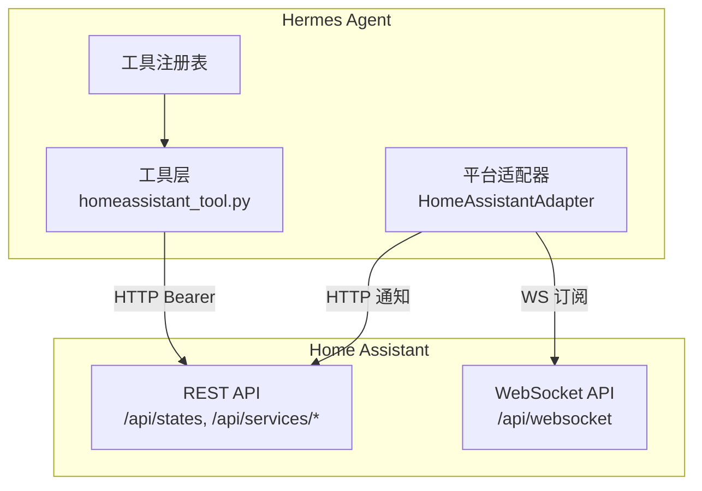
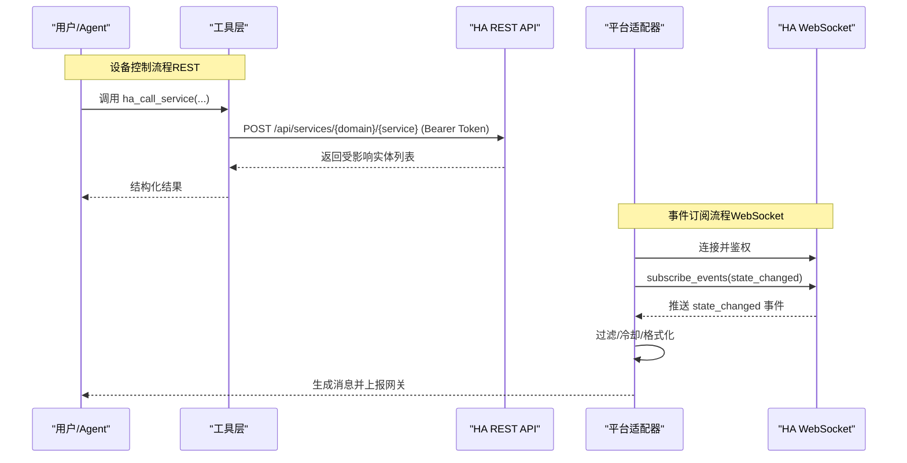
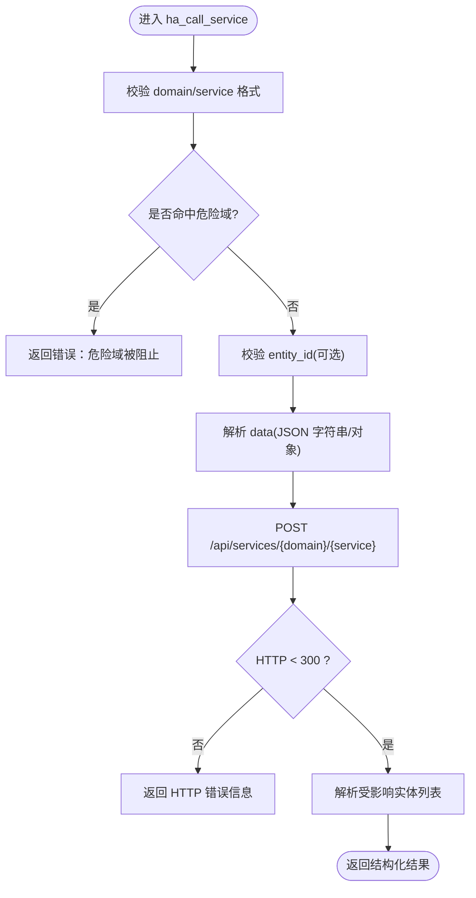
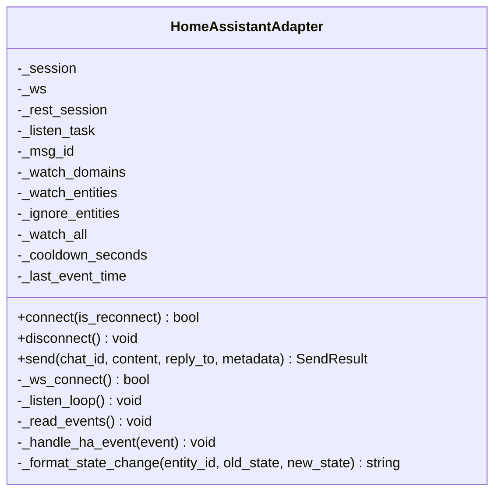
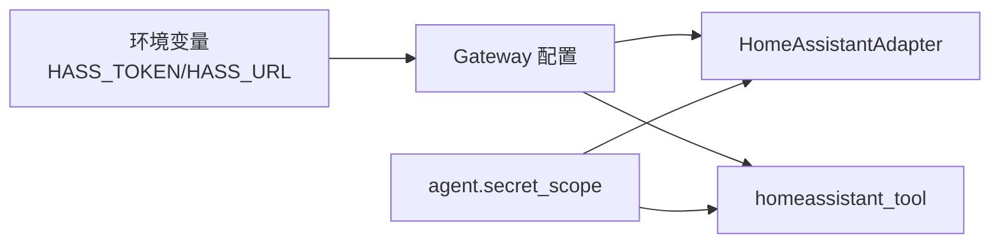

# Home Assistant 集成

<cite>
**本文引用的文件**
- [tools/homeassistant_tool.py](file://tools/homeassistant_tool.py)
- [plugins/platforms/homeassistant/adapter.py](file://plugins/platforms/homeassistant/adapter.py)
- [plugins/platforms/homeassistant/__init__.py](file://plugins/platforms/homeassistant/__init__.py)
- [website/docs/user-guide/messaging/homeassistant.md](file://website/docs/user-guide/messaging/homeassistant.md)
- [tests/tools/test_homeassistant_tool.py](file://tests/tools/test_homeassistant_tool.py)
- [tests/gateway/test_homeassistant.py](file://tests/gateway/test_homeassistant.py)
- [gateway/config.py](file://gateway/config.py)
- [hermes_cli/tools_config.py](file://hermes_cli/tools_config.py)
</cite>

## 目录
1. [简介](#简介)
2. [项目结构](#项目结构)
3. [核心组件](#核心组件)
4. [架构总览](#架构总览)
5. [详细组件分析](#详细组件分析)
6. [依赖关系分析](#依赖关系分析)
7. [性能与稳定性](#性能与稳定性)
8. [故障排查指南](#故障排查指南)
9. [结论](#结论)
10. [附录：配置与示例](#附录配置与示例)

## 简介
本文档说明 Hermes Agent 与 Home Assistant 的无缝集成方案，涵盖以下能力：
- 通过 REST API 进行设备控制、实体查询与服务调用
- 通过 WebSocket 订阅 Home Assistant 状态变更事件，实现实时状态监控与自动化触发
- 认证配置（长生命周期访问令牌）、实体管理、服务调用与事件监听机制
- 智能家居场景编排（灯光、温控、安防、能源）
- 设备发现、连接管理与故障恢复（自动重连、退避策略）
- 安全访问控制（危险域拦截、参数校验）

## 项目结构
围绕 Home Assistant 的集成主要涉及两类模块：
- 工具层（REST API）：提供 LLM 可调用的工具，用于列出实体、获取状态、列举服务、调用服务
- 平台适配器（WebSocket + REST）：作为 Gateway 平台接入，订阅 state_changed 事件并转发为消息；同时通过 REST 发送通知



图表来源
- [tools/homeassistant_tool.py:1-515](file://tools/homeassistant_tool.py#L1-L515)
- [plugins/platforms/homeassistant/adapter.py:1-605](file://plugins/platforms/homeassistant/adapter.py#L1-L605)

章节来源
- [tools/homeassistant_tool.py:1-515](file://tools/homeassistant_tool.py#L1-L515)
- [plugins/platforms/homeassistant/adapter.py:1-605](file://plugins/platforms/homeassistant/adapter.py#L1-L605)

## 核心组件
- 工具层（homeassistant_tool.py）
  - ha_list_entities：按 domain/area 过滤列出实体
  - ha_get_state：获取单个实体的详细状态与属性
  - ha_list_services：列举可用服务及字段说明
  - ha_call_service：调用服务（如 turn_on/set_temperature 等）
  - 安全：域名白名单/黑名单、entity_id 格式校验、SSRF/路径穿越防护
- 平台适配器（HomeAssistantAdapter）
  - 建立 WebSocket 连接，鉴权后订阅 state_changed 事件
  - 事件过滤（watch_domains/watch_entities/watch_all/ignore_entities）
  - 冷却去抖（cooldown_seconds）避免事件风暴
  - 将事件转换为 MessageEvent 并交由网关处理
  - 通过 REST API 发送持久化通知（persistent_notification.create）
  - 独立进程发送器（standalone_sender_fn）支持 cron 任务投递

章节来源
- [tools/homeassistant_tool.py:1-515](file://tools/homeassistant_tool.py#L1-L515)
- [plugins/platforms/homeassistant/adapter.py:1-605](file://plugins/platforms/homeassistant/adapter.py#L1-L605)

## 架构总览


图表来源
- [tools/homeassistant_tool.py:178-201](file://tools/homeassistant_tool.py#L178-L201)
- [plugins/platforms/homeassistant/adapter.py:166-211](file://plugins/platforms/homeassistant/adapter.py#L166-L211)
- [plugins/platforms/homeassistant/adapter.py:243-344](file://plugins/platforms/homeassistant/adapter.py#L243-L344)

## 详细组件分析

### 工具层：Home Assistant REST 工具
- 功能要点
  - 列出实体：按 domain/area 过滤，返回精简摘要
  - 获取状态：返回 entity_id、state、attributes、时间戳
  - 列举服务：返回各域的服务名、描述与字段说明
  - 调用服务：构造 JSON payload，POST 到 /api/services/{domain}/{service}
- 安全与校验
  - 危险域拦截：shell_command、command_line、python_script、pyscript、hassio、rest_command
  - entity_id 正则校验，防止注入与路径穿越
  - domain/service 名称严格匹配，防止 SSRF
- 错误处理
  - 网络异常/超时统一捕获并返回结构化错误
  - data 参数支持字符串 JSON 反序列化，兼容 XML 工具调用模式



图表来源
- [tools/homeassistant_tool.py:252-289](file://tools/homeassistant_tool.py#L252-L289)
- [tools/homeassistant_tool.py:178-201](file://tools/homeassistant_tool.py#L178-L201)

章节来源
- [tools/homeassistant_tool.py:1-515](file://tools/homeassistant_tool.py#L1-L515)
- [tests/tools/test_homeassistant_tool.py:1-382](file://tests/tools/test_homeassistant_tool.py#L1-L382)

### 平台适配器：HomeAssistantAdapter（WebSocket + REST）
- 连接与鉴权
  - 使用 aiohttp 建立 WebSocket 连接到 /api/websocket
  - 接收 auth_required → 发送 access_token → 等待 auth_ok
  - 订阅 state_changed 事件
- 事件处理流水线
  - 忽略列表优先（ignore_entities）
  - 白名单过滤（watch_domains/watch_entities），或 watch_all
  - 冷却去抖（cooldown_seconds）避免高频事件
  - 按领域格式化消息（climate/sensor/binary_sensor/light/switch/fan/alarm_control_panel）
  - 构建 MessageEvent 并通过 handle_message 上报
- 出站消息
  - 通过 REST API persistent_notification.create 发送通知
  - 独立 REST Session，避免与事件读取竞争
- 重连与健壮性
  - 后台监听循环，断线后指数退避重连（5→10→30→60 秒）
  - 清理资源（ws/session）确保无泄漏



图表来源
- [plugins/platforms/homeassistant/adapter.py:77-117](file://plugins/platforms/homeassistant/adapter.py#L77-L117)
- [plugins/platforms/homeassistant/adapter.py:127-211](file://plugins/platforms/homeassistant/adapter.py#L127-L211)
- [plugins/platforms/homeassistant/adapter.py:243-344](file://plugins/platforms/homeassistant/adapter.py#L243-L344)
- [plugins/platforms/homeassistant/adapter.py:412-464](file://plugins/platforms/homeassistant/adapter.py#L412-L464)

章节来源
- [plugins/platforms/homeassistant/adapter.py:1-605](file://plugins/platforms/homeassistant/adapter.py#L1-L605)
- [tests/gateway/test_homeassistant.py:1-321](file://tests/gateway/test_homeassistant.py#L1-L321)

### 插件注册与入口
- __init__.py 暴露 register 函数供插件系统加载
- adapter.py 中 register(ctx) 完成平台注册，包含：
  - 平台名、标签、工厂函数、依赖检查、配置校验
  - is_connected 探测（基于 HASS_TOKEN）
  - standalone_sender_fn（独立进程发送通知）
  - max_message_length、emoji 等显示信息

章节来源
- [plugins/platforms/homeassistant/__init__.py:1-4](file://plugins/platforms/homeassistant/__init__.py#L1-L4)
- [plugins/platforms/homeassistant/adapter.py:577-605](file://plugins/platforms/homeassistant/adapter.py#L577-L605)

## 依赖关系分析
- 运行时依赖
  - aiohttp：WebSocket 与 HTTP 客户端
  - agent.secret_scope：安全读取 HASS_URL/HASS_TOKEN（支持多 profile 隔离）
  - gateway.config.Platform.HOMEASSISTANT：平台枚举
- 配置来源
  - 环境变量：HASS_TOKEN、HASS_URL
  - 配置文件：~/.hermes/config.yaml 的 platforms.homeassistant.extra
  - CLI 工具集自动启用：当检测到 HASS_TOKEN 时启用 homeassistant toolset



图表来源
- [plugins/platforms/homeassistant/adapter.py:43-74](file://plugins/platforms/homeassistant/adapter.py#L43-L74)
- [tools/homeassistant_tool.py:32-37](file://tools/homeassistant_tool.py#L32-L37)
- [hermes_cli/tools_config.py:200-205](file://hermes_cli/tools_config.py#L200-L205)

章节来源
- [gateway/config.py:2081-2087](file://gateway/config.py#L2081-L2087)
- [hermes_cli/tools_config.py:200-205](file://hermes_cli/tools_config.py#L200-L205)

## 性能与稳定性
- 事件节流
  - cooldown_seconds 默认 30 秒，降低同一实体频繁变化带来的负载
- 连接管理
  - WebSocket 心跳 30 秒，检测链路健康
  - 断线重连采用固定退避序列（5→10→30→60 秒），避免雪崩
- 并发与资源
  - 事件读取与出站通知分离（REST vs WebSocket），避免竞争
  - 独立的 REST Session 用于 send()，减少锁争用
- 可扩展性
  - 通过 watch_domains/watch_entities/watch_all 精确控制事件范围，减少无效流量
- 测试覆盖
  - 工具层：过滤、payload 构建、响应解析、安全校验、可用性门控
  - 适配器：格式化、过滤管线、冷却行为、配置集成、REST 发送

章节来源
- [plugins/platforms/homeassistant/adapter.py:88-116](file://plugins/platforms/homeassistant/adapter.py#L88-L116)
- [plugins/platforms/homeassistant/adapter.py:243-272](file://plugins/platforms/homeassistant/adapter.py#L243-L272)
- [tests/tools/test_homeassistant_tool.py:1-382](file://tests/tools/test_homeassistant_tool.py#L1-L382)
- [tests/gateway/test_homeassistant.py:1-321](file://tests/gateway/test_homeassistant.py#L1-L321)

## 故障排查指南
- 无法连接或 401 Unauthorized
  - 确认使用的是“长生命周期访问令牌”（Long-Lived Access Token）
  - 检查 HASS_URL 是否包含协议与端口，且可从运行主机访问
  - 验证 Authorization: Bearer 头是否正确携带
- 未收到任何事件
  - 必须配置至少一项过滤：watch_domains、watch_entities 或 watch_all=true
  - 检查 ignore_entities 是否误屏蔽了目标实体
  - 调整 cooldown_seconds 避免过短导致的事件抑制
- 工具不可用
  - 缺少 HASS_TOKEN 时工具会被禁用；设置后可自动启用 homeassistant toolset
- 事件风暴
  - 提高 cooldown_seconds 或使用更严格的 watch_domains/watch_entities
- 独立进程发送失败（cron）
  - 确认 pconfig.token 与 extra.url 已正确注入，或环境变量 HASS_TOKEN/HASS_URL 存在

章节来源
- [website/docs/user-guide/messaging/homeassistant.md:123-189](file://website/docs/user-guide/messaging/homeassistant.md#L123-L189)
- [website/docs/user-guide/messaging/homeassistant.md:254-270](file://website/docs/user-guide/messaging/homeassistant.md#L254-L270)
- [plugins/platforms/homeassistant/adapter.py:559-570](file://plugins/platforms/homeassistant/adapter.py#L559-L570)

## 结论
Hermes Agent 通过“工具层 + 平台适配器”的双通道方式与 Home Assistant 深度集成：
- 工具层提供安全的 REST 接口，便于 LLM 驱动设备控制与状态查询
- 平台适配器通过 WebSocket 实时订阅状态变化，结合过滤与冷却机制，稳定地将事件转化为可操作的消息
- 完善的认证、安全校验、连接管理与故障恢复策略，保障生产环境的可靠性
- 丰富的配置项与清晰的文档，便于快速搭建语音控制灯光、温控、安防与能源管理等智能场景

## 附录：配置与示例

### 认证与环境变量
- 必需：HASS_TOKEN（长生命周期访问令牌）
- 可选：HASS_URL（默认 http://homeassistant.local:8123）
- 在 ~/.hermes/.env 或 config.yaml 中配置，重启网关生效

章节来源
- [website/docs/user-guide/messaging/homeassistant.md:15-47](file://website/docs/user-guide/messaging/homeassistant.md#L15-L47)
- [hermes_cli/tools_config.py:660-669](file://hermes_cli/tools_config.py#L660-L669)

### 事件过滤配置（config.yaml）
```yaml
platforms:
  homeassistant:
    enabled: true
    extra:
      watch_domains:
        - climate
        - binary_sensor
        - alarm_control_panel
        - light
      watch_entities:
        - sensor.front_door_battery
      ignore_entities:
        - sensor.uptime
        - sensor.cpu_usage
        - sensor.memory_usage
      cooldown_seconds: 30
```

章节来源
- [website/docs/user-guide/messaging/homeassistant.md:127-164](file://website/docs/user-guide/messaging/homeassistant.md#L127-L164)

### 常用工具与场景示例
- 列出实体：ha_list_entities(domain="light", area="living room")
- 获取状态：ha_get_state(entity_id="climate.thermostat")
- 列举服务：ha_list_services(domain="climate")
- 控制设备：
  - 开灯：ha_call_service(domain="light", service="turn_on", entity_id="light.living_room")
  - 调温：ha_call_service(domain="climate", service="set_temperature", entity_id="climate.thermostat", data={"temperature": 22, "hvac_mode": "heat"})
  - 颜色亮度：ha_call_service(domain="light", service="turn_on", entity_id="light.living_room", data={"brightness": 128, "color_name": "blue"})

章节来源
- [website/docs/user-guide/messaging/homeassistant.md:49-122](file://website/docs/user-guide/messaging/homeassistant.md#L49-L122)
- [tools/homeassistant_tool.py:354-471](file://tools/homeassistant_tool.py#L354-L471)

### 安全与访问控制
- 危险域拦截：shell_command、command_line、python_script、pyscript、hassio、rest_command
- entity_id/domain/service 严格格式校验，防止路径穿越与 SSRF
- 仅当 HASS_TOKEN 存在时启用工具集，避免未授权访问

章节来源
- [tools/homeassistant_tool.py:51-61](file://tools/homeassistant_tool.py#L51-L61)
- [tools/homeassistant_tool.py:252-289](file://tools/homeassistant_tool.py#L252-L289)
- [website/docs/user-guide/messaging/homeassistant.md:190-208](file://website/docs/user-guide/messaging/homeassistant.md#L190-L208)