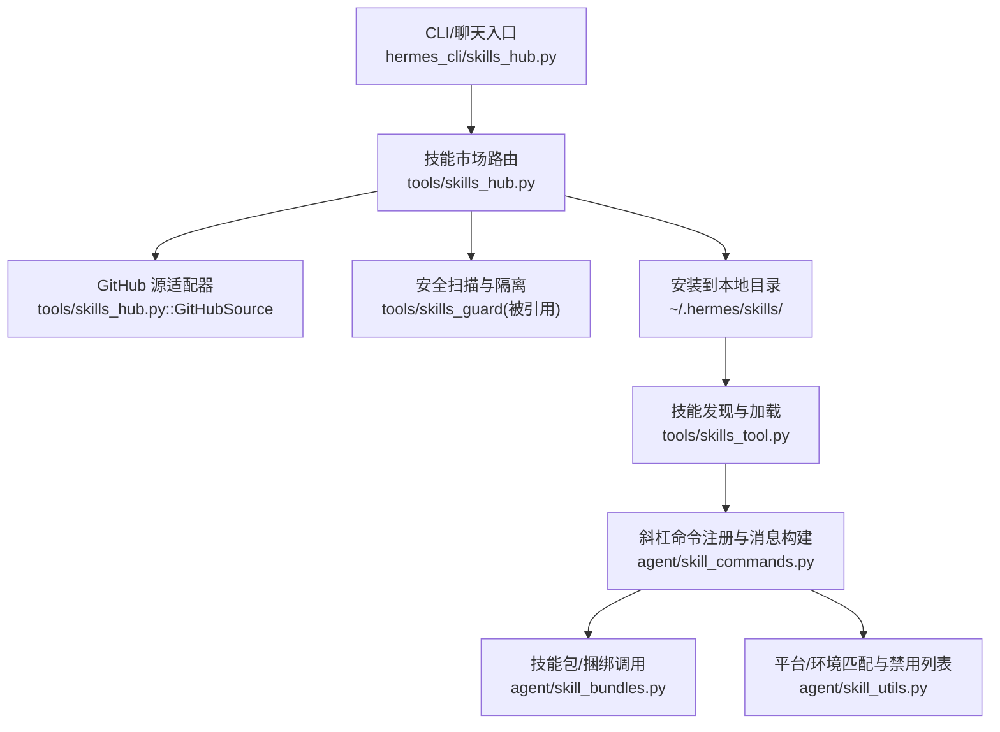
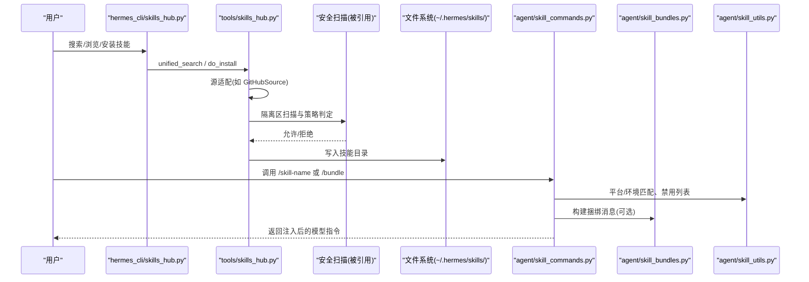
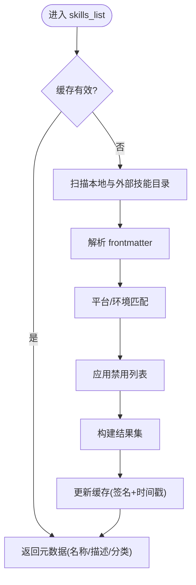
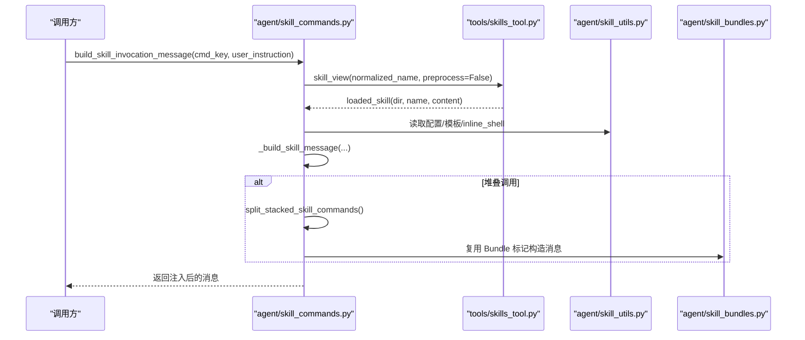
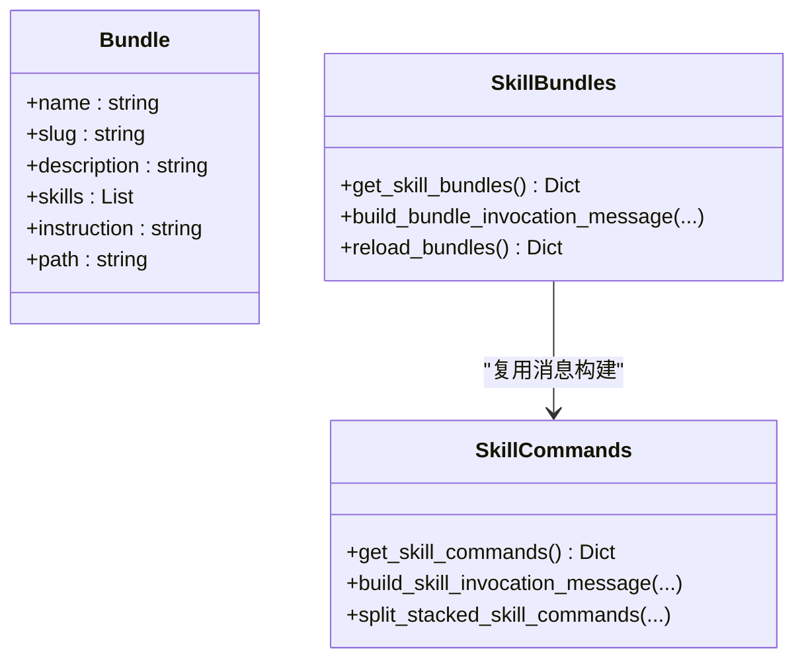
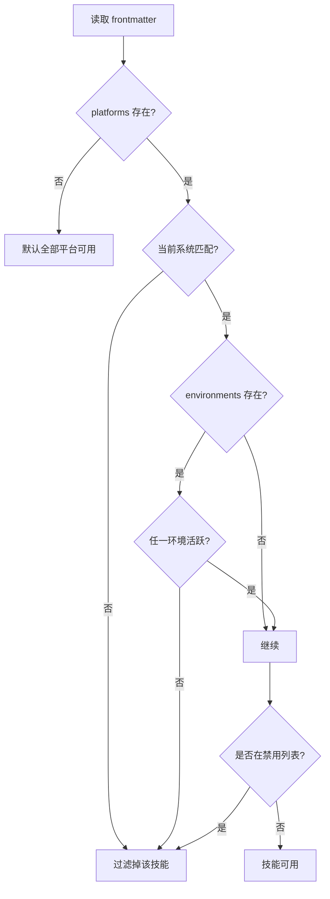
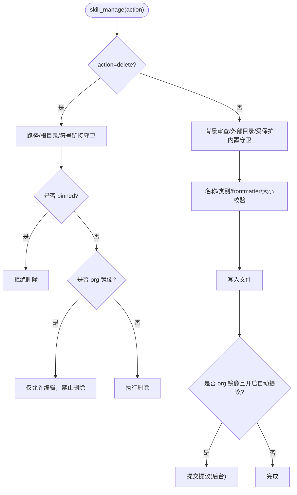
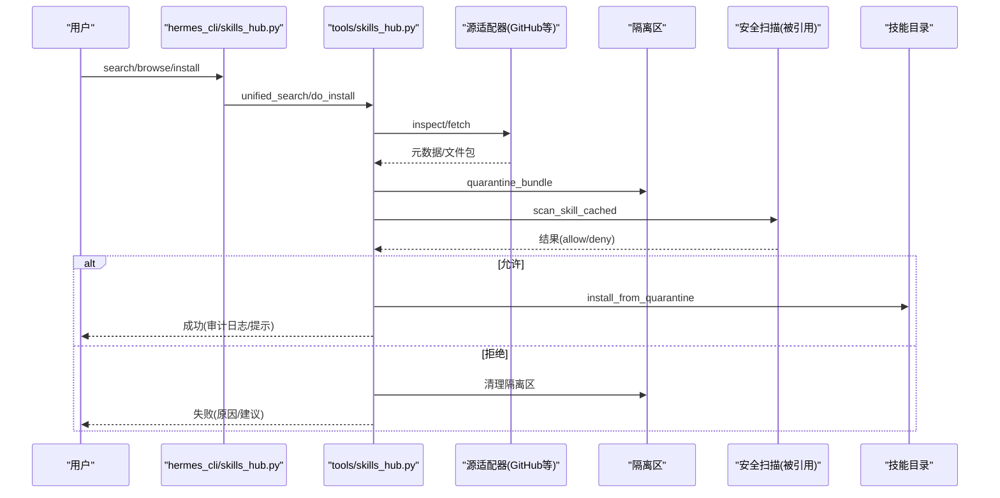
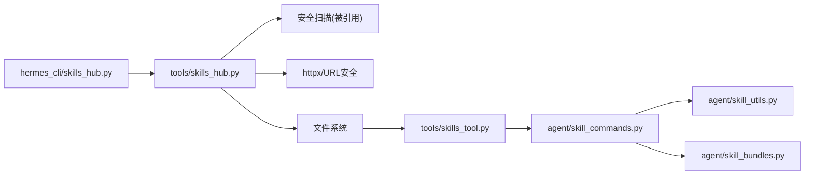

# 技能管理工具

<cite>
**本文引用的文件**
- [agent/skill_bundles.py](file://agent/skill_bundles.py)
- [agent/skill_commands.py](file://agent/skill_commands.py)
- [agent/skill_utils.py](file://agent/skill_utils.py)
- [tools/skills_tool.py](file://tools/skills_tool.py)
- [tools/skill_manager_tool.py](file://tools/skill_manager_tool.py)
- [tools/skills_hub.py](file://tools/skills_hub.py)
- [hermes_cli/skills_hub.py](file://hermes_cli/skills_hub.py)
</cite>

## 目录
1. [简介](#简介)
2. [项目结构](#项目结构)
3. [核心组件](#核心组件)
4. [架构总览](#架构总览)
5. [详细组件分析](#详细组件分析)
6. [依赖关系分析](#依赖关系分析)
7. [性能考量](#性能考量)
8. [故障排查指南](#故障排查指南)
9. [结论](#结论)
10. [附录](#附录)

## 简介
本文件面向 Hermes Agent 的技能管理与优化，覆盖技能的创建、部署、监控与性能分析；阐述技能注册机制、依赖与环境匹配、版本控制与更新策略；解释执行环境隔离、资源限制与错误处理；提供开发最佳实践、调试技巧与性能优化方法；并说明技能市场集成、社区共享与质量评估机制，以及如何构建可重用的程序化技能包与自动化工作流。

## 项目结构
Hermes 的技能系统围绕“本地技能目录 + 外部扩展目录 + 技能市场（Hub）”的三层组织展开：
- 本地技能目录：~/.hermes/skills/，作为单一事实来源，存放用户与官方可选技能。
- 外部技能目录：通过配置 skills.external_dirs 引入，支持多源复用与团队共享。
- 技能市场（Hub）：统一搜索、下载、隔离扫描与安装入口，支持 GitHub 等来源。

**图示来源**
- [hermes_cli/skills_hub.py:250-793](file://hermes_cli/skills_hub.py#L250-L793)
- [tools/skills_hub.py:559-708](file://tools/skills_hub.py#L559-L708)
- [tools/skills_tool.py:670-778](file://tools/skills_tool.py#L670-L778)
- [agent/skill_commands.py:374-467](file://agent/skill_commands.py#L374-L467)
- [agent/skill_bundles.py:168-205](file://agent/skill_bundles.py#L168-L205)
- [agent/skill_utils.py:223-387](file://agent/skill_utils.py#L223-L387)

**章节来源**
- [hermes_cli/skills_hub.py:250-793](file://hermes_cli/skills_hub.py#L250-L793)
- [tools/skills_hub.py:559-708](file://tools/skills_hub.py#L559-L708)
- [tools/skills_tool.py:670-778](file://tools/skills_tool.py#L670-L778)
- [agent/skill_commands.py:374-467](file://agent/skill_commands.py#L374-L467)
- [agent/skill_bundles.py:168-205](file://agent/skill_bundles.py#L168-L205)
- [agent/skill_utils.py:223-387](file://agent/skill_utils.py#L223-L387)

## 核心组件
- 技能清单与视图：skills_list/skill_view 提供渐进式披露，减少提示词体积。
- 斜杠命令与消息构建：将 SKILL.md 内容注入为模型可见指令，并提取用户真实意图。
- 技能包（Bundle）：一次加载多个技能，合并为单条消息，便于组合工作流。
- 平台与环境匹配：按 frontmatter 的 platforms/environments 过滤可用技能。
- 禁用列表：全局与平台级 disabled/platform_disabled 控制可见性与可用性。
- 技能管理器：创建、编辑、补丁、删除、写入支持文件，含安全与所有权守卫。
- 技能市场（Hub）：跨源搜索、下载、隔离扫描、审计日志、锁定与安装。

**章节来源**
- [tools/skills_tool.py:786-800](file://tools/skills_tool.py#L786-L800)
- [agent/skill_commands.py:73-136](file://agent/skill_commands.py#L73-L136)
- [agent/skill_bundles.py:253-368](file://agent/skill_bundles.py#L253-L368)
- [agent/skill_utils.py:223-387](file://agent/skill_utils.py#L223-L387)
- [tools/skill_manager_tool.py:523-635](file://tools/skill_manager_tool.py#L523-L635)
- [hermes_cli/skills_hub.py:490-793](file://hermes_cli/skills_hub.py#L490-L793)

## 架构总览
技能从“市场/本地/外部”汇聚到统一的技能目录，再由 CLI/聊天入口触发斜杠命令或预加载，最终在会话中注入为模型指令。

**图示来源**
- [hermes_cli/skills_hub.py:250-793](file://hermes_cli/skills_hub.py#L250-L793)
- [tools/skills_hub.py:559-708](file://tools/skills_hub.py#L559-L708)
- [agent/skill_commands.py:374-467](file://agent/skill_commands.py#L374-L467)
- [agent/skill_bundles.py:253-368](file://agent/skill_bundles.py#L253-L368)
- [agent/skill_utils.py:223-387](file://agent/skill_utils.py#L223-L387)

## 详细组件分析

### 技能清单与视图（Progressive Disclosure）
- 目标：最小化 token 使用，先展示元数据，按需加载完整内容与支持文件。
- 关键点：
  - 缓存签名基于目录 mtime 与禁用集合，TTL 控制新鲜度。
  - 支持 categories、tags、platforms/environments 过滤。
  - 描述长度限制，避免索引截断影响路由信号。

**图示来源**
- [tools/skills_tool.py:670-778](file://tools/skills_tool.py#L670-L778)
- [agent/skill_utils.py:223-387](file://agent/skill_utils.py#L223-L387)

**章节来源**
- [tools/skills_tool.py:670-778](file://tools/skills_tool.py#L670-L778)
- [agent/skill_utils.py:223-387](file://agent/skill_utils.py#L223-L387)

### 斜杠命令与消息构建
- 功能：将 /skill-name 或 /bundle 转换为模型可见指令，同时保留用户原始意图。
- 要点：
  - 支持堆叠调用（最多 N 个），复用 Bundle 标记以便记忆提供者正确抽取用户指令。
  - 注入技能目录路径与已解析的配置值，提升可操作性和可观测性。
  - 支持 inline shell 扩展与模板变量替换（受配置开关控制）。

**图示来源**
- [agent/skill_commands.py:569-744](file://agent/skill_commands.py#L569-L744)
- [tools/skills_tool.py:786-800](file://tools/skills_tool.py#L786-L800)
- [agent/skill_bundles.py:253-368](file://agent/skill_bundles.py#L253-L368)

**章节来源**
- [agent/skill_commands.py:569-744](file://agent/skill_commands.py#L569-L744)
- [tools/skills_tool.py:786-800](file://tools/skills_tool.py#L786-L800)
- [agent/skill_bundles.py:253-368](file://agent/skill_bundles.py#L253-L368)

### 技能包（Bundle）与组合工作流
- 目标：一次性加载多个技能，形成“组合指令”，便于复杂任务编排。
- 要点：
  - YAML 定义 bundle，slug 规范化后注册为斜杠命令。
  - 支持缺失/禁用成员降级提示，保证健壮性。
  - 与单技能消息构建共用标记，确保记忆层只存储用户真实指令。

**图示来源**
- [agent/skill_bundles.py:168-205](file://agent/skill_bundles.py#L168-L205)
- [agent/skill_commands.py:569-744](file://agent/skill_commands.py#L569-L744)

**章节来源**
- [agent/skill_bundles.py:168-205](file://agent/skill_bundles.py#L168-L205)
- [agent/skill_commands.py:569-744](file://agent/skill_commands.py#L569-L744)

### 平台与环境匹配、禁用列表
- 平台匹配：frontmatter.platforms 映射到 sys.platform，Termux/Android 特殊兼容。
- 环境匹配：frontmatter.environments 检测 kanban/docker/s6 等运行环境。
- 禁用列表：全局 disabled 与 platform_disabled 叠加，支持运行时平台上下文。

**图示来源**
- [agent/skill_utils.py:223-387](file://agent/skill_utils.py#L223-L387)
- [agent/skill_utils.py:436-479](file://agent/skill_utils.py#L436-L479)

**章节来源**
- [agent/skill_utils.py:223-387](file://agent/skill_utils.py#L223-L387)
- [agent/skill_utils.py:436-479](file://agent/skill_utils.py#L436-L479)

### 技能管理器（创建/编辑/删除/补丁）
- 能力：create/edit/patch/delete/write_file/remove_file，支持 category 与子目录白名单。
- 安全：
  - 名称/类别/内容大小校验。
  - 背景审查分支写前读保护、外部目录只读、pinned 保护。
  - 删除前严格校验路径不在根目录且非符号链接/连接点。
- 组织同步：Org 镜像编辑本地生效，可选择提议回上游。

**图示来源**
- [tools/skill_manager_tool.py:213-271](file://tools/skill_manager_tool.py#L213-L271)
- [tools/skill_manager_tool.py:301-421](file://tools/skill_manager_tool.py#L301-L421)
- [tools/skill_manager_tool.py:523-635](file://tools/skill_manager_tool.py#L523-L635)
- [tools/skill_manager_tool.py:665-737](file://tools/skill_manager_tool.py#L665-L737)

**章节来源**
- [tools/skill_manager_tool.py:213-271](file://tools/skill_manager_tool.py#L213-L271)
- [tools/skill_manager_tool.py:301-421](file://tools/skill_manager_tool.py#L301-L421)
- [tools/skill_manager_tool.py:523-635](file://tools/skill_manager_tool.py#L523-L635)
- [tools/skill_manager_tool.py:665-737](file://tools/skill_manager_tool.py#L665-L737)

### 技能市场（Hub）集成与质量评估
- 搜索/浏览：统一聚合多源（official/github/clawhub/lobehub/browse-sh），去重并按信任等级排序。
- 安装流程：下载 -> 隔离区 -> 安全扫描 -> 策略判定 -> 确认 -> 安装 -> 审计日志。
- 安全：SSRF 防护、重定向限制、URL 白名单、路径穿越防护、锁文件校验。
- 质量：信任等级（builtin/trusted/community）、审计日志、扫描报告、来源 URL 与修订记录。

**图示来源**
- [hermes_cli/skills_hub.py:250-793](file://hermes_cli/skills_hub.py#L250-L793)
- [tools/skills_hub.py:559-708](file://tools/skills_hub.py#L559-L708)

**章节来源**
- [hermes_cli/skills_hub.py:250-793](file://hermes_cli/skills_hub.py#L250-L793)
- [tools/skills_hub.py:559-708](file://tools/skills_hub.py#L559-L708)

## 依赖关系分析
- 模块耦合：
  - hermes_cli/skills_hub.py 依赖 tools/skills_hub.py 进行跨源检索与安装。
  - tools/skills_hub.py 依赖安全扫描（被引用）与 URL 安全工具。
  - agent/skill_commands.py 依赖 tools/skills_tool.py 获取技能内容，依赖 agent/skill_utils.py 做平台/环境/禁用判断。
  - agent/skill_bundles.py 复用 agent/skill_commands.py 的消息构建逻辑。
- 外部依赖：
  - httpx 用于网络请求（Hub）。
  - yaml 用于 frontmatter 与 bundle 解析。
  - rich 用于 CLI 表格渲染。

**图示来源**
- [hermes_cli/skills_hub.py:250-793](file://hermes_cli/skills_hub.py#L250-L793)
- [tools/skills_hub.py:559-708](file://tools/skills_hub.py#L559-L708)
- [tools/skills_tool.py:670-778](file://tools/skills_tool.py#L670-L778)
- [agent/skill_commands.py:374-467](file://agent/skill_commands.py#L374-L467)
- [agent/skill_bundles.py:168-205](file://agent/skill_bundles.py#L168-L205)
- [agent/skill_utils.py:223-387](file://agent/skill_utils.py#L223-L387)

**章节来源**
- [hermes_cli/skills_hub.py:250-793](file://hermes_cli/skills_hub.py#L250-L793)
- [tools/skills_hub.py:559-708](file://tools/skills_hub.py#L559-L708)
- [tools/skills_tool.py:670-778](file://tools/skills_tool.py#L670-L778)
- [agent/skill_commands.py:374-467](file://agent/skill_commands.py#L374-L467)
- [agent/skill_bundles.py:168-205](file://agent/skill_bundles.py#L168-L205)
- [agent/skill_utils.py:223-387](file://agent/skill_utils.py#L223-L387)

## 性能考量
- 缓存策略：
  - 技能清单缓存：基于目录 mtime 与禁用集合签名，TTL 控制新鲜度，避免重复扫描。
  - 配置读取缓存：config.yaml 按 mtime+size 缓存，降低冷启动开销。
  - Hub 索引缓存：index-cache 与 per-repo tree 缓存减少 API 调用。
- 渐进式披露：
  - 先返回元数据，再按需加载完整内容与支持文件，显著降低 token 消耗。
- 并发与超时：
  - Hub 并行搜索各源，设置整体超时与每源限制，防止慢源阻塞。
- 模板与内联 Shell：
  - 可通过配置关闭 inline_shell 以避免额外执行成本。

[本节为通用指导，不直接分析具体文件]

## 故障排查指南
- 技能不可见/未生效：
  - 检查 platforms/environments 是否匹配当前运行环境。
  - 检查禁用列表（全局与平台级）是否包含该技能。
  - 确认斜杠命令 slug 是否与核心命令冲突或被覆盖。
- 安装失败：
  - 查看隔离区与安全扫描报告，确认是否被策略拒绝。
  - 检查 URL 安全与 SSRF 拦截、重定向次数限制。
  - 确认锁文件 install_path 合法性，避免路径穿越。
- 编辑/删除失败：
  - 确认是否为 pinned 技能或外部目录只读。
  - 背景审查分支需先读取目标文件再写，否则拒绝。
  - 删除前会校验路径不在根目录且非符号链接/连接点。
- 性能问题：
  - 启用/调整 inline_shell 与模板替换开关。
  - 关注 Hub 并行搜索超时与每源限制，必要时增加缓存命中。

**章节来源**
- [agent/skill_utils.py:223-387](file://agent/skill_utils.py#L223-L387)
- [agent/skill_utils.py:436-479](file://agent/skill_utils.py#L436-L479)
- [agent/skill_commands.py:374-467](file://agent/skill_commands.py#L374-L467)
- [hermes_cli/skills_hub.py:490-793](file://hermes_cli/skills_hub.py#L490-L793)
- [tools/skill_manager_tool.py:213-271](file://tools/skill_manager_tool.py#L213-L271)
- [tools/skill_manager_tool.py:301-421](file://tools/skill_manager_tool.py#L301-L421)

## 结论
Hermes 的技能管理系统以“本地目录 + 外部扩展 + 市场”为核心，结合渐进式披露、平台/环境匹配、禁用列表与严格的安全扫描，实现了高可用、可扩展且安全的技能生命周期管理。通过 Bundle 与堆叠调用，用户可以灵活组合工作流；通过 Hub 与审计日志，实现社区共享与质量评估。建议在开发中遵循 frontmatter 规范、合理声明依赖与配置项、利用缓存与渐进式披露优化性能，并通过安全扫描与权限守卫保障稳定性。

[本节为总结性内容，不直接分析具体文件]

## 附录
- 最佳实践
  - 在 frontmatter 中明确 platforms/environments，减少无关技能干扰。
  - 使用 metadata.hermes.config 声明配置项，便于运行时注入与提示。
  - 将大文档拆分至 references/templates/scripts/assets，按需加载。
  - 对敏感信息使用安全采集与脱敏，避免泄露。
- 调试技巧
  - 使用 describe_skill_invocation 还原用户真实指令，便于日志与回放。
  - 通过 reload_skills/reload_bundles 观察变更差异，定位新增/移除项。
  - 在 Hub 安装时查看审计日志与扫描报告，快速定位阻断原因。
- 性能优化
  - 合理设置 inline_shell 与模板替换开关，避免不必要执行。
  - 利用缓存与 TTL，减少重复扫描与网络请求。
  - 使用 Bundle 组合常用技能，减少多次调用开销。

[本节为通用指导，不直接分析具体文件]