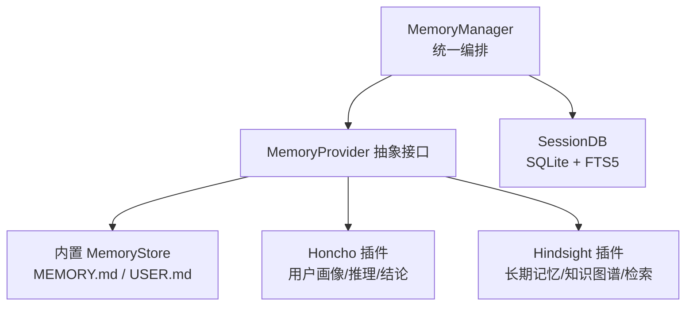
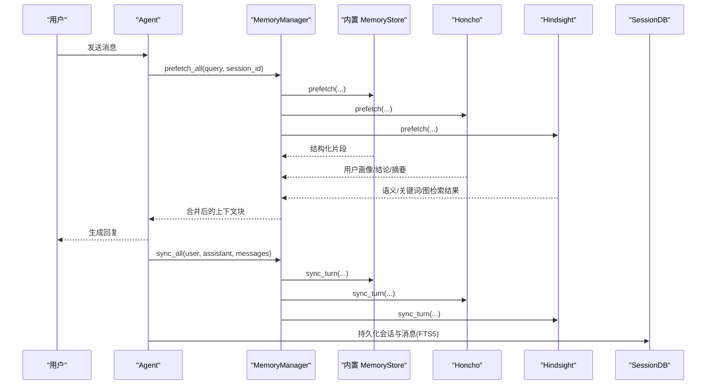
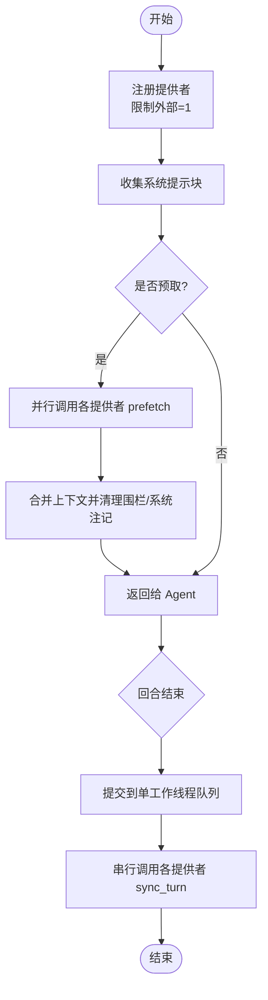
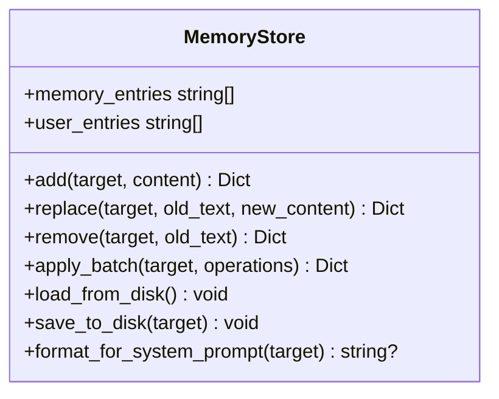
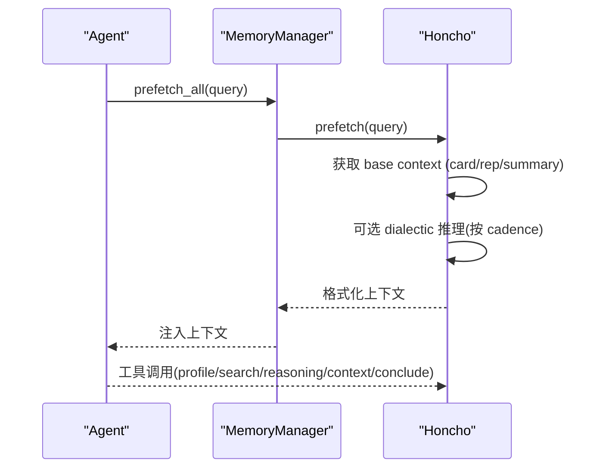
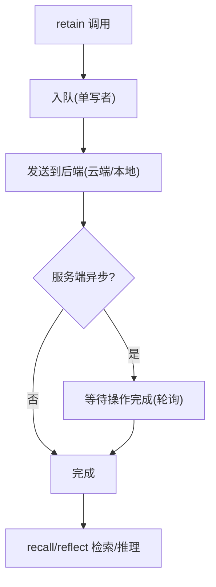
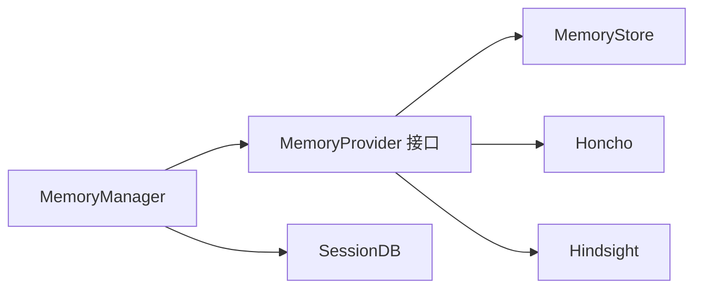

# 记忆系统工具

<cite>
**本文引用的文件**
- [agent/memory_manager.py](file://agent/memory_manager.py)
- [agent/memory_provider.py](file://agent/memory_provider.py)
- [tools/memory_tool.py](file://tools/memory_tool.py)
- [plugins/memory/honcho/__init__.py](file://plugins/memory/honcho/__init__.py)
- [plugins/memory/hindsight/__init__.py](file://plugins/memory/hindsight/__init__.py)
- [hermes_state.py](file://hermes_state.py)
</cite>

## 目录
1. [简介](#简介)
2. [项目结构](#项目结构)
3. [核心组件](#核心组件)
4. [架构总览](#架构总览)
5. [详细组件分析](#详细组件分析)
6. [依赖关系分析](#依赖关系分析)
7. [性能与存储优化](#性能与存储优化)
8. [故障排查指南](#故障排查指南)
9. [结论](#结论)
10. [附录](#附录)

## 简介
本文件系统性说明 Hermes Agent 的记忆系统，覆盖结构化记忆的持久化、向量/语义检索、上下文关联、索引机制、压缩策略、用户画像构建、偏好学习与跨会话继承，以及隐私保护、数据加密与访问控制。同时给出如何基于该记忆系统构建个性化 AI 助手与智能推荐引擎的实践建议。

## 项目结构
记忆系统由“管理器 + 抽象接口 + 内置文件型记忆 + 外部插件（Honcho/Hindsight）+ 状态数据库”构成：
- 管理器：统一编排多个记忆提供者的预取、同步与工具暴露。
- 抽象接口：定义提供者的生命周期、预取、写入、工具与钩子。
- 内置记忆：以文件为后端的结构化条目（MEMORY.md/USER.md），支持安全扫描与原子写入。
- 外部插件：
  - Honcho：AI 原生用户建模、对话式推理、混合检索（语义+关键词）、持久结论。
  - Hindsight：长期记忆、知识图谱、实体解析、多策略检索（语义/关键词/图遍历/重排）。
- 状态数据库：SQLite + FTS5 全文检索，用于会话历史与消息的持久化与检索。

图表来源
- [agent/memory_manager.py:364-545](file://agent/memory_manager.py#L364-L545)
- [agent/memory_provider.py:81-190](file://agent/memory_provider.py#L81-L190)
- [tools/memory_tool.py:148-240](file://tools/memory_tool.py#L148-L240)
- [plugins/memory/honcho/__init__.py:237-304](file://plugins/memory/honcho/__init__.py#L237-L304)
- [plugins/memory/hindsight/__init__.py:681-753](file://plugins/memory/hindsight/__init__.py#L681-L753)
- [hermes_state.py:1-15](file://hermes_state.py#L1-L15)

章节来源
- [agent/memory_manager.py:364-545](file://agent/memory_manager.py#L364-L545)
- [agent/memory_provider.py:81-190](file://agent/memory_provider.py#L81-L190)
- [tools/memory_tool.py:148-240](file://tools/memory_tool.py#L148-L240)
- [plugins/memory/honcho/__init__.py:237-304](file://plugins/memory/honcho/__init__.py#L237-L304)
- [plugins/memory/hindsight/__init__.py:681-753](file://plugins/memory/hindsight/__init__.py#L681-L753)
- [hermes_state.py:1-15](file://hermes_state.py#L1-L15)

## 核心组件
- MemoryManager：注册提供者、组装系统提示、预取上下文、回合后同步、后台任务调度与超时保护。
- MemoryProvider：抽象接口，定义 is_available/initialize/system_prompt_block/prefetch/sync_turn/get_tool_schemas/handle_tool_call/shutdown 及可选钩子。
- MemoryStore（内置）：文件型结构化记忆，支持条目增删改、批量操作、字符预算、注入/泄露防护、快照注入系统提示。
- Honcho 插件：用户画像（卡片/表示/摘要）、对话式推理、结论持久化、混合检索；支持 context/tools/hybrid 三种召回模式。
- Hindsight 插件：长期记忆、知识图谱、实体解析、多策略检索；支持 retain/recall/reflect 工具；可本地或云端运行。
- SessionDB：SQLite 会话存储，FTS5 全文检索，WAL 模式与兼容性回退，会话拆分与溯源。

章节来源
- [agent/memory_manager.py:364-545](file://agent/memory_manager.py#L364-L545)
- [agent/memory_provider.py:81-190](file://agent/memory_provider.py#L81-L190)
- [tools/memory_tool.py:148-240](file://tools/memory_tool.py#L148-L240)
- [plugins/memory/honcho/__init__.py:237-304](file://plugins/memory/honcho/__init__.py#L237-L304)
- [plugins/memory/hindsight/__init__.py:681-753](file://plugins/memory/hindsight/__init__.py#L681-L753)
- [hermes_state.py:1-15](file://hermes_state.py#L1-L15)

## 架构总览
记忆系统在每轮对话中执行“预取—生成—同步”的闭环：
- 预取：按配置在 turn 前从各提供者拉取相关上下文（Honcho/Hindsight/内置），经清理与围栏标记后注入系统提示。
- 生成：模型基于当前上下文作答。
- 同步：turn 结束后将用户与助手内容异步写入各提供者（含向量/图/文件），并可能触发下一轮预取的预热。

图表来源
- [agent/memory_manager.py:525-694](file://agent/memory_manager.py#L525-L694)
- [agent/memory_provider.py:132-170](file://agent/memory_provider.py#L132-L170)
- [plugins/memory/honcho/__init__.py:699-800](file://plugins/memory/honcho/__init__.py#L699-L800)
- [plugins/memory/hindsight/__init__.py:700-753](file://plugins/memory/hindsight/__init__.py#L700-L753)
- [hermes_state.py:1-15](file://hermes_state.py#L1-L15)

## 详细组件分析

### MemoryManager：统一编排与并发控制
- 提供者注册：仅允许一个外部提供者，避免工具冲突与 schema 膨胀；保留核心工具名优先。
- 系统提示：聚合各提供者的静态提示块。
- 预取流程：对每个提供者调用 prefetch；外部提供者使用独立线程与超时保护，失败不阻塞其他提供者。
- 同步流程：回合结束后通过单工作线程串行化写入，保证顺序性且不影响响应路径。
- 工具注入：按需将提供者的工具 schema 注入到 agent 的工具集，支持启用/禁用策略。

图表来源
- [agent/memory_manager.py:404-470](file://agent/memory_manager.py#L404-L470)
- [agent/memory_manager.py:525-694](file://agent/memory_manager.py#L525-L694)
- [agent/memory_manager.py:698-757](file://agent/memory_manager.py#L698-L757)

章节来源
- [agent/memory_manager.py:404-470](file://agent/memory_manager.py#L404-L470)
- [agent/memory_manager.py:525-694](file://agent/memory_manager.py#L525-L694)
- [agent/memory_manager.py:698-757](file://agent/memory_manager.py#L698-L757)

### MemoryProvider：抽象接口与生命周期
- 生命周期：initialize/system_prompt_block/prefetch/sync_turn/get_tool_schemas/handle_tool_call/shutdown。
- 可选钩子：on_turn_start/on_session_end/on_session_switch/on_pre_compress/on_delegation/on_memory_write/backup_paths。
-  trivial prompt 过滤：共享正则，避免无意义请求触发网络开销。

章节来源
- [agent/memory_provider.py:81-190](file://agent/memory_provider.py#L81-L190)
- [agent/memory_provider.py:195-358](file://agent/memory_provider.py#L195-L358)

### 内置 MemoryStore：结构化持久化与安全
- 数据结构：MEMORY.md（个人笔记）、USER.md（用户画像），条目以分隔符组织，支持去重与字符预算。
- 安全扫描：加载时与写入时对内容进行严格威胁检测，命中则替换为占位符或拒绝写入。
- 原子性与一致性：文件锁 + 原子写入；外部漂移检测，防止并发修改导致的数据丢失。
- 系统提示快照：启动时冻结快照，会话内稳定，避免破坏前缀缓存。
- 批量操作：一次调用完成 add/replace/remove 组合，最终预算检查，失败全部回滚。

图表来源
- [tools/memory_tool.py:148-240](file://tools/memory_tool.py#L148-L240)
- [tools/memory_tool.py:390-670](file://tools/memory_tool.py#L390-L670)
- [tools/memory_tool.py:682-748](file://tools/memory_tool.py#L682-L748)

章节来源
- [tools/memory_tool.py:148-240](file://tools/memory_tool.py#L148-L240)
- [tools/memory_tool.py:390-670](file://tools/memory_tool.py#L390-L670)
- [tools/memory_tool.py:682-748](file://tools/memory_tool.py#L682-L748)

### Honcho 插件：用户画像、偏好学习与跨会话继承
- 用户画像：card（事实卡片）、representation（表示）、summary（会话摘要）、AI 身份卡等。
- 偏好学习：通过对话式推理（reasoning_level 可调）与结论（conclude）沉淀稳定偏好与约束。
- 跨会话继承：按 session_key 管理会话，支持迁移内置 MEMORY/USER 到新会话；per-session 策略下每次运行新建会话。
- 检索模式：context（自动注入）、tools（显式工具）、hybrid（两者结合）；支持查询重写与首次-turn 预热。
- 工具：profile/search/reasoning/context/conclude。

图表来源
- [plugins/memory/honcho/__init__.py:237-304](file://plugins/memory/honcho/__init__.py#L237-L304)
- [plugins/memory/honcho/__init__.py:343-562](file://plugins/memory/honcho/__init__.py#L343-L562)
- [plugins/memory/honcho/__init__.py:627-800](file://plugins/memory/honcho/__init__.py#L627-L800)

章节来源
- [plugins/memory/honcho/__init__.py:237-304](file://plugins/memory/honcho/__init__.py#L237-L304)
- [plugins/memory/honcho/__init__.py:343-562](file://plugins/memory/honcho/__init__.py#L343-L562)
- [plugins/memory/honcho/__init__.py:627-800](file://plugins/memory/honcho/__init__.py#L627-L800)

### Hindsight 插件：长期记忆、知识图谱与多策略检索
- 长期记忆：retain 存储信息，自动提取结构化事实、实体解析与索引；recall 多策略检索（语义/关键词/图遍历/重排）；reflect 综合推理回答。
- 部署模式：云端 API 或本地嵌入进程；支持端口健康探测与空闲超时。
- 配置：bank/budget/tags/observation scopes/retention prefixes 等；支持模板化 bank_id。
- 异步写入：单写者队列 + 服务端异步 retain 完成信号，保障下次预取可见性。

图表来源
- [plugins/memory/hindsight/__init__.py:681-753](file://plugins/memory/hindsight/__init__.py#L681-L753)
- [plugins/memory/hindsight/__init__.py:305-354](file://plugins/memory/hindsight/__init__.py#L305-L354)
- [plugins/memory/hindsight/__init__.py:361-404](file://plugins/memory/hindsight/__init__.py#L361-L404)

章节来源
- [plugins/memory/hindsight/__init__.py:305-354](file://plugins/memory/hindsight/__init__.py#L305-L354)
- [plugins/memory/hindsight/__init__.py:361-404](file://plugins/memory/hindsight/__init__.py#L361-L404)
- [plugins/memory/hindsight/__init__.py:681-753](file://plugins/memory/hindsight/__init__.py#L681-L753)

### 状态数据库：会话历史与全文检索
- 设计要点：WAL 模式提升并发读写；FTS5 虚拟表实现快速全文检索；会话拆分与父子链支持压缩场景。
- 兼容性：NFS/SMB/FUSE/ZFS 等文件系统 WAL 回退；macOS 强化 fsync；WAL-reset 漏洞检测与规避。
- 安全隔离：测试环境阻止直连生产 state.db，避免误写。

章节来源
- [hermes_state.py:1-15](file://hermes_state.py#L1-L15)
- [hermes_state.py:486-540](file://hermes_state.py#L486-L540)
- [hermes_state.py:577-694](file://hermes_state.py#L577-L694)
- [hermes_state.py:697-800](file://hermes_state.py#L697-L800)

## 依赖关系分析
- MemoryManager 依赖 MemoryProvider 抽象，解耦具体实现。
- 内置 MemoryStore 依赖文件 I/O 与威胁扫描模块。
- Honcho/Hindsight 作为外部提供者，通过 get_tool_schemas 暴露工具，被 Manager 注入到 agent。
- SessionDB 提供会话级持久化与检索，供上层功能复用。

图表来源
- [agent/memory_manager.py:364-545](file://agent/memory_manager.py#L364-L545)
- [agent/memory_provider.py:81-190](file://agent/memory_provider.py#L81-L190)
- [tools/memory_tool.py:148-240](file://tools/memory_tool.py#L148-L240)
- [plugins/memory/honcho/__init__.py:237-304](file://plugins/memory/honcho/__init__.py#L237-L304)
- [plugins/memory/hindsight/__init__.py:681-753](file://plugins/memory/hindsight/__init__.py#L681-L753)
- [hermes_state.py:1-15](file://hermes_state.py#L1-L15)

章节来源
- [agent/memory_manager.py:364-545](file://agent/memory_manager.py#L364-L545)
- [agent/memory_provider.py:81-190](file://agent/memory_provider.py#L81-L190)
- [tools/memory_tool.py:148-240](file://tools/memory_tool.py#L148-L240)
- [plugins/memory/honcho/__init__.py:237-304](file://plugins/memory/honcho/__init__.py#L237-L304)
- [plugins/memory/hindsight/__init__.py:681-753](file://plugins/memory/hindsight/__init__.py#L681-L753)
- [hermes_state.py:1-15](file://hermes_state.py#L1-L15)

## 性能与存储优化
- 预取与同步异步化：外部提供者预取使用独立线程与超时；同步写入走单工作线程队列，避免阻塞响应路径。
- 预算与压缩：
  - 内置 MemoryStore 按字符预算限制条目总量，超限引导模型进行合并/删除。
  - 会话压缩前调用 on_pre_compress 钩子，保留提供者提取的关键洞察。
- 检索优化：
  - Honcho 支持 context/tools/hybrid 模式与查询重写，减少不必要 LLM 调用。
  - Hindsight 支持 recall_max_tokens、观察层优先（observations）以减少冗余证据。
  - SessionDB 使用 FTS5 全文检索，WAL 模式提升并发读性能，必要时回退至 DELETE 模式。
- 资源与稳定性：
  - Honcho/Hindsight 支持懒初始化与后台预热，首 turn 有超时保护。
  - SQLite 在 NFS/SMB/FUSE/ZFS 上自动回退 WAL；macOS 强制 FULL fsync 防损坏。

章节来源
- [agent/memory_manager.py:525-694](file://agent/memory_manager.py#L525-L694)
- [agent/memory_provider.py:258-268](file://agent/memory_provider.py#L258-L268)
- [plugins/memory/honcho/__init__.py:699-800](file://plugins/memory/honcho/__init__.py#L699-L800)
- [plugins/memory/hindsight/__init__.py:700-753](file://plugins/memory/hindsight/__init__.py#L700-L753)
- [hermes_state.py:486-540](file://hermes_state.py#L486-L540)
- [hermes_state.py:697-800](file://hermes_state.py#L697-L800)

## 故障排查指南
- 预取超时/挂起：外部提供者预取线程超时后跳过，日志记录；检查网络与后端健康。
- 同步失败：单工作线程串行写入，异常仅记录日志；检查 provider 的 sync_turn 实现与后端可用性。
- 文件漂移/不可读：MemoryStore 检测到外部漂移或文件不可读时拒绝写入并提示修复步骤，避免静默丢失。
- SQLite 不可用：若 WAL 模式失败，会回退至 DELETE 模式；错误信息包含原因与提示（如 NFS/SMB）。
- 认证失败：Honcho 后台初始化失败会记录一次性通知，确保用户感知。

章节来源
- [agent/memory_manager.py:547-595](file://agent/memory_manager.py#L547-L595)
- [agent/memory_manager.py:638-694](file://agent/memory_manager.py#L638-L694)
- [tools/memory_tool.py:91-145](file://tools/memory_tool.py#L91-L145)
- [hermes_state.py:674-694](file://hermes_state.py#L674-L694)
- [plugins/memory/honcho/__init__.py:603-625](file://plugins/memory/honcho/__init__.py#L603-L625)

## 结论
Hermes 记忆系统通过统一的 MemoryManager 协调多种提供者，兼顾高性能与可靠性：内置文件型记忆提供强一致与安全的结构化存储；Honcho 与 Hindsight 分别提供用户画像与长期记忆能力；SessionDB 提供会话级持久化与全文检索。通过异步化、预算控制、压缩钩子与平台兼容策略，系统在复杂环境下仍保持稳定与高效。基于此，可构建个性化 AI 助手与智能推荐引擎，持续学习用户偏好并在跨会话中保持一致性。

## 附录

### 记忆数据模型与索引机制
- 内置 MemoryStore：条目列表 + 分隔符序列化；系统提示快照；威胁扫描；原子写入与文件锁。
- Honcho：peer card/representation/summary/AI identity；结论（conclusion）持久化；会话键（session_key）管理。
- Hindsight：bank/budget/tags/observation scopes；文档/实体/观测层；服务端异步 retain。
- SessionDB：sessions/messages 表 + FTS5 虚拟表；父子链支持压缩；WAL/DELETE 模式切换。

章节来源
- [tools/memory_tool.py:148-240](file://tools/memory_tool.py#L148-L240)
- [plugins/memory/honcho/__init__.py:237-304](file://plugins/memory/honcho/__init__.py#L237-L304)
- [plugins/memory/hindsight/__init__.py:681-753](file://plugins/memory/hindsight/__init__.py#L681-L753)
- [hermes_state.py:1-15](file://hermes_state.py#L1-L15)

### 语义搜索算法与查询优化
- Honcho：混合检索（语义+关键词），RRF 排序；dialectic 推理按需深度；首次-turn 预热与 cadence 控制。
- Hindsight：语义/关键词/图遍历/重排；observations 优先；recall_max_tokens 控制输出规模。
- SessionDB：FTS5 全文检索，配合 LIKE/ESCAPE 的路径匹配与预览窗口。

章节来源
- [plugins/memory/honcho/__init__.py:68-99](file://plugins/memory/honcho/__init__.py#L68-L99)
- [plugins/memory/honcho/__init__.py:101-158](file://plugins/memory/honcho/__init__.py#L101-L158)
- [plugins/memory/honcho/__init__.py:699-800](file://plugins/memory/honcho/__init__.py#L699-L800)
- [plugins/memory/hindsight/__init__.py:305-354](file://plugins/memory/hindsight/__init__.py#L305-L354)
- [hermes_state.py:1-15](file://hermes_state.py#L1-L15)

### 记忆压缩策略与跨会话继承
- 压缩前钩子：on_pre_compress 允许提供者提取关键洞察并纳入压缩摘要。
- 会话拆分：SessionDB 支持 parent_session_id 链，压缩后继续推进。
- 跨会话继承：Honcho 支持 per-session 或全局策略迁移内置记忆；Hindsight 通过 document/session 管理跨会话知识。

章节来源
- [agent/memory_provider.py:258-268](file://agent/memory_provider.py#L258-L268)
- [hermes_state.py:1-15](file://hermes_state.py#L1-L15)
- [plugins/memory/honcho/__init__.py:503-520](file://plugins/memory/honcho/__init__.py#L503-L520)

### 隐私保护、数据加密与访问控制
- 输入/输出清洗：sanitize_context 移除内部围栏与系统注记；StreamingContextScrubber 处理流式分片。
- 威胁检测：MemoryStore 加载与写入均进行严格扫描，命中即阻断或替换。
- 敏感信息保护：Hindsight 配置文件与嵌入式 profile env 使用 0600 权限；Secrets 通过 secret 源读取。
- 访问控制：仅允许一个外部提供者；核心工具名保留优先，避免冲突。

章节来源
- [agent/memory_manager.py:174-179](file://agent/memory_manager.py#L174-L179)
- [agent/memory_manager.py:182-345](file://agent/memory_manager.py#L182-L345)
- [tools/memory_tool.py:86-89](file://tools/memory_tool.py#L86-L89)
- [plugins/memory/hindsight/__init__.py:565-620](file://plugins/memory/hindsight/__init__.py#L565-L620)
- [agent/memory_manager.py:430-470](file://agent/memory_manager.py#L430-L470)

### 构建个性化 AI 助手与智能推荐引擎
- 个性化助手：
  - 使用 Honcho 维护用户画像（card/representation/summary）与结论，结合 reasoning_level 控制推理深度。
  - 通过 prefetch 自动注入上下文，或在 tools-only 模式下显式调用 profile/search/reasoning。
- 智能推荐：
  - 利用 Hindsight 的长期记忆与知识图谱，结合 tags/observation scopes 进行细粒度检索与重排。
  - 使用 recall_max_tokens 与 observations 优先，平衡召回质量与成本。
  - 结合 SessionDB 的 FTS5 检索，实现基于会话历史的上下文推荐。

章节来源
- [plugins/memory/honcho/__init__.py:699-800](file://plugins/memory/honcho/__init__.py#L699-L800)
- [plugins/memory/hindsight/__init__.py:305-354](file://plugins/memory/hindsight/__init__.py#L305-L354)
- [hermes_state.py:1-15](file://hermes_state.py#L1-L15)