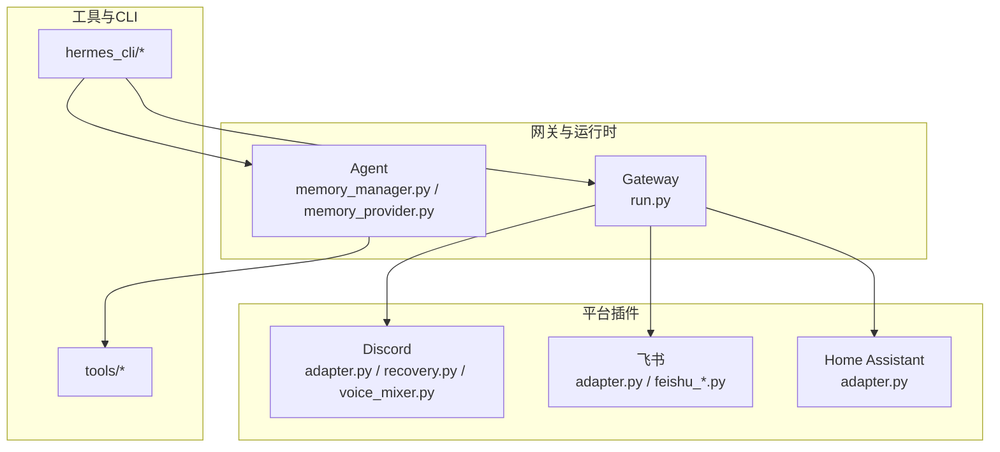
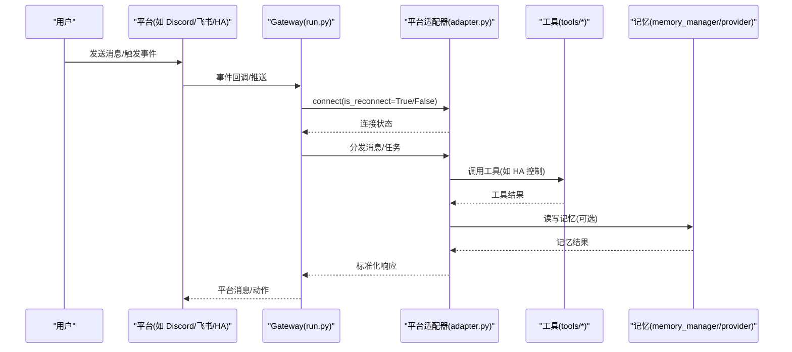
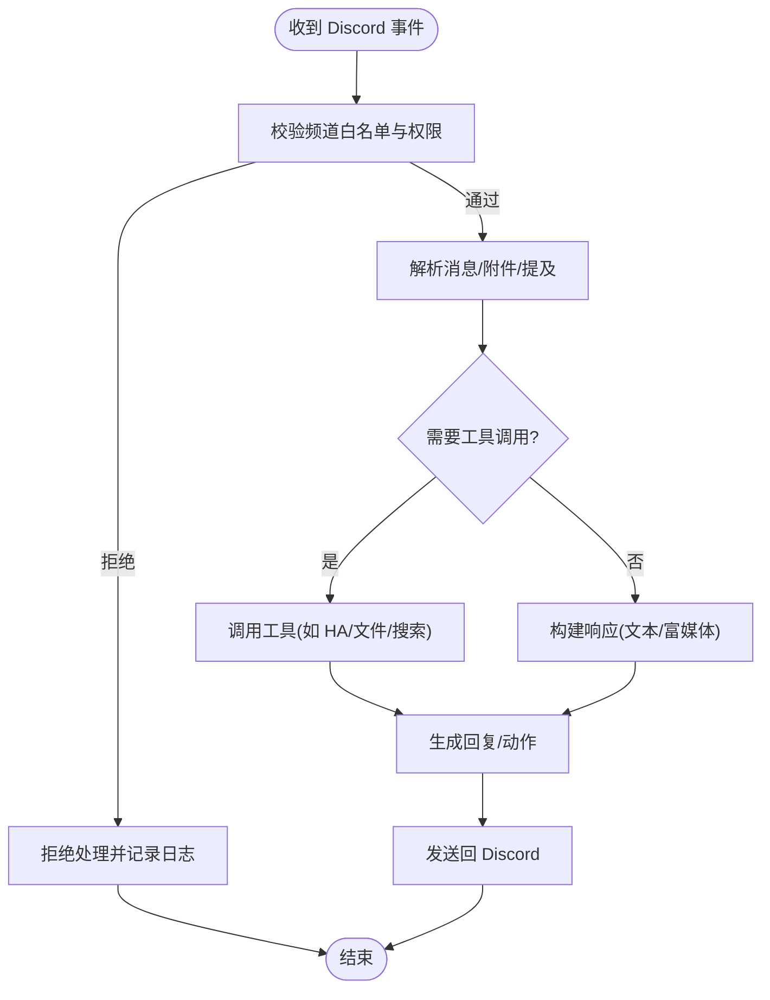
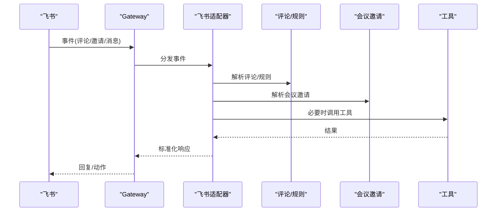
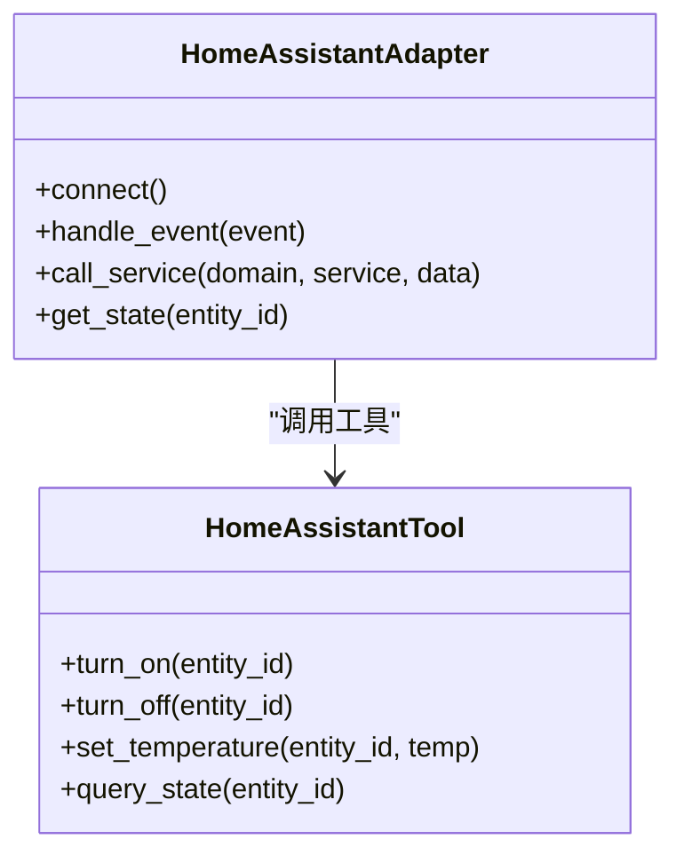
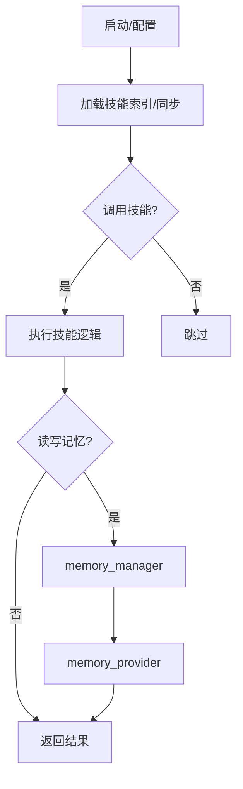
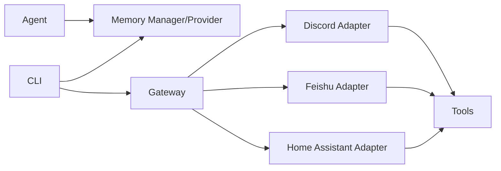

# 集成工具

<cite>
**本文引用的文件**
- [plugins/platforms/discord/adapter.py](file://plugins/platforms/discord/adapter.py)
- [plugins/platforms/discord/plugin.yaml](file://plugins/platforms/discord/plugin.yaml)
- [plugins/platforms/discord/recovery.py](file://plugins/platforms/discord/recovery.py)
- [plugins/platforms/discord/voice_mixer.py](file://plugins/platforms/discord/voice_mixer.py)
- [scripts/discord-voice-doctor.py](file://scripts/discord-voice-doctor.py)
- [tests/gateway/test_discord_allowed_channels.py](file://tests/gateway/test_discord_allowed_channels.py)
- [tests/gateway/test_discord_allowed_mentions.py](file://tests/gateway/test_discord_allowed_mentions.py)
- [tests/gateway/test_discord_approval_mentions.py](file://tests/gateway/test_discord_approval_mentions.py)
- [tests/gateway/test_discord_attachment_download.py](file://tests/gateway/test_discord_attachment下载.py)
- [tests/gateway/test_discord_bot_auth_bypass.py](file://tests/gateway/test_discord_bot_auth_bypass.py)
- [tests/gateway/test_discord_bot_filter.py](file://tests/gateway/test_discord_bot_filter.py)
- [tests/gateway/test_discord_channel_controls.py](file://tests/gateway/test_discord_channel_controls.py)
- [tests/gateway/test_discord_channel_prompts.py](file://tests/gateway/test_discord_channel_prompts.py)
- [tests/gateway/test_discord_channel_skills.py](file://tests/gateway/test_discord_channel_skills.py)
- [tests/gateway/test_discord_clarify_buttons.py](file://tests/gateway/test_discord_clarify_buttons.py)
- [tests/gateway/test_discord_component_auth.py](file://tests/gateway/test_discord_component_auth.py)
- [plugins/platforms/feishu/adapter.py](file://plugins/platforms/feishu/adapter.py)
- [plugins/platforms/feishu/feishu_comment.py](file://plugins/platforms/feishu/feishu_comment.py)
- [plugins/platforms/feishu/feishu_comment_rules.py](file://plugins/platforms/feishu/feishu_comment_rules.py)
- [plugins/platforms/feishu/feishu_meeting_invite.py](file://plugins/platforms/feishu/feishu_meeting_invite.py)
- [plugins/platforms/feishu/plugin.yaml](file://plugins/platforms/feishu/plugin.yaml)
- [tests/gateway/test_feishu.py](file://tests/gateway/test_feishu.py)
- [tests/gateway/test_feishu_approval_buttons.py](file://tests/gateway/test_feishu_approval_buttons.py)
- [tests/gateway/test_feishu_bot_admission.py](file://tests/gateway/test_feishu_bot_admission.py)
- [tests/gateway/test_feishu_bot_auth_bypass.py](file://tests/gateway/test_feishu_bot_auth_bypass.py)
- [tests/gateway/test_feishu_channel_prompts.py](file://tests/gateway/test_feishu_channel_prompts.py)
- [tests/gateway/test_feishu_comment.py](file://tests/gateway/test_feishu_comment.py)
- [tests/gateway/test_feishu_comment_rules.py](file://tests/gateway/test_feishu_comment_rules.py)
- [tests/gateway/test_feishu_lazy_import.py](file://tests/gateway/test_feishu_lazy导入.py)
- [tests/gateway/test_feishu_meeting_invite.py](file://tests/gateway/test_feishu_meeting_invite.py)
- [tests/gateway/test_feishu_onboard.py](file://tests/gateway/test_feishu_onboard.py)
- [tests/gateway/test_feishu_sdk_executor.py](file://tests/gateway/test_feishu_sdk执行器.py)
- [tests/gateway/test_feishu_table_markdown.py](file://tests/gateway/test_feishu_table_markdown.py)
- [tests/gateway/test_feishu_voice_message_type.py](file://tests/gateway/test_feishu_voice_message类型.py)
- [plugins/platforms/homeassistant/adapter.py](file://plugins/platforms/homeassistant/adapter.py)
- [plugins/platforms/homeassistant/plugin.yaml](file://plugins/platforms/homeassistant/plugin.yaml)
- [tools/homeassistant_tool.py](file://tools/homeassistant_tool.py)
- [tests/gateway/test_homeassistant.py](file://tests/gateway/test_homeassistant.py)
- [tests/tools/test_homeassistant_tool.py](file://tests/tools/test_homeassistant_tool.py)
- [website/docs/user-guide/messaging/homeassistant.md](file://website/docs/user-guide/messaging/homeassistant.md)
- [website/i18n/zh-Hans/docusaurus-plugin-content-docs/current/user-guide/messaging/homeassistant.md](file://website/i18n/zh-Hans/docusaurus-plugin-content-docs/current/user-guide/messaging/homeassistant.md)
- [agent/memory_manager.py](file://agent/memory_manager.py)
- [agent/memory_provider.py](file://agent/memory_provider.py)
- [hermes_cli/memory_setup.py](file://hermes_cli/memory_setup.py)
- [hermes_cli/memory_oauth.py](file://hermes_cli/memory_oauth.py)
- [gateway/run.py](file://gateway/run.py)
- [tests/gateway/test_adapter_connect_is_reconnect_contract.py](file://tests/gateway/test_adapter_connect_is_reconnect_contract.py)
</cite>

## 目录
1. [简介](#简介)
2. [项目结构](#项目结构)
3. [核心组件](#核心组件)
4. [架构总览](#架构总览)
5. [详细组件分析](#详细组件分析)
6. [依赖关系分析](#依赖关系分析)
7. [性能考虑](#性能考虑)
8. [故障排查指南](#故障排查指南)
9. [结论](#结论)
10. [附录](#附录)

## 简介
本文件面向 Hermes Agent 的“集成工具”主题，系统性说明与外部系统与平台的集成功能，重点覆盖：
- Discord 机器人：消息收发、附件处理、频道白名单、提及控制、澄清按钮、组件鉴权等。
- 飞书文档：评论、会议邀请、表格 Markdown、语音消息类型、SDK 执行器等。
- Home Assistant 智能家居：设备控制、事件监听、状态管理、工具调用。
- 技能管理与记忆系统：技能发现/同步、记忆提供者配置与 OAuth。
同时涵盖认证配置、数据同步、事件监听、状态管理、平台特定 API 调用、消息格式转换、错误处理机制，以及稳定性、连接池与故障恢复的最佳实践。

## 项目结构
Hermes 将平台集成以插件形式组织在 plugins/platforms 下，每个平台包含适配器（adapter）、可选能力模块、插件清单（plugin.yaml）与测试。Gateway 层负责统一接入、重连与调度；CLI 提供记忆与平台初始化能力；Tools 层暴露可被 Agent 调用的工具方法。

**图示来源**
- [gateway/run.py:1-200](file://gateway/run.py#L1-L200)
- [plugins/platforms/discord/adapter.py:1-200](file://plugins/platforms/discord/adapter.py#L1-L200)
- [plugins/platforms/feishu/adapter.py:1-200](file://plugins/platforms/feishu/adapter.py#L1-L200)
- [plugins/platforms/homeassistant/adapter.py:1-200](file://plugins/platforms/homeassistant/adapter.py#L1-L200)
- [agent/memory_manager.py:1-200](file://agent/memory_manager.py#L1-L200)
- [agent/memory_provider.py:1-200](file://agent/memory_provider.py#L1-L200)

**章节来源**
- [gateway/run.py:1-200](file://gateway/run.py#L1-L200)
- [plugins/platforms/discord/plugin.yaml:1-200](file://plugins/platforms/discord/plugin.yaml#L1-L200)
- [plugins/platforms/feishu/plugin.yaml:1-200](file://plugins/platforms/feishu/plugin.yaml#L1-L200)
- [plugins/platforms/homeassistant/plugin.yaml:1-200](file://plugins/platforms/homeassistant/plugin.yaml#L1-L200)

## 核心组件
- 平台适配器（Adapter）：封装各平台 SDK/API 的连接、鉴权、消息收发、事件订阅与重连逻辑。
- Gateway 运行器：统一调度平台适配器，处理会话路由、消息投递、重试与重连。
- 工具层（Tools）：对外暴露可调用的工具方法（如 Home Assistant 控制、终端命令、文件操作等）。
- 记忆系统：通过 memory_manager 与 memory_provider 抽象记忆存储与检索，CLI 提供配置与 OAuth 流程。
- 技能管理：通过 CLI 与 agent 侧技能加载/同步，配合 skills_hub/skills_sync 完成更新与索引。

**章节来源**
- [agent/memory_manager.py:1-200](file://agent/memory_manager.py#L1-L200)
- [agent/memory_provider.py:1-200](file://agent/memory_provider.py#L1-L200)
- [hermes_cli/memory_setup.py:1-200](file://hermes_cli/memory_setup.py#L1-L200)
- [hermes_cli/memory_oauth.py:1-200](file://hermes_cli/memory_oauth.py#L1-L200)

## 架构总览
下图展示从用户输入到平台适配器的端到端流程，包括 Gateway 的重连契约与平台特定的消息转换。

**图示来源**
- [gateway/run.py:1-200](file://gateway/run.py#L1-L200)
- [plugins/platforms/discord/adapter.py:1-200](file://plugins/platforms/discord/adapter.py#L1-L200)
- [plugins/platforms/feishu/adapter.py:1-200](file://plugins/platforms/feishu/adapter.py#L1-L200)
- [plugins/platforms/homeassistant/adapter.py:1-200](file://plugins/platforms/homeassistant/adapter.py#L1-L200)
- [tools/homeassistant_tool.py:1-200](file://tools/homeassistant_tool.py#L1-L200)
- [agent/memory_manager.py:1-200](file://agent/memory_manager.py#L1-L200)
- [agent/memory_provider.py:1-200](file://agent/memory_provider.py#L1-L200)

## 详细组件分析

### Discord 机器人集成
- 功能要点
  - 频道白名单与权限控制：限制可响应的频道范围。
  - 提及与澄清按钮：支持 @bot 与澄清交互。
  - 附件下载：安全获取并处理附件。
  - 鉴权绕过策略：针对内部或可信来源的处理。
  - 语音混合与恢复：语音流混音与异常恢复。
- 关键文件
  - 适配器与插件清单：[plugins/platforms/discord/adapter.py](file://plugins/platforms/discord/adapter.py), [plugins/platforms/discord/plugin.yaml](file://plugins/platforms/discord/plugin.yaml)
  - 恢复与语音：[plugins/platforms/discord/recovery.py](file://plugins/platforms/discord/recovery.py), [plugins/platforms/discord/voice_mixer.py](file://plugins/platforms/discord/voice_mixer.py)
  - 诊断脚本：[scripts/discord-voice-doctor.py](file://scripts/discord-voice-doctor.py)
  - 行为测试：allowed channels/mentions/approval mentions/attachment download/bot auth bypass/filter/channel controls/prompts/skills/clarify buttons/component auth 等测试用例。

**图示来源**
- [plugins/platforms/discord/adapter.py:1-200](file://plugins/platforms/discord/adapter.py#L1-L200)
- [tests/gateway/test_discord_allowed_channels.py:1-200](file://tests/gateway/test_discord_allowed_channels.py#L1-L200)
- [tests/gateway/test_discord_allowed_mentions.py:1-200](file://tests/gateway/test_discord_allowed_mentions.py#L1-L200)
- [tests/gateway/test_discord_approval_mentions.py:1-200](file://tests/gateway/test_discord_approval_mentions.py#L1-L200)
- [tests/gateway/test_discord_attachment_download.py:1-200](file://tests/gateway/test_discord_attachment下载.py#L1-L200)
- [tests/gateway/test_discord_bot_auth_bypass.py:1-200](file://tests/gateway/test_discord_bot_auth_bypass.py#L1-L200)
- [tests/gateway/test_discord_bot_filter.py:1-200](file://tests/gateway/test_discord_bot_filter.py#L1-L200)
- [tests/gateway/test_discord_channel_controls.py:1-200](file://tests/gateway/test_discord_channel_controls.py#L1-L200)
- [tests/gateway/test_discord_channel_prompts.py:1-200](file://tests/gateway/test_discord_channel_prompts.py#L1-L200)
- [tests/gateway/test_discord_channel_skills.py:1-200](file://tests/gateway/test_discord_channel_skills.py#L1-L200)
- [tests/gateway/test_discord_clarify_buttons.py:1-200](file://tests/gateway/test_discord_clarify_buttons.py#L1-L200)
- [tests/gateway/test_discord_component_auth.py:1-200](file://tests/gateway/test_discord_component_auth.py#L1-L200)

**章节来源**
- [plugins/platforms/discord/adapter.py:1-200](file://plugins/platforms/discord/adapter.py#L1-L200)
- [plugins/platforms/discord/plugin.yaml:1-200](file://plugins/platforms/discord/plugin.yaml#L1-L200)
- [plugins/platforms/discord/recovery.py:1-200](file://plugins/platforms/discord/recovery.py#L1-L200)
- [plugins/platforms/discord/voice_mixer.py:1-200](file://plugins/platforms/discord/voice_mixer.py#L1-L200)
- [scripts/discord-voice-doctor.py:1-200](file://scripts/discord-voice-doctor.py#L1-L200)
- [tests/gateway/test_discord_allowed_channels.py:1-200](file://tests/gateway/test_discord_allowed_channels.py#L1-L200)
- [tests/gateway/test_discord_allowed_mentions.py:1-200](file://tests/gateway/test_discord_allowed_mentions.py#L1-L200)
- [tests/gateway/test_discord_approval_mentions.py:1-200](file://tests/gateway/test_discord_approval_mentions.py#L1-L200)
- [tests/gateway/test_discord_attachment_download.py:1-200](file://tests/gateway/test_discord_attachment下载.py#L1-L200)
- [tests/gateway/test_discord_bot_auth_bypass.py:1-200](file://tests/gateway/test_discord_bot_auth_bypass.py#L1-L200)
- [tests/gateway/test_discord_bot_filter.py:1-200](file://tests/gateway/test_discord_bot_filter.py#L1-L200)
- [tests/gateway/test_discord_channel_controls.py:1-200](file://tests/gateway/test_discord_channel_controls.py#L1-L200)
- [tests/gateway/test_discord_channel_prompts.py:1-200](file://tests/gateway/test_discord_channel_prompts.py#L1-L200)
- [tests/gateway/test_discord_channel_skills.py:1-200](file://tests/gateway/test Discor d_channel_skills.py#L1-L200)
- [tests/gateway/test_discord_clarify_buttons.py:1-200](file://tests/gateway/test_discord_clarify_buttons.py#L1-L200)
- [tests/gateway/test_discord_component_auth.py:1-200](file://tests/gateway/test_discord_component_auth.py#L1-L200)

### 飞书文档集成
- 功能要点
  - 评论与规则：评论创建、评论规则匹配与处理。
  - 会议邀请：创建/管理会议邀请。
  - 表格 Markdown：表格内容渲染与转换。
  - 语音消息类型：识别与处理语音消息。
  - SDK 执行器：对飞书 SDK 的封装与错误处理。
- 关键文件
  - 适配器与插件清单：[plugins/platforms/feishu/adapter.py](file://plugins/platforms/feishu/adapter.py), [plugins/platforms/feishu/plugin.yaml](file://plugins/platforms/feishu/plugin.yaml)
  - 能力模块：[plugins/platforms/feishu/feishu_comment.py](file://plugins/platforms/feishu/feishu_comment.py), [plugins/platforms/feishu/feishu_comment_rules.py](file://plugins/platforms/feishu/feishu_comment_rules.py), [plugins/platforms/feishu/feishu_meeting_invite.py](file://plugins/platforms/feishu/feishu_meeting_invite.py)
  - 行为测试：评论、规则、会议邀请、Markdown、语音消息类型、懒加载导入、授权绕过、渠道提示等。

**图示来源**
- [plugins/platforms/feishu/adapter.py:1-200](file://plugins/platforms/feishu/adapter.py#L1-L200)
- [plugins/platforms/feishu/feishu_comment.py:1-200](file://plugins/platforms/feishu/feishu_comment.py#L1-L200)
- [plugins/platforms/feishu/feishu_comment_rules.py:1-200](file://plugins/platforms/feishu/feishu_comment_rules.py#L1-L200)
- [plugins/platforms/feishu/feishu_meeting_invite.py:1-200](file://plugins/platforms/feishu/feishu_meeting_invite.py#L1-L200)
- [tests/gateway/test_feishu_comment.py:1-200](file://tests/gateway/test_feishu_comment.py#L1-L200)
- [tests/gateway/test_feishu_comment_rules.py:1-200](file://tests/gateway/test_feishu_comment_rules.py#L1-L200)
- [tests/gateway/test_feishu_meeting_invite.py:1-200](file://tests/gateway/test_feishu_meeting_invite.py#L1-L200)
- [tests/gateway/test_feishu_table_markdown.py:1-200](file://tests/gateway/test_feishu_table_markdown.py#L1-L200)
- [tests/gateway/test_feishu_voice_message_type.py:1-200](file://tests/gateway/test_feishu_voice_message类型.py#L1-L200)
- [tests/gateway/test_feishu_sdk_executor.py:1-200](file://tests/gateway/test_feishu_sdk执行器.py#L1-L200)

**章节来源**
- [plugins/platforms/feishu/adapter.py:1-200](file://plugins/platforms/feishu/adapter.py#L1-L200)
- [plugins/platforms/feishu/plugin.yaml:1-200](file://plugins/platforms/feishu/plugin.yaml#L1-L200)
- [plugins/platforms/feishu/feishu_comment.py:1-200](file://plugins/platforms/feishu/feishu_comment.py#L1-L200)
- [plugins/platforms/feishu/feishu_comment_rules.py:1-200](file://plugins/platforms/feishu/feishu_comment_rules.py#L1-L200)
- [plugins/platforms/feishu/feishu_meeting_invite.py:1-200](file://plugins/platforms/feishu/feishu_meeting_invite.py#L1-L200)
- [tests/gateway/test_feishu.py:1-200](file://tests/gateway/test_feishu.py#L1-L200)
- [tests/gateway/test_feishu_approval_buttons.py:1-200](file://tests/gateway/test_feishu_approval_buttons.py#L1-L200)
- [tests/gateway/test_feishu_bot_admission.py:1-200](file://tests/gateway/test_feishu_bot_admission.py#L1-L200)
- [tests/gateway/test_feishu_bot_auth_bypass.py:1-200](file://tests/gateway/test_feishu_bot_auth_bypass.py#L1-L200)
- [tests/gateway/test_feishu_channel_prompts.py:1-200](file://tests/gateway/test_feishu_channel_prompts.py#L1-L200)
- [tests/gateway/test_feishu_comment.py:1-200](file://tests/gateway/test_feishu_comment.py#L1-L200)
- [tests/gateway/test_feishu_comment_rules.py:1-200](file://tests/gateway/test_feishu_comment_rules.py#L1-L200)
- [tests/gateway/test_feishu_lazy_import.py:1-200](file://tests/gateway/test_feishu_lazy导入.py#L1-L200)
- [tests/gateway/test_feishu_meeting_invite.py:1-200](file://tests/gateway/test_feishu_meeting_invite.py#L1-L200)
- [tests/gateway/test_feishu_onboard.py:1-200](file://tests/gateway/test_feishu_onboard.py#L1-L200)
- [tests/gateway/test_feishu_sdk_executor.py:1-200](file://tests/gateway/test_feishu_sdk执行器.py#L1-L200)
- [tests/gateway/test_feishu_table_markdown.py:1-200](file://tests/gateway/test_feishu_table_markdown.py#L1-L200)
- [tests/gateway/test_feishu_voice_message_type.py:1-200](file://tests/gateway/test_feishu_voice_message类型.py#L1-L200)

### Home Assistant 智能家居集成
- 功能要点
  - 设备控制：通过工具调用 HA 服务，实现开关灯、调节温度等。
  - 事件监听：订阅 HA 事件，驱动自动化工作流。
  - 状态管理：读取实体状态，维护本地缓存或记忆。
- 关键文件
  - 适配器与插件清单：[plugins/platforms/homeassistant/adapter.py](file://plugins/platforms/homeassistant/adapter.py), [plugins/platforms/homeassistant/plugin.yaml](file://plugins/platforms/homeassistant/plugin.yaml)
  - 工具：[tools/homeassistant_tool.py](file://tools/homeassistant_tool.py)
  - 测试与文档：[tests/gateway/test_homeassistant.py](file://tests/gateway/test_homeassistant.py), [tests/tools/test_homeassistant_tool.py](file://tests/tools/test_homeassistant_tool.py), [website/docs/user-guide/messaging/homeassistant.md](file://website/docs/user-guide/messaging/homeassistant.md), [website/i18n/zh-Hans/docusaurus-plugin-content-docs/current/user-guide/messaging/homeassistant.md](file://website/i18n/zh-Hans/docusaurus-plugin-content-docs/current/user-guide/messaging/homeassistant.md)

**图示来源**
- [plugins/platforms/homeassistant/adapter.py:1-200](file://plugins/platforms/homeassistant/adapter.py#L1-L200)
- [tools/homeassistant_tool.py:1-200](file://tools/homeassistant_tool.py#L1-L200)

**章节来源**
- [plugins/platforms/homeassistant/adapter.py:1-200](file://plugins/platforms/homeassistant/adapter.py#L1-L200)
- [plugins/platforms/homeassistant/plugin.yaml:1-200](file://plugins/platforms/homeassistant/plugin.yaml#L1-L200)
- [tools/homeassistant_tool.py:1-200](file://tools/homeassistant_tool.py#L1-L200)
- [tests/gateway/test_homeassistant.py:1-200](file://tests/gateway/test_homeassistant.py#L1-L200)
- [tests/tools/test_homeassistant_tool.py:1-200](file://tests/tools/test_homeassistant_tool.py#L1-L200)
- [website/docs/user-guide/messaging/homeassistant.md:1-200](file://website/docs/user-guide/messaging/homeassistant.md#L1-L200)
- [website/i18n/zh-Hans/docusaurus-plugin-content-docs/current/user-guide/messaging/homeassistant.md:1-200](file://website/i18n/zh-Hans/docusaurus-plugin-content-docs/current/user-guide/messaging/homeassistant.md#L1-L200)

### 技能管理与记忆系统
- 技能管理
  - 通过 CLI 与 agent 侧技能加载/同步，结合 skills_hub/skills_sync 完成更新与索引。
- 记忆系统
  - memory_manager 协调记忆生命周期，memory_provider 抽象具体存储后端。
  - CLI 提供记忆配置与 OAuth 流程，便于对接外部记忆服务。

**图示来源**
- [agent/memory_manager.py:1-200](file://agent/memory_manager.py#L1-L200)
- [agent/memory_provider.py:1-200](file://agent/memory_provider.py#L1-L200)
- [hermes_cli/memory_setup.py:1-200](file://hermes_cli/memory_setup.py#L1-L200)
- [hermes_cli/memory_oauth.py:1-200](file://hermes_cli/memory_oauth.py#L1-L200)

**章节来源**
- [agent/memory_manager.py:1-200](file://agent/memory_manager.py#L1-L200)
- [agent/memory_provider.py:1-200](file://agent/memory_provider.py#L1-L200)
- [hermes_cli/memory_setup.py:1-200](file://hermes_cli/memory_setup.py#L1-L200)
- [hermes_cli/memory_oauth.py:1-200](file://hermes_cli/memory_oauth.py#L1-L200)

## 依赖关系分析
- 平台适配器依赖 Gateway 提供的统一接口与重连机制。
- 工具层为平台适配器与 Agent 提供跨平台能力（如 HA 控制、终端执行、文件操作等）。
- 记忆系统通过 CLI 进行配置与 OAuth，供 Agent 在任务中持久化上下文。
- 测试覆盖确保平台行为符合预期（如 Discord 频道白名单、飞书评论规则、HA 工具调用等）。

**图示来源**
- [gateway/run.py:1-200](file://gateway/run.py#L1-L200)
- [plugins/platforms/discord/adapter.py:1-200](file://plugins/platforms/discord/adapter.py#L1-L200)
- [plugins/platforms/feishu/adapter.py:1-200](file://plugins/platforms/feishu/adapter.py#L1-L200)
- [plugins/platforms/homeassistant/adapter.py:1-200](file://plugins/platforms/homeassistant/adapter.py#L1-L200)
- [tools/homeassistant_tool.py:1-200](file://tools/homeassistant_tool.py#L1-L200)
- [agent/memory_manager.py:1-200](file://agent/memory_manager.py#L1-L200)
- [agent/memory_provider.py:1-200](file://agent/memory_provider.py#L1-L200)
- [hermes_cli/memory_setup.py:1-200](file://hermes_cli/memory_setup.py#L1-L200)
- [hermes_cli/memory_oauth.py:1-200](file://hermes_cli/memory_oauth.py#L1-L200)

**章节来源**
- [gateway/run.py:1-200](file://gateway/run.py#L1-L200)
- [tests/gateway/test_adapter_connect_is_reconnect_contract.py:1-200](file://tests/gateway/test_adapter_connect_is_reconnect_contract.py#L1-L200)

## 性能考虑
- 连接池管理
  - 平台适配器应复用 HTTP/WebSocket 连接，避免频繁握手开销。
  - 对长连接（如 Discord 语音、飞书事件流）使用心跳与超时检测。
- 并发与限流
  - 对高频 API 调用实施速率限制与退避策略。
  - 使用异步 I/O 提升吞吐，避免阻塞事件循环。
- 资源清理
  - 在断开或异常时释放临时资源（文件、进程、内存缓冲）。
- 监控与指标
  - 暴露关键指标（连接数、延迟、错误率），便于观测与告警。

[本节为通用指导，不直接分析具体文件]

## 故障排查指南
- 平台重连契约
  - 所有平台适配器的 connect() 必须接受 is_reconnect 关键字参数，否则 Gateway 重连时会失败并导致平台静默断开。
  - 相关测试强制检查该契约，新增平台需遵循此规范。
- 常见错误定位
  - Discord：检查频道白名单、提及过滤、附件下载权限与鉴权绕过策略。
  - 飞书：验证评论规则、会议邀请权限、SDK 执行器错误码与 Markdown 渲染。
  - Home Assistant：确认服务调用参数、实体 ID 有效性与服务可用性。
- 诊断工具
  - Discord 语音问题可使用诊断脚本辅助定位。
  - 通过 Gateway 日志与平台适配器日志追踪事件流转。

**章节来源**
- [tests/gateway/test_adapter_connect_is_reconnect_contract.py:1-200](file://tests/gateway/test_adapter_connect_is_reconnect_contract.py#L1-L200)
- [scripts/discord-voice-doctor.py:1-200](file://scripts/discord-voice-doctor.py#L1-L200)
- [tests/gateway/test_discord_allowed_channels.py:1-200](file://tests/gateway/test_discord_allowed_channels.py#L1-L200)
- [tests/gateway/test_feishu_comment_rules.py:1-200](file://tests/gateway/test_feishu_comment_rules.py#L1-L200)
- [tests/tools/test_homeassistant_tool.py:1-200](file://tests/tools/test_homeassistant_tool.py#L1-L200)

## 结论
Hermes Agent 通过统一的 Gateway 与插件化平台适配器，实现了与 Discord、飞书、Home Assistant 等外部系统的稳定集成。借助工具层与记忆系统，Agent 能够执行跨平台自动化工作流、数据同步与远程控制。遵循重连契约、连接池管理、限流与监控等最佳实践，可显著提升集成稳定性与可维护性。

[本节为总结，不直接分析具体文件]

## 附录
- 认证配置建议
  - 使用环境变量或密钥管理服务注入敏感信息。
  - 对 OAuth 流程启用刷新令牌与自动续期。
- 数据同步策略
  - 增量同步优先，全量同步作为兜底。
  - 冲突解决采用最后写入胜出或合并策略。
- 远程控制的实际应用示例
  - 通过 Discord 指令控制 HA 设备（开灯、调温）。
  - 飞书评论触发自动化任务（创建文档、发送通知）。
  - 记忆系统持久化任务上下文，支持多轮对话与跨会话协作。

[本节为补充信息，不直接分析具体文件]