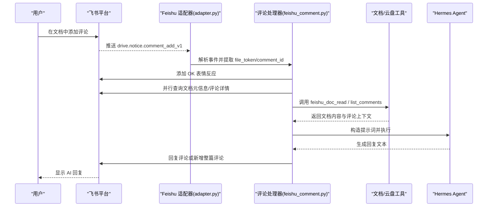
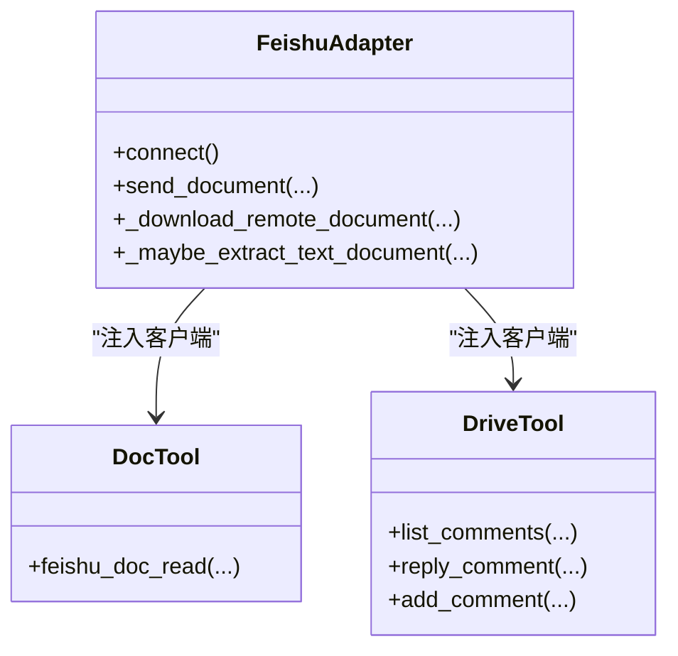
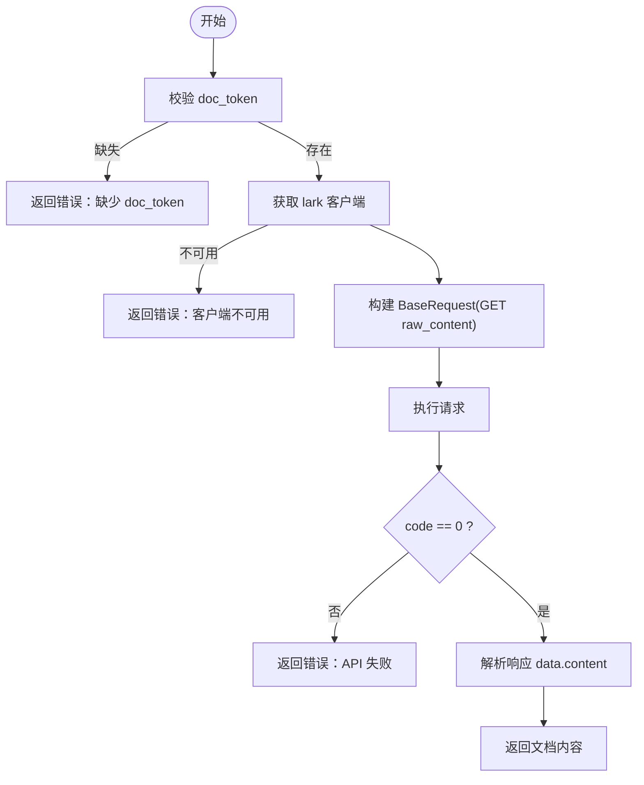
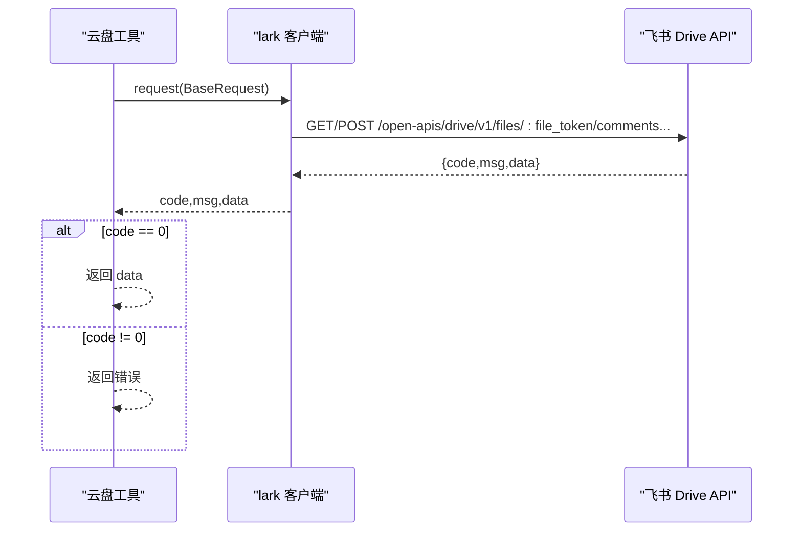
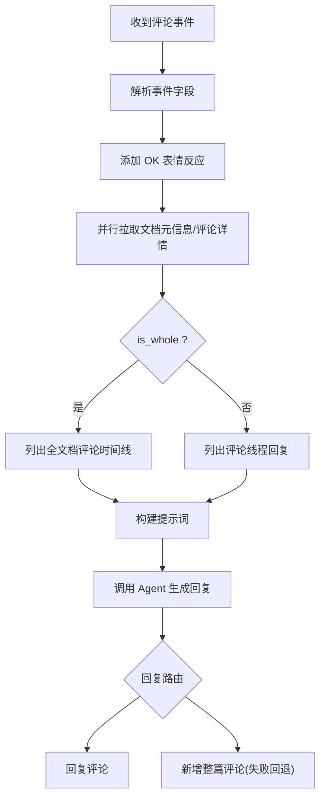
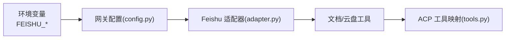

# 飞书集成

<cite>
**本文引用的文件**
- [adapter.py](file://plugins/platforms/feishu/adapter.py)
- [plugin.yaml](file://plugins/platforms/feishu/plugin.yaml)
- [feishu_comment.py](file://plugins/platforms/feishu/feishu_comment.py)
- [feishu_doc_tool.py](file://tools/feishu_doc_tool.py)
- [feishu_drive_tool.py](file://tools/feishu_drive_tool.py)
- [config.py](file://gateway/config.py)
- [tools.py](file://acp_adapter/tools.py)
</cite>

## 目录
1. [简介](#简介)
2. [项目结构](#项目结构)
3. [核心组件](#核心组件)
4. [架构总览](#架构总览)
5. [详细组件分析](#详细组件分析)
6. [依赖关系分析](#依赖关系分析)
7. [性能与限流](#性能与限流)
8. [故障排查指南](#故障排查指南)
9. [结论](#结论)
10. [附录：API 参考与最佳实践](#附录api-参考与最佳实践)

## 简介
本文件面向 Hermes Agent 与飞书（含 Lark）的深度集成，覆盖以下主题：
- 飞书开放平台认证、权限与域名配置
- 文档操作：读取文档内容、评论与回复、评论线程管理
- 云盘文件管理：评论列表、回复列表、新增评论
- 事件驱动协作：基于飞书 Drive 评论事件的自动化工作流
- 元数据、版本与协作：通过评论与回复实现轻量级协作与变更追踪
- 应用场景：自动生成报告、模板管理与团队协作流程
- 可靠性：API 限流、错误重试、数据一致性保障

## 项目结构
Hermes 的飞书集成由“平台适配器 + 工具集 + 事件处理”三部分构成：
- 平台适配器：负责连接飞书（WebSocket/Webhook）、消息收发、媒体缓存、会话隔离等
- 工具集：暴露可被 Agent 调用的能力，如读取文档、列出/回复评论等
- 事件处理：监听飞书 Drive 评论事件，触发 Agent 生成回复并写回飞书

```mermaid
graph TB
subgraph "飞书开放平台"
FEISHU["飞书 API<br/>文档/云盘/消息"]
end
subgraph "Hermes Gateway"
ADAPTER["Feishu 平台适配器<br/>adapter.py"]
CONFIG["网关配置<br/>config.py"]
end
subgraph "Agent 工具层"
DOC_TOOL["文档工具<br/>feishu_doc_tool.py"]
DRIVE_TOOL["云盘工具<br/>feishu_drive_tool.py"]
COMMENT_PROC["评论事件处理<br/>feishu_comment.py"]
end
FEISHU <- --> ADAPTER
ADAPTER --> DOC_TOOL
ADAPTER --> DRIVE_TOOL
ADAPTER --> COMMENT_PROC
CONFIG --> ADAPTER
```

图表来源
- [adapter.py:1-120](file://plugins/platforms/feishu/adapter.py#L1-L120)
- [config.py:2262-2280](file://gateway/config.py#L2262-L2280)
- [feishu_doc_tool.py:1-139](file://tools/feishu_doc_tool.py#L1-L139)
- [feishu_drive_tool.py:1-432](file://tools/feishu_drive_tool.py#L1-L432)
- [feishu_comment.py:1-200](file://plugins/platforms/feishu/feishu_comment.py#L1-L200)

章节来源
- [adapter.py:1-120](file://plugins/platforms/feishu/adapter.py#L1-L120)
- [plugin.yaml:1-45](file://plugins/platforms/feishu/plugin.yaml#L1-L45)
- [config.py:2262-2280](file://gateway/config.py#L2262-L2280)

## 核心组件
- 飞书平台适配器（adapter.py）
  - 支持 WebSocket 长连接与 Webhook 两种传输模式
  - 统一消息收发、媒体缓存、会话隔离、@提及门控、卡片交互事件
  - 注入 lark_oapi 客户端到工具层，供文档与云盘工具调用
- 文档工具（feishu_doc_tool.py）
  - feishu_doc_read：读取文档原始内容（docx 文本）
- 云盘工具（feishu_drive_tool.py）
  - feishu_drive_list_comments：列出文档评论
  - feishu_drive_list_comment_replies：列出评论回复
  - feishu_drive_reply_comment：回复本地评论
  - feishu_drive_add_comment：新增整篇评论
- 评论事件处理（feishu_comment.py）
  - 解析 drive.notice.comment_add_v1 事件
  - 自动添加表情反应，并行拉取文档元信息与评论内容
  - 根据 is_whole 分支构建提示词，调用 Agent 生成回复并写回飞书

章节来源
- [adapter.py:1-120](file://plugins/platforms/feishu/adapter.py#L1-L120)
- [feishu_doc_tool.py:1-139](file://tools/feishu_doc_tool.py#L1-L139)
- [feishu_drive_tool.py:1-432](file://tools/feishu_drive_tool.py#L1-L432)
- [feishu_comment.py:1-200](file://plugins/platforms/feishu/feishu_comment.py#L1-L200)

## 架构总览
下图展示从用户评论到 Agent 生成回复并写回的完整时序。



图表来源
- [feishu_comment.py:1-200](file://plugins/platforms/feishu/feishu_comment.py#L1-L200)
- [feishu_doc_tool.py:69-122](file://tools/feishu_doc_tool.py#L69-L122)
- [feishu_drive_tool.py:133-166](file://tools/feishu_drive_tool.py#L133-L166)
- [feishu_drive_tool.py:280-314](file://tools/feishu_drive_tool.py#L280-L314)
- [feishu_drive_tool.py:351-378](file://tools/feishu_drive_tool.py#L351-L378)

## 详细组件分析

### 飞书平台适配器（adapter.py）
- 身份模型与权限
  - open_id（应用内稳定）、user_id（租户内稳定）、union_id（开发者跨应用稳定）
  - 单机器人模式下 open_id 作为唯一标识；会话隔离优先 union_id
- 连接与传输
  - 支持 WebSocket 与 Webhook；Webhook 具备速率限制与异常跟踪
- 消息与媒体
  - 支持图片、音视频、文档等多媒体类型；内置缓存与批量发送策略
- 与工具层的集成
  - 通过线程局部存储将 lark_oapi 客户端注入到文档/云盘工具中，确保工具可在同步线程安全调用



图表来源
- [adapter.py:2258-2290](file://plugins/platforms/feishu/adapter.py#L2258-L2290)
- [adapter.py:3495-3540](file://plugins/platforms/feishu/adapter.py#L3495-L3540)
- [adapter.py:3943-3990](file://plugins/platforms/feishu/adapter.py#L3943-L3990)
- [feishu_doc_tool.py:19-27](file://tools/feishu_doc_tool.py#L19-L27)
- [feishu_drive_tool.py:20-27](file://tools/feishu_drive_tool.py#L20-L27)

章节来源
- [adapter.py:18-46](file://plugins/platforms/feishu/adapter.py#L18-L46)
- [adapter.py:216-245](file://plugins/platforms/feishu/adapter.py#L216-L245)
- [adapter.py:2258-2290](file://plugins/platforms/feishu/adapter.py#L2258-L2290)

### 文档工具（feishu_doc_tool.py）
- 功能：读取文档原始内容（docx 文本），用于为 Agent 提供上下文
- 关键路径：
  - 参数校验：doc_token 必填
  - 客户端获取：从线程局部存储取得 lark 客户端
  - 请求构建：使用 BaseRequest 发起 GET /open-apis/docx/v1/documents/:document_id/raw_content
  - 响应解析：优先 raw.content 中的 data.content，其次 response.data
- 错误处理：code != 0 时返回结构化错误



图表来源
- [feishu_doc_tool.py:69-122](file://tools/feishu_doc_tool.py#L69-L122)

章节来源
- [feishu_doc_tool.py:1-139](file://tools/feishu_doc_tool.py#L1-L139)

### 云盘工具（feishu_drive_tool.py）
- 功能：
  - 列出文档评论（支持分页、全文档评论过滤）
  - 列出评论回复（支持分页）
  - 回复本地评论（纯文本）
  - 新增整篇评论（纯文本）
- 关键路径：
  - 统一 _do_request 封装 BaseRequest 构建与响应解析
  - 参数校验与分页控制
  - 错误处理：code != 0 返回结构化错误



图表来源
- [feishu_drive_tool.py:40-87](file://tools/feishu_drive_tool.py#L40-L87)
- [feishu_drive_tool.py:133-166](file://tools/feishu_drive_tool.py#L133-L166)
- [feishu_drive_tool.py:208-238](file://tools/feishu_drive_tool.py#L208-L238)
- [feishu_drive_tool.py:280-314](file://tools/feishu_drive_tool.py#L280-L314)
- [feishu_drive_tool.py:351-378](file://tools/feishu_drive_tool.py#L351-L378)

章节来源
- [feishu_drive_tool.py:1-432](file://tools/feishu_drive_tool.py#L1-L432)

### 评论事件处理（feishu_comment.py）
- 事件解析：drive.notice.comment_add_v1
- 处理流程：
  - 添加 OK 表情反应
  - 并行查询文档元信息与评论详情
  - 根据 is_whole 分支选择“全文档评论时间线”或“评论线程回复”
  - 构建提示词，调用 Agent 生成回复
  - 路由回复：优先 reply_to_comment，失败时 fallback 到 add_whole_comment
- 错误日志：记录原始响应以便调试



图表来源
- [feishu_comment.py:1-200](file://plugins/platforms/feishu/feishu_comment.py#L1-L200)

章节来源
- [feishu_comment.py:1-200](file://plugins/platforms/feishu/feishu_comment.py#L1-L200)

## 依赖关系分析
- 配置与环境变量
  - FEISHU_APP_ID、FEISHU_APP_SECRET：应用凭证
  - FEISHU_DOMAIN：域名 feishu/lark
  - FEISHU_ENCRYPT_KEY、FEISHU_VERIFICATION_TOKEN：Webhook 安全校验
  - FEISHU_HOME_CHANNEL：默认聊天 ID（用于定时任务/通知）
- ACP 工具映射
  - 将 Hermes 工具名映射到 ACP ToolKind，便于上层系统识别与渲染



图表来源
- [config.py:2262-2280](file://gateway/config.py#L2262-L2280)
- [tools.py:70-81](file://acp_adapter/tools.py#L70-L81)

章节来源
- [config.py:2262-2280](file://gateway/config.py#L2262-L2280)
- [tools.py:70-81](file://acp_adapter/tools.py#L70-L81)

## 性能与限流
- 连接与重试
  - 连接尝试次数、发送重试次数、批处理延迟与大小限制
- Webhook 安全与限流
  - 最大请求体大小、滑动窗口速率限制、异常阈值与 TTL
- 批处理与去重
  - 文本与媒体消息批处理、消息去重缓存、卡片动作去重窗口
- 建议
  - 合理设置批处理大小与延迟，避免频繁小消息导致限流
  - 监控 Webhook 异常计数，及时告警
  - 对大文档内容读取进行分页或分段处理

章节来源
- [adapter.py:216-245](file://plugins/platforms/feishu/adapter.py#L216-L245)

## 故障排查指南
- 常见问题定位
  - 缺少凭证：检查 FEISHU_APP_ID/SECRET 是否配置
  - 客户端不可用：确认 lark_oapi 已安装且线程局部存储已注入
  - API 失败：查看 code/msg 与原始响应，定位权限或参数问题
  - 评论事件未触发：检查 Webhook 配置、验证令牌、加密密钥
- 日志与调试
  - 评论处理器会记录 API 调用与原始响应片段，便于快速定位
  - Webhook 异常计数超过阈值会记录警告日志

章节来源
- [feishu_comment.py:60-96](file://plugins/platforms/feishu/feishu_comment.py#L60-L96)
- [feishu_doc_tool.py:69-122](file://tools/feishu_doc_tool.py#L69-L122)
- [feishu_drive_tool.py:40-87](file://tools/feishu_drive_tool.py#L40-L87)

## 结论
Hermes 的飞书集成以适配器为核心，结合文档与云盘工具以及评论事件处理，实现了从消息到文档协作的闭环。通过统一的 BaseRequest 封装、线程局部客户端注入与完善的错误处理，保证了稳定性与可维护性。配合合理的批处理与限流策略，可在高并发场景下保持良好性能。

## 附录：API 参考与最佳实践

### 认证与权限
- 必需环境变量
  - FEISHU_APP_ID、FEISHU_APP_SECRET
  - FEISHU_DOMAIN（可选，默认 feishu）
  - FEISHU_ENCRYPT_KEY、FEISHU_VERIFICATION_TOKEN（Webhook 模式）
- 权限建议
  - 文档读取：docx 相关权限
  - 评论与回复：drive 评论读写权限
  - 用户身份：contact:user.employee_id:readonly（如需 user_id）

章节来源
- [plugin.yaml:13-45](file://plugins/platforms/feishu/plugin.yaml#L13-L45)
- [config.py:2262-2280](file://gateway/config.py#L2262-L2280)

### 文档操作
- 读取文档内容
  - 工具：feishu_doc_read
  - 接口：GET /open-apis/docx/v1/documents/:document_id/raw_content
  - 参数：doc_token
- 注意事项
  - 仅适用于 docx 格式
  - 大文档建议分段处理或结合评论上下文

章节来源
- [feishu_doc_tool.py:33-122](file://tools/feishu_doc_tool.py#L33-L122)

### 云盘文件管理（评论）
- 列出评论
  - 工具：feishu_drive_list_comments
  - 接口：GET /open-apis/drive/v1/files/:file_token/comments
  - 参数：file_token, file_type, is_whole, page_size, page_token
- 列出评论回复
  - 工具：feishu_drive_list_comment_replies
  - 接口：GET /open-apis/drive/v1/files/:file_token/comments/:comment_id/replies
  - 参数：file_token, comment_id, file_type, page_size, page_token
- 回复评论
  - 工具：feishu_drive_reply_comment
  - 接口：POST /open-apis/drive/v1/files/:file_token/comments/:comment_id/replies
  - 参数：file_token, comment_id, content, file_type
- 新增整篇评论
  - 工具：feishu_drive_add_comment
  - 接口：POST /open-apis/drive/v1/files/:file_token/new_comments
  - 参数：file_token, content, file_type

章节来源
- [feishu_drive_tool.py:93-166](file://tools/feishu_drive_tool.py#L93-L166)
- [feishu_drive_tool.py:172-238](file://tools/feishu_drive_tool.py#L172-L238)
- [feishu_drive_tool.py:245-314](file://tools/feishu_drive_tool.py#L245-L314)
- [feishu_drive_tool.py:320-378](file://tools/feishu_drive_tool.py#L320-L378)

### 事件驱动协作
- 事件：drive.notice.comment_add_v1
- 流程要点
  - 添加表情反应提升用户体验
  - 并行拉取元信息与评论详情，减少等待时间
  - 根据 is_whole 分支选择不同上下文构建方式
  - 回复失败时自动回退到新增整篇评论

章节来源
- [feishu_comment.py:1-200](file://plugins/platforms/feishu/feishu_comment.py#L1-L200)

### 实际应用场景
- 自动生成报告
  - 通过 feishu_doc_read 读取模板文档，填充数据后通过评论或消息反馈结果
- 文档模板管理
  - 使用评论收集需求与反馈，Agent 自动生成修订建议
- 团队协作流程
  - 利用评论线程进行多轮讨论，Agent 汇总意见并输出决策摘要

[本节为概念性说明，不直接分析具体文件]

### API 限流与错误重试
- 限流策略
  - Webhook 滑动窗口速率限制与异常阈值
  - 消息批处理与去重缓存
- 重试机制
  - 连接与发送重试次数
  - 评论回复失败时的回退策略
- 数据一致性
  - 通过事件去重与状态标记保证幂等性
  - 错误日志与原始响应保留便于审计

章节来源
- [adapter.py:216-245](file://plugins/platforms/feishu/adapter.py#L216-L245)
- [feishu_comment.py:60-96](file://plugins/platforms/feishu/feishu_comment.py#L60-L96)