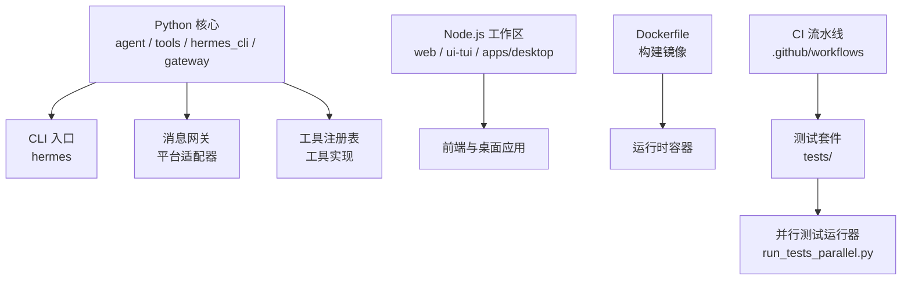
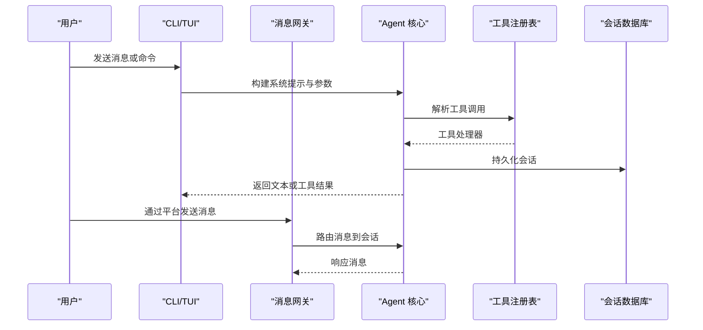
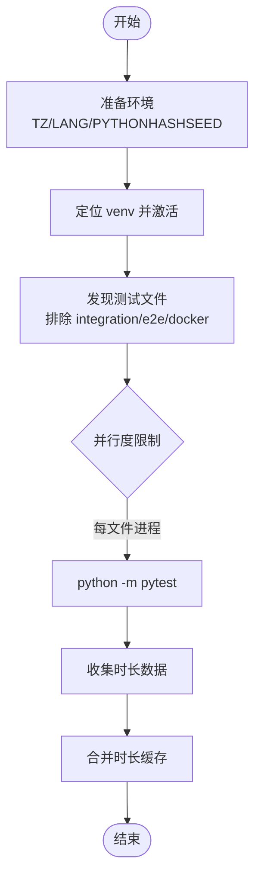
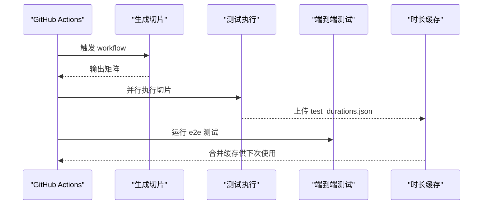
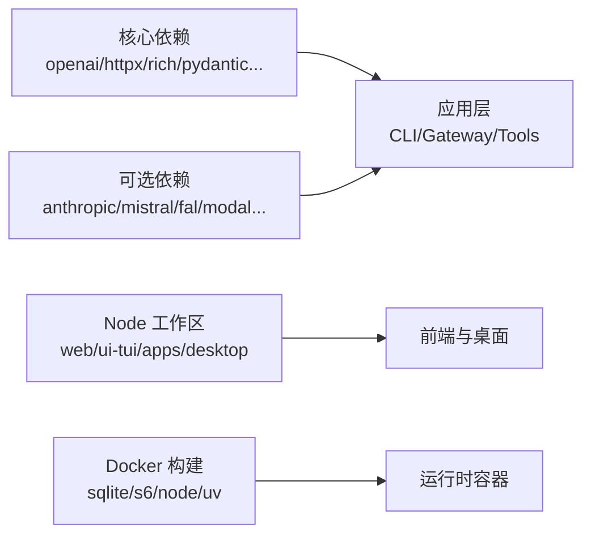

# 开发者指南

<cite>
**本文引用的文件**
- [README.md](file://README.md)
- [CONTRIBUTING.md](file://CONTRIBUTING.md)
- [AGENTS.md](file://AGENTS.md)
- [pyproject.toml](file://pyproject.toml)
- [package.json](file://package.json)
- [Dockerfile](file://Dockerfile)
- [scripts/run_tests.sh](file://scripts/run_tests.sh)
- [scripts/run_tests_parallel.py](file://scripts/run_tests_parallel.py)
- [.github/workflows/tests.yml](file://.github/workflows/tests.yml)
- [tests/conftest.py](file://tests/conftest.py)
</cite>

## 目录
1. [简介](#简介)
2. [项目结构](#项目结构)
3. [核心组件](#核心组件)
4. [架构总览](#架构总览)
5. [详细组件分析](#详细组件分析)
6. [依赖分析](#依赖分析)
7. [性能考虑](#性能考虑)
8. [故障排查指南](#故障排查指南)
9. [结论](#结论)
10. [附录](#附录)

## 简介
本指南面向希望参与 Hermes Agent 开发的贡献者，覆盖开发环境搭建、代码风格与提交规范、测试策略（单元/集成/端到端）、代码审查与持续集成、文档编写与版本发布流程、以及扩展点与核心类的开发方法。目标是让新贡献者在最短时间内完成本地可运行的开发环境，并遵循一致的协作与质量保障流程。

## 项目结构
Hermes Agent 采用多语言、多工作区的工程组织方式：
- Python 核心与 CLI、网关、工具集、技能等位于仓库根目录及若干子包中
- Node.js 前端与桌面应用通过 npm workspaces 管理
- Docker 构建产物用于容器化部署
- 测试套件按模块划分在 tests/ 下，并通过专用脚本与 CI 流水线执行

**图表来源**
- [Dockerfile:169-286](file://Dockerfile#L169-L286)
- [package.json:6-27](file://package.json#L6-L27)
- [pyproject.toml:358-399](file://pyproject.toml#L358-L399)

**章节来源**
- [README.md:105-184](file://README.md#L105-L184)
- [CONTRIBUTING.md:215-298](file://CONTRIBUTING.md#L215-L298)
- [package.json:6-27](file://package.json#L6-L27)
- [pyproject.toml:358-399](file://pyproject.toml#L358-L399)

## 核心组件
- 命令行界面（CLI）：提供交互式 TUI、配置管理、模型选择、工具启用、会话管理等能力
- 消息网关：统一接入 Telegram、Discord、Slack、WhatsApp、Signal 等平台，负责路由、会话状态与调度
- 工具系统：自注册工具注册表，支持工具分组与按需启用；包含终端、文件、网络、视觉、代理等工具
- 技能系统：以 SKILL.md 描述的能力集合，配合脚本与工具调用形成可复用的任务流程
- 状态与持久化：SQLite 存储会话、FTS5 全文检索、会话标题与上下文压缩
- 插件体系：通过 ABC 与生命周期钩子扩展能力，避免核心膨胀

**章节来源**
- [CONTRIBUTING.md:215-298](file://CONTRIBUTING.md#L215-L298)
- [AGENTS.md:16-27](file://AGENTS.md#L16-L27)
- [pyproject.toml:358-399](file://pyproject.toml#L358-L399)

## 架构总览
下图展示了从用户输入到工具执行、再到结果返回的核心流程，以及 CLI 与网关的交互关系。

**图表来源**
- [CONTRIBUTING.md:300-327](file://CONTRIBUTING.md#L300-L327)
- [pyproject.toml:358-399](file://pyproject.toml#L358-L399)

## 详细组件分析

### 开发环境搭建
- 前置要求
  - Git（含 git-lfs）
  - Python 3.11–3.13（uv 会自动安装缺失版本）
  - uv（快速 Python 包管理器）
  - Node.js 20+（可选，浏览器工具与 WhatsApp 桥需要）
- 推荐安装路径
  - 使用标准安装器克隆仓库到 $HERMES_HOME/hermes-agent，并在该 checkout 内工作
  - 安装开发依赖：uv pip install -e ".[all,dev]"
  - 可选：npm install 安装浏览器工具与文档站点依赖
- 手动克隆备选
  - 将 venv 创建在源码树之外，避免相对路径命令误删运行环境
  - 激活 venv 后安装依赖，确保 hermes 入口来自当前 venv
- 开发配置
  - 初始化 ~/.hermes/{cron,sessions,logs,memories,skills}
  - 复制示例配置 cli-config.yaml.example → ~/.hermes/config.yaml
  - 在 ~/.hermes/.env 中至少配置一个 LLM 提供商密钥
- 运行与诊断
  - hermes doctor 检查环境
  - hermes chat -q "Hello" 快速验证

**章节来源**
- [CONTRIBUTING.md:105-213](file://CONTRIBUTING.md#L105-L213)
- [README.md:105-184](file://README.md#L105-L184)

### 代码风格规范
- 遵循 PEP 8，不强制严格行宽
- 注释仅解释非显而易见的意图、权衡或 API 特性
- 错误处理：捕获具体异常，使用 logger.warning()/logger.error()，意外错误附带 exc_info=True
- 跨平台：避免假设 Unix；必要时使用 psutil、shutil.which、pathlib 等跨平台方案
- Windows 安全模式：避免 os.kill(pid, 0)、termios/fcntl 直接调用、硬编码 POSIX 路径与信号

**章节来源**
- [CONTRIBUTING.md:330-336](file://CONTRIBUTING.md#L330-L336)
- [CONTRIBUTING.md:676-800](file://CONTRIBUTING.md#L676-L800)

### 提交约定与 Pull Request 流程
- 先搜索现有 issue 与 PR，避免重复工作
- 优先贡献：bug 修复 > 跨平台兼容 > 安全加固 > 性能与健壮性 > 新技能 > 新工具 > 文档
- 新增能力决策：优先扩展现有代码 → CLI + 技能 → 服务门控工具 → 插件 → MCP 服务器 → 核心工具（最后手段）
- 提交前自检
  - 运行 scripts/run_tests.sh 保证与 CI 一致
  - 使用 scripts/check-windows-footguns.py 检测 Windows 不安全模式
- PR 模板与自动化检查会在评审阶段触发，建议提前自查

**章节来源**
- [CONTRIBUTING.md:7-35](file://CONTRIBUTING.md#L7-L35)
- [CONTRIBUTING.md:18-17](file://CONTRIBUTING.md#L18-L17)
- [CONTRIBUTING.md:339-401](file://CONTRIBUTING.md#L339-L401)

### 测试策略
- 测试框架与运行器
  - pytest 作为测试框架
  - 自定义并行运行器 scripts/run_tests_parallel.py，按文件隔离执行，避免 xdist 的状态泄漏问题
  - scripts/run_tests.sh 封装环境变量、venv 探测、预编译字节码缓存、并行执行
- 测试分类
  - 单元测试：tests/ 下的各模块测试
  - 集成测试：tests/integration/（默认跳过，需显式运行）
  - 端到端测试：tests/e2e/（独立 CI job）
  - Docker 测试：tests/docker/（独立 CI job）
- 环境与隔离
  - 每个测试文件在独立进程中运行，避免模块级状态泄漏
  - 清理凭据环境变量，隔离 HERMES_HOME 为临时目录，设置 TZ/LANG/PYTHONHASHSEED 保证确定性
  - 禁止中间运行时的 lazy 安装（HERMES_DISABLE_LAZY_INSTALLS=1），确保可重现
- 标记与过滤
  - integration、requires_wal、no_isolate、ssh 等标记控制行为
  - 默认 addopts 排除 integration 测试，避免 CI 超时

**图表来源**
- [scripts/run_tests.sh:152-183](file://scripts/run_tests.sh#L152-L183)
- [scripts/run_tests_parallel.py:54-100](file://scripts/run_tests_parallel.py#L54-L100)
- [tests/conftest.py:1-20](file://tests/conftest.py#L1-L20)

**章节来源**
- [scripts/run_tests.sh:1-184](file://scripts/run_tests.sh#L1-L184)
- [scripts/run_tests_parallel.py:1-200](file://scripts/run_tests_parallel.py#L1-L200)
- [tests/conftest.py:1-200](file://tests/conftest.py#L1-L200)
- [pyproject.toml:410-422](file://pyproject.toml#L410-L422)

### 持续集成配置
- 测试流水线
  - 生成测试切片矩阵，按估计耗时均衡分配
  - 安装依赖时锁定 uv.lock，确保可重现
  - 注入空凭据环境变量，防止真实 API 调用
  - 上传每切片时长数据，合并为缓存供后续运行优化
- E2E 流水线
  - 单独 job 运行 tests/e2e/，同样锁定依赖与环境
- 其他流水线
  - JS 测试、lint、Docker 构建与扫描、安装器测试、供应链接审计等

**图表来源**
- [.github/workflows/tests.yml:20-148](file://.github/workflows/tests.yml#L20-L148)
- [.github/workflows/tests.yml:183-252](file://.github/workflows/tests.yml#L183-L252)

**章节来源**
- [.github/workflows/tests.yml:1-252](file://.github/workflows/tests.yml#L1-L252)

### 代码审查指南
- 关注点
  - 是否破坏会话提示缓存与消息角色交替
  - 是否引入不必要的新核心工具或环境变量
  - 是否保持最小影响面，优先边缘扩展
  - 是否通过 E2E 验证而非仅单元测试
  - 是否保留贡献者署名与历史
- 拒绝情形
  - 推测性基础设施（无明确消费者）
  - 用 .env 存放非机密配置
  - 破坏原有特性的“修复”
  - 第三方产品直接并入核心树（应作为独立插件）

**章节来源**
- [AGENTS.md:29-136](file://AGENTS.md#L29-L136)

### 文档编写规范
- 文档位置与导航
  - 官方文档站点托管于 docs/ 与 website/，README 提供导航链接
- 内容组织
  - 用户指南、开发者指南、参考手册、设计文档分目录管理
  - 技能文档遵循 SKILL.md 格式，包含元数据、前置条件、步骤、验证等
- 国际化
  - locales/ 提供多语言资源，website/i18n/ 提供站点翻译

**章节来源**
- [README.md:163-184](file://README.md#L163-L184)
- [CONTRIBUTING.md:404-564](file://CONTRIBUTING.md#L404-L564)

### 版本发布流程
- 依赖锁定
  - pyproject.toml 精确锁定核心依赖，避免上游漂移
  - uv.lock 与 --locked 同步，确保可重现安装
- 容器发布
  - Dockerfile 分层构建，固定 SQLite、s6-overlay、Node 版本
  - 注入构建时 Git SHA，便于运行时识别版本
  - 使用 s6-overlay 管理服务生命周期，entrypoint 分发命令
- 更新机制
  - 安装器写入 .install_method，CLI 支持 hermes update
  - 容器内禁用懒加载，避免运行时修改只读镜像层

**章节来源**
- [pyproject.toml:1-155](file://pyproject.toml#L1-L155)
- [Dockerfile:1-148](file://Dockerfile#L1-L148)
- [Dockerfile:222-334](file://Dockerfile#L222-L334)
- [Dockerfile:336-458](file://Dockerfile#L336-L458)

### 社区参与指南
- 渠道
  - Discord 社区、Skills Hub、Issues 反馈
- 贡献方向
  - 新平台适配、通道、提供者、桌面/TUI/Dashboard 功能欢迎
  - 插件与技能优先于核心扩展
  - 维护者会评估影响面与长期维护成本

**章节来源**
- [README.md:217-257](file://README.md#L217-L257)
- [AGENTS.md:52-79](file://AGENTS.md#L52-L79)

## 依赖分析
- Python 依赖
  - 核心依赖精确锁定，减少供应链风险
  - 可选依赖通过 extras 管理，按需安装
  - 平台相关依赖使用 markers 限定
- Node.js 依赖
  - workspaces 管理 web、ui-tui、apps/desktop
  - engines 指定 Node/NPM 版本范围
  - overrides 与 allowScripts 控制安全与构建行为
- 容器依赖
  - 固定系统库与工具链版本
  - 预构建前端与 Python 依赖，提升构建稳定性

**图表来源**
- [pyproject.toml:19-155](file://pyproject.toml#L19-L155)
- [pyproject.toml:157-352](file://pyproject.toml#L157-L352)
- [package.json:37-68](file://package.json#L37-L68)
- [Dockerfile:71-167](file://Dockerfile#L71-L167)

**章节来源**
- [pyproject.toml:1-352](file://pyproject.toml#L1-L352)
- [package.json:1-70](file://package.json#L1-L70)
- [Dockerfile:71-167](file://Dockerfile#L71-L167)

## 性能考虑
- 依赖安装
  - 使用 uv sync --locked 与缓存，减少下载与构建时间
  - 分层构建 Docker 镜像，缓存依赖层与前端构建层
- 测试执行
  - 按文件并行执行，避免 xdist 状态泄漏
  - 预编译字节码缓存，减少导入开销
  - 基于历史时长进行切片平衡，避免热点文件集中
- 运行时
  - 会话提示缓存与上下文压缩降低 API 调用成本
  - 工具注册表自发现与按需启用减少负载

**章节来源**
- [scripts/run_tests_parallel.py:1-100](file://scripts/run_tests_parallel.py#L1-L100)
- [scripts/run_tests.sh:160-183](file://scripts/run_tests.sh#L160-L183)
- [CONTRIBUTING.md:300-327](file://CONTRIBUTING.md#L300-L327)

## 故障排查指南
- 常见问题
  - 凭据泄露：测试自动清理凭据环境变量，避免断言污染
  - 日志污染：测试隔离 HERMES_HOME，避免写入生产日志
  - 平台差异：Windows 上避免 POSIX 特定调用，使用跨平台替代
  - 懒安装失败：容器或受限环境中禁用懒安装，提前安装 SDK
- 调试技巧
  - 使用 hermes doctor 诊断环境
  - 运行单文件测试定位问题
  - 查看 CI 工件中的时长数据与日志

**章节来源**
- [tests/conftest.py:1-200](file://tests/conftest.py#L1-L200)
- [CONTRIBUTING.md:676-800](file://CONTRIBUTING.md#L676-L800)
- [README.md:105-184](file://README.md#L105-L184)

## 结论
Hermes Agent 提供了完善的开发环境、清晰的架构与严格的测试与 CI 流程。贡献者应优先通过边缘扩展（CLI、技能、插件）实现新功能，保持核心精简；遵循代码风格与跨平台规范；利用并行测试与切片平衡提升效率；借助容器化与依赖锁定确保可重现发布。通过社区渠道与文档站点，持续完善用户体验与开发者体验。

## 附录
- 快速入门
  - 安装器一键安装，进入 $HERMES_HOME/hermes-agent 工作区
  - 安装开发依赖并运行测试
- 常用命令
  - hermes model/tools/config/setup/update/doctor
  - scripts/run_tests.sh 与 pytest 选项
- 扩展点
  - 工具注册表、技能 SKILL.md、插件 ABC 与生命周期钩子
- 文档与站点
  - docs/ 与 website/ 组织文档，locales/ 提供多语言

**章节来源**
- [README.md:105-184](file://README.md#L105-L184)
- [CONTRIBUTING.md:404-564](file://CONTRIBUTING.md#L404-L564)
- [AGENTS.md:16-27](file://AGENTS.md#L16-L27)