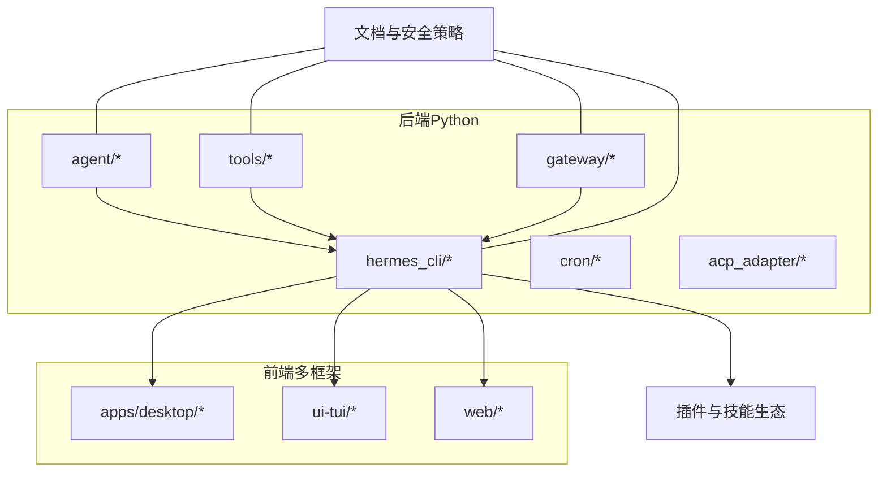
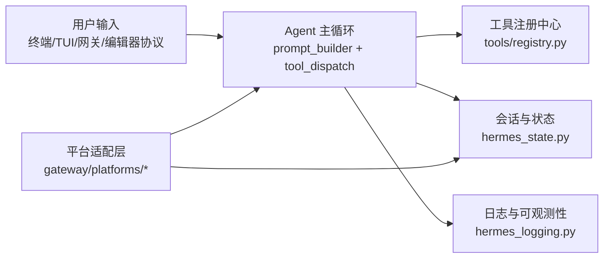
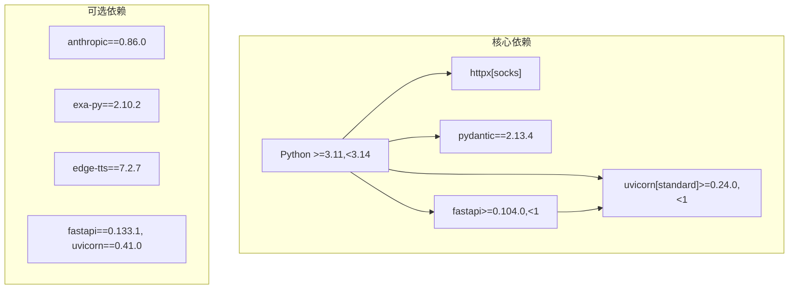

# 代码规范和质量

<cite>
**本文引用的文件**
- [pyproject.toml](file://pyproject.toml)
- [CONTRIBUTING.md](file://CONTRIBUTING.md)
- [README.md](file://README.md)
- [SECURITY.md](file://SECURITY.md)
- [eslint.config.mjs（桌面应用）](file://apps/desktop/eslint.config.mjs)
- [eslint.config.mjs（TUI UI）](file://ui-tui/eslint.config.mjs)
- [eslint.config.js（Web 应用）](file://web/eslint.config.js)
</cite>

## 目录
1. [引言](#引言)
2. [项目结构与范围](#项目结构与范围)
3. [核心规范与质量标准](#核心规范与质量标准)
4. [架构总览与质量边界](#架构总览与质量边界)
5. [组件级规范与最佳实践](#组件级规范与最佳实践)
6. [依赖关系与耦合分析](#依赖关系与耦合分析)
7. [性能与可维护性考量](#性能与可维护性考量)
8. [故障排查与错误处理](#故障排查与错误处理)
9. [结论](#结论)
10. [附录：工具链与持续集成](#附录工具链与持续集成)

## 引言
本文件面向 Hermes Agent 的贡献者与维护者，系统化定义代码规范与质量标准，覆盖以下方面：
- 编码风格与注释规范（PEP 8 及其实务例外）
- 错误处理模式与异常策略
- 跨平台兼容性要求与测试策略
- 代码审查标准、测试要求与性能安全最佳实践
- 开发工具配置、静态分析、代码格式化与持续集成要求
- 统一的质量与一致性标准

目标是确保在多语言（Python、TypeScript/JavaScript、Shell）混合工程中，达成一致的可读性、可维护性与安全性。

## 项目结构与范围
Hermes Agent 是一个跨平台的智能体系统，包含：
- Python 核心（agent、tools、gateway、hermes_cli 等）
- 多语言前端（桌面应用、TUI UI、Web 应用）
- 插件与技能生态
- 安全与隔离策略文档

本规范适用于所有上述子系统，重点聚焦于 Python 后端与前端工具链的统一质量基线。

## 核心规范与质量标准

### 编码风格与注释规范（PEP 8 实务）
- 遵循 PEP 8，但不强制严格行宽；更强调可读性与意图清晰。
- 注释仅用于解释非显而易见的动机、权衡或 API 差异，避免“叙述代码在做什么”的重复注释。
- 关键路径使用明确的变量命名与函数职责划分，减少魔法数字与字符串。

参考来源
- [CONTRIBUTING.md: 代码风格:249-255](file://CONTRIBUTING.md#L249-L255)

### 错误处理模式
- 捕获具体异常类型，避免宽泛的 except。
- 对未预期错误使用日志记录，并开启堆栈追踪以便定位。
- 在工具执行等高风险路径，对异常进行兜底，防止中断主循环。

参考来源
- [CONTRIBUTING.md: 错误处理:253-254](file://CONTRIBUTING.md#L253-L254)

### 跨平台兼容性要求
- 不假设 Unix 环境，优先使用跨平台库（如 psutil）替代平台特定调用。
- 文件路径使用 pathlib；进程管理与信号处理需按平台分支。
- Windows 特定注意：控制台事件广播、PowerShell 替代工具、换行符与引号规则、OneDrive 重定向路径等。

参考来源
- [CONTRIBUTING.md: 跨平台兼容性:589-774](file://CONTRIBUTING.md#L589-L774)

### 安全最佳实践
- 终端命令拼接必须使用安全转义；危险命令检测与用户审批流程不可绕过。
- 凭据不得写入日志；环境变量传递遵循最小暴露原则。
- 外部表面（网关、HTTP、编辑器协议）必须配置访问白名单与本地绑定策略。
- 第三方插件与技能需经操作者审阅，项目侧提供扫描与审计工具。

参考来源
- [SECURITY.md: 安全策略与信任模型:1-332](file://SECURITY.md#L1-L332)
- [CONTRIBUTING.md: 安全注意事项:777-800](file://CONTRIBUTING.md#L777-L800)

### 测试要求
- 单元测试与集成测试分离；CI 使用隔离环境与并行执行。
- 对跨平台特性使用标记跳过或平台分支；对 POSIX 专用功能进行条件测试。
- 测试应避免外部网络调用，使用 mock 与临时目录保证可重复性。

参考来源
- [pyproject.toml: pytest 配置与标记:291-302](file://pyproject.toml#L291-L302)
- [CONTRIBUTING.md: 测试运行与 CI 对齐:121-130](file://CONTRIBUTING.md#L121-L130)

### 性能与鲁棒性
- 重试与退避策略；在工具与外部服务交互中设置超时与取消机制。
- 上下文压缩与令牌预算控制，避免接近上下文上限导致失败。
- 并发与批处理场景下，确保资源释放与错误传播。

参考来源
- [agent/context_compressor.py](file://agent/context_compressor.py)
- [agent/iteration_budget.py](file://agent/iteration_budget.py)
- [agent/retry_utils.py](file://agent/retry_utils.py)

### 代码审查标准
- 新增工具必须自注册到中心注册表，并纳入工具集清单。
- 技能文档需满足描述长度、工具引用规范、平台限制与测试要求。
- 跨平台变更需通过 Windows 安装器脚本与 POSIX 脚本同步校验。

参考来源
- [CONTRIBUTING.md: 添加新工具与技能:258-476](file://CONTRIBUTING.md#L258-L476)

## 架构总览与质量边界

质量边界与信任模型
- 操作系统级隔离是唯一受保护边界；内部启发式（审批门、输出脱敏、技能扫描）仅作事故预防。
- 外部表面（HTTP、消息网关、编辑器协议）必须配置访问白名单与本地绑定策略。

参考来源
- [SECURITY.md: 信任模型与外部表面:32-220](file://SECURITY.md#L32-L220)

## 组件级规范与最佳实践

### Python 后端（agent、tools、gateway、hermes_cli）
- 自注册工具：每个工具文件在导入时完成注册，model_tools 通过发现加载。
- 会话持久化：SQLite + 全文检索；默认不启用 JSON 快照，除非明确需要。
- 提供商抽象：OpenAI 兼容 API，支持路由与额外请求体注入。

参考来源
- [CONTRIBUTING.md: 架构概览与设计模式:219-246](file://CONTRIBUTING.md#L219-L246)
- [agent/prompt_builder.py](file://agent/prompt_builder.py)
- [tools/registry.py](file://tools/registry.py)

### 前端工具链（ESLint 配置）
- ESLint 配置集中于各应用根目录，确保跨团队一致的静态检查与格式化。
- 桌面应用、TUI UI、Web 应用分别维护独立配置，避免相互干扰。

参考来源
- [apps/desktop/eslint.config.mjs](file://apps/desktop/eslint.config.mjs)
- [ui-tui/eslint.config.mjs](file://ui-tui/eslint.config.mjs)
- [web/eslint.config.js](file://web/eslint.config.js)

### 跨平台安装与脚本
- 安装器脚本在 Linux/macOS 与 Windows 上保持同步更新，确保生成脚本换行与引号规则符合平台要求。
- Windows 任务计划与 CMD/BAT 执行需区分两层解析器的引号与转义规则。

参考来源
- [CONTRIBUTING.md: 跨平台安装与脚本:734-758](file://CONTRIBUTING.md#L734-L758)

### 安全与凭据管理
- 环境变量与凭据文件权限最小化；对外输出脱敏；第三方插件与技能安装前必须人工审阅。
- 供应链安全：依赖锁定与 CI 供应链防护。

参考来源
- [SECURITY.md: 凭据作用域与供应链:121-135](file://SECURITY.md#L121-L135)
- [pyproject.toml: 依赖与安全版本约束:24-94](file://pyproject.toml#L24-L94)

## 依赖关系与耦合分析

- 依赖锁定与精确版本：避免动态范围引入未知变更，降低供应链风险。
- 可选依赖懒加载：通过 extras 与延迟安装减少默认安装体积与攻击面。
- 明确的平台标记：如 Windows 专属组件仅在对应平台生效。

参考来源
- [pyproject.toml: 依赖与可选依赖:24-251](file://pyproject.toml#L24-L251)

## 性能与可维护性考量
- 静态分析与格式化：Ruff 仅启用关键规则（如编码显式化），确保 Windows 平台文本文件安全。
- 测试并行与隔离：pytest 子进程隔离 + 超时保护，CI 与本地一致。
- 日志与可观测性：统一日志模块，避免敏感信息泄露。

参考来源
- [pyproject.toml: ruff 规则与忽略范围:311-331](file://pyproject.toml#L311-L331)
- [pyproject.toml: pytest 配置:291-302](file://pyproject.toml#L291-L302)
- [hermes_logging.py](file://hermes_logging.py)

## 故障排查与错误处理
常见问题与建议
- Windows 文本文件编码：.env 可能以 cp1252 或带 BOM 的 UTF-8 保存，需显式指定编码。
- 进程生命周期：使用 psutil 替代 os.kill(pid, 0)；跨平台进程组/会话控制需分支处理。
- Shell 命令与脚本：使用 shutil.which 检查工具可用性；Windows 下 PowerShell 替代方案。
- 外部表面授权：未配置允许列表即暴露网络适配器属于严重缺陷，需立即修复。

参考来源
- [CONTRIBUTING.md: 跨平台兼容性与测试:589-774](file://CONTRIBUTING.md#L589-L774)
- [SECURITY.md: 外部表面与授权:191-220](file://SECURITY.md#L191-L220)

## 结论
通过统一的编码规范、严格的错误处理与跨平台兼容性策略、完善的安全边界与外部表面授权、以及一致的工具链与测试要求，Hermes Agent 能够在多语言混合工程中维持高质量与一致性。建议所有贡献者在提交前对照本规范进行自检，并在代码审查中重点关注安全与跨平台问题。

## 附录：工具链与持续集成

### 开发工具与静态分析
- Python
  - Ruff：启用关键规则，避免隐式编码问题
  - pytest：隔离执行 + 超时保护
- 前端
  - ESLint：各应用独立配置，确保一致的静态检查

参考来源
- [pyproject.toml: ruff 与 pytest 配置:291-331](file://pyproject.toml#L291-L331)
- [eslint.config.mjs（桌面应用）](file://apps/desktop/eslint.config.mjs)
- [eslint.config.mjs（TUI UI）](file://ui-tui/eslint.config.mjs)
- [eslint.config.js（Web 应用）](file://web/eslint.config.js)

### 代码格式化与提交前检查
- Python：建议结合 ruff 与 black（如团队选择）统一格式化
- 前端：ESLint + Prettier（如团队选择）统一格式化
- 跨平台脚本：安装器脚本需在 Linux 与 Windows 上同步验证

参考来源
- [CONTRIBUTING.md: 贡献流程与运行测试:121-130](file://CONTRIBUTING.md#L121-L130)

### 持续集成要求
- CI 环境：隔离、并行、超时保护
- 安全扫描：依赖锁定、供应链防护
- 覆盖率与回归：关键路径与跨平台测试必须通过

参考来源
- [pyproject.toml: pytest 标记与默认参数:291-302](file://pyproject.toml#L291-L302)
- [SECURITY.md: 供应链与部署加固:297-321](file://SECURITY.md#L297-L321)