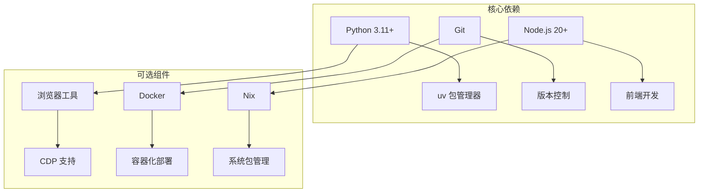
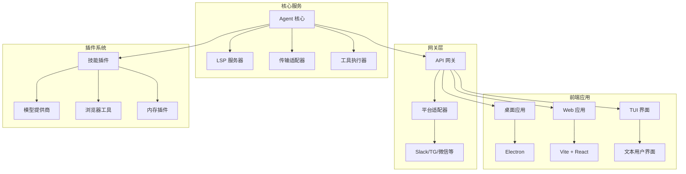
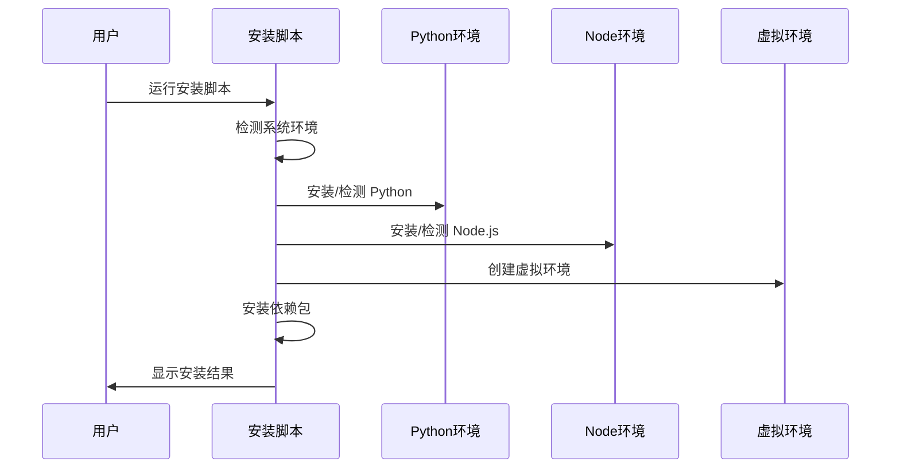
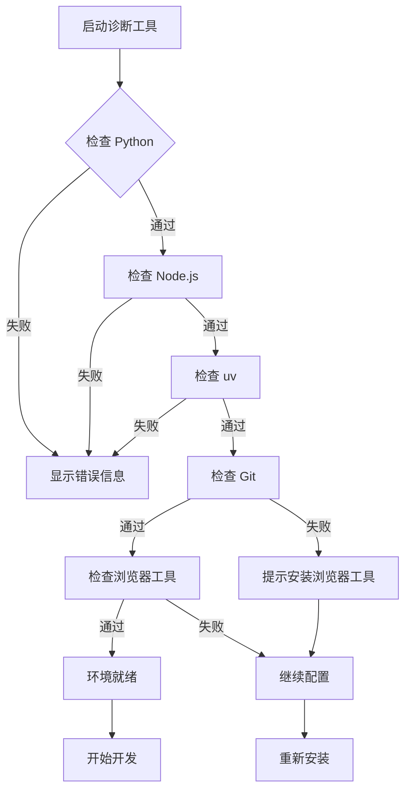
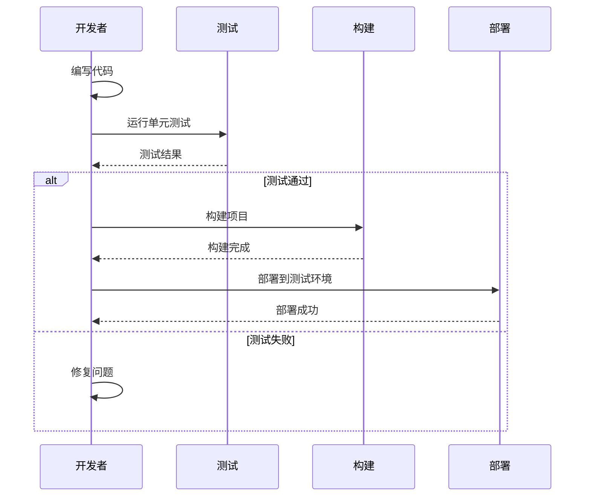
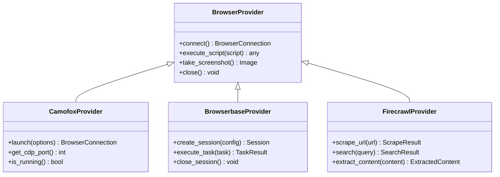
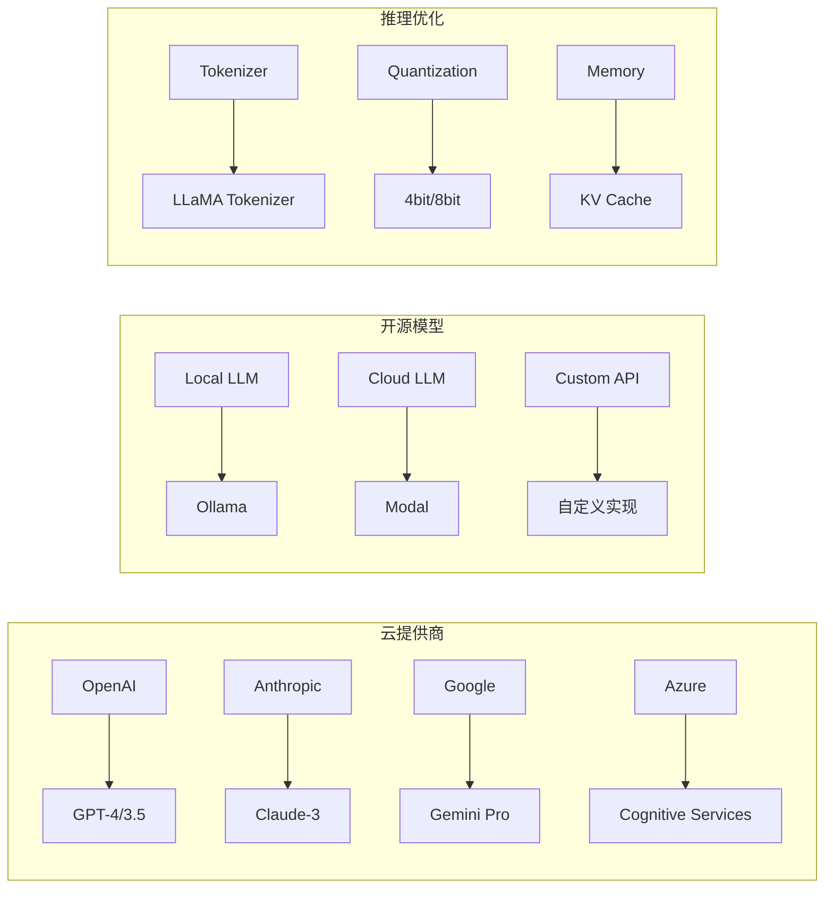
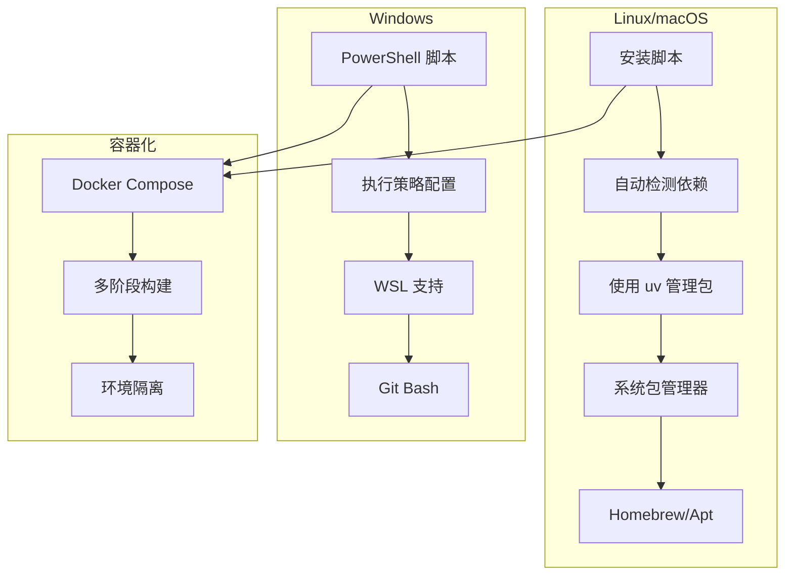
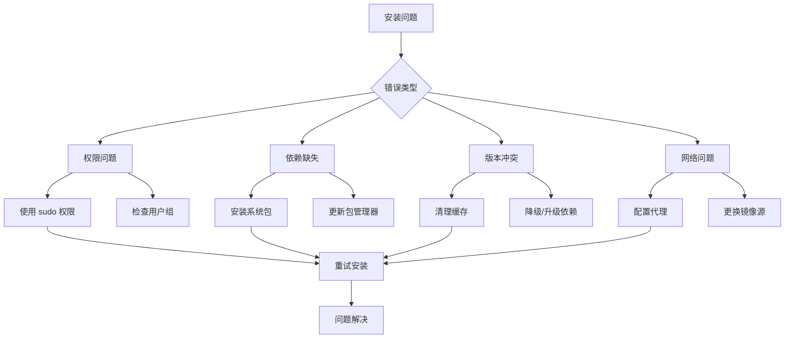

# 开发环境搭建

<cite>
**本文档引用的文件**
- [README.md](file://README.md)
- [setup-hermes.sh](file://setup-hermes.sh)
- [pyproject.toml](file://pyproject.toml)
- [package.json](file://package.json)
- [scripts/install.sh](file://scripts/install.sh)
- [scripts/install.ps1](file://scripts/install.ps1)
- [scripts/install.cmd](file://scripts/install.cmd)
- [scripts/check-windows-footguns.py](file://scripts/check-windows-footguns.py)
- [hermes_cli/setup.py](file://hermes_cli/setup.py)
- [hermes_cli/managed_uv.py](file://hermes_cli/managed_uv.py)
- [hermes_cli/browser_connect.py](file://hermes_cli/browser_connect.py)
- [hermes_cli/gateway_windows.py](file://hermes_cli/gateway_windows.py)
- [hermes_cli/doctor.py](file://hermes_cli/doctor.py)
- [docker-compose.yml](file://docker-compose.yml)
- [docker-compose.windows.yml](file://docker-compose.windows.yml)
- [Dockerfile](file://Dockerfile)
- [nix/devShell.nix](file://nix/devShell.nix)
- [nix/python.nix](file://nix/python.nix)
- [apps/desktop/package.json](file://apps/desktop/package.json)
- [web/package.json](file://web/package.json)
- [ui-tui/package.json](file://ui-tui/package.json)
- [hermes_cli/main.py](file://hermes_cli/main.py)
</cite>

## 目录
1. [简介](#简介)
2. [系统要求](#系统要求)
3. [项目结构概览](#项目结构概览)
4. [安装与配置步骤](#安装与配置步骤)
5. [开发环境验证](#开发环境验证)
6. [常用开发命令](#常用开发命令)
7. [可选组件配置](#可选组件配置)
8. [跨平台兼容性](#跨平台兼容性)
9. [故障排除](#故障排除)
10. [结论](#结论)

## 简介

Hermes Agent 是一个功能强大的智能体平台，支持多模型提供商、多平台集成和丰富的技能生态系统。本指南将帮助您搭建完整的开发环境，包括系统要求、安装步骤、配置设置和故障排除。

## 系统要求

### 基础环境要求

- **操作系统支持**：Linux、macOS、Windows
- **Python版本**：3.11及以上
- **包管理器**：uv（推荐）或 pip
- **Node.js版本**：20及以上（用于前端开发）
- **Git**：用于代码版本控制

### 开发工具链



**图表来源**
- [pyproject.toml](file://pyproject.toml)
- [package.json](file://package.json)
- [nix/devShell.nix](file://nix/devShell.nix)

**章节来源**
- [pyproject.toml](file://pyproject.toml)
- [nix/devShell.nix](file://nix/devShell.nix)

## 项目结构概览

Hermes Agent 采用模块化架构设计，主要包含以下核心组件：



**图表来源**
- [agent/__init__.py](file://agent/__init__.py)
- [gateway/__init__.py](file://gateway/__init__.py)
- [apps/desktop/package.json](file://apps/desktop/package.json)
- [web/package.json](file://web/package.json)

**章节来源**
- [README.md](file://README.md)
- [agent/__init__.py](file://agent/__init__.py)
- [gateway/__init__.py](file://gateway/__init__.py)

## 安装与配置步骤

### 第一步：克隆项目

```bash
git clone https://github.com/hermes-agent/hermes-agent.git
cd hermes-agent
```

### 第二步：环境准备

#### Linux/macOS 环境

1. **安装系统依赖**：
   ```bash
   # Ubuntu/Debian
   sudo apt update
   sudo apt install curl wget gnupg lsb-release
   
   # macOS
   brew install curl wget
   ```

2. **安装 Python 和 uv**：
   ```bash
   # 使用 uv 安装器
   curl -LsSf https://astral.sh/uv/install.sh | sh
   
   # 验证安装
   uv --version
   ```

3. **设置环境变量**：
   ```bash
   export PATH="$HOME/.local/bin:$PATH"
   echo 'export PATH="$HOME/.local/bin:$PATH"' >> ~/.bashrc
   ```

#### Windows 环境

1. **安装 PowerShell 5.1 或更高版本**
2. **启用脚本执行**：
   ```powershell
   Set-ExecutionPolicy -ExecutionPolicy RemoteSigned -Scope CurrentUser
   ```

### 第三步：运行安装脚本

#### 自动安装流程



**图表来源**
- [scripts/install.sh](file://scripts/install.sh)
- [scripts/install.ps1](file://scripts/install.ps1)
- [scripts/install.cmd](file://scripts/install.cmd)

#### 执行安装

```bash
# Linux/macOS
./scripts/install.sh

# Windows
.\scripts\install.ps1
```

### 第四步：配置开发环境

#### Python 环境配置

1. **创建虚拟环境**：
   ```bash
   uv venv .venv
   source .venv/bin/activate  # Linux/macOS
   # 或 .\.venv\Scripts\Activate.ps1  # Windows
   ```

2. **安装开发依赖**：
   ```bash
   uv pip install -e .
   uv pip install -r requirements-dev.txt
   ```

3. **配置 IDE**：
   - VS Code: 安装 Python 扩展
   - PyCharm: 配置解释器指向 `.venv/bin/python`

#### Node.js 环境配置

1. **安装前端依赖**：
   ```bash
   # 根目录
   npm install
   
   # 各子项目
   cd apps/desktop
   npm install
   
   cd ../web
   npm install
   
   cd ../ui-tui
   npm install
   ```

2. **配置 TypeScript**：
   ```json
   {
     "compilerOptions": {
       "target": "ES2020",
       "module": "ESNext",
       "lib": ["DOM", "ES2020"],
       "moduleResolution": "node",
       "allowSyntheticDefaultImports": true,
       "esModuleInterop": true
     }
   }
   ```

**章节来源**
- [scripts/install.sh](file://scripts/install.sh)
- [scripts/install.ps1](file://scripts/install.ps1)
- [scripts/install.cmd](file://scripts/install.cmd)
- [pyproject.toml](file://pyproject.toml)

## 开发环境验证

### 环境检查工具

Hermes Agent 提供了内置的诊断工具来验证开发环境配置：



**图表来源**
- [hermes_cli/doctor.py](file://hermes_cli/doctor.py)
- [hermes_cli/browser_connect.py](file://hermes_cli/browser_connect.py)

### 验证步骤

1. **基本功能测试**：
   ```bash
   # 检查 CLI 是否正常工作
   hermes --help
   
   # 检查 Python 环境
   python -c "import hermes_agent; print('Hermes Agent 导入成功')"
   ```

2. **浏览器工具验证**：
   ```bash
   # 检查浏览器连接
   hermes browser connect
   
   # 验证 CDP 功能
   hermes browser cdp --help
   ```

3. **网关服务测试**：
   ```bash
   # 启动网关服务
   hermes gateway start
   
   # 测试 API 端点
   curl http://localhost:8000/api/status
   ```

**章节来源**
- [hermes_cli/doctor.py](file://hermes_cli/doctor.py)
- [hermes_cli/browser_connect.py](file://hermes_cli/browser_connect.py)
- [hermes_cli/main.py](file://hermes_cli/main.py)

## 常用开发命令

### 项目构建命令

| 命令类别 | 命令示例 | 用途描述 |
|---------|---------|---------|
| **Python 开发** | `python -m pytest tests/` | 运行单元测试 |
| | `python -m flake8 .` | 代码风格检查 |
| | `python -m black .` | 代码格式化 |
| **前端开发** | `npm run dev` | 启动开发服务器 |
| | `npm run build` | 构建生产版本 |
| | `npm run lint` | 代码质量检查 |
| **Docker 开发** | `docker-compose up` | 启动服务容器 |
| | `docker-compose down` | 停止服务容器 |
| **Nix 开发** | `nix develop` | 进入开发环境 |
| | `nix build` | 构建项目 |

### 开发工作流



**图表来源**
- [scripts/run_tests.sh](file://scripts/run_tests.sh)
- [docker-compose.yml](file://docker-compose.yml)

**章节来源**
- [scripts/run_tests.sh](file://scripts/run_tests.sh)
- [docker-compose.yml](file://docker-compose.yml)

## 可选组件配置

### 浏览器工具配置

Hermes Agent 支持多种浏览器工具集成，包括 Camofox、Browserbase 和 Firecrawl：



**图表来源**
- [tools/browser_camofox.py](file://tools/browser_camofox.py)
- [tools/browser_supervisor.py](file://tools/browser_supervisor.py)
- [plugins/browser/browser_use/plugin.yaml](file://plugins/browser/browser_use/plugin.yaml)

### 内存插件配置

支持多种内存存储后端：

| 插件类型 | 名称 | 特性 | 配置示例 |
|---------|------|------|---------|
| **短期记忆** | Byterover | 高速缓存 | Redis/Memory |
| **长期记忆** | Holographic | 分布式存储 | PostgreSQL/MongoDB |
| **增强记忆** | Mem0 | 向量检索 | Pinecone/Chroma |
| **专家记忆** | RetainDB | 企业级 | SQL Server |

### 模型提供商集成



**图表来源**
- [plugins/model-providers/README.md](file://plugins/model-providers/README.md)
- [agent/transports/chat_completions.py](file://agent/transports/chat_completions.py)

**章节来源**
- [tools/browser_camofox.py](file://tools/browser_camofox.py)
- [plugins/browser/browser_use/plugin.yaml](file://plugins/browser/browser_use/plugin.yaml)
- [plugins/model-providers/README.md](file://plugins/model-providers/README.md)

## 跨平台兼容性

### 平台特定配置



**图表来源**
- [scripts/install.sh](file://scripts/install.sh)
- [scripts/install.ps1](file://scripts/install.ps1)
- [docker-compose.yml](file://docker-compose.yml)

### Windows 特殊注意事项

1. **执行策略设置**：
   ```powershell
   # 检查当前策略
   Get-ExecutionPolicy
   
   # 设置为 RemoteSigned
   Set-ExecutionPolicy -ExecutionPolicy RemoteSigned -Scope CurrentUser
   ```

2. **WSL 配置**（可选）：
   ```bash
   # 安装 WSL2
   wsl --install
   
   # 设置默认版本
   wsl --set-default-version 2
   ```

3. **路径处理**：
   - 使用正斜杠 `/` 而不是反斜杠 `\`
   - 避免在路径中使用空格
   - 使用绝对路径进行脚本调用

**章节来源**
- [scripts/install.ps1](file://scripts/install.ps1)
- [scripts/check-windows-footguns.py](file://scripts/check-windows-footguns.py)
- [hermes_cli/gateway_windows.py](file://hermes_cli/gateway_windows.py)

## 故障排除

### 常见安装问题及解决方案



**图表来源**
- [hermes_cli/doctor.py](file://hermes_cli/doctor.py)
- [scripts/install.sh](file://scripts/install.sh)

### 诊断命令

1. **系统环境检查**：
   ```bash
   # 检查 Python 版本
   python --version
   
   # 检查 uv 版本
   uv --version
   
   # 检查 Node.js 版本
   node --version
   
   # 检查 Git 版本
   git --version
   ```

2. **依赖完整性检查**：
   ```bash
   # 检查 Python 依赖
   uv pip list
   
   # 检查 Node.js 依赖
   npm list
   
   # 检查 Docker 服务
   docker info
   ```

3. **网络连通性测试**：
   ```bash
   # 测试外部连接
   curl -I https://api.openai.com
   
   # 测试内部服务
   curl http://localhost:8000
   ```

### 性能优化建议

1. **Python 环境优化**：
   - 使用 uv 进行快速包安装
   - 配置虚拟环境隔离
   - 启用 Python 缓存机制

2. **前端开发优化**：
   - 使用增量编译
   - 配置热重载
   - 启用代码分割

3. **数据库性能**：
   - 配置适当的索引
   - 使用连接池
   - 实施查询优化

**章节来源**
- [hermes_cli/doctor.py](file://hermes_cli/doctor.py)
- [hermes_cli/managed_uv.py](file://hermes_cli/managed_uv.py)

## 结论

Hermes Agent 的开发环境搭建相对简单，主要依赖于现代的包管理和容器化技术。通过遵循本指南的步骤，您应该能够成功搭建一个功能完整的开发环境。

### 关键要点回顾

1. **系统要求**：确保满足 Python 3.11+、Node.js 20+ 和 Git 的最低要求
2. **安装流程**：使用提供的安装脚本自动化大部分配置过程
3. **环境验证**：利用内置的诊断工具确认环境配置正确
4. **跨平台支持**：Linux/macOS 和 Windows 都有相应的配置方案
5. **故障排除**：掌握常见的安装问题和解决方案

### 下一步建议

1. **探索项目结构**：深入了解各个模块的功能和相互关系
2. **尝试示例**：运行官方提供的示例代码和教程
3. **参与社区**：加入开发者社区获取技术支持和最佳实践
4. **贡献代码**：按照项目规范提交代码和文档改进

通过以上步骤，您将能够充分利用 Hermes Agent 平台的强大功能，进行高效的智能体开发和部署。