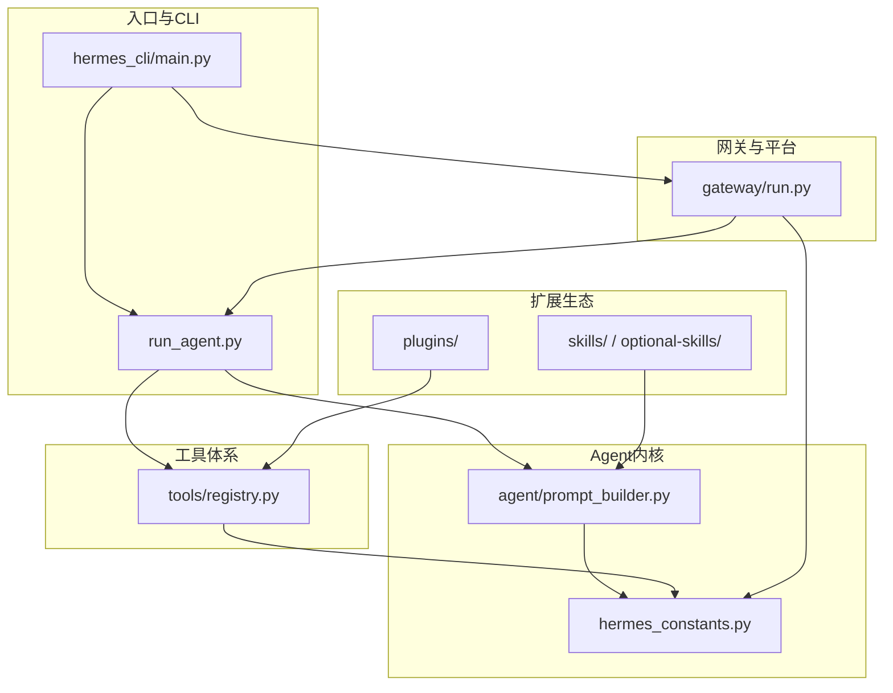
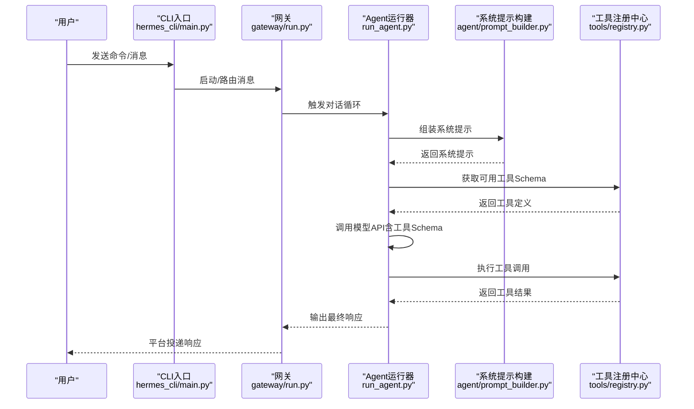
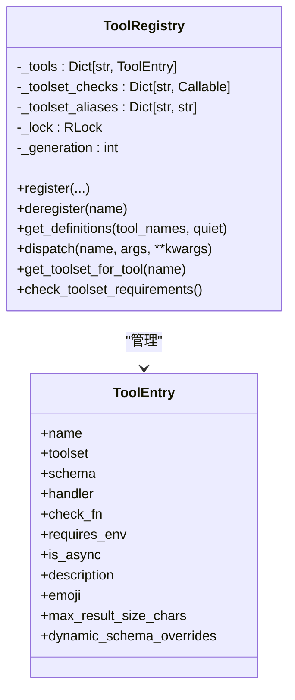
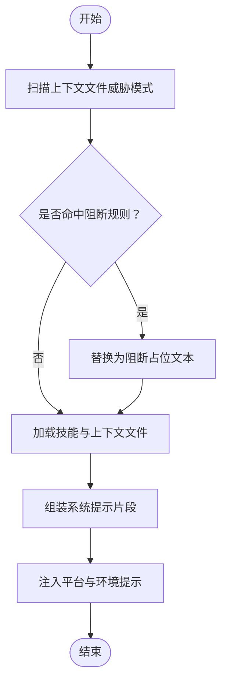
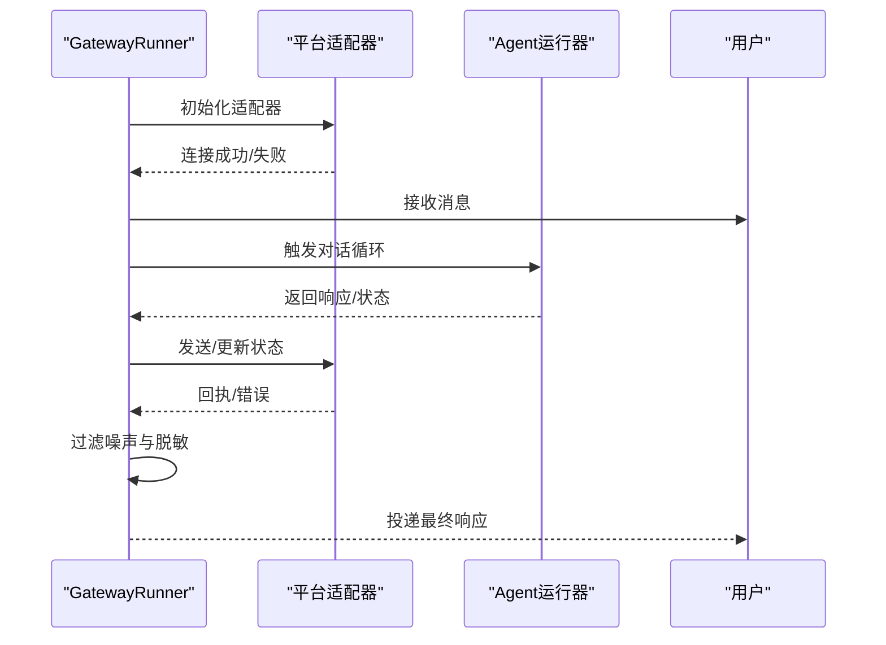
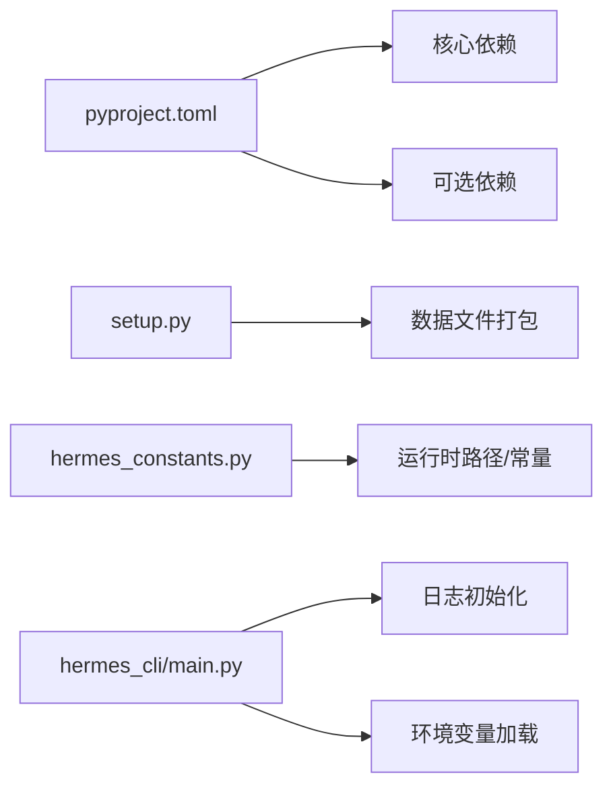

# 开发者指南

<cite>
**本文档引用的文件**
- [README.md](file://README.md)
- [CONTRIBUTING.md](file://CONTRIBUTING.md)
- [pyproject.toml](file://pyproject.toml)
- [setup.py](file://setup.py)
- [hermes_constants.py](file://hermes_constants.py)
- [hermes_cli/main.py](file://hermes_cli/main.py)
- [run_agent.py](file://run_agent.py)
- [tools/registry.py](file://tools/registry.py)
- [agent/prompt_builder.py](file://agent/prompt_builder.py)
- [gateway/run.py](file://gateway/run.py)
</cite>

## 目录
1. [简介](#简介)
2. [项目结构](#项目结构)
3. [核心组件](#核心组件)
4. [架构总览](#架构总览)
5. [详细组件分析](#详细组件分析)
6. [依赖关系分析](#依赖关系分析)
7. [性能考虑](#性能考虑)
8. [故障排查指南](#故障排查指南)
9. [结论](#结论)
10. [附录](#附录)

## 简介
本指南面向Hermes Agent的开发者与贡献者，覆盖从开发环境搭建、代码规范与贡献流程，到扩展开发（插件、工具、技能、自定义传输）、开发工具与调试技巧、测试方法、架构设计原则、最佳实践、代码评审标准、版本控制与发布流程以及社区参与等全链路内容。目标是帮助开源贡献者与企业开发者快速上手并高质量交付。

## 项目结构
Hermes Agent采用模块化分层设计，核心由以下层次构成：
- 运行时与入口：run_agent.py（独立Agent运行器）、hermes_cli/main.py（CLI入口）
- Agent内核：agent/（系统提示构建、上下文压缩、记忆管理、错误分类等）
- 工具体系：tools/（工具注册中心、终端、文件、网络、视觉、子代理等）
- 网关与平台适配：gateway/（多平台消息网关、会话管理、投递）
- 插件与技能：plugins/、skills/、optional-skills/
- 配置与常量：hermes_constants.py、pyproject.toml、setup.py
- 测试与脚本：tests/、scripts/

图表来源
- [hermes_cli/main.py](file://hermes_cli/main.py)
- [run_agent.py](file://run_agent.py)
- [agent/prompt_builder.py](file://agent/prompt_builder.py)
- [tools/registry.py](file://tools/registry.py)
- [gateway/run.py](file://gateway/run.py)
- [hermes_constants.py](file://hermes_constants.py)

章节来源
- [README.md](file://README.md)
- [pyproject.toml](file://pyproject.toml)
- [setup.py](file://setup.py)

## 核心组件
- 运行时与对话循环：AIAgent类负责系统提示构建、工具调用循环、上下文压缩、会话持久化与状态管理。
- 工具注册与调度：ToolRegistry集中注册所有工具，支持可用性探测、动态Schema覆盖、异步桥接与错误统一格式化。
- 系统提示构建：PromptBuilder按平台、技能、上下文文件、环境提示组装系统提示，内置安全扫描与注入防护。
- 网关与平台适配：GatewayRunner管理多平台适配器生命周期、消息路由、状态回调过滤与敏感信息脱敏。
- 配置与路径：hermes_constants.py统一管理HERMES_HOME、技能目录、缓存目录、平台检测与网络偏好。

章节来源
- [run_agent.py](file://run_agent.py)
- [tools/registry.py](file://tools/registry.py)
- [agent/prompt_builder.py](file://agent/prompt_builder.py)
- [gateway/run.py](file://gateway/run.py)
- [hermes_constants.py](file://hermes_constants.py)

## 架构总览
Hermes Agent采用“工具即能力”的设计：工具通过自注册机制加入注册表，模型在推理过程中根据系统提示与当前可用工具生成函数调用；工具执行后将结果回传给模型，形成自动化的工具调用循环。网关层负责跨平台的消息接入与投递，确保一致的用户体验与安全策略。

图表来源
- [hermes_cli/main.py](file://hermes_cli/main.py)
- [gateway/run.py](file://gateway/run.py)
- [run_agent.py](file://run_agent.py)
- [agent/prompt_builder.py](file://agent/prompt_builder.py)
- [tools/registry.py](file://tools/registry.py)

## 详细组件分析

### 组件A：工具注册与调度（ToolRegistry）
- 设计要点
  - 自注册：每个工具文件在导入时调用registry.register()完成声明。
  - 可用性探测：check_fn缓存（约30秒）避免频繁外部状态探测。
  - 动态Schema：支持运行时动态覆盖（如委托任务描述随配置变化）。
  - 异步桥接：异步工具处理器通过统一桥接返回字符串结果。
  - 错误统一：异常被捕获并以统一JSON格式返回，便于模型侧处理。
- 复杂度与性能
  - 注册查询为O(n)遍历，n为已注册工具数；通过快照与锁保证并发安全。
  - check_fn TTL缓存显著降低重复探测成本。
- 优化建议
  - 对高频查询可引入二级索引（如按toolset分组）。
  - 对大型工具集可考虑延迟导入或懒加载策略。

图表来源
- [tools/registry.py](file://tools/registry.py)

章节来源
- [tools/registry.py](file://tools/registry.py)

### 组件B：系统提示构建（PromptBuilder）
- 设计要点
  - 分块组装：身份、平台提示、技能列表、上下文文件、环境提示、任务完成指引等。
  - 安全扫描：对上下文文件进行威胁模式扫描，阻断潜在注入与提示工程。
  - 平台感知：针对不同平台（Telegram、Discord、WhatsApp等）注入渲染与能力提示。
  - 环境提示：对WSL、远程后端、Windows Bash等环境差异进行说明。
- 复杂度与性能
  - 模块级纯函数，无状态，开销主要来自文件读取与正则扫描。
  - 建议对大文件内容进行分段处理与缓存。

图表来源
- [agent/prompt_builder.py](file://agent/prompt_builder.py)

章节来源
- [agent/prompt_builder.py](file://agent/prompt_builder.py)

### 组件C：网关运行与消息投递（GatewayRunner）
- 设计要点
  - 生命周期管理：启动/停止/重启/健康检查，适配器按平台独立管理。
  - 状态回调过滤：对噪声状态与敏感信息进行过滤与脱敏。
  - 提供商错误映射：将原始提供商错误映射为用户友好的简短提示。
  - 自动续写：基于时间戳判断中断是否新鲜，决定是否自动续写。
- 复杂度与性能
  - 异步事件循环中捕获瞬时网络错误，避免进程崩溃。
  - 对长连接与重试策略进行超时与退避控制。

图表来源
- [gateway/run.py](file://gateway/run.py)

章节来源
- [gateway/run.py](file://gateway/run.py)

### 组件D：运行时与对话循环（AIAgent）
- 设计要点
  - 会话数据库：SQLite存储会话历史，支持全文检索与标题管理。
  - 上下文压缩：接近上下文上限时自动摘要与压缩。
  - 模型抽象：支持任意OpenAI兼容API，提供路由与参数注入。
  - 回调与进度：支持工具进度、思考、澄清、状态等回调。
- 复杂度与性能
  - 工具执行并发上限控制（默认最多8个工作者）。
  - 对大型工具结果进行临时文件落盘，避免内存膨胀。

章节来源
- [run_agent.py](file://run_agent.py)

## 依赖关系分析
- 依赖管理
  - pyproject.toml定义核心依赖与可选依赖，严格锁定版本以降低供应链风险。
  - setup.py通过数据文件打包技能与可选技能目录，确保安装一致性。
- 运行时依赖
  - hermes_constants.py提供跨模块共享的常量与路径解析，避免循环导入。
  - hermes_cli/main.py在早期阶段加载环境变量与日志初始化，确保后续组件正确运行。

图表来源
- [pyproject.toml](file://pyproject.toml)
- [setup.py](file://setup.py)
- [hermes_constants.py](file://hermes_constants.py)
- [hermes_cli/main.py](file://hermes_cli/main.py)

章节来源
- [pyproject.toml](file://pyproject.toml)
- [setup.py](file://setup.py)
- [hermes_constants.py](file://hermes_constants.py)
- [hermes_cli/main.py](file://hermes_cli/main.py)

## 性能考虑
- 工具可用性探测缓存：减少对外部状态的重复探测，降低启动与运行时开销。
- 工具执行并发限制：通过MAX_TOOL_WORKERS限制并发，避免资源争用。
- 上下文压缩：在接近上下文上限前进行摘要与压缩，平衡精度与性能。
- 日志与敏感信息：在网关层对提供商错误与敏感信息进行脱敏与短语化，减少冗余输出。
- 网络偏好：可强制优先IPv4，避免IPv6解析导致的超时问题。

## 故障排查指南
- 常见问题定位
  - 网关瞬时网络错误：事件循环异常处理器会吞掉瞬时网络错误并记录警告，避免进程崩溃。
  - 提供商错误映射：将原始提供商错误映射为简短用户提示，并保留详细日志。
  - 工具执行异常：统一以JSON格式返回错误，便于模型侧识别与恢复。
- 诊断工具
  - hermes doctor：检查配置与依赖，定位常见环境问题。
  - hermes sessions browse：交互式浏览会话，辅助定位会话状态与历史。
  - hermes gateway status：查看网关服务状态与运行参数。
- 安全与合规
  - 危险命令检测与审批流程，防止误执行。
  - 写入白名单与路径解析，防止符号链接绕过。
  - 工具结果与消息的ASCII/非ASCII净化，避免结构噪声进入模型。

章节来源
- [gateway/run.py](file://gateway/run.py)
- [run_agent.py](file://run_agent.py)
- [CONTRIBUTING.md](file://CONTRIBUTING.md)

## 结论
Hermes Agent通过清晰的模块边界与自注册工具体系，实现了高度可扩展的智能体平台。开发者可在不修改核心代码的前提下，通过工具、技能与网关适配器扩展能力；同时，完善的测试、安全与性能策略保障了系统的稳定性与可维护性。建议在贡献流程中遵循既定的优先级与规范，确保高质量交付。

## 附录

### 开发环境搭建
- 先决条件
  - Git（含git-lfs）
  - Python 3.11+
  - uv（快速Python包管理器）
  - Node.js 20+（浏览器工具与WhatsApp桥）
- 安装步骤
  - 创建虚拟环境并安装所有依赖与开发工具
  - 可选：安装浏览器工具依赖
  - 配置用户目录与环境变量（至少提供一个LLM提供商密钥）
- 运行与验证
  - 创建全局可执行链接
  - 使用hermes doctor与hermes chat进行基本验证

章节来源
- [CONTRIBUTING.md](file://CONTRIBUTING.md)

### 代码规范与贡献流程
- 贡献优先级：缺陷修复 > 跨平台兼容 > 安全加固 > 性能与鲁棒性 > 新技能 > 新工具 > 文档
- 工具与技能选择：优先技能，仅在需要端到端集成或自定义处理逻辑时选择工具
- 内存提供程序：不再接受内置内存提供程序，建议以独立插件形式发布
- 开发流程：克隆仓库 → 创建虚拟环境 → 安装依赖 → 编写测试 → 运行测试 → 提交PR

章节来源
- [CONTRIBUTING.md](file://CONTRIBUTING.md)

### 扩展开发指南
- 插件开发
  - 实现MemoryProvider抽象接口，使用discover_memory_providers发现
  - 通过post_setup集成设置向导，注册CLI子命令
- 工具开发
  - 在tools/下新增文件，实现handler与Schema，调用registry.register()
  - 将工具名加入相应toolset，确保被暴露给Agent
- 技能开发
  - 在skills/或optional-skills/下创建目录，编写SKILL.md与脚本
  - 使用平台限定、条件激活与所需环境变量元数据提升安全性与可用性
- 自定义传输（网关适配器）
  - 在gateway/platforms/下新增平台适配器，实现统一接口
  - 集成状态回调过滤、敏感信息脱敏与提供商错误映射

章节来源
- [CONTRIBUTING.md](file://CONTRIBUTING.md)
- [tools/registry.py](file://tools/registry.py)
- [gateway/run.py](file://gateway/run.py)

### 测试方法与工具
- 测试运行
  - 推荐使用scripts/run_tests.sh（与CI一致的hermetic环境与并行工作线程）
  - 或pytest tests/ -v（需先激活虚拟环境）
- 测试类型
  - 单元测试：覆盖工具与组件功能
  - 集成测试：覆盖平台适配器与网关流程
  - 端到端测试：覆盖完整对话循环与工具调用
- 跨平台测试
  - 使用pytest标记跳过Unix专属特性（如symlink、信号、文件权限）
  - 在Windows回归测试中注意路径分隔符与换行符

章节来源
- [CONTRIBUTING.md](file://CONTRIBUTING.md)
- [pyproject.toml](file://pyproject.toml)

### 版本控制与发布
- 版本号管理：pyproject.toml中的version字段
- 依赖锁定：uv.lock确保可复现构建
- 发布流程：更新版本 → 更新依赖锁 → 运行测试 → 提交PR → 合并 → 打标签与发布

章节来源
- [pyproject.toml](file://pyproject.toml)

### 社区参与
- 讨论与支持：Discord频道
- 技能生态：Skills Hub（agentskills.io）
- 问题反馈：GitHub Issues
- 相关项目：computer-use-linux MCP服务器、HermesClaw WeChat桥

章节来源
- [README.md](file://README.md)