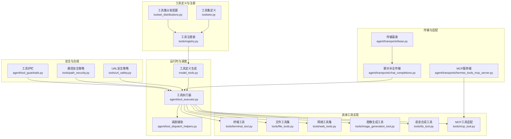
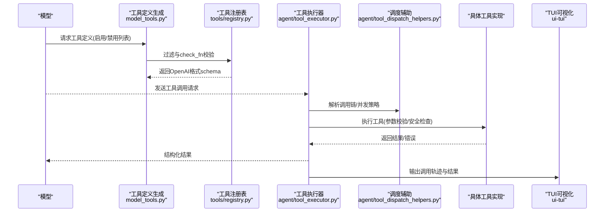
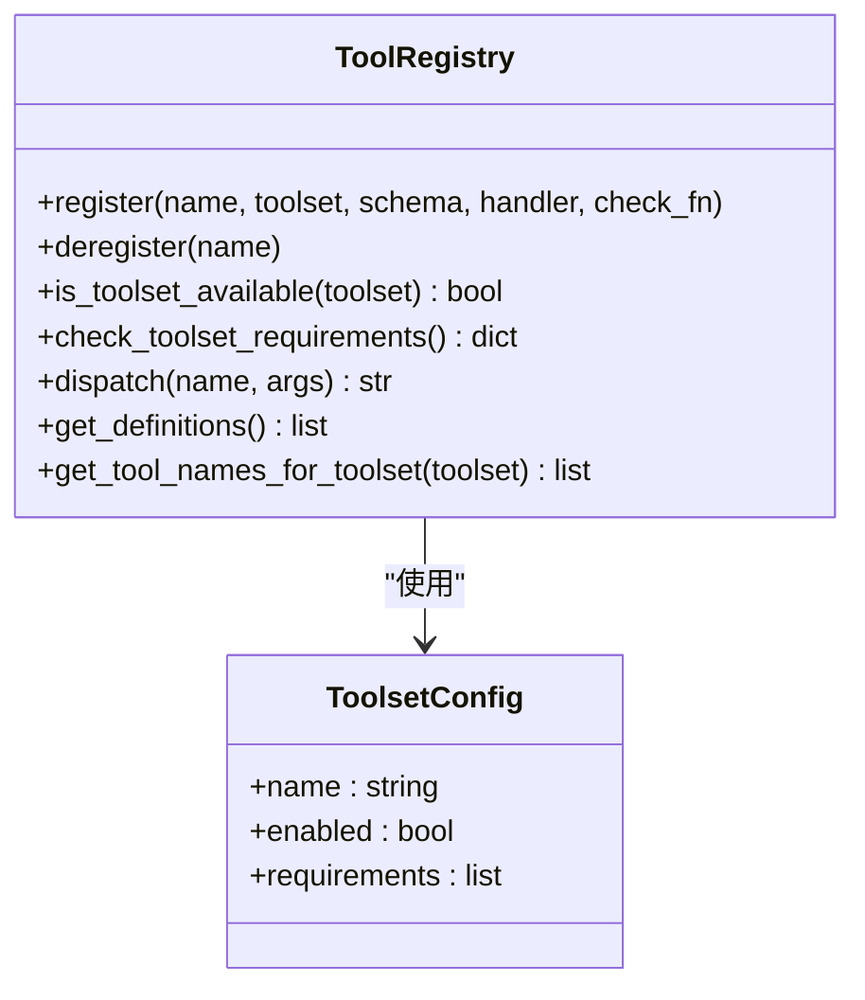
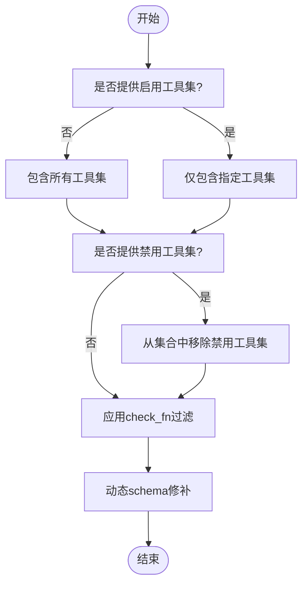
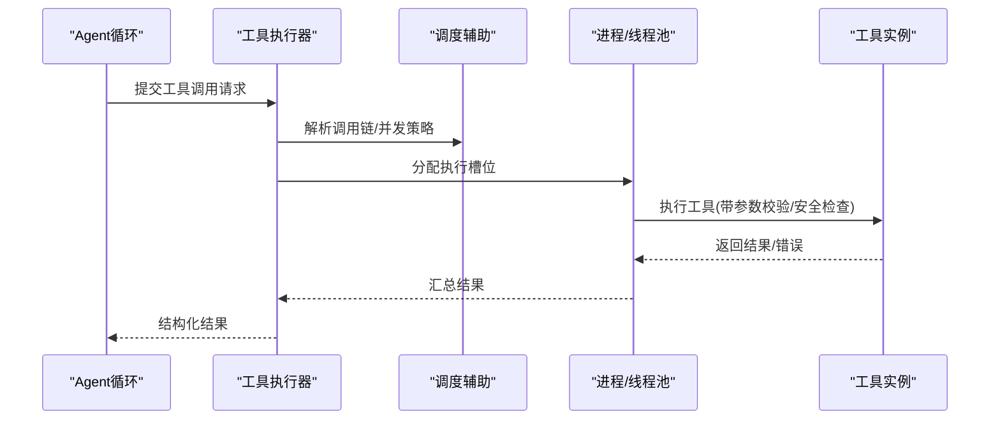
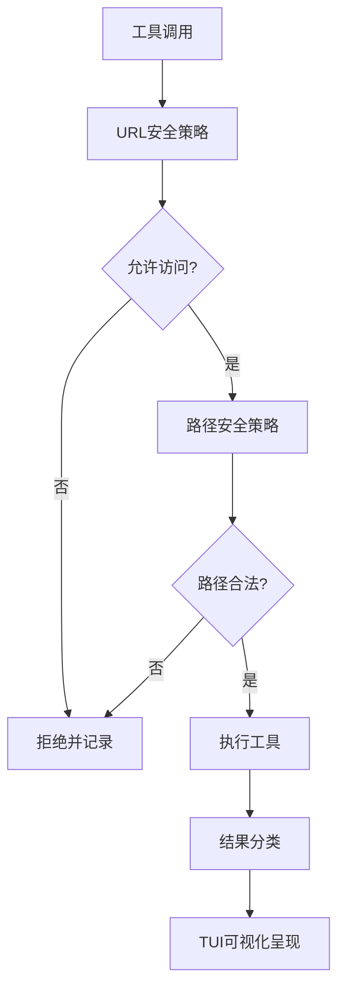
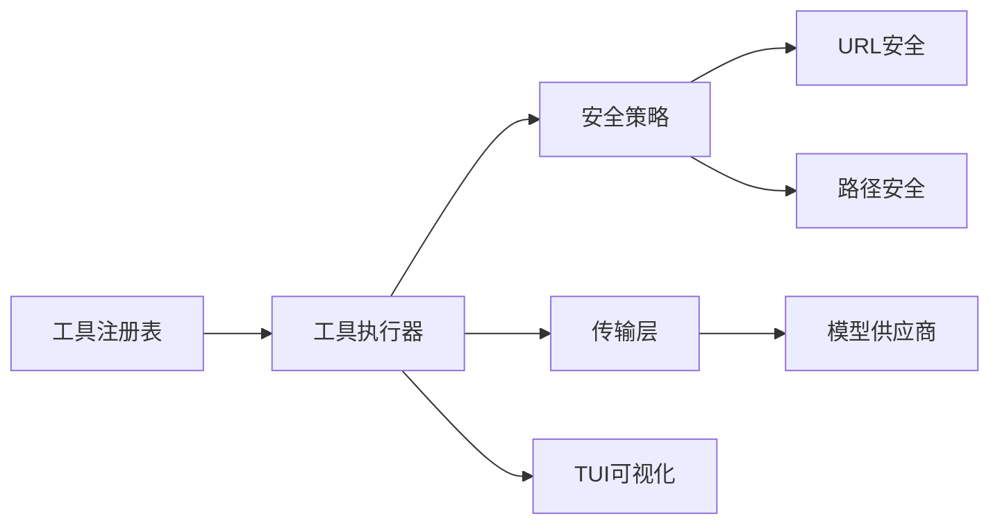

# 工具开发

<cite>
**本文档引用的文件**
- [model_tools.py](file://model_tools.py)
- [toolsets.py](file://toolsets.py)
- [toolset_distributions.py](file://toolset_distributions.py)
- [agent/tool_executor.py](file://agent/tool_executor.py)
- [agent/tool_dispatch_helpers.py](file://agent/tool_dispatch_helpers.py)
- [agent/tool_guardrails.py](file://agent/tool_guardrails.py)
- [agent/tool_result_classification.py](file://agent/tool_result_classification.py)
- [agent/conversation_loop.py](file://agent/conversation_loop.py)
- [agent/async_utils.py](file://agent/async_utils.py)
- [agent/runtime_cwd.py](file://agent/runtime_cwd.py)
- [agent/memory_manager.py](file://agent/memory_manager.py)
- [agent/memory_provider.py](file://agent/memory_provider.py)
- [agent/skill_utils.py](file://agent/skill_utils.py)
- [agent/skill_commands.py](file://agent/skill_commands.py)
- [agent/skill_preprocessing.py](file://agent/skill_preprocessing.py)
- [agent/skill_bundles.py](file://agent/skill_bundles.py)
- [agent/credential_pool.py](file://agent/credential_pool.py)
- [agent/credential_sources.py](file://agent/credential_sources.py)
- [agent/credential_persistence.py](file://agent/credential_persistence.py)
- [agent/azure_identity_adapter.py](file://agent/azure_identity_adapter.py)
- [agent/anthropic_adapter.py](file://agent/anthropic_adapter.py)
- [agent/bedrock_adapter.py](file://agent/bedrock_adapter.py)
- [agent/gemini_native_adapter.py](file://agent/gemini_native_adapter.py)
- [agent/google_code_assist.py](file://agent/google_code_assist.py)
- [agent/web_search_provider.py](file://agent/web_search_provider.py)
- [agent/web_search_registry.py](file://agent/web_search_registry.py)
- [agent/image_gen_provider.py](file://agent/image_gen_provider.py)
- [agent/image_gen_registry.py](file://agent/image_gen_registry.py)
- [agent/transports/chat_completions.py](file://agent/transports/chat_completions.py)
- [agent/transports/codex.py](file://agent/transports/codex.py)
- [agent/transports/anthropic.py](file://agent/transports/anthropic.py)
- [agent/transports/bedrock.py](file://agent/transports/bedrock.py)
- [agent/transports/base.py](file://agent/transports/base.py)
- [agent/transports/hermes_tools_mcp_server.py](file://agent/transports/hermes_tools_mcp_server.py)
- [agent/transports/types.py](file://agent/transports/types.py)
- [tools/__init__.py](file://tools/__init__.py)
- [tools/registry.py](file://tools/registry.py)
- [tools/managed_tool_gateway.py](file://tools/managed_tool_gateway.py)
- [tools/tool_backend_helpers.py](file://tools/tool_backend_helpers.py)
- [tools/tool_output_limits.py](file://tools/tool_output_limits.py)
- [tools/tool_result_storage.py](file://tools/tool_result_storage.py)
- [tools/tool_search.py](file://tools/tool_search.py)
- [tools/terminal_tool.py](file://tools/terminal_tool.py)
- [tools/file_tools.py](file://tools/file_tools.py)
- [tools/file_operations.py](file://tools/file_operations.py)
- [tools/web_tools.py](file://tools/web_tools.py)
- [tools/image_generation_tool.py](file://tools/image_generation_tool.py)
- [tools/video_generation_tool.py](file://tools/video_generation_tool.py)
- [tools/tts_tool.py](file://tools/tts_tool.py)
- [tools/transcription_tools.py](file://tools/transcription_tools.py)
- [tools/vision_tools.py](file://tools/vision_tools.py)
- [tools/computer_use_tool.py](file://tools/computer_use_tool.py)
- [tools/browser_tool.py](file://tools/browser_tool.py)
- [tools/browser_cdp_tool.py](file://tools/browser_cdp_tool.py)
- [tools/browser_supervisor.py](file://tools/browser_supervisor.py)
- [tools/mcp_tool.py](file://tools/mcp_tool.py)
- [tools/mcp_oauth.py](file://tools/mcp_oauth.py)
- [tools/mcp_oauth_manager.py](file://tools/mcp_oauth_manager.py)
- [tools/code_execution_tool.py](file://tools/code_execution_tool.py)
- [tools/url_safety.py](file://tools/url_safety.py)
- [tools/path_security.py](file://tools/path_security.py)
- [tools/process_registry.py](file://tools/process_registry.py)
- [tools/thread_context.py](file://tools/thread_context.py)
- [tools/tool_output_limits.py](file://tools/tool_output_limits.py)
- [tools/tool_result_storage.py](file://tools/tool_result_storage.py)
- [tools/tool_search.py](file://tools/tool_search.py)
- [tools/debug_helpers.py](file://tools/debug_helpers.py)
- [tools/budget_config.py](file://tools/budget_config.py)
- [tools/env_passthrough.py](file://tools/env_passthrough.py)
- [tools/env_probe.py](file://tools/env_probe.py)
- [tools/lazy_deps.py](file://tools/lazy_deps.py)
- [tools/schema_sanitizer.py](file://tools/schema_sanitizer.py)
- [tools/threat_patterns.py](file://tools/threat_patterns.py)
- [tools/tirith_security.py](file://tools/tirith_security.py)
- [tools/credential_files.py](file://tools/credential_files.py)
- [tools/xai_http.py](file://tools/xai_http.py)
- [tools/fal_common.py](file://tools/fal_common.py)
- [acp_adapter/tools.py](file://acp_adapter/tools.py)
- [acp_adapter/server.py](file://acp_adapter/server.py)
- [acp_adapter/entry.py](file://acp_adapter/entry.py)
- [acp_adapter/events.py](file://acp_adapter/events.py)
- [acp_adapter/auth.py](file://acp_adapter/auth.py)
- [acp_adapter/session.py](file://acp_adapter/session.py)
- [acp_adapter/edit_approval.py](file://acp_adapter/edit_approval.py)
- [acp_adapter/permissions.py](file://acp_adapter/permissions.py)
- [acp_adapter/agent.json](file://acp_registry/agent.json)
- [tests/tools/test_registry.py](file://tests/tools/test_registry.py)
- [tests/tools/test_mcp_dynamic_discovery.py](file://tests/tools/test_mcp_dynamic_discovery.py)
- [tests/agent/test_display_tool_failure.py](file://tests/agent/test_display_tool_failure.py)
- [tests/run_agent/test_run_agent.py](file://tests/run_agent/test_run_agent.py)
- [website/docs/reference/tools-reference.md](file://website/docs/reference/tools-reference.md)
- [website/i18n/zh-Hans/docusaurus-plugin-content-docs/current/developer-guide/tools-runtime.md](file://website/i18n/zh-Hans/docusaurus-plugin-content-docs/current/developer-guide/tools-runtime.md)
- [ui-tui/src/lib/text.ts](file://ui-tui/src/lib/text.ts)
- [ui-tui/src/components/thinking.tsx](file://ui-tui/src/components/thinking.tsx)
- [ui-tui/src/content/verbs.ts](file://ui-tui/src/content/verbs.ts)
</cite>

## 目录
1. [简介](#简介)
2. [项目结构](#项目结构)
3. [核心组件](#核心组件)
4. [架构总览](#架构总览)
5. [详细组件分析](#详细组件分析)
6. [依赖关系分析](#依赖关系分析)
7. [性能考虑](#性能考虑)
8. [故障排查指南](#故障排查指南)
9. [结论](#结论)
10. [附录](#附录)

## 简介
本指南面向Hermes Agent工具开发者，系统阐述工具系统的架构设计、工具定义规范、执行引擎与结果处理机制，并给出从需求分析到生产部署的完整开发参考。内容覆盖工具类设计、参数验证、执行逻辑实现、结果格式化与错误处理；工具注册机制、工具调度系统、并发执行与资源管理；以及系统工具（终端、文件操作）、网络工具（Web搜索、API调用）、多媒体工具（图像生成、语音合成）等类型工具的开发实践。同时提供测试、调试、性能优化与安全防护建议。

## 项目结构
Hermes Agent的工具体系围绕“工具注册表”“工具集”“执行器”“传输层”“安全与合规”五大维度组织，辅以前端TUI对工具调用轨迹的可视化呈现。

图示来源
- [model_tools.py:1-200](file://model_tools.py#L1-L200)
- [tools/registry.py:1-200](file://tools/registry.py#L1-L200)
- [agent/tool_executor.py:1-200](file://agent/tool_executor.py#L1-L200)
- [agent/transports/chat_completions.py:1-120](file://agent/transports/chat_completions.py#L1-L120)
- [agent/transports/base.py:1-120](file://agent/transports/base.py#L1-L120)
- [agent/transports/hermes_tools_mcp_server.py:1-120](file://agent/transports/hermes_tools_mcp_server.py#L1-L120)
- [tools/url_safety.py:1-120](file://tools/url_safety.py#L1-L120)
- [tools/path_security.py:1-120](file://tools/path_security.py#L1-L120)
- [agent/tool_guardrails.py:1-120](file://agent/tool_guardrails.py#L1-L120)

章节来源
- [model_tools.py:1-200](file://model_tools.py#L1-L200)
- [tools/registry.py:1-200](file://tools/registry.py#L1-L200)
- [agent/tool_executor.py:1-200](file://agent/tool_executor.py#L1-L200)
- [agent/transports/chat_completions.py:1-120](file://agent/transports/chat_completions.py#L1-L120)
- [agent/transports/base.py:1-120](file://agent/transports/base.py#L1-L120)
- [agent/transports/hermes_tools_mcp_server.py:1-120](file://agent/transports/hermes_tools_mcp_server.py#L1-L120)
- [tools/url_safety.py:1-120](file://tools/url_safety.py#L1-L120)
- [tools/path_security.py:1-120](file://tools/path_security.py#L1-L120)
- [agent/tool_guardrails.py:1-120](file://agent/tool_guardrails.py#L1-L120)

## 核心组件
- 工具注册表与工具集
  - 工具注册表负责工具的注册、可用性检查、别名解析、动态schema修补与调度派发。
  - 工具集定义与分发配置用于按环境启用/禁用工具集，支持向后兼容映射。
- 运行时与调度
  - 工具定义生成根据启用/禁用列表与注册表过滤，输出OpenAI兼容的工具schema。
  - 工具执行器负责串行/并行调度、并发控制、结果归并与错误分类。
- 具体工具实现
  - 终端、文件、网络、图像、语音、视频、视觉、浏览器、MCP等工具模块化实现。
- 传输与适配
  - 通过传输层适配不同模型供应商，MCP服务端支持外部工具生态接入。
- 安全与合规
  - URL/路径安全策略、工具护栏、结果分类与可视化呈现贯穿工具生命周期。

章节来源
- [tools/registry.py:1-200](file://tools/registry.py#L1-L200)
- [tools/registry.py:200-400](file://tools/registry.py#L200-L400)
- [model_tools.py:1-200](file://model_tools.py#L1-L200)
- [agent/tool_executor.py:1-200](file://agent/tool_executor.py#L1-L200)
- [agent/tool_dispatch_helpers.py:1-120](file://agent/tool_dispatch_helpers.py#L1-L120)
- [agent/transports/chat_completions.py:1-120](file://agent/transports/chat_completions.py#L1-L120)
- [agent/transports/hermes_tools_mcp_server.py:1-120](file://agent/transports/hermes_tools_mcp_server.py#L1-L120)
- [tools/url_safety.py:1-120](file://tools/url_safety.py#L1-L120)
- [tools/path_security.py:1-120](file://tools/path_security.py#L1-L120)
- [agent/tool_guardrails.py:1-120](file://agent/tool_guardrails.py#L1-L120)

## 架构总览
下图展示了从“模型请求工具调用”到“工具执行与结果返回”的端到端流程，包括工具定义生成、注册表过滤、执行器调度、并发与资源管理、结果处理与可视化。

图示来源
- [model_tools.py:1-200](file://model_tools.py#L1-L200)
- [tools/registry.py:1-200](file://tools/registry.py#L1-L200)
- [agent/tool_executor.py:1-200](file://agent/tool_executor.py#L1-L200)
- [agent/tool_dispatch_helpers.py:1-120](file://agent/tool_dispatch_helpers.py#L1-L120)
- [ui-tui/src/lib/text.ts:233-277](file://ui-tui/src/lib/text.ts#L233-L277)
- [ui-tui/src/components/thinking.tsx:774-823](file://ui-tui/src/components/thinking.tsx#L774-L823)

## 详细组件分析

### 工具注册表与工具集
- 注册表职责
  - 注册工具：名称、工具集、schema、处理器、可用性检查函数。
  - 可用性检查：check_fn异常捕获，避免崩溃；工具集要求检查。
  - 别名与动态发现：支持工具集别名解析与动态工具集存在性维护。
  - 派发与过滤：按工具集展开、按check_fn过滤、动态schema修补。
- 工具集定义与分发
  - 工具集定义集中于toolsets.py，分发配置在toolset_distributions.py中按环境启用/禁用。
  - 旧版工具集名称通过映射保持兼容。

图示来源
- [tools/registry.py:1-200](file://tools/registry.py#L1-L200)
- [tools/registry.py:200-400](file://tools/registry.py#L200-L400)
- [toolsets.py:1-200](file://toolsets.py#L1-L200)
- [toolset_distributions.py:1-200](file://toolset_distributions.py#L1-L200)

章节来源
- [tools/registry.py:1-200](file://tools/registry.py#L1-L200)
- [tools/registry.py:200-400](file://tools/registry.py#L200-L400)
- [toolsets.py:1-200](file://toolsets.py#L1-L200)
- [toolset_distributions.py:1-200](file://toolset_distributions.py#L1-L200)
- [tests/tools/test_registry.py:129-246](file://tests/tools/test_registry.py#L129-L246)
- [tests/tools/test_mcp_dynamic_discovery.py:150-165](file://tests/tools/test_mcp_dynamic_discovery.py#L150-L165)

### 工具定义生成与过滤
- 过滤策略
  - 若提供启用工具集：仅包含这些工具集中的工具，通过resolve_toolset展开复合工具集。
  - 若提供禁用工具集：从所有工具开始减去禁用工具集。
  - 若两者均未提供：包含所有已知工具集。
  - 注册表过滤：apply check_fn，返回OpenAI格式schema。
  - 动态schema修补：对execute_code与browser_navigate进行schema裁剪，避免模型调用不可用工具。
- 旧版工具集名称映射
  - 带有“_tools”后缀的旧版名称通过映射到现代工具名称，保证向后兼容。

图示来源
- [website/i18n/zh-Hans/docusaurus-plugin-content-docs/current/developer-guide/tools-runtime.md:104-124](file://website/i18n/zh-Hans/docusaurus-plugin-content-docs/current/developer-guide/tools-runtime.md#L104-L124)
- [website/docs/reference/tools-reference.md:84-91](file://website/docs/reference/tools-reference.md#L84-L91)

章节来源
- [website/i18n/zh-Hans/docusaurus-plugin-content-docs/current/developer-guide/tools-runtime.md:104-124](file://website/i18n/zh-Hans/docusaurus-plugin-content-docs/current/developer-guide/tools-runtime.md#L104-L124)
- [website/docs/reference/tools-reference.md:84-91](file://website/docs/reference/tools-reference.md#L84-L91)

### 工具执行器与调度
- 调度策略
  - 串行/并行：根据工具调用链与并发策略选择执行路径。
  - 并发控制：限制并发数，避免资源争用。
  - 结果归并：将多工具结果合并为统一结构。
  - 错误分类：区分工具内部错误、超时、资源不足等。
- 与Agent循环集成
  - 部分Agent级工具（如记忆/会话搜索）由Agent循环直接处理，其余通过执行器统一调度。

图示来源
- [agent/tool_executor.py:1-200](file://agent/tool_executor.py#L1-L200)
- [agent/tool_dispatch_helpers.py:1-120](file://agent/tool_dispatch_helpers.py#L1-L120)
- [agent/async_utils.py:1-120](file://agent/async_utils.py#L1-L120)
- [agent/conversation_loop.py:1-120](file://agent/conversation_loop.py#L1-L120)

章节来源
- [agent/tool_executor.py:1-200](file://agent/tool_executor.py#L1-L200)
- [agent/tool_dispatch_helpers.py:1-120](file://agent/tool_dispatch_helpers.py#L1-L120)
- [agent/async_utils.py:1-120](file://agent/async_utils.py#L1-L120)
- [agent/conversation_loop.py:1-120](file://agent/conversation_loop.py#L1-L120)
- [tests/run_agent/test_run_agent.py:2961-2988](file://tests/run_agent/test_run_agent.py#L2961-L2988)

### 安全与合规
- URL安全策略
  - 限制可访问域名/协议，防止越权访问。
- 路径安全策略
  - 文件操作前进行路径规范化与白名单校验，防止目录穿越。
- 工具护栏
  - 对高风险工具（如终端、文件写入、代码执行）设置护栏规则与权限控制。
- 结果分类与可视化
  - 对失败结果进行分类（如内存满、权限不足），并在TUI中以不同颜色与标记呈现。

图示来源
- [tools/url_safety.py:1-120](file://tools/url_safety.py#L1-L120)
- [tools/path_security.py:1-120](file://tools/path_security.py#L1-L120)
- [agent/tool_guardrails.py:1-120](file://agent/tool_guardrails.py#L1-L120)
- [tests/agent/test_display_tool_failure.py:69-101](file://tests/agent/test_display_tool_failure.py#L69-L101)
- [ui-tui/src/lib/text.ts:233-277](file://ui-tui/src/lib/text.ts#L233-L277)
- [ui-tui/src/components/thinking.tsx:774-823](file://ui-tui/src/components/thinking.tsx#L774-L823)
- [ui-tui/src/content/verbs.ts:1-38](file://ui-tui/src/content/verbs.ts#L1-L38)

章节来源
- [tools/url_safety.py:1-120](file://tools/url_safety.py#L1-L120)
- [tools/path_security.py:1-120](file://tools/path_security.py#L1-L120)
- [agent/tool_guardrails.py:1-120](file://agent/tool_guardrails.py#L1-L120)
- [tests/agent/test_display_tool_failure.py:69-101](file://tests/agent/test_display_tool_failure.py#L69-L101)
- [ui-tui/src/lib/text.ts:233-277](file://ui-tui/src/lib/text.ts#L233-L277)
- [ui-tui/src/components/thinking.tsx:774-823](file://ui-tui/src/components/thinking.tsx#L774-L823)
- [ui-tui/src/content/verbs.ts:1-38](file://ui-tui/src/content/verbs.ts#L1-L38)

### 系统工具：终端与文件操作
- 终端工具
  - 支持命令执行、工作目录隔离、输出截断与安全上下文注入。
- 文件工具
  - 读取、搜索、写入、补丁编辑等，支持语法检查与差异输出。
- 实现要点
  - 参数校验：命令/路径合法性、长度限制。
  - 执行逻辑：沙箱化执行、超时控制、资源配额。
  - 结果格式化：结构化输出、错误码与人类可读信息。
  - 错误处理：捕获异常、分类错误、回退策略。

章节来源
- [tools/terminal_tool.py:1-200](file://tools/terminal_tool.py#L1-L200)
- [tools/file_tools.py:1-200](file://tools/file_tools.py#L1-L200)
- [tools/file_operations.py:1-200](file://tools/file_operations.py#L1-L200)
- [agent/runtime_cwd.py:1-120](file://agent/runtime_cwd.py#L1-L120)
- [tools/tool_output_limits.py:1-120](file://tools/tool_output_limits.py#L1-L120)
- [tools/tool_result_storage.py:1-120](file://tools/tool_result_storage.py#L1-L120)

### 网络工具：Web搜索与API调用
- Web搜索
  - 提供搜索引擎封装与结果抽取，支持安全过滤与深度链接。
- API调用
  - 通过HTTP客户端与认证适配器完成第三方API调用，支持重试与限流。
- 实现要点
  - 参数校验：查询词、过滤条件、分页参数。
  - 执行逻辑：请求构建、超时与重试、响应解析。
  - 结果格式化：统一字段、摘要与引用。
  - 错误处理：网络错误、鉴权失败、速率限制。

章节来源
- [tools/web_tools.py:1-200](file://tools/web_tools.py#L1-L200)
- [agent/web_search_provider.py:1-200](file://agent/web_search_provider.py#L1-L200)
- [agent/web_search_registry.py:1-200](file://agent/web_search_registry.py#L1-L200)
- [tools/xai_http.py:1-120](file://tools/xai_http.py#L1-L120)
- [agent/credential_pool.py:1-200](file://agent/credential_pool.py#L1-L200)
- [agent/credential_sources.py:1-200](file://agent/credential_sources.py#L1-L200)
- [agent/credential_persistence.py:1-200](file://agent/credential_persistence.py#L1-L200)

### 多媒体工具：图像生成、语音合成
- 图像生成
  - 封装多提供商接口，支持提示词、尺寸、风格参数。
- 语音合成
  - 文本转语音，支持音色、语速、音频格式。
- 实现要点
  - 参数校验：提示词长度、分辨率、采样率。
  - 执行逻辑：异步提交、轮询状态、下载结果。
  - 结果格式化：文件路径或二进制数据。
  - 错误处理：配额不足、格式不支持、网络中断。

章节来源
- [tools/image_generation_tool.py:1-200](file://tools/image_generation_tool.py#L1-L200)
- [tools/video_generation_tool.py:1-200](file://tools/video_generation_tool.py#L1-L200)
- [tools/tts_tool.py:1-200](file://tools/tts_tool.py#L1-L200)
- [agent/image_gen_provider.py:1-200](file://agent/image_gen_provider.py#L1-L200)
- [agent/image_gen_registry.py:1-200](file://agent/image_gen_registry.py#L1-L200)
- [agent/transcription_tools.py:1-200](file://agent/transcription_tools.py#L1-L200)
- [tools/fal_common.py:1-120](file://tools/fal_common.py#L1-L120)

### 浏览器与视觉工具
- 浏览器工具
  - 支持导航、点击、输入、截图、PDF导出等。
- 视觉工具
  - 截图、OCR、图像识别等。
- 实现要点
  - 参数校验：元素选择器、坐标、延迟。
  - 执行逻辑：CDP通信、事件监听、状态同步。
  - 结果格式化：DOM快照、图像数据、文本结果。
  - 错误处理：页面加载失败、元素不存在、超时。

章节来源
- [tools/browser_tool.py:1-200](file://tools/browser_tool.py#L1-L200)
- [tools/browser_cdp_tool.py:1-200](file://tools/browser_cdp_tool.py#L1-L200)
- [tools/browser_supervisor.py:1-200](file://tools/browser_supervisor.py#L1-L200)
- [tools/vision_tools.py:1-200](file://tools/vision_tools.py#L1-L200)

### MCP工具与外部生态
- MCP工具适配
  - 通过MCP协议桥接外部工具生态，支持OAuth与会话管理。
- 传输层适配
  - 通过MCP服务端与模型供应商传输层对接。
- 实现要点
  - 参数校验：MCP方法签名、参数类型。
  - 执行逻辑：消息路由、状态跟踪、错误传播。
  - 结果格式化：JSON-RPC响应封装。
  - 错误处理：连接失败、协议错误、鉴权失效。

章节来源
- [tools/mcp_tool.py:1-200](file://tools/mcp_tool.py#L1-L200)
- [tools/mcp_oauth.py:1-200](file://tools/mcp_oauth.py#L1-L200)
- [tools/mcp_oauth_manager.py:1-200](file://tools/mcp_oauth_manager.py#L1-L200)
- [agent/transports/hermes_tools_mcp_server.py:1-200](file://agent/transports/hermes_tools_mcp_server.py#L1-L200)
- [agent/transports/base.py:1-200](file://agent/transports/base.py#L1-L200)

### ACP适配与权限控制
- ACP适配器
  - 提供编辑审批、权限校验、会话管理与事件上报。
- 实现要点
  - 权限矩阵：基于角色与工具集的细粒度授权。
  - 审批流程：变更前阻断与二次确认。
  - 会话追踪：用户行为审计与回放。

章节来源
- [acp_adapter/tools.py:1-200](file://acp_adapter/tools.py#L1-L200)
- [acp_adapter/server.py:1-200](file://acp_adapter/server.py#L1-L200)
- [acp_adapter/entry.py:1-200](file://acp_adapter/entry.py#L1-L200)
- [acp_adapter/events.py:1-200](file://acp_adapter/events.py#L1-L200)
- [acp_adapter/auth.py:1-200](file://acp_adapter/auth.py#L1-L200)
- [acp_adapter/session.py:1-200](file://acp_adapter/session.py#L1-L200)
- [acp_adapter/edit_approval.py:1-200](file://acp_adapter/edit_approval.py#L1-L200)
- [acp_adapter/permissions.py:1-200](file://acp_adapter/permissions.py#L1-L200)
- [acp_registry/agent.json:1-200](file://acp_registry/agent.json#L1-L200)

## 依赖关系分析
- 组件耦合
  - 工具注册表与工具集紧密耦合，执行器依赖注册表进行工具解析与过滤。
  - 传输层与工具执行器解耦，通过统一接口适配不同供应商。
  - 安全策略与工具执行器强耦合，贯穿执行前后。
- 外部依赖
  - 第三方API、浏览器自动化、MCP生态、凭证存储与认证服务。
- 循环依赖
  - 通过模块拆分与接口抽象避免循环依赖。

图示来源
- [tools/registry.py:1-200](file://tools/registry.py#L1-L200)
- [agent/tool_executor.py:1-200](file://agent/tool_executor.py#L1-L200)
- [agent/transports/chat_completions.py:1-120](file://agent/transports/chat_completions.py#L1-L120)
- [tools/url_safety.py:1-120](file://tools/url_safety.py#L1-L120)
- [tools/path_security.py:1-120](file://tools/path_security.py#L1-L120)
- [ui-tui/src/lib/text.ts:233-277](file://ui-tui/src/lib/text.ts#L233-L277)

章节来源
- [tools/registry.py:1-200](file://tools/registry.py#L1-L200)
- [agent/tool_executor.py:1-200](file://agent/tool_executor.py#L1-L200)
- [agent/transports/chat_completions.py:1-120](file://agent/transports/chat_completions.py#L1-L120)
- [tools/url_safety.py:1-120](file://tools/url_safety.py#L1-L120)
- [tools/path_security.py:1-120](file://tools/path_security.py#L1-L120)
- [ui-tui/src/lib/text.ts:233-277](file://ui-tui/src/lib/text.ts#L233-L277)

## 性能考虑
- 并发与资源管理
  - 限制并发数，避免CPU/IO瓶颈；对高耗时工具设置超时与配额。
- I/O与缓存
  - 文件与网络I/O采用流式处理与分块读取；结果缓存与去重。
- 序列化与传输
  - 使用紧凑的JSON结构，避免大对象重复传输；必要时压缩。
- 监控与可观测性
  - 记录工具调用耗时、错误分布与资源使用；在TUI中可视化展示。

## 故障排查指南
- 常见问题定位
  - 工具未找到：检查工具注册与工具集启用状态。
  - 工具可用性检查失败：查看check_fn异常日志。
  - 调度异常：核对调用链与并发策略。
  - 结果显示异常：检查结果分类与TUI解析逻辑。
- 调试技巧
  - 使用调试助手与日志开关；逐步缩小问题范围。
  - 单元测试覆盖：注册表、调度器、安全策略与具体工具。
- 安全与合规
  - 审计URL/路径访问记录；复核护栏规则与权限矩阵。

章节来源
- [tests/tools/test_registry.py:129-246](file://tests/tools/test_registry.py#L129-L246)
- [tests/tools/test_mcp_dynamic_discovery.py:150-165](file://tests/tools/test_mcp_dynamic_discovery.py#L150-L165)
- [tests/agent/test_display_tool_failure.py:69-101](file://tests/agent/test_display_tool_failure.py#L69-L101)
- [tools/debug_helpers.py:1-120](file://tools/debug_helpers.py#L1-L120)

## 结论
Hermes Agent工具体系通过“注册表+工具集+执行器+传输层+安全护栏”的架构实现了高内聚、低耦合的工具生态。开发者可遵循本文档的规范与流程，快速实现系统、网络、多媒体等各类工具，并在安全与性能约束下稳定交付。建议在开发过程中重视测试、调试与监控，确保工具在生产环境中的可靠性与可维护性。

## 附录
- 工具开发清单
  - 定义工具schema与参数校验规则
  - 实现执行逻辑与错误处理
  - 集成安全策略与护栏
  - 编写单元测试与集成测试
  - 在TUI中验证调用轨迹与结果
- 推荐实践
  - 使用最小权限原则与护栏规则
  - 对高风险工具增加审批与审计
  - 采用异步执行与超时控制
  - 结果结构化与人类可读信息并重