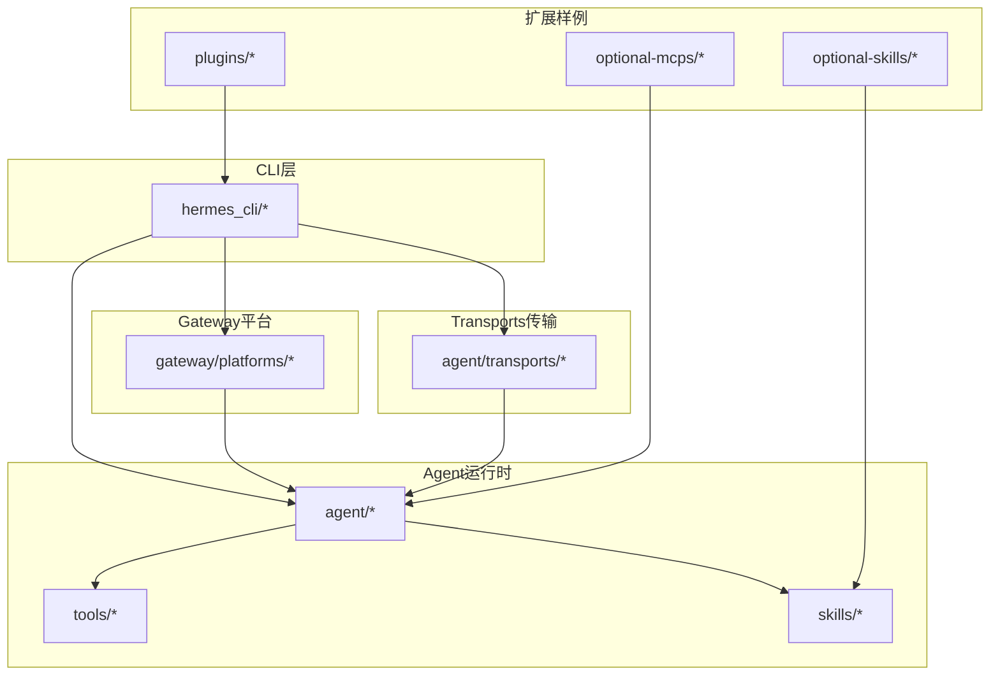
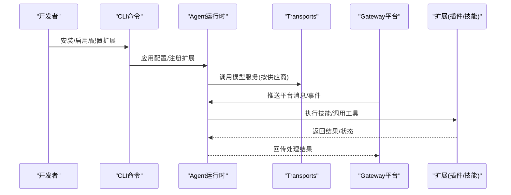
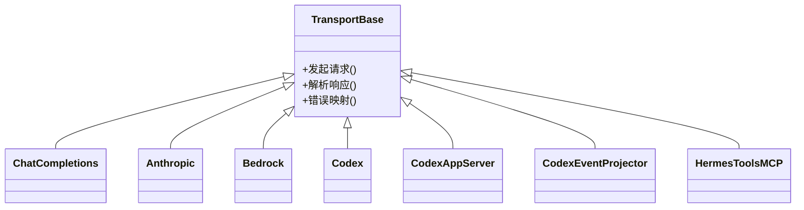
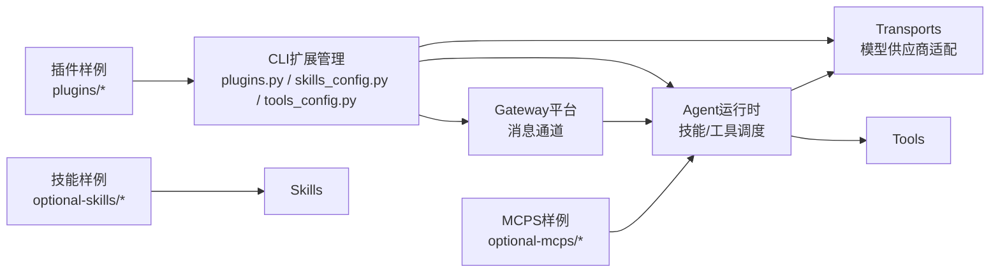

# 扩展开发

<cite>
**本文引用的文件**
- [plugins.py](file://hermes_cli/plugins.py)
- [plugins_cmd.py](file://hermes_cli/plugins_cmd.py)
- [skills_config.py](file://hermes_cli/skills_config.py)
- [tools_config.py](file://hermes_cli/tools_config.py)
- [base.py](file://agent/transports/base.py)
- [chat_completions.py](file://agent/transports/chat_completions.py)
- [anthropic.py](file://agent/transports/anthropic.py)
- [bedrock.py](file://agent/transports/bedrock.py)
- [codex.py](file://agent/transports/codex.py)
- [codex_app_server.py](file://agent/transports/codex_app_server.py)
- [codex_app_server_session.py](file://agent/transports/codex_app_server_session.py)
- [codex_event_projector.py](file://agent/transports/codex_event_projector.py)
- [hermes_tools_mcp_server.py](file://agent/transports/hermes_tools_mcp_server.py)
- [types.py](file://agent/transports/types.py)
- [base.py](file://gateway/platforms/base.py)
- [api_server.py](file://gateway/platforms/api_server.py)
- [slack.py](file://gateway/platforms/slack.py)
- [telegram.py](file://gateway/platforms/telegram.py)
- [email.py](file://gateway/platforms/email.py)
- [webhook.py](file://gateway/platforms/webhook.py)
- [matrix.py](file://gateway/platforms/matrix.py)
- [signal.py](file://gateway/platforms/signal.py)
- [qqbot.py](file://gateway/platforms/qqbot.py)
- [dingtalk.py](file://gateway/platforms/dingtalk.py)
- [feishu.py](file://gateway/platforms/feishu.py)
- [wecom.py](file://gateway/platforms/wecom.py)
- [whatsapp.py](file://gateway/platforms/whatsapp.py)
- [yuanbao.py](file://gateway/platforms/yuanbao.py)
- [README.md](file://README.md)
- [CONTRIBUTING.md](file://CONTRIBUTING.md)
- [SKILL.md](file://skills/dogfood/SKILL.md)
- [DESCRIPTION.md](file://optional-skills/DESCRIPTION.md)
- [plugin.yaml](file://plugins/disk-cleanup/plugin.yaml)
- [plugin.yaml](file://plugins/google_meet/plugin.yaml)
- [plugin.yaml](file://plugins/spotify/plugin.yaml)
- [plugin.yaml](file://plugins/teams_pipeline/plugin.yaml)
- [manifest.yaml](file://optional-mcps/linear/manifest.yaml)
- [manifest.yaml](file://optional-mcps/n8n/manifest.yaml)
- [README.md](file://plugins/model-providers/README.md)
- [README.md](file://plugins/security-guidance/README.md)
- [README.md](file://plugins/observability/langfuse/README.md)
- [README.md](file://plugins/observability/nemo_relay/README.md)
- [README.md](file://plugins/platforms/discord/README.md)
- [README.md](file://plugins/platforms/teams/README.md)
- [README.md](file://plugins/platforms/homeassistant/README.md)
- [README.md](file://plugins/platforms/line/README.md)
- [README.md](file://plugins/platforms/mattermost/README.md)
- [README.md](file://plugins/platforms/ntfy/README.md)
- [README.md](file://plugins/platforms/simplex/README.md)
- [README.md](file://plugins/platforms/irc/README.md)
- [README.md](file://plugins/platforms/google_chat/README.md)
- [README.md](file://plugins/platforms/xai/README.md)
- [README.md](file://plugins/platforms/yuanbao/README.md)
- [README.md](file://plugins/platforms/whatsapp/README.md)
- [README.md](file://plugins/platforms/zai/README.md)
- [README.md](file://plugins/platforms/teambition/README.md)
- [README.md](file://plugins/platforms/feishu/README.md)
- [README.md](file://plugins/platforms/wecom/README.md)
- [README.md](file://plugins/platforms/qqbot/README.md)
- [README.md](file://plugins/platforms/dingtalk/README.md)
- [README.md](file://plugins/platforms/matrix/README.md)
- [README.md](file://plugins/platforms/signal/README.md)
- [README.md](file://plugins/platforms/email/README.md)
- [README.md](file://plugins/platforms/webhook/README.md)
- [README.md](file://plugins/platforms/minecraft-modpack-server/README.md)
- [README.md](file://plugins/platforms/pokemon-player/README.md)
- [README.md](file://plugins/platforms/communication/README.md)
- [README.md](file://plugins/platforms/autonomous-ai-agents/README.md)
- [README.md](file://plugins/platforms/migration/README.md)
- [README.md](file://plugins/platforms/mcp/README.md)
- [README.md](file://plugins/platforms/research/README.md)
- [README.md](file://plugins/platforms/security/README.md)
- [README.md](file://plugins/platforms/software-development/README.md)
- [README.md](file://plugins/platforms/web-development/README.md)
- [README.md](file://plugins/platforms/blockchain/README.md)
- [README.md](file://plugins/platforms/creative/README.md)
- [README.md](file://plugins/platforms/devops/README.md)
- [README.md](file://plugins/platforms/finance/README.md)
- [README.md](file://plugins/platforms/gaming/README.md)
- [README.md](file://plugins/platforms/health/README.md)
- [README.md](file://plugins/platforms/productivity/README.md)
- [README.md](file://plugins/platforms/research/README.md)
- [README.md](file://plugins/platforms/security/README.md)
- [README.md](file://plugins/platforms/software-development/README.md)
- [README.md](file://plugins/platforms/web-development/README.md)
- [README.md](file://plugins/platforms/blockchain/README.md)
- [README.md](file://plugins/platforms/creative/README.md)
- [README.md](file://plugins/platforms/devops/README.md)
- [README.md](file://plugins/platforms/finance/README.md)
- [README.md](file://plugins/platforms/gaming/README.md)
- [README.md](file://plugins/platforms/health/README.md)
- [README.md](file://plugins/platforms/productivity/README.md)
- [README.md](file://plugins/platforms/communication/README.md)
- [README.md](file://plugins/platforms/autonomous-ai-agents/README.md)
- [README.md](file://plugins/platforms/migration/README.md)
- [README.md](file://plugins/platforms/mcp/README.md)
- [README.md](file://plugins/platforms/research/README.md)
- [README.md](file://plugins/platforms/security/README.md)
- [README.md](file://plugins/platforms/software-development/README.md)
- [README.md](file://plugins/platforms/web-development/README.md)
- [README.md](file://plugins/platforms/blockchain/README.md)
- [README.md](file://plugins/platforms/creative/README.md)
- [README.md](file://plugins/platforms/devops/README.md)
- [README.md](file://plugins/platforms/finance/README.md)
- [README.md](file://plugins/platforms/gaming/README.md)
- [README.md](file://plugins/platforms/health/README.md)
- [README.md](file://plugins/platforms/productivity/README.md)
- [README.md](file://plugins/platforms/communication/README.md)
- [README.md](file://plugins/platforms/autonomous-ai-agents/README.md)
- [README.md](file://plugins/platforms/migration/README.md)
- [README.md](file://plugins/platforms/mcp/README.md)
- [README.md](file://plugins/platforms/research/README.md)
- [README.md](file://plugins/platforms/security/README.md)
- [README.md](file://plugins/platforms/software-development/README.md)
- [README.md](file://plugins/platforms/web-development/README.md)
- [README.md](file://plugins/platforms/blockchain/README.md)
- [README.md](file://plugins/platforms/creative/README.md)
- [README.md](file://plugins/platforms/devops/README.md)
- [README.md](file://plugins/platforms/finance/README.md)
- [README.md](file://plugins/platforms/gaming/README.md)
- [README.md](file://plugins/platforms/health/README.md)
- [README.md](file://plugins/platforms/productivity/README.md)
- [README.md](file://plugins/platforms/communication/README.md)
- [README.md](file://plugins/platforms/autonomous-ai-agents/README.md)
- [README.md](file://plugins/platforms/migration/README.md)
- [README.md](file://plugins/platforms/mcp/README.md)
- [README.md](file://plugins/platforms/research/README.md)
- [README.md](file://plugins/platforms/security/README.md)
- [README.md](file://plugins/platforms/software-development/README.md)
- [README.md](file://plugins/platforms/web-development/README.md)
- [README.md](file://plugins/platforms/blockchain/README.md)
- [README.md](file://plugins/platforms/creative/README.md)
- [README.md](file://plugins/platforms/devops/README.md)
- [README.md](file://plugins/platforms/finance/README.md)
- [README.md](file://plugins/platforms/gaming/README.md)
- [README.md](file://plugins/platforms/health/README.md)
- [README.md](file://plugins/platforms/productivity/README.md)
- [README.md](file://plugins/platforms/communication/README.md)
- [README.md](file://plugins/platforms/autonomous-ai-agents/README.md)
- [README.md](file://plugins/platforms/migration/README.md)
- [README.md](file://plugins/platforms/mcp/README.md)
- [README.md](file://plugins/platforms/research/README.md)
- [README.md](file://plugins/platforms/security/README.md)
- [README.md](file://plugins/platforms/software-development/README.md)
- [README.md](file://plugins/platforms/web-development/README.md)
- [README.md](file://plugins/platforms/blockchain/README.md)
- [README.md](file://plugins/platforms/creative/README.md)
- [README.md](file://plugins/platforms/devops/README.md)
- [README.md](file://plugins/platforms/finance/README.md)
- [README.md](file://plugins/platforms/gaming/README.md)
- [README.md](file://plugins/platforms/health/README.md)
- [README.md](file://plugins/platforms/productivity/README.md)
- [README.md](file://plugins/platforms/communication/README.md)
- [README.md](file://plugins/platforms/autonomous-ai-agents/README.md)
- [README.md](file://plugins/platforms/migration/README.md)
- [README.md](file://plugins/platforms/mcp/README.md)
- [README.md](file://plugins/platforms/research/README.md)
- [README.md](file://plugins/platforms/security/README.md)
- [README.md](file://plugins/platforms/software-development/README.md)
- [README.md](file://plugins/platforms/web-development/README.md)
- [README.md](file://plugins/platforms/blockchain/README.md)
- [README.md](file://plugins/platforms/creative/README.md)
- [README.md](file://plugins/platforms/devops/README.md)
- [README.md](file://plugins/platforms/finance/README.md)
- [README.md](file://plugins/platforms/gaming/README.md)
- [README.md](file://plugins/platforms/health/README.md)
- [README.md](file://plugins/platforms/productivity/README.md)
- [README.md](file://plugins/platforms/communication/README.md)
- [README.md](file://plugins/platforms/autonomous-ai-agents/README.md)
- [README.md](file://plugins/platforms/migration/README.md)
- [README.md](file://plugins/platforms/mcp/README.md)
- [README.md](file://plugins/platforms/research/README.md)
- [README.md](file://plugins/platforms/security/README.md)
- [README.md](file://plugins/platforms/software-development/README.md)
- [README.md](file://plugins/platforms/web-development/README.md)
- [README.md](file://plugins/platforms/blockchain/README.md)
- [README.md](file://plugins/platforms/creative/README.md)
- [README.md](file://plugins/platforms/devops/README.md)
- [README.md](file://plugins/platforms/finance/README.md)
- [README.md](file://plugins/platforms/gaming/README.md)
- [README.md](file://plugins/platform......)
</cite>

## 目录
1. [简介](#简介)
2. [项目结构](#项目结构)
3. [核心组件](#核心组件)
4. [架构总览](#架构总览)
5. [详细组件分析](#详细组件分析)
6. [依赖关系分析](#依赖关系分析)
7. [性能考虑](#性能考虑)
8. [故障排查指南](#故障排查指南)
9. [结论](#结论)
10. [附录](#附录)

## 简介
本指南面向Hermes Agent扩展开发者，系统讲解插件、工具、技能与自定义传输的开发流程与最佳实践。内容覆盖扩展类型选择（技能 vs 工具）、扩展打包、版本管理、测试与发布，并提供可直接定位到源码的参考路径，帮助开发者从概念到发布完成全生命周期开发。

## 项目结构
Hermes Agent采用模块化分层组织：CLI命令入口负责扩展管理；Agent运行时承载技能与工具执行；Gateway平台适配器负责消息通道；Transports抽象模型提供多供应商接入；Plugins与Skills目录提供丰富的扩展样例与模板。

图示来源
- [plugins.py](file://hermes_cli/plugins.py)
- [skills_config.py](file://hermes_cli/skills_config.py)
- [tools_config.py](file://hermes_cli/tools_config.py)
- [base.py](file://agent/transports/base.py)
- [base.py](file://gateway/platforms/base.py)

章节来源
- [README.md](file://README.md)
- [CONTRIBUTING.md](file://CONTRIBUTING.md)

## 核心组件
- CLI扩展管理：通过命令行对插件、技能、工具进行安装、启用、配置与卸载。
- Agent运行时：承载技能执行、工具调度、上下文压缩、会话管理等。
- Gateway平台：对接多种消息平台（Slack、Telegram、Email、Webhook等）。
- Transports传输：统一模型服务接入（Anthropic、Bedrock、Codex、Chat Completions等）。
- 扩展样例：插件样例（disk-cleanup、google_meet、spotify、teams_pipeline）、MCPS清单（linear、n8n）、技能样例（optional-skills）。

章节来源
- [plugins.py](file://hermes_cli/plugins.py)
- [skills_config.py](file://hermes_cli/skills_config.py)
- [tools_config.py](file://hermes_cli/tools_config.py)
- [base.py](file://agent/transports/base.py)
- [base.py](file://gateway/platforms/base.py)

## 架构总览
下图展示扩展开发的关键交互：CLI作为入口协调Agent与Gateway；Agent通过Transports访问模型服务；Gateway将消息路由至Agent；扩展通过插件或技能形式参与。

图示来源
- [plugins.py](file://hermes_cli/plugins.py)
- [skills_config.py](file://hermes_cli/skills_config.py)
- [tools_config.py](file://hermes_cli/tools_config.py)
- [base.py](file://agent/transports/base.py)
- [base.py](file://gateway/platforms/base.py)

## 详细组件分析

### 插件开发
插件是可选功能模块，通过YAML清单声明元数据与能力，支持清理磁盘、Meet会议、Spotify播放、Teams流水线等场景。

- 清单与元数据
  - 清单文件用于声明插件名称、描述、版本、依赖与能力边界。
  - 参考路径：[plugin.yaml](file://plugins/disk-cleanup/plugin.yaml)、[plugin.yaml](file://plugins/google_meet/plugin.yaml)、[plugin.yaml](file://plugins/spotify/plugin.yaml)、[plugin.yaml](file://plugins/teams_pipeline/plugin.yaml)

- 开发步骤
  - 创建目录与清单文件，声明能力与参数。
  - 实现工具函数与命令入口，确保幂等与错误处理。
  - 在CLI中注册与验证，确保与Agent运行时兼容。
  - 编写README说明使用方式与注意事项。
  - 参考路径：[plugins_cmd.py](file://hermes_cli/plugins_cmd.py)

- 最佳实践
  - 使用最小权限原则，避免跨域敏感操作。
  - 明确输入输出格式，保持向后兼容。
  - 提供单元测试与集成测试，覆盖异常分支。
  - 文档与变更日志同步更新。

章节来源
- [plugins_cmd.py](file://hermes_cli/plugins_cmd.py)
- [plugin.yaml](file://plugins/disk-cleanup/plugin.yaml)
- [plugin.yaml](file://plugins/google_meet/plugin.yaml)
- [plugin.yaml](file://plugins/spotify/plugin.yaml)
- [plugin.yaml](file://plugins/teams_pipeline/plugin.yaml)

### 工具开发
工具是Agent可调用的具体能力单元，具备输入参数、执行逻辑与结果封装。工具体系包含通用工具与特定领域工具。

- 工具注册与发现
  - Agent在启动时扫描工具集合，构建工具定义与调用映射。
  - 参考路径：[tools_config.py](file://hermes_cli/tools_config.py)

- 典型工具类型
  - 文件操作、终端命令、Web搜索、图像生成、视频生成、语音合成等。
  - 参考路径：[file_tools.py](file://tools/file_tools.py)、[terminal_tool.py](file://tools/terminal_tool.py)、[web_tools.py](file://tools/web_tools.py)、[image_generation_tool.py](file://tools/image_generation_tool.py)、[video_generation_tool.py](file://tools/video_generation_tool.py)、[tts_tool.py](file://tools/tts_tool.py)

- 开发要点
  - 参数校验与默认值设置，避免注入风险。
  - 结果分页与超时控制，保障稳定性。
  - 输出格式标准化，便于上层消费。
  - 错误分类与重试策略，提升鲁棒性。

章节来源
- [tools_config.py](file://hermes_cli/tools_config.py)

### 技能开发
技能是更高阶的任务编排单元，通常由多个工具组合完成复杂目标。技能样例覆盖研究、创作、DevOps、产品力等多个领域。

- 技能结构
  - 每个技能包含独立目录与说明文档，体现目标、前置条件、执行流程与输出。
  - 参考路径：[SKILL.md](file://skills/dogfood/SKILL.md)、[DESCRIPTION.md](file://optional-skills/DESCRIPTION.md)

- 选择技能 vs 工具
  - 工具：原子能力，可复用性强，适合通用功能。
  - 技能：任务导向，组合多个工具实现端到端目标，适合领域场景。
  - 参考路径：[skills_config.py](file://hermes_cli/skills_config.py)

- 开发建议
  - 明确技能边界，避免过度耦合。
  - 设计可中断与可恢复机制，提升可用性。
  - 提供可视化与可观测性，便于调试与审计。
  - 与CLI集成，支持一键启用与版本管理。

章节来源
- [SKILL.md](file://skills/dogfood/SKILL.md)
- [DESCRIPTION.md](file://optional-skills/DESCRIPTION.md)
- [skills_config.py](file://hermes_cli/skills_config.py)

### 自定义传输（Transports）
传输层抽象了与不同模型供应商的通信协议，统一接口以适配多厂商API。

- 基类与接口
  - 统一的传输基类定义请求/响应契约与错误处理。
  - 参考路径：[base.py](file://agent/transports/base.py)、[types.py](file://agent/transports/types.py)

- 常见传输实现
  - Chat Completions、Anthropic、Bedrock、Codex、Codex App Server、Event Projector、Hermes Tools MCP Server等。
  - 参考路径：[chat_completions.py](file://agent/transports/chat_completions.py)、[anthropic.py](file://agent/transports/anthropic.py)、[bedrock.py](file://agent/transports/bedrock.py)、[codex.py](file://agent/transports/codex.py)、[codex_app_server.py](file://agent/transports/codex_app_server.py)、[codex_app_server_session.py](file://agent/transports/codex_app_server_session.py)、[codex_event_projector.py](file://agent/transports/codex_event_projector.py)、[hermes_tools_mcp_server.py](file://agent/transports/hermes_tools_mcp_server.py)

- 开发自定义传输
  - 继承基类，实现请求构造、响应解析与错误映射。
  - 支持流式/非流式、鉴权、速率限制与重试。
  - 单元测试覆盖正常路径与异常路径。
  - 参考路径：[base.py](file://agent/transports/base.py)

图示来源
- [base.py](file://agent/transports/base.py)
- [types.py](file://agent/transports/types.py)
- [chat_completions.py](file://agent/transports/chat_completions.py)
- [anthropic.py](file://agent/transports/anthropic.py)
- [bedrock.py](file://agent/transports/bedrock.py)
- [codex.py](file://agent/transports/codex.py)
- [codex_app_server.py](file://agent/transports/codex_app_server.py)
- [codex_event_projector.py](file://agent/transports/codex_event_projector.py)
- [hermes_tools_mcp_server.py](file://agent/transports/hermes_tools_mcp_server.py)

### 平台适配器（Gateway）
Gateway提供多平台消息通道，将外部平台事件转换为Agent内部消息。

- 平台适配器清单
  - Slack、Telegram、Email、Webhook、Matrix、Signal、QQBot、DingTalk、Feishu、WeCom、WhatsApp、Yuanbao等。
  - 参考路径：[base.py](file://gateway/platforms/base.py)、[api_server.py](file://gateway/platforms/api_server.py)、[slack.py](file://gateway/platforms/slack.py)、[telegram.py](file://gateway/platforms/telegram.py)、[email.py](file://gateway/platforms/email.py)、[webhook.py](file://gateway/platforms/webhook.py)、[matrix.py](file://gateway/platforms/matrix.py)、[signal.py](file://gateway/platforms/signal.py)、[qqbot.py](file://gateway/platforms/qqbot.py)、[dingtalk.py](file://gateway/platforms/dingtalk.py)、[feishu.py](file://gateway/platforms/feishu.py)、[wecom.py](file://gateway/platforms/wecom.py)、[whatsapp.py](file://gateway/platforms/whatsapp.py)、[yuanbao.py](file://gateway/platforms/yuanbao.py)

- 开发要点
  - 事件解码与去重，保证幂等性。
  - 鉴权与限流，防止滥用。
  - 异常上报与降级策略，提升可用性。
  - 与Agent会话上下文绑定，确保语义连贯。

章节来源
- [base.py](file://gateway/platforms/base.py)
- [api_server.py](file://gateway/platforms/api_server.py)
- [slack.py](file://gateway/platforms/slack.py)
- [telegram.py](file://gateway/platforms/telegram.py)
- [email.py](file://gateway/platforms/email.py)
- [webhook.py](file://gateway/platforms/webhook.py)
- [matrix.py](file://gateway/platforms/matrix.py)
- [signal.py](file://gateway/platforms/signal.py)
- [qqbot.py](file://gateway/platforms/qqbot.py)
- [dingtalk.py](file://gateway/platforms/dingtalk.py)
- [feishu.py](file://gateway/platforms/feishu.py)
- [wecom.py](file://gateway/platforms/wecom.py)
- [whatsapp.py](file://gateway/platforms/whatsapp.py)
- [yuanbao.py](file://gateway/platforms/yuanbao.py)

### MCPS扩展（可选）
MCPS（Model Context Provider Services）为外部服务提供上下文增强能力，如Linear、n8n等。

- 清单与集成
  - 通过manifest.yaml声明MCPS能力与参数。
  - 参考路径：[manifest.yaml](file://optional-mcps/linear/manifest.yaml)、[manifest.yaml](file://optional-mcps/n8n/manifest.yaml)

- 开发建议
  - 明确上下文输入/输出格式，与Agent上下文压缩器协同。
  - 提供增量更新与失效策略，避免过期信息污染。
  - 单元测试与端到端测试结合，覆盖边界条件。

章节来源
- [manifest.yaml](file://optional-mcps/linear/manifest.yaml)
- [manifest.yaml](file://optional-mcps/n8n/manifest.yaml)

## 依赖关系分析
扩展开发涉及CLI、Agent、Transports、Gateway与样例扩展之间的耦合关系。下图展示主要依赖链路。

图示来源
- [plugins.py](file://hermes_cli/plugins.py)
- [skills_config.py](file://hermes_cli/skills_config.py)
- [tools_config.py](file://hermes_cli/tools_config.py)
- [base.py](file://agent/transports/base.py)
- [base.py](file://gateway/platforms/base.py)

章节来源
- [plugins.py](file://hermes_cli/plugins.py)
- [skills_config.py](file://hermes_cli/skills_config.py)
- [tools_config.py](file://hermes_cli/tools_config.py)
- [base.py](file://agent/transports/base.py)
- [base.py](file://gateway/platforms/base.py)

## 性能考虑
- 工具与技能执行
  - 合理设置超时与重试，避免阻塞主循环。
  - 对大结果进行分页与压缩，减少内存占用。
- 传输层
  - 流式响应优先，降低首字节延迟。
  - 连接池与并发控制，避免供应商限流。
- Gateway
  - 事件批处理与去重，降低重复计算。
  - 异步处理与背压控制，保障吞吐。
- 上下文压缩
  - 使用摘要与引用，保留关键信息。
  - 动态裁剪与历史窗口管理，平衡成本与效果。

## 故障排查指南
- CLI安装/启用失败
  - 检查清单格式与依赖声明，参考插件清单路径。
  - 查看CLI输出与日志，定位权限与网络问题。
  - 参考路径：[plugins_cmd.py](file://hermes_cli/plugins_cmd.py)
- 工具执行异常
  - 校验输入参数与环境变量，确认工具可用性。
  - 查看工具返回码与错误分类，必要时开启调试模式。
  - 参考路径：[tools_config.py](file://hermes_cli/tools_config.py)
- 传输调用失败
  - 检查鉴权与URL配置，确认供应商可用性。
  - 查看错误映射与重试策略，避免抖动放大。
  - 参考路径：[base.py](file://agent/transports/base.py)
- 平台消息不通
  - 校验回调地址与签名算法，检查限流与黑名单。
  - 查看事件投递记录与回执，定位丢包与重复。
  - 参考路径：[base.py](file://gateway/platforms/base.py)

章节来源
- [plugins_cmd.py](file://hermes_cli/plugins_cmd.py)
- [tools_config.py](file://hermes_cli/tools_config.py)
- [base.py](file://agent/transports/base.py)
- [base.py](file://gateway/platforms/base.py)

## 结论
Hermes Agent为扩展开发提供了清晰的分层架构与丰富样例。开发者应根据场景选择技能或工具，遵循清单与接口规范，利用CLI完成安装与配置，并通过Transports与Gateway实现跨供应商与跨平台的无缝集成。建议在开发过程中重视测试、文档与可观测性，确保扩展的稳定性与可维护性。

## 附录
- 扩展类型选择速查
  - 工具：原子能力、高复用、低耦合
  - 技能：任务编排、多工具组合、强领域
  - 参考路径：[skills_config.py](file://hermes_cli/skills_config.py)
- 版本管理与发布
  - 使用清单中的版本字段，配合CLI进行升级与回滚。
  - 发布前完成单元测试、集成测试与端到端验证。
  - 参考路径：[plugins.py](file://hermes_cli/plugins.py)
- 社区贡献
  - 遵循仓库贡献指南，提交PR并附带测试与文档。
  - 参考路径：[CONTRIBUTING.md](file://CONTRIBUTING.md)