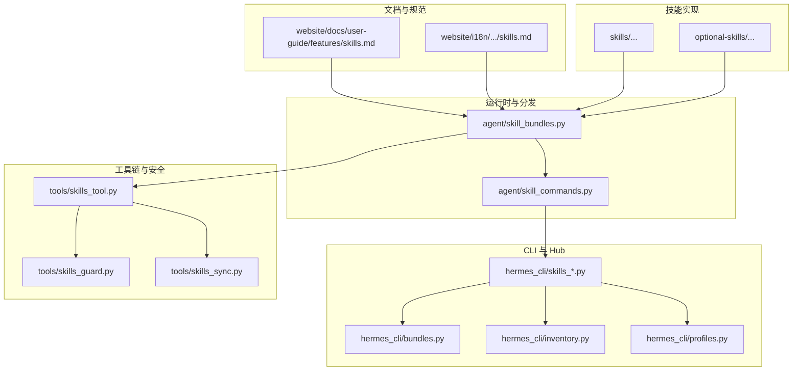
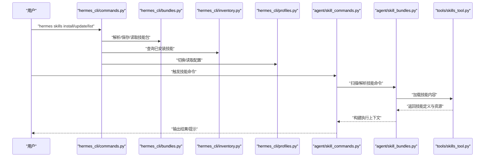
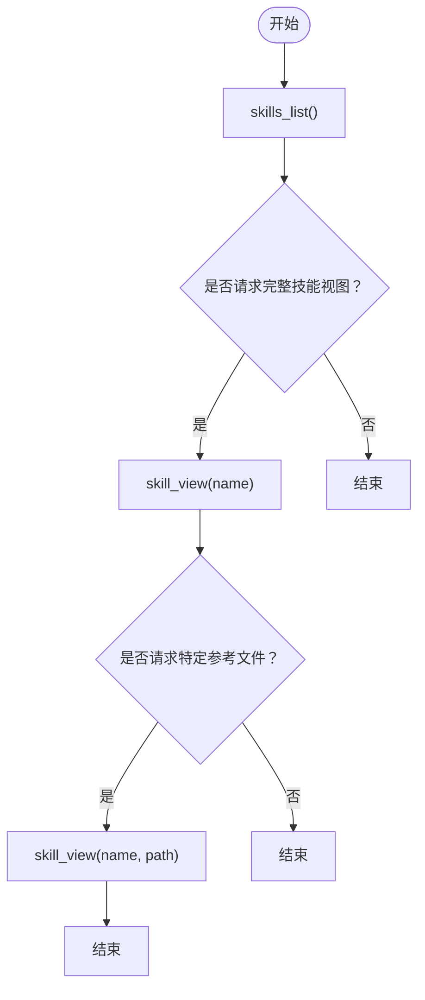
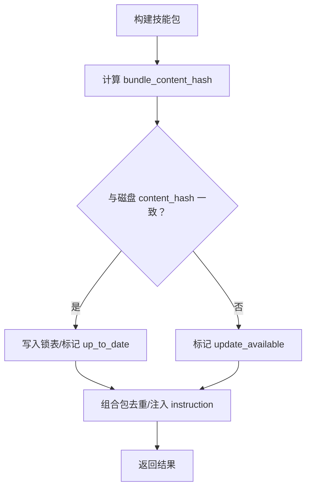
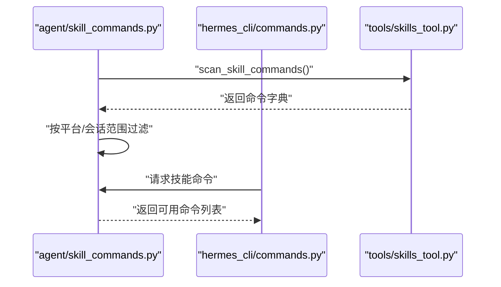
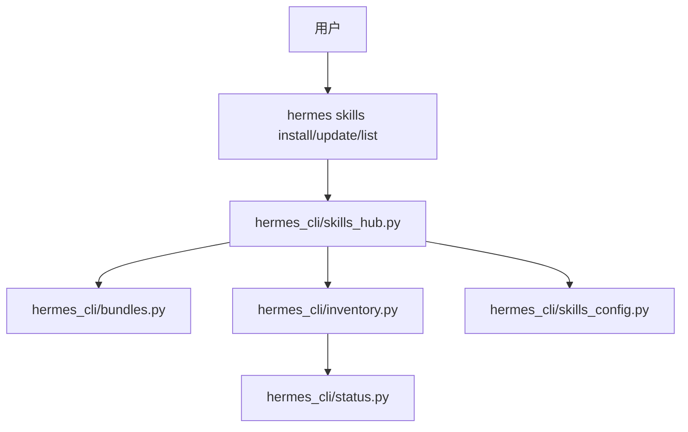
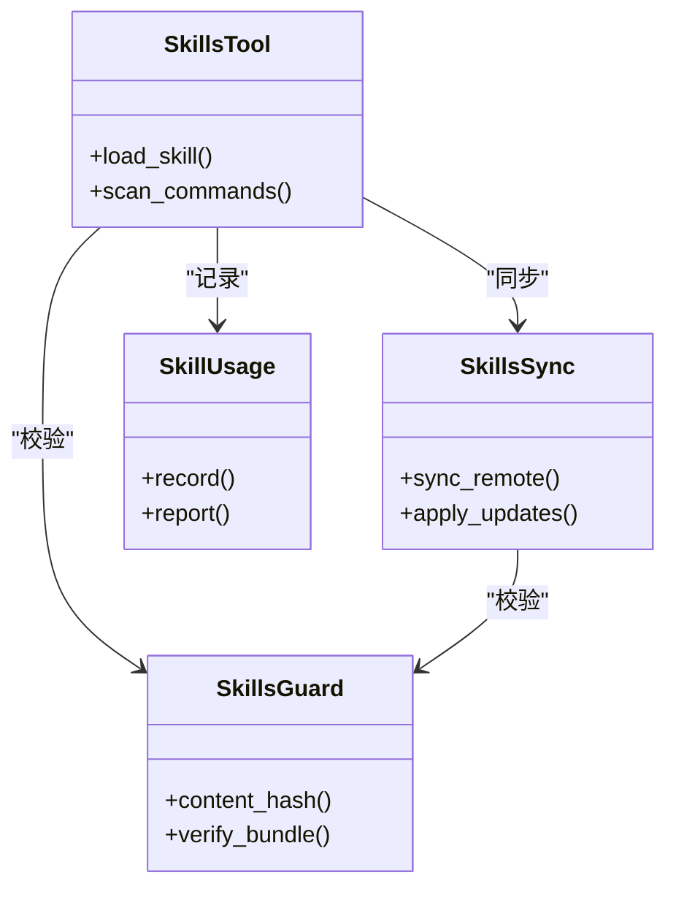
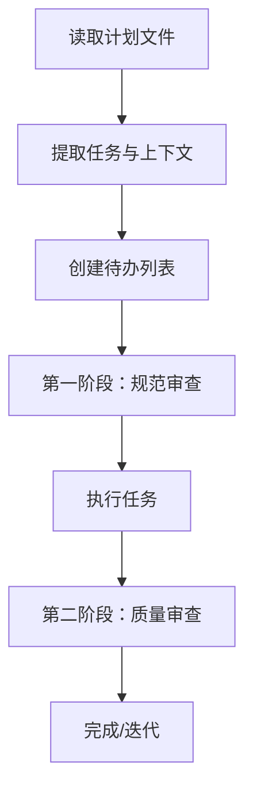
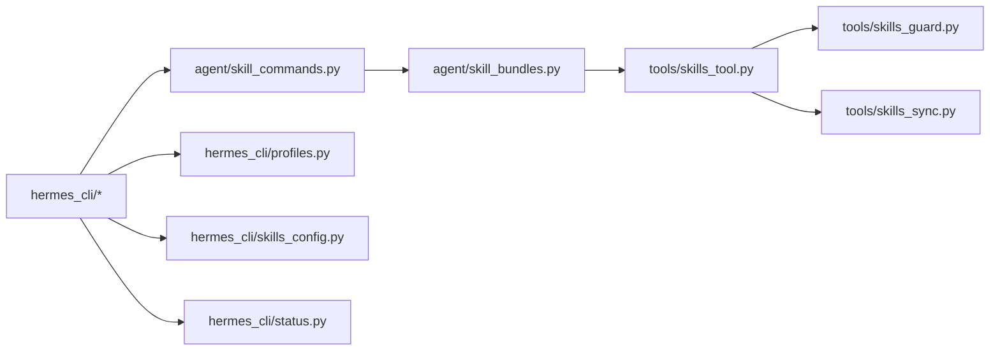

# 技能开发

<cite>
**本文引用的文件**
- [skills.md](file://website/docs/user-guide/features/skills.md)
- [skills.md（中文）](file://website/i18n/zh-Hans/docusaurus-plugin-content-docs/current/user-guide/features/skills.md)
- [SKILL.md（子代理驱动开发）](file://optional-skills/software-development/subagent-driven-development/SKILL.md)
- [SKILL.md（对战性UX测试）](file://website/docs/user-guide/skills/optional/dogfood/dogfood-adversarial-ux-test.md)
- [SKILL.md（对战性UX测试 中文）](file://website/i18n/zh-Hans/docusaurus-plugin-content-docs/current/user-guide/skills/optional/dogfood/dogfood-adversarial-ux-test.md)
- [agent/skill_bundles.py](file://agent/skill_bundles.py)
- [tests/agent/test_skill_bundles.py](file://tests/agent/test_skill_bundles.py)
- [tests/tools/test_skills_hub.py](file://tests/tools/test_skills_hub.py)
- [tests/tools/test_pr_6656_regressions.py](file://tests/tools/test_pr_6656_regressions.py)
- [agent/skill_commands.py](file://agent/skill_commands.py)
- [cli.py](file://cli.py)
- [hermes_cli/commands.py](file://hermes_cli/commands.py)
- [tools/skills_tool.py](file://tools/skills_tool.py)
- [tools/skill_manager_tool.py](file://tools/skill_manager_tool.py)
- [tools/skills_sync.py](file://tools/skills_sync.py)
- [tools/skills_guard.py](file://tools/skills_guard.py)
- [tools/skill_usage.py](file://tools/skill_usage.py)
- [tools/skill_provenance.py](file://tools/skill_provenance.py)
- [hermes_cli/skills_config.py](file://hermes_cli/skills_config.py)
- [hermes_cli/skills_hub.py](file://hermes_cli/skills_hub.py)
- [hermes_cli/bundles.py](file://hermes_cli/bundles.py)
- [hermes_cli/inventory.py](file://hermes_cli/inventory.py)
- [hermes_cli/profiles.py](file://hermes_cli/profiles.py)
- [hermes_cli/plugins.py](file://hermes_cli/plugins.py)
- [hermes_cli/tools_config.py](file://hermes_cli/tools_config.py)
- [hermes_cli/middleware.py](file://hermes_cli/middleware.py)
- [hermes_cli/debug.py](file://hermes_cli/debug.py)
- [hermes_cli/status.py](file://hermes_cli/status.py)
- [hermes_cli/logs.py](file://hermes_cli/logs.py)
- [hermes_cli/doctor.py](file://hermes_cli/doctor.py)
- [hermes_cli/setup.py](file://hermes_cli/setup.py)
- [hermes_cli/cron.py](file://hermes_cli/cron.py)
- [hermes_cli/kanban.py](file://hermes_cli/kanban.py)
- [hermes_cli/backup.py](file://hermes_cli/backup.py)
- [hermes_cli/webhook.py](file://hermes_cli/webhook.py)
- [hermes_cli/browser_connect.py](file://hermes_cli/browser_connect.py)
- [hermes_cli/pairing.py](file://hermes_cli/pairing.py)
- [hermes_cli/timeouts.py](file://hermes_cli/timeouts.py)
- [hermes_cli/psutil_android.py](file://hermes_cli/psutil_android.py)
- [hermes_cli/managed_uv.py](file://hermes_cli/managed_uv.py)
- [hermes_cli/runtime_provider.py](file://hermes_cli/runtime_provider.py)
- [hermes_cli/model_catalog.py](file://hermes_cli/model_catalog.py)
- [hermes_cli/models.py](file://hermes_cli/models.py)
- [hermes_cli/model_switch.py](file://hermes_cli/model_switch.py)
- [hermes_cli/model_normalize.py](file://hermes_cli/model_normalize.py)
- [hermes_cli/codex_runtime_switch.py](file://hermes_cli/codex_runtime_switch.py)
- [hermes_cli/codex_runtime_plugin_migration.py](file://hermes_cli/codex_runtime_plugin_migration.py)
- [hermes_cli/azure_detect.py](file://hermes_cli/azure_detect.py)
- [hermes_cli/copilot_auth.py](file://hermes_cli/copilot_auth.py)
- [hermes_cli/dashboard_auth/](file://hermes_cli/dashboard_auth/)
- [hermes_cli/proxy/](file://hermes_cli/proxy/)
- [hermes_cli/dashboard_register.py](file://hermes_cli/dashboard_register.py)
- [hermes_cli/dashboard_auth/login_page.py](file://hermes_cli/dashboard_auth/login_page.py)
- [hermes_cli/dashboard_auth/cookies.py](file://hermes_cli/dashboard_auth/cookies.py)
- [hermes_cli/dashboard_auth/middleware.py](file://hermes_cli/dashboard_auth/middleware.py)
- [hermes_cli/dashboard_auth/ws_tickets.py](file://hermes_cli/dashboard_auth/ws_tickets.py)
- [hermes_cli/dashboard_auth/registry.py](file://hermes_cli/dashboard_auth/registry.py)
- [hermes_cli/dashboard_auth/routes.py](file://hermes_cli/dashboard_auth/routes.py)
- [hermes_cli/dashboard_auth/audit.py](file://hermes_cli/dashboard_auth/audit.py)
- [hermes_cli/dashboard_auth/base.py](file://hermes_cli/dashboard_auth/base.py)
- [hermes_cli/dashboard_auth/public_paths.py](file://hermes_cli/dashboard_auth/public_paths.py)
- [hermes_cli/dashboard_auth/prefix.py](file://hermes_cli/dashboard_auth/prefix.py)
- [hermes_cli/proxy/cli.py](file://hermes_cli/proxy/cli.py)
- [hermes_cli/proxy/server.py](file://hermes_cli/proxy/server.py)
- [hermes_cli/proxy/adapters/](file://hermes_cli/proxy/adapters/)
- [hermes_cli/proxy/adapters/anp.py](file://hermes_cli/proxy/adapters/anp.py)
- [hermes_cli/proxy/adapters/anthropic.py](file://hermes_cli/proxy/adapters/anthropic.py)
- [hermes_cli/proxy/adapters/bedrock.py](file://hermes_cli/proxy/adapters/bedrock.py)
- [hermes_cli/proxy/adapters/chat_completions.py](file://hermes_cli/proxy/adapters/chat_completions.py)
- [hermes_cli/proxy/adapters/codex.py](file://hermes_cli/proxy/adapters/codex.py)
- [hermes_cli/proxy/adapters/codex_app_server.py](file://hermes_cli/proxy/adapters/codex_app_server.py)
- [hermes_cli/proxy/adapters/codex_event_projector.py](file://hermes_cli/proxy/adapters/codex_event_projector.py)
- [hermes_cli/proxy/adapters/hermes_tools_mcp_server.py](file://hermes_cli/proxy/adapters/hermes_tools_mcp_server.py)
- [hermes_cli/proxy/adapters/types.py](file://hermes_cli/proxy/adapters/types.py)
- [hermes_cli/proxy/adapters/base.py](file://hermes_cli/proxy/adapters/base.py)
- [hermes_cli/proxy/adapters/__init__.py](file://hermes_cli/proxy/adapters/__init__.py)
- [hermes_cli/proxy/adapters/entry.py](file://hermes_cli/proxy/adapters/entry.py)
- [hermes_cli/proxy/adapters/events.py](file://hermes_cli/proxy/adapters/events.py)
- [hermes_cli/proxy/adapters/permissions.py](file://hermes_cli/proxy/adapters/permissions.py)
- [hermes_cli/proxy/adapters/session.py](file://hermes_cli/proxy/adapters/session.py)
- [hermes_cli/proxy/adapters/tools.py](file://hermes_cli/proxy/adapters/tools.py)
- [hermes_cli/proxy/adapters/server.py](file://hermes_cli/proxy/adapters/server.py)
- [hermes_cli/proxy/adapters/auth.py](file://hermes_cli/proxy/adapters/auth.py)
- [hermes_cli/proxy/adapters/edit_approval.py](file://hermes_cli/proxy/adapters/edit_approval.py)
- [hermes_cli/proxy/adapters/entry.py](file://hermes_cli/proxy/adapters/entry.py)
- [hermes_cli/proxy/adapters/events.py](file://hermes_cli/proxy/adapters/events.py)
- [hermes_cli/proxy/adapters/permissions.py](file://hermes_cli/proxy/adapters/permissions.py)
- [hermes_cli/proxy/adapters/session.py](file://hermes_cli/proxy/adapters/session.py)
- [hermes_cli/proxy/adapters/tools.py](file://hermes_cli/proxy/adapters/tools.py)
- [hermes_cli/proxy/adapters/server.py](file://hermes_cli/proxy/adapters/server.py)
- [hermes_cli/proxy/adapters/auth.py](file://hermes_cli/proxy/adapters/auth.py)
- [hermes_cli/proxy/adapters/edit_approval.py](file://hermes_cli/proxy/adapters/edit_approval.py)
- [hermes_cli/proxy/adapters/entry.py](file://hermes_cli/proxy/adapters/entry.py)
- [hermes_cli/proxy/adapters/events.py](file://hermes_cli/proxy/adapters/events.py)
- [hermes_cli/proxy/adapters/permissions.py](file://hermes_cli/proxy/adapters/permissions.py)
- [hermes_cli/proxy/adapters/session.py](file://hermes_cli/proxy/adapters/session.py)
- [hermes_cli/proxy/adapters/tools.py](file://hermes_cli/proxy/adapters/tools.py)
- [hermes_cli/proxy/adapters/server.py](file://hermes_cli/proxy/adapters/server.py)
- [hermes_cli/proxy/adapters/auth.py](file://hermes_cli/proxy/adapters/auth.py)
- [hermes_cli/proxy/adapters/edit_approval.py](file://hermes_cli/proxy/adapters/edit_approval.py)
- [hermes_cli/proxy/adapters/entry.py](file://hermes_cli/proxy/adapters/entry.py)
- [hermes_cli/proxy/adapters/events.py](file://hermes_cli/proxy/adapters/events.py)
- [hermes_cli/proxy/adapters/permissions.py](file://hermes_cli/proxy/adapters/permissions.py)
- [hermes_cli/proxy/adapters/session.py](file://hermes_cli/proxy/adapters/session.py)
- [hermes_cli/proxy/adapters/tools.py](file://hermes_cli/proxy/adapters/tools.py)
- [hermes_cli/proxy/adapters/server.py](file://hermes_cli/proxy/adapters/server.py)
- [hermes_cli/proxy/adapters/auth.py](file://hermes_cli/proxy/adapters/auth.py)
- [hermes_cli/proxy/adapters/edit_approval.py](file://hermes_cli/proxy/adapters/edit_approval.py)
- [hermes_cli/proxy/adapters/entry.py](file://hermes_cli/proxy/adapters/entry.py)
- [hermes_cli/proxy/adapters/events.py](file://hermes_cli/proxy/adapters/events.py)
- [hermes_cli/proxy/adapters/permissions.py](file://hermes_cli/proxy/adapters/permissions.py)
- [hermes_cli/proxy/adapters/session.py](file://hermes_cli/proxy/adapters/session.py)
- [hermes_cli/proxy/adapters/tools.py](file://hermes_cli/proxy/adapters/tools.py)
- [hermes_cli/proxy/adapters/server.py](file://hermes_cli/proxy/adapters/server.py)
- [hermes_cli/proxy/adapters/auth.py](file://hermes_cli/proxy/adapters/auth.py)
- [hermes_cli/proxy/adapters/edit_approval.py](file://hermes_cli/proxy/adapters/edit_approval.py)
- [hermes_cli/proxy/adapters/entry.py](file://hermes_cli/proxy/adapters/entry.py)
- [hermes_cli/proxy/adapters/events.py](file://hermes_cli/proxy/adapters/events.py)
- [hermes_cli/proxy/adapters/permissions.py](file://hermes_cli/proxy/adapters/permissions.py)
- [hermes_cli/proxy/adapters/session.py](file://hermes_cli/proxy/adapters/session.py)
- [hermes_cli/proxy/adapters/tools.py](file://hermes_cli/proxy/adapters/tools.py)
- [hermes_cli/proxy/adapters/server.py](file://hermes_cli/proxy/adapters/server.py)
- [hermes_cli/proxy/adapters/auth.py](file://hermes_cli/proxy/adapters/auth.py)
- [hermes_cli/proxy/adapters/edit_approval.py](file://hermes_cli/proxy/adapters/edit_approval.py)
- [hermes_cli......](file://hermes_cli/proxy/adapters/...)
</cite>

## 目录
1. [简介](#简介)
2. [项目结构](#项目结构)
3. [核心组件](#核心组件)
4. [架构总览](#架构总览)
5. [详细组件分析](#详细组件分析)
6. [依赖关系分析](#依赖关系分析)
7. [性能考量](#性能考量)
8. [故障排查指南](#故障排查指南)
9. [结论](#结论)
10. [附录](#附录)

## 简介
本指南面向希望在 Hermes Agent 上开发“技能”的工程师与创作者，系统讲解技能系统的架构设计、技能定义格式、执行器与分发机制，并给出从需求分析到部署发布的完整流程。文档同时覆盖技能包管理、版本与哈希校验、依赖管理、性能优化、测试框架、调试与可观测性以及用户体验优化建议。

## 项目结构
围绕技能开发的关键目录与模块如下：
- 文档与规范：website/docs 与 i18n 下的技能文档，定义了 SKILL.md 规范与渐进式加载策略
- 技能实现：skills 与 optional-skills 目录下包含大量示例技能，便于对照学习
- 运行时与分发：agent/skill_bundles.py、agent/skill_commands.py 提供技能扫描、命令解析与分发
- CLI 与 Hub：hermes_cli 下的 skills_*、bundles、inventory、profiles 等模块负责安装、同步、配置与状态管理
- 工具链与安全：tools/skills_tool.py、skills_guard.py、skills_sync.py 等负责技能加载、校验、更新与使用追踪

**图表来源**
- [skills.md:67-131](file://website/docs/user-guide/features/skills.md#L67-L131)
- [agent/skill_bundles.py](file://agent/skill_bundles.py)
- [agent/skill_commands.py](file://agent/skill_commands.py)
- [hermes_cli/skills_config.py](file://hermes_cli/skills_config.py)
- [hermes_cli/bundles.py](file://hermes_cli/bundles.py)
- [hermes_cli/inventory.py](file://hermes_cli/inventory.py)
- [hermes_cli/profiles.py](file://hermes_cli/profiles.py)
- [tools/skills_tool.py](file://tools/skills_tool.py)
- [tools/skills_guard.py](file://tools/skills_guard.py)
- [tools/skills_sync.py](file://tools/skills_sync.py)

**章节来源**
- [skills.md:67-131](file://website/docs/user-guide/features/skills.md#L67-L131)
- [skills.md（中文）:37-101](file://website/i18n/zh-Hans/docusaurus-plugin-content-docs/current/user-guide/features/skills.md#L37-L101)

## 核心组件
- 技能定义规范（SKILL.md）
  - 支持元数据字段：名称、描述、版本、平台限制、标签、分类、条件激活（requires_toolsets/fallback_for_toolsets）、配置项等
  - 渐进式加载：skills_list → skill_view → skill_view(name, path)，按需加载，降低上下文开销
- 技能包（SkillBundle）
  - 将技能目录打包为可分发单元，支持内容哈希校验、更新检测与去重
- 技能命令与分发
  - 扫描技能导出的命令，结合平台范围与会话上下文进行动态分发
- CLI 与 Hub
  - 提供安装、卸载、同步、查看状态、配置与调试能力；支持官方与社区源
- 工具链与安全
  - 加载器、校验器、同步器与使用统计，保障技能生态的可信与稳定

**章节来源**
- [skills.md:86-131](file://website/docs/user-guide/features/skills.md#L86-L131)
- [agent/skill_bundles.py](file://agent/skill_bundles.py)
- [agent/skill_commands.py](file://agent/skill_commands.py)
- [hermes_cli/skills_config.py](file://hermes_cli/skills_config.py)
- [hermes_cli/bundles.py](file://hermes_cli/bundles.py)
- [hermes_cli/inventory.py](file://hermes_cli/inventory.py)
- [hermes_cli/profiles.py](file://hermes_cli/profiles.py)
- [tools/skills_tool.py](file://tools/skills_tool.py)
- [tools/skills_guard.py](file://tools/skills_guard.py)
- [tools/skills_sync.py](file://tools/skills_sync.py)

## 架构总览
技能系统由“定义—加载—分发—执行—反馈”闭环构成。用户通过 CLI 或聊天界面触发技能，系统根据平台与会话上下文选择合适命令，加载技能内容并执行，最终记录使用与更新状态。

**图表来源**
- [hermes_cli/commands.py](file://hermes_cli/commands.py)
- [hermes_cli/bundles.py](file://hermes_cli/bundles.py)
- [hermes_cli/inventory.py](file://hermes_cli/inventory.py)
- [hermes_cli/profiles.py](file://hermes_cli/profiles.py)
- [agent/skill_commands.py](file://agent/skill_commands.py)
- [agent/skill_bundles.py](file://agent/skill_bundles.py)
- [tools/skills_tool.py](file://tools/skills_tool.py)

## 详细组件分析

### 组件一：技能定义与渐进式加载
- SKILL.md 元数据字段
  - 必填：name、description
  - 可选：version、platforms、metadata.hermes.tags、metadata.hermes.category、metadata.hermes.fallback_for_toolsets、metadata.hermes.requires_toolsets、metadata.hermes.config
- 渐进式加载
  - Level 0：skills_list() 返回简要清单
  - Level 1：skill_view(name) 返回完整内容与元数据
  - Level 2：skill_view(name, path) 返回指定参考文件
- 平台限制
  - 通过 platforms 字段限定在 macOS、Linux、Windows 等平台

**图表来源**
- [skills.md:74-84](file://website/docs/user-guide/features/skills.md#L74-L84)

**章节来源**
- [skills.md:86-131](file://website/docs/user-guide/features/skills.md#L86-L131)
- [skills.md（中文）:56-101](file://website/i18n/zh-Hans/docusaurus-plugin-content-docs/current/user-guide/features/skills.md#L56-L101)

### 组件二：技能包与内容哈希
- 技能包（SkillBundle）
  - 包含技能目录内所有文件，用于分发与安装
  - 支持内容哈希（bundle_content_hash）与磁盘哈希（content_hash）一致性校验
- 去重与指令注入
  - 同一技能在组合包中自动去重
  - 可为组合包注入全局 instruction，作为调用前提示
- 更新检测
  - 通过锁表与远端源对比 content_hash，识别“可更新”或“最新”

**图表来源**
- [tests/tools/test_skills_hub.py:1179-1280](file://tests/tools/test_skills_hub.py#L1179-L1280)
- [tests/agent/test_skill_bundles.py:242-261](file://tests/agent/test_skill_bundles.py#L242-L261)

**章节来源**
- [tests/tools/test_skills_hub.py:1179-1280](file://tests/tools/test_skills_hub.py#L1179-L1280)
- [tests/agent/test_skill_bundles.py:242-261](file://tests/agent/test_skill_bundles.py#L242-L261)
- [tests/tools/test_pr_6656_regressions.py:180-202](file://tests/tools/test_pr_6656_regressions.py#L180-L202)

### 组件三：技能命令扫描与分发
- 命令扫描
  - 根据平台范围与会话上下文重新扫描，避免不必要的重复
- 分发策略
  - 结合 requires_toolsets 与 fallback_for_toolsets 实现条件激活
  - 优先级：快捷命令 > 技能命令

**图表来源**
- [agent/skill_commands.py:262-332](file://agent/skill_commands.py#L262-L332)
- [hermes_cli/commands.py:1177-1185](file://hermes_cli/commands.py#L1177-L1185)

**章节来源**
- [agent/skill_commands.py:262-332](file://agent/skill_commands.py#L262-L332)
- [hermes_cli/commands.py:1177-1185](file://hermes_cli/commands.py#L1177-L1185)
- [tests/agent/test_skill_commands.py:153-307](file://tests/agent/test_skill_commands.py#L153-L307)

### 组件四：CLI 与 Hub（安装、同步、配置）
- 安装与卸载
  - 支持从官方与社区源安装/卸载技能
  - 卸载后清理相关文件
- 同步与更新
  - 自动检查更新并提示
- 配置与状态
  - 通过 profiles 与 skills_config 管理配置项
  - 通过 inventory 查看已安装技能与状态

**图表来源**
- [hermes_cli/skills_hub.py](file://hermes_cli/skills_hub.py)
- [hermes_cli/bundles.py](file://hermes_cli/bundles.py)
- [hermes_cli/inventory.py](file://hermes_cli/inventory.py)
- [hermes_cli/skills_config.py](file://hermes_cli/skills_config.py)
- [hermes_cli/status.py](file://hermes_cli/status.py)

**章节来源**
- [hermes_cli/skills_hub.py](file://hermes_cli/skills_hub.py)
- [hermes_cli/bundles.py](file://hermes_cli/bundles.py)
- [hermes_cli/inventory.py](file://hermes_cli/inventory.py)
- [hermes_cli/skills_config.py](file://hermes_cli/skills_config.py)
- [hermes_cli/status.py](file://hermes_cli/status.py)

### 组件五：工具链与安全（加载、校验、使用追踪）
- 加载器
  - 从技能目录加载定义与资源
- 校验器
  - 通过 content_hash 校验完整性与一致性
- 同步器
  - 与 Hub 协作，确保本地与远端一致
- 使用追踪
  - 记录使用次数、路径与来源，辅助优化与审计

**图表来源**
- [tools/skills_tool.py](file://tools/skills_tool.py)
- [tools/skills_guard.py](file://tools/skills_guard.py)
- [tools/skills_sync.py](file://tools/skills_sync.py)
- [tools/skill_usage.py](file://tools/skill_usage.py)

**章节来源**
- [tools/skills_tool.py](file://tools/skills_tool.py)
- [tools/skills_guard.py](file://tools/skills_guard.py)
- [tools/skills_sync.py](file://tools/skills_sync.py)
- [tools/skill_usage.py](file://tools/skill_usage.py)

### 组件六：示例技能（创意/开发/研究/生产力）
- 子代理驱动开发（开发类）
  - 通过 fresh subagent + 两阶段审查实现高质量、快速迭代
  - 示例：任务提取、待办列表构建、审查流程
- 对战性 UX 测试（测试/质量保障）
  - 以最抗拒技术的用户视角进行体验测试，过滤噪音，生成可执行工单

**图表来源**
- [SKILL.md（子代理驱动开发）:36-52](file://optional-skills/software-development/subagent-driven-development/SKILL.md#L36-L52)

**章节来源**
- [SKILL.md（子代理驱动开发）:1-52](file://optional-skills/software-development/subagent-driven-development/SKILL.md#L1-L52)
- [SKILL.md（对战性UX测试）:1-36](file://website/docs/user-guide/skills/optional/dogfood/dogfood-adversarial-ux-test.md#L1-L36)
- [SKILL.md（对战性UX测试 中文）:1-36](file://website/i18n/zh-Hans/docusaurus-plugin-content-docs/current/user-guide/skills/optional/dogfood/dogfood-adversarial-ux-test.md#L1-L36)

## 依赖关系分析
- 组件耦合
  - agent/skill_bundles.py 与 tools/skills_tool.py 强耦合，前者负责包与命令，后者负责加载与资源
  - hermes_cli/* 与 agent/* 通过命令接口交互，形成清晰边界
- 外部依赖
  - CLI 与 Hub 依赖配置与状态模块（profiles、skills_config、status）
  - 测试覆盖了哈希一致性、组合包去重与更新检测

**图表来源**
- [agent/skill_bundles.py](file://agent/skill_bundles.py)
- [agent/skill_commands.py](file://agent/skill_commands.py)
- [tools/skills_tool.py](file://tools/skills_tool.py)
- [tools/skills_guard.py](file://tools/skills_guard.py)
- [tools/skills_sync.py](file://tools/skills_sync.py)
- [hermes_cli/profiles.py](file://hermes_cli/profiles.py)
- [hermes_cli/skills_config.py](file://hermes_cli/skills_config.py)
- [hermes_cli/status.py](file://hermes_cli/status.py)

**章节来源**
- [tests/agent/test_skill_bundles.py:1-279](file://tests/agent/test_skill_bundles.py#L1-L279)
- [tests/tools/test_skills_hub.py:1179-1280](file://tests/tools/test_skills_hub.py#L1179-L1280)

## 性能考量
- 渐进式加载
  - 仅在需要时加载完整技能内容，减少上下文占用与延迟
- 命令扫描缓存
  - 当平台范围与会话上下文未变化时避免重复扫描
- 哈希校验与去重
  - 通过内容哈希与组合包去重，降低冗余与 IO 开销
- 平台与工具集条件激活
  - 仅在满足 requires_toolsets/fallback_for_toolsets 时加载，避免无关命令参与分发

**章节来源**
- [skills.md:74-84](file://website/docs/user-guide/features/skills.md#L74-L84)
- [agent/skill_commands.py:262-332](file://agent/skill_commands.py#L262-L332)
- [tests/agent/test_skill_bundles.py:242-261](file://tests/agent/test_skill_bundles.py#L242-L261)
- [tests/tools/test_skills_hub.py:1179-1280](file://tests/tools/test_skills_hub.py#L1179-L1280)

## 故障排查指南
- 卸载失败或残留
  - 确认卸载流程与文件清理逻辑
- 组合包哈希不一致
  - 检查文件名与内容是否发生交换，确保 bundle_content_hash 与 content_hash 对齐
- 更新检测异常
  - 核对锁表中的 content_hash 与远端 fetch 的一致性
- 命令扫描未更新
  - 检查平台范围与会话上下文变更是否触发重新扫描

**章节来源**
- [tests/tools/test_pr_6656_regressions.py:167-202](file://tests/tools/test_pr_6656_regressions.py#L167-L202)
- [tests/tools/test_skills_hub.py:1230-1280](file://tests/tools/test_skills_hub.py#L1230-L1280)
- [tests/agent/test_skill_commands.py:153-307](file://tests/agent/test_skill_commands.py#L153-L307)

## 结论
Hermes 技能系统以“定义—加载—分发—执行—反馈”为核心闭环，通过 SKILL.md 规范、技能包与内容哈希、命令扫描与条件激活、CLI 与 Hub 的协同，以及工具链与安全模块的保障，实现了可扩展、可维护、可审计的技能生态。开发者可据此流程高效产出高质量技能，并通过测试与调试工具持续优化用户体验与性能。

## 附录
- 技能开发流程（建议）
  - 需求分析：明确目标、场景、平台与工具集要求
  - 选择模板：参考 SKILL.md 规范与现有示例（如子代理驱动开发、对战性 UX 测试）
  - 代码实现：实现命令与执行逻辑，确保可复现与最小化副作用
  - 配置文件：在 metadata.hermes.config 中声明必要配置项
  - 测试验证：利用测试用例与哈希校验确保一致性与稳定性
  - 部署发布：通过 hermes_cli 完成安装、同步与状态检查
- 性能优化建议
  - 使用渐进式加载与条件激活
  - 合理拆分命令与资源，避免一次性加载过多内容
  - 利用组合包去重与哈希校验，减少冗余与 IO
- 用户体验优化
  - 明确 When to Use 与 Procedure，提供清晰的验证步骤
  - 通过 metadata.hermes.tags 与 category 提升发现性
  - 使用 platforms 限制与 requires_toolsets/fallback_for_toolsets 提升匹配精度