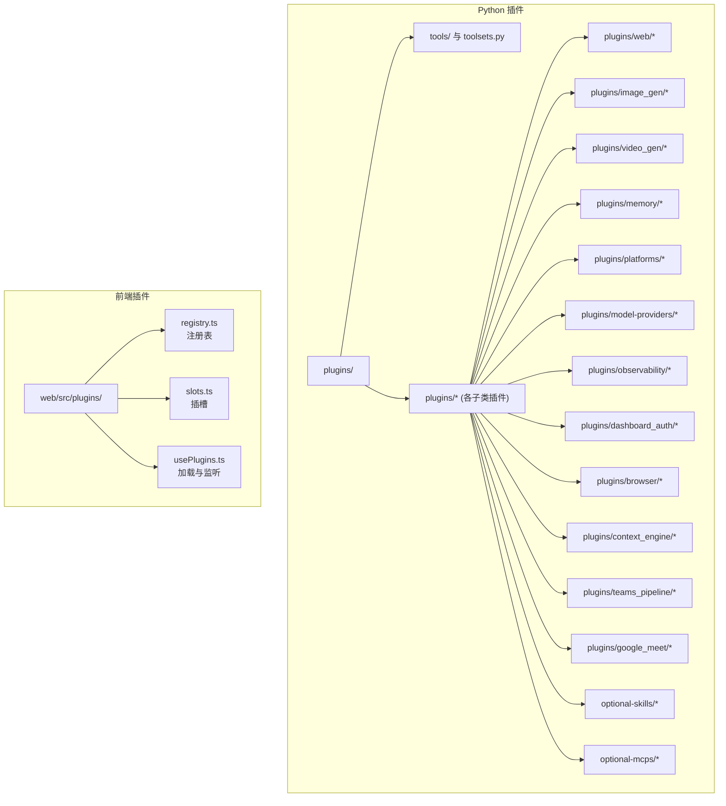
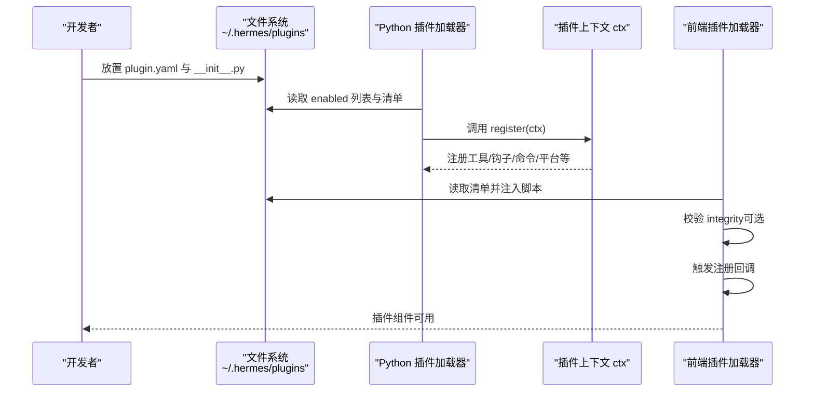
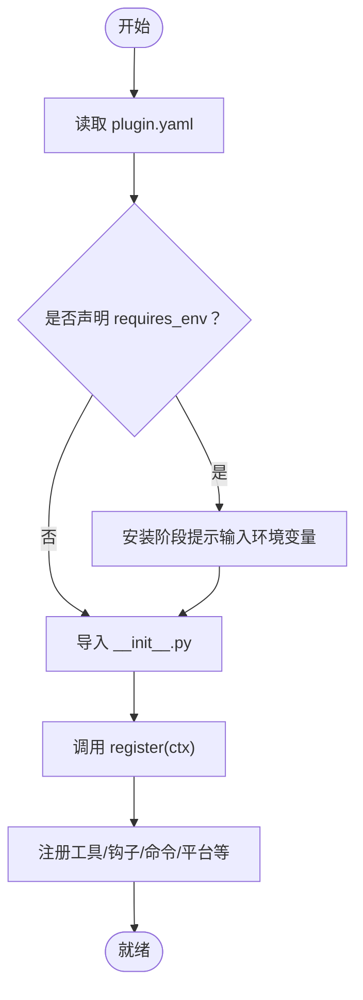
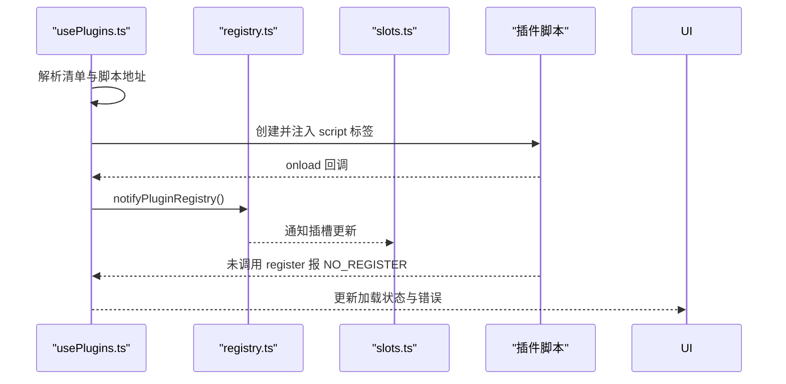
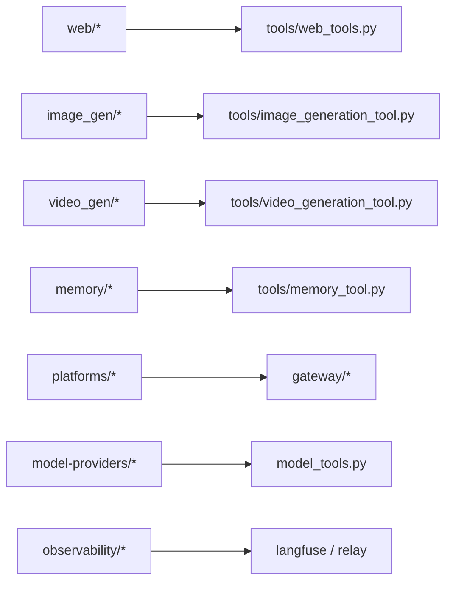

# 插件开发

<cite>
**本文引用的文件**
- [plugins 目录结构](file://plugins)
- [插件清单样例：disk-cleanup/plugin.yaml](file://plugins/disk-cleanup/plugin.yaml)
- [插件入口样例：disk-cleanup/__init__.py](file://plugins/disk-cleanup/__init__.py)
- [插件清理脚本：disk-cleanup/disk_cleanup.py](file://plugins/disk-cleanup/disk_cleanup.py)
- [插件清单样例：spotify/plugin.yaml](file://plugins/spotify/plugin.yaml)
- [插件工具样例：spotify/tools.py](file://plugins/spotify/tools.py)
- [插件清单样例：teams_pipeline/plugin.yaml](file://plugins/teams_pipeline/plugin.yaml)
- [插件运行时样例：teams_pipeline/runtime.py](file://plugins/teams_pipeline/runtime.py)
- [插件清单样例：google_meet/plugin.yaml](file://plugins/google_meet/plugin.yaml)
- [插件工具样例：google_meet/tools.py](file://plugins/google_meet/tools.py)
- [插件清单样例：security-guidance/plugin.yaml](file://plugins/security-guidance/plugin.yaml)
- [插件模式样例：security-guidance/patterns.py](file://plugins/security-guidance/patterns.py)
- [插件清单样例：web/searxng/plugin.yaml](file://plugins/web/searxng/plugin.yaml)
- [插件清单样例：image_gen/openai/plugin.yaml](file://plugins/image_gen/openai/plugin.yaml)
- [插件清单样例：video_gen/fal/plugin.yaml](file://plugins/video_gen/fal/plugin.yaml)
- [插件清单样例：memory/mem0/plugin.yaml](file://plugins/memory/mem0/plugin.yaml)
- [插件清单样例：platforms/discord/plugin.yaml](file://plugins/platforms/discord/plugin.yaml)
- [插件清单样例：model-providers/gemini/plugin.yaml](file://plugins/model-providers/gemini/plugin.yaml)
- [插件清单样例：observability/langfuse/plugin.yaml](file://plugins/observability/langfuse/plugin.yaml)
- [插件清单样例：dashboard_auth/basic/plugin.yaml](file://plugins/dashboard_auth/basic/plugin.yaml)
- [插件清单样例：kanban/systemd/hermes-kanban-dispatcher.service](file://plugins/kanban/systemd/hermes-kanban-dispatcher.service)
- [插件清单样例：browser/browser_use/plugin.yaml](file://plugins/browser/browser_use/plugin.yaml)
- [插件清单样例：browser/firecrawl/plugin.yaml](file://plugins/browser/firecrawl/plugin.yaml)
- [插件清单样例：browser/browserbase/plugin.yaml](file://plugins/browser/browserbase/plugin.yaml)
- [插件清单样例：context_engine/__init__.py](file://plugins/context_engine/__init__.py)
- [插件清单样例：hermes-achievements/dashboard/plugin_api.py](file://plugins/hermes-achievements/dashboard/plugin_api.py)
- [插件清单样例：hermes-achievements/docs/achievements-performance-implementation-spec.md](file://plugins/hermes-achievements/docs/achievements-performance-implementation-spec.md)
- [插件清单样例：optional-mcps/linear/manifest.yaml](file://optional-mcps/linear/manifest.yaml)
- [插件清单样例：optional-mcps/n8n/manifest.yaml](file://optional-mcps/n8n/manifest.yaml)
- [插件清单样例：optional-skills/DESCRIPTION.md](file://optional-skills/DESCRIPTION.md)
- [插件清单样例：optional-skills/software-development/hermes-agent-skill-authoring/SKILL.md](file://optional-skills/software-development/hermes-agent-skill-authoring/SKILL.md)
- [插件清单样例：optional-skills/research/searxng-search/SKILL.md](file://optional-skills/research/searxng-search/SKILL.md)
- [插件清单样例：optional-skills/productivity/powerpoint/SKILL.md](file://optional-skills/productivity/powerpoint/SKILL.md)
- [插件清单样例：optional-skills/creative/concept-diagrams/SKILL.md](file://optional-skills/creative/concept-diagrams/SKILL.md)
- [插件清单样例：optional-skills/security/web-pentest/SKILL.md](file://optional-skills/security/web-pentest/SKILL.md)
- [插件清单样例：optional-skills/devops/cli/SKILL.md](file://optional-skills/devops/cli/SKILL.md)
- [插件清单样例：optional-skills/mlops/training/SKILL.md](file://optional-skills/mlops/training/SKILL.md)
- [插件清单样例：optional-skills/finance/stocks/SKILL.md](file://optional-skills/finance/stocks/SKILL.md)
- [插件清单样例：optional-skills/health/neuroskill-bci/SKILL.md](file://optional-skills/health/neuroskill-bci/SKILL.md)
- [插件清单样例：optional-skills/migration/openclaw-migration/SKILL.md](file://optional-skills/migration/openclaw-migration/SKILL.md)
- [插件清单样例：optional-skills/software-development/subagent-driven-development/SKILL.md](file://optional-skills/software-development/subagent-driven-development/SKILL.md)
- [插件清单样例：optional-skills/communication/one-three-one-rule/SKILL.md](file://optional-skills/communication/one-three-one-rule/SKILL.md)
- [插件清单样例：optional-skills/email/agentmail/SKILL.md](file://optional-skills/email/agentmail/SKILL.md)
- [插件清单样例：optional-skills/gaming/minecraft-modpack-server/SKILL.md](file://optional-skills/gaming/minecraft-modpack-server/SKILL.md)
- [插件清单样例：optional-skills/dogfood/adversarial-ux-test/SKILL.md](file://optional-skills/dogfood/adversarial-ux-test/SKILL.md)
- [插件清单样例：optional-skills/mcp/fastmcp/SKILL.md](file://optional-skills/mcp/fastmcp/SKILL.md)
- [插件清单样例：optional-skills/mlops/inference/outlines/SKILL.md](file://optional-skills/mlops/inference/outlines/SKILL.md)
- [插件清单样例：optional-skills/mlops/ml-training/SKILL.md](file://optional-skills/mlops/ml-training/SKILL.md)
- [插件清单样例：optional-skills/mlops/accelerate/SKILL.md](file://optional-skills/mlops/accelerate/SKILL.md)
- [插件清单样例：optional-skills/mlops/chroma/SKILL.md](file://optional-skills/mlops/chroma/SKILL.md)
- [插件清单样例：optional-skills/mlops/faiss/SKILL.md](file://optional-skills/mlops/faiss/SKILL.md)
- [插件清单样例：optional-skills/mlops/flash-attention/SKILL.md](file://optional-skills/mlops/flash-attention/SKILL.md)
- [插件清单样例：optional-skills/mlops/lambdalabs/SKILL.md](file://optional-skills/mlops/lambdalabs/SKILL.md)
- [插件清单样例：optional-skills/mlops/nemo-curator/SKILL.md](file://optional-skills/mlops/nemo-curator/SKILL.md)
- [插件清单样例：optional-skills/mlops/simpo/SKILL.md](file://optional-skills/mlops/simpo/SKILL.md)
- [插件清单样例：optional-skills/mlops/stable-diffusion/SKILL.md](file://optional-skills/mlops/stable-diffusion/SKILL.md)
- [插件清单样例：optional-skills/mlops/tensorrt-llm/SKILL.md](file://optional-skills/mlops/tensorrt-llm/SKILL.md)
- [plugindoc 语言文档：plugins.md](file://website/docs/user-guide/features/plugins.md)
- [plugindoc 语言文档：plugins.md（中文）](file://website/i18n/zh-Hans/docusaurus-plugin-content-docs/current/user-guide/features/plugins.md)
- [CLI 插件命令：hermes_cli/plugins.py](file://hermes_cli/plugins.py)
- [CLI 插件命令：hermes_cli/plugins_cmd.py](file://hermes_cli/plugins_cmd.py)
- [测试插件：tests/hermes_cli/test_plugins.py](file://tests/hermes_cli/test_plugins.py)
- [测试插件：tests/fixtures/plugins/example-dashboard/dashboard/plugin_api.py](file://tests/fixtures/plugins/example-dashboard/dashboard/plugin_api.py)
- [测试插件：tests/fixtures/plugins/example-dashboard/dashboard/manifest.json](file://tests/fixtures/plugins/example-dashboard/dashboard/manifest.json)
- [前端插件注册：web/src/plugins/registry.ts](file://web/src/plugins/registry.ts)
- [前端插件注册：web/src/plugins/slots.ts](file://web/src/plugins/slots.ts)
- [前端插件注册：web/src/plugins/usePlugins.ts](file://web/src/plugins/usePlugins.ts)
</cite>

## 目录
1. [简介](#简介)
2. [项目结构](#项目结构)
3. [核心组件](#核心组件)
4. [架构总览](#架构总览)
5. [详细组件分析](#详细组件分析)
6. [依赖分析](#依赖分析)
7. [性能考量](#性能考量)
8. [故障排查指南](#故障排查指南)
9. [结论](#结论)
10. [附录](#附录)

## 简介
本指南面向希望为 Hermes Agent 开发插件的开发者，系统讲解插件系统的架构设计、插件注册机制、依赖管理与配置解析方式，并覆盖工具类插件（搜索引擎、图像生成、语音服务）、平台类插件（消息平台、通知插件）、内存类插件（记忆存储方案）等不同类型的开发流程与规范。文档同时提供插件模板、开发工具、测试方法与调试技巧，以及最佳实践示例，帮助开发者从概念设计到发布全流程落地。

## 项目结构
Hermes 的插件体系由“Python 插件”和“前端插件”两部分组成：
- Python 插件：位于 plugins/ 目录下，遵循 plugin.yaml 清单 + __init__.py 注册函数 + 工具/适配器实现的约定。
- 前端插件：位于 web/src/plugins/ 下，负责动态加载、注册组件与插槽（slot）渲染。

图表来源
- [plugins 目录结构](file://plugins)
- [前端插件注册：web/src/plugins/registry.ts](file://web/src/plugins/registry.ts)
- [前端插件注册：web/src/plugins/slots.ts](file://web/src/plugins/slots.ts)
- [前端插件注册：web/src/plugins/usePlugins.ts](file://web/src/plugins/usePlugins.ts)

章节来源
- [plugins 目录结构](file://plugins)
- [前端插件注册：web/src/plugins/registry.ts](file://web/src/plugins/registry.ts)
- [前端插件注册：web/src/plugins/slots.ts](file://web/src/plugins/slots.ts)
- [前端插件注册：web/src/plugins/usePlugins.ts](file://web/src/plugins/usePlugins.ts)

## 核心组件
- 插件清单（plugin.yaml）：声明插件元数据、能力要求（如 requires_env）、入口模块等。
- 注册入口（__init__.py）：实现 register(ctx) 函数，向上下文注册工具、钩子、命令、平台适配器、提供方等。
- 工具与适配器：具体业务逻辑实现，如搜索引擎、图像生成、语音合成、会议工具等。
- 前端注册表（registry.ts）：维护已注册组件映射，支持错误状态与变更通知。
- 插槽系统（slots.ts）：按插槽名称聚合多个插件组件，支持热更新替换。
- 插件加载器（usePlugins.ts）：动态注入脚本、校验完整性、监听注册完成。

章节来源
- [插件清单样例：disk-cleanup/plugin.yaml](file://plugins/disk-cleanup/plugin.yaml)
- [插件入口样例：disk-cleanup/__init__.py](file://plugins/disk-cleanup/__init__.py)
- [前端插件注册：web/src/plugins/registry.ts](file://web/src/plugins/registry.ts)
- [前端插件注册：web/src/plugins/slots.ts](file://web/src/plugins/slots.ts)
- [前端插件注册：web/src/plugins/usePlugins.ts](file://web/src/plugins/usePlugins.ts)

## 架构总览
Hermes 插件系统分为三层：
- 插件定义层：plugin.yaml + __init__.py + 实现模块。
- 插件装载层：Python 端扫描 enabled 列表，加载插件；前端根据清单动态注入脚本。
- 插件运行层：注册工具/钩子/命令/平台适配器等，参与工具调度、消息注入、平台交互等。

图表来源
- [plugindoc 语言文档：plugins.md](file://website/docs/user-guide/features/plugins.md)
- [plugindoc 语言文档：plugins.md（中文）](file://website/i18n/zh-Hans/docusaurus-plugin-content-docs/current/user-guide/features/plugins.md)
- [前端插件注册：web/src/plugins/usePlugins.ts](file://web/src/plugins/usePlugins.ts)

## 详细组件分析

### Python 插件注册与生命周期
- 清单解析：读取 name、version、description、requires_env 等字段，必要时提示安装阶段输入环境变量。
- 注册函数：在 register(ctx) 中调用 ctx.register_* 完成工具、钩子、命令、平台适配器、提供方等注册。
- 生命周期：插件随 Agent 启动加载，卸载时需确保资源回收（如进程、连接）。

图表来源
- [plugindoc 语言文档：plugins.md](file://website/docs/user-guide/features/plugins.md)
- [plugindoc 语言文档：plugins.md（中文）](file://website/i18n/zh-Hans/docusaurus-plugin-content-docs/current/user-guide/features/plugins.md)

章节来源
- [plugindoc 语言文档：plugins.md](file://website/docs/user-guide/features/plugins.md)
- [plugindoc 语言文档：plugins.md（中文）](file://website/i18n/zh-Hans/docusaurus-plugin-content-docs/current/user-guide/features/plugins.md)

### 前端插件加载与注册
- 动态注入：usePlugins.ts 根据清单生成 script 标签，支持 integrity 校验与跨域设置。
- 注册回调：脚本 onload 后触发 notifyPluginRegistry，前端注册表与插槽系统更新。
- 错误处理：onerror 设置 LOAD_FAILED，超时未注册则标记 NO_REGISTER。

图表来源
- [前端插件注册：web/src/plugins/usePlugins.ts](file://web/src/plugins/usePlugins.ts)
- [前端插件注册：web/src/plugins/registry.ts](file://web/src/plugins/registry.ts)
- [前端插件注册：web/src/plugins/slots.ts](file://web/src/plugins/slots.ts)

章节来源
- [前端插件注册：web/src/plugins/usePlugins.ts](file://web/src/plugins/usePlugins.ts)
- [前端插件注册：web/src/plugins/registry.ts](file://web/src/plugins/registry.ts)
- [前端插件注册：web/src/plugins/slots.ts](file://web/src/plugins/slots.ts)

### 不同类型插件开发规范与实现要点

#### 工具插件：搜索引擎
- 典型实现位置：plugins/web/*
- 关键点：在 register(ctx) 中注册工具 schema 与 handler；处理参数校验与异常；返回标准化结果。
- 示例参考：searxng、ddgs、tavily、exa、firecrawl 等。

章节来源
- [插件清单样例：web/searxng/plugin.yaml](file://plugins/web/searxng/plugin.yaml)

#### 工具插件：图像生成
- 典型实现位置：plugins/image_gen/*
- 关键点：注册图像生成提供方或工具；处理 API 密钥、并发限制、输出格式；支持异步任务轮询。
- 示例参考：openai、fal、krea、xai、openai-codex。

章节来源
- [插件清单样例：image_gen/openai/plugin.yaml](file://plugins/image_gen/openai/plugin.yaml)

#### 工具插件：视频生成
- 典型实现位置：plugins/video_gen/*
- 关键点：对接第三方视频生成服务；实现进度查询与结果下载；注意大文件传输与缓存策略。
- 示例参考：fal、xai。

章节来源
- [插件清单样例：video_gen/fal/plugin.yaml](file://plugins/video_gen/fal/plugin.yaml)

#### 工具插件：语音服务
- 典型实现位置：plugins/spotify、transcription_provider.py、tts_provider.py 等
- 关键点：注册音频/语音工具；处理鉴权、播放/录制、转录/合成；注意权限与隐私。
- 示例参考：spotify 工具集。

章节来源
- [插件清单样例：spotify/plugin.yaml](file://plugins/spotify/plugin.yaml)
- [插件工具样例：spotify/tools.py](file://plugins/spotify/tools.py)

#### 平台插件：消息平台与通知
- 典型实现位置：plugins/platforms/*
- 关键点：注册平台适配器；实现消息收发、事件订阅、身份验证；支持多实例与回拨。
- 示例参考：discord、telegram、slack、ntfy、teams、mattermost、line、irc、google_chat、homeassistant、signal、matrix、weixin、wecom、whatsapp、yuanbao 等。

章节来源
- [插件清单样例：platforms/discord/plugin.yaml](file://plugins/platforms/discord/plugin.yaml)

#### 内存插件：记忆存储方案
- 典型实现位置：plugins/memory/*
- 关键点：实现 MemoryProvider 接口；支持增删改查、分页、索引与检索；注意一致性与性能。
- 示例参考：mem0、retaindb、supermemory、holographic、openviking、byterover、hindsight、honcho。

章节来源
- [插件清单样例：memory/mem0/plugin.yaml](file://plugins/memory/mem0/plugin.yaml)

#### 平台插件：Teams 会议流水线
- 典型实现位置：plugins/teams_pipeline/*
- 关键点：注册 CLI 子命令与运行时；管理会议状态、订阅与存储；与外部 Teams API 协作。
- 示例参考：teams_pipeline。

章节来源
- [插件清单样例：teams_pipeline/plugin.yaml](file://plugins/teams_pipeline/plugin.yaml)
- [插件运行时样例：teams_pipeline/runtime.py](file://plugins/teams_pipeline/runtime.py)

#### 平台插件：Google Meet 集成
- 典型实现位置：plugins/google_meet/*
- 关键点：注册工具与音频桥接；管理会议进程与会话；支持实时通信客户端。
- 示例参考：google_meet。

章节来源
- [插件清单样例：google_meet/plugin.yaml](file://plugins/google_meet/plugin.yaml)
- [插件工具样例：google_meet/tools.py](file://plugins/google_meet/tools.py)

#### 安全与合规插件
- 典型实现位置：plugins/security-guidance/*
- 关键点：提供安全模式与风险模式；记录与报告；与审计流程集成。
- 示例参考：security-guidance。

章节来源
- [插件清单样例：security-guidance/plugin.yaml](file://plugins/security-guidance/plugin.yaml)
- [插件模式样例：security-guidance/patterns.py](file://plugins/security-guidance/patterns.py)

#### 观测性插件
- 典型实现位置：plugins/observability/*
- 关键点：接入链路追踪、指标上报；与 Langfuse、Nemo Relay 等集成。
- 示例参考：langfuse。

章节来源
- [插件清单样例：observability/langfuse/plugin.yaml](file://plugins/observability/langfuse/plugin.yaml)

#### 仪表盘与认证插件
- 典型实现位置：plugins/dashboard_auth/*
- 关键点：提供仪表盘认证与访问控制；支持基本认证与自托管方案。
- 示例参考：basic、self_hosted。

章节来源
- [插件清单样例：dashboard_auth/basic/plugin.yaml](file://plugins/dashboard_auth/basic/plugin.yaml)

#### 浏览器插件
- 典型实现位置：plugins/browser/*
- 关键点：封装浏览器自动化与内容抓取；提供统一接口与错误处理。
- 示例参考：browser_use、firecrawl、browserbase。

章节来源
- [插件清单样例：browser/browser_use/plugin.yaml](file://plugins/browser/browser_use/plugin.yaml)
- [插件清单样例：browser/firecrawl/plugin.yaml](file://plugins/browser/firecrawl/plugin.yaml)
- [插件清单样例：browser/browserbase/plugin.yaml](file://plugins/browser/browserbase/plugin.yaml)

#### 上下文引擎插件
- 典型实现位置：plugins/context_engine/*
- 关键点：实现上下文压缩与检索；与模型上下文长度匹配。
- 示例参考：context_engine。

章节来源
- [插件清单样例：context_engine/__init__.py](file://plugins/context_engine/__init__.py)

#### 成就系统与仪表盘
- 典型实现位置：plugins/hermes-achievements/*
- 关键点：提供成就引擎与前端 API；支持性能实现规范。
- 示例参考：hermes-achievements。

章节来源
- [插件清单样例：hermes-achievements/dashboard/plugin_api.py](file://plugins/hermes-achievements/dashboard/plugin_api.py)
- [插件清单样例：hermes-achievements/docs/achievements-performance-implementation-spec.md](file://plugins/hermes-achievements/docs/achievements-performance-implementation-spec.md)

#### MCP 与技能扩展
- 典型实现位置：optional-mcps/*、optional-skills/*
- 关键点：MCP 插件清单；技能包结构与命名空间；按领域分类的技能集合。
- 示例参考：linear、n8n、software-development/hermes-agent-skill-authoring、research/searxng-search、productivity/powerpoint、creative/concept-diagrams、security/web-pentest、devops/cli、mlops/*、finance/stocks、health/neuroskill-bci、migration/openclaw-migration、mcp/fastmcp 等。

章节来源
- [插件清单样例：optional-mcps/linear/manifest.yaml](file://optional-mcps/linear/manifest.yaml)
- [插件清单样例：optional-mcps/n8n/manifest.yaml](file://optional-mcps/n8n/manifest.yaml)
- [插件清单样例：optional-skills/DESCRIPTION.md](file://optional-skills/DESCRIPTION.md)
- [插件清单样例：optional-skills/software-development/hermes-agent-skill-authoring/SKILL.md](file://optional-skills/software-development/hermes-agent-skill-authoring/SKILL.md)
- [插件清单样例：optional-skills/research/searxng-search/SKILL.md](file://optional-skills/research/searxng-search/SKILL.md)
- [插件清单样例：optional-skills/productivity/powerpoint/SKILL.md](file://optional-skills/productivity/powerpoint/SKILL.md)
- [插件清单样例：optional-skills/creative/concept-diagrams/SKILL.md](file://optional-skills/creative/concept-diagrams/SKILL.md)
- [插件清单样例：optional-skills/security/web-pentest/SKILL.md](file://optional-skills/security/web-pentest/SKILL.md)
- [插件清单样例：optional-skills/devops/cli/SKILL.md](file://optional-skills/devops/cli/SKILL.md)
- [插件清单样例：optional-skills/mlops/training/SKILL.md](file://optional-skills/mlops/training/SKILL.md)
- [插件清单样例：optional-skills/finance/stocks/SKILL.md](file://optional-skills/finance/stocks/SKILL.md)
- [插件清单样例：optional-skills/health/neuroskill-bci/SKILL.md](file://optional-skills/health/neuroskill-bci/SKILL.md)
- [插件清单样例：optional-skills/migration/openclaw-migration/SKILL.md](file://optional-skills/migration/openclaw-migration/SKILL.md)
- [插件清单样例：optional-skills/software-development/subagent-driven-development/SKILL.md](file://optional-skills/software-development/subagent-driven-development/SKILL.md)
- [插件清单样例：optional-skills/communication/one-three-one-rule/SKILL.md](file://optional-skills/communication/one-three-one-rule/SKILL.md)
- [插件清单样例：optional-skills/email/agentmail/SKILL.md](file://optional-skills/email/agentmail/SKILL.md)
- [插件清单样例：optional-skills/gaming/minecraft-modpack-server/SKILL.md](file://optional-skills/gaming/minecraft-modpack-server/SKILL.md)
- [插件清单样例：optional-skills/dogfood/adversarial-ux-test/SKILL.md](file://optional-skills/dogfood/adversarial-ux-test/SKILL.md)
- [插件清单样例：optional-skills/mcp/fastmcp/SKILL.md](file://optional-skills/mcp/fastmcp/SKILL.md)
- [插件清单样例：optional-skills/mlops/inference/outlines/SKILL.md](file://optional-skills/mlops/inference/outlines/SKILL.md)
- [插件清单样例：optional-skills/mlops/ml-training/SKILL.md](file://optional-skills/mlops/ml-training/SKILL.md)
- [插件清单样例：optional-skills/mlops/accelerate/SKILL.md](file://optional-skills/mlops/accelerate/SKILL.md)
- [插件清单样例：optional-skills/mlops/chroma/SKILL.md](file://optional-skills/mlops/chroma/SKILL.md)
- [插件清单样例：optional-skills/mlops/faiss/SKILL.md](file://optional-skills/mlops/faiss/SKILL.md)
- [插件清单样例：optional-skills/mlops/flash-attention/SKILL.md](file://optional-skills/mlops/flash-attention/SKILL.md)
- [插件清单样例：optional-skills/mlops/lambdalabs/SKILL.md](file://optional-skills/mlops/lambdalabs/SKILL.md)
- [插件清单样例：optional-skills/mlops/nemo-curator/SKILL.md](file://optional-skills/mlops/nemo-curator/SKILL.md)
- [插件清单样例：optional-skills/mlops/simpo/SKILL.md](file://optional-skills/mlops/simpo/SKILL.md)
- [插件清单样例：optional-skills/mlops/stable-diffusion/SKILL.md](file://optional-skills/mlops/stable-diffusion/SKILL.md)
- [插件清单样例：optional-skills/mlops/tensorrt-llm/SKILL.md](file://optional-skills/mlops/tensorrt-llm/SKILL.md)

## 依赖分析
- 插件间依赖：不同插件通常相互独立，但可能共享底层工具（如 web/search、image_gen、video_gen）。
- 外部依赖：各插件通过 API 密钥、网络请求与第三方服务交互，需关注速率限制与错误重试。
- 前后端耦合：前端插件通过清单注入脚本，后端插件通过 Python 注册函数暴露能力。

图表来源
- [插件清单样例：web/searxng/plugin.yaml](file://plugins/web/searxng/plugin.yaml)
- [插件清单样例：image_gen/openai/plugin.yaml](file://plugins/image_gen/openai/plugin.yaml)
- [插件清单样例：video_gen/fal/plugin.yaml](file://plugins/video_gen/fal/plugin.yaml)
- [插件清单样例：memory/mem0/plugin.yaml](file://plugins/memory/mem0/plugin.yaml)
- [插件清单样例：platforms/discord/plugin.yaml](file://plugins/platforms/discord/plugin.yaml)
- [插件清单样例：model-providers/gemini/plugin.yaml](file://plugins/model-providers/gemini/plugin.yaml)
- [插件清单样例：observability/langfuse/plugin.yaml](file://plugins/observability/langfuse/plugin.yaml)

## 性能考量
- 工具调用：避免阻塞主线程，合理使用异步与并发；对第三方 API 添加指数退避与超时。
- 缓存策略：对重复查询与生成结果进行缓存；注意缓存失效与一致性。
- 资源释放：及时关闭网络连接、进程句柄；在插件卸载时清理临时文件。
- 前端注入：控制脚本加载数量与大小；启用 integrity 校验降低加载失败概率。

## 故障排查指南
- 插件未加载
  - 检查清单字段与路径；确认已启用插件（plugins.enabled）。
  - 查看前端加载错误：LOAD_FAILED 或 NO_REGISTER。
- 注册失败
  - 确认 __init__.py 中 register(ctx) 正确调用；检查依赖安装。
- 运行时错误
  - 捕获第三方 API 异常；记录上下文与参数；提供降级策略。
- 安全与合规
  - 使用 requires_env 管理密钥；避免明文日志；启用 integrity 校验。

章节来源
- [前端插件注册：web/src/plugins/usePlugins.ts](file://web/src/plugins/usePlugins.ts)
- [前端插件注册：web/src/plugins/registry.ts](file://web/src/plugins/registry.ts)
- [前端插件注册：web/src/plugins/slots.ts](file://web/src/plugins/slots.ts)
- [plugindoc 语言文档：plugins.md](file://website/docs/user-guide/features/plugins.md)
- [plugindoc 语言文档：plugins.md（中文）](file://website/i18n/zh-Hans/docusaurus-plugin-content-docs/current/user-guide/features/plugins.md)

## 结论
Hermes 插件系统以清晰的清单与注册机制为核心，结合前后端协同，实现了强大的扩展能力。开发者可依据本文档的规范与示例，快速构建工具、平台、内存等各类插件，并通过完善的测试与调试流程保障质量与安全。

## 附录

### 插件模板与最佳实践
- 清单模板：包含 name、version、description、requires_env 等字段。
- 注册模板：在 register(ctx) 中注册工具、钩子、命令、平台适配器等。
- 前端模板：通过 window.__HERMES_PLUGINS__ 注册组件与插槽。

章节来源
- [插件清单样例：disk-cleanup/plugin.yaml](file://plugins/disk-cleanup/plugin.yaml)
- [插件入口样例：disk-cleanup/__init__.py](file://plugins/disk-cleanup/__init__.py)
- [前端插件注册：web/src/plugins/registry.ts](file://web/src/plugins/registry.ts)
- [前端插件注册：web/src/plugins/slots.ts](file://web/src/plugins/slots.ts)

### 开发工具与测试方法
- CLI 插件命令：hermes_cli/plugins.py 与 hermes_cli/plugins_cmd.py 提供插件安装、启用、卸载等操作。
- 测试框架：tests/hermes_cli/test_plugins.py 提供插件测试样例与断言。
- 前端测试：tests/fixtures/plugins/example-dashboard/* 提供前端插件测试资产。

章节来源
- [CLI 插件命令：hermes_cli/plugins.py](file://hermes_cli/plugins.py)
- [CLI 插件命令：hermes_cli/plugins_cmd.py](file://hermes_cli/plugins_cmd.py)
- [测试插件：tests/hermes_cli/test_plugins.py](file://tests/hermes_cli/test_plugins.py)
- [测试插件：tests/fixtures/plugins/example-dashboard/dashboard/plugin_api.py](file://tests/fixtures/plugins/example-dashboard/dashboard/plugin_api.py)
- [测试插件：tests/fixtures/plugins/example-dashboard/dashboard/manifest.json](file://tests/fixtures/plugins/example-dashboard/dashboard/manifest.json)

### 调试技巧
- 前端：打开 Network 面板查看脚本加载与完整性校验；利用 onerror 与超时回调定位问题。
- 后端：在 register(ctx) 中增加日志；对工具 handler 添加异常捕获与重试。
- 安全：使用 requires_env 管理敏感信息；启用 integrity 校验防止中间人攻击。

章节来源
- [前端插件注册：web/src/plugins/usePlugins.ts](file://web/src/plugins/usePlugins.ts)
- [plugindoc 语言文档：plugins.md](file://website/docs/user-guide/features/plugins.md)
- [plugindoc 语言文档：plugins.md（中文）](file://website/i18n/zh-Hans/docusaurus-plugin-content-docs/current/user-guide/features/plugins.md)