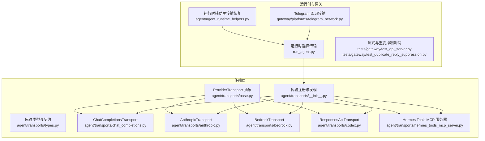
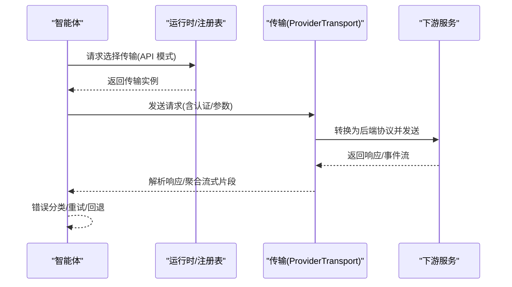
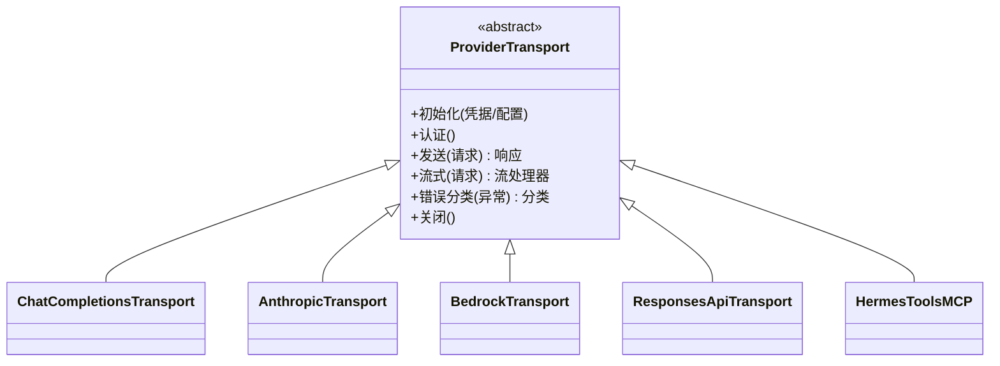
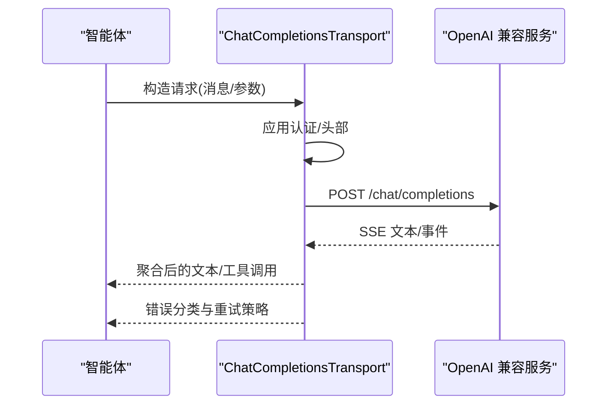
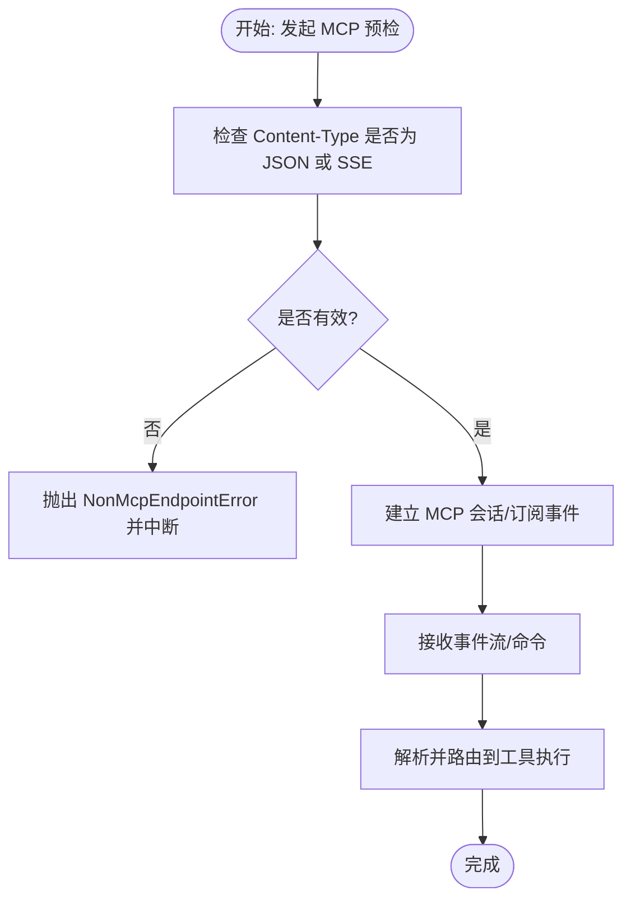
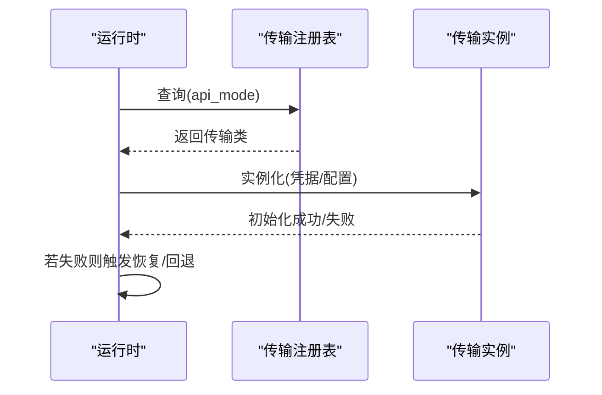
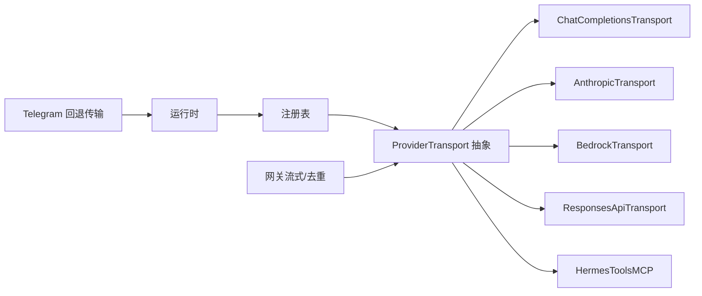

# 自定义传输开发

<cite>
**本文引用的文件**
- [agent/transports/base.py](file://agent/transports/base.py)
- [agent/transports/types.py](file://agent/transports/types.py)
- [agent/transports/chat_completions.py](file://agent/transports/chat_completions.py)
- [agent/transports/anthropic.py](file://agent/transports/anthropic.py)
- [agent/transports/bedrock.py](file://agent/transports/bedrock.py)
- [agent/transports/codex.py](file://agent/transports/codex.py)
- [agent/transports/hermes_tools_mcp_server.py](file://agent/transports/hermes_tools_mcp_server.py)
- [agent/transports/__init__.py](file://agent/transports/__init__.py)
- [agent/agent_runtime_helpers.py](file://agent/agent_runtime_helpers.py)
- [run_agent.py](file://run_agent.py)
- [gateway/platforms/telegram_network.py](file://gateway/platforms/telegram_network.py)
- [hermes_cli/providers.py](file://hermes_cli/providers.py)
- [hermes_cli/mcp_catalog.py](file://hermes_cli/mcp_catalog.py)
- [tests/agent/transports/test_chat_completions.py](file://tests/agent/transports/test_chat_completions.py)
- [tests/agent/transports/test_bedrock_transport.py](file://tests/agent/transports/test_bedrock_transport.py)
- [tests/agent/transports/test_codex_transport.py](file://tests/agent/transports/test_codex_transport.py)
- [tests/agent/transports/test_hermes_tools_mcp_server.py](file://tests/agent/transports/test_hermes_tools_mcp_server.py)
- [tests/gateway/test_api_server.py](file://tests/gateway/test_api_server.py)
- [tests/gateway/test_duplicate_reply_suppression.py](file://tests/gateway/test_duplicate_reply_suppression.py)
- [tests/tools/test_mcp_preflight_content_type.py](file://tests/tools/test_mcp_preflight_content_type.py)
</cite>

## 目录
1. [简介](#简介)
2. [项目结构](#项目结构)
3. [核心组件](#核心组件)
4. [架构总览](#架构总览)
5. [详细组件分析](#详细组件分析)
6. [依赖关系分析](#依赖关系分析)
7. [性能考量](#性能考量)
8. [故障排除指南](#故障排除指南)
9. [结论](#结论)
10. [附录](#附录)

## 简介
本指南面向希望在 Hermes Agent 中开发“自定义传输”的工程师与架构师。传输层是连接上层智能体与下游模型服务（或工具）的关键抽象，负责统一请求/响应协议、认证、流式输出、错误恢复与兼容性适配。本文将系统阐述：
- 传输层架构与适配器模式
- 协议抽象与接口契约
- 自定义传输开发全流程：接口实现、认证集成、请求/响应处理、流式处理与错误恢复
- 设计原则、性能优化、安全与兼容性
- 多类型传输示例：OpenAI 兼容传输、第三方模型传输、私有部署传输
- 测试、调试、监控与排障

## 项目结构
传输层位于 agent/transports 下，围绕 ProviderTransport 抽象构建，提供多种具体传输实现，并通过注册表进行发现与选择。同时，运行时与网关侧提供了回退传输、流式消费与重复抑制等能力。

**图表来源**
- [agent/transports/base.py](file://agent/transports/base.py)
- [agent/transports/types.py](file://agent/transports/types.py)
- [agent/transports/chat_completions.py](file://agent/transports/chat_completions.py)
- [agent/transports/anthropic.py](file://agent/transports/anthropic.py)
- [agent/transports/bedrock.py](file://agent/transports/bedrock.py)
- [agent/transports/codex.py](file://agent/transports/codex.py)
- [agent/transports/hermes_tools_mcp_server.py](file://agent/transports/hermes_tools_mcp_server.py)
- [agent/transports/__init__.py](file://agent/transports/__init__.py)
- [agent/agent_runtime_helpers.py](file://agent/agent_runtime_helpers.py)
- [run_agent.py](file://run_agent.py)
- [gateway/platforms/telegram_network.py](file://gateway/platforms/telegram_network.py)
- [tests/gateway/test_api_server.py](file://tests/gateway/test_api_server.py)
- [tests/gateway/test_duplicate_reply_suppression.py](file://tests/gateway/test_duplicate_reply_suppression.py)

**章节来源**
- [agent/transports/base.py](file://agent/transports/base.py)
- [agent/transports/__init__.py](file://agent/transports/__init__.py)
- [agent/agent_runtime_helpers.py](file://agent/agent_runtime_helpers.py)
- [run_agent.py](file://run_agent.py)

## 核心组件
- ProviderTransport 抽象：定义传输的统一接口契约，包括认证、请求发送、响应解析、流式处理与错误分类等。
- 传输类型与契约：定义传输使用的数据结构、枚举与约束，确保跨实现的一致性。
- 具体传输实现：OpenAI 兼容、Anthropic、AWS Bedrock、Codex 响应 API、Hermes Tools MCP 服务器等。
- 注册与发现：通过注册表按 API 模式选择传输，支持自动检测与回退。
- 运行时与网关：提供主传输恢复、回退传输（如 Telegram）、流式消费与重复抑制逻辑。

**章节来源**
- [agent/transports/base.py](file://agent/transports/base.py)
- [agent/transports/types.py](file://agent/transports/types.py)
- [agent/transports/__init__.py](file://agent/transports/__init__.py)

## 架构总览
传输层采用“抽象 + 适配器”的分层设计：
- 上层智能体仅依赖 ProviderTransport 接口，不关心具体后端差异
- 下游服务通过适配器映射到统一协议（如 OpenAI 兼容）
- 运行时根据配置/环境选择传输；失败时可回退至备用传输
- 网关侧对流式输出进行消费、去重与最终帧控制

**图表来源**
- [agent/transports/base.py](file://agent/transports/base.py)
- [agent/transports/__init__.py](file://agent/transports/__init__.py)
- [run_agent.py](file://run_agent.py)

## 详细组件分析

### ProviderTransport 抽象与接口契约
- 职责边界：封装认证、请求构造、响应解析、流式处理、错误分类与重试策略
- 关键方法族：初始化与认证、发送请求、接收流式事件、关闭与清理
- 数据契约：输入/输出消息结构、流式事件格式、错误码与语义

**图表来源**
- [agent/transports/base.py](file://agent/transports/base.py)
- [agent/transports/chat_completions.py](file://agent/transports/chat_completions.py)
- [agent/transports/anthropic.py](file://agent/transports/anthropic.py)
- [agent/transports/bedrock.py](file://agent/transports/bedrock.py)
- [agent/transports/codex.py](file://agent/transports/codex.py)
- [agent/transports/hermes_tools_mcp_server.py](file://agent/transports/hermes_tools_mcp_server.py)

**章节来源**
- [agent/transports/base.py](file://agent/transports/base.py)
- [agent/transports/types.py](file://agent/transports/types.py)

### OpenAI 兼容传输（ChatCompletionsTransport）
- 协议映射：将智能体请求映射为 OpenAI 风格的 chat.completions 接口
- 认证：支持 API Key、Bearer Token 等常见方案
- 流式：遵循 text/event-stream，聚合增量内容
- 错误：区分速率限制、认证失败、网络超时等并分类处理

**图表来源**
- [agent/transports/chat_completions.py](file://agent/transports/chat_completions.py)
- [tests/agent/transports/test_chat_completions.py](file://tests/agent/transports/test_chat_completions.py)

**章节来源**
- [agent/transports/chat_completions.py](file://agent/transports/chat_completions.py)
- [tests/agent/transports/test_chat_completions.py](file://tests/agent/transports/test_chat_completions.py)

### 第三方模型传输（AnthropicTransport）
- 协议映射：将消息映射为 Anthropic Claude 的消息接口
- 认证：支持 API Key 与 OAuth（视实现而定）
- 流式：遵循事件流格式，聚合文本与工具调用
- 错误：区分认证、上下文过长、服务不可用等

**章节来源**
- [agent/transports/anthropic.py](file://agent/transports/anthropic.py)

### 私有部署传输（BedrockTransport）
- 协议映射：将通用请求映射为 AWS Bedrock 的推理接口
- 认证：基于 AWS 凭据与签名
- 流式：遵循 Bedrock 事件流
- 错误：区分 IAM 权限、模型未就绪、配额不足等

**章节来源**
- [agent/transports/bedrock.py](file://agent/transports/bedrock.py)
- [tests/agent/transports/test_bedrock_transport.py](file://tests/agent/transports/test_bedrock_transport.py)

### 响应式 API 传输（ResponsesApiTransport）
- 场景：面向响应式 API 的一次性请求/响应模型
- 特点：非流式，但需处理批量结果与错误
- 适用：内部或私有 API，或需要严格一次性交互的服务

**章节来源**
- [agent/transports/codex.py](file://agent/transports/codex.py)
- [tests/agent/transports/test_codex_transport.py](file://tests/agent/transports/test_codex_transport.py)

### Hermes Tools MCP 服务器传输
- 场景：通过 MCP（Model Context Protocol）桥接外部工具与智能体
- 关键点：预检内容类型、MCP 端点校验、事件流与命令交互
- 安全：严格的 Content-Type 校验，避免非 MCP 端点被误用

**图表来源**
- [tests/tools/test_mcp_preflight_content_type.py](file://tests/tools/test_mcp_preflight_content_type.py)
- [agent/transports/hermes_tools_mcp_server.py](file://agent/transports/hermes_tools_mcp_server.py)
- [tests/agent/transports/test_hermes_tools_mcp_server.py](file://tests/agent/transports/test_hermes_tools_mcp_server.py)

**章节来源**
- [agent/transports/hermes_tools_mcp_server.py](file://agent/transports/hermes_tools_mcp_server.py)
- [tests/tools/test_mcp_preflight_content_type.py](file://tests/tools/test_mcp_preflight_content_type.py)
- [tests/agent/transports/test_hermes_tools_mcp_server.py](file://tests/agent/transports/test_hermes_tools_mcp_server.py)

### 传输注册与发现
- 注册表：按 API 模式注册传输类，支持自动发现与覆盖
- 运行时选择：根据配置或默认策略选择传输
- 主传输恢复：当主传输异常时，尝试恢复或切换到备用传输

**图表来源**
- [agent/transports/__init__.py](file://agent/transports/__init__.py)
- [run_agent.py](file://run_agent.py)
- [agent/agent_runtime_helpers.py](file://agent/agent_runtime_helpers.py)

**章节来源**
- [agent/transports/__init__.py](file://agent/transports/__init__.py)
- [run_agent.py](file://run_agent.py)
- [agent/agent_runtime_helpers.py](file://agent/agent_runtime_helpers.py)

### 网关侧流式处理与重复抑制
- 流式消费：在网关层对传输返回的事件流进行消费与拼接
- 重复抑制：避免已发送的最终响应再次投递
- 断连处理：客户端断开时持久化“incomplete”快照，便于后续恢复

**章节来源**
- [tests/gateway/test_api_server.py](file://tests/gateway/test_api_server.py)
- [tests/gateway/test_duplicate_reply_suppression.py](file://tests/gateway/test_duplicate_reply_suppression.py)

## 依赖关系分析
- 组件内聚：各传输实现均继承 ProviderTransport，职责清晰
- 组件耦合：运行时通过注册表解耦具体传输；网关通过统一事件流解耦传输细节
- 外部依赖：HTTPX 异步传输作为底层网络栈（用于回退传输等场景）
- 可能的循环依赖：当前结构以抽象向下依赖具体实现，无明显循环

**图表来源**
- [agent/transports/base.py](file://agent/transports/base.py)
- [agent/transports/__init__.py](file://agent/transports/__init__.py)
- [gateway/platforms/telegram_network.py](file://gateway/platforms/telegram_network.py)

**章节来源**
- [agent/transports/base.py](file://agent/transports/base.py)
- [agent/transports/__init__.py](file://agent/transports/__init__.py)
- [gateway/platforms/telegram_network.py](file://gateway/platforms/telegram_network.py)

## 性能考量
- 连接复用与池化：优先使用异步 HTTP 客户端的连接池，减少握手开销
- 流式聚合：在传输层聚合增量片段，降低上层解析成本
- 超时与背压：合理设置请求超时与流式写入超时，避免阻塞
- 缓存与预热：对认证令牌与模型元数据进行缓存与预热
- 压缩与序列化：在允许范围内启用压缩与高效序列化格式

## 故障排除指南
- 认证失败：检查凭据格式、作用域与过期时间；必要时触发刷新
- 网络超时/断连：启用指数退避与断线重连；记录“incomplete”快照
- 速率限制：识别 429/Retry-After，实施节流与队列
- 内容类型错误（MCP）：确保端点返回 application/json 或 text/event-stream
- 重复响应：确认网关层的重复抑制逻辑与最终帧标记

**章节来源**
- [tests/tools/test_mcp_preflight_content_type.py](file://tests/tools/test_mcp_preflight_content_type.py)
- [tests/gateway/test_api_server.py](file://tests/gateway/test_api_server.py)
- [tests/gateway/test_duplicate_reply_suppression.py](file://tests/gateway/test_duplicate_reply_suppression.py)

## 结论
通过 ProviderTransport 抽象与适配器模式，Hermes Agent 将多样的下游服务统一到一致的传输层之上。开发者只需聚焦于协议映射、认证与流式处理，即可快速扩展新的传输类型。配合完善的注册与发现机制、运行时恢复策略以及网关侧的流式与去重能力，可实现高可靠、高性能与易维护的传输体系。

## 附录

### 开发步骤清单（自定义传输）
- 明确协议与数据契约：确定请求/响应字段、流式事件格式、错误码
- 实现 ProviderTransport 子类：完成初始化、认证、发送、流式与错误分类
- 集成认证机制：支持 API Key/OAuth/签名等
- 实现请求/响应映射：将通用消息转换为后端协议
- 支持流式处理：解析事件流并聚合增量内容
- 错误恢复与重试：分类错误并制定重试/降级策略
- 注册与发现：在注册表中登记 API 模式与传输类
- 编写测试：覆盖正常路径、异常路径、流式断连、重复抑制等
- 性能与安全：连接池、超时、压缩、鉴权与最小权限

### 示例类型与要点
- OpenAI 兼容传输：遵循 chat.completions 接口，支持 SSE 流式
- 第三方模型传输：按供应商 SDK/协议映射，关注上下文长度与工具调用
- 私有部署传输：对接企业网关或本地服务，强化认证与隔离
- MCP 工具传输：严格 Content-Type 校验，规范事件流与命令交互

### 相关 CLI 与配置
- 传输到 API 模式的映射：用于选择默认传输
- MCP 规范与端点校验：确保端点符合 MCP 要求

**章节来源**
- [hermes_cli/providers.py](file://hermes_cli/providers.py)
- [hermes_cli/mcp_catalog.py](file://hermes_cli/mcp_catalog.py)