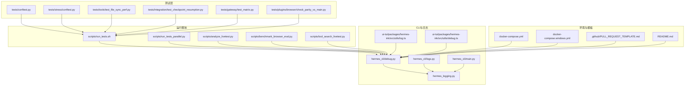
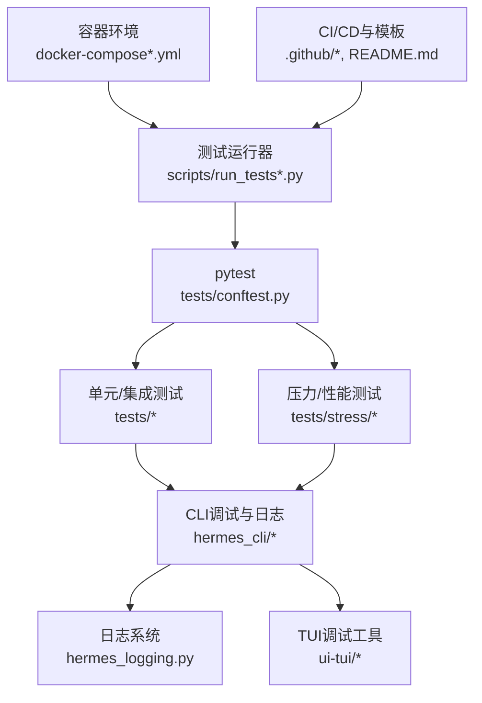
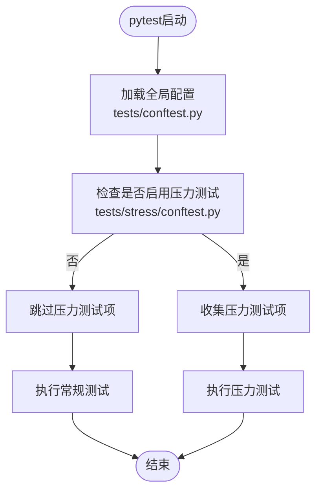
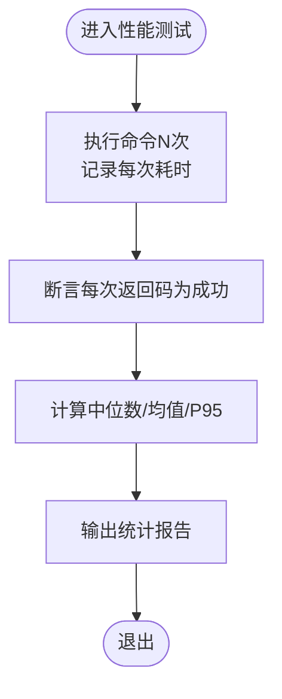
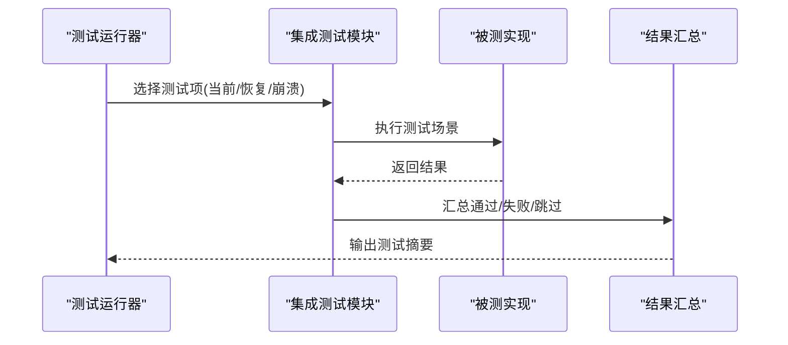
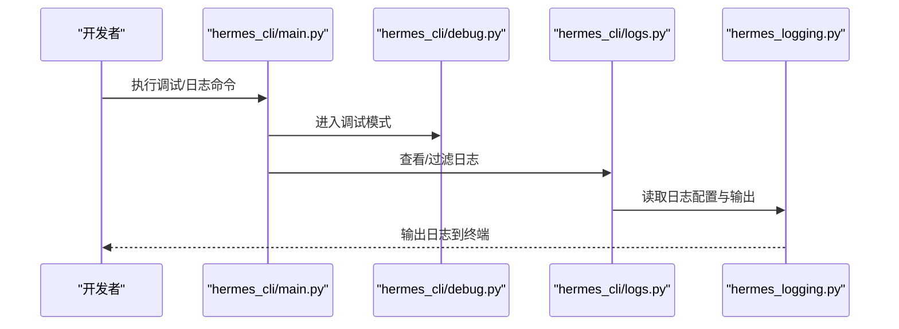
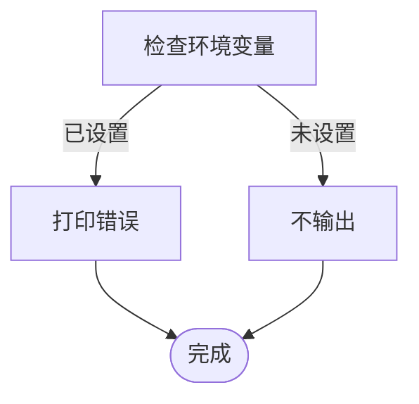
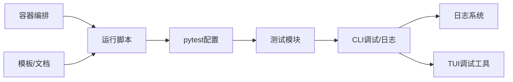

# 测试和调试

<cite>
**本文引用的文件**
- [tests/conftest.py](file://tests/conftest.py)
- [tests/stress/conftest.py](file://tests/stress/conftest.py)
- [tests/tools/test_file_sync_perf.py](file://tests/tools/test_file_sync_perf.py)
- [tests/integration/test_checkpoint_resumption.py](file://tests/integration/test_checkpoint_resumption.py)
- [tests/gateway/test_matrix.py](file://tests/gateway/test_matrix.py)
- [tests/plugins/browser/check_parity_vs_main.py](file://tests/plugins/browser/check_parity_vs_main.py)
- [scripts/run_tests.sh](file://scripts/run_tests.sh)
- [scripts/run_tests_parallel.py](file://scripts/run_tests_parallel.py)
- [scripts/LIVETEST_README.md](file://scripts/LIVETEST_README.md)
- [scripts/analyze_livetest.py](file://scripts/analyze_livetest.py)
- [scripts/benchmark_browser_eval.py](file://scripts/benchmark_browser_eval.py)
- [scripts/tool_search_livetest.py](file://scripts/tool_search_livetest.py)
- [hermes_logging.py](file://hermes_logging.py)
- [hermes_cli/debug.py](file://hermes_cli/debug.py)
- [hermes_cli/logs.py](file://hermes_cli/logs.py)
- [hermes_cli/main.py](file://hermes_cli/main.py)
- [docker-compose.yml](file://docker-compose.yml)
- [docker-compose.windows.yml](file://docker-compose.windows.yml)
- [ui-tui/packages/hermes-ink/src/utils/log.ts](file://ui-tui/packages/hermes-ink/src/utils/log.ts)
- [ui-tui/packages/hermes-ink/src/utils/debug.ts](file://ui-tui/packages/hermes-ink/src/utils/debug.ts)
- [.github/PULL_REQUEST_TEMPLATE.md](file://.github/PULL_REQUEST_TEMPLATE.md)
- [README.md](file://README.md)
</cite>

## 目录
1. [简介](#简介)
2. [项目结构](#项目结构)
3. [核心组件](#核心组件)
4. [架构总览](#架构总览)
5. [详细组件分析](#详细组件分析)
6. [依赖关系分析](#依赖关系分析)
7. [性能考量](#性能考量)
8. [故障排查指南](#故障排查指南)
9. [结论](#结论)
10. [附录](#附录)

## 简介
本指南面向Hermes Agent开发者与贡献者，系统性介绍测试与调试工具链，覆盖测试框架使用、单元测试编写、集成测试方法、性能测试、调试工具与日志分析、错误排查与性能分析技术，并提供测试用例编写规范、测试数据准备与测试环境配置建议，以及CI/CD流程、自动化测试与回归测试策略。目标是帮助你在开发过程中快速定位问题、稳定发布版本并持续改进质量。

## 项目结构
Hermes Agent的测试体系由多层级构成：
- 单元测试与集成测试位于 tests/ 下，按功能域分层组织，如 agent/、gateway/、cli/、tools/ 等。
- 性能与压力测试位于 tests/stress/ 与 tests/tools/，并通过独立的 pytest 配置控制运行范围。
- 运行脚本位于 scripts/，支持串行与并行执行测试、性能基准与直播测试分析。
- CLI 提供调试与日志查看能力，便于本地复现与问题定位。
- 文档与模板在网站文档与GitHub模板中提供CI/CD与PR流程参考。

**图表来源**
- [tests/conftest.py](file://tests/conftest.py)
- [tests/stress/conftest.py](file://tests/stress/conftest.py)
- [tests/tools/test_file_sync_perf.py](file://tests/tools/test_file_sync_perf.py)
- [tests/integration/test_checkpoint_resumption.py](file://tests/integration/test_checkpoint_resumption.py)
- [tests/gateway/test_matrix.py](file://tests/gateway/test_matrix.py)
- [tests/plugins/browser/check_parity_vs_main.py](file://tests/plugins/browser/check_parity_vs_main.py)
- [scripts/run_tests.sh](file://scripts/run_tests.sh)
- [scripts/run_tests_parallel.py](file://scripts/run_tests_parallel.py)
- [scripts/analyze_livetest.py](file://scripts/analyze_livetest.py)
- [scripts/benchmark_browser_eval.py](file://scripts/benchmark_browser_eval.py)
- [scripts/tool_search_livetest.py](file://scripts/tool_search_livetest.py)
- [hermes_cli/debug.py](file://hermes_cli/debug.py)
- [hermes_cli/logs.py](file://hermes_cli/logs.py)
- [hermes_cli/main.py](file://hermes_cli/main.py)
- [hermes_logging.py](file://hermes_logging.py)
- [ui-tui/packages/hermes-ink/src/utils/log.ts](file://ui-tui/packages/hermes-ink/src/utils/log.ts)
- [ui-tui/packages/hermes-ink/src/utils/debug.ts](file://ui-tui/packages/hermes-ink/src/utils/debug.ts)
- [docker-compose.yml](file://docker-compose.yml)
- [docker-compose.windows.yml](file://docker-compose.windows.yml)
- [.github/PULL_REQUEST_TEMPLATE.md](file://.github/PULL_REQUEST_TEMPLATE.md)
- [README.md](file://README.md)

**章节来源**
- [tests/conftest.py](file://tests/conftest.py)
- [tests/stress/conftest.py](file://tests/stress/conftest.py)
- [scripts/run_tests.sh](file://scripts/run_tests.sh)
- [scripts/run_tests_parallel.py](file://scripts/run_tests_parallel.py)
- [README.md](file://README.md)

## 核心组件
- 测试框架与配置
  - tests/conftest.py：全局pytest配置，统一fixture与默认行为。
  - tests/stress/conftest.py：压力测试专用配置，通过命令行开关启用，避免默认运行。
- 性能测试
  - tests/tools/test_file_sync_perf.py：对本地执行延迟与同步开销进行统计分析。
- 集成测试
  - tests/integration/test_checkpoint_resumption.py：中断恢复、崩溃恢复与当前实现对比。
  - tests/gateway/test_matrix.py：矩阵平台配置加载与环境覆盖测试。
  - tests/plugins/browser/check_parity_vs_main.py：主分支与PR场景一致性比对。
- 运行脚本
  - scripts/run_tests.sh：串行执行测试入口。
  - scripts/run_tests_parallel.py：并行执行测试入口。
  - scripts/analyze_livetest.py：直播测试结果分析。
  - scripts/benchmark_browser_eval.py：浏览器评估基准。
  - scripts/tool_search_livetest.py：工具搜索直播测试。
- CLI与日志
  - hermes_cli/debug.py：调试模式与断点辅助。
  - hermes_cli/logs.py：日志查看与过滤。
  - hermes_cli/main.py：CLI入口，承载调试与日志命令。
  - hermes_logging.py：日志配置与输出策略。
  - ui-tui/packages/hermes-ink/src/utils/log.ts、debug.ts：前端调试与错误打印工具。
- 环境与模板
  - docker-compose.yml、docker-compose.windows.yml：容器化测试与本地环境。
  - .github/PULL_REQUEST_TEMPLATE.md：PR模板，包含变更说明与测试清单。
  - README.md：项目总体说明与测试指引。

**章节来源**
- [tests/conftest.py](file://tests/conftest.py)
- [tests/stress/conftest.py](file://tests/stress/conftest.py)
- [tests/tools/test_file_sync_perf.py](file://tests/tools/test_file_sync_perf.py)
- [tests/integration/test_checkpoint_resumption.py](file://tests/integration/test_checkpoint_resumption.py)
- [tests/gateway/test_matrix.py](file://tests/gateway/test_matrix.py)
- [tests/plugins/browser/check_parity_vs_main.py](file://tests/plugins/browser/check_parity_vs_main.py)
- [scripts/run_tests.sh](file://scripts/run_tests.sh)
- [scripts/run_tests_parallel.py](file://scripts/run_tests_parallel.py)
- [scripts/analyze_livetest.py](file://scripts/analyze_livetest.py)
- [scripts/benchmark_browser_eval.py](file://scripts/benchmark_browser_eval.py)
- [scripts/tool_search_livetest.py](file://scripts/tool_search_livetest.py)
- [hermes_cli/debug.py](file://hermes_cli/debug.py)
- [hermes_cli/logs.py](file://hermes_cli/logs.py)
- [hermes_cli/main.py](file://hermes_cli/main.py)
- [hermes_logging.py](file://hermes_logging.py)
- [ui-tui/packages/hermes-ink/src/utils/log.ts](file://ui-tui/packages/hermes-ink/src/utils/log.ts)
- [ui-tui/packages/hermes-ink/src/utils/debug.ts](file://ui-tui/packages/hermes-ink/src/utils/debug.ts)
- [docker-compose.yml](file://docker-compose.yml)
- [docker-compose.windows.yml](file://docker-compose.windows.yml)
- [.github/PULL_REQUEST_TEMPLATE.md](file://.github/PULL_REQUEST_TEMPLATE.md)
- [README.md](file://README.md)

## 架构总览
下图展示测试与调试工具链的整体交互：测试脚本驱动pytest，pytest调用各模块测试；性能与压力测试通过独立配置隔离；CLI负责日志与调试；容器编排用于环境一致性；文档与模板规范CI/CD流程。

**图表来源**
- [scripts/run_tests.sh](file://scripts/run_tests.sh)
- [scripts/run_tests_parallel.py](file://scripts/run_tests_parallel.py)
- [tests/conftest.py](file://tests/conftest.py)
- [tests/stress/conftest.py](file://tests/stress/conftest.py)
- [hermes_cli/debug.py](file://hermes_cli/debug.py)
- [hermes_cli/logs.py](file://hermes_cli/logs.py)
- [hermes_logging.py](file://hermes_logging.py)
- [ui-tui/packages/hermes-ink/src/utils/log.ts](file://ui-tui/packages/hermes-ink/src/utils/log.ts)
- [docker-compose.yml](file://docker-compose.yml)
- [docker-compose.windows.yml](file://docker-compose.windows.yml)
- [.github/PULL_REQUEST_TEMPLATE.md](file://.github/PULL_REQUEST_TEMPLATE.md)
- [README.md](file://README.md)

## 详细组件分析

### 测试框架与配置
- 全局配置
  - tests/conftest.py：定义通用fixture、默认标记与收集规则，确保测试环境一致。
- 压力测试配置
  - tests/stress/conftest.py：通过命令行参数启用压力测试，避免默认运行；忽略glob以防止pytest误收集脚本内容。

**图表来源**
- [tests/conftest.py](file://tests/conftest.py)
- [tests/stress/conftest.py](file://tests/stress/conftest.py)

**章节来源**
- [tests/conftest.py](file://tests/conftest.py)
- [tests/stress/conftest.py](file://tests/stress/conftest.py)

### 性能测试
- 目标与方法
  - 通过多次执行命令并统计耗时，计算中位数、均值与P95，评估本地执行与文件同步开销。
- 关键实现要点
  - 计时函数记录每次执行时间并断言返回码为成功。
  - 报告函数输出统计指标与原始序列，便于横向对比。
- 典型用例路径
  - [tests/tools/test_file_sync_perf.py](file://tests/tools/test_file_sync_perf.py)

**图表来源**
- [tests/tools/test_file_sync_perf.py](file://tests/tools/test_file_sync_perf.py)

**章节来源**
- [tests/tools/test_file_sync_perf.py](file://tests/tools/test_file_sync_perf.py)

### 集成测试
- 中断恢复与崩溃模拟
  - 通过对比当前实现与恢复/崩溃场景的结果，验证一致性与鲁棒性。
  - 支持按需选择测试项并汇总结果。
- 矩阵平台配置
  - 验证环境变量覆盖与访问令牌等配置项的应用逻辑。
- 平台一致性校验
  - 对比主分支与PR场景的输出形状，确保行为一致性。

**图表来源**
- [tests/integration/test_checkpoint_resumption.py](file://tests/integration/test_checkpoint_resumption.py)

**章节来源**
- [tests/integration/test_checkpoint_resumption.py](file://tests/integration/test_checkpoint_resumption.py)
- [tests/gateway/test_matrix.py](file://tests/gateway/test_matrix.py)
- [tests/plugins/browser/check_parity_vs_main.py](file://tests/plugins/browser/check_parity_vs_main.py)

### CLI调试与日志
- 调试模式
  - hermes_cli/debug.py：提供调试开关与断点辅助，便于本地复现问题。
- 日志查看
  - hermes_cli/logs.py：支持日志过滤与查看，结合 hermes_logging.py 的配置输出。
- CLI入口
  - hermes_cli/main.py：统一入口，承载调试与日志命令。

**图表来源**
- [hermes_cli/main.py](file://hermes_cli/main.py)
- [hermes_cli/debug.py](file://hermes_cli/debug.py)
- [hermes_cli/logs.py](file://hermes_cli/logs.py)
- [hermes_logging.py](file://hermes_logging.py)

**章节来源**
- [hermes_cli/debug.py](file://hermes_cli/debug.py)
- [hermes_cli/logs.py](file://hermes_cli/logs.py)
- [hermes_cli/main.py](file://hermes_cli/main.py)
- [hermes_logging.py](file://hermes_logging.py)

### 前端调试工具
- 错误打印与调试开关
  - ui-tui/packages/hermes-ink/src/utils/log.ts：仅在开启特定环境变量时打印错误。
  - ui-tui/packages/hermes-ink/src/utils/debug.ts：占位的调试函数，便于扩展。

**图表来源**
- [ui-tui/packages/hermes-ink/src/utils/log.ts](file://ui-tui/packages/hermes-ink/src/utils/log.ts)
- [ui-tui/packages/hermes-ink/src/utils/debug.ts](file://ui-tui/packages/hermes-ink/src/utils/debug.ts)

**章节来源**
- [ui-tui/packages/hermes-ink/src/utils/log.ts](file://ui-tui/packages/hermes-ink/src/utils/log.ts)
- [ui-tui/packages/hermes-ink/src/utils/debug.ts](file://ui-tui/packages/hermes-ink/src/utils/debug.ts)

### 容器化测试环境
- docker-compose.yml 与 docker-compose.windows.yml：提供跨平台容器编排，确保测试环境一致性。
- 建议
  - 在CI与本地开发中统一使用相同镜像与网络配置，减少环境差异导致的测试波动。

**章节来源**
- [docker-compose.yml](file://docker-compose.yml)
- [docker-compose.windows.yml](file://docker-compose.windows.yml)

### CI/CD流程与自动化测试
- PR模板
  - .github/PULL_REQUEST_TEMPLATE.md：规范变更描述、影响范围与测试清单，确保每次提交都附带测试验证。
- README指引
  - README.md：提供项目总体说明与测试指引，便于新贡献者快速上手。
- 自动化策略
  - 结合scripts/run_tests.sh与scripts/run_tests_parallel.py，实现串行与并行测试的灵活组合，缩短反馈周期。

**章节来源**
- [.github/PULL_REQUEST_TEMPLATE.md](file://.github/PULL_REQUEST_TEMPLATE.md)
- [README.md](file://README.md)
- [scripts/run_tests.sh](file://scripts/run_tests.sh)
- [scripts/run_tests_parallel.py](file://scripts/run_tests_parallel.py)

## 依赖关系分析
- 组件耦合
  - 测试脚本与pytest配置强耦合，通过全局与压力测试配置实现可选执行。
  - CLI与日志系统松耦合，通过统一入口与日志配置实现解耦。
  - 前端调试工具与CLI解耦，通过环境变量控制输出。
- 外部依赖
  - docker-compose用于环境隔离与一致性保障。
  - GitHub模板与README提供流程约束与最佳实践。

**图表来源**
- [scripts/run_tests.sh](file://scripts/run_tests.sh)
- [scripts/run_tests_parallel.py](file://scripts/run_tests_parallel.py)
- [tests/conftest.py](file://tests/conftest.py)
- [tests/stress/conftest.py](file://tests/stress/conftest.py)
- [hermes_cli/debug.py](file://hermes_cli/debug.py)
- [hermes_cli/logs.py](file://hermes_cli/logs.py)
- [hermes_logging.py](file://hermes_logging.py)
- [ui-tui/packages/hermes-ink/src/utils/log.ts](file://ui-tui/packages/hermes-ink/src/utils/log.ts)
- [docker-compose.yml](file://docker-compose.yml)
- [.github/PULL_REQUEST_TEMPLATE.md](file://.github/PULL_REQUEST_TEMPLATE.md)
- [README.md](file://README.md)

**章节来源**
- [scripts/run_tests.sh](file://scripts/run_tests.sh)
- [scripts/run_tests_parallel.py](file://scripts/run_tests_parallel.py)
- [tests/conftest.py](file://tests/conftest.py)
- [tests/stress/conftest.py](file://tests/stress/conftest.py)
- [hermes_cli/debug.py](file://hermes_cli/debug.py)
- [hermes_cli/logs.py](file://hermes_cli/logs.py)
- [hermes_logging.py](file://hermes_logging.py)
- [ui-tui/packages/hermes-ink/src/utils/log.ts](file://ui-tui/packages/hermes-ink/src/utils/log.ts)
- [docker-compose.yml](file://docker-compose.yml)
- [.github/PULL_REQUEST_TEMPLATE.md](file://.github/PULL_REQUEST_TEMPLATE.md)
- [README.md](file://README.md)

## 性能考量
- 本地基线
  - 使用本地无网络与文件同步的场景作为基线，排除外部因素干扰，评估进程启动与调用开销。
- 统计指标
  - 中位数、均值、P95用于衡量尾延迟与稳定性，适合性能回归检测。
- 建议
  - 将性能测试纳入CI，设定阈值触发告警；对热点路径进行专项优化与回归测试。

**章节来源**
- [tests/tools/test_file_sync_perf.py](file://tests/tools/test_file_sync_perf.py)

## 故障排查指南
- 日志与调试
  - 使用 hermes_cli/logs.py 查看日志，结合 hermes_logging.py 的配置定位异常。
  - 启用 hermes_cli/debug.py 的调试模式，逐步缩小问题范围。
- 前端错误
  - 通过 ui-tui/packages/hermes-ink/src/utils/log.ts 的环境变量控制，仅在需要时输出错误堆栈。
- 环境一致性
  - 使用 docker-compose.yml 或 docker-compose.windows.yml 在本地复现CI环境，减少“本地可运行、CI失败”的差异。
- 回归验证
  - 使用 tests/plugins/browser/check_parity_vs_main.py 对比主分支与PR场景，快速发现行为回归。
- 集成一致性
  - 使用 tests/integration/test_checkpoint_resumption.py 验证中断/崩溃后的恢复一致性。

**章节来源**
- [hermes_cli/logs.py](file://hermes_cli/logs.py)
- [hermes_logging.py](file://hermes_logging.py)
- [hermes_cli/debug.py](file://hermes_cli/debug.py)
- [ui-tui/packages/hermes-ink/src/utils/log.ts](file://ui-tui/packages/hermes-ink/src/utils/log.ts)
- [docker-compose.yml](file://docker-compose.yml)
- [docker-compose.windows.yml](file://docker-compose.windows.yml)
- [tests/plugins/browser/check_parity_vs_main.py](file://tests/plugins/browser/check_parity_vs_main.py)
- [tests/integration/test_checkpoint_resumption.py](file://tests/integration/test_checkpoint_resumption.py)

## 结论
Hermes Agent的测试与调试工具链覆盖了从单元到集成、从本地到CI的全链路需求。通过pytest配置、CLI日志与调试、容器化环境与文档模板的协同，能够高效地定位问题、验证修复并持续提升系统稳定性。建议在日常开发中坚持“先写测试再改代码”的原则，并将性能与回归测试纳入CI流水线，确保发布质量。

## 附录
- 测试用例编写规范
  - 使用明确的前置条件与断言，避免隐式依赖。
  - 对外部服务或网络请求进行mock或隔离，保证可重复性。
  - 为关键路径添加性能断言，防止回归。
- 测试数据准备
  - 使用 fixtures 或临时文件，确保测试间互不污染。
  - 对于浏览器/网关等平台，准备最小可复现场景。
- 测试环境配置
  - 使用 docker-compose 编排一致的测试环境，避免平台差异。
  - 在CI中固定Python与依赖版本，减少漂移。
- 自动化与回归策略
  - 串行测试保证基础稳定性，压力与性能测试按需启用。
  - PR模板要求提供测试清单，确保变更受控。