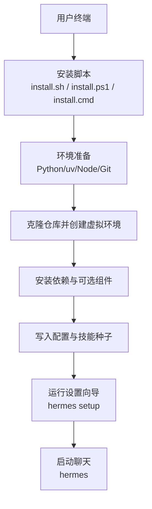
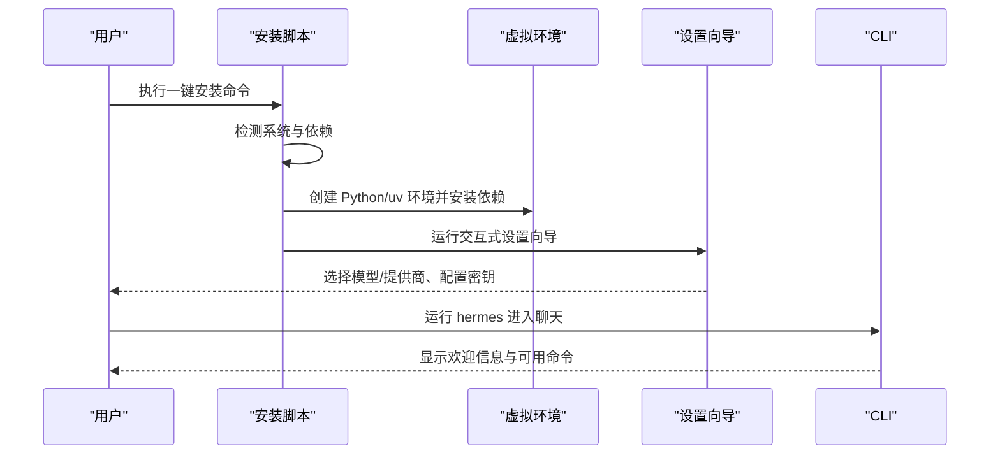
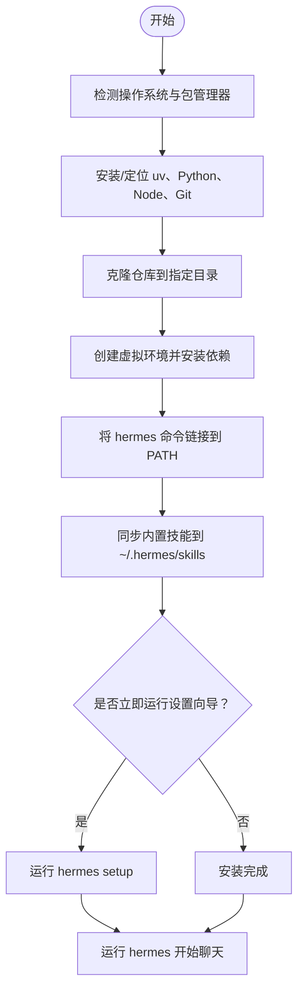
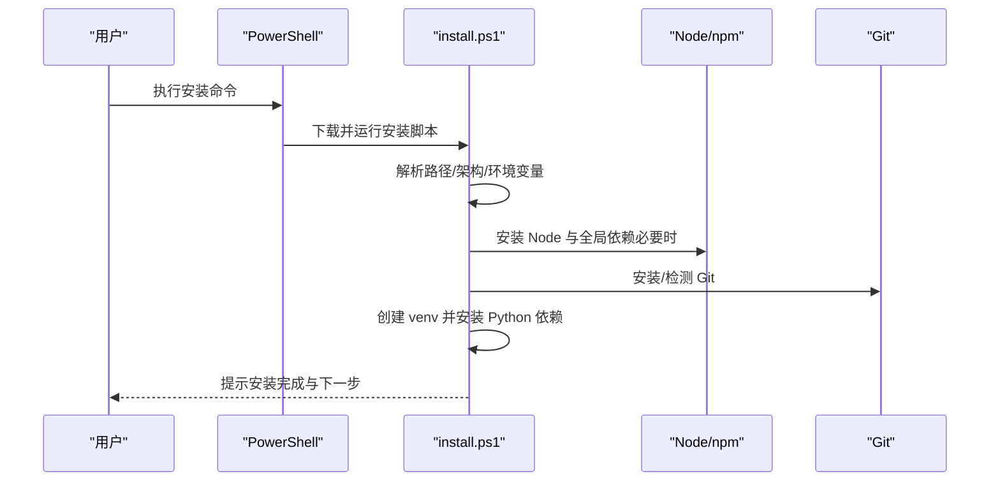
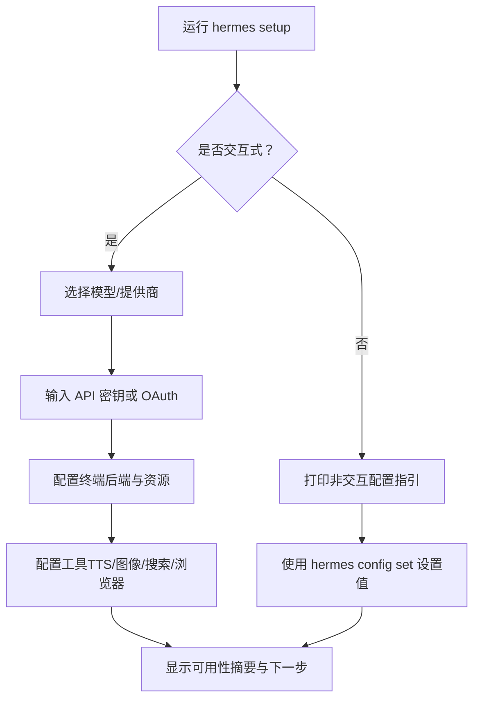
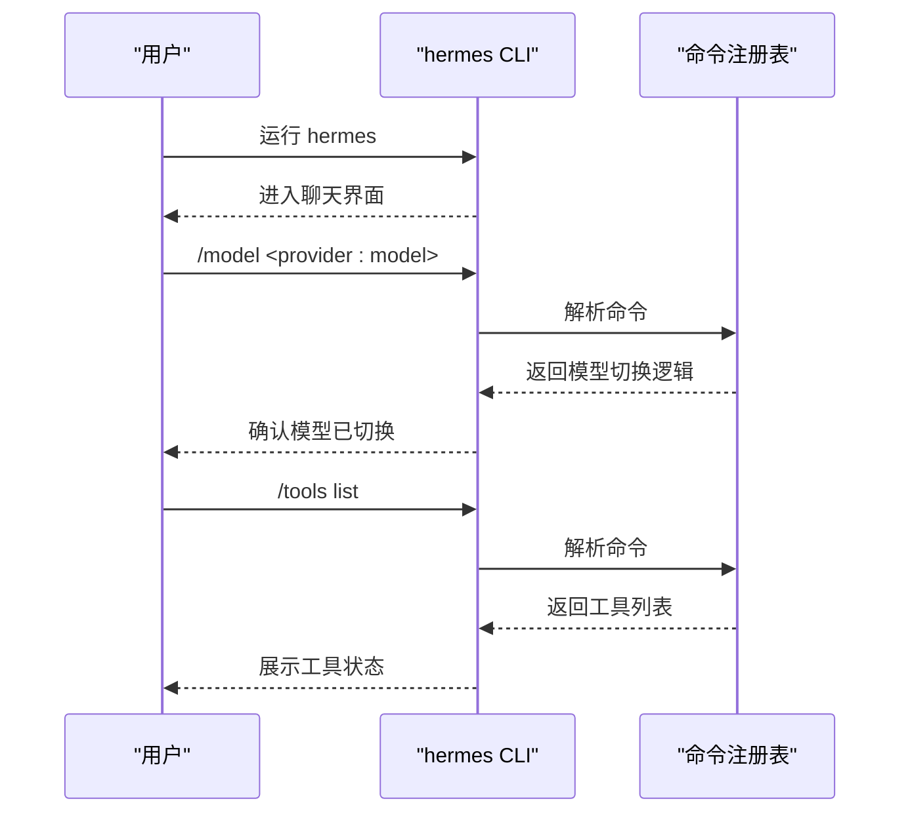
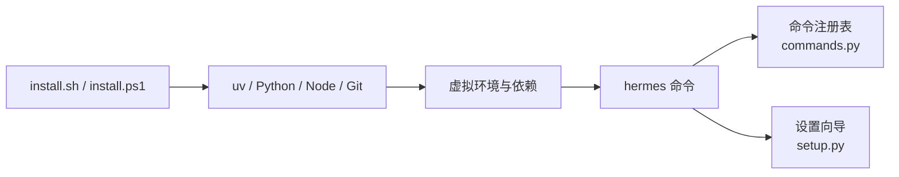

# 快速开始

<cite>
**本文引用的文件**
- [README.md](file://README.md)
- [install.sh](file://scripts/install.sh)
- [install.ps1](file://scripts/install.ps1)
- [install.cmd](file://scripts/install.cmd)
- [setup-hermes.sh](file://setup-hermes.sh)
- [setup.py](file://hermes_cli/setup.py)
- [commands.py](file://hermes_cli/commands.py)
</cite>

## 目录
1. [简介](#简介)
2. [项目结构](#项目结构)
3. [核心组件](#核心组件)
4. [架构总览](#架构总览)
5. [详细组件分析](#详细组件分析)
6. [依赖关系分析](#依赖关系分析)
7. [性能注意事项](#性能注意事项)
8. [故障排除指南](#故障排除指南)
9. [结论](#结论)
10. [附录](#附录)

## 简介
本指南帮助你在几分钟内完成 Hermes Agent 的安装、初始配置与首次对话。覆盖 Linux、macOS、Windows（含 WSL2）、Termux 的一键安装与手动安装，说明模型提供商与 API 密钥配置、基础参数调整，并提供常见问题的排查方法（如 Windows 防病毒误报、权限问题）。最后给出 CLI 常用操作示例，帮助你快速上手聊天、切换模型、查看工具等。

## 项目结构
Hermes Agent 提供跨平台一键安装脚本与交互式设置向导：
- 安装脚本
  - Linux/macOS/WSL2/Termux：scripts/install.sh
  - Windows（PowerShell）：scripts/install.ps1；CMD 包装器：scripts/install.cmd
  - 开发者手动初始化：setup-hermes.sh
- 交互式设置向导：hermes_cli/setup.py
- 命令注册表（聊天斜杠命令）：hermes_cli/commands.py
- 快速入门入口与常见问题：README.md

图表来源
- [install.sh:1-120](file://scripts/install.sh#L1-L120)
- [install.ps1:1-120](file://scripts/install.ps1#L1-L120)
- [install.cmd:1-29](file://scripts/install.cmd#L1-L29)
- [setup-hermes.sh:1-120](file://setup-hermes.sh#L1-L120)
- [setup.py:1-120](file://hermes_cli/setup.py#L1-L120)

章节来源
- [README.md:35-118](file://README.md#L35-L118)
- [install.sh:1-200](file://scripts/install.sh#L1-L200)
- [install.ps1:1-120](file://scripts/install.ps1#L1-L120)
- [install.cmd:1-29](file://scripts/install.cmd#L1-L29)
- [setup-hermes.sh:1-120](file://setup-hermes.sh#L1-L120)

## 核心组件
- 安装器
  - 自动检测系统、安装 uv/Python/Node/Git、拉取代码、创建 venv、安装依赖、链接 hermes 命令、引导设置向导。
- 设置向导
  - 交互式选择模型提供商与模型、配置终端后端、Agent 参数、消息网关、工具与 TTS/图像生成等。
- 命令系统
  - 统一的斜杠命令注册表，支持在 CLI 和消息网关中复用（如 /model、/tools、/status 等）。

章节来源
- [install.sh:95-200](file://scripts/install.sh#L95-L200)
- [install.ps1:15-75](file://scripts/install.ps1#L15-L75)
- [setup.py:1-120](file://hermes_cli/setup.py#L1-L120)
- [commands.py:102-345](file://hermes_cli/commands.py#L102-L345)

## 架构总览
从“安装”到“首次对话”的端到端流程如下：

图表来源
- [install.sh:549-780](file://scripts/install.sh#L549-L780)
- [install.ps1:689-735](file://scripts/install.ps1#L689-L735)
- [setup.py:183-220](file://hermes_cli/setup.py#L183-L220)
- [commands.py:102-200](file://hermes_cli/commands.py#L102-L200)

## 详细组件分析

### 安装与首次运行（Linux、macOS、WSL2、Termux）
- 一键安装
  - 使用 curl 管道执行安装脚本，自动处理依赖与环境。
- 手动安装（开发者）
  - 使用 setup-hermes.sh 创建 venv、安装依赖、链接 hermes 命令，并可选择立即运行设置向导。
- 预期输出
  - 安装完成后提示如何刷新 shell、运行设置向导与启动聊天。

图表来源
- [install.sh:503-780](file://scripts/install.sh#L503-L780)
- [setup-hermes.sh:129-183](file://setup-hermes.sh#L129-L183)
- [setup-hermes.sh:325-396](file://setup-hermes.sh#L325-L396)
- [setup-hermes.sh:398-463](file://setup-hermes.sh#L398-L463)

章节来源
- [README.md:35-67](file://README.md#L35-L67)
- [install.sh:95-200](file://scripts/install.sh#L95-L200)
- [setup-hermes.sh:129-183](file://setup-hermes.sh#L129-L183)
- [setup-hermes.sh:325-396](file://setup-hermes.sh#L325-L396)
- [setup-hermes.sh:398-463](file://setup-hermes.sh#L398-L463)

### 安装与首次运行（Windows 原生与 WSL2）
- 原生 Windows（PowerShell）
  - 使用 iex + irm 执行 PowerShell 安装脚本，自动安装 uv、Python、Node、Git（可携带式 MinGit），并链接 hermes 命令。
- CMD 包装器
  - 若使用 CMD，可通过 install.cmd 调用 PowerShell 安装器。
- WSL2
  - 可直接使用 Linux/macOS 的一键安装命令。
- 预期输出
  - 安装完成后提示刷新环境变量、运行设置向导与启动聊天。

图表来源
- [install.ps1:15-75](file://scripts/install.ps1#L15-L75)
- [install.ps1:689-735](file://scripts/install.ps1#L689-L735)
- [install.cmd:1-29](file://scripts/install.cmd#L1-L29)
- [README.md:43-67](file://README.md#L43-L67)

章节来源
- [README.md:43-67](file://README.md#L43-L67)
- [install.ps1:15-75](file://scripts/install.ps1#L15-L75)
- [install.cmd:1-29](file://scripts/install.cmd#L1-L29)

### 初始配置（模型提供商、API 密钥、基础参数）
- 交互式设置向导
  - 选择模型与提供商、配置终端后端、Agent 参数（迭代次数、压缩策略等）、消息网关、工具与 TTS/图像生成等。
  - 非交互模式会打印命令行配置指引。
- 通过命令调整
  - 使用 /model 切换模型或提供商；使用 /tools 管理工具开关；使用 /config 查看当前配置。
- 预期输出
  - 设置完成后显示各工具可用性摘要与下一步建议。

图表来源
- [setup.py:183-220](file://hermes_cli/setup.py#L183-L220)
- [setup.py:396-723](file://hermes_cli/setup.py#L396-L723)
- [commands.py:196-208](file://hermes_cli/commands.py#L196-L208)

章节来源
- [setup.py:183-220](file://hermes_cli/setup.py#L183-L220)
- [setup.py:396-723](file://hermes_cli/setup.py#L396-L723)
- [commands.py:196-208](file://hermes_cli/commands.py#L196-L208)

### CLI 基础使用示例
- 启动聊天
  - 运行 hermes 进入交互式会话。
- 选择模型
  - 使用 /model 切换模型或提供商（支持 --global 持久化）。
- 查看工具列表
  - 使用 /tools list 查看已启用工具。
- 其他常用命令
  - /status 查看会话与模型信息；/usage 查看用量；/compress 压缩上下文；/help 查看命令列表。

图表来源
- [commands.py:102-208](file://hermes_cli/commands.py#L102-L208)
- [commands.py:254-308](file://hermes_cli/commands.py#L254-L308)

章节来源
- [README.md:105-118](file://README.md#L105-L118)
- [commands.py:102-208](file://hermes_cli/commands.py#L102-L208)
- [commands.py:254-308](file://hermes_cli/commands.py#L254-L308)

## 依赖关系分析
- 安装阶段
  - 依赖 uv（Python 包管理与环境管理）、Python 3.11、Node.js 22、Git。
  - 在 Windows 上还会处理 npm 全局依赖与代理证书提示。
- 运行时
  - 通过 hermes 命令进入 CLI，使用命令注册表分发斜杠命令。
  - 设置向导读取/写入配置文件与环境变量，驱动后续行为。

图表来源
- [install.sh:549-780](file://scripts/install.sh#L549-L780)
- [install.ps1:689-735](file://scripts/install.ps1#L689-L735)
- [commands.py:102-208](file://hermes_cli/commands.py#L102-L208)
- [setup.py:183-220](file://hermes_cli/setup.py#L183-L220)

章节来源
- [install.sh:549-780](file://scripts/install.sh#L549-L780)
- [install.ps1:689-735](file://scripts/install.ps1#L689-L735)
- [commands.py:102-208](file://hermes_cli/commands.py#L102-L208)
- [setup.py:183-220](file://hermes_cli/setup.py#L183-L220)

## 性能注意事项
- 首次安装可能较慢，尤其是依赖下载与编译阶段；请保持网络稳定。
- 在 Windows 上，进度条可能导致下载变慢，安装脚本已关闭不必要的进度输出以提升速度。
- 如需更快的文件搜索，可在安装过程中选择安装 ripgrep（可选）。

[本节为通用指导，不直接分析具体文件]

## 故障排除指南
- Windows 防病毒软件误报 uv.exe
  - 现象：Windows Defender 或其他杀毒软件隔离了 uv.exe。
  - 原因：基于 ML 的杀毒引擎对未签名 Rust 二进制存在误报。
  - 解决：验证文件完整性后添加白名单文件夹（而非仅文件哈希），因为版本更新会改变哈希。
- 权限与路径问题
  - 确保安装目录与数据目录具有读写权限。
  - Windows 下注意 8.3 短路径导致的异常，安装脚本已做长路径规范化处理。
- 网络与代理
  - 如遇 TLS 证书错误，按提示配置企业根 CA 或临时禁用严格 SSL（仅用于安装）。
- 无法找到 hermes 命令
  - 重新加载 shell 或确保 PATH 包含安装脚本创建的命令链接目录。

章节来源
- [README.md:68-102](file://README.md#L68-L102)
- [install.ps1:527-554](file://scripts/install.ps1#L527-L554)
- [install.ps1:106-352](file://scripts/install.ps1#L106-L352)

## 结论
通过一键安装脚本与交互式设置向导，你可以在几分钟内完成 Hermes Agent 的安装、配置与首次对话。遇到问题时，优先检查防病毒误报、权限与网络配置，并使用诊断命令与文档进一步排查。掌握基本 CLI 命令后，即可高效使用聊天、模型切换与工具管理等功能。

[本节为总结性内容，不直接分析具体文件]

## 附录
- 快速参考
  - 安装：Linux/macOS/WSL2/Termux 使用一键安装；Windows 使用 PowerShell 安装器。
  - 配置：运行 hermes setup 进行交互式配置；或使用 hermes config set 设置具体项。
  - 聊天：运行 hermes 进入 CLI；使用 /model、/tools、/status 等命令。
- 更多文档
  - 完整文档与参考命令见 README 中的链接。

章节来源
- [README.md:35-118](file://README.md#L35-L118)
- [setup-hermes.sh:421-463](file://setup-hermes.sh#L421-L463)