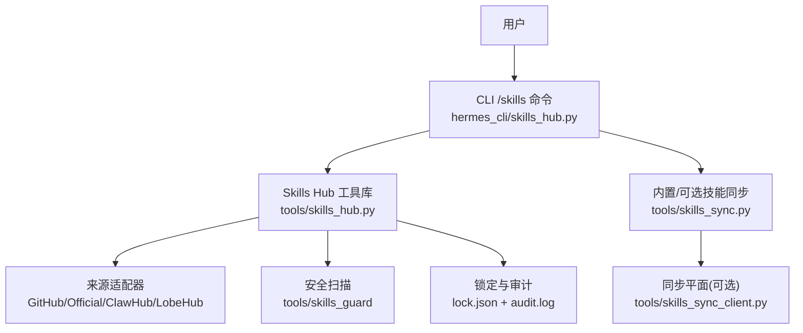
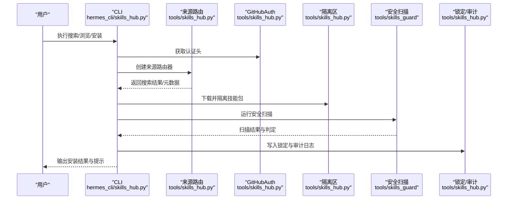
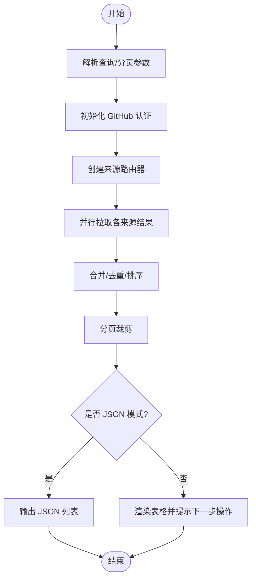
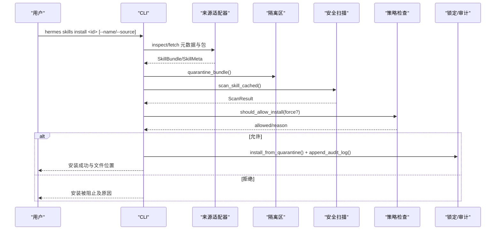
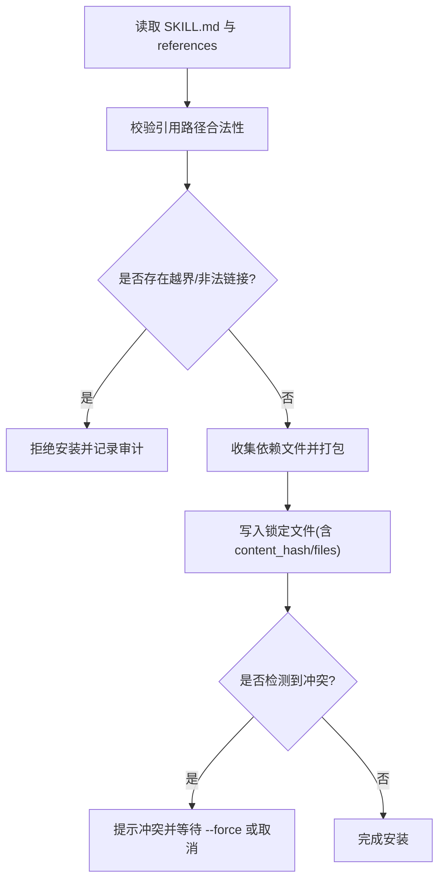
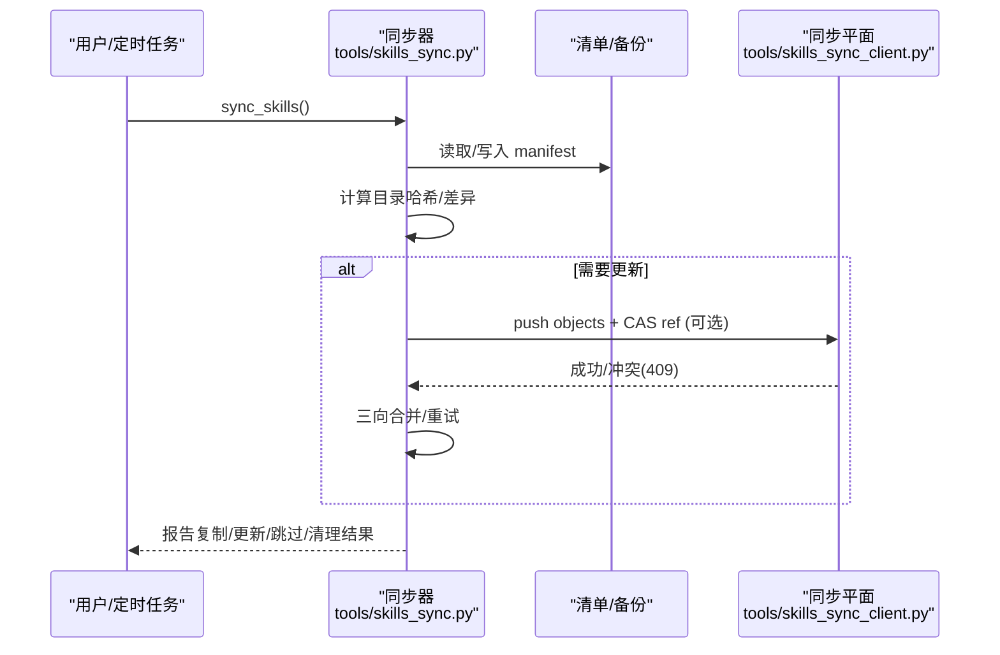
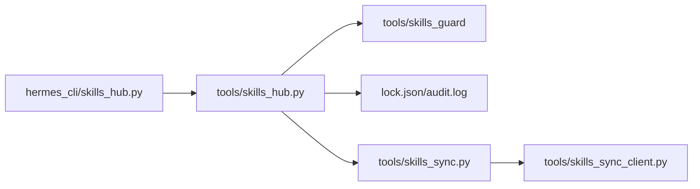

# Skills Hub 使用指南

<cite>
**本文引用的文件**
- [hermes_cli/skills_hub.py](file://hermes_cli/skills_hub.py)
- [tools/skills_hub.py](file://tools/skills_hub.py)
- [tools/skills_sync.py](file://tools/skills_sync.py)
- [tools/skills_sync_client.py](file://tools/skills_sync_client.py)
</cite>

## 目录
1. [简介](#简介)
2. [项目结构](#项目结构)
3. [核心组件](#核心组件)
4. [架构总览](#架构总览)
5. [详细组件分析](#详细组件分析)
6. [依赖关系分析](#依赖关系分析)
7. [性能与缓存](#性能与缓存)
8. [故障排除指南](#故障排除指南)
9. [结论](#结论)
10. [附录](#附录)

## 简介
本指南面向希望浏览、安装、更新和管理社区技能的用户。Skills Hub 提供统一的技能检索、分类浏览、安全扫描、依赖解析与冲突检测，以及离线索引缓存、批量管理与同步机制。通过 CLI 命令或交互式斜杠命令，你可以快速发现并安装官方与第三方技能，并在保证安全的前提下进行升级、回滚和卸载。

## 项目结构
Skills Hub 由 CLI 入口与底层工具库组成：
- CLI 层（hermes_cli/skills_hub.py）：负责搜索、浏览、检查、安装、更新等用户交互流程。
- 工具层（tools/skills_hub.py）：实现多源适配器、认证、下载、隔离、扫描、锁定与审计日志等核心能力。
- 同步层（tools/skills_sync.py、tools/skills_sync_client.py）：负责内置/可选技能的清单同步、增量更新、重命名恢复，以及跨设备/组织的技能同步协议。

图表来源
- [hermes_cli/skills_hub.py:250-487](file://hermes_cli/skills_hub.py#L250-L487)
- [tools/skills_hub.py:476-753](file://tools/skills_hub.py#L476-L753)
- [tools/skills_sync.py:675-800](file://tools/skills_sync.py#L675-L800)
- [tools/skills_sync_client.py:767-800](file://tools/skills_sync_client.py#L767-L800)

章节来源
- [hermes_cli/skills_hub.py:250-487](file://hermes_cli/skills_hub.py#L250-L487)
- [tools/skills_hub.py:476-753](file://tools/skills_hub.py#L476-L753)
- [tools/skills_sync.py:675-800](file://tools/skills_sync.py#L675-L800)
- [tools/skills_sync_client.py:767-800](file://tools/skills_sync_client.py#L767-L800)

## 核心组件
- 统一搜索与分页浏览：支持按查询词搜索、按来源过滤、按信任等级排序与分页展示。
- 来源适配器：GitHub、官方（official）、ClawHub、LobeHub 等多源聚合。
- 安全扫描与策略：沙箱隔离、内容哈希、白名单仓库、安装策略拦截。
- 锁定与审计：记录已安装技能来源、路径、版本与审计事件。
- 同步机制：内置/可选技能清单同步、增量更新、重命名恢复；可选的跨设备/组织同步。
- 配置与权限：GitHub 认证、SSRF/URL 安全校验、安装前确认与强制覆盖控制。

章节来源
- [hermes_cli/skills_hub.py:250-487](file://hermes_cli/skills_hub.py#L250-L487)
- [tools/skills_hub.py:349-470](file://tools/skills_hub.py#L349-L470)
- [tools/skills_hub.py:294-339](file://tools/skills_hub.py#L294-L339)
- [tools/skills_hub.py:130-153](file://tools/skills_hub.py#L130-L153)
- [tools/skills_sync.py:675-800](file://tools/skills_sync.py#L675-L800)
- [tools/skills_sync_client.py:391-435](file://tools/skills_sync_client.py#L391-L435)

## 架构总览
Skills Hub 采用“CLI 入口 + 多源适配器 + 安全扫描 + 锁定审计 + 同步”的分层架构。CLI 负责用户交互与流程编排；工具库负责数据获取、安全校验与状态管理；同步模块负责本地与远端的一致性维护。

图表来源
- [hermes_cli/skills_hub.py:250-487](file://hermes_cli/skills_hub.py#L250-L487)
- [tools/skills_hub.py:349-470](file://tools/skills_hub.py#L349-L470)
- [tools/skills_hub.py:294-339](file://tools/skills_hub.py#L294-L339)

## 详细组件分析

### 搜索与浏览
- 搜索：支持关键词匹配、来源过滤、限制返回数量；可输出 JSON 便于脚本处理。
- 浏览：并行拉取多个来源的结果，按信任等级排序，去重后分页展示；支持按提供商标签过滤 GitHub Tap 技能。
- 短名解析：当标识符不含斜杠时，自动在全部来源中解析为完整标识符，避免歧义。

图表来源
- [hermes_cli/skills_hub.py:250-487](file://hermes_cli/skills_hub.py#L250-L487)

章节来源
- [hermes_cli/skills_hub.py:250-487](file://hermes_cli/skills_hub.py#L250-L487)

### 安装流程与安全策略
- 标识符解析：支持短名与完整标识符；可通过 source_id 固定来源以避免跨注册表歧义。
- 隔离与扫描：将技能包下载到隔离区，运行安全扫描，依据策略决定是否允许安装。
- 确认与提示：官方技能与第三方技能分别给出不同提示；非交互模式需显式提供名称。
- 安装与注册：从隔离区复制到最终目录，记录锁定信息，探测自动化蓝图并加入建议任务。
- 缓存失效：安装完成后刷新系统提示缓存，使新技能立即生效。

图表来源
- [hermes_cli/skills_hub.py:490-793](file://hermes_cli/skills_hub.py#L490-L793)
- [tools/skills_hub.py:195-252](file://tools/skills_hub.py#L195-L252)

章节来源
- [hermes_cli/skills_hub.py:490-793](file://hermes_cli/skills_hub.py#L490-L793)
- [tools/skills_hub.py:195-252](file://tools/skills_hub.py#L195-L252)

### 依赖解析与冲突检测
- 依赖解析：通过 SKILL.md frontmatter 与 references 目录引用，仅允许受支持的子目录（references/templates/scripts/assets/examples），并对相对路径进行严格校验，防止越界访问。
- 冲突检测：锁定文件记录每个技能的 install_path、content_hash、files 列表；安装前检查是否已存在同名技能，必要时要求 --force；卸载与回滚基于锁定信息进行安全删除。
- 重命名恢复：当上游变更技能目录或分类时，同步模块会尝试将旧副本迁移到新路径，同时尊重用户自定义与外部来源优先。

图表来源
- [tools/skills_hub.py:155-179](file://tools/skills_hub.py#L155-L179)
- [tools/skills_hub.py:228-291](file://tools/skills_hub.py#L228-L291)
- [tools/skills_sync.py:609-672](file://tools/skills_sync.py#L609-L672)

章节来源
- [tools/skills_hub.py:155-179](file://tools/skills_hub.py#L155-L179)
- [tools/skills_hub.py:228-291](file://tools/skills_hub.py#L228-L291)
- [tools/skills_sync.py:609-672](file://tools/skills_sync.py#L609-L672)

### 同步机制与离线使用
- 内置/可选技能同步：基于清单（manifest）追踪来源哈希，增量复制、跳过未修改、清理已删除项；支持重命名恢复与外部来源优先。
- 跨设备/组织同步：通过对象模型（blob/tree/commit）与 CAS 协议推送/拉取；默认关闭，可由环境变量或配置开启；支持个人与组织范围。
- 离线使用：索引缓存与本地扫描缓存可在无网络环境下工作；首次运行或缓存过期时会尝试联网填充。

图表来源
- [tools/skills_sync.py:675-800](file://tools/skills_sync.py#L675-L800)
- [tools/skills_sync_client.py:767-800](file://tools/skills_sync_client.py#L767-L800)

章节来源
- [tools/skills_sync.py:675-800](file://tools/skills_sync.py#L675-L800)
- [tools/skills_sync_client.py:767-800](file://tools/skills_sync_client.py#L767-L800)

### 配置选项、权限设置与卸载
- 配置选项：
  - GitHub 认证：优先使用环境变量令牌，其次 gh CLI，再次 GitHub App JWT，最后匿名访问。
  - URL 安全：SSRF 防护、重定向限制、网站访问策略检查。
  - 同步开关：HERMES_SYNC_ENABLED、sync.enabled；默认关闭。
  - 默认策略：HERMES_SYNC_DEFAULT_OPT_IN、sync.default_opt_in；决定“默认启用/禁用”同步。
- 权限设置：
  - 安装前确认：官方与第三方技能分别提示风险；非交互模式需显式提供名称。
  - 强制覆盖：--force 可绕过重复安装检查。
- 卸载方法：
  - 通过锁定文件定位安装路径，安全删除并清理审计日志；禁止对锁路径进行逃逸。

章节来源
- [tools/skills_hub.py:349-470](file://tools/skills_hub.py#L349-L470)
- [tools/skills_hub.py:294-339](file://tools/skills_hub.py#L294-L339)
- [tools/skills_sync_client.py:391-435](file://tools/skills_sync_client.py#L391-L435)
- [tools/skills_hub.py:228-291](file://tools/skills_hub.py#L228-L291)

### 质量评估、评价与版本兼容性
- 质量评估：安全扫描包含规则集与来源可信度；官方技能标记为 builtin/trusted，第三方为 community。
- 用户评价：当前代码未直接暴露评分字段；可通过额外元数据（如 installs/weekly_installs）辅助判断热度。
- 版本兼容性：锁定文件记录 content_hash 与 files 列表；同步模块通过哈希对比确保一致性；上游重命名/重组时进行恢复。

章节来源
- [tools/skills_hub.py:130-153](file://tools/skills_hub.py#L130-L153)
- [tools/skills_hub.py:182-192](file://tools/skills_hub.py#L182-L192)
- [tools/skills_sync.py:254-297](file://tools/skills_sync.py#L254-L297)

### 批量管理
- 批量搜索/浏览：支持分页与每来源限制，适合大规模目录浏览。
- 批量安装：通过脚本化 JSON 输出与循环调用安装接口，结合 --name 与 --source 实现自动化。
- 批量同步：通过清单与哈希对比，增量复制/更新/清理，避免重复读取与不必要网络请求。

章节来源
- [hermes_cli/skills_hub.py:250-487](file://hermes_cli/skills_hub.py#L250-L487)
- [tools/skills_sync.py:675-800](file://tools/skills_sync.py#L675-L800)

## 依赖关系分析
- CLI 与工具库：CLI 仅做参数解析与流程编排，核心逻辑委托 tools/skills_hub.py。
- 来源适配器：GitHubSource 支持多 Tap 仓库；官方来源作为内置资源；其他来源通过统一接口接入。
- 安全扫描：依赖 tools/skills_guard 进行内容哈希与规则判定；扫描结果用于安装策略。
- 锁定与审计：lock.json 与 audit.log 记录安装状态与审计事件，保障可追溯性。
- 同步客户端：可选地连接同步平面，遵循 wire contract v1，支持对象上传与 CAS 冲突处理。

图表来源
- [hermes_cli/skills_hub.py:250-487](file://hermes_cli/skills_hub.py#L250-L487)
- [tools/skills_hub.py:476-753](file://tools/skills_hub.py#L476-L753)
- [tools/skills_sync.py:675-800](file://tools/skills_sync.py#L675-L800)
- [tools/skills_sync_client.py:767-800](file://tools/skills_sync_client.py#L767-L800)

章节来源
- [hermes_cli/skills_hub.py:250-487](file://hermes_cli/skills_hub.py#L250-L487)
- [tools/skills_hub.py:476-753](file://tools/skills_hub.py#L476-L753)
- [tools/skills_sync.py:675-800](file://tools/skills_sync.py#L675-L800)
- [tools/skills_sync_client.py:767-800](file://tools/skills_sync_client.py#L767-L800)

## 性能与缓存
- 索引缓存：index-cache 目录缓存来源索引，TTL 为 1 小时，减少重复 API 调用。
- 扫描缓存：scan-cache 目录缓存扫描结果，避免重复计算。
- 并行拉取：browse/search 并行从多个来源获取结果，提升响应速度。
- 超时保护：整体超时与每来源限制防止长时间阻塞。

章节来源
- [tools/skills_hub.py:54-100](file://tools/skills_hub.py#L54-L100)
- [hermes_cli/skills_hub.py:319-487](file://hermes_cli/skills_hub.py#L319-L487)

## 故障排除指南
- 安装失败（无法获取标识符）：
  - 检查是否为短名；使用完整标识符或指定 source_id 固定来源。
  - 若来自 URL，确保 SKILL.md 包含 name 字段或使用 --name 显式指定。
- 依赖冲突：
  - 查看锁定文件中的 install_path 与 content_hash；必要时使用 --force 重新安装。
  - 若上游重命名/重组，运行同步以恢复至新路径。
- 网络问题：
  - GitHub API 速率限制：设置 GITHUB_TOKEN 或登录 gh CLI 提高限额。
  - SSRF/URL 安全：检查目标 URL 是否被策略阻止；确认代理与网络可达。
- 同步失败：
  - 确认 HERMES_SYNC_ENABLED 与 sync.enabled 已开启；检查 base_url 配置。
  - 遇到 409 冲突：根据 actual head 进行三向合并并重试。

章节来源
- [hermes_cli/skills_hub.py:490-793](file://hermes_cli/skills_hub.py#L490-L793)
- [tools/skills_hub.py:349-470](file://tools/skills_hub.py#L349-L470)
- [tools/skills_sync_client.py:738-765](file://tools/skills_sync_client.py#L738-L765)

## 结论
Skills Hub 提供了完整的技能生态系统：从发现、安装到同步与管理，兼顾安全性与易用性。通过多源聚合、安全扫描、锁定审计与同步机制，用户可以高效地扩展 Agent 能力，并在团队协作与跨设备场景中保持一致性。建议在生产环境中启用必要的认证与策略，并结合缓存与批量管理提升效率。

## 附录
- 常用命令参考：
  - 搜索：hermes skills search <query> [--source all|official|github|...] [--limit N]
  - 浏览：hermes skills browse [--page N] [--page-size N] [--source all|provider]
  - 检查：hermes skills inspect <identifier>
  - 安装：hermes skills install <identifier> [--name <name>] [--source <id>] [--force]
  - 同步：hermes sync enable/disable/status/push/pull/now
- 配置文件键：
  - sync.base_url：同步平面地址
  - sync.enabled：主开关
  - sync.default_opt_in：默认启用/禁用策略

章节来源
- [hermes_cli/skills_hub.py:250-487](file://hermes_cli/skills_hub.py#L250-L487)
- [tools/skills_sync_client.py:307-335](file://tools/skills_sync_client.py#L307-L335)
- [tools/skills_sync_client.py:391-435](file://tools/skills_sync_client.py#L391-L435)