# 内置技能

<cite>
**本文引用的文件**
- [README.md](file://README.md)
- [optional-skills/DESCRIPTION.md](file://optional-skills/DESCRIPTION.md)
- [skills/creative/DESCRIPTION.md](file://skills/creative/DESCRIPTION.md)
- [skills/software-development/DESCRIPTION.md](file://skills/software-development/DESCRIPTION.md)
- [skills/research/DESCRIPTION.md](file://skills/research/DESCRIPTION.md)
- [skills/productivity/DESCRIPTION.md](file://skills/productivity/DESCRIPTION.md)
- [skills/devops/DESCRIPTION.md](file://skills/devops/DESCRIPTION.md)
- [skills/github/DESCRIPTION.md](file://skills/github/DESCRIPTION.md)
- [skills/media/DESCRIPTION.md](file://skills/media/DESCRIPTION.md)
- [skills/mlops/DESCRIPTION.md](file://skills/mlops/DESCRIPTION.md)
- [skills/communication/DESCRIPTION.md](file://skills/communication/DESCRIPTION.md)
- [skills/smart-home/DESCRIPTION.md](file://skills/smart-home/DESCRIPTION.md)
- [skills/note-taking/DESCRIPTION.md](file://skills/note-taking/DESCRIPTION.md)
- [skills/data-science/DESCRIPTION.md](file://skills/data-science/DESCRIPTION.md)
- [skills/apple/DESCRIPTION.md](file://skills/apple/DESCRIPTION.md)
- [skills/autonomous-ai-agents/DESCRIPTION.md](file://skills/autonomous-ai-agents/DESCRIPTION.md)
- [skills/red-teaming/godmode/SKILL.md](file://skills/red-teaming/godmode/SKILL.md)
- [skills/creative/ascii-art/SKILL.md](file://skills/creative/ascii-art/SKILL.md)
- [skills/creative/excalidraw/SKILL.md](file://skills/creative/excalidraw/SKILL.md)
- [skills/creative/manim-video/SKILL.md](file://skills/creative/manim-video/SKILL.md)
- [skills/creative/p5js/SKILL.md](file://skills/creative/p5js/SKILL.md)
- [skills/creative/baoyu-infographic/SKILL.md](file://skills/creative/baoyu-infographic/SKILL.md)
- [skills/creative/architecture-diagram/SKILL.md](file://skills/creative/architecture-diagram/SKILL.md)
- [skills/creative/design-md/SKILL.md](file://skills/creative/design-md/SKILL.md)
- [skills/creative/popular-web-designs/SKILL.md](file://skills/creative/popular-web-designs/SKILL.md)
- [skills/creative/sketch/SKILL.md](file://skills/creative/sketch/SKILL.md)
- [skills/creative/songwriting-and-ai-music/SKILL.md](file://skills/creative/songwriting-and-ai-music/SKILL.md)
- [skills/creative/touchdesigner-mcp/SKILL.md](file://skills/creative/touchdesigner-mcp/SKILL.md)
- [skills/creative/claude-design/SKILL.md](file://skills/creative/claude-design/SKILL.md)
- [skills/creative/comfyui/SKILL.md](file://skills/creative/comfyui/SKILL.md)
- [skills/creative/humanizer/SKILL.md](file://skills/creative/humanizer/SKILL.md)
- [skills/creative/ascii-video/SKILL.md](file://skills/creative/ascii-video/SKILL.md)
- [skills/creative/pretext/SKILL.md](file://skills/creative/pretext/SKILL.md)
- [skills/software-development/hermes-agent-skill-authoring/SKILL.md](file://skills/software-development/hermes-agent-skill-authoring/SKILL.md)
- [skills/software-development/node-inspect-debugger/SKILL.md](file://skills/software-development/node-inspect-debugger/SKILL.md)
- [skills/software-development/python-debugpy/SKILL.md](file://skills/software-development/python-debugpy/SKILL.md)
- [skills/software-development/requesting-code-review/SKILL.md](file://skills/software-development/requesting-code-review/SKILL.md)
- [skills/software-development/spike/SKILL.md](file://skills/software-development/spike/SKILL.md)
- [skills/software-development/systematic-debugging/SKILL.md](file://skills/software-development/systematic-debugging/SKILL.md)
- [skills/software-development/test-driven-development/SKILL.md](file://skills/software-development/test-driven-development/SKILL.md)
- [skills/software-development/plan/SKILL.md](file://skills/software-development/plan/SKILL.md)
- [skills/research/arxiv/SKILL.md](file://skills/research/arxiv/SKILL.md)
- [skills/research/blogwatcher/SKILL.md](file://skills/research/blogwatcher/SKILL.md)
- [skills/research/llm-wiki/SKILL.md](file://skills/research/llm-wiki/SKILL.md)
- [skills/research/polymarket/SKILL.md](file://skills/research/polymarket/SKILL.md)
- [skills/research/research-paper-writing/SKILL.md](file://skills/research/research-paper-writing/SKILL.md)
- [skills/productivity/airtable/SKILL.md](file://skills/productivity/airtable/SKILL.md)
- [skills/productivity/google-workspace/SKILL.md](file://skills/productivity/google-workspace/SKILL.md)
- [skills/productivity/maps/SKILL.md](file://skills/productivity/maps/SKILL.md)
- [skills/productivity/nano-pdf/SKILL.md](file://skills/productivity/nano-pdf/SKILL.md)
- [skills/productivity/notion/SKILL.md](file://skills/productivity/notion/SKILL.md)
- [skills/productivity/ocr-and-documents/SKILL.md](file://skills/productivity/ocr-and-documents/SKILL.md)
- [skills/productivity/powerpoint/SKILL.md](file://skills/productivity/powerpoint/SKILL.md)
- [skills/productivity/teams-meeting-pipeline/SKILL.md](file://skills/productivity/teams-meeting-pipeline/SKILL.md)
- [skills/devops/kanban-orchestrator/SKILL.md](file://skills/devops/kanban-orchestrator/SKILL.md)
- [skills/devops/kanban-worker/SKILL.md](file://skills/devops/kanban-worker/SKILL.md)
- [skills/github/codebase-inspection/SKILL.md](file://skills/github/codebase-inspection/SKILL.md)
- [skills/github/github-auth/SKILL.md](file://skills/github/github-auth/SKILL.md)
- [skills/github/github-code-review/SKILL.md](file://skills/github/github-code-review/SKILL.md)
- [skills/github/github-issues/SKILL.md](file://skills/github/github-issues/SKILL.md)
- [skills/github/github-pr-workflow/SKILL.md](file://skills/github/github-pr-workflow/SKILL.md)
- [skills/github/github-repo-management/SKILL.md](file://skills/github/github-repo-management/SKILL.md)
- [skills/media/gif-search/SKILL.md](file://skills/media/gif-search/SKILL.md)
- [skills/media/heartmula/SKILL.md](file://skills/media/heartmula/SKILL.md)
- [skills/media/songsee/SKILL.md](file://skills/media/songsee/SKILL.md)
- [skills/media/youtube-content/SKILL.md](file://skills/media/youtube-content/SKILL.md)
- [skills/mlops/evaluation/SKILL.md](file://skills/mlops/evaluation/SKILL.md)
- [skills/mlops/huggingface-hub/SKILL.md](file://skills/mlops/huggingface-hub/SKILL.md)
- [skills/mlops/inference/SKILL.md](file://skills/mlops/inference/SKILL.md)
- [skills/mlops/models/SKILL.md](file://skills/mlops/models/SKILL.md)
- [skills/communication/xurl/SKILL.md](file://skills/communication/xurl/SKILL.md)
- [skills/smart-home/openhue/SKILL.md](file://skills/smart-home/openhue/SKILL.md)
- [skills/note-taking/obsidian/SKILL.md](file://skills/note-taking/obsidian/SKILL.md)
- [skills/data-science/jupyter-live-kernel/SKILL.md](file://skills/data-science/jupyter-live-kernel/SKILL.md)
- [skills/apple/apple-notes/SKILL.md](file://skills/apple/apple-notes/SKILL.md)
- [skills/apple/apple-reminders/SKILL.md](file://skills/apple/apple-reminders/SKILL.md)
- [skills/apple/findmy/SKILL.md](file://skills/apple/findmy/SKILL.md)
- [skills/apple/imessage/SKILL.md](file://skills/apple/imessage/SKILL.md)
- [skills/apple/macos-computer-use/SKILL.md](file://skills/apple/macos-computer-use/SKILL.md)
- [skills/autonomous-ai-agents/claude-code/SKILL.md](file://skills/autonomous-ai-agents/claude-code/SKILL.md)
- [skills/autonomous-ai-agents/codex/SKILL.md](file://skills/autonomous-ai-agents/codex/SKILL.md)
- [skills/autonomous-ai-agents/opencode/SKILL.md](file://skills/autonomous-ai-agents/opencode/SKILL.md)
- [skills/email/himalaya/SKILL.md](file://skills/email/himalaya/SKILL.md)
- [optional-skills/autonomous-ai-agents/antigravity-cli/SKILL.md](file://optional-skills/autonomous-ai-agents/antigravity-cli/SKILL.md)
- [optional-skills/autonomous-ai-agents/blackbox/SKILL.md](file://optional-skills/autonomous-ai-agents/blackbox/SKILL.md)
- [optional-skills/autonomous-ai-agents/grok/SKILL.md](file://optional-skills/autonomous-ai-agents/grok/SKILL.md)
- [optional-skills/autonomous-ai-agents/honcho/SKILL.md](file://optional-skills/autonomous-ai-agents/honcho/SKILL.md)
- [optional-skills/autonomous-ai-agents/openhands/SKILL.md](file://optional-skills/autonomous-ai-agents/openhands/SKILL.md)
- [optional-skills/creative/baoyu-article-illustrator/SKILL.md](file://optional-skills/creative/baoyu-article-illustrator/SKILL.md)
- [optional-skills/creative/baoyu-comic/SKILL.md](file://optional-skills/creative/baoyu-comic/SKILL.md)
- [optional-skills/creative/blender-mcp/SKILL.md](file://optional-skills/creative/blender-mcp/SKILL.md)
- [optional-skills/creative/concept-diagrams/SKILL.md](file://optional-skills/creative/concept-diagrams/SKILL.md)
- [optional-skills/creative/creative-ideation/SKILL.md](file://optional-skills/creative/creative-ideation/SKILL.md)
- [optional-skills/creative/hyperframes/SKILL.md](file://optional-skills/creative/hyperframes/SKILL.md)
- [optional-skills/creative/kanban-video-orchestrator/SKILL.md](file://optional-skills/creative/kanban-video-orchestrator/SKILL.md)
- [optional-skills/creative/meme-generation/SKILL.md](file://optional-skills/creative/meme-generation/SKILL.md)
- [optional-skills/creative/pixel-art/SKILL.md](file://optional-skills/creative/pixel-art/SKILL.md)
- [optional-skills/devops/cli/SKILL.md](file://optional-skills/devops/cli/SKILL.md)
- [optional-skills/devops/docker-management/SKILL.md](file://optional-skills/devops/docker-management/SKILL.md)
- [optional-skills/devops/hermes-s6-container-supervision/SKILL.md](file://optional-skills/devops/hermes-s6-container-supervision/SKILL.md)
- [optional-skills/devops/pinggy-tunnel/SKILL.md](file://optional-skills/devops/pinggy-tunnel/SKILL.md)
- [optional-skills/devops/watchers/SKILL.md](file://optional-skills/devops/watchers/SKILL.md)
- [optional-skills/communication/one-three-one-rule/SKILL.md](file://optional-skills/communication/one-three-one-rule/SKILL.md)
- [optional-skills/research/bioinformatics/SKILL.md](file://optional-skills/research/bioinformatics/SKILL.md)
- [optional-skills/research/darwinian-evolver/SKILL.md](file://optional-skills/research/darwinian-evolver/SKILL.md)
- [optional-skills/research/domain-intel/SKILL.md](file://optional-skills/research/domain-intel/SKILL.md)
- [optional-skills/research/drug-discovery/SKILL.md](file://optional-skills/research/drug-discovery/SKILL.md)
- [optional-skills/research/duckduckgo-search/SKILL.md](file://optional-skills/research/duckduckgo-search/SKILL.md)
- [optional-skills/research/gitnexus-explorer/SKILL.md](file://optional-skills/research/gitnexus-explorer/SKILL.md)
- [optional-skills/research/osint-investigation/SKILL.md](file://optional-skills/research/osint-investigation/SKILL.md)
- [optional-skills/research/parallel-cli/SKILL.md](file://optional-skills/research/parallel-cli/SKILL.md)
- [optional-skills/research/qmd/SKILL.md](file://optional-skills/research/qmd/SKILL.md)
- [optional-skills/research/scrapling/SKILL.md](file://optional-skills/research/scrapling/SKILL.md)
- [optional-skills/research/searxng-search/SKILL.md](file://optional-skills/research/searxng-search/SKILL.md)
- [optional-skills/security/1password/SKILL.md](file://optional-skills/security/1password/SKILL.md)
- [optional-skills/security/oss-forensics/SKILL.md](file://optional-skills/security/oss-forensics/SKILL.md)
- [optional-skills/security/sherlock/SKILL.md](file://optional-skills/security/sherlock/SKILL.md)
- [optional-skills/security/web-pentest/SKILL.md](file://optional-skills/security/web-pentest/SKILL.md)
- [optional-skills/finance/3-statement-model/SKILL.md](file://optional-skills/finance/3-statement-model/SKILL.md)
- [optional-skills/finance/comps-analysis/SKILL.md](file://optional-skills/finance/comps-analysis/SKILL.md)
- [optional-skills/finance/dcf-model/SKILL.md](file://optional-skills/finance/dcf-model/SKILL.md)
- [optional-skills/finance/excel-author/SKILL.md](file://optional-skills/finance/excel-author/SKILL.md)
- [optional-skills/finance/lbo-model/SKILL.md](file://optional-skills/finance/lbo-model/SKILL.md)
- [optional-skills/finance/merger-model/SKILL.md](file://optional-skills/finance/merger-model/SKILL.md)
- [optional-skills/finance/pptx-author/SKILL.md](file://optional-skills/finance/pptx-author/SKILL.md)
- [optional-skills/finance/stocks/SKILL.md](file://optional-skills/finance/stocks/SKILL.md)
- [optional-skills/mlops/accelerate/SKILL.md](file://optional-skills/mlops/accelerate/SKILL.md)
- [optional-skills/mlops/chroma/SKILL.md](file://optional-skills/mlops/chroma/SKILL.md)
- [optional-skills/mlops/clip/SKILL.md](file://optional-skills/mlops/clip/SKILL.md)
- [optional-skills/mlops/faiss/SKILL.md](file://optional-skills/mlops/faiss/SKILL.md)
- [optional-skills/mlops/flash-attention/SKILL.md](file://optional-skills/mlops/flash-attention/SKILL.md)
- [optional-skills/mlops/guidance/SKILL.md](file://optional-skills/mlops/guidance/SKILL.md)
- [optional-skills/mlops/huggingface-tokenizers/SKILL.md](file://optional-skills/mlops/huggingface-tokenizers/SKILL.md)
- [optional-skills/mlops/inference/outlines/SKILL.md](file://optional-skills/mlops/inference/outlines/SKILL.md)
- [optional-skills/mlops/instructor/SKILL.md](file://optional-skills/mlops/instructor/SKILL.md)
- [optional-skills/mlops/lambda-labs/SKILL.md](file://optional-skills/mlops/lambda-labs/SKILL.md)
- [optional-skills/mlops/llava/SKILL.md](file://optional-skills/mlops/llava/SKILL.md)
- [optional-skills/mlops/modal/SKILL.md](file://optional-skills/mlops/modal/SKILL.md)
- [optional-skills/mlops/nemo-curator/SKILL.md](file://optional-skills/mlops/nemo-curator/SKILL.md)
- [optional-skills/mlops/peft/SKILL.md](file://optional-skills/mlops/peft/SKILL.md)
- [optional-skills/mlops/pinecone/SKILL.md](file://optional-skills/mlops/pinecone/SKILL.md)
- [optional-skills/mlops/pytorch-fsdp/SKILL.md](file://optional-skills/mlops/pytorch-fsdp/SKILL.md)
- [optional-skills/mlops/pytorch-lightning/SKILL.md](file://optional-skills/mlops/pytorch-lightning/SKILL.md)
- [optional-skills/mlops/qdrant/SKILL.md](file://optional-skills/mlops/qdrant/SKILL.md)
- [optional-skills/mlops/research/SKILL.md](file://optional-skills/mlops/research/SKILL.md)
- [optional-skills/mlops/saelens/SKILL.md](file://optional-skills/mlops/saelens/SKILL.md)
- [optional-skills/mlops/simpo/SKILL.md](file://optional-skills/mlops/simpo/SKILL.md)
- [optional-skills/mlops/slime/SKILL.md](file://optional-skills/mlops/slime/SKILL.md)
- [optional-skills/mlops/stable-diffusion/SKILL.md](file://optional-skills/mlops/stable-diffusion/SKILL.md)
- [optional-skills/mlops/tensorrt-llm/SKILL.md](file://optional-skills/mlops/tensorrt-llm/SKILL.md)
- [optional-skills/mlops/torchtitan/SKILL.md](file://optional-skills/mlops/torchtitan/SKILL.md)
- [optional-skills/mlops/training/SKILL.md](file://optional-skills/mlops/training/SKILL.md)
- [optional-skills/mlops/whisper/SKILL.md](file://optional-skills/mlops/whisper/SKILL.md)
- [optional-skills/productivity/canvas/SKILL.md](file://optional-skills/productivity/canvas/SKILL.md)
- [optional-skills/productivity/here-now/SKILL.md](file://optional-skills/productivity/here-now/SKILL.md)
- [optional-skills/productivity/memento-flashcards/SKILL.md](file://optional-skills/productivity/memento-flashcards/SKILL.md)
- [optional-skills/productivity/shop-app/SKILL.md](file://optional-skills/productivity/shop-app/SKILL.md)
- [optional-skills/productivity/shopify/SKILL.md](file://optional-skills/productivity/shopify/SKILL.md)
- [optional-skills/productivity/siyuan/SKILL.md](file://optional-skills/productivity/siyuan/SKILL.md)
- [optional-skills/productivity/telephony/SKILL.md](file://optional-skills/productivity/telephony/SKILL.md)
- [optional-skills/health/fitness-nutrition/SKILL.md](file://optional-skills/health/fitness-nutrition/SKILL.md)
- [optional-skills/health/neuroskill-bci/SKILL.md](file://optional-skills/health/neuroskill-bci/SKILL.md)
- [optional-skills/web-development/page-agent/SKILL.md](file://optional-skills/web-development/page-agent/SKILL.md)
- [optional-skills/mcp/fastmcp/SKILL.md](file://optional-skills/mcp/fastmcp/SKILL.md)
- [optional-skills/mcp/mcporter/SKILL.md](file://optional-skills/mcp/mcporter/SKILL.md)
- [optional-skills/blockchain/evm/SKILL.md](file://optional-skills/blockchain/evm/SKILL.md)
- [optional-skills/blockchain/hyperliquid/SKILL.md](file://optional-skills/blockchain/hyperliquid/SKILL.md)
- [optional-skills/blockchain/solana/SKILL.md](file://optional-skills/blockchain/solana/SKILL.md)
- [optional-skills/dogfood/adversarial-ux-test/SKILL.md](file://optional-skills/dogfood/adversarial-ux-test/SKILL.md)
- [optional-skills/gaming/minecraft-modpack-server/SKILL.md](file://optional-skills/gaming/minecraft-modpack-server/SKILL.md)
- [optional-skills/gaming/pokemon-player/SKILL.md](file://optional-skills/gaming/pokemon-player/SKILL.md)
</cite>

## 目录
1. [简介](#简介)
2. [项目结构](#项目结构)
3. [核心组件](#核心组件)
4. [架构总览](#架构总览)
5. [详细组件分析](#详细组件分析)
6. [依赖分析](#依赖分析)
7. [性能考虑](#性能考虑)
8. [故障排除指南](#故障排除指南)
9. [结论](#结论)
10. [附录](#附录)

## 简介
本文件系统性梳理 Hermes Agent 的“内置技能”体系，依据技能的功能与应用场景进行分类汇总，并对每个类别提供能力概述、典型用法与最佳实践建议。技能分为以下类别：
- 创意技能（艺术创作、设计工具）
- 开发技能（代码编写、调试工具）
- 研究技能（学术研究、信息检索）
- 生产力技能（办公自动化、项目管理）
- DevOps 技能（系统管理、运维工具）
- GitHub 技能（代码托管、协作工具）
- 媒体技能（图像处理、视频编辑）
- MLOps 技能（机器学习、模型管理）
- 通信技能（邮件、社交平台）
- 智能家居技能
- 笔记技能
- 数据科学技能
- Apple 设备技能
- 自主 AI 代理技能
- 红队技能

说明：
- 仓库中同时存在 skills 与 optional-skills 两大目录，前者为“内置技能”，后者为“可选技能”。本文在“内置技能”框架下，尽可能覆盖两类目录中的代表性技能条目，以便形成完整的分类视图。
- 由于技能数量众多且部分技能包含大量子模块或工作流，本文以“类别 + 典型技能清单”的方式呈现，避免重复列举。

## 项目结构
Hermes Agent 的技能体系主要由两部分构成：
- skills：内置技能集合，面向通用场景与高频任务
- optional-skills：可选技能集合，面向特定领域或实验性能力

```mermaid
graph TB
A["根目录"] --> B["skills内置技能"]
A --> C["optional-skills可选技能"]
B --> B1["creative创意"]
B --> B2["software-development开发"]
B --> B3["research研究"]
B --> B4["productivity生产力"]
B --> B5["devopsDevOps"]
B --> B6["githubGitHub"]
B --> B7["media媒体"]
B --> B8["mlopsMLOps"]
B --> B9["communication通信"]
B --> B10["smart-home智能家居"]
B --> B11["note-taking笔记"]
B --> B12["data-science数据科学"]
B --> B13["appleApple 设备"]
B --> B14["autonomous-ai-agents自主 AI 代理"]
B --> B15["red-teaming红队"]
B --> B16["email邮件"]
C --> C1["creative创意"]
C --> C2["research研究"]
C --> C3["devopsDevOps"]
C --> C4["security安全"]
C --> C5["mlopsMLOps"]
C --> C6["productivity生产力"]
C --> C7["health健康"]
C --> C8["web-developmentWeb 开发"]
C --> C9["mcpMCP"]
C --> C10["blockchain区块链"]
C --> C11["communication通信"]
C --> C12["gaming游戏"]
C --> C13["dogfood内部试用"]
```

图表来源
- [README.md](file://README.md)
- [skills/creative/DESCRIPTION.md](file://skills/creative/DESCRIPTION.md)
- [skills/software-development/DESCRIPTION.md](file://skills/software-development/DESCRIPTION.md)
- [skills/research/DESCRIPTION.md](file://skills/research/DESCRIPTION.md)
- [skills/productivity/DESCRIPTION.md](file://skills/productivity/DESCRIPTION.md)
- [skills/devops/DESCRIPTION.md](file://skills/devops/DESCRIPTION.md)
- [skills/github/DESCRIPTION.md](file://skills/github/DESCRIPTION.md)
- [skills/media/DESCRIPTION.md](file://skills/media/DESCRIPTION.md)
- [skills/mlops/DESCRIPTION.md](file://skills/mlops/DESCRIPTION.md)
- [skills/communication/DESCRIPTION.md](file://skills/communication/DESCRIPTION.md)
- [skills/smart-home/DESCRIPTION.md](file://skills/smart-home/DESCRIPTION.md)
- [skills/note-taking/DESCRIPTION.md](file://skills/note-taking/DESCRIPTION.md)
- [skills/data-science/DESCRIPTION.md](file://skills/data-science/DESCRIPTION.md)
- [skills/apple/DESCRIPTION.md](file://skills/apple/DESCRIPTION.md)
- [skills/autonomous-ai-agents/DESCRIPTION.md](file://skills/autonomous-ai-agents/DESCRIPTION.md)
- [skills/red-teaming/godmode/SKILL.md](file://skills/red-teaming/godmode/SKILL.md)

章节来源
- [README.md](file://README.md)

## 核心组件
- 技能分类与职责边界
  - 创意技能：围绕图像、视频、动画、设计与内容生成，强调视觉表达与创意编排。
  - 开发技能：聚焦代码生成、调试、审查与开发流程辅助，提升工程效率。
  - 研究技能：面向学术与情报收集，支持论文检索、知识整合与调查分析。
  - 生产力技能：覆盖办公套件、文档处理、会议与项目管理，提高日常办公自动化水平。
  - DevOps 技能：涵盖容器、监控、隧道与系统编排，支撑基础设施与运维自动化。
  - GitHub 技能：围绕仓库管理、PR 工作流、代码审查与问题管理，强化协作与质量控制。
  - 媒体技能：聚焦 GIF 搜索、音乐与视频内容消费与聚合。
  - MLOps 技能：覆盖模型训练、推理、向量库与数据集管理，支撑端到端 ML 生命周期。
  - 通信技能：邮件与社交平台集成，实现消息自动化与跨平台协同。
  - 智能家居技能：连接与控制智能设备，如灯光与环境控制。
  - 笔记技能：与笔记应用集成，实现内容检索与工作流自动化。
  - 数据科学技能：提供交互式内核与可视化支持，加速数据分析与探索。
  - Apple 设备技能：针对 macOS/iOS 生态的系统与应用自动化。
  - 自主 AI 代理技能：多代理协作与编排，扩展智能体的自主执行能力。
  - 红队技能：面向安全测试与对抗演练，提供攻击链构建与评估工具。

- 技能清单（内置为主，兼顾可选）
  - 创意技能：ASCII 艺术、Excalidraw、Manim 视频、p5.js、宝鱼信息图、建筑图、设计 Markdown、热门网页设计、Sketch、歌曲创作、TouchDesigner MCP、Claude 设计、ComfyUI、Humanizer、ASCII 视频、Pretext
  - 开发技能：Hermes 技能作者、Node Inspect 调试器、Python Debugpy、请求代码审查、Spike、系统化调试、TDD、Plan
  - 研究技能：ArXiv、博客监测、LLM Wiki、Polymarket、研究论文写作
  - 生产力技能：Airtable、Google Workspace、地图、Nano PDF、Notion、OCR 与文档、PowerPoint、Teams 会议流水线
  - DevOps 技能：Kanban 编排器、Kanban 执行者
  - GitHub 技能：代码库检查、认证、代码审查、Issue、PR 工作流、仓库管理
  - 媒体技能：GIF 搜索、Heartmula、SongSee、YouTube 内容
  - MLOps 技能：评估、HuggingFace Hub、推理、模型管理
  - 通信技能：XURL
  - 智能家居技能：OpenHue
  - 笔记技能：Obsidian
  - 数据科学技能：Jupyter 实时内核
  - Apple 设备技能：Apple Notes、Apple Reminders、FindMy、iMessage、macOS 计算机使用
  - 自主 AI 代理技能：Claude Code、Codex、OpenCode、Hermes Agent
  - 红队技能：Godmode

章节来源
- [skills/creative/DESCRIPTION.md](file://skills/creative/DESCRIPTION.md)
- [skills/software-development/DESCRIPTION.md](file://skills/software-development/DESCRIPTION.md)
- [skills/research/DESCRIPTION.md](file://skills/research/DESCRIPTION.md)
- [skills/productivity/DESCRIPTION.md](file://skills/productivity/DESCRIPTION.md)
- [skills/devops/DESCRIPTION.md](file://skills/devops/DESCRIPTION.md)
- [skills/github/DESCRIPTION.md](file://skills/github/DESCRIPTION.md)
- [skills/media/DESCRIPTION.md](file://skills/media/DESCRIPTION.md)
- [skills/mlops/DESCRIPTION.md](file://skills/mlops/DESCRIPTION.md)
- [skills/communication/DESCRIPTION.md](file://skills/communication/DESCRIPTION.md)
- [skills/smart-home/DESCRIPTION.md](file://skills/smart-home/DESCRIPTION.md)
- [skills/note-taking/DESCRIPTION.md](file://skills/note-taking/DESCRIPTION.md)
- [skills/data-science/DESCRIPTION.md](file://skills/data-science/DESCRIPTION.md)
- [skills/apple/DESCRIPTION.md](file://skills/apple/DESCRIPTION.md)
- [skills/autonomous-ai-agents/DESCRIPTION.md](file://skills/autonomous-ai-agents/DESCRIPTION.md)
- [skills/red-teaming/godmode/SKILL.md](file://skills/red-teaming/godmode/SKILL.md)

## 架构总览
内置技能通过统一的“技能描述文件（SKILL.md）”与“类别说明文件（DESCRIPTION.md）”组织，形成清晰的能力边界与使用入口。下图展示从用户意图到技能执行的关键路径：

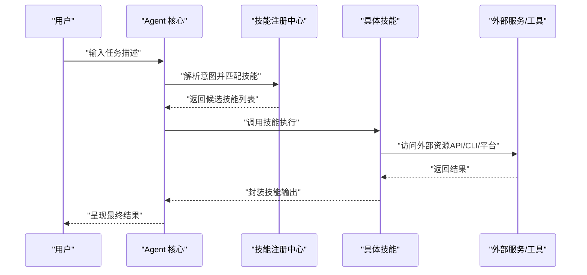

说明：
- 技能注册中心负责技能发现、优先级排序与上下文适配。
- 外部服务包括平台 API、命令行工具、第三方 SDK 等。
- 输出结果需遵循统一的格式约定，便于后续处理与展示。

## 详细组件分析

### 创意技能
- 功能特点
  - 提供从静态图像到动态视频的全链路创意工具，覆盖草图、矢量绘图、编程动画、交互式图形、信息图与 AI 驱动的设计。
- 典型技能清单
  - ASCII 艺术、Excalidraw、Manim 视频、p5.js、宝鱼信息图、建筑图、设计 Markdown、热门网页设计、Sketch、歌曲创作、TouchDesigner MCP、Claude 设计、ComfyUI、Humanizer、ASCII 视频、Pretext
- 使用方法与最佳实践
  - 明确创意目标与交付形式（静态图/视频/交互式），选择合适工具链。
  - 对于视频/动画类技能，提前规划分镜与素材，减少迭代成本。
  - 利用模板与参考案例快速起稿，再逐步细化。
- 关键流程示意

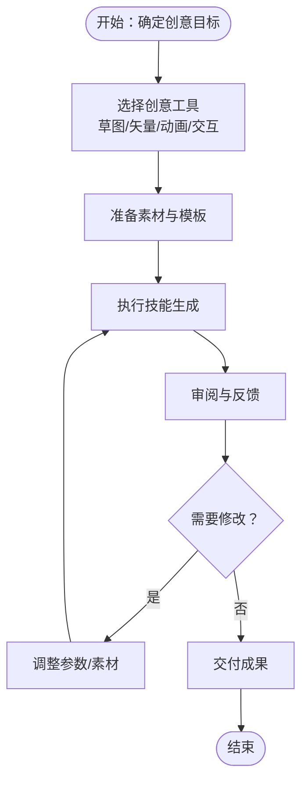

章节来源
- [skills/creative/ascii-art/SKILL.md](file://skills/creative/ascii-art/SKILL.md)
- [skills/creative/excalidraw/SKILL.md](file://skills/creative/excalidraw/SKILL.md)
- [skills/creative/manim-video/SKILL.md](file://skills/creative/manim-video/SKILL.md)
- [skills/creative/p5js/SKILL.md](file://skills/creative/p5js/SKILL.md)
- [skills/creative/baoyu-infographic/SKILL.md](file://skills/creative/baoyu-infographic/SKILL.md)
- [skills/creative/architecture-diagram/SKILL.md](file://skills/creative/architecture-diagram/SKILL.md)
- [skills/creative/design-md/SKILL.md](file://skills/creative/design-md/SKILL.md)
- [skills/creative/popular-web-designs/SKILL.md](file://skills/creative/popular-web-designs/SKILL.md)
- [skills/creative/sketch/SKILL.md](file://skills/creative/sketch/SKILL.md)
- [skills/creative/songwriting-and-ai-music/SKILL.md](file://skills/creative/songwriting-and-ai-music/SKILL.md)
- [skills/creative/touchdesigner-mcp/SKILL.md](file://skills/creative/touchdesigner-mcp/SKILL.md)
- [skills/creative/claude-design/SKILL.md](file://skills/creative/claude-design/SKILL.md)
- [skills/creative/comfyui/SKILL.md](file://skills/creative/comfyui/SKILL.md)
- [skills/creative/humanizer/SKILL.md](file://skills/creative/humanizer/SKILL.md)
- [skills/creative/ascii-video/SKILL.md](file://skills/creative/ascii-video/SKILL.md)
- [skills/creative/pretext/SKILL.md](file://skills/creative/pretext/SKILL.md)

### 开发技能
- 功能特点
  - 覆盖从需求拆解、编码、调试到代码审查与测试的全流程，提升开发效率与质量。
- 典型技能清单
  - Hermes 技能作者、Node Inspect 调试器、Python Debugpy、请求代码审查、Spike、系统化调试、TDD、Plan
- 使用方法与最佳实践
  - 使用 Plan 进行任务分解，再用 Spike 快速验证方案可行性。
  - 调试阶段结合断点与日志，优先定位核心路径。
  - 代码审查前先自检，确保风格一致与边界清晰。
- 关键流程示意

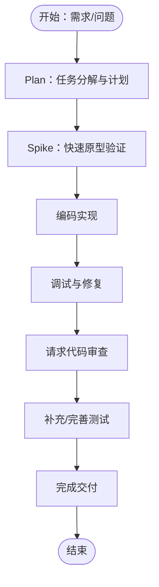

章节来源
- [skills/software-development/hermes-agent-skill-authoring/SKILL.md](file://skills/software-development/hermes-agent-skill-authoring/SKILL.md)
- [skills/software-development/node-inspect-debugger/SKILL.md](file://skills/software-development/node-inspect-debugger/SKILL.md)
- [skills/software-development/python-debugpy/SKILL.md](file://skills/software-development/python-debugpy/SKILL.md)
- [skills/software-development/requesting-code-review/SKILL.md](file://skills/software-development/requesting-code-review/SKILL.md)
- [skills/software-development/spike/SKILL.md](file://skills/software-development/spike/SKILL.md)
- [skills/software-development/systematic-debugging/SKILL.md](file://skills/software-development/systematic-debugging/SKILL.md)
- [skills/software-development/test-driven-development/SKILL.md](file://skills/software-development/test-driven-development/SKILL.md)
- [skills/software-development/plan/SKILL.md](file://skills/software-development/plan/SKILL.md)

### 研究技能
- 功能特点
  - 支持学术论文检索、博客监测、知识库查询、市场预测与论文写作，覆盖信息采集、整理与产出。
- 典型技能清单
  - ArXiv、博客监测、LLM Wiki、Polymarket、研究论文写作
- 使用方法与最佳实践
  - 明确研究主题与关键词，分层检索与筛选高质量来源。
  - 结合多个来源交叉验证，避免单一偏见。
  - 将检索结果结构化为大纲与摘要，再扩展为完整论文。
- 关键流程示意

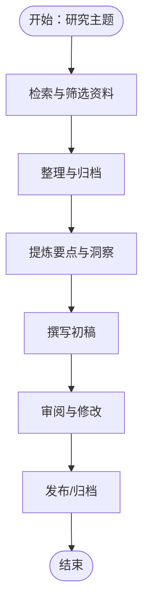

章节来源
- [skills/research/arxiv/SKILL.md](file://skills/research/arxiv/SKILL.md)
- [skills/research/blogwatcher/SKILL.md](file://skills/research/blogwatcher/SKILL.md)
- [skills/research/llm-wiki/SKILL.md](file://skills/research/llm-wiki/SKILL.md)
- [skills/research/polymarket/SKILL.md](file://skills/research/polymarket/SKILL.md)
- [skills/research/research-paper-writing/SKILL.md](file://skills/research/research-paper-writing/SKILL.md)

### 生产力技能
- 功能特点
  - 聚焦办公自动化与项目管理，覆盖表格、文档、日历、OCR 与演示文稿等常用场景。
- 典型技能清单
  - Airtable、Google Workspace、地图、Nano PDF、Notion、OCR 与文档、PowerPoint、Teams 会议流水线
- 使用方法与最佳实践
  - 统一数据源与模板，减少重复录入。
  - 利用自动化流水线处理常规会议与报告，释放人工时间。
  - OCR 文档处理建议先做预处理（裁剪、去噪），提升识别准确率。
- 关键流程示意

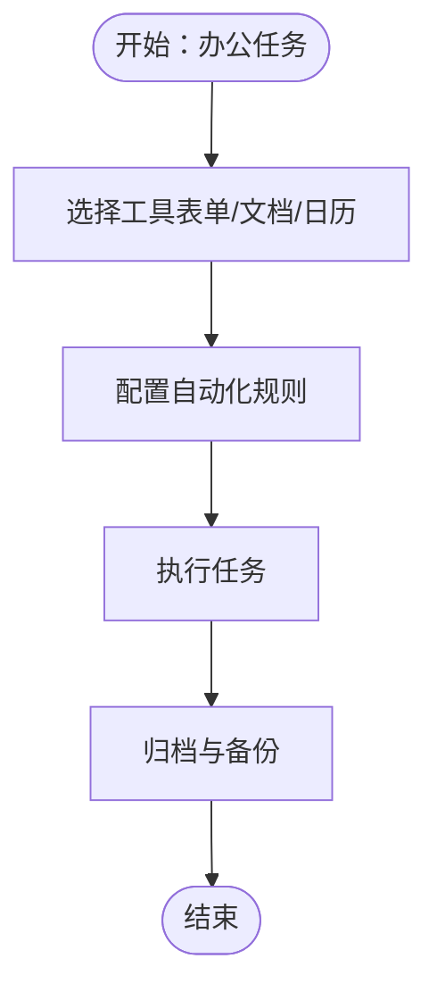

章节来源
- [skills/productivity/airtable/SKILL.md](file://skills/productivity/airtable/SKILL.md)
- [skills/productivity/google-workspace/SKILL.md](file://skills/productivity/google-workspace/SKILL.md)
- [skills/productivity/maps/SKILL.md](file://skills/productivity/maps/SKILL.md)
- [skills/productivity/nano-pdf/SKILL.md](file://skills/productivity/nano-pdf/SKILL.md)
- [skills/productivity/notion/SKILL.md](file://skills/productivity/notion/SKILL.md)
- [skills/productivity/ocr-and-documents/SKILL.md](file://skills/productivity/ocr-and-documents/SKILL.md)
- [skills/productivity/powerpoint/SKILL.md](file://skills/productivity/powerpoint/SKILL.md)
- [skills/productivity/teams-meeting-pipeline/SKILL.md](file://skills/productivity/teams-meeting-pipeline/SKILL.md)

### DevOps 技能
- 功能特点
  - 提供容器管理、系统监督、隧道与监控等运维能力，支撑基础设施自动化与可观测性。
- 典型技能清单
  - Kanban 编排器、Kanban 执行者
- 使用方法与最佳实践
  - 将复杂任务拆分为 Kanban 流水线，明确节点与负责人。
  - 结合监督脚本与告警机制，保障系统稳定性。
- 关键流程示意

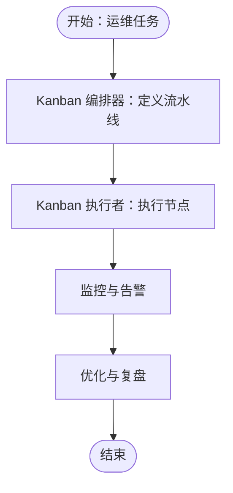

章节来源
- [skills/devops/kanban-orchestrator/SKILL.md](file://skills/devops/kanban-orchestrator/SKILL.md)
- [skills/devops/kanban-worker/SKILL.md](file://skills/devops/kanban-worker/SKILL.md)

### GitHub 技能
- 功能特点
  - 围绕仓库管理、PR 工作流、代码审查与问题管理，提升协作效率与质量控制。
- 典型技能清单
  - 代码库检查、认证、代码审查、Issue、PR 工作流、仓库管理
- 使用方法与最佳实践
  - PR 工作流中严格执行审查清单与自动化检查。
  - Issue 分类与标签规范化，便于追踪与统计。
- 关键流程示意

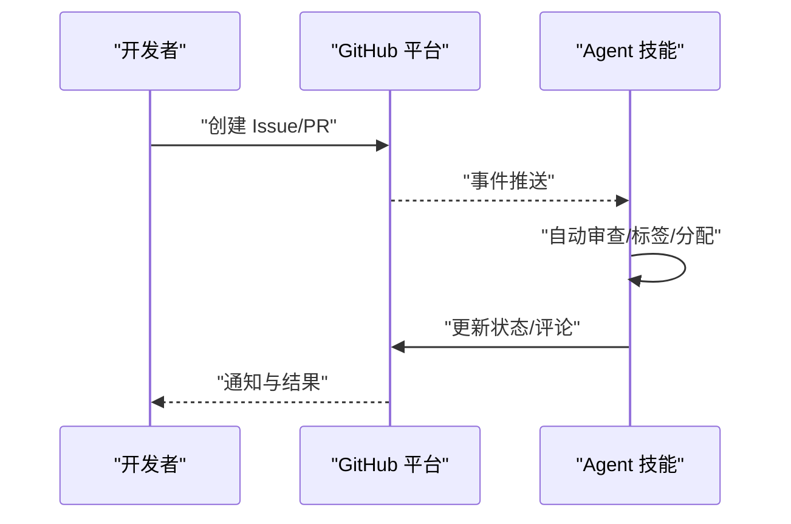

章节来源
- [skills/github/codebase-inspection/SKILL.md](file://skills/github/codebase-inspection/SKILL.md)
- [skills/github/github-auth/SKILL.md](file://skills/github/github-auth/SKILL.md)
- [skills/github/github-code-review/SKILL.md](file://skills/github/github-code-review/SKILL.md)
- [skills/github/github-issues/SKILL.md](file://skills/github/github-issues/SKILL.md)
- [skills/github/github-pr-workflow/SKILL.md](file://skills/github/github-pr-workflow/SKILL.md)
- [skills/github/github-repo-management/SKILL.md](file://skills/github/github-repo-management/SKILL.md)

### 媒体技能
- 功能特点
  - 聚焦 GIF 搜索、音乐与视频内容消费与聚合，满足信息与娱乐需求。
- 典型技能清单
  - GIF 搜索、Heartmula、SongSee、YouTube 内容
- 使用方法与最佳实践
  - 明确内容用途（信息图解/背景音乐/教学素材），选择合适来源。
  - 注意版权与合规要求，优先使用开源或授权内容。
- 关键流程示意

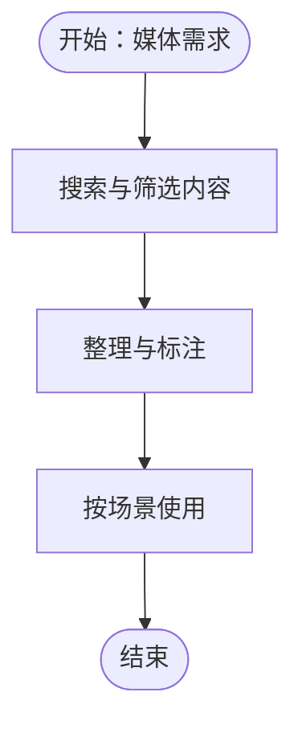

章节来源
- [skills/media/gif-search/SKILL.md](file://skills/media/gif-search/SKILL.md)
- [skills/media/heartmula/SKILL.md](file://skills/media/heartmula/SKILL.md)
- [skills/media/songsee/SKILL.md](file://skills/media/songsee/SKILL.md)
- [skills/media/youtube-content/SKILL.md](file://skills/media/youtube-content/SKILL.md)

### MLOps 技能
- 功能特点
  - 覆盖模型训练、推理、向量库与数据集管理，支撑端到端机器学习生命周期。
- 典型技能清单
  - 评估、HuggingFace Hub、推理、模型管理
- 使用方法与最佳实践
  - 明确评估指标与基线，确保可比性。
  - 推理阶段关注延迟与吞吐，必要时启用量化或蒸馏。
- 关键流程示意

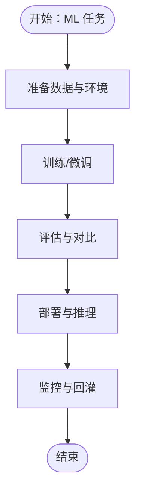

章节来源
- [skills/mlops/evaluation/SKILL.md](file://skills/mlops/evaluation/SKILL.md)
- [skills/mlops/huggingface-hub/SKILL.md](file://skills/mlops/huggingface-hub/SKILL.md)
- [skills/mlops/inference/SKILL.md](file://skills/mlops/inference/SKILL.md)
- [skills/mlops/models/SKILL.md](file://skills/mlops/models/SKILL.md)

### 通信技能
- 功能特点
  - 邮件与社交平台集成，实现消息自动化与跨平台协同。
- 典型技能清单
  - XURL
- 使用方法与最佳实践
  - 统一消息模板与路由策略，确保一致性与可追溯性。
- 关键流程示意

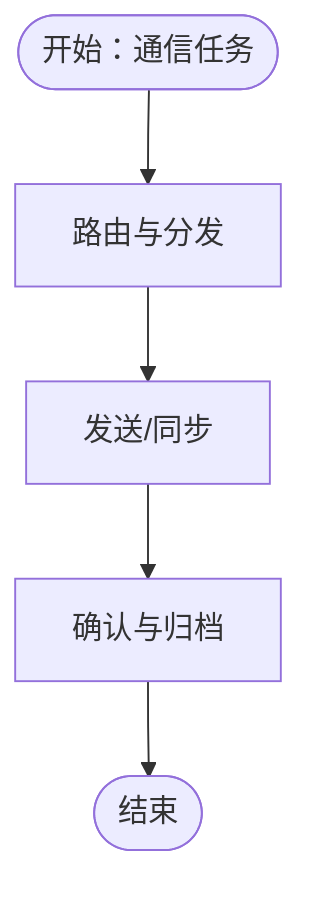

章节来源
- [skills/communication/xurl/SKILL.md](file://skills/communication/xurl/SKILL.md)

### 智能家居技能
- 功能特点
  - 连接与控制智能设备，如灯光与环境控制。
- 典型技能清单
  - OpenHue
- 使用方法与最佳实践
  - 建立场景化自动化规则，结合传感器与定时触发。
- 关键流程示意

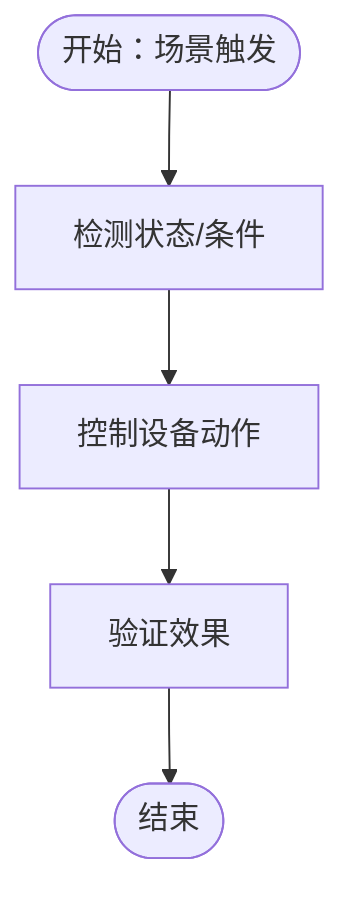

章节来源
- [skills/smart-home/openhue/SKILL.md](file://skills/smart-home/openhue/SKILL.md)

### 笔记技能
- 功能特点
  - 与笔记应用集成，实现内容检索与工作流自动化。
- 典型技能清单
  - Obsidian
- 使用方法与最佳实践
  - 建立双向链接与标签体系，提升检索效率。
- 关键流程示意

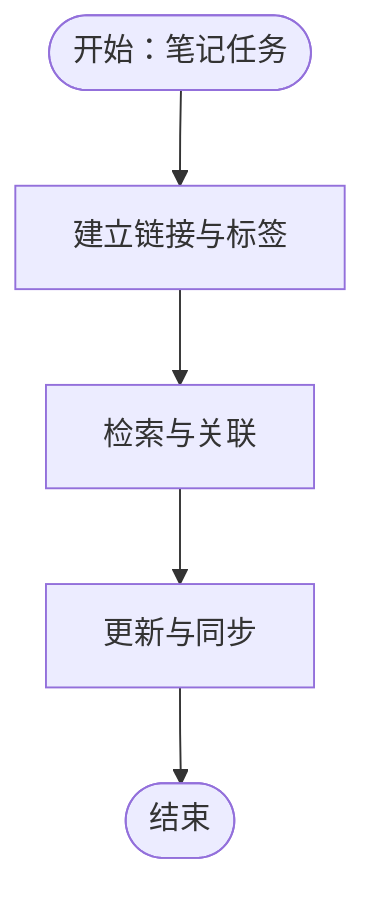

章节来源
- [skills/note-taking/obsidian/SKILL.md](file://skills/note-taking/obsidian/SKILL.md)

### 数据科学技能
- 功能特点
  - 提供交互式内核与可视化支持，加速数据分析与探索。
- 典型技能清单
  - Jupyter 实时内核
- 使用方法与最佳实践
  - 明确分析目标与假设，采用迭代式探索与验证。
- 关键流程示意

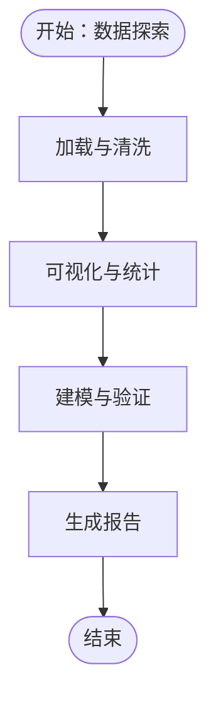

章节来源
- [skills/data-science/jupyter-live-kernel/SKILL.md](file://skills/data-science/jupyter-live-kernel/SKILL.md)

### Apple 设备技能
- 功能特点
  - 针对 macOS/iOS 生态的系统与应用自动化，覆盖笔记、提醒、查找与消息等。
- 典型技能清单
  - Apple Notes、Apple Reminders、FindMy、iMessage、macOS 计算机使用
- 使用方法与最佳实践
  - 利用系统原生能力与快捷指令，减少第三方依赖。
- 关键流程示意

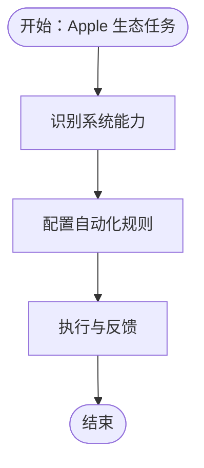

章节来源
- [skills/apple/apple-notes/SKILL.md](file://skills/apple/apple-notes/SKILL.md)
- [skills/apple/apple-reminders/SKILL.md](file://skills/apple/apple-reminders/SKILL.md)
- [skills/apple/findmy/SKILL.md](file://skills/apple/findmy/SKILL.md)
- [skills/apple/imessage/SKILL.md](file://skills/apple/imessage/SKILL.md)
- [skills/apple/macos-computer-use/SKILL.md](file://skills/apple/macos-computer-use/SKILL.md)

### 自主 AI 代理技能
- 功能特点
  - 多代理协作与编排，扩展智能体的自主执行能力。
- 典型技能清单
  - Claude Code、Codex、OpenCode、Hermes Agent
- 使用方法与最佳实践
  - 明确各代理角色与边界，避免冲突与重复劳动。
- 关键流程示意

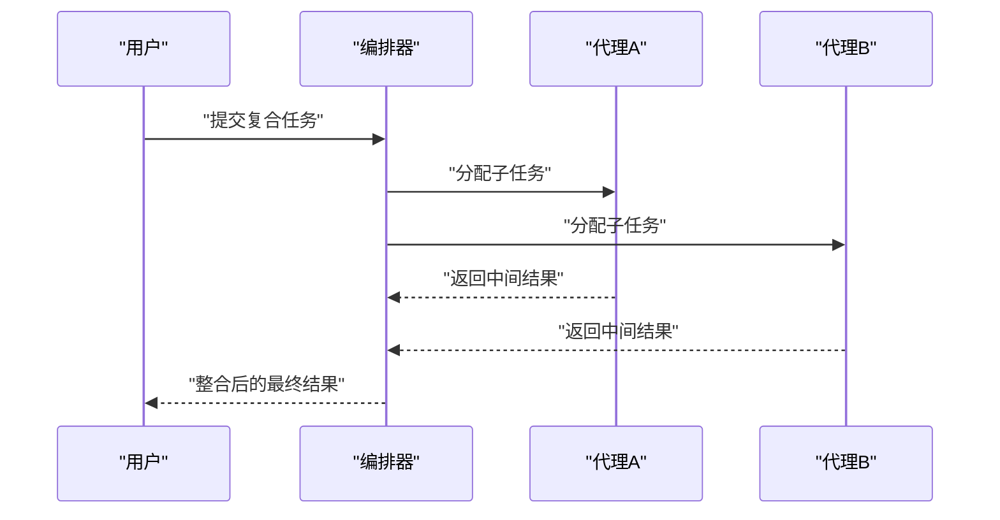

章节来源
- [skills/autonomous-ai-agents/claude-code/SKILL.md](file://skills/autonomous-ai-agents/claude-code/SKILL.md)
- [skills/autonomous-ai-agents/codex/SKILL.md](file://skills/autonomous-ai-agents/codex/SKILL.md)
- [skills/autonomous-ai-agents/opencode/SKILL.md](file://skills/autonomous-ai-agents/opencode/SKILL.md)
- [skills/autonomous-ai-agents/DESCRIPTION.md](file://skills/autonomous-ai-agents/DESCRIPTION.md)

### 红队技能
- 功能特点
  - 面向安全测试与对抗演练，提供攻击链构建与评估工具。
- 典型技能清单
  - Godmode
- 使用方法与最佳实践
  - 严格遵守授权范围与最小影响原则，做好审计与回滚预案。
- 关键流程示意

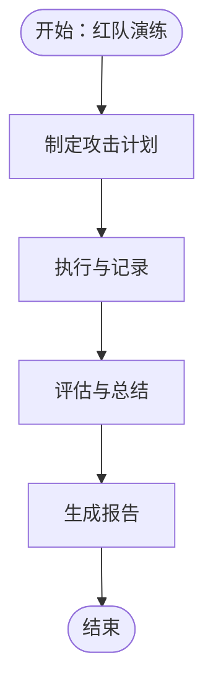

章节来源
- [skills/red-teaming/godmode/SKILL.md](file://skills/red-teaming/godmode/SKILL.md)

## 依赖分析
- 技能间耦合关系
  - 创意技能与媒体技能常配合使用，用于内容生产与传播。
  - 开发技能与 GitHub 技能紧密耦合，贯穿 CI/CD 与质量控制。
  - 数据科学技能与 MLOps 技能互补，前者重探索，后者重落地。
  - 自主 AI 代理技能可作为上层编排，协调其他技能执行。
- 外部依赖
  - 各技能对外部平台/工具的依赖差异较大，需在部署时统一配置凭据与网络策略。
- 潜在循环依赖
  - 通过“编排器-技能-外部服务”的分层设计，降低循环依赖风险。

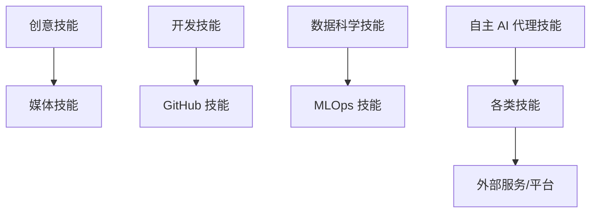

## 性能考虑
- 资源占用
  - 视频/图像生成类技能通常计算密集，建议在具备 GPU 的环境中运行。
- 延迟与吞吐
  - 推理类技能应关注并发与缓存策略，避免热点导致的拥塞。
- 可靠性
  - 对外依赖失败时，应具备降级与重试机制，保证整体可用性。
- 安全与合规
  - 红队技能与安全相关技能需严格权限控制与审计留痕。

## 故障排除指南
- 常见问题
  - 技能无法加载：检查 SKILL.md 是否正确声明依赖与入口。
  - 外部服务不可达：核对凭据、网络策略与速率限制。
  - 输出不符合预期：调整提示词、参数或前置处理步骤。
- 排查步骤
  - 启用详细日志，定位失败环节。
  - 分离问题域（输入/处理/输出），逐段验证。
  - 使用最小化样例复现问题，缩小排查范围。

## 结论
Hermes Agent 的内置技能体系以“场景驱动 + 工具链互补”为核心，覆盖从创意到生产的全链路任务。通过规范化的技能描述与统一的执行接口，既能满足个人用户的高效工作流，也能支撑团队协作与自动化运维。建议在实际使用中结合自身场景，优先选择成熟度高、依赖少的技能组合，并持续优化参数与流程。

## 附录
- 可选技能补充
  - 可选技能覆盖更广泛的领域，如区块链、Web 开发、MCP、健康、游戏、内部试用等，可根据需要按需启用。
- 最佳实践清单
  - 明确目标与边界，避免过度依赖单一技能。
  - 建立版本化与回滚策略，确保变更可控。
  - 注重数据隐私与合规，尤其是涉及外部平台与敏感信息的场景。