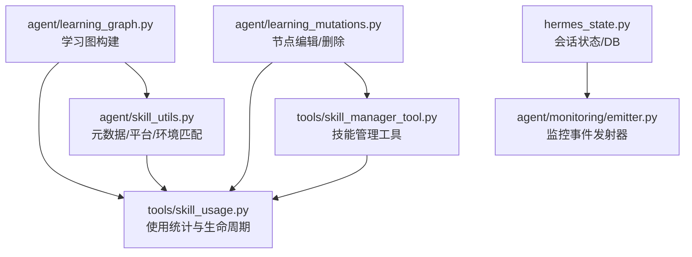
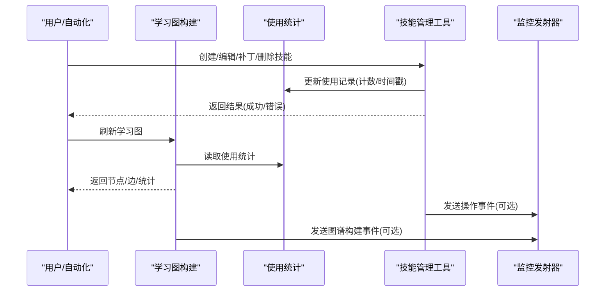
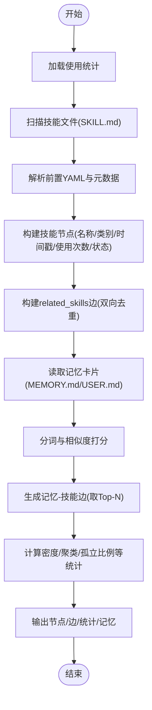
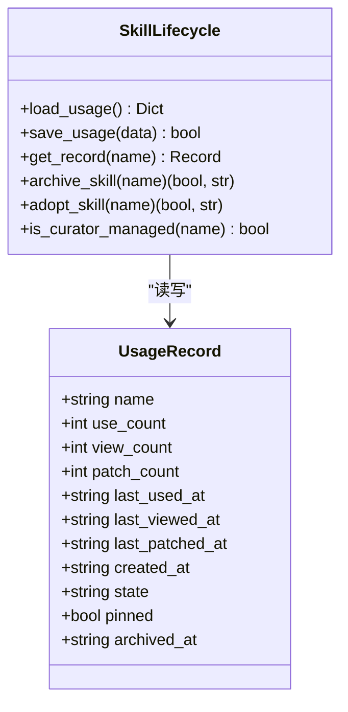
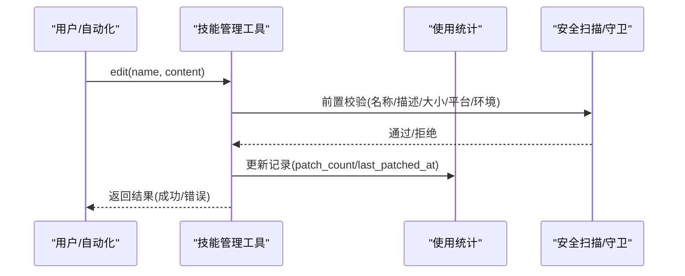
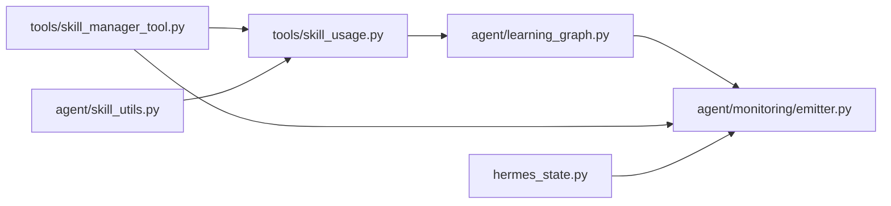

# 技能优化机制

<cite>
**本文引用的文件**
- [agent/learning_graph.py](file://agent/learning_graph.py)
- [agent/learning_mutations.py](file://agent/learning_mutations.py)
- [tools/skill_usage.py](file://tools/skill_usage.py)
- [tools/skill_manager_tool.py](file://tools/skill_manager_tool.py)
- [agent/skill_utils.py](file://agent/skill_utils.py)
- [hermes_state.py](file://hermes_state.py)
- [agent/monitoring/emitter.py](file://agent/monitoring/emitter.py)
</cite>

## 目录
1. [简介](#简介)
2. [项目结构](#项目结构)
3. [核心组件](#核心组件)
4. [架构总览](#架构总览)
5. [详细组件分析](#详细组件分析)
6. [依赖关系分析](#依赖关系分析)
7. [性能考量](#性能考量)
8. [故障排查指南](#故障排查指南)
9. [结论](#结论)
10. [附录](#附录)

## 简介
本文件系统化阐述 Hermes Agent 的“技能优化机制”，覆盖技能的自我改进与学习循环、使用统计收集、性能分析与错误模式识别、优化建议生成，以及学习图（Learning Graph）的构建、节点关系分析与路径优化。文档还涵盖技能版本演进、配置调优、资源使用优化与响应时间改进，并提供质量评估指标、A/B 测试框架、回滚机制与灰度发布策略的实践建议。最后给出性能监控工具使用指南，包括内存占用、CPU 使用率、网络请求与数据库查询的优化方法，帮助开发者进行数据驱动的优化与最佳实践落地。

## 项目结构
围绕技能优化机制的关键代码分布在以下模块：
- 学习图构建与可视化：agent/learning_graph.py
- 学习图节点的编辑/删除（记忆与技能）：agent/learning_mutations.py
- 技能使用遥测与生命周期管理：tools/skill_usage.py
- 技能创建/编辑/补丁/删除与安全校验：tools/skill_manager_tool.py
- 技能元数据解析、平台与环境匹配、外部目录与禁用列表：agent/skill_utils.py
- 会话状态存储与 WAL/FTS 等持久化细节：hermes_state.py
- 监控事件发射器（OTLP 流式导出）：agent/monitoring/emitter.py

**图表来源**
- [agent/learning_graph.py:125-323](file://agent/learning_graph.py#L125-L323)
- [tools/skill_usage.py:662-771](file://tools/skill_usage.py#L662-L771)
- [agent/skill_utils.py:174-387](file://agent/skill_utils.py#L174-L387)
- [agent/learning_mutations.py:86-186](file://agent/learning_mutations.py#L86-L186)
- [tools/skill_manager_tool.py:527-662](file://tools/skill_manager_tool.py#L527-L662)
- [hermes_state.py:91-125](file://hermes_state.py#L91-L125)
- [agent/monitoring/emitter.py:36-117](file://agent/monitoring/emitter.py#L36-L117)

**章节来源**
- [agent/learning_graph.py:1-329](file://agent/learning_graph.py#L1-L329)
- [agent/learning_mutations.py:1-207](file://agent/learning_mutations.py#L1-L207)
- [tools/skill_usage.py:1-800](file://tools/skill_usage.py#L1-L800)
- [tools/skill_manager_tool.py:1-800](file://tools/skill_manager_tool.py#L1-L800)
- [agent/skill_utils.py:1-800](file://agent/skill_utils.py#L1-L800)
- [hermes_state.py:1-800](file://hermes_state.py#L1-L800)
- [agent/monitoring/emitter.py:1-212](file://agent/monitoring/emitter.py#L1-L212)

## 核心组件
- 学习图（Learning Graph）：聚合“已学习”的技能与记忆卡片，构建节点与边，提供密度统计与聚类信息，用于桌面端可视化与洞察。
- 技能使用统计与生命周期：通过侧车 JSON 记录每次使用、查看、补丁的时间戳与计数，驱动自动老化、归档与恢复流程。
- 技能管理工具：提供创建、编辑、补丁、删除、写入支持文件等操作，并包含安全扫描、前置校验与背景审查守卫。
- 元数据与环境匹配：解析 SKILL.md 的前置 YAML，判断平台与环境相关性，读取禁用列表与外部技能目录。
- 会话状态与持久化：SQLite 存储会话消息、搜索索引与压缩链；WAL 模式与兼容性处理保障并发与稳定性。
- 监控事件发射器：热路径无阻塞的事件队列与后台分发，支持 OTLP 指标/追踪/日志导出，失败隔离且不影响主流程。

**章节来源**
- [agent/learning_graph.py:125-323](file://agent/learning_graph.py#L125-L323)
- [tools/skill_usage.py:662-771](file://tools/skill_usage.py#L662-L771)
- [tools/skill_manager_tool.py:527-662](file://tools/skill_manager_tool.py#L527-L662)
- [agent/skill_utils.py:174-387](file://agent/skill_utils.py#L174-L387)
- [hermes_state.py:91-125](file://hermes_state.py#L91-L125)
- [agent/monitoring/emitter.py:36-117](file://agent/monitoring/emitter.py#L36-L117)

## 架构总览
技能优化机制由“数据采集—图谱构建—变更执行—监控反馈”闭环组成：
- 采集：技能使用统计（使用/查看/补丁）、记忆卡片内容、SKILL.md 元数据。
- 图谱：基于使用信号与相关技能声明构建学习图，连接记忆与技能节点。
- 变更：用户或自动化流程对技能/记忆进行编辑或删除，触发缓存清理与状态更新。
- 监控：事件发射器将关键操作与性能指标以批处理方式导出至 OTLP 后端，供分析与告警。

**图表来源**
- [tools/skill_manager_tool.py:527-662](file://tools/skill_manager_tool.py#L527-L662)
- [tools/skill_usage.py:662-771](file://tools/skill_usage.py#L662-L771)
- [agent/learning_graph.py:125-323](file://agent/learning_graph.py#L125-L323)
- [agent/monitoring/emitter.py:36-117](file://agent/monitoring/emitter.py#L36-L117)

## 详细组件分析

### 学习图（Learning Graph）构建与路径优化
- 节点来源：非基础安装、具有学习信号的“已学习”技能（代理创建或使用过），以及来自 MEMORY.md/USER.md 的记忆卡片。
- 边来源：
  - 显式声明的 related_skills 双向边（去重）。
  - 记忆与技能之间的词法重叠边（按标题+正文分词打分，取前若干条）。
- 统计与聚类：计算节点数、边密度、孤立比例、类别分布、代理创建数量、被使用数量等。
- 路径优化思路：
  - 优先展示高 use_count 与最近活动时间的技能节点。
  - 通过记忆-技能边发现潜在关联，辅助推荐与检索。
  - 结合类别聚类，形成知识域视图，便于导航与优化。

**图表来源**
- [agent/learning_graph.py:125-323](file://agent/learning_graph.py#L125-L323)

**章节来源**
- [agent/learning_graph.py:125-323](file://agent/learning_graph.py#L125-L323)

### 技能使用统计与生命周期管理
- 侧车文件：~/.hermes/skills/.usage.json，键为技能名，值为记录（use_count/view_count/patch_count、last_used_at/last_viewed_at/last_patched_at、created_at、state、pinned、archived_at 等）。
- 原子写入：临时文件 + os.replace，确保并发安全。
- 生命周期状态：active → stale → archived；pinned 可豁免自动转换。
- 保护内置技能：PROTECTED_BUILTIN_SKILLS 永不归档或合并。
- 代理创建标记：created_by="agent" 表示纳入 Curator 管理范围。
- 外部/Hub/打包技能：不可被 Curator 直接归档或删除，需遵循所有权策略。

**图表来源**
- [tools/skill_usage.py:644-771](file://tools/skill_usage.py#L644-L771)

**章节来源**
- [tools/skill_usage.py:1-800](file://tools/skill_usage.py#L1-L800)

### 技能管理工具（创建/编辑/补丁/删除）
- 创建：生成 SKILL.md 与目录结构，校验名称/描述长度与格式。
- 编辑：替换 SKILL.md 内容，支持前置校验与大小限制。
- 补丁：在 SKILL.md 或支持文件中进行定向查找替换。
- 删除：受 pin 保护、外部目录只读、Hub/打包技能保护等约束。
- 安全扫描：可选的安全扫描（skills.guard_agent_created），阻止危险内容。
- 背景审查守卫：后台维护分支仅允许对本地 Curator 管理的技能进行写操作，要求先读后写。

**图表来源**
- [tools/skill_manager_tool.py:527-662](file://tools/skill_manager_tool.py#L527-L662)
- [tools/skill_usage.py:662-771](file://tools/skill_usage.py#L662-L771)

**章节来源**
- [tools/skill_manager_tool.py:1-800](file://tools/skill_manager_tool.py#L1-L800)
- [tools/skill_usage.py:1-800](file://tools/skill_usage.py#L1-L800)

### 元数据与环境匹配
- 前置 YAML 解析：支持完整 YAML 与简单 key:value 回退，兼容 UTF-8 BOM。
- 平台匹配：platforms 字段决定跨平台可用性（macos/linux/windows/termux/android）。
- 环境匹配：environments 字段（kanban/docker/s6）作为“相关性门控”，影响技能索引与呈现。
- 禁用列表：从 config.yaml 读取全局与平台特定禁用技能集合。
- 外部目录：skills.external_dirs 扩展技能根目录，支持展开变量与去重。

**章节来源**
- [agent/skill_utils.py:174-387](file://agent/skill_utils.py#L174-L387)
- [agent/skill_utils.py:436-580](file://agent/skill_utils.py#L436-L580)

### 会话状态与持久化（WAL/FTS/压缩）
- SQLite WAL 模式：提升并发读能力，但在 NFS/SMB/FUSE/ZFS 上可能不兼容，会回退到 journal_mode=DELETE。
- FTS5 全文搜索：跨会话消息快速检索。
- 压缩与拆分：通过 parent_session_id 链实现会话压缩与拆分，避免过大会话影响性能。
- macOS 同步与检查点：启用 FULL fsync 与 checkpoint_fullfsync，降低关机时损坏风险。
- 测试隔离：防止测试误开生产 state.db，避免破坏真实数据。

**章节来源**
- [hermes_state.py:91-125](file://hermes_state.py#L91-L125)
- [hermes_state.py:485-565](file://hermes_state.py#L485-L565)
- [hermes_state.py:697-780](file://hermes_state.py#L697-L780)

### 监控事件发射器（OTLP 导出）
- 热路径不变式：emit() 必须微秒级返回，不阻塞磁盘/网络，绝不抛出异常。
- 环形队列：最大容量 10,000，满时丢弃最旧事件，保证内存可控。
- 后台分发：批量（默认 256）发送至订阅者（OTLP 流式导出），每个订阅者失败隔离。
- 生命周期：按需启动线程，支持 flush/close/stats 等运维接口。

**章节来源**
- [agent/monitoring/emitter.py:1-212](file://agent/monitoring/emitter.py#L1-L212)

## 依赖关系分析
- 学习图依赖使用统计与元数据解析，以构建高质量的知识图谱。
- 技能管理工具依赖使用统计进行生命周期更新，并受安全扫描与守卫约束。
- 元数据与环境匹配影响技能可见性与路由，间接影响学习图与使用统计。
- 会话状态与监控发射器为系统级支撑，确保持久化与可观测性。

**图表来源**
- [tools/skill_usage.py:662-771](file://tools/skill_usage.py#L662-L771)
- [agent/learning_graph.py:125-323](file://agent/learning_graph.py#L125-L323)
- [tools/skill_manager_tool.py:527-662](file://tools/skill_manager_tool.py#L527-L662)
- [agent/skill_utils.py:174-387](file://agent/skill_utils.py#L174-L387)
- [agent/monitoring/emitter.py:36-117](file://agent/monitoring/emitter.py#L36-L117)
- [hermes_state.py:91-125](file://hermes_state.py#L91-L125)

**章节来源**
- [tools/skill_usage.py:1-800](file://tools/skill_usage.py#L1-L800)
- [agent/learning_graph.py:1-329](file://agent/learning_graph.py#L1-L329)
- [tools/skill_manager_tool.py:1-800](file://tools/skill_manager_tool.py#L1-L800)
- [agent/skill_utils.py:1-800](file://agent/skill_utils.py#L1-L800)
- [agent/monitoring/emitter.py:1-212](file://agent/monitoring/emitter.py#L1-L212)
- [hermes_state.py:1-800](file://hermes_state.py#L1-L800)

## 性能考量
- 学习图构建：
  - 使用统计与元数据解析采用轻量加载与缓存，避免重复 I/O。
  - 记忆-技能边通过分词与打分控制计算量，取 Top-N 减少边膨胀。
- 技能管理：
  - 前置校验与大小限制减少无效写入与上下文溢出。
  - 安全扫描与守卫仅在必要时启用，避免影响前台体验。
- 会话状态：
  - WAL 模式提升并发读，文件系统不兼容时自动回退。
  - FTS5 索引加速检索，压缩链避免大会话导致的性能退化。
- 监控发射器：
  - 环形队列与批量分发降低热路径开销，失败隔离确保主流程稳定。

[本节为通用性能讨论，无需具体文件引用]

## 故障排查指南
- 学习图异常：
  - 检查 .usage.json 是否可读与结构正确，确认技能文件是否存在与前置 YAML 是否有效。
  - 若记忆-技能边缺失，检查分词逻辑与文本内容是否符合预期。
- 技能管理失败：
  - 确认名称/描述格式与长度限制，检查平台与环境匹配是否满足。
  - 若被安全扫描阻断，查看报告并调整内容；若被守卫拒绝，确认是否为后台维护分支且目标技能是否 Curator 管理。
- 会话状态问题：
  - 若 state.db 不可用，查看初始化错误提示（如 NFS/SMB/WAL 不兼容），考虑迁移到本地磁盘或调整配置。
  - 在 macOS 上注意同步与检查点设置，避免关机时损坏。
- 监控数据丢失：
  - 检查发射器是否启用与订阅者是否注册，查看 stats 中的 dropped/dispatched 计数。
  - 若 OTLP 后端不可达，确认网络与认证配置，关注失败隔离日志。

**章节来源**
- [agent/learning_graph.py:125-323](file://agent/learning_graph.py#L125-L323)
- [tools/skill_manager_tool.py:527-662](file://tools/skill_manager_tool.py#L527-L662)
- [hermes_state.py:674-780](file://hermes_state.py#L674-L780)
- [agent/monitoring/emitter.py:152-164](file://agent/monitoring/emitter.py#L152-L164)

## 结论
Hermes Agent 的技能优化机制通过“使用统计—学习图—变更执行—监控反馈”的闭环，实现了技能的自我改进与持续优化。学习图将分散的技能与记忆组织成可视化的知识网络，配合生命周期管理与安全守卫，确保优化过程稳健可靠。监控发射器提供低开销的可观测性，支持性能分析与问题定位。开发者可基于这些能力进行数据驱动的优化，制定质量评估、A/B 测试、回滚与灰度发布策略，持续提升技能质量与系统性能。

[本节为总结性内容，无需具体文件引用]

## 附录
- 质量评估指标建议：
  - 使用频率（use_count）、最近活动时间（last_used_at）、补丁次数（patch_count）、状态（state/pinned）。
  - 学习图密度（edges_per_node）、孤立比例（isolated_pct）、类别分布（top_categories）。
- A/B 测试框架建议：
  - 基于技能版本或配置开关进行分组，对比使用效果与用户满意度。
  - 通过监控发射器收集关键指标，进行统计显著性检验。
- 回滚机制建议：
  - 利用 Curator 的归档与恢复能力，快速回退到历史版本。
  - 结合 Git 或版本化配置，实现细粒度回滚。
- 灰度发布策略建议：
  - 逐步扩大新技能或配置的覆盖范围，观察指标变化。
  - 设置阈值告警，出现异常时自动回滚。
- 性能监控工具使用指南：
  - 内存占用：关注学习图构建与记忆卡片的内存峰值，合理控制输入规模。
  - CPU 使用率：优化分词与打分算法，避免全量扫描。
  - 网络请求：监控 OTLP 导出成功率与延迟，调整批量大小与重试策略。
  - 数据库查询：利用 FTS5 索引与 WAL 模式，避免大事务与锁竞争。

[本节为通用指导，无需具体文件引用]