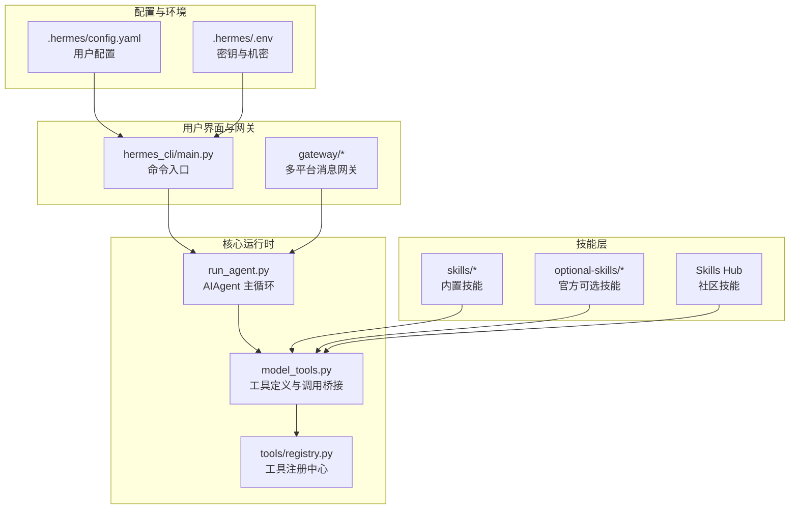
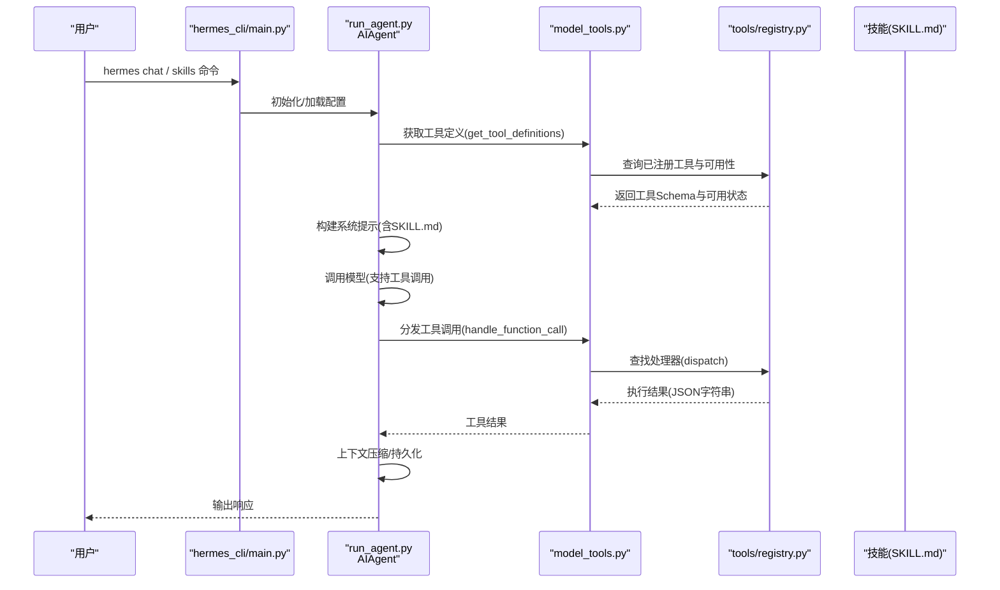
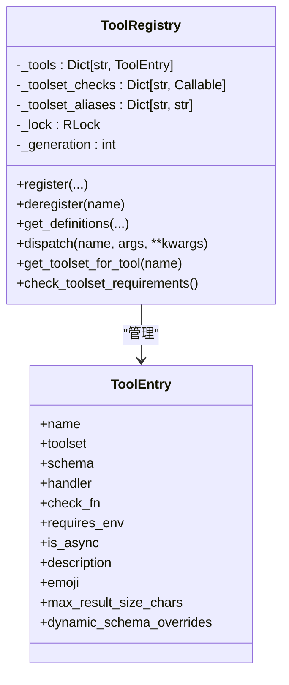
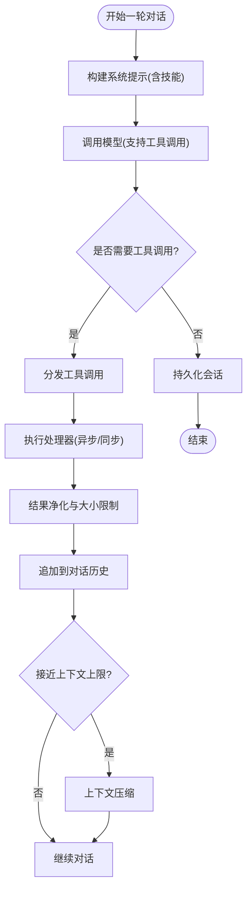
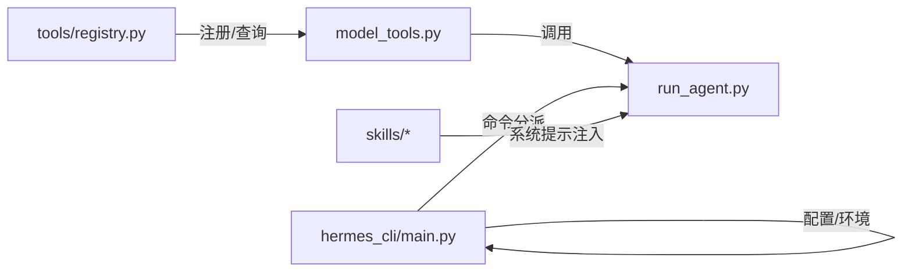

# 开发最佳实践

<cite>
**本文引用的文件**
- [README.md](file://README.md)
- [CONTRIBUTING.md](file://CONTRIBUTING.md)
- [SECURITY.md](file://SECURITY.md)
- [agent/__init__.py](file://agent/__init__.py)
- [tools/registry.py](file://tools/registry.py)
- [hermes_cli/main.py](file://hermes_cli/main.py)
- [run_agent.py](file://run_agent.py)
- [skills/creative/architecture-diagram/SKILL.md](file://skills/creative/architecture-diagram/SKILL.md)
- [skills/software-development/hermes-agent-skill-authoring/SKILL.md](file://skills/software-development/hermes-agent-skill-authoring/SKILL.md)
- [skills/software-development/test-driven-development/SKILL.md](file://skills/software-development/test-driven-development/SKILL.md)
- [skills/software-development/systematic-debugging/SKILL.md](file://skills/software-development/systematic-debugging/SKILL.md)
- [skills/software-development/requesting-code-review/SKILL.md](file://skills/software-development/requesting-code-review/SKILL.md)
- [skills/software-development/python-debugpy/SKILL.md](file://skills/software-development/python-debugpy/SKILL.md)
- [skills/software-development/node-inspect-debugger/SKILL.md](file://skills/software-development/node-inspect-debugger/SKILL.md)
- [skills/software-development/spike/SKILL.md](file://skills/software-development/spike/SKILL.md)
- [skills/software-development/plan/SKILL.md](file://skills/software-development/plan/SKILL.md)
- [optional-skills/software-development/code-wiki/SKILL.md](file://optional-skills/software-development/code-wiki/SKILL.md)
</cite>

## 目录
1. [引言](#引言)
2. [项目结构](#项目结构)
3. [核心组件](#核心组件)
4. [架构总览](#架构总览)
5. [详细组件分析](#详细组件分析)
6. [依赖关系分析](#依赖关系分析)
7. [性能考量](#性能考量)
8. [故障排查指南](#故障排查指南)
9. [结论](#结论)
10. [附录](#附录)

## 引言
本指南面向技能开发者与工程团队，系统阐述在 Hermes Agent 体系中进行“技能开发”的最佳实践。内容覆盖代码规范、设计模式、架构原则、安全性、性能优化、可维护性与可扩展性、团队协作与代码审查流程，并结合仓库内的真实技能示例与反面教材，帮助你在保证安全与稳定的同时，高效交付高质量技能。

## 项目结构
Hermes Agent 的技能开发围绕“工具注册中心 + 智能体对话循环 + 多平台网关”展开。技能以“自描述文档 + 可选脚本/模板”的形式存在，通过统一的工具注册机制与系统提示词注入到智能体行为中。

图示来源
- [run_agent.py](file://run_agent.py)
- [tools/registry.py](file://tools/registry.py)
- [hermes_cli/main.py](file://hermes_cli/main.py)

章节来源
- [README.md](file://README.md)
- [CONTRIBUTING.md](file://CONTRIBUTING.md)

## 核心组件
- 工具注册中心：集中管理工具的模式、处理器、可用性检查与动态覆盖，支持 TTL 缓存与线程安全快照，确保工具发现与调度高效稳定。
- 智能体主循环：负责构建系统提示词、调用模型、分发工具调用、上下文压缩与会话持久化。
- 命令行入口：解析参数、加载环境变量、初始化日志与网络偏好，协调 CLI/TUI/GUI 启动路径。
- 技能系统：以 SKILL.md 为契约，声明能力、前置条件、触发条件与验证步骤；可按平台与工具集条件动态显示。

章节来源
- [tools/registry.py](file://tools/registry.py)
- [run_agent.py](file://run_agent.py)
- [hermes_cli/main.py](file://hermes_cli/main.py)
- [CONTRIBUTING.md](file://CONTRIBUTING.md)

## 架构总览
技能开发遵循“声明式能力 + 注册式工具 + 动态系统提示”的架构范式。工具通过自注册进入注册中心，智能体在每轮对话中根据可用工具与技能条件生成系统提示，驱动模型选择合适工具完成任务。

图示来源
- [run_agent.py](file://run_agent.py)
- [tools/registry.py](file://tools/registry.py)
- [hermes_cli/main.py](file://hermes_cli/main.py)

## 详细组件分析

### 组件A：工具注册中心（ToolRegistry）
- 设计要点
  - 自注册：每个工具文件在模块级调用注册函数，形成“声明即接入”的生态。
  - 可用性探测：通过 check_fn 对外部依赖进行 TTL 缓存，避免频繁探针开销。
  - 线程安全：读写分离的锁与代际计数器，保障并发场景下的快照一致性。
  - 动态覆盖：支持运行时对工具 Schema 的动态覆盖，适配配置变化。
- 性能特性
  - 30 秒 TTL 缓存 + 单次调用内缓存，平衡实时性与性能。
  - 快速失败与错误归一化，避免异常传播影响主回路。
- 安全与健壮性
  - 未知工具返回标准化错误；异常被捕获并经净化器处理，防止结构化噪声污染模型输出。

图示来源
- [tools/registry.py](file://tools/registry.py)

章节来源
- [tools/registry.py](file://tools/registry.py)

### 组件B：智能体主循环（AIAgent）
- 设计要点
  - 会话数据库：首次使用时惰性创建会话记录，失败不中断主流程。
  - 上下文引擎过渡：支持插件式上下文压缩器的生命周期钩子，平滑迁移会话状态。
  - 静默打印与状态回调：在流式播放期间抑制非强制输出，避免协议污染。
- 性能与可靠性
  - 令牌预算与成本估算：会话级令牌与费用统计，便于成本控制。
  - 超大工具结果落盘：超过阈值的结果写入临时文件，避免内存压力。
- 安全与合规
  - 敏感信息脱敏：消息与工具结果的敏感片段脱敏处理。
  - 中断与清理：终端后端、浏览器等资源在退出时清理，降低残留风险。

图示来源
- [run_agent.py](file://run_agent.py)

章节来源
- [run_agent.py](file://run_agent.py)

### 组件C：命令行入口（hermes_cli/main.py）
- 设计要点
  - 早期接口决策：基于配置与环境变量快速决定 CLI/TUI，默认 CLI 作为保守策略。
  - 主题与皮肤：通过 YAML 配置切换皮肤，无需修改代码。
  - 环境加载与网络偏好：优先加载用户环境文件，支持 IPv4 强制偏好。
- 可靠性
  - Termux 冷启动优化：版本查询、技能同步指纹与预取更新检查，减少启动延迟。
  - 参数解析与配置桥接：支持多档位配置覆盖，保证不同平台一致体验。

章节来源
- [hermes_cli/main.py](file://hermes_cli/main.py)

### 组件D：技能系统（SKILL.md 契约）
- 设计要点
  - 前言元数据：名称、描述、作者、平台限制、所需环境变量、标签与关联技能。
  - 触发条件：基于工具集/工具可用性的动态显示规则，避免无关技能干扰。
  - 结构化文档：包含“何时使用、前置条件、如何运行、快速参考、步骤、陷阱、验证”等章节，便于模型与人类共同理解。
- 可维护性
  - 平台限定：通过 platforms 字段屏蔽不兼容平台，减少误用。
  - 测试与示例：提供测试用例与示例，确保回归稳定。

章节来源
- [CONTRIBUTING.md](file://CONTRIBUTING.md)

## 依赖关系分析
- 模块耦合
  - run_agent.py 通过 model_tools 间接依赖 tools/registry.py，形成“工具定义—处理器—调度”的解耦链路。
  - hermes_cli/main.py 仅在启动期加载配置与环境，后续通过命令分派与回调与运行时解耦。
- 外部依赖
  - 工具可用性依赖外部服务或二进制（如容器、浏览器），通过 check_fn 探测并在 TTL 内复用。
- 循环依赖规避
  - 注册中心无对具体工具模块的直接导入，工具模块在导入时自注册，避免循环。

图示来源
- [tools/registry.py](file://tools/registry.py)
- [run_agent.py](file://run_agent.py)
- [hermes_cli/main.py](file://hermes_cli/main.py)

章节来源
- [tools/registry.py](file://tools/registry.py)
- [run_agent.py](file://run_agent.py)
- [hermes_cli/main.py](file://hermes_cli/main.py)

## 性能考量
- 工具可用性探测缓存
  - TTL 30 秒，兼顾配置变更的及时性与性能；变更后可通过显式失效刷新。
- 超大结果落盘
  - 对超长工具输出写入临时文件，避免内存峰值与序列化开销。
- 会话与令牌统计
  - 会话级令牌与费用统计，便于成本控制与预算告警。
- 启动路径优化
  - CLI 早期接口决策、Termux 冷启动优化与预取更新检查，缩短首帧时间。

章节来源
- [tools/registry.py](file://tools/registry.py)
- [run_agent.py](file://run_agent.py)
- [hermes_cli/main.py](file://hermes_cli/main.py)

## 故障排查指南
- 常见问题定位
  - 工具不可用：检查工具的 check_fn 是否返回 True；查看注册中心可用性报告。
  - 工具执行异常：确认处理器返回 JSON 字符串；异常会被净化器包装后再返回。
  - 会话创建失败：SQLite 锁冲突或权限问题，重试一次；必要时检查磁盘空间与权限。
- 日志与诊断
  - CLI 初始化日志与集中化文件日志；通过状态回调与生命周期消息辅助定位。
- 安全相关
  - 危险命令检测与用户审批流程；容器隔离与凭据剥离；禁止在日志中输出密钥。

章节来源
- [tools/registry.py](file://tools/registry.py)
- [run_agent.py](file://run_agent.py)
- [SECURITY.md](file://SECURITY.md)

## 结论
在 Hermes Agent 中开发技能的最佳实践，本质是以“声明式能力 + 注册式工具 + 动态系统提示”为核心的设计范式。通过严格的 SKILL.md 契约、工具注册中心的自注册与可用性探测、以及智能体主循环的上下文压缩与会话持久化，既能保证功能正确性，也能兼顾性能与安全。团队协作方面，遵循贡献指南中的作者署名、章节顺序与测试要求，可显著提升可维护性与可扩展性。

## 附录

### 代码规范与设计模式
- 代码风格
  - 遵循 PEP 8，注释仅用于解释非显而易见的意图与权衡。
  - 跨平台：避免假设 Unix 行为，使用 pathlib、psutil 等跨平台能力。
- 设计模式
  - 自注册：工具文件在模块级注册，减少集中式清单维护。
  - 策略模式：通过工具集与动态覆盖，适配不同运行时配置。
  - 回调与钩子：通过状态回调与上下文引擎钩子，扩展可观测性与生命周期管理。

章节来源
- [CONTRIBUTING.md](file://CONTRIBUTING.md)

### 安全性考虑
- 输入验证
  - shell 命令拼接使用安全转义；危险命令正则检测与用户审批。
  - 文件路径解析使用 realpath 防止符号链接绕过。
- 权限控制
  - 外部表面（网关、HTTP、编辑器）均需授权白名单；会话标识仅路由，不作授权边界。
- 数据保护
  - 凭据剥离：向子进程传递时默认剔除凭据；日志脱敏；禁止在日志中输出密钥。
- 隔离与边界
  - 仅操作系统隔离构成真实边界；内置启发式（审批门、输出脱敏、技能扫描）仅为事故预防。

章节来源
- [SECURITY.md](file://SECURITY.md)
- [CONTRIBUTING.md](file://CONTRIBUTING.md)

### 性能优化技巧
- 资源管理
  - 工具结果超长落盘；会话数据库惰性创建与失败降级。
- 缓存策略
  - 工具可用性 TTL 缓存；Termux 技能同步指纹与预取更新检查。
- 并发处理
  - 工具注册中心读写锁与快照；异步工具处理器自动桥接。

章节来源
- [tools/registry.py](file://tools/registry.py)
- [run_agent.py](file://run_agent.py)
- [hermes_cli/main.py](file://hermes_cli/main.py)

### 可维护性与可扩展性建议
- 可维护性
  - SKILL.md 章节顺序与长度约束；脚本与模板分离；测试先行。
- 可扩展性
  - 工具别名与覆盖策略；MCP 动态刷新；上下文引擎钩子扩展。

章节来源
- [CONTRIBUTING.md](file://CONTRIBUTING.md)
- [tools/registry.py](file://tools/registry.py)

### 团队协作与代码审查标准流程
- 贡献优先级：缺陷修复、跨平台兼容、安全加固、性能与鲁棒性、新技能、新工具、文档。
- 新技能判定：优先技能，工具仅在需要端到端集成与严格处理逻辑时采用。
- 内存提供程序：不再接受新的内置内存提供程序，建议以独立插件发布。
- 开发设置：安装 uv、Python 3.11、Node.js（可选），运行测试脚本与诊断命令。
- 代码风格与注释：PEP 8，避免显而易见的注释；错误处理捕获特定异常并记录。

章节来源
- [CONTRIBUTING.md](file://CONTRIBUTING.md)

### 技能开发案例与反面教材
- 优秀案例
  - architecture-diagram：明确输出要求（单文件、无外部依赖、纯 CSS 动画）、模板参考与系统图示例。
  - hermes-agent-skill-authoring：规范的 frontmatter、验证器与结构化模板，强调“先结构后实现”。
  - test-driven-development：强制 RED-GREEN-REFACTOR 流程，先写测试再写代码。
  - systematic-debugging：四阶段根因调试法，先理解问题再修复。
  - requesting-code-review：提交前安全扫描与质量门禁，自动修复常见问题。
  - python-debugpy / node-inspect-debugger：远程调试工具链，提供清晰的前置条件与操作步骤。
  - plan / spike：计划模式与一次性实验，强调小步快跑与最小可行产物。
  - code-wiki：架构文档模板与模块映射，强调“先架构后实现”。

- 反面教材
  - 描述冗长、超出长度限制、使用营销词汇、未遵循章节顺序、未提供测试与验证步骤、未声明平台限制与前置条件。
  - 将 shell 工具直接暴露给模型而不做封装，导致路径与权限问题。
  - 未使用工具注册中心，手工维护工具清单，增加维护成本与出错概率。

章节来源
- [skills/creative/architecture-diagram/SKILL.md](file://skills/creative/architecture-diagram/SKILL.md)
- [skills/software-development/hermes-agent-skill-authoring/SKILL.md](file://skills/software-development/hermes-agent-skill-authoring/SKILL.md)
- [skills/software-development/test-driven-development/SKILL.md](file://skills/software-development/test-driven-development/SKILL.md)
- [skills/software-development/systematic-debugging/SKILL.md](file://skills/software-development/systematic-debugging/SKILL.md)
- [skills/software-development/requesting-code-review/SKILL.md](file://skills/software-development/requesting-code-review/SKILL.md)
- [skills/software-development/python-debugpy/SKILL.md](file://skills/software-development/python-debugpy/SKILL.md)
- [skills/software-development/node-inspect-debugger/SKILL.md](file://skills/software-development/node-inspect-debugger/SKILL.md)
- [skills/software-development/spike/SKILL.md](file://skills/software-development/spike/SKILL.md)
- [skills/software-development/plan/SKILL.md](file://skills/software-development/plan/SKILL.md)
- [optional-skills/software-development/code-wiki/SKILL.md](file://optional-skills/software-development/code-wiki/SKILL.md)