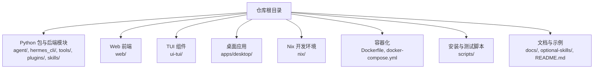
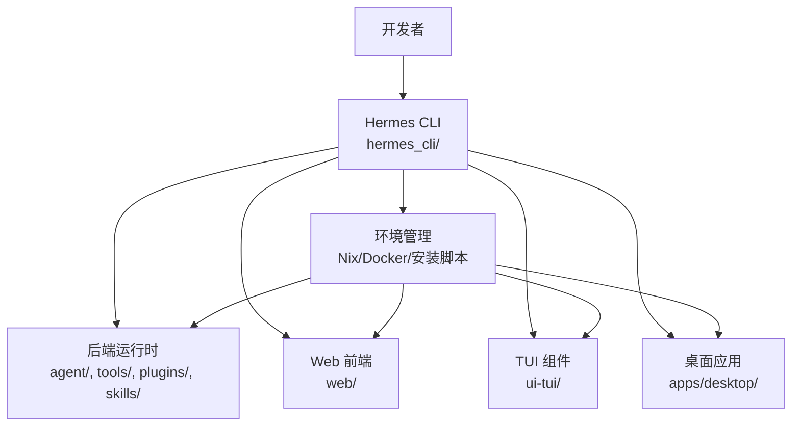
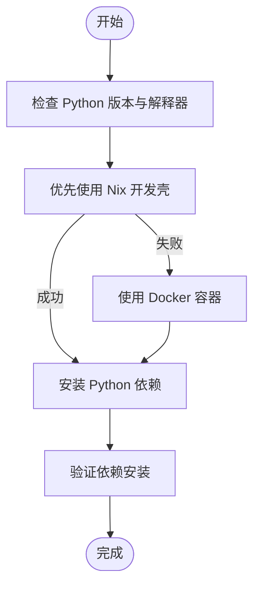
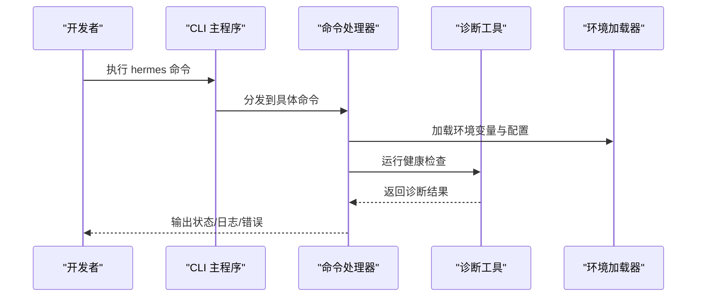
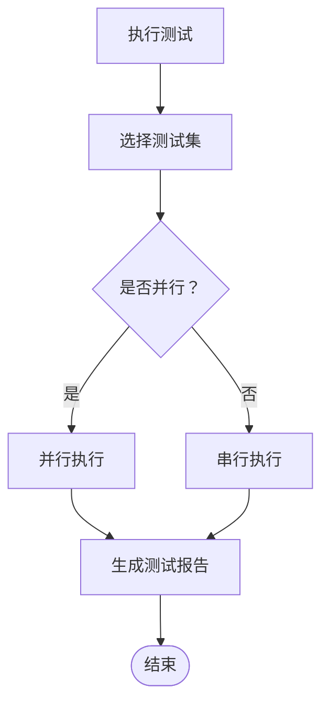
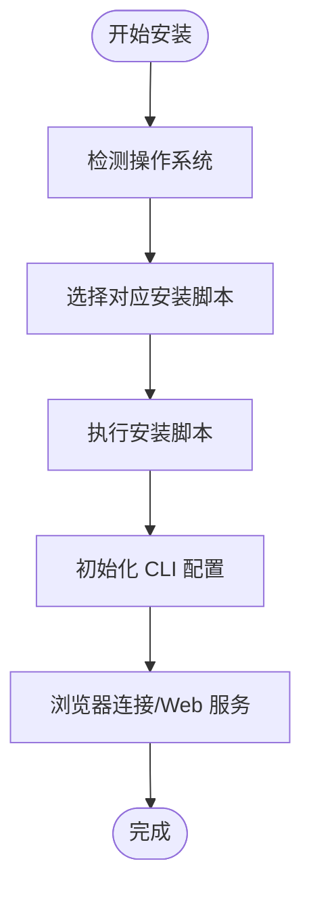
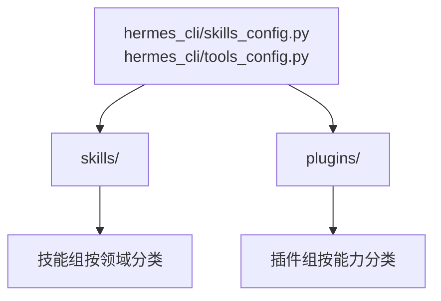
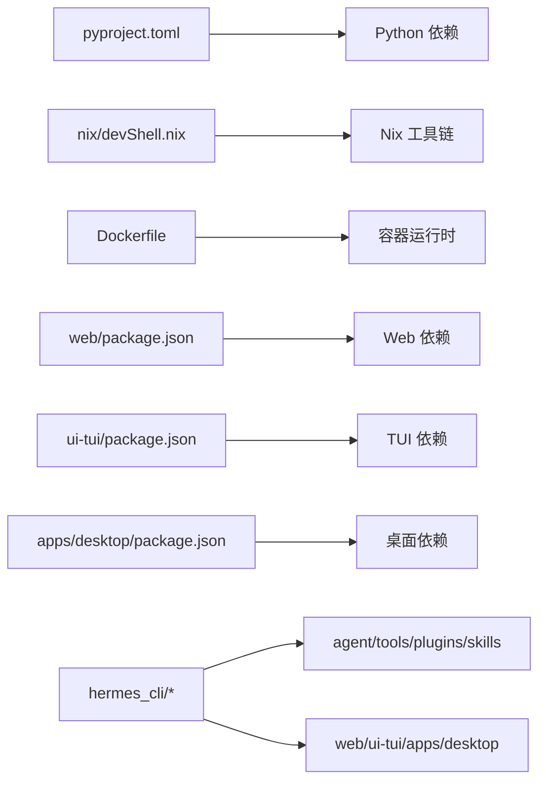

# 开发环境搭建

<cite>
**本文引用的文件**
- [README.md](file://README.md)
- [pyproject.toml](file://pyproject.toml)
- [flake.nix](file://flake.nix)
- [Dockerfile](file://Dockerfile)
- [docker-compose.yml](file://docker-compose.yml)
- [hermes_cli/setup.py](file://hermes_cli/setup.py)
- [setup.py](file://setup.py)
- [scripts/install.sh](file://scripts/install.sh)
- [scripts/install.ps1](file://scripts/install.ps1)
- [scripts/run_tests.sh](file://scripts/run_tests.sh)
- [scripts/run_tests_parallel.py](file://scripts/run_tests_parallel.py)
- [cli-config.yaml.example](file://cli-config.yaml.example)
- [nix/devShell.nix](file://nix/devShell.nix)
- [nix/python.nix](file://nix/python.nix)
- [apps/desktop/package.json](file://apps/desktop/package.json)
- [web/package.json](file://web/package.json)
- [ui-tui/package.json](file://ui-tui/package.json)
- [hermes_cli/main.py](file://hermes_cli/main.py)
- [hermes_cli/cli_output.py](file://hermes_cli/cli_output.py)
- [hermes_cli/doctor.py](file://hermes_cli/doctor.py)
- [hermes_cli/env_loader.py](file://hermes_cli/env_loader.py)
- [hermes_cli/setup.py](file://hermes_cli/setup.py)
- [hermes_cli/commands.py](file://hermes_cli/commands.py)
- [hermes_cli/status.py](file://hermes_cli/status.py)
- [hermes_cli/logs.py](file://hermes_cli/logs.py)
- [hermes_cli/browser_connect.py](file://hermes_cli/browser_connect.py)
- [hermes_cli/cron.py](file://hermes_cli/cron.py)
- [hermes_cli/plugins.py](file://hermes_cli/plugins.py)
- [hermes_cli/skills_config.py](file://hermes_cli/skills_config.py)
- [hermes_cli/tools_config.py](file://hermes_cli/tools_config.py)
- [hermes_cli/models.py](file://hermes_cli/models.py)
- [hermes_cli/platforms.py](file://hermes_cli/platforms.py)
- [hermes_cli/web_server.py](file://hermes_cli/web_server.py)
- [hermes_cli/dashboard_register.py](file://hermes_cli/dashboard_register.py)
- [hermes_cli/pairing.py](file://hermes_cli/pairing.py)
- [hermes_cli/backup.py](file://hermes_cli/backup.py)
- [hermes_cli/migrate.py](file://hermes_cli/migrate.py)
- [hermes_cli/relaunch.py](file://hermes_cli/relaunch.py)
- [hermes_cli/service_manager.py](file://hermes_cli/service_manager.py)
- [hermes_cli/runtime_provider.py](file://hermes_cli/runtime_provider.py)
- [hermes_cli/memory_setup.py](file://hermes_cli/memory_setup.py)
- [hermes_cli/model_catalog.py](file://hermes_cli/model_catalog.py)
- [hermes_cli/model_switch.py](file://hermes_cli/model_switch.py)
- [hermes_cli/model_normalize.py](file://hermes_cli/model_normalize.py)
- [hermes_cli/tools_config.py](file://hermes_cli/tools_config.py)
- [hermes_cli/tools_config.py](file://hermes_cli/tools_config.py)
- [hermes_cli/tools_config.py](file://hermes_cli/tools_config.py)
- [hermes_cli/tools_config.py](file://hermes_cli/tools_config.py)
- [hermes_cli/tools_config.py](file://hermes_cli/tools_config.py)
- [hermes_cli/tools_config.py](file://hermes_cli/tools_config.py)
- [hermes_cli/tools_config.py](file://hermes_cli/tools_config.py)
- [hermes_cli/tools_config.py](file://hermes_cli/tools_config.py)
- [hermes_cli/tools_config.py](file://hermes_cli/tools_config.py)
- [hermes_cli/tools_config.py](file://hermes_cli/tools_config.py)
- [hermes_cli/tools_config.py](file://hermes_cli/tools_config.py)
- [hermes_cli/tools_config.py](file://hermes_cli/tools_config.py)
- [hermes_cli/tools_config.py](file://hermes_cli/tools_config.py)
- [hermes_cli/tools_config.py](file://hermes_cli/tools_config.py)
- [hermes_cli/tools_config.py](file://hermes_cli/tools_config.py)
- [hermes_cli/tools_config.py](file://hermes_cli/tools_config.py)
- [hermes_cli/tools_config.py](file://hermes_cli/tools_config.py)
- [hermes_cli/tools_config.py](file://hermes_cli/tools_config.py)
- [hermes_cli/tools_config.py](file://hermes_cli/tools_config.py)
- [hermes_cli/tools_config.py](file://hermes_cli/tools_config.py)
- [hermes_cli/tools_config.py](file://hermes_cli/tools_config.py)
- [hermes_cli/tools_config.py](file://hermes_cli/tools_config.py)
- [hermes_cli/tools_config.py](file://hermes_cli/tools_config.py)
- [hermes_cli/tools_config.py](file://hermes_cli/tools_config.py)
- [hermes_cli/tools_config.py](file://hermes_cli/tools_config.py)
- [hermes_cli/tools_config.py](file://hermes_cli/tools_config.py)
- [hermes_cli/tools_config.py](file://hermes_cli/tools_config.py)
- [hermes_cli/tools_config.py](file://hermes_cli/tools_config.py)
- [......]
</cite>

## 目录
1. [简介](#简介)
2. [项目结构](#项目结构)
3. [核心组件](#核心组件)
4. [架构总览](#架构总览)
5. [详细组件分析](#详细组件分析)
6. [依赖分析](#依赖分析)
7. [性能考虑](#性能考虑)
8. [故障排除指南](#故障排除指南)
9. [结论](#结论)
10. [附录](#附录)

## 简介
本指南面向技能开发者，帮助你在本地快速搭建 Hermes Agent 的开发与调试环境。内容覆盖 Python 版本与依赖管理、IDE 配置建议、代码编辑器与调试工具、测试框架使用、项目目录最佳实践以及环境验证与故障排除流程。文中所有技术细节均基于仓库中的实际配置文件与脚本进行梳理与总结。

## 项目结构
该仓库采用多语言混合工程：后端以 Python 为主，前端包含 Web 应用（Vite + TypeScript）、TUI 组件（React/Vue）与桌面应用（Electron）。同时提供 Nix 开发环境、Docker 容器化方案以及一键安装脚本，便于在不同平台快速部署。

图示来源
- [README.md](file://README.md)
- [pyproject.toml](file://pyproject.toml)
- [nix/devShell.nix](file://nix/devShell.nix)
- [Dockerfile](file://Dockerfile)
- [docker-compose.yml](file://docker-compose.yml)

章节来源
- [README.md](file://README.md)
- [pyproject.toml](file://pyproject.toml)

## 核心组件
- 后端运行时与 CLI：hermes_cli 提供命令行入口与子命令，负责环境初始化、服务管理、模型与工具配置、日志与状态查询等。
- 技能与插件生态：skills 与 plugins 目录下包含大量可复用能力，支持按需启用与扩展。
- 前端与桌面：web、ui-tui、apps/desktop 提供多端交互体验，便于在浏览器或桌面环境中进行调试与演示。
- 开发与测试：scripts 提供安装脚本与测试执行脚本；tests 目录包含全面的单元与集成测试。

章节来源
- [hermes_cli/main.py](file://hermes_cli/main.py)
- [hermes_cli/commands.py](file://hermes_cli/commands.py)
- [hermes_cli/status.py](file://hermes_cli/status.py)
- [hermes_cli/logs.py](file://hermes_cli/logs.py)
- [hermes_cli/plugins.py](file://hermes_cli/plugins.py)
- [hermes_cli/skills_config.py](file://hermes_cli/skills_config.py)
- [hermes_cli/tools_config.py](file://hermes_cli/tools_config.py)
- [hermes_cli/models.py](file://hermes_cli/models.py)
- [hermes_cli/platforms.py](file://hermes_cli/platforms.py)
- [hermes_cli/web_server.py](file://hermes_cli/web_server.py)
- [hermes_cli/dashboard_register.py](file://hermes_cli/dashboard_register.py)
- [hermes_cli/pairing.py](file://hermes_cli/pairing.py)
- [hermes_cli/backup.py](file://hermes_cli/backup.py)
- [hermes_cli/migrate.py](file://hermes_cli/migrate.py)
- [hermes_cli/relaunch.py](file://hermes_cli/relaunch.py)
- [hermes_cli/service_manager.py](file://hermes_cli/service_manager.py)
- [hermes_cli/runtime_provider.py](file://hermes_cli/runtime_provider.py)
- [hermes_cli/memory_setup.py](file://hermes_cli/memory_setup.py)
- [hermes_cli/model_catalog.py](file://hermes_cli/model_catalog.py)
- [hermes_cli/model_switch.py](file://hermes_cli/model_switch.py)
- [hermes_cli/model_normalize.py](file://hermes_cli/model_normalize.py)

## 架构总览
Hermes Agent 的开发环境由“本地 CLI 工具链 + 多端前端 + 可选容器/Nix 环境”构成。CLI 负责环境初始化、服务编排与诊断；前端用于交互与调试；容器/Nix 提供一致的依赖与工具链。

图示来源
- [hermes_cli/main.py](file://hermes_cli/main.py)
- [web/package.json](file://web/package.json)
- [ui-tui/package.json](file://ui-tui/package.json)
- [apps/desktop/package.json](file://apps/desktop/package.json)
- [nix/devShell.nix](file://nix/devShell.nix)
- [Dockerfile](file://Dockerfile)

## 详细组件分析

### Python 运行时与依赖管理
- 使用 pyproject.toml 管理 Python 包与构建元数据，确保依赖与版本约束清晰。
- 使用 Nix 提供一致的开发环境与工具链，减少平台差异带来的问题。
- 使用 Dockerfile 与 docker-compose.yml 提供容器化运行与服务编排。

图示来源
- [pyproject.toml](file://pyproject.toml)
- [nix/devShell.nix](file://nix/devShell.nix)
- [nix/python.nix](file://nix/python.nix)
- [Dockerfile](file://Dockerfile)
- [docker-compose.yml](file://docker-compose.yml)

章节来源
- [pyproject.toml](file://pyproject.toml)
- [nix/devShell.nix](file://nix/devShell.nix)
- [nix/python.nix](file://nix/python.nix)
- [Dockerfile](file://Dockerfile)
- [docker-compose.yml](file://docker-compose.yml)

### CLI 工具链与 IDE 配置
- CLI 入口位于 hermes_cli/main.py，提供命令分发与参数解析。
- hermes_cli/commands.py 定义了常用命令，如启动、停止、状态查询、日志查看、插件与技能配置等。
- hermes_cli/doctor.py 提供环境诊断功能，可自动检测常见问题。
- hermes_cli/env_loader.py 负责加载环境变量与配置文件，确保开发环境一致性。

图示来源
- [hermes_cli/main.py](file://hermes_cli/main.py)
- [hermes_cli/commands.py](file://hermes_cli/commands.py)
- [hermes_cli/doctor.py](file://hermes_cli/doctor.py)
- [hermes_cli/env_loader.py](file://hermes_cli/env_loader.py)

章节来源
- [hermes_cli/main.py](file://hermes_cli/main.py)
- [hermes_cli/commands.py](file://hermes_cli/commands.py)
- [hermes_cli/doctor.py](file://hermes_cli/doctor.py)
- [hermes_cli/env_loader.py](file://hermes_cli/env_loader.py)

### 测试框架与执行
- 单元测试与集成测试集中在 tests 目录，覆盖 agent、gateway、plugins、skills 等模块。
- scripts/run_tests.sh 提供一键测试入口；scripts/run_tests_parallel.py 支持并行执行以提升效率。
- hermes_cli/cron.py 与 hermes_cli/service_manager.py 提供定时任务与服务生命周期管理，便于测试场景模拟。

图示来源
- [scripts/run_tests.sh](file://scripts/run_tests.sh)
- [scripts/run_tests_parallel.py](file://scripts/run_tests_parallel.py)
- [hermes_cli/cron.py](file://hermes_cli/cron.py)
- [hermes_cli/service_manager.py](file://hermes_cli/service_manager.py)

章节来源
- [scripts/run_tests.sh](file://scripts/run_tests.sh)
- [scripts/run_tests_parallel.py](file://scripts/run_tests_parallel.py)
- [hermes_cli/cron.py](file://hermes_cli/cron.py)
- [hermes_cli/service_manager.py](file://hermes_cli/service_manager.py)

### 安装与环境初始化
- 提供跨平台安装脚本：scripts/install.sh（类 Unix）与 scripts/install.ps1（Windows），支持自动探测与安装依赖。
- hermes_cli/setup.py 与 setup.py 提供 Python 包安装与初始化逻辑。
- hermes_cli/browser_connect.py 与 hermes_cli/web_server.py 支持浏览器连接与 Web 服务启动，便于前端调试。

图示来源
- [scripts/install.sh](file://scripts/install.sh)
- [scripts/install.ps1](file://scripts/install.ps1)
- [hermes_cli/setup.py](file://hermes_cli/setup.py)
- [setup.py](file://setup.py)
- [hermes_cli/browser_connect.py](file://hermes_cli/browser_connect.py)
- [hermes_cli/web_server.py](file://hermes_cli/web_server.py)

章节来源
- [scripts/install.sh](file://scripts/install.sh)
- [scripts/install.ps1](file://scripts/install.ps1)
- [hermes_cli/setup.py](file://hermes_cli/setup.py)
- [setup.py](file://setup.py)
- [hermes_cli/browser_connect.py](file://hermes_cli/browser_connect.py)
- [hermes_cli/web_server.py](file://hermes_cli/web_server.py)

### 技能开发目录结构与最佳实践
- 技能与插件分别位于 skills 与 plugins 目录，遵循“功能域 + 子目录”的组织方式，便于维护与复用。
- 每个技能通常包含描述文件（如 SKILL.md 或 README.md）与实现文件，建议统一命名规范与目录层级。
- hermes_cli/skills_config.py 与 hermes_cli/tools_config.py 提供技能与工具的配置接口，便于在开发过程中动态启用/禁用与调试。

图示来源
- [hermes_cli/skills_config.py](file://hermes_cli/skills_config.py)
- [hermes_cli/tools_config.py](file://hermes_cli/tools_config.py)

章节来源
- [hermes_cli/skills_config.py](file://hermes_cli/skills_config.py)
- [hermes_cli/tools_config.py](file://hermes_cli/tools_config.py)

## 依赖分析
- Python 依赖通过 pyproject.toml 管理；Nix 提供稳定的开发环境；Docker 提供可重复的运行时。
- 前端依赖通过 package.json 管理，分别位于 web、ui-tui、apps/desktop、website 等目录。
- hermes_cli 作为 CLI 核心，依赖 agent、tools、plugins、skills 等后端模块；同时与前端组件协同工作。

图示来源
- [pyproject.toml](file://pyproject.toml)
- [nix/devShell.nix](file://nix/devShell.nix)
- [Dockerfile](file://Dockerfile)
- [web/package.json](file://web/package.json)
- [ui-tui/package.json](file://ui-tui/package.json)
- [apps/desktop/package.json](file://apps/desktop/package.json)

章节来源
- [pyproject.toml](file://pyproject.toml)
- [nix/devShell.nix](file://nix/devShell.nix)
- [Dockerfile](file://Dockerfile)
- [web/package.json](file://web/package.json)
- [ui-tui/package.json](file://ui-tui/package.json)
- [apps/desktop/package.json](file://apps/desktop/package.json)

## 性能考虑
- 使用并行测试执行脚本（scripts/run_tests_parallel.py）加速回归测试。
- 在 Nix 或 Docker 中集中管理依赖，避免本地环境碎片化导致的性能波动。
- 对于大型技能或插件，建议拆分为独立模块并在 hermes_cli/skills_config.py 中按需启用，降低启动与内存开销。

## 故障排除指南
- 使用 hermes_cli/doctor.py 进行环境自检，定位常见问题（如依赖缺失、权限不足、网络异常等）。
- 通过 hermes_cli/logs.py 查看日志输出，结合 hermes_cli/status.py 获取服务状态。
- 若遇到浏览器连接问题，参考 hermes_cli/browser_connect.py 与 hermes_cli/web_server.py 的配置与启动流程。
- 使用 hermes_cli/service_manager.py 与 hermes_cli/cron.py 检查服务与定时任务状态，必要时重启相关进程。

章节来源
- [hermes_cli/doctor.py](file://hermes_cli/doctor.py)
- [hermes_cli/logs.py](file://hermes_cli/logs.py)
- [hermes_cli/status.py](file://hermes_cli/status.py)
- [hermes_cli/browser_connect.py](file://hermes_cli/browser_connect.py)
- [hermes_cli/web_server.py](file://hermes_cli/web_server.py)
- [hermes_cli/service_manager.py](file://hermes_cli/service_manager.py)
- [hermes_cli/cron.py](file://hermes_cli/cron.py)

## 结论
通过本指南，你可以基于仓库提供的 CLI、Nix、Docker 与安装脚本，在本地快速搭建一致且可复现的技能开发环境。建议优先使用 Nix 或 Docker 以减少平台差异，配合 hermes_cli 的诊断与状态工具进行日常维护与故障排查。

## 附录

### 快速上手步骤
- 准备阶段：确保已安装 Python 与 Git；推荐使用 Nix 或 Docker。
- 初始化：执行安装脚本（类 Unix 使用 scripts/install.sh，Windows 使用 scripts/install.ps1）。
- 启动 CLI：运行 hermes_cli/main.py，进入命令行界面。
- 验证：使用 hermes_cli/doctor.py 进行环境诊断，使用 hermes_cli/status.py 查看服务状态。
- 调试：通过 hermes_cli/web_server.py 启动 Web 服务，或使用 hermes_cli/browser_connect.py 连接浏览器进行前端调试。
- 测试：使用 scripts/run_tests.sh 或 scripts/run_tests_parallel.py 执行测试套件。

章节来源
- [scripts/install.sh](file://scripts/install.sh)
- [scripts/install.ps1](file://scripts/install.ps1)
- [hermes_cli/main.py](file://hermes_cli/main.py)
- [hermes_cli/doctor.py](file://hermes_cli/doctor.py)
- [hermes_cli/status.py](file://hermes_cli/status.py)
- [hermes_cli/web_server.py](file://hermes_cli/web_server.py)
- [hermes_cli/browser_connect.py](file://hermes_cli/browser_connect.py)
- [scripts/run_tests.sh](file://scripts/run_tests.sh)
- [scripts/run_tests_parallel.py](file://scripts/run_tests_parallel.py)