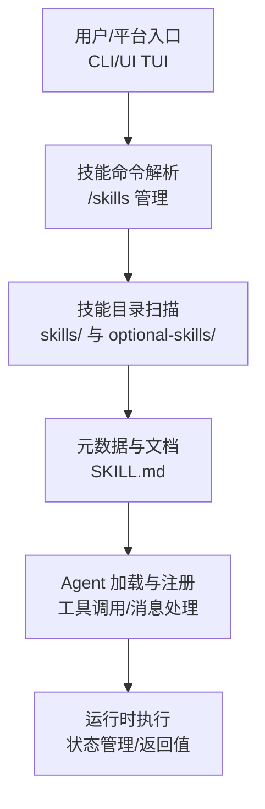
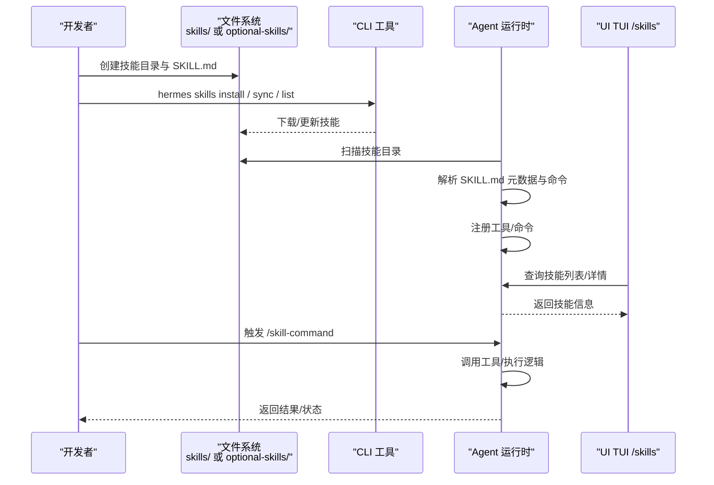
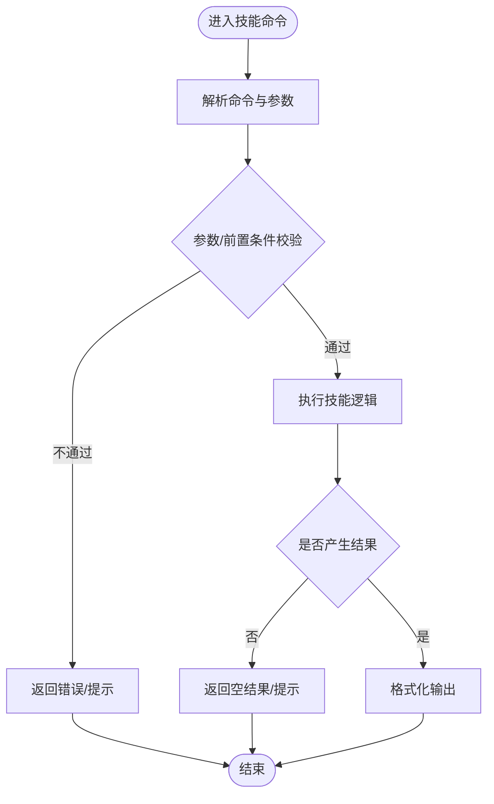
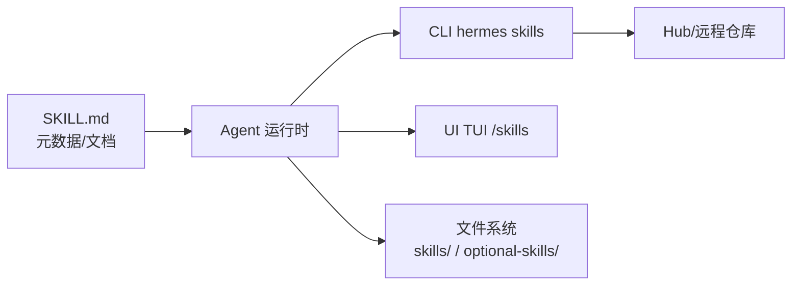

# 技能创建流程

<cite>
**本文引用的文件**
- [README.md](file://README.md)
- [SKILL.md](file://skills/software-development/hermes-agent-skill-authoring/SKILL.md)
- [SKILL.md](file://optional-skills/software-development/subagent-driven-development/SKILL.md)
- [SKILL.md](file://optional-skills/communication/one-three-one-rule/SKILL.md)
- [SKILL.md](file://optional-skills/creative/kanban-video-orchestrator/SKILL.md)
- [SKILL.md](file://optional-skills/research/arxiv/SKILL.md)
- [SKILL.md](file://optional-skills/github/github-issues/SKILL.md)
- [SKILL.md](file://optional-skills/productivity/teams-meeting-pipeline/SKILL.md)
- [SKILL.md](file://optional-skills/mlops/inference/SKILL.md)
- [SKILL.md](file://optional-skills/security/sherlock/SKILL.md)
- [SKILL.md](file://optional-skills/web-development/page-agent/SKILL.md)
- [SKILL.md](file://optional-skills/dogfood/templates/SKILL.md)
- [SKILL.md](file://optional-skills/red-teaming/godmode/templates/SKILL.md)
- [SKILL.md](file://skills/email/himalaya/SKILL.md)
- [SKILL.md](file://optional-skills/autonomous-ai-agents/honcho/SKILL.md)
- [SKILL.md](file://optional-skills/autonomous-ai-agents/antigravity-cli/SKILL.md)
- [SKILL.md](file://optional-skills/autonomous-ai-agents/blackbox/SKILL.md)
- [SKILL.md](file://optional-skills/autonomous-ai-agents/grok/SKILL.md)
- [SKILL.md](file://optional-skills/autonomous-ai-agents/openhands/SKILL.md)
- [SKILL.md](file://optional-skills/blockchain/evm/SKILL.md)
- [SKILL.md](file://optional-skills/blockchain/hyperliquid/SKILL.md)
- [SKILL.md](file://optional-skills/blockchain/solana/SKILL.md)
- [SKILL.md](file://optional-skills/creative/baoyu-article-illustrator/SKILL.md)
- [SKILL.md](file://optional-skills/creative/baoyu-comic/SKILL.md)
- [SKILL.md](file://optional-skills/creative/blender-mcp/SKILL.md)
- [SKILL.md](file://optional-skills/creative/concept-diagrams/SKILL.md)
- [SKILL.md](file://optional-skills/creative/creative-ideation/SKILL.md)
- [SKILL.md](file://optional-skills/creative/hyperframes/SKILL.md)
- [SKILL.md](file://optional-skills/creative/meme-generation/SKILL.md)
- [SKILL.md](file://optional-skills/creative/pixel-art/SKILL.md)
- [SKILL.md](file://optional-skills/devops/cli/SKILL.md)
- [SKILL.md](file://optional-skills/devops/docker-management/SKILL.md)
- [SKILL.md](file://optional-skills/data-science/jupyter-live-kernel/SKILL.md)
- [SKILL.md](file://optional-skills/devops/kanban-orchestrator/SKILL.md)
- [SKILL.md](file://optional-skills/devops/kanban-worker/SKILL.md)
- [SKILL.md](file://optional-skills/note-taking/obsidian/SKILL.md)
- [SKILL.md](file://optional-skills/productivity/airtable/SKILL.md)
- [SKILL.md](file://optional-skills/productivity/google-workspace/SKILL.md)
- [SKILL.md](file://optional-skills/productivity/maps/SKILL.md)
- [SKILL.md](file://optional-skills/productivity/nano-pdf/SKILL.md)
- [SKILL.md](file://optional-skills/productivity/notion/SKILL.md)
- [SKILL.md](file://optional-skills/productivity/ocr-and-documents/SKILL.md)
- [SKILL.md](file://optional-skills/productivity/powerpoint/SKILL.md)
- [SKILL.md](file://optional-skills/social-media/xurl/SKILL.md)
- [SKILL.md](file://optional-skills/smart-home/openhue/SKILL.md)
- [SKILL.md](file://optional-skills/web/web/search/firecrawl/SKILL.md)
- [SKILL.md](file://optional-skills/web/web/search/searxng/SKILL.md)
- [SKILL.md](file://optional-skills/web/web/search/tavily/SKILL.md)
- [SKILL.md](file://optional-skills/web/web/search/xai/SKILL.md)
- [SKILL.md](file://optional-skills/web/web/search/brave-free/SKILL.md)
- [SKILL.md](file://optional-skills/web/web/search/exa/SKILL.md)
- [SKILL.md](file://optional-skills/web/web/search/ddgs/SKILL.md)
- [SKILL.md](file://optional-skills/web/web/search/parallel/SKILL.md)
- [SKILL.md](file://optional-skills/web/web/search/brave-free/SKILL.md)
- [SKILL.md](file://optional-skills/web/web/search/exa/SKILL.md)
- [SKILL.md](file://optional-skills/web/web/search/ddgs/SKILL.md)
- [SKILL.md](file://optional-skills/web/web/search/parallel/SKILL.md)
- [SKILL.md](file://optional-skills/web/web/search/firecrawl/SKILL.md)
- [SKILL.md](file://optional-skills/web/web/search/searxng/SKILL.md)
- [SKILL.md](file://optional-skills/web/web/search/tavily/SKILL.md)
- [SKILL.md](file://optional-skills/web/web/search/xai/SKILL.md)
- [SKILL.md](file://optional-skills/web/web/search/brave-free/SKILL.md)
- [SKILL.md](file://optional-skills/web/web/search/exa/SKILL.md)
- [SKILL.md](file://optional-skills/web/web/search/ddgs/SKILL.md)
- [SKILL.md](file://optional-skills/web/web/search/parallel/SKILL.md)
- [SKILL.md](file://optional-skills/web/web/search/firecrawl/SKILL.md)
- [SKILL.md](file://optional-skills/web/web/search/searxng/SKILL.md)
- [SKILL.md](file://optional-skills/web/web/search/tavily/SKILL.md)
- [SKILL.md](file://optional-skills/web/web/search/xai/SKILL.md)
- [SKILL.md](file://optional-skills/web/web/search/brave-free/SKILL.md)
- [SKILL.md](file://optional-skills/web/web/search/exa/SKILL.md)
- [SKILL.md](file://optional-skills/web/web/search/ddgs/SKILL.md)
- [SKILL.md](file://optional-skills/web/web/search/parallel/SKILL.md)
- [SKILL.md](file://optional-skills/web/web/search/firecrawl/SKILL.md)
- [SKILL.md](file://optional-skills/web/web/search/searxng/SKILL.md)
- [SKILL.md](file://optional-skills/web/web/search/tavily/SKILL.md)
- [SKILL.md](file://optional-skills/web/web/search/xai/SKILL.md)
- [SKILL.md](file://optional-skills/web/web/search/brave-free/SKILL.md)
- [SKILL.md](file://optional-skills/web/web/search/exa/SKILL.md)
- [SKILL.md](file://optional-skills/web/web/search/ddgs/SKILL.md)
- [SKILL.md](file://optional-skills/web/web/search/parallel/SKILL.md)
- [SKILL.md](file://optional-skills/web/web/search/firecrawl/SKILL.md)
- [SKILL.md](file://optional-skills/web/web/search/searxng/SKILL.md)
- [SKILL.md](file://optional-skills/web/web/search/tavily/SKILL.md)
- [SKILL.md](file://optional-skills/web/web/search/xai/SKILL.md)
- [SKILL.md](file://optional-skills/web/web/search/brave-free/SKILL.md)
- [SKILL.md](file://optional-skills/web/web/search/exa/SKILL.md)
- [SKILL.md](file://optional-skills/web/web/search/ddgs/SKILL.md)
- [SKILL.md](file://optional-skills/web/web/search/parallel/SKILL.md)
- [SKILL.md](file://optional-skills/web/web/search/firecrawl/SKILL.md)
- [SKILL.md](file://optional-skills/web/web/search/searxng/SKILL.md)
- [SKILL.md](file://optional-skills/web/web/search/tavily/SKILL.md)
- [SKILL.md](file://optional-skills/web/web/search/xai/SKILL.md)
- [SKILL.md](file://optional-skills/web/web/search/brave-free/SKILL.md)
- [SKILL.md](file://optional-skills/web/web/search/exa/SKILL.md)
- [SKILL.md](file://optional-skills/web/web/search/ddgs/SKILL.md)
- [SKILL.md](file://optional-skills/web/web/search/parallel/SKILL.md)
- [SKILL.md](file://optional-skills/web/web/search/firecrawl/SKILL.md)
- [SKILL.md](file://optional-skills/web/web/search/searxng/SKILL.md)
- [SKILL.md](file://optional-skills/web/web/search/tavily/SKILL.md)
- [SKILL.md](file://optional-skills/web/web/search/xai/SKILL.md)
- [SKILL.md](file://optional-skills/web/web/search/brave-free/SKILL.md)
- [SKILL.md](file://optional-skills/web/web/search/exa/SKILL.md)
- [SKILL.md](file......)
</cite>

## 目录
1. [简介](#简介)
2. [项目结构](#项目结构)
3. [核心组件](#核心组件)
4. [架构总览](#架构总览)
5. [详细组件分析](#详细组件分析)
6. [依赖关系分析](#依赖关系分析)
7. [性能考虑](#性能考虑)
8. [故障排查指南](#故障排查指南)
9. [结论](#结论)
10. [附录](#附录)

## 简介
本指南面向希望在 Hermes Agent 中从零创建新技能的开发者，覆盖技能模板选择、配置文件编写、核心逻辑实现、元数据定义、参数与返回值设计、与 Agent 系统的集成（工具调用、消息处理、状态管理）、迭代流程与版本控制策略，并提供可直接参考的实际技能示例与代码模板路径。

## 项目结构
Hermes 将“技能”分为两类：
- 官方内置技能：位于根目录下的 skills 子目录，通常由平台或核心能力提供，如软件开发、邮件、研究等类别下的具体技能。
- 可选技能：位于 optional-skills 子目录，按功能域细分，如通信、创意、区块链、DevOps、产品力、研究、Web 开发等。

技能的元数据与文档主要通过每个技能目录中的 SKILL.md 文件进行声明与描述。CLI 提供安装、管理与检查技能的能力；UI TUI 提供 /skills 命令用于列出与检查技能信息；Agent 运行时负责加载技能命令、解析输入并执行对应逻辑。

图示来源
- [README.md](file://README.md)
- [SKILL.md](file://skills/software-development/hermes-agent-skill-authoring/SKILL.md)

章节来源
- [README.md](file://README.md)

## 核心组件
- 技能元数据与文档：每个技能以 SKILL.md 作为元数据与文档中心，包含名称、描述、版本、作者、许可证、支持平台、标签与相关技能等。
- 技能命令与路由：Agent 会扫描技能目录，解析命令键（如 /skill-name），并与 UI 的 /skills 命令联动。
- CLI 与 Hub 集成：CLI 支持安装、同步与检查技能，部分技能可通过官方 Hub 获取。
- Agent 集成点：Agent 在运行时加载技能命令、执行工具调用、处理消息与状态。

章节来源
- [SKILL.md](file://skills/software-development/hermes-agent-skill-authoring/SKILL.md)
- [SKILL.md](file://optional-skills/software-development/subagent-driven-development/SKILL.md)
- [SKILL.md](file://optional-skills/communication/one-three-one-rule/SKILL.md)
- [SKILL.md](file://optional-skills/creative/kanban-video-orchestrator/SKILL.md)
- [SKILL.md](file://optional-skills/research/arxiv/SKILL.md)
- [SKILL.md](file://optional-skills/github/github-issues/SKILL.md)
- [SKILL.md](file://optional-skills/productivity/teams-meeting-pipeline/SKILL.md)
- [SKILL.md](file://optional-skills/mlops/inference/SKILL.md)
- [SKILL.md](file://optional-skills/security/sherlock/SKILL.md)
- [SKILL.md](file://optional-skills/web-development/page-agent/SKILL.md)
- [SKILL.md](file://optional-skills/dogfood/templates/SKILL.md)
- [SKILL.md](file://optional-skills/red-teaming/godmode/templates/SKILL.md)

## 架构总览
下图展示了从“创建技能”到“Agent 执行”的端到端流程：

图示来源
- [README.md](file://README.md)
- [SKILL.md](file://skills/software-development/hermes-agent-skill-authoring/SKILL.md)

## 详细组件分析

### 1) 技能模板与元数据定义
- 模板位置
  - 官方模板：skills/software-development/hermes-agent-skill-authoring/SKILL.md
  - 可选模板：optional-skills/dogfood/templates/SKILL.md、optional-skills/red-teaming/godmode/templates/SKILL.md
- 元数据字段建议
  - 必填：name、description、version、author、license、platforms
  - 推荐：metadata.hermes.tags、metadata.hermes.related_skills
- 文档与示例
  - 多个真实技能的 SKILL.md 可作为参考，例如：
    - optional-skills/communication/one-three-one-rule/SKILL.md
    - optional-skills/creative/kanban-video-orchestrator/SKILL.md
    - optional-skills/research/arxiv/SKILL.md
    - optional-skills/github/github-issues/SKILL.md
    - optional-skills/productivity/teams-meeting-pipeline/SKILL.md
    - optional-skills/mlops/inference/SKILL.md
    - optional-skills/security/sherlock/SKILL.md
    - optional-skills/web-development/page-agent/SKILL.md

章节来源
- [SKILL.md](file://skills/software-development/hermes-agent-skill-authoring/SKILL.md)
- [SKILL.md](file://optional-skills/dogfood/templates/SKILL.md)
- [SKILL.md](file://optional-skills/red-teaming/godmode/templates/SKILL.md)
- [SKILL.md](file://optional-skills/communication/one-three-one-rule/SKILL.md)
- [SKILL.md](file://optional-skills/creative/kanban-video-orchestrator/SKILL.md)
- [SKILL.md](file://optional-skills/research/arxiv/SKILL.md)
- [SKILL.md](file://optional-skills/github/github-issues/SKILL.md)
- [SKILL.md](file://optional-skills/productivity/teams-meeting-pipeline/SKILL.md)
- [SKILL.md](file://optional-skills/mlops/inference/SKILL.md)
- [SKILL.md](file://optional-skills/security/sherlock/SKILL.md)
- [SKILL.md](file://optional-skills/web-development/page-agent/SKILL.md)

### 2) 参数配置与返回值设计
- 参数设计
  - 使用 SKILL.md 中的“参数/输入”小节定义期望输入，明确类型、默认值与约束。
  - 若涉及外部工具或 API，应在“前置条件/依赖”中说明。
- 返回值设计
  - 明确输出格式（文本、JSON、文件路径等），并在“示例输出”中给出样例。
  - 对于多阶段流程（如子代理驱动开发），可在“流程/算法”中分步描述中间产物与最终产出。
- 示例参考
  - optional-skills/software-development/subagent-driven-development/SKILL.md 展示了任务拆解与两阶段评审的流程化设计思路。

章节来源
- [SKILL.md](file://optional-skills/software-development/subagent-driven-development/SKILL.md)

### 3) 核心逻辑实现与工具调用
- 实现位置
  - 技能逻辑通常位于技能目录下的 Python/脚本文件中（与 SKILL.md 同目录或子目录）。
  - Agent 通过工具调用机制执行技能命令，工具定义与注册由 Agent 运行时负责。
- 工具调用流程
  - Agent 解析 /skill-command，定位到对应工具实现。
  - 工具执行前进行参数校验与前置条件检查。
  - 工具执行后生成结构化结果，交由 Agent 组装为消息返回给 UI。

图示来源
- [SKILL.md](file://skills/software-development/hermes-agent-skill-authoring/SKILL.md)

### 4) 与 Agent 系统的集成
- 命令注册与发现
  - Agent 会扫描 skills 与 optional-skills 目录，读取 SKILL.md 并注册命令键（如 /skill-name）。
  - UI TUI 的 /skills list/inspect 与 Agent 的技能管理 RPC 对接，用于查看可用技能与元数据。
- 消息处理与状态管理
  - 技能执行过程中，Agent 负责将中间状态与最终结果以消息形式呈现给用户。
  - 对于长耗时任务，应提供进度反馈与中断机制（如需要）。
- 集成点参考
  - UI TUI 的 /skills 命令实现与 RPC 调用：参见 ui-tui/src/app/slash/commands/ops.ts 中的 skills 管理分支。
  - CLI 与技能命令解析：参见 tests/agent/test_skill_commands.py 中对命令解析与预加载技能提示的测试。

章节来源
- [SKILL.md](file://skills/software-development/hermes-agent-skill-authoring/SKILL.md)
- [ui-tui\src\app\slash\commands\ops.ts](file://ui-tui/src/app/slash/commands/ops.ts)
- [tests\agent\test_skill_commands.py](file://tests/agent/test_skill_commands.py)

### 5) 版本控制与迭代流程
- 版本号管理
  - 在 SKILL.md 的 version 字段维护语义化版本，便于 Hub 与 CLI 进行安装/升级判断。
- 迭代策略
  - 小步快跑：先实现最小可行功能，再逐步完善参数、错误处理与文档。
  - 分支策略：在 optional-skills 下新建分支进行实验性功能，稳定后再合并到主干。
  - 发布节奏：每次重要变更更新 version 并补充变更说明，保持 SKILL.md 的“变更日志/更新记录”清晰。
- Hub 与同步
  - 通过 hermes skills install / sync 等命令进行技能的安装与同步，确保本地与 Hub 一致。

章节来源
- [README.md](file://README.md)
- [SKILL.md](file://skills/software-development/hermes-agent-skill-authoring/SKILL.md)

### 6) 实际技能创建示例与代码模板
以下是一些真实技能的 SKILL.md 作为模板参考，请根据自身需求调整字段与内容：
- 沟通类：optional-skills/communication/one-three-one-rule/SKILL.md
- 创意类：optional-skills/creative/kanban-video-orchestrator/SKILL.md
- 研究类：optional-skills/research/arxiv/SKILL.md
- GitHub 类：optional-skills/github/github-issues/SKILL.md
- 生产力类：optional-skills/productivity/teams-meeting-pipeline/SKILL.md
- MLOps 类：optional-skills/mlops/inference/SKILL.md
- 安全类：optional-skills/security/sherlock/SKILL.md
- Web 开发类：optional-skills/web-development/page-agent/SKILL.md
- 模板类：optional-skills/dogfood/templates/SKILL.md、optional-skills/red-teaming/godmode/templates/SKILL.md

章节来源
- [SKILL.md](file://optional-skills/communication/one-three-one-rule/SKILL.md)
- [SKILL.md](file://optional-skills/creative/kanban-video-orchestrator/SKILL.md)
- [SKILL.md](file://optional-skills/research/arxiv/SKILL.md)
- [SKILL.md](file://optional-skills/github/github-issues/SKILL.md)
- [SKILL.md](file://optional-skills/productivity/teams-meeting-pipeline/SKILL.md)
- [SKILL.md](file://optional-skills/mlops/inference/SKILL.md)
- [SKILL.md](file://optional-skills/security/sherlock/SKILL.md)
- [SKILL.md](file://optional-skills/web-development/page-agent/SKILL.md)
- [SKILL.md](file://optional-skills/dogfood/templates/SKILL.md)
- [SKILL.md](file://optional-skills/red-teaming/godmode/templates/SKILL.md)

## 依赖关系分析
- 目录结构依赖
  - skills 与 optional-skills 是技能的主要承载目录，Agent 通过扫描这两个目录发现技能。
- 元数据依赖
  - SKILL.md 是技能元数据与文档的唯一来源，Agent 依赖其解析命令、标签与相关技能。
- CLI/Hub 依赖
  - CLI 通过 hermes skills 命令与 Hub/本地目录交互，实现安装、同步与检查。
- UI 依赖
  - UI TUI 的 /skills 命令依赖 Agent 的技能管理 RPC，用于展示技能列表与详情。

图示来源
- [README.md](file://README.md)
- [SKILL.md](file://skills/software-development/hermes-agent-skill-authoring/SKILL.md)
- [ui-tui\src\app\slash\commands\ops.ts](file://ui-tui/src/app/slash/commands/ops.ts)

## 性能考虑
- 轻量级元数据解析：SKILL.md 应保持简洁，避免过重的 YAML 结构导致解析开销。
- 延迟加载：对于大型技能，建议在首次触发时再初始化资源，减少启动时长。
- 缓存与复用：对重复使用的外部 API/工具调用结果进行缓存，降低重复计算与网络请求。
- 输出裁剪：在返回值设计中避免冗余信息，优先返回用户最关心的结果片段。

## 故障排查指南
- 命令未识别
  - 检查 SKILL.md 中的命令键是否符合规范（如 /skill-name），并确认 Agent 是否正确扫描到该技能。
  - 参考：tests/agent/test_skill_commands.py 中关于命令解析与预加载技能提示的测试。
- 技能未出现在 UI
  - 使用 UI TUI 的 /skills list/inspect 检查技能是否存在；若不存在，确认 Agent 是否正确加载。
  - 参考：ui-tui/src/app/slash/commands/ops.ts 中的 skills 管理分支。
- 安装/同步异常
  - 使用 hermes skills install / sync 检查网络与权限；确认 Hub 地址与认证配置。
  - 参考：README.md 中的 CLI 说明与安装流程。

章节来源
- [tests\agent\test_skill_commands.py](file://tests/agent/test_skill_commands.py)
- [ui-tui\src\app\slash\commands\ops.ts](file://ui-tui/src/app/slash/commands/ops.ts)
- [README.md](file://README.md)

## 结论
通过遵循本指南，开发者可以系统地完成从模板选择、元数据与文档编写、参数与返回值设计，到核心逻辑实现与 Agent 集成的全流程。建议以最小可行版本快速上线，持续迭代并完善文档与测试，确保技能在不同平台与场景下稳定运行。

## 附录
- 官方模板路径
  - skills/software-development/hermes-agent-skill-authoring/SKILL.md
- 可选模板路径
  - optional-skills/dogfood/templates/SKILL.md
  - optional-skills/red-teaming/godmode/templates/SKILL.md
- CLI 命令参考
  - hermes skills install / sync / list / inspect
- UI 命令参考
  - /skills list / skills inspect <name>