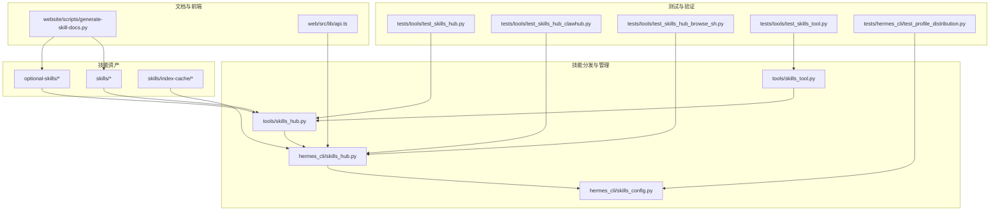
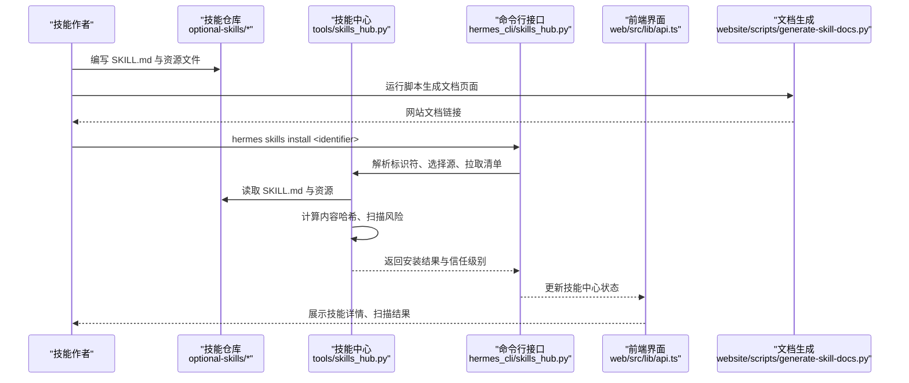
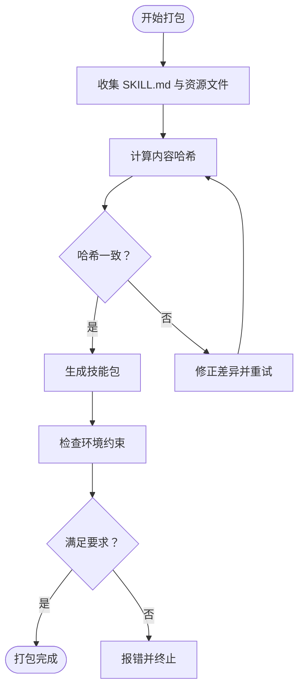
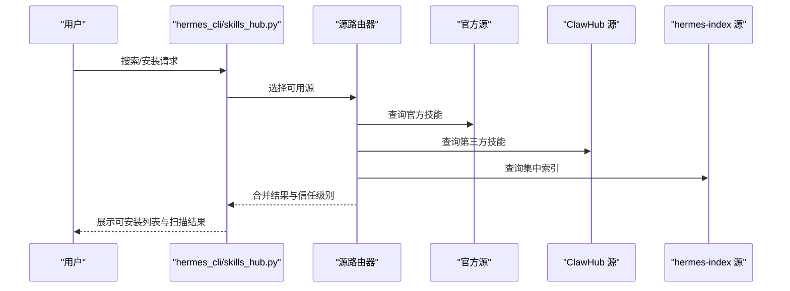
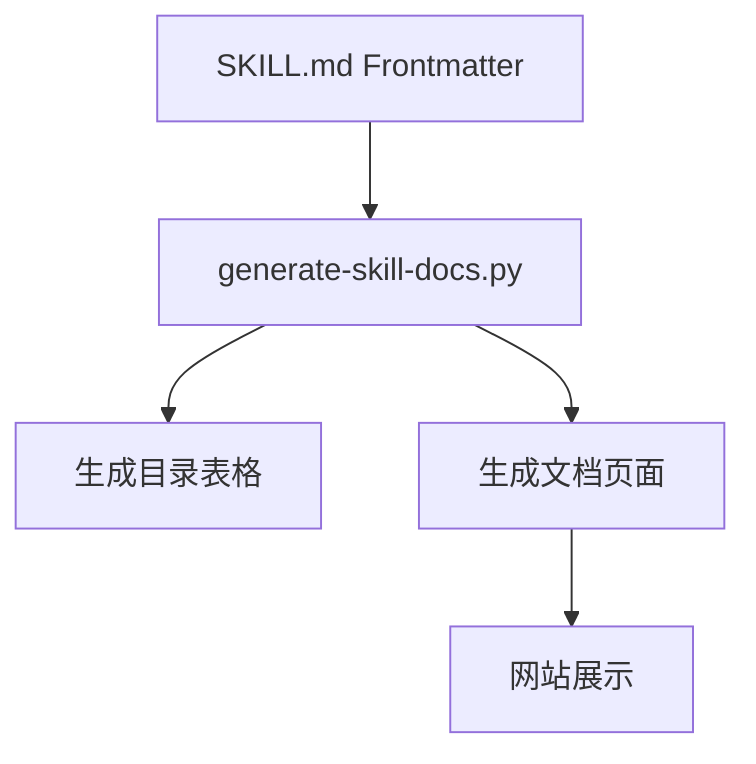
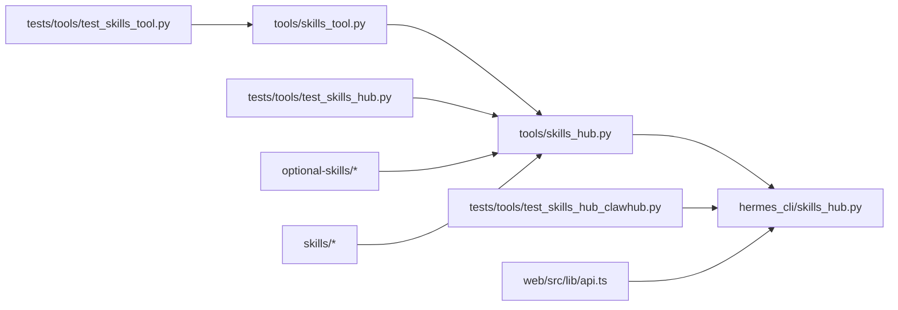

# 技能发布与分发

<cite>
**本文引用的文件**
- [skills_hub.py](file://tools/skills_hub.py)
- [skills_hub.py](file://hermes_cli/skills_hub.py)
- [skills_config.py](file://hermes_cli/skills_config.py)
- [skills_tool.py](file://tools/skills_tool.py)
- [test_skills_hub.py](file://tests/tools/test_skills_hub.py)
- [test_skills_hub_clawhub.py](file://tests/tools/test_skills_hub_clawhub.py)
- [test_skills_hub_browse_sh.py](file://tests/tools/test_skills_hub_browse_sh.py)
- [test_skills_tool.py](file://tests/tools/test_skills_tool.py)
- [test_profile_distribution.py](file://tests/hermes_cli/test_profile_distribution.py)
- [test_skill_manager_tool.py](file://tests/tools/test_skill_manager_tool.py)
- [api.ts](file://web/src/lib/api.ts)
- [generate-skill-docs.py](file://website/scripts/generate-skill-docs.py)
- [software-development-hermes-agent-skill-authoring.md](file://website/i18n/zh-Hans/docusaurus-plugin-content-docs/current/user-guide/skills/bundled/software-development/software-development-hermes-agent-skill-authoring.md)
- [SKILL.md](file://optional-skills/autonomous-ai-agents/antigravity-cli/SKILL.md)
- [SKILL.md](file://optional-skills/autonomous-ai-agents/blackbox/SKILL.md)
- [SKILL.md](file://optional-skills/autonomous-ai-agents/honcho/SKILL.md)
- [SKILL.md](file://optional-skills/autonomous-ai-agents/openhands/SKILL.md)
- [SKILL.md](file://optional-skills/blockchain/evm/SKILL.md)
- [SKILL.md](file://optional-skills/blockchain/hyperliquid/SKILL.md)
- [SKILL.md](file://optional-skills/blockchain/solana/SKILL.md)
- [SKILL.md](file://optional-skills/creative/kanban-video-orchestrator/SKILL.md)
- [SKILL.md](file://optional-skills/devops/cli/SKILL.md)
- [SKILL.md](file://optional-skills/devops/docker-management/SKILL.md)
- [SKILL.md](file://optional-skills/finance/3-statement-model/SKILL.md)
- [SKILL.md](file://optional-skills/finance/comps-analysis/SKILL.md)
- [SKILL.md](file://optional-skills/finance/dcf-model/SKILL.md)
- [SKILL.md](file://optional-skills/finance/excel-author/SKILL.md)
- [SKILL.md](file://optional-skills/finance/lbo-model/SKILL.md)
- [SKILL.md](file://optional-skills/finance/merger-model/SKILL.md)
- [SKILL.md](file://optional-skills/finance/pptx-author/SKILL.md)
- [SKILL.md](file://optional-skills/finance/stocks/SKILL.md)
- [SKILL.md](file://optional-skills/finance/DESCRIPTION.md)
- [SKILL.md](file://optional-skills/communication/one-three-one-rule/SKILL.md)
- [SKILL.md](file://optional-skills/creative/baoyu-article-illustrator/SKILL.md)
- [SKILL.md](file://optional-skills/creative/baoyu-comic/SKILL.md)
- [SKILL.md](file://optional-skills/creative/blender-mcp/SKILL.md)
- [SKILL.md](file://optional-skills/creative/concept-diagrams/SKILL.md)
- [SKILL.md](file://optional-skills/creative/creative-ideation/SKILL.md)
- [SKILL.md](file://optional-skills/creative/hyperframes/SKILL.md)
- [SKILL.md](file://optional-skills/creative/meme-generation/SKILL.md)
- [SKILL.md](file://optional-skills/creative/pixel-art/SKILL.md)
- [SKILL.md](file://optional-skills/creative/DESCRIPTION.md)
- [SKILL.md](file://optional-skills/devops/cli/SKILL.md)
- [SKILL.md](file://optional-skills/devops/docker-management/SKILL.md)
- [SKILL.md](file://optional-skills/devops/watchers/SKILL.md)
- [SKILL.md](file://optional-skills/devops/migration/openclaw-migration/SKILL.md)
- [SKILL.md](file://optional-skills/devops/migration/DESCRIPTION.md)
- [SKILL.md](file://optional-skills/devops/DESCRIPTION.md)
- [SKILL.md](file://optional-skills/dogfood/adversarial-ux-test/SKILL.md)
- [SKILL.md](file://optional-skills/dogfood/DESCRIPTION.md)
- [SKILL.md](file://optional-skills/email/agentmail/SKILL.md)
- [SKILL.md](file://optional-skills/email/DESCRIPTION.md)
- [SKILL.md](file://optional-skills/finance/DESCRIPTION.md)
- [SKILL.md](file://optional-skills/gaming/minecraft-modpack-server/SKILL.md)
- [SKILL.md](file://optional-skills/gaming/pokemon-player/SKILL.md)
- [SKILL.md](file://optional-skills/gaming/DESCRIPTION.md)
- [SKILL.md](file://optional-skills/health/fitness-nutrition/SKILL.md)
- [SKILL.md](file://optional-skills/health/neuroskill-bci/SKILL.md)
- [SKILL.md](file://optional-skills/health/DESCRIPTION.md)
- [SKILL.md](file://optional-skills/mcp/fastmcp/SKILL.md)
- [SKILL.md](file://optional-skills/mcp/mcporter/SKILL.md)
- [SKILL.md](file://optional-skills/mcp/DESCRIPTION.md)
- [SKILL.md](file://optional-skills/migration/openclaw-migration/SKILL.md)
- [SKILL.md](file://optional-skills/migration/DESCRIPTION.md)
- [SKILL.md](file://optional-skills/mlops/accelerate/SKILL.md)
- [SKILL.md](file://optional-skills/mlops/chroma/SKILL.md)
- [SKILL.md](file://optional-skills/mlops/clip/SKILL.md)
- [SKILL.md](file://optional-skills/mlops/faiss/SKILL.md)
- [SKILL.md](file://optional-skills/mlops/flash-attention/SKILL.md)
- [SKILL.md](file://optional-skills/mlops/guidance/SKILL.md)
- [SKILL.md](file://optional-skills/mlops/huggingface-tokenizers/SKILL.md)
- [SKILL.md](file://optional-skills/mlops/inference/outlines/SKILL.md)
- [SKILL.md](file://optional-skills/mlops/inference/training/SKILL.md)
- [SKILL.md](file://optional-skills/mlops/inference/DESCRIPTION.md)
- [SKILL.md](file://optional-skills/mlops/peft/SKILL.md)
- [SKILL.md](file://optional-skills/mlops/pinecone/SKILL.md)
- [SKILL.md](file://optional-skills/mlops/pytorch-fsdp/SKILL.md)
- [SKILL.md](file://optional-skills/mlops/pytorch-lightning/SKILL.md)
- [SKILL.md](file://optional-skills/mlops/qdrant/SKILL.md)
- [SKILL.md](file://optional-skills/mlops/research/SKILL.md)
- [SKILL.md](file://optional-skills/mlops/saelens/SKILL.md)
- [SKILL.md](file://optional-skills/mlops/simpo/SKILL.md)
- [SKILL.md](file://optional-skills/mlops/slime/SKILL.md)
- [SKILL.md](file://optional-skills/mlops/stable-diffusion/SKILL.md)
- [SKILL.md](file://optional-skills/mlops/tensorrt-llm/SKILL.md)
- [SKILL.md](file://optional-skills/mlops/torchtitan/SKILL.md)
- [SKILL.md](file://optional-skills/mlops/whisper/SKILL.md)
- [SKILL.md](file://optional-skills/mlops/DESCRIPTION.md)
- [SKILL.md](file://optional-skills/productivity/canvas/SKILL.md)
- [SKILL.md](file://optional-skills/productivity/here-now/SKILL.md)
- [SKILL.md](file://optional-skills/productivity/memento-flashcards/SKILL.md)
- [SKILL.md](file://optional-skills/productivity/shop-app/SKILL.md)
- [SKILL.md](file://optional-skills/productivity/shopify/SKILL.md)
- [SKILL.md](file://optional-skills/productivity/siyuan/SKILL.md)
- [SKILL.md](file://optional-skills/productivity/telephony/SKILL.md)
- [SKILL.md](file://optional-skills/productivity/DESCRIPTION.md)
- [SKILL.md](file://optional-skills/research/bioinformatics/SKILL.md)
- [SKILL.md](file://optional-skills/research/darwinian-evolver/SKILL.md)
- [SKILL.md](file://optional-skills/research/domain-intel/SKILL.md)
- [SKILL.md](file://optional-skills/research/drug-discovery/SKILL.md)
- [SKILL.md](file://optional-skills/research/duckduckgo-search/SKILL.md)
- [SKILL.md](file://optional-skills/research/gitnexus-explorer/SKILL.md)
- [SKILL.md](file://optional-skills/research/osint-investigation/SKILL.md)
- [SKILL.md](file://optional-skills/research/parallel-cli/SKILL.md)
- [SKILL.md](file://optional-skills/research/qmd/SKILL.md)
- [SKILL.md](file://optional-skills/research/scrapling/SKILL.md)
- [SKILL.md](file://optional-skills/research/searxng-search/SKILL.md)
- [SKILL.md](file://optional-skills/research/DESCRIPTION.md)
- [SKILL.md](file://optional-skills/security/1password/SKILL.md)
- [SKILL.md](file://optional-skills/security/oss-forensics/SKILL.md)
- [SKILL.md](file://optional-skills/security/sherlock/SKILL.md)
- [SKILL.md](file://optional-skills/security/web-pentest/SKILL.md)
- [SKILL.md](file://optional-skills/security/DESCRIPTION.md)
- [SKILL.md](file://optional-skills/software-development/code-wiki/SKILL.md)
- [SKILL.md](file://optional-skills/software-development/rest-graphql-debug/SKILL.md)
- [SKILL.md](file://optional-skills/software-development/subagent-driven-development/SKILL.md)
- [SKILL.md](file://optional-skills/software-development/DESCRIPTION.md)
- [SKILL.md](file://optional-skills/web-development/page-agent/SKILL.md)
- [SKILL.md](file://optional-skills/web-development/DESCRIPTION.md)
- [SKILL.md](file://optional-skills/DESCRIPTION.md)
- [SKILL.md](file://skills/software-development/hermes-agent-skill-authoring/SKILL.md)
- [SKILL.md](file://skills/index-cache/claude_marketplace_anthropics_skills.json)
- [SKILL.md](file://skills/index-cache/README.md)
- [SKILL.md](file://skills/index-cache/README.md)
- [SKILL.md](file://skills/index-cache/README.md)
- [SKILL.md](file://skills/index-cache/README.md)
- [SKILL.md](file://skills/index-cache/README.md)
- [SKILL.md](file://skills/index-cache/README.md)
- [SKILL.md](file://skills/index-cache/README.md)
- [SKILL.md](file://skills/index-cache/README.md)
- [SKILL.md](file://skills/index-cache/README.md)
- [SKILL.md](file://skills/index-cache/README.md)
- [SKILL.md](file://skills/index-cache/README.md)
- [SKILL.md](file://skills/index-cache/README.md)
- [SKILL.md](file://skills/index-cache/README.md)
- [SKILL.md](file://skills/index-cache/README.md)
- [SKILL.md](file://skills/index-cache/README.md)
- [SKILL.md](file://skills/index-cache/README.md)
- [SKILL.md](file://skills/index-cache/README.md)
- [SKILL.md](file://skills/index-cache/README.md)
- [SKILL.md](file://skills/index-cache/README.md)
- [SKILL.md](file://skills/index-cache/README.md)
- [SKILL.md](file://skills/index-cache/README.md)
- [SKILL.md](file://skills/index-cache/README.md)
- [SKILL.md](file://skills/index-cache/README.md)
- [SKILL.md](file://skills/index-cache/README.md)
- [SKILL.md](file://skills/index-cache/README.md)
- [SKILL.md](file://skills/index-cache/README.md)
- [SKILL.md](file://skills/index-cache/README.md)
- [SKILL.md](file://skills/index-cache/README.md)
- [SKILL.md](file://skills/index-cache/README.md)
- [SKILL.md](file://skills/index-cache/README.md)
- [SKILL.md](file://skills/index-cache/README.md)
- [SKILL.md](file://skills/index-cache/README.md)
- [SKILL.md](file://skills/index-cache/README.md)
- [SKILL.md](file://skills/index-cache/README.md)
- [SKILL.md](file://skills/index-cache......)
</cite>

## 目录
1. [引言](#引言)
2. [项目结构](#项目结构)
3. [核心组件](#核心组件)
4. [架构总览](#架构总览)
5. [详细组件分析](#详细组件分析)
6. [依赖分析](#依赖分析)
7. [性能考虑](#性能考虑)
8. [故障排查指南](#故障排查指南)
9. [结论](#结论)
10. [附录](#附录)

## 引言
本指南面向技能作者与维护者，系统讲解如何在本项目中完成“技能打包、依赖管理、资源整理、版本标记、分发渠道选择与配置、元数据与文档管理、更新与维护最佳实践，以及市场推广与用户反馈收集”。文档基于仓库中的技能分发与管理实现进行提炼，结合测试用例与前端接口定义，帮助你构建高质量、可复用、可维护的技能生态。

## 项目结构
围绕“技能发布与分发”，本仓库的关键位置与职责如下：
- tools/skills_hub.py 与 hermes_cli/skills_hub.py：技能中心与分发的核心逻辑，负责技能索引、搜索、安装、扫描与信任级别判定。
- hermes_cli/skills_config.py：技能相关配置项与策略（如信任级别、安装策略等）。
- tools/skills_tool.py：技能工具集，包含技能创建、校验、同步与使用辅助。
- tests/tools/test_skills_hub*.py 与 tests/hermes_cli/test_skills_hub*.py：对技能分发流程的端到端与单元测试覆盖。
- website/scripts/generate-skill-docs.py：将技能仓库内的 SKILL.md 自动转为网站文档，便于统一展示与检索。
- web/src/lib/api.ts：前端技能中心 API 类型定义，支撑搜索、预览、扫描结果等交互。
- optional-skills/* 与 skills/*：官方可选技能与内置技能的集合，每个技能均以 SKILL.md 作为元数据与说明入口。
- skills/index-cache/*：技能索引缓存与外部市场索引示例，用于加速检索与跨源聚合。

**图表来源**
- [skills_hub.py](file://tools/skills_hub.py)
- [skills_hub.py](file://hermes_cli/skills_hub.py)
- [skills_config.py](file://hermes_cli/skills_config.py)
- [skills_tool.py](file://tools/skills_tool.py)
- [test_skills_hub.py](file://tests/tools/test_skills_hub.py)
- [test_skills_hub_clawhub.py](file://tests/tools/test_skills_hub_clawhub.py)
- [test_skills_hub_browse_sh.py](file://tests/tools/test_skills_hub_browse_sh.py)
- [test_skills_tool.py](file://tests/tools/test_skills_tool.py)
- [test_profile_distribution.py](file://tests/hermes_cli/test_profile_distribution.py)
- [generate-skill-docs.py](file://website/scripts/generate-skill-docs.py)
- [api.ts](file://web/src/lib/api.ts)

**章节来源**
- [skills_hub.py](file://tools/skills_hub.py)
- [skills_hub.py](file://hermes_cli/skills_hub.py)
- [skills_config.py](file://hermes_cli/skills_config.py)
- [skills_tool.py](file://tools/skills_tool.py)
- [test_skills_hub.py](file://tests/tools/test_skills_hub.py)
- [test_skills_hub_clawhub.py](file://tests/tools/test_skills_hub_clawhub.py)
- [test_skills_hub_browse_sh.py](file://tests/tools/test_skills_hub_browse_sh.py)
- [test_skills_tool.py](file://tests/tools/test_skills_tool.py)
- [test_profile_distribution.py](file://tests/hermes_cli/test_profile_distribution.py)
- [generate-skill-docs.py](file://website/scripts/generate-skill-docs.py)
- [api.ts](file://web/src/lib/api.ts)

## 核心组件
- 技能中心与分发（tools/skills_hub.py、hermes_cli/skills_hub.py）
  - 提供技能搜索、安装、扫描、信任级别判定与多源聚合能力。
  - 支持离线索引与缓存，降低网络依赖。
- 技能配置（hermes_cli/skills_config.py）
  - 定义信任级别、安装策略、环境约束等策略项。
- 技能工具集（tools/skills_tool.py）
  - 提供技能创建、校验、同步、使用辅助与安全扫描。
- 文档生成（website/scripts/generate-skill-docs.py）
  - 将 SKILL.md 转换为网站文档，统一展示与检索。
- 前端 API 类型（web/src/lib/api.ts）
  - 定义技能中心返回的数据结构，支撑搜索、预览、扫描结果等交互。

**章节来源**
- [skills_hub.py](file://tools/skills_hub.py)
- [skills_hub.py](file://hermes_cli/skills_hub.py)
- [skills_config.py](file://hermes_cli/skills_config.py)
- [skills_tool.py](file://tools/skills_tool.py)
- [generate-skill-docs.py](file://website/scripts/generate-skill-docs.py)
- [api.ts](file://web/src/lib/api.ts)

## 架构总览
技能发布与分发的端到端流程如下：

**图表来源**
- [skills_hub.py](file://tools/skills_hub.py)
- [skills_hub.py](file://hermes_cli/skills_hub.py)
- [api.ts](file://web/src/lib/api.ts)
- [generate-skill-docs.py](file://website/scripts/generate-skill-docs.py)

## 详细组件分析

### 组件一：技能打包与依赖管理
- 打包对象
  - 必备文件：SKILL.md（元数据与说明）、resources/assets、scripts、references/templates 等。
  - 资源组织：assets、scripts、references、templates 等子目录按约定存放。
- 依赖管理
  - 环境约束：通过 DistributionManifest 的 env_requires 字段声明运行所需的环境变量或工具版本。
  - 版本要求：通过版本规范字符串（如 >=、==）控制兼容性。
- 内容哈希与一致性
  - 使用 bundle_content_hash 对打包内容进行哈希，确保安装包与源一致，防止漂移。
  - 测试覆盖了文件名敏感性与字节/字符串等价性，保证哈希稳定性。

**图表来源**
- [test_skills_hub.py](file://tests/tools/test_skills_hub.py)
- [test_profile_distribution.py](file://tests/hermes_cli/test_profile_distribution.py)

**章节来源**
- [test_skills_hub.py](file://tests/tools/test_skills_hub.py)
- [test_profile_distribution.py](file://tests/hermes_cli/test_profile_distribution.py)

### 组件二：技能分发渠道与配置
- 官方技能库
  - 通过 hermes skills install official/<category>/<skill> 安装，路径与标识符由 optional-skills 子目录结构决定。
- 私有仓库
  - 支持自定义源（如 hermes-index），通过 hermes_cli/skills_hub.py 的源路由配置实现。
- 第三方平台
  - 支持 GitHub 等外部源，ClawHub 源提供搜索与回退机制，避免无关结果影响体验。
- 信任级别与安装策略
  - trust_level（如 trusted、community）与 policy（allow/ask/block）共同决定安装行为与提示策略。

**图表来源**
- [skills_hub.py](file://hermes_cli/skills_hub.py)
- [test_skills_hub_clawhub.py](file://tests/tools/test_skills_hub_clawhub.py)
- [api.ts](file://web/src/lib/api.ts)

**章节来源**
- [skills_hub.py](file://hermes_cli/skills_hub.py)
- [test_skills_hub_clawhub.py](file://tests/tools/test_skills_hub_clawhub.py)
- [api.ts](file://web/src/lib/api.ts)

### 组件三：技能元数据与文档编写
- 元数据来源
  - SKILL.md 的 frontmatter（如 description、version、license、platform、tags 等）是元数据核心。
  - 网站脚本会截取描述长度并生成目录页，便于检索与展示。
- 文档生成
  - generate-skill-docs.py 将 SKILL.md 转为网站文档页面，自动提取标题、描述与路径，生成表格与链接。
- 示例参考
  - bundled 与 optional 技能目录下的 SKILL.md 提供了标准模板与字段示例。

**图表来源**
- [generate-skill-docs.py](file://website/scripts/generate-skill-docs.py)
- [software-development-hermes-agent-skill-authoring.md](file://website/i18n/zh-Hans/docusaurus-plugin-content-docs/current/user-guide/skills/bundled/software-development/software-development-hermes-agent-skill-authoring.md)

**章节来源**
- [generate-skill-docs.py](file://website/scripts/generate-skill-docs.py)
- [software-development-hermes-agent-skill-authoring.md](file://website/i18n/zh-Hans/docusaurus-plugin-content-docs/current/user-guide/skills/bundled/software-development/software-development-hermes-agent-skill-authoring.md)

### 组件四：技能更新与维护最佳实践
- 版本标记
  - 使用语义化版本（SemVer）并在 SKILL.md 中标注 version；DistributionManifest 支持版本要求校验。
- 内容一致性
  - 通过 bundle_content_hash 与 on-disk 内容哈希保持对称，检测安装包与源的漂移。
- 安全扫描
  - 安装前执行扫描，根据 trust_level 与 policy 决策是否允许安装。
- 文档同步
  - 更新 SKILL.md 后重新生成网站文档，确保线上与线下一致。

**章节来源**
- [test_skills_hub.py](file://tests/tools/test_skills_hub.py)
- [test_profile_distribution.py](file://tests/hermes_cli/test_profile_distribution.py)
- [api.ts](file://web/src/lib/api.ts)

### 组件五：技能市场推广与用户反馈收集
- 市场推广
  - 通过网站文档与技能中心展示技能的 description、tags、trust_level，提升可见性。
  - 使用标签体系（如 skills、authoring、hermes-agent）便于分类检索。
- 用户反馈
  - 前端 API 提供扫描结果与严重程度统计，便于用户评估风险与反馈问题。
  - 建议在 SKILL.md 中提供反馈渠道与问题报告模板，形成闭环。

**章节来源**
- [api.ts](file://web/src/lib/api.ts)
- [generate-skill-docs.py](file://website/scripts/generate-skill-docs.py)

## 依赖分析
- 组件耦合
  - tools/skills_hub.py 与 hermes_cli/skills_hub.py 协作完成搜索、安装与策略决策。
  - tools/skills_tool.py 为打包与校验提供底层工具方法。
  - tests/* 覆盖核心流程，保障哈希一致性、版本要求与扫描策略。
- 外部依赖
  - 前端 web/src/lib/api.ts 定义的类型与后端交互协议，确保前后端契约稳定。
  - optional-skills 与 skills 目录作为技能资产来源，遵循统一命名与结构约定。

**图表来源**
- [skills_hub.py](file://tools/skills_hub.py)
- [skills_hub.py](file://hermes_cli/skills_hub.py)
- [skills_tool.py](file://tools/skills_tool.py)
- [test_skills_hub.py](file://tests/tools/test_skills_hub.py)
- [test_skills_hub_clawhub.py](file://tests/tools/test_skills_hub_clawhub.py)
- [test_skills_tool.py](file://tests/tools/test_skills_tool.py)
- [api.ts](file://web/src/lib/api.ts)

**章节来源**
- [skills_hub.py](file://tools/skills_hub.py)
- [skills_hub.py](file://hermes_cli/skills_hub.py)
- [skills_tool.py](file://tools/skills_tool.py)
- [test_skills_hub.py](file://tests/tools/test_skills_hub.py)
- [test_skills_hub_clawhub.py](file://tests/tools/test_skills_hub_clawhub.py)
- [test_skills_tool.py](file://tests/tools/test_skills_tool.py)
- [api.ts](file://web/src/lib/api.ts)

## 性能考虑
- 索引与缓存
  - skills/index-cache 提供集中式索引缓存示例，减少重复网络请求与解析开销。
- 并行搜索
  - 源路由器支持并行查询多个源，缩短响应时间。
- 哈希与扫描
  - 对大体积资源建议分层扫描与增量哈希，避免阻塞安装流程。

[本节为通用指导，不直接分析具体文件]

## 故障排查指南
- 安装失败
  - 检查 trust_level 与 policy 是否阻止安装；查看扫描结果与严重程度统计。
  - 确认版本要求与环境约束是否满足。
- 内容漂移
  - 若 bundle_content_hash 与 on-disk 哈希不一致，需重新打包并核对文件列表。
- 源不可用
  - 源路由可能因限流或离线而降级，尝试切换源或启用缓存。

**章节来源**
- [api.ts](file://web/src/lib/api.ts)
- [test_skills_hub.py](file://tests/tools/test_skills_hub.py)
- [test_profile_distribution.py](file://tests/hermes_cli/test_profile_distribution.py)

## 结论
通过统一的技能打包规范、多源分发机制、严格的版本与依赖管理、完善的元数据与文档体系，以及安全扫描与用户反馈闭环，本项目为技能生态提供了高可靠、易维护、可扩展的发布与分发框架。建议作者在每次迭代中严格遵循本文流程，确保技能质量与用户体验。

[本节为总结，不直接分析具体文件]

## 附录
- 关键实现与测试参考路径
  - 技能打包与哈希：[test_skills_hub.py](file://tests/tools/test_skills_hub.py)
  - 分发策略与信任级别：[skills_hub.py](file://hermes_cli/skills_hub.py)、[api.ts](file://web/src/lib/api.ts)
  - 配置与版本要求：[test_profile_distribution.py](file://tests/hermes_cli/test_profile_distribution.py)
  - 文档生成与展示：[generate-skill-docs.py](file://website/scripts/generate-skill-docs.py)
  - 技能资产示例：[SKILL.md](file://optional-skills/autonomous-ai-agents/antigravity-cli/SKILL.md)、[SKILL.md](file://optional-skills/creative/kanban-video-orchestrator/SKILL.md)

[本节为补充说明，不直接分析具体文件]