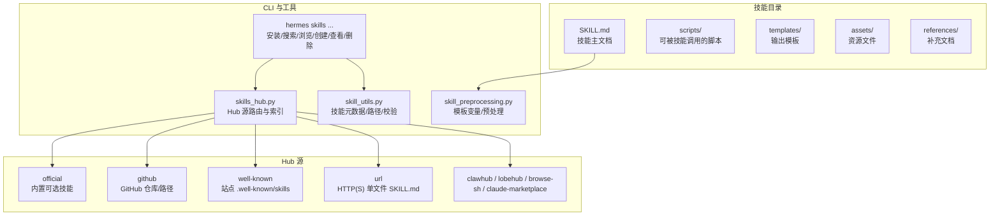
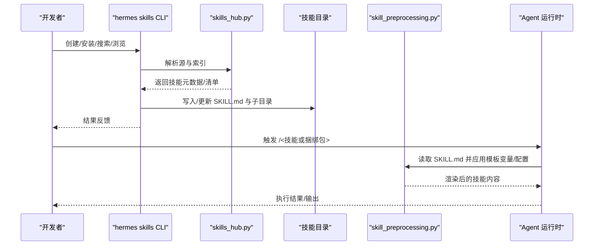
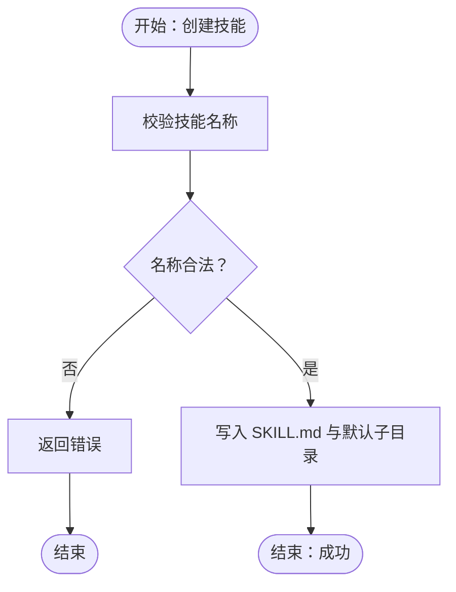
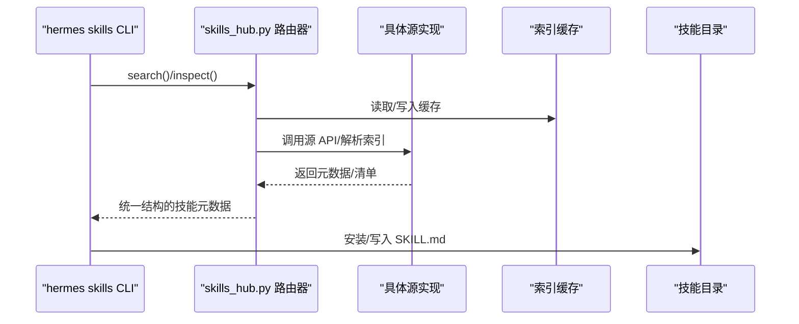
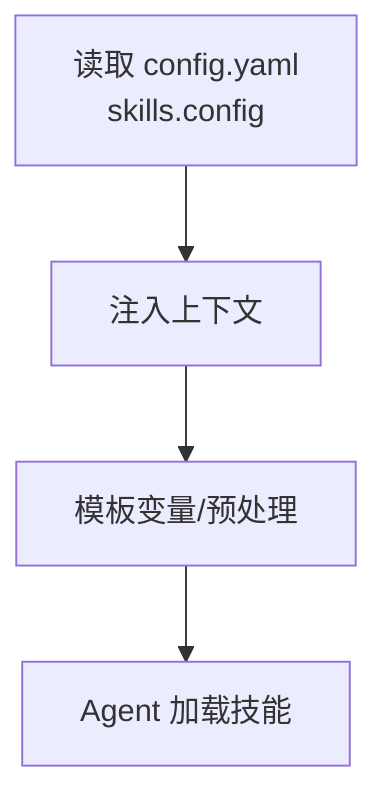
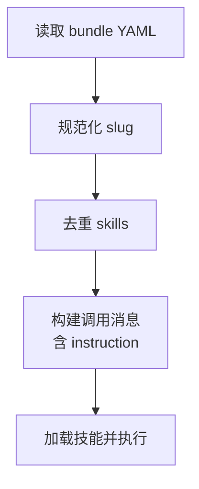
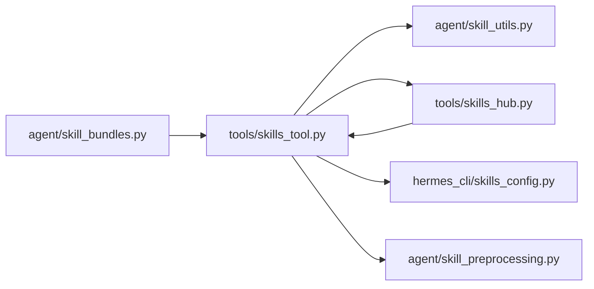

# 技能开发

<cite>
**本文引用的文件**
- [skills_tool.py](file://tools/skills_tool.py)
- [skill_utils.py](file://agent/skill_utils.py)
- [skill_preprocessing.py](file://agent/skill_preprocessing.py)
- [skills_config.py](file://hermes_cli/skills_config.py)
- [skills_hub.py](file://tools/skills_hub.py)
- [test_skills_tool.py](file://tests/tools/test_skills_tool.py)
- [test_skill_manager_tool.py](file://tests/tools/test_skill_manager_tool.py)
- [test_skills_hub.py](file://tests/tools/test_skills_hub.py)
- [test_skills_hub_clawhub.py](file://tests/tools/test_skills_hub_clawhub.py)
- [test_dashboard_admin_endpoints.py](file://tests/hermes_cli/test_dashboard_admin_endpoints.py)
- [test_skill_bundles.py](file://tests/agent/test_skill_bundles.py)
- [skills.md](file://website/i18n/zh-Hans/docusaurus-plugin-content-docs/current/user-guide/features/skills.md)
- [skills.md](file://website/docs/user-guide/features/skills.md)
- [generate-skill-docs.py](file://website/scripts/generate-skill-docs.py)
- [bundle_content_hash](file://tests/tools/test_skills_hub.py)
- [bundle_content_hash](file://tests/tools/test_pr_6656_regressions.py)
</cite>

## 目录
1. [简介](#简介)
2. [项目结构](#项目结构)
3. [核心组件](#核心组件)
4. [架构总览](#架构总览)
5. [详细组件分析](#详细组件分析)
6. [依赖关系分析](#依赖关系分析)
7. [性能考量](#性能考量)
8. [故障排查指南](#故障排查指南)
9. [结论](#结论)
10. [附录](#附录)

## 简介
本指南面向希望在 Hermes Agent 上开发、调试、打包与分发“技能”的开发者。内容覆盖从环境准备、技能模板与配置、逻辑实现，到调试与测试、打包与分发、版本与变更追踪，以及最佳实践与安全注意事项。文档以仓库内现有实现为依据，结合测试用例与用户文档，帮助你完成从入门到精通的学习路径。

## 项目结构
Hermes 的技能体系由“技能目录”“技能清单/索引”“技能 Hub 源”“技能捆绑包”“CLI 工具链”等组成。技能以目录形式组织，主入口为 SKILL.md；技能 Hub 支持多种来源；捆绑包将多个技能聚合为单一命令；CLI 提供创建、查看、安装、卸载、列表、搜索等能力。

图示来源
- [skills.md](file://website/i18n/zh-Hans/docusaurus-plugin-content-docs/current/user-guide/features/skills.md)
- [skills.md](file://website/docs/user-guide/features/skills.md)
- [skills_tool.py](file://tools/skills_tool.py)
- [skills_hub.py](file://tools/skills_hub.py)
- [skill_preprocessing.py](file://agent/skill_preprocessing.py)
- [skill_utils.py](file://agent/skill_utils.py)

章节来源
- [skills.md](file://website/i18n/zh-Hans/docusaurus-plugin-content-docs/current/user-guide/features/skills.md)
- [skills.md](file://website/docs/user-guide/features/skills.md)

## 核心组件
- 技能目录与清单
  - 技能以目录形式存放，主文档为 SKILL.md，支持 references、templates、scripts、assets 子目录。
  - 技能可通过 hermes skills list/browse/search 查看与管理。
- 技能 Hub 源
  - 支持 official、github、well-known、url、clawhub 等多种来源；CLI 提供统一的搜索/浏览/安装接口。
- 技能捆绑包
  - 将多个技能聚合为单一斜杠命令；bundle YAML 定义 skills 列表与可选 instruction。
- 预处理与模板变量
  - 技能配置可注入到上下文；模板变量可在技能渲染时生效。
- CLI 工具链
  - 提供创建、查看、编辑、删除、安装、卸载、搜索、浏览、捆绑包管理等能力。

章节来源
- [skills.md](file://website/i18n/zh-Hans/docusaurus-plugin-content-docs/current/user-guide/features/skills.md)
- [skills.md](file://website/docs/user-guide/features/skills.md)
- [skills_tool.py](file://tools/skills_tool.py)
- [skills_hub.py](file://tools/skills_hub.py)
- [skill_preprocessing.py](file://agent/skill_preprocessing.py)
- [skill_utils.py](file://agent/skill_utils.py)

## 架构总览
下图展示技能从“创建/安装”到“加载执行”的关键流程，以及 Hub 源与 CLI 的交互。

图示来源
- [skills_tool.py](file://tools/skills_tool.py)
- [skills_hub.py](file://tools/skills_hub.py)
- [skill_preprocessing.py](file://agent/skill_preprocessing.py)

## 详细组件分析

### 组件一：技能目录与清单（tools/skills_tool.py）
- 功能要点
  - 创建技能：校验名称合法性、写入 SKILL.md 与默认子目录。
  - 查看技能：读取技能元数据与内容，支持模板变量替换。
  - 列出/搜索/浏览：按类别与关键词过滤，支持外部目录扫描。
  - 删除/卸载：清理技能目录及关联状态。
- 关键行为
  - 名称与内容校验，避免重复与非法字符。
  - 与技能 Hub 的集成，支持从多源安装后落盘。
- 测试验证
  - 单测覆盖创建/重复创建/无效名称/无效内容、查看与模板变量替换等场景。

图示来源
- [test_skill_manager_tool.py](file://tests/tools/test_skill_manager_tool.py)
- [test_skills_tool.py](file://tests/tools/test_skills_tool.py)

章节来源
- [skills_tool.py](file://tools/skills_tool.py)
- [test_skill_manager_tool.py](file://tests/tools/test_skill_manager_tool.py)
- [test_skills_tool.py](file://tests/tools/test_skills_tool.py)

### 组件二：技能 Hub 源与索引（tools/skills_hub.py）
- 功能要点
  - 支持多种源：official、github、well-known、url、clawhub 等。
  - 搜索/检查/安装：根据查询与标识解析技能，下载并缓存索引。
  - 元数据映射：将远端响应映射为统一的技能元数据结构。
- 关键行为
  - 索引缓存与回退策略，避免网络依赖。
  - 对 clawhub 等第三方源的特殊字段映射与匹配规则。
- 测试验证
  - 单测覆盖搜索回退、精确 slug 匹配、嵌套 payload 映射、源枚举等。

图示来源
- [skills_hub.py](file://tools/skills_hub.py)
- [test_skills_hub.py](file://tests/tools/test_skills_hub.py)
- [test_skills_hub_clawhub.py](file://tests/tools/test_skills_hub_clawhub.py)
- [test_dashboard_admin_endpoints.py](file://tests/hermes_cli/test_dashboard_admin_endpoints.py)

章节来源
- [skills_hub.py](file://tools/skills_hub.py)
- [test_skills_hub.py](file://tests/tools/test_skills_hub.py)
- [test_skills_hub_clawhub.py](file://tests/tools/test_skills_hub_clawhub.py)
- [test_dashboard_admin_endpoints.py](file://tests/hermes_cli/test_dashboard_admin_endpoints.py)

### 组件三：技能预处理与配置注入（agent/skill_preprocessing.py、hermes_cli/skills_config.py）
- 功能要点
  - 技能配置注入：从 config.yaml 的 skills.config 下读取配置，解析后注入上下文。
  - 模板变量：支持在技能渲染时应用模板变量。
- 关键行为
  - 配置迁移与显示：hermes config migrate 与 hermes config show。
  - 配置作用域：技能加载时生效，不影响系统提示词缓存。
- 测试验证
  - 单测覆盖模板变量替换、inline shell 等开关影响。

图示来源
- [skills_config.py](file://hermes_cli/skills_config.py)
- [skill_preprocessing.py](file://agent/skill_preprocessing.py)
- [test_skills_tool.py](file://tests/tools/test_skills_tool.py)

章节来源
- [skills_config.py](file://hermes_cli/skills_config.py)
- [skill_preprocessing.py](file://agent/skill_preprocessing.py)
- [test_skills_tool.py](file://tests/tools/test_skills_tool.py)

### 组件四：技能捆绑包（agent/skill_bundles.py 与 CLI）
- 功能要点
  - YAML 定义：name/description/skills/instruction 字段。
  - 命令解析：/bundle-name 展开为多技能加载，instruction 作为附加指令。
  - 行为约定：冲突优先级、缺失技能跳过、跨界面一致、不污染系统提示词缓存。
- 关键行为
  - slug 规范化与去重。
  - 内容哈希用于检测漂移与同步。
- 测试验证
  - 单测覆盖 slug 规范化、去重、保存/删除、内容哈希一致性与文件名敏感性。

图示来源
- [test_skill_bundles.py](file://tests/agent/test_skill_bundles.py)
- [bundle_content_hash](file://tests/tools/test_skills_hub.py)
- [bundle_content_hash](file://tests/tools/test_pr_6656_regressions.py)

章节来源
- [test_skill_bundles.py](file://tests/agent/test_skill_bundles.py)
- [bundle_content_hash](file://tests/tools/test_skills_hub.py)
- [bundle_content_hash](file://tests/tools/test_pr_6656_regressions.py)

### 组件五：技能文档生成与索引（website/scripts/generate-skill-docs.py）
- 功能要点
  - 将 SKILL.md 自动转为 Docusaurus 页面，提取 frontmatter 与元数据，生成目录与描述。
- 关键行为
  - 自动化生成与链接重写，保证文档与源 SKILL.md 同步。

章节来源
- [generate-skill-docs.py](file://website/scripts/generate-skill-docs.py)

## 依赖关系分析
- 组件耦合
  - skills_tool.py 依赖 skill_utils.py 进行路径与元数据处理。
  - skills_hub.py 为 CLI 提供统一的源访问层。
  - skill_preprocessing.py 与 skills_config.py 共同完成配置注入与模板处理。
  - agent/skill_bundles.py 与 CLI/工具链协作，管理捆绑包生命周期。
- 外部依赖
  - HTTP(S) 源、GitHub API、第三方 Hub（如 clawhub）。
- 潜在环路
  - 当前模块间以工具函数/路由为主，未见明显循环导入。

图示来源
- [skills_tool.py](file://tools/skills_tool.py)
- [skill_utils.py](file://agent/skill_utils.py)
- [skills_hub.py](file://tools/skills_hub.py)
- [skills_config.py](file://hermes_cli/skills_config.py)
- [skill_preprocessing.py](file://agent/skill_preprocessing.py)
- [test_skill_bundles.py](file://tests/agent/test_skill_bundles.py)

章节来源
- [skills_tool.py](file://tools/skills_tool.py)
- [skill_utils.py](file://agent/skill_utils.py)
- [skills_hub.py](file://tools/skills_hub.py)
- [skills_config.py](file://hermes_cli/skills_config.py)
- [skill_preprocessing.py](file://agent/skill_preprocessing.py)
- [test_skill_bundles.py](file://tests/agent/test_skill_bundles.py)

## 性能考量
- 索引缓存与回退：Hub 源应尽量利用缓存，减少网络请求与解析成本。
- 捆绑包内容哈希：通过哈希快速判断是否需要重新安装或同步，降低重复 IO。
- 模板变量与预处理：仅在必要时进行，避免在热路径上做昂贵操作。
- 外部目录扫描：限制扫描深度与范围，避免在大型文件树上产生不必要的遍历。

## 故障排查指南
- 创建失败
  - 检查技能名称是否合法、是否与已有技能重复。
  - 确认内容包含有效的 frontmatter 与 SKILL.md 结构。
- 查看/渲染异常
  - 确认 template_vars 与 inline_shell 配置是否符合预期。
  - 检查 SKILL.md 是否包含必要的 frontmatter 字段。
- 安装/搜索无结果
  - 确认 Hub 源可用且索引缓存有效。
  - 对 clawhub 等第三方源，确认网络可达与参数正确。
- 捆绑包行为异常
  - 检查 skills 列表是否去重，instruction 是否正确拼接。
  - 使用内容哈希对比确认是否发生文件名交换导致的差异。

章节来源
- [test_skill_manager_tool.py](file://tests/tools/test_skill_manager_tool.py)
- [test_skills_tool.py](file://tests/tools/test_skills_tool.py)
- [test_skills_hub.py](file://tests/tools/test_skills_hub.py)
- [test_skills_hub_clawhub.py](file://tests/tools/test_skills_hub_clawhub.py)
- [test_skill_bundles.py](file://tests/agent/test_skill_bundles.py)
- [bundle_content_hash](file://tests/tools/test_skills_hub.py)
- [bundle_content_hash](file://tests/tools/test_pr_6656_regressions.py)

## 结论
Hermes 的技能体系以“目录+SKILL.md”为核心，配合 Hub 源、捆绑包与 CLI 工具链，形成从创建、安装、配置、调试到分发与版本管理的完整闭环。遵循本文档的最佳实践与测试驱动方法，可显著提升技能开发效率与质量。

## 附录

### A. 技能模板与目录结构
- 目录结构建议
  - SKILL.md：技能主文档，包含 frontmatter 与正文。
  - scripts/：可被技能调用的辅助脚本。
  - templates/：输出格式模板。
  - assets/：图像、图标等资源。
  - references/：补充文档与参考资料。
- 模板变量与配置
  - 在 SKILL.md 中使用模板变量，结合 skills.config 注入上下文。

章节来源
- [skills.md](file://website/i18n/zh-Hans/docusaurus-plugin-content-docs/current/user-guide/features/skills.md)
- [skills.md](file://website/docs/user-guide/features/skills.md)
- [skill_preprocessing.py](file://agent/skill_preprocessing.py)
- [skills_config.py](file://hermes_cli/skills_config.py)

### B. 开发环境搭建与调试
- 环境准备
  - 安装 Hermes CLI 与相关依赖。
  - 准备技能目录（默认位于 ~/.hermes/skills/），可配置外部目录扫描。
- 调试工具
  - 使用 hermes skills create/view/list/search/install/uninstall 等命令进行迭代。
  - 通过 hermes config migrate/show 管理配置。
- 测试方法
  - 借助单测覆盖创建/查看/Hub 源/捆绑包等关键路径。

章节来源
- [skills_tool.py](file://tools/skills_tool.py)
- [skills_hub.py](file://tools/skills_hub.py)
- [test_skills_tool.py](file://tests/tools/test_skills_tool.py)
- [test_skills_hub.py](file://tests/tools/test_skills_hub.py)
- [test_skill_bundles.py](file://tests/agent/test_skill_bundles.py)

### C. 打包、分发与版本管理
- 打包
  - 使用 hermes bundles create 定义 bundle YAML，声明 skills 与 instruction。
- 分发
  - 通过 Hub 源（official/github/well-known/url/clawhub 等）分发。
- 版本与变更追踪
  - 通过内容哈希检测文件名交换与内容变化，确保一致性与可审计性。

章节来源
- [test_skill_bundles.py](file://tests/agent/test_skill_bundles.py)
- [bundle_content_hash](file://tests/tools/test_skills_hub.py)
- [bundle_content_hash](file://tests/tools/test_pr_6656_regressions.py)
- [skills.md](file://website/docs/user-guide/features/skills.md)
- [skills.md](file://website/i18n/zh-Hans/docusaurus-plugin-content-docs/current/user-guide/features/skills.md)

### D. 最佳实践与安全考虑
- 最佳实践
  - 使用清晰的 frontmatter 字段（name/description）与稳定的 slug。
  - 将复杂逻辑放入 scripts/templates/assets，保持 SKILL.md 结构化与可读性。
  - 通过捆绑包复用常用技能组合，减少重复输入。
- 安全考虑
  - 严格控制 inline shell 与模板变量的启用范围，避免任意代码执行。
  - 对第三方 Hub 源进行信任评估，优先选择受信源。
  - 使用内容哈希与索引缓存，防止恶意替换与中间人攻击。

章节来源
- [skills_config.py](file://hermes_cli/skills_config.py)
- [skills.md](file://website/docs/user-guide/features/skills.md)
- [skills.md](file://website/i18n/zh-Hans/docusaurus-plugin-content-docs/current/user-guide/features/skills.md)