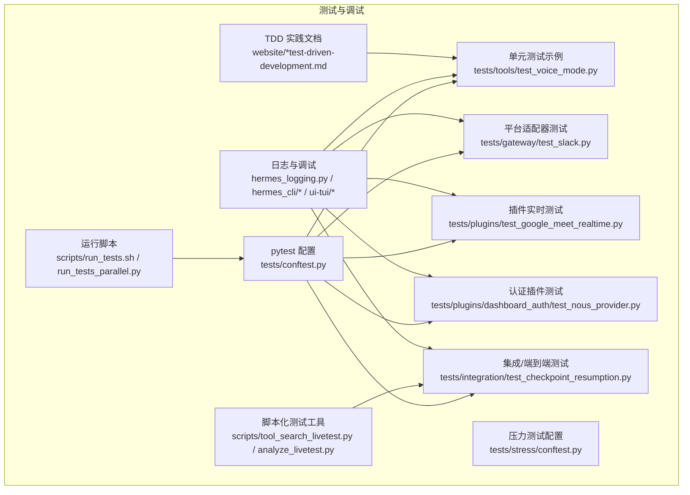
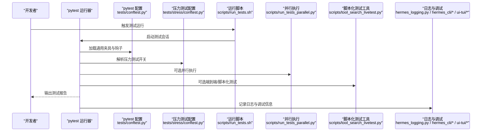
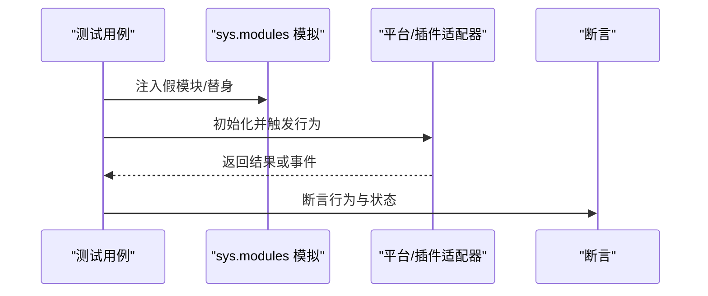
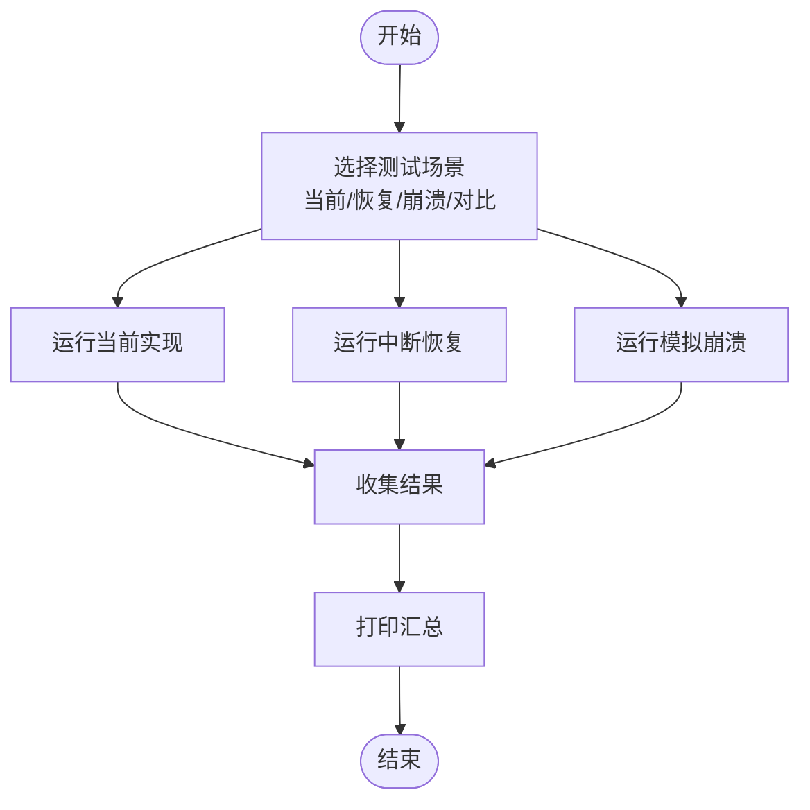
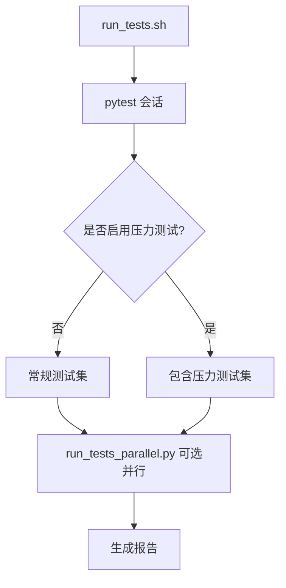
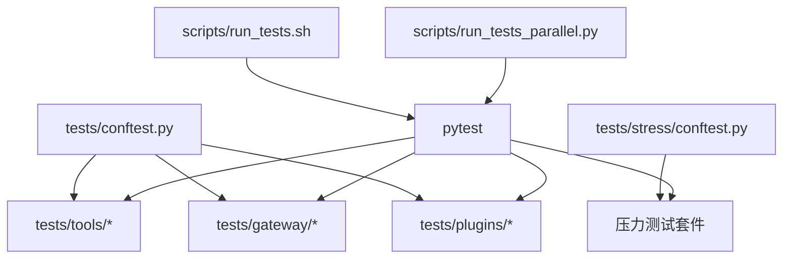

# 技能测试与调试

<cite>
**本文引用的文件**
- [tests/conftest.py](file://tests/conftest.py)
- [tests/stress/conftest.py](file://tests/stress/conftest.py)
- [tests/tools/test_voice_mode.py](file://tests/tools/test_voice_mode.py)
- [tests/gateway/test_slack.py](file://tests/gateway/test_slack.py)
- [tests/plugins/test_google_meet_realtime.py](file://tests/plugins/test_google_meet_realtime.py)
- [tests/plugins/dashboard_auth/test_nous_provider.py](file://tests/plugins/dashboard_auth/test_nous_provider.py)
- [tests/integration/test_checkpoint_resumption.py](file://tests/integration/test_checkpoint_resumption.py)
- [tests/stress/test_atypical_scenarios.py](file://tests/stress/test_atypical_scenarios.py)
- [scripts/run_tests.sh](file://scripts/run_tests.sh)
- [scripts/run_tests_parallel.py](file://scripts/run_tests_parallel.py)
- [scripts/LIVETEST_README.md](file://scripts/LIVETEST_README.md)
- [scripts/tool_search_livetest.py](file://scripts/tool_search_livetest.py)
- [scripts/analyze_livetest.py](file://scripts/analyze_livetest.py)
- [hermes_logging.py](file://hermes_logging.py)
- [hermes_cli/debug.py](file://hermes_cli/debug.py)
- [hermes_cli/logs.py](file://hermes_cli/logs.py)
- [ui-tui/packages/hermes-ink/src/utils/log.ts](file://ui-tui/packages/hermes-ink/src/utils/log.ts)
- [ui-tui/packages/hermes-ink/src/utils/debug.ts](file://ui-tui/packages/hermes-ink/src/utils/debug.ts)
- [website/docs/user-guide/skills/bundled/software-development/software-development-test-driven-development.md](file://website/docs/user-guide/skills/bundled/software-development/software-development-test-driven-development.md)
- [website/i18n/zh-Hans/docusaurus-plugin-content-docs/current/user-guide/skills/bundled/software-development/software-development-test-driven-development.md](file://website/i18n/zh-Hans/docusaurus-plugin-content-docs/current/user-guide/skills/bundled/software-development/software-development-test-driven-development.md)
- [skills/github/DESCRIPTION.md](file://skills/github/DESCRIPTION.md)
</cite>

## 目录
1. [简介](#简介)
2. [项目结构](#项目结构)
3. [核心组件](#核心组件)
4. [架构总览](#架构总览)
5. [详细组件分析](#详细组件分析)
6. [依赖关系分析](#依赖关系分析)
7. [性能考量](#性能考量)
8. [故障排查指南](#故障排查指南)
9. [结论](#结论)
10. [附录](#附录)

## 简介
本指南面向技能作者与维护者，系统讲解如何为技能编写高质量的单元测试、集成测试与端到端测试；如何使用日志、错误追踪与性能分析工具进行调试；如何组织测试自动化与持续集成流程。文档结合仓库中的实际测试样例与工具脚本，帮助读者快速落地可维护、可扩展的测试体系。

## 项目结构
围绕“技能测试与调试”的主题，仓库中与之直接相关的关键位置如下：
- 测试框架与通用配置：tests/conftest.py、tests/stress/conftest.py
- 单元测试示例：tests/tools/test_voice_mode.py、tests/gateway/test_slack.py、tests/plugins/test_google_meet_realtime.py、tests/plugins/dashboard_auth/test_nous_provider.py
- 集成测试与端到端测试：tests/integration/test_checkpoint_resumption.py、scripts/tool_search_livetest.py、scripts/analyze_livetest.py
- 测试运行与并行执行：scripts/run_tests.sh、scripts/run_tests_parallel.py
- 日志与调试工具：hermes_logging.py、hermes_cli/debug.py、hermes_cli/logs.py、ui-tui/packages/hermes-ink/src/utils/log.ts、ui-tui/packages/hermes-ink/src/utils/debug.ts
- TDD实践文档：website/docs/user-guide/skills/bundled/software-development/software-development-test-driven-development.md 及其中文版本
- 技能描述参考：skills/github/DESCRIPTION.md

图表来源
- [tests/conftest.py](file://tests/conftest.py)
- [tests/stress/conftest.py](file://tests/stress/conftest.py)
- [tests/tools/test_voice_mode.py](file://tests/tools/test_voice_mode.py)
- [tests/gateway/test_slack.py](file://tests/gateway/test_slack.py)
- [tests/plugins/test_google_meet_realtime.py](file://tests/plugins/test_google_meet_realtime.py)
- [tests/plugins/dashboard_auth/test_nous_provider.py](file://tests/plugins/dashboard_auth/test_nous_provider.py)
- [tests/integration/test_checkpoint_resumption.py](file://tests/integration/test_checkpoint_resumption.py)
- [scripts/tool_search_livetest.py](file://scripts/tool_search_livetest.py)
- [scripts/analyze_livetest.py](file://scripts/analyze_livetest.py)
- [scripts/run_tests.sh](file://scripts/run_tests.sh)
- [scripts/run_tests_parallel.py](file://scripts/run_tests_parallel.py)
- [hermes_logging.py](file://hermes_logging.py)
- [hermes_cli/debug.py](file://hermes_cli/debug.py)
- [hermes_cli/logs.py](file://hermes_cli/logs.py)
- [ui-tui/packages/hermes-ink/src/utils/log.ts](file://ui-tui/packages/hermes-ink/src/utils/log.ts)
- [ui-tui/packages/hermes-ink/src/utils/debug.ts](file://ui-tui/packages/hermes-ink/src/utils/debug.ts)
- [website/docs/user-guide/skills/bundled/software-development/software-development-test-driven-development.md](file://website/docs/user-guide/skills/bundled/software-development/software-development-test-driven-development.md)
- [website/i18n/zh-Hans/docusaurus-plugin-content-docs/current/user-guide/skills/bundled/software-development/software-development-test-driven-development.md](file://website/i18n/zh-Hans/docusaurus-plugin-content-docs/current/user-guide/skills/bundled/software-development/software-development-test-driven-development.md)

章节来源
- [tests/conftest.py](file://tests/conftest.py)
- [tests/stress/conftest.py](file://tests/stress/conftest.py)

## 核心组件
- 测试运行与并行执行
  - 脚本化运行与并行：scripts/run_tests.sh、scripts/run_tests_parallel.py
  - 压力测试开关：tests/stress/conftest.py 中通过命令行参数控制是否运行慢速/子进程类测试
- 日志与调试
  - Python侧日志：hermes_logging.py
  - CLI调试与日志：hermes_cli/debug.py、hermes_cli/logs.py
  - TUI前端日志与调试：ui-tui/packages/hermes-ink/src/utils/log.ts、ui-tui/packages/hermes-ink/src/utils/debug.ts
- 测试夹具与模拟
  - 平台/插件/工具的测试夹具与模块级模拟，确保隔离性与可重复性
- 文档化实践
  - TDD流程与验证清单：website/docs/user-guide/skills/bundled/software-development/software-development-test-driven-development.md 及其中文版本

章节来源
- [scripts/run_tests.sh](file://scripts/run_tests.sh)
- [scripts/run_tests_parallel.py](file://scripts/run_tests_parallel.py)
- [tests/stress/conftest.py](file://tests/stress/conftest.py)
- [hermes_logging.py](file://hermes_logging.py)
- [hermes_cli/debug.py](file://hermes_cli/debug.py)
- [hermes_cli/logs.py](file://hermes_cli/logs.py)
- [ui-tui/packages/hermes-ink/src/utils/log.ts](file://ui-tui/packages/hermes-ink/src/utils/log.ts)
- [ui-tui/packages/hermes-ink/src/utils/debug.ts](file://ui-tui/packages/hermes-ink/src/utils/debug.ts)
- [website/docs/user-guide/skills/bundled/software-development/software-development-test-driven-development.md](file://website/docs/user-guide/skills/bundled/software-development/software-development-test-driven-development.md)
- [website/i18n/zh-Hans/docusaurus-plugin-content-docs/current/user-guide/skills/bundled/software-development/software-development-test-driven-development.md](file://website/i18n/zh-Hans/docusaurus-plugin-content-docs/current/user-guide/skills/bundled/software-development/software-development-test-driven-development.md)

## 架构总览
下图展示了从“测试触发”到“结果输出”的典型路径，以及日志与调试工具在其中的位置：

图表来源
- [tests/conftest.py](file://tests/conftest.py)
- [tests/stress/conftest.py](file://tests/stress/conftest.py)
- [scripts/run_tests.sh](file://scripts/run_tests.sh)
- [scripts/run_tests_parallel.py](file://scripts/run_tests_parallel.py)
- [scripts/tool_search_livetest.py](file://scripts/tool_search_livetest.py)
- [hermes_logging.py](file://hermes_logging.py)
- [hermes_cli/debug.py](file://hermes_cli/debug.py)
- [hermes_cli/logs.py](file://hermes_cli/logs.py)
- [ui-tui/packages/hermes-ink/src/utils/log.ts](file://ui-tui/packages/hermes-ink/src/utils/log.ts)
- [ui-tui/packages/hermes-ink/src/utils/debug.ts](file://ui-tui/packages/hermes-ink/src/utils/debug.ts)

## 详细组件分析

### 单元测试：工具与平台适配器
- 目标：验证工具行为、平台适配器连接与消息处理、插件实时通信等
- 关键点：
  - 使用模块级模拟与 sys.modules 注入，避免外部依赖
  - 使用临时目录与隔离的会话状态，保证测试独立性
  - 对异常路径与边界条件进行断言

图表来源
- [tests/gateway/test_slack.py](file://tests/gateway/test_slack.py)
- [tests/plugins/test_google_meet_realtime.py](file://tests/plugins/test_google_meet_realtime.py)
- [tests/tools/test_voice_mode.py](file://tests/tools/test_voice_mode.py)

章节来源
- [tests/gateway/test_slack.py](file://tests/gateway/test_slack.py)
- [tests/plugins/test_google_meet_realtime.py](file://tests/plugins/test_google_meet_realtime.py)
- [tests/tools/test_voice_mode.py](file://tests/tools/test_voice_mode.py)

### 集成测试与端到端测试
- 目标：验证跨组件协作、中断恢复、长时间运行场景与真实交互
- 关键点：
  - 通过脚本化工具驱动真实流程，收集指标与异常
  - 对“当前实现/恢复/崩溃”三种场景进行对比评估
  - 压力测试注册与汇总统计，便于识别异常场景

图表来源
- [tests/integration/test_checkpoint_resumption.py](file://tests/integration/test_checkpoint_resumption.py)
- [scripts/tool_search_livetest.py](file://scripts/tool_search_livetest.py)
- [scripts/analyze_livetest.py](file://scripts/analyze_livetest.py)

章节来源
- [tests/integration/test_checkpoint_resumption.py](file://tests/integration/test_checkpoint_resumption.py)
- [scripts/tool_search_livetest.py](file://scripts/tool_search_livetest.py)
- [scripts/analyze_livetest.py](file://scripts/analyze_livetest.py)

### 测试自动化与并行执行
- 目标：提升测试吞吐量与反馈速度
- 关键点：
  - run_tests.sh 提供一键运行入口
  - run_tests_parallel.py 支持并行执行以缩短时长
  - stress 测试通过命令行开关启用，避免默认 CI 中的长耗时

图表来源
- [scripts/run_tests.sh](file://scripts/run_tests.sh)
- [scripts/run_tests_parallel.py](file://scripts/run_tests_parallel.py)
- [tests/stress/conftest.py](file://tests/stress/conftest.py)

章节来源
- [scripts/run_tests.sh](file://scripts/run_tests.sh)
- [scripts/run_tests_parallel.py](file://scripts/run_tests_parallel.py)
- [tests/stress/conftest.py](file://tests/stress/conftest.py)

### 日志记录、错误追踪与性能分析
- 日志
  - hermes_logging.py 提供统一日志配置
  - hermes_cli/logs.py 提供日志查看能力
  - hermes_cli/debug.py 提供调试模式入口
- 错误追踪
  - ui-tui/packages/hermes-ink/src/utils/log.ts 在开启环境变量后输出错误堆栈
  - ui-tui/packages/hermes-ink/src/utils/debug.ts 提供调试输出占位
- 性能分析
  - 结合压力测试与脚本化工具，对端到端路径进行指标采集与回归检测

图表来源
- [hermes_logging.py](file://hermes_logging.py)
- [hermes_cli/logs.py](file://hermes_cli/logs.py)
- [hermes_cli/debug.py](file://hermes_cli/debug.py)
- [ui-tui/packages/hermes-ink/src/utils/log.ts](file://ui-tui/packages/hermes-ink/src/utils/log.ts)
- [ui-tui/packages/hermes-ink/src/utils/debug.ts](file://ui-tui/packages/hermes-ink/src/utils/debug.ts)

章节来源
- [hermes_logging.py](file://hermes_logging.py)
- [hermes_cli/logs.py](file://hermes_cli/logs.py)
- [hermes_cli/debug.py](file://hermes_cli/debug.py)
- [ui-tui/packages/hermes-ink/src/utils/log.ts](file://ui-tui/packages/hermes-ink/src/utils/log.ts)
- [ui-tui/packages/hermes-ink/src/utils/debug.ts](file://ui-tui/packages/hermes-ink/src/utils/debug.ts)

### TDD 实践与测试用例设计
- 核心原则
  - 先红后绿再重构
  - 每个测试只验证单一行为
  - 尽可能使用真实代码，必要时才使用 mock
  - 覆盖边界与错误路径
- 实施建议
  - 使用 terminal 工具在技能开发过程中逐步运行测试
  - 通过验证清单检查测试质量与覆盖率

章节来源
- [website/docs/user-guide/skills/bundled/software-development/software-development-test-driven-development.md](file://website/docs/user-guide/skills/bundled/software-development/software-development-test-driven-development.md)
- [website/i18n/zh-Hans/docusaurus-plugin-content-docs/current/user-guide/skills/bundled/software-development/software-development-test-driven-development.md](file://website/i18n/zh-Hans/docusaurus-plugin-content-docs/current/user-guide/skills/bundled/software-development/software-development-test-driven-development.md)

## 依赖关系分析
- 测试运行依赖
  - tests/conftest.py 提供全局夹具与钩子
  - tests/stress/conftest.py 控制压力测试集合的启用
  - scripts/run_tests.sh 作为入口，run_tests_parallel.py 可选并行
- 组件间耦合
  - 平台/插件适配器测试通过 sys.modules 注入假模块，降低对外部服务的耦合
  - 工具测试使用临时文件与隔离目录，避免状态泄漏
- 外部依赖与集成点
  - Slack、Google Meet 等第三方 SDK 通过模块级模拟进行测试
  - 端到端测试通过脚本化工具与真实流程交互

图表来源
- [tests/conftest.py](file://tests/conftest.py)
- [tests/stress/conftest.py](file://tests/stress/conftest.py)
- [scripts/run_tests.sh](file://scripts/run_tests.sh)
- [scripts/run_tests_parallel.py](file://scripts/run_tests_parallel.py)

章节来源
- [tests/conftest.py](file://tests/conftest.py)
- [tests/stress/conftest.py](file://tests/stress/conftest.py)
- [scripts/run_tests.sh](file://scripts/run_tests.sh)
- [scripts/run_tests_parallel.py](file://scripts/run_tests_parallel.py)

## 性能考量
- 并行执行
  - 使用 run_tests_parallel.py 在多核环境下加速测试
- 压力测试
  - 通过 tests/stress/conftest.py 的开关控制，避免默认 CI 中的长耗时
- 端到端指标
  - 利用 scripts/tool_search_livetest.py 与 scripts/analyze_livetest.py 收集端到端指标，定位性能瓶颈

章节来源
- [scripts/run_tests_parallel.py](file://scripts/run_tests_parallel.py)
- [tests/stress/conftest.py](file://tests/stress/conftest.py)
- [scripts/tool_search_livetest.py](file://scripts/tool_search_livetest.py)
- [scripts/analyze_livetest.py](file://scripts/analyze_livetest.py)

## 故障排查指南
- 常见问题与定位
  - 平台/插件适配器测试失败：检查 sys.modules 注入是否正确，确认假模块与真实模块签名一致
  - 工具测试失败：确认临时文件与目录权限，避免跨测试污染
  - 端到端测试不稳定：使用 scripts/analyze_livetest.py 分析失败轨迹，关注超时与资源竞争
- 日志与调试
  - 启用 hermes_cli/logs.py 查看日志
  - 在 TUI 中通过 HERMES_INK_DEBUG_ERRORS 环境变量输出错误堆栈
  - 使用 hermes_cli/debug.py 进入调试模式
- 回归与对比
  - 使用 tests/integration/test_checkpoint_resumption.py 的对比模式，比较“当前/恢复/崩溃”三类场景的结果

章节来源
- [tests/gateway/test_slack.py](file://tests/gateway/test_slack.py)
- [tests/plugins/test_google_meet_realtime.py](file://tests/plugins/test_google_meet_realtime.py)
- [tests/tools/test_voice_mode.py](file://tests/tools/test_voice_mode.py)
- [hermes_cli/logs.py](file://hermes_cli/logs.py)
- [ui-tui/packages/hermes-ink/src/utils/log.ts](file://ui-tui/packages/hermes-ink/src/utils/log.ts)
- [hermes_cli/debug.py](file://hermes_cli/debug.py)
- [tests/integration/test_checkpoint_resumption.py](file://tests/integration/test_checkpoint_resumption.py)

## 结论
通过模块化的测试夹具、严格的模拟策略与完善的日志/调试工具链，本项目为技能测试与调试提供了可复用的工程化方法。配合 TDD 文档化实践与脚本化端到端测试，能够有效提升技能质量与交付效率。

## 附录
- 技能描述参考：skills/github/DESCRIPTION.md 展示了技能元数据的规范写法，有助于在测试中对技能行为进行一致性校验
- 测试运行入口：scripts/run_tests.sh 与 scripts/run_tests_parallel.py 提供一键式测试体验

章节来源
- [skills/github/DESCRIPTION.md](file://skills/github/DESCRIPTION.md)
- [scripts/run_tests.sh](file://scripts/run_tests.sh)
- [scripts/run_tests_parallel.py](file://scripts/run_tests_parallel.py)