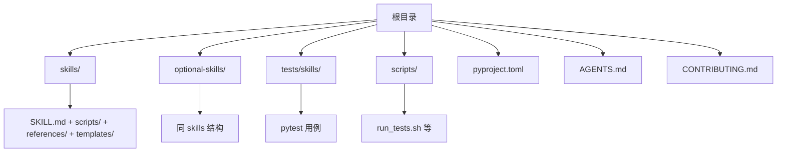
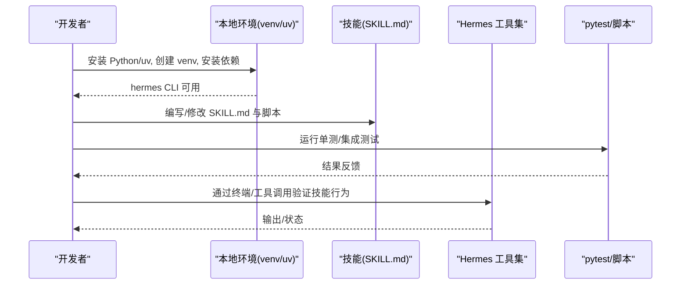
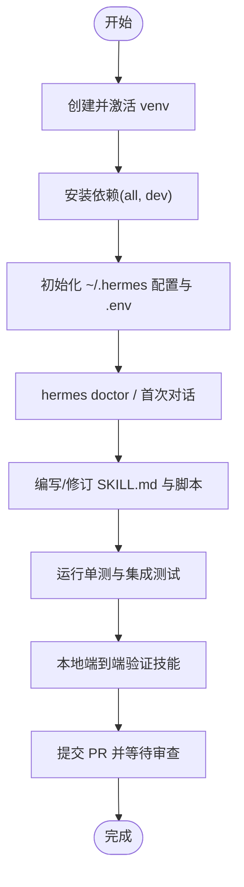

# 开发环境搭建

<cite>
**本文引用的文件**
- [README.md](file://README.md)
- [CONTRIBUTING.md](file://CONTRIBUTING.md)
- [AGENTS.md](file://AGENTS.md)
- [pyproject.toml](file://pyproject.toml)
- [skills/software-development/hermes-agent-skill-authoring/SKILL.md](file://skills/software-development/hermes-agent-skill-authoring/SKILL.md)
- [scripts/run_tests.sh](file://scripts/run_tests.sh)
</cite>

## 目录
1. [简介](#简介)
2. [项目结构](#项目结构)
3. [核心组件](#核心组件)
4. [架构总览](#架构总览)
5. [详细组件分析](#详细组件分析)
6. [依赖分析](#依赖分析)
7. [性能考虑](#性能考虑)
8. [故障排查指南](#故障排查指南)
9. [结论](#结论)
10. [附录](#附录)

## 简介
本指南面向希望在本仓库中开发“技能（Skill）”的开发者，提供从零到一的环境搭建与完整工作流说明。内容涵盖：
- Python 环境与依赖安装（uv、Python 版本、可选 Node.js）
- IDE 配置建议与调试工具准备
- 技能目录结构与 SKILL.md 编写规范
- 代码格式化、语法检查、单元测试框架与运行方式
- 从基础环境到完整开发工作流的逐步指导
- 常见问题解决方案与最佳实践

## 项目结构
仓库采用多语言、多子工程组织，技能相关的主要位置如下：
- skills/：内置技能（随包分发）
- optional-skills/：官方可选技能（不默认激活）
- tests/skills/：针对技能的测试用例
- scripts/：测试脚本、构建与辅助脚本
- pyproject.toml：Python 依赖、可选特性、测试与代码质量工具配置
- AGENTS.md / CONTRIBUTING.md：开发指南、贡献流程、技能作者规范

图表来源
- [AGENTS.md:269-309](file://AGENTS.md#L269-L309)
- [CONTRIBUTING.md:404-421](file://CONTRIBUTING.md#L404-L421)

章节来源
- [AGENTS.md:269-309](file://AGENTS.md#L269-L309)
- [CONTRIBUTING.md:404-421](file://CONTRIBUTING.md#L404-L421)

## 核心组件
- 开发入口与环境管理
  - 推荐使用 uv 管理 Python 环境与依赖；Python 版本要求为 3.11–3.13（受限于 requires-python 与上游二进制轮限制）。
  - 通过安装器或手动克隆创建 venv，并安装全部开发与可选依赖。
- 技能系统
  - 技能以目录为单位，核心是 SKILL.md（YAML frontmatter + Markdown 正文），支持平台限定、条件激活、环境变量声明等。
- 测试与质量
  - 使用 pytest 运行测试；CI 推荐通过 scripts/run_tests.sh 执行，保证与 CI 一致。
  - 代码风格与静态检查由 ruff 等工具在 pyproject.toml 中配置。

章节来源
- [README.md:221-246](file://README.md#L221-L246)
- [pyproject.toml:3-15](file://pyproject.toml#L3-L15)
- [CONTRIBUTING.md:105-172](file://CONTRIBUTING.md#L105-L172)
- [AGENTS.md:252-261](file://AGENTS.md#L252-L261)

## 架构总览
下图展示“本地开发环境 → 技能加载 → 工具调用 → 测试验证”的整体流程。

图表来源
- [CONTRIBUTING.md:105-172](file://CONTRIBUTING.md#L105-L172)
- [scripts/run_tests.sh](file://scripts/run_tests.sh)

## 详细组件分析

### 1) Python 环境与依赖安装
- 推荐路径
  - 使用标准安装器后，进入仓库目录，安装开发依赖：
    - 添加 dev 与 all 特性，以便获得完整的 CLI、消息通道、MCP、Web 等能力与开发工具。
  - 如需浏览器工具或文档站点，可额外安装 Node.js 依赖。
- 手动克隆路径
  - 在源码树外创建 venv（避免相对路径误删运行时的风险），指定 Python 3.11，再安装依赖。
- 关键约束
  - Python 版本范围由项目配置限定；Windows 上需关注时区数据与日志轮转等差异。
  - 依赖采用严格上限策略，降低供应链风险；新增依赖需遵循上限规则并更新锁定文件。

章节来源
- [README.md:221-246](file://README.md#L221-L246)
- [CONTRIBUTING.md:105-172](file://CONTRIBUTING.md#L105-L172)
- [pyproject.toml:3-15](file://pyproject.toml#L3-L15)
- [pyproject.toml:598-617](file://pyproject.toml#L598-L617)

### 2) IDE 配置与调试工具
- 解释器与虚拟环境
  - 将 IDE 指向创建的 venv（或 .venv），确保导入路径与运行时一致。
- 断点与远程调试
  - 开发依赖包含 debugpy，可用于断点调试；结合 TUI/Gateway 进程进行联调。
- 插件与扩展
  - 启用 Python 类型检查与 lint 提示；根据 pyproject.toml 中的 ruff 配置对齐风格。
- 注意事项
  - 跨平台路径、编码、进程管理等差异需在 IDE 中正确识别（如 Windows 换行、BOM 等）。

章节来源
- [AGENTS.md:252-261](file://AGENTS.md#L252-L261)
- [pyproject.toml:175](file://pyproject.toml#L175)
- [CONTRIBUTING.md:676-800](file://CONTRIBUTING.md#L676-L800)

### 3) 技能目录结构与 SKILL.md 规范
- 目录结构
  - 每个技能一个目录，包含 SKILL.md；可选 scripts/、references/、templates/、tests/。
  - 内置技能位于 skills/，官方可选技能位于 optional-skills/。
- SKILL.md 要点
  - YAML frontmatter：name、description、version、author、license、platforms、metadata.hermes（tags、related_skills、条件激活字段）。
  - 正文结构：When to Use、Prerequisites、How to Run、Quick Reference、Procedure、Pitfalls、Verification。
  - 平台限定：仅当脚本/命令确为某平台时才设置 platforms，否则默认全平台。
  - 条件激活：可通过 fallback_for_toolsets/requires_toolsets/fallback_for_tools/requires_tools 控制显示时机。
  - 安全元数据：required_environment_variables 用于加载时收集密钥，Gateway/消息会话不会在线收集。
- 写作硬性要求
  - description ≤ 60 字符，一句话，句号结尾，无营销词。
  - author 优先写人类贡献者，其次 Hermes Agent。
  - 正文引用工具名必须使用 Hermes 工具名（如 terminal、read_file、web_search 等），而非裸 shell 命令。
  - 不要出现机器本地路径；使用仓库相对路径。

章节来源
- [CONTRIBUTING.md:404-563](file://CONTRIBUTING.md#L404-L563)
- [skills/software-development/hermes-agent-skill-authoring/SKILL.md:1-213](file://skills/software-development/hermes-agent-skill-authoring/SKILL.md#L1-L213)

### 4) 开发工具链：格式化、语法检查、测试
- 代码质量
  - ruff 在 pyproject.toml 中启用预览规则与特定规则集；测试与技能目录对部分规则有忽略策略。
- 测试框架
  - pytest 为主；测试路径在 tests/；CI 推荐通过 scripts/run_tests.sh 运行，保证隔离与并行。
- 运行方式
  - 首选：scripts/run_tests.sh（匹配 CI 行为）
  - 备选：激活 venv 后直接 pytest tests/ -v
- 技能测试
  - 技能测试放在 tests/skills/test_<skill>_skill.py，仅使用 stdlib + pytest + unittest.mock，禁止网络请求。

章节来源
- [pyproject.toml:410-449](file://pyproject.toml#L410-L449)
- [CONTRIBUTING.md:201-211](file://CONTRIBUTING.md#L201-L211)
- [skills/software-development/hermes-agent-skill-authoring/SKILL.md:148-152](file://skills/software-development/hermes-agent-skill-authoring/SKILL.md#L148-L152)

### 5) 从基础环境到完整工作流的步骤
- 步骤概览
  1) 安装 Python/uv，创建 venv 并安装依赖（all, dev）
  2) 初始化用户配置目录与示例配置
  3) 配置至少一个模型提供商密钥（写入 .env）
  4) 运行诊断与快速对话，确认环境正常
  5) 编写/修改 SKILL.md 与脚本，遵循规范
  6) 编写单测并通过 scripts/run_tests.sh 验证
  7) 本地运行技能，验证端到端行为
  8) 提交 PR 前再次运行测试与质量检查

图表来源
- [CONTRIBUTING.md:105-172](file://CONTRIBUTING.md#L105-L172)
- [CONTRIBUTING.md:201-211](file://CONTRIBUTING.md#L201-L211)
- [scripts/run_tests.sh](file://scripts/run_tests.sh)

## 依赖分析
- Python 版本与约束
  - requires-python 限定 3.11–3.13，避免选择 3.14 导致上游 Rust 依赖无法找到 wheel。
- 依赖策略
  - 核心依赖精确锁定；可选功能通过 extras 按需引入；第三方依赖普遍设置上限以降低供应链风险。
- 开发依赖
  - dev extra 包含 debugpy、pytest、ruff 等；messaging/web/mcp 等通过对应 extra 安装。
- 锁定与升级
  - 新增依赖需遵循上限规则，并重新生成 uv.lock；保持解析一致性。

章节来源
- [pyproject.toml:3-15](file://pyproject.toml#L3-L15)
- [pyproject.toml:157-352](file://pyproject.toml#L157-L352)
- [pyproject.toml:598-617](file://pyproject.toml#L598-L617)

## 性能考虑
- 依赖最小化：仅在必要时安装 extras，减少启动与内存占用。
- 测试并行：使用 scripts/run_tests.sh 的并行模式，缩短反馈时间。
- 技能体积：SKILL.md 控制在合理行数，复杂逻辑放入 scripts/references/templates，避免正文臃肿。
- 跨平台路径与编码：避免不必要的 I/O 与编码转换开销。

[本节为通用建议，无需具体文件引用]

## 故障排查指南
- 常见环境问题
  - Windows Defender/杀毒软件误报 uv.exe：按官方指引验证与白名单处理。
  - 时区与日志：Windows 需要 tzdata；日志轮转在 Windows 下使用并发日志处理器。
  - 路径与编码：注意 .env/config.yaml 的 BOM 与编码问题，使用 pathlib 与合适的 encoding。
  - 进程管理：避免 os.kill(pid, 0) 等不安全用法，改用 psutil。
- 技能相关问题
  - 平台限制：若脚本使用了 POSIX 专属 API，务必在 frontmatter 中声明 platforms。
  - 条件激活：检查 metadata.hermes 的条件字段是否正确，避免技能被隐藏或错误显示。
  - 环境变量：使用 required_environment_variables 安全收集密钥，Gateway/消息会话不在线收集。
- 测试与质量
  - 使用 scripts/run_tests.sh 复现 CI 行为；定位失败用例后补充或修复测试。
  - 遵循 ruff 规则，避免新引入的编码问题。

章节来源
- [README.md:68-101](file://README.md#L68-L101)
- [CONTRIBUTING.md:676-800](file://CONTRIBUTING.md#L676-L800)
- [CONTRIBUTING.md:489-563](file://CONTRIBUTING.md#L489-L563)
- [pyproject.toml:430-449](file://pyproject.toml#L430-L449)

## 结论
通过本指南，你可以：
- 快速搭建本地开发环境并完成依赖安装
- 按照仓库规范编写与维护 SKILL.md
- 使用 pytest 与脚本进行高质量测试
- 遵循跨平台与安全性最佳实践，提升技能稳定性与可维护性
建议在每次提交前运行完整测试与质量检查，并确保 SKILL.md 符合硬线规范。

[本节为总结，无需具体文件引用]

## 附录
- 常用命令参考
  - 安装与初始化：见 README 与 CONTRIBUTING 的安装与配置段落
  - 运行测试：scripts/run_tests.sh 或 pytest tests/ -v
  - 技能查看与管理：通过 hermes CLI 的技能相关子命令
- 参考文件
  - 开发指南：AGENTS.md
  - 贡献流程与技能规范：CONTRIBUTING.md
  - 技能作者示例：skills/software-development/hermes-agent-skill-authoring/SKILL.md
  - 依赖与工具配置：pyproject.toml

章节来源
- [README.md:105-119](file://README.md#L105-L119)
- [CONTRIBUTING.md:105-172](file://CONTRIBUTING.md#L105-L172)
- [AGENTS.md:252-261](file://AGENTS.md#L252-L261)
- [pyproject.toml:410-449](file://pyproject.toml#L410-L449)