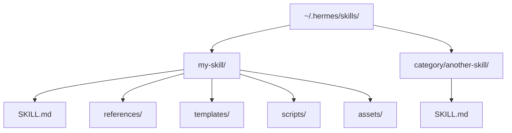
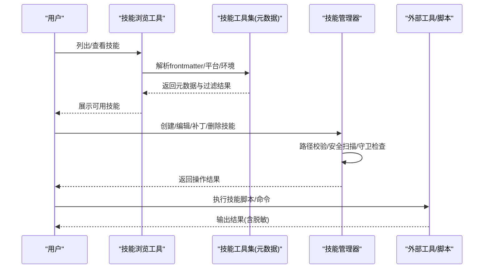
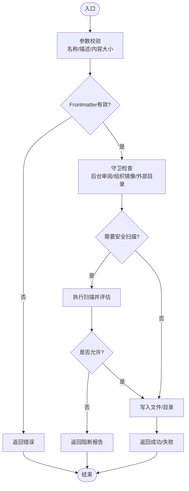
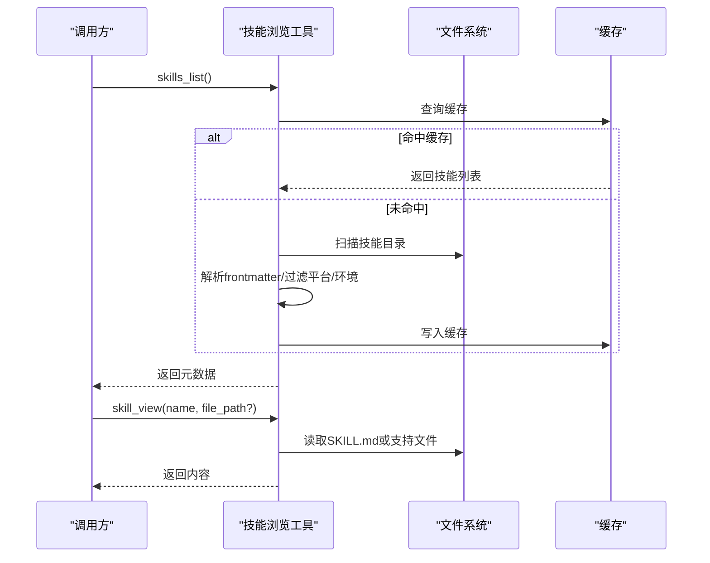
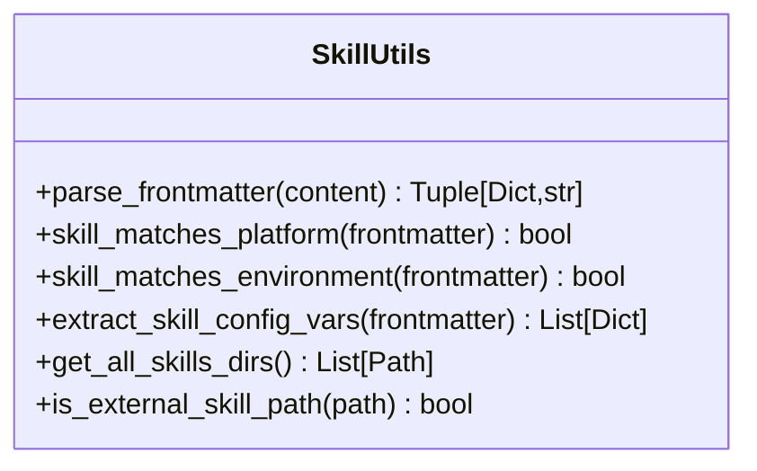
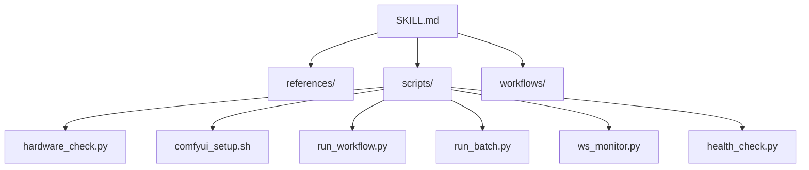
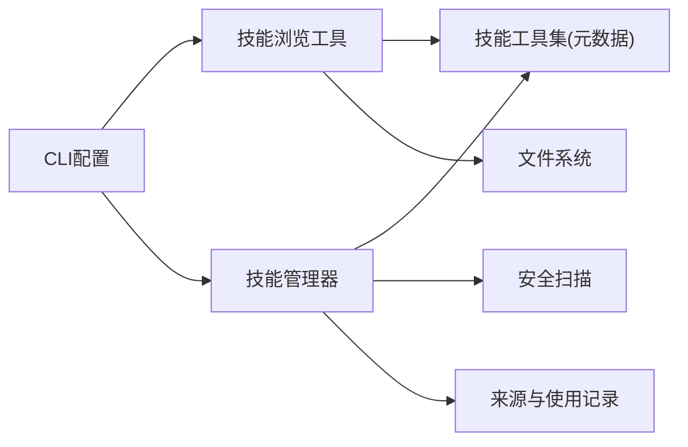

# 技能开发指南

<cite>
**本文引用的文件**
- [tools/skill_manager_tool.py](file://tools/skill_manager_tool.py)
- [agent/skill_utils.py](file://agent/skill_utils.py)
- [hermes_cli/skills_config.py](file://hermes_cli/skills_config.py)
- [tools/skills_tool.py](file://tools/skills_tool.py)
- [skills/creative/comfyui/SKILL.md](file://skills/creative/comfyui/SKILL.md)
- [tests/tools/test_terminal_error_redaction.py](file://tests/tools/test_terminal_error_redaction.py)
</cite>

## 目录
1. [简介](#简介)
2. [项目结构](#项目结构)
3. [核心组件](#核心组件)
4. [架构总览](#架构总览)
5. [详细组件分析](#详细组件分析)
6. [依赖关系分析](#依赖关系分析)
7. [性能考虑](#性能考虑)
8. [故障排查指南](#故障排查指南)
9. [结论](#结论)
10. [附录](#附录)

## 简介
本指南面向希望从零开始为 Hermes Agent 开发自定义技能的开发者。内容覆盖：
- 技能目录结构与 SKILL.md 编写规范
- Python 脚本与 JavaScript 工具集成方式
- 开发环境搭建、调试与测试框架
- 代码质量与安全最佳实践（权限控制、输入验证、错误处理）
- 外部 API 集成、数据库访问、文件操作与网络请求实现方法
- 从简单脚本到复杂应用的完整开发生态指导

Hermes 的技能系统采用“渐进式披露”的文档驱动模式：通过元数据快速发现，按需加载详细说明与参考文件；同时提供强大的管理工具链，支持创建、编辑、补丁、删除与文件级增删改，并内置安全扫描与来源保护机制。

## 项目结构
技能在仓库中以“目录 + SKILL.md”的形式组织，位于 skills 目录下，每个技能可包含 references、templates、scripts、assets 等子目录用于存放参考资料、模板、脚本与资源。

**图表来源**
- [tools/skill_manager_tool.py:22-32](file://tools/skill_manager_tool.py#L22-L32)
- [tools/skills_tool.py:14-27](file://tools/skills_tool.py#L14-L27)

**章节来源**
- [tools/skill_manager_tool.py:22-32](file://tools/skill_manager_tool.py#L22-L32)
- [tools/skills_tool.py:14-27](file://tools/skills_tool.py#L14-L27)

## 核心组件
- 技能管理与执行工具
  - 技能管理器：负责创建、编辑、补丁、删除技能及支持文件，包含安全扫描、路径校验、后台审阅守卫、组织镜像保护等。
  - 技能浏览工具：提供列出与查看技能的能力，支持渐进式披露与缓存优化。
- 技能元数据与环境匹配
  - 解析 YAML frontmatter，提取平台、环境、配置变量、条件激活等元信息。
  - 支持平台与运行环境过滤，避免无关技能干扰。
- CLI 配置与管理
  - 提供全局或按平台的启用/禁用能力，持久化至配置文件。

**章节来源**
- [tools/skill_manager_tool.py:1-33](file://tools/skill_manager_tool.py#L1-L33)
- [tools/skills_tool.py:1-67](file://tools/skills_tool.py#L1-L67)
- [agent/skill_utils.py:1-50](file://agent/skill_utils.py#L1-L50)
- [hermes_cli/skills_config.py:1-23](file://hermes_cli/skills_config.py#L1-L23)

## 架构总览
技能系统的整体流程如下：
- 发现阶段：扫描本地与外部技能目录，解析 SKILL.md 的 frontmatter，应用平台与环境过滤，生成可用技能列表。
- 选择阶段：根据用户意图与上下文，路由到具体技能。
- 执行阶段：调用技能内的脚本或外部工具，输出结构化结果，必要时进行敏感信息脱敏。
- 管理阶段：通过管理器对技能进行创建、编辑、补丁、删除与文件级操作，并执行安全扫描与来源保护。

**图表来源**
- [tools/skills_tool.py:81-104](file://tools/skills_tool.py#L81-L104)
- [agent/skill_utils.py:226-271](file://agent/skill_utils.py#L226-L271)
- [tools/skill_manager_tool.py:125-149](file://tools/skill_manager_tool.py#L125-L149)
- [tests/tools/test_terminal_error_redaction.py:47-60](file://tests/tools/test_terminal_error_redaction.py#L47-L60)

## 详细组件分析

### 技能管理器（Skill Manager Tool）
职责
- 创建新技能：生成 SKILL.md 与目录结构，校验 frontmatter 与内容大小限制。
- 编辑与补丁：支持全文替换与目标查找替换，要求先读取再写入（后台审阅守卫）。
- 删除技能：严格校验路径，防止误删根目录或跟随符号链接/目录连接。
- 支持文件管理：允许在受允许的 subdirectories（references、templates、scripts、assets）中写入或删除文件。
- 安全扫描：可选地对代理创建的技能和外部安装的技能进行扫描，阻止危险内容。
- 来源与权限保护：区分前台用户指令与后台审阅任务，限制对非本地/外部/受保护技能的写操作。

关键流程（创建/编辑/删除）

**图表来源**
- [tools/skill_manager_tool.py:527-635](file://tools/skill_manager_tool.py#L527-L635)
- [tools/skill_manager_tool.py:125-149](file://tools/skill_manager_tool.py#L125-L149)
- [tools/skill_manager_tool.py:213-271](file://tools/skill_manager_tool.py#L213-L271)
- [tools/skill_manager_tool.py:301-421](file://tools/skill_manager_tool.py#L301-L421)

**章节来源**
- [tools/skill_manager_tool.py:1-33](file://tools/skill_manager_tool.py#L1-L33)
- [tools/skill_manager_tool.py:527-635](file://tools/skill_manager_tool.py#L527-L635)
- [tools/skill_manager_tool.py:125-149](file://tools/skill_manager_tool.py#L125-L149)
- [tools/skill_manager_tool.py:213-271](file://tools/skill_manager_tool.py#L213-L271)
- [tools/skill_manager_tool.py:301-421](file://tools/skill_manager_tool.py#L301-L421)

### 技能浏览工具（Skills Tool）
职责
- 列出技能：返回元数据（名称、描述、分类、标签等），支持跳过已禁用技能。
- 查看技能：按需加载 SKILL.md 正文与关联文件（references/templates），实现渐进式披露。
- 缓存优化：基于目录签名与 TTL 缓存，减少重复扫描开销。
- 路径安全：拒绝绝对路径与穿越路径，防止越权读取。

**图表来源**
- [tools/skills_tool.py:81-104](file://tools/skills_tool.py#L81-L104)
- [tools/skills_tool.py:180-200](file://tools/skills_tool.py#L180-L200)

**章节来源**
- [tools/skills_tool.py:1-67](file://tools/skills_tool.py#L1-L67)
- [tools/skills_tool.py:81-104](file://tools/skills_tool.py#L81-L104)
- [tools/skills_tool.py:180-200](file://tools/skills_tool.py#L180-L200)

### 技能元数据与环境匹配（Skill Utils）
职责
- 解析 frontmatter：支持 YAML 与容错键值解析，处理 UTF-8 BOM。
- 平台匹配：将 macos/linux/windows 映射到 sys.platform 前缀，兼容 Termux/Android。
- 环境匹配：检测 kanban/docker/s6 等运行时环境，作为“相关性”门控而非硬性兼容。
- 配置变量提取：从 metadata.herms.config 声明技能所需配置项，便于统一收集与提示。
- 外部技能目录：读取并展开 external_dirs，合并到主技能目录集合。

**图表来源**
- [agent/skill_utils.py:174-220](file://agent/skill_utils.py#L174-L220)
- [agent/skill_utils.py:226-271](file://agent/skill_utils.py#L226-L271)
- [agent/skill_utils.py:351-387](file://agent/skill_utils.py#L351-L387)
- [agent/skill_utils.py:701-757](file://agent/skill_utils.py#L701-L757)
- [agent/skill_utils.py:582-590](file://agent/skill_utils.py#L582-L590)
- [agent/skill_utils.py:658-675](file://agent/skill_utils.py#L658-L675)

**章节来源**
- [agent/skill_utils.py:174-220](file://agent/skill_utils.py#L174-L220)
- [agent/skill_utils.py:226-271](file://agent/skill_utils.py#L226-L271)
- [agent/skill_utils.py:351-387](file://agent/skill_utils.py#L351-L387)
- [agent/skill_utils.py:701-757](file://agent/skill_utils.py#L701-L757)
- [agent/skill_utils.py:582-590](file://agent/skill_utils.py#L582-L590)
- [agent/skill_utils.py:658-675](file://agent/skill_utils.py#L658-L675)

### CLI 技能配置（Skills Config）
职责
- 提供交互式界面，按平台或全局启用/禁用技能。
- 持久化 disabled 与 platform_disabled 列表到配置文件。
- 与技能发现模块联动，确保 UI 与实际行为一致。

**章节来源**
- [hermes_cli/skills_config.py:1-23](file://hermes_cli/skills_config.py#L1-L23)
- [hermes_cli/skills_config.py:44-72](file://hermes_cli/skills_config.py#L44-L72)
- [hermes_cli/skills_config.py:150-203](file://hermes_cli/skills_config.py#L150-L203)

### 示例技能：ComfyUI
该示例展示了完整的技能结构与实践：
- SKILL.md 包含 frontmatter（name、description、platforms、metadata 等）与详细的步骤说明。
- scripts/ 提供硬件检查、安装、工作流执行、批处理、WebSocket 监控、健康检查等脚本。
- workflows/ 提供预置工作流 JSON，便于快速体验。
- references/ 提供官方 CLI、REST/WebSocket API、工作流格式等参考文档。

**图表来源**
- [skills/creative/comfyui/SKILL.md:1-68](file://skills/creative/comfyui/SKILL.md#L1-L68)

**章节来源**
- [skills/creative/comfyui/SKILL.md:1-68](file://skills/creative/comfyui/SKILL.md#L1-L68)
- [skills/creative/comfyui/SKILL.md:124-184](file://skills/creative/comfyui/SKILL.md#L124-L184)
- [skills/creative/comfyui/SKILL.md:231-478](file://skills/creative/comfyui/SKILL.md#L231-L478)

## 依赖关系分析
- 技能管理器依赖：
  - 技能工具集（元数据解析、路径安全、外部目录）
  - 安全扫描（可选）
  - 使用记录与来源追踪（pinned、hub/bundled/external）
- 技能浏览工具依赖：
  - 元数据解析与过滤
  - 文件系统扫描与缓存
- CLI 配置依赖：
  - 配置文件读写
  - 技能发现模块

**图表来源**
- [tools/skill_manager_tool.py:46-51](file://tools/skill_manager_tool.py#L46-L51)
- [tools/skill_manager_tool.py:97-103](file://tools/skill_manager_tool.py#L97-L103)
- [tools/skills_tool.py:81-87](file://tools/skills_tool.py#L81-L87)
- [hermes_cli/skills_config.py:16-23](file://hermes_cli/skills_config.py#L16-L23)

**章节来源**
- [tools/skill_manager_tool.py:46-51](file://tools/skill_manager_tool.py#L46-L51)
- [tools/skill_manager_tool.py:97-103](file://tools/skill_manager_tool.py#L97-L103)
- [tools/skills_tool.py:81-87](file://tools/skills_tool.py#L81-L87)
- [hermes_cli/skills_config.py:16-23](file://hermes_cli/skills_config.py#L16-L23)

## 性能考虑
- 渐进式披露：仅加载必要元数据，按需读取详细内容与支持文件，降低 token 与 I/O 压力。
- 缓存策略：
  - 技能扫描缓存：基于目录签名与 TTL，避免重复扫描。
  - 配置缓存：按 mtime+size 缓存 raw config，减少启动时解析成本。
- 平台与环境过滤：提前隐藏不相关技能，减少无效提示与计算。
- 外部目录去重与存在性检查：避免无效路径带来的额外开销。

**章节来源**
- [tools/skills_tool.py:91-104](file://tools/skills_tool.py#L91-L104)
- [agent/skill_utils.py:393-433](file://agent/skill_utils.py#L393-L433)
- [agent/skill_utils.py:484-579](file://agent/skill_utils.py#L484-L579)

## 故障排查指南
常见问题与定位建议：
- 技能未被发现或不可用
  - 检查 frontmatter 的 name/description 是否有效，平台与环境是否匹配。
  - 确认技能未被禁用（全局或平台级别）。
- 技能编辑失败或被拒绝
  - 检查路径是否合法（非绝对路径、无穿越）、是否在受保护的目录（外部/组织镜像/受保护内置）。
  - 后台审阅任务需先读取目标文件再写入，遵循“读后写”守卫。
- 安全扫描阻断
  - 查看扫描报告，移除危险内容或调整配置。
- 输出泄露敏感信息
  - 终端工具会对错误与回溯中的敏感信息进行脱敏；如需保留，可通过开关关闭（谨慎使用）。

**章节来源**
- [tools/skill_manager_tool.py:180-200](file://tools/skill_manager_tool.py#L180-L200)
- [tools/skill_manager_tool.py:213-271](file://tools/skill_manager_tool.py#L213-L271)
- [tools/skill_manager_tool.py:301-421](file://tools/skill_manager_tool.py#L301-L421)
- [tests/tools/test_terminal_error_redaction.py:47-60](file://tests/tools/test_terminal_error_redaction.py#L47-L60)
- [tests/tools/test_terminal_error_redaction.py:140-154](file://tests/tools/test_terminal_error_redaction.py#L140-L154)

## 结论
Hermes 的技能系统以“文档驱动 + 工具链保障”为核心，提供了从发现、选择、执行到管理的完整闭环。通过严格的 frontmatter 校验、平台与环境过滤、安全扫描与来源保护，开发者可以构建既强大又安全的技能生态。结合示例技能（如 ComfyUI）的实践，开发者可以快速上手并扩展到更复杂的自动化场景。

## 附录
- 开发环境搭建
  - 使用 Python 虚拟环境与 uv/pipx 管理依赖。
  - 通过 hermes CLI 管理技能启用/禁用与配置。
- 调试与测试
  - 使用单元测试验证错误脱敏与边界情况。
  - 借助 health_check 与 check_deps 等脚本进行端到端验证。
- 代码质量标准
  - 遵循 frontmatter 规范与命名约定。
  - 保持脚本幂等与健壮的错误处理。
  - 避免硬编码敏感信息，使用环境变量或密钥管理。
- 安全与权限
  - 对外部输入进行严格校验与脱敏。
  - 限制写操作范围，防止路径穿越与越权访问。
  - 对未知工作流或脚本保持信任边界意识。