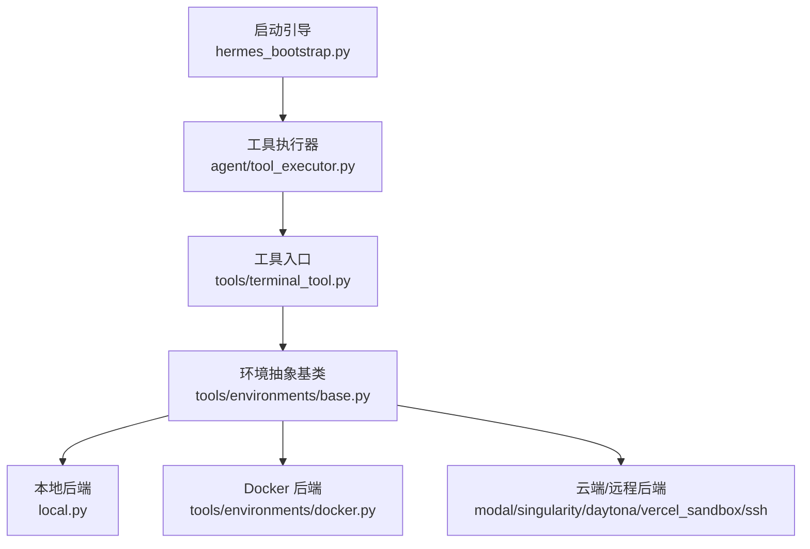
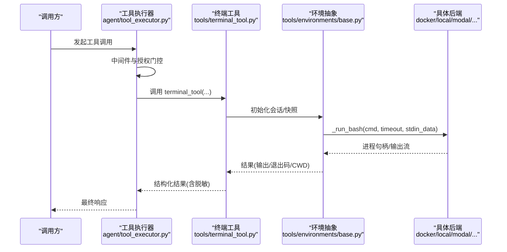
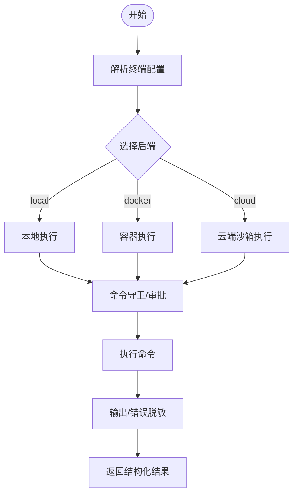
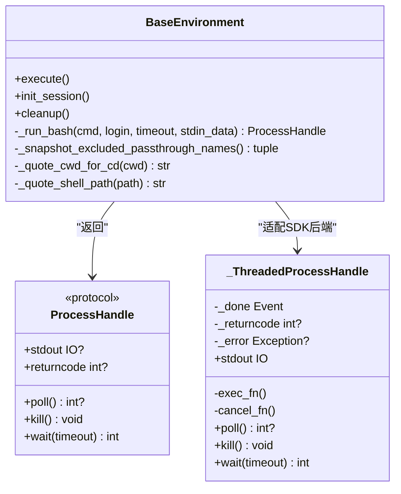
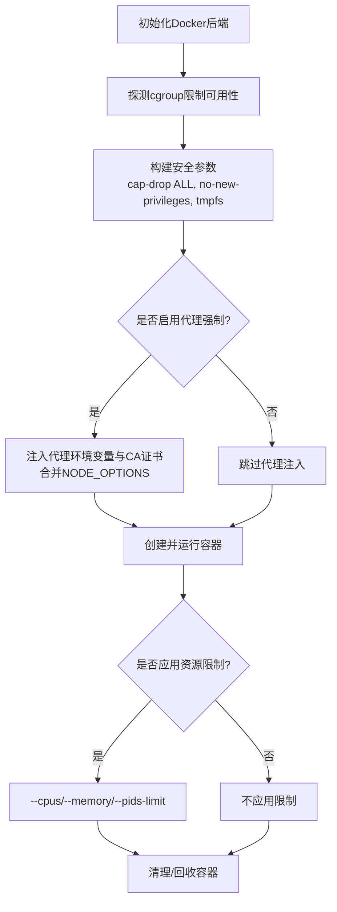
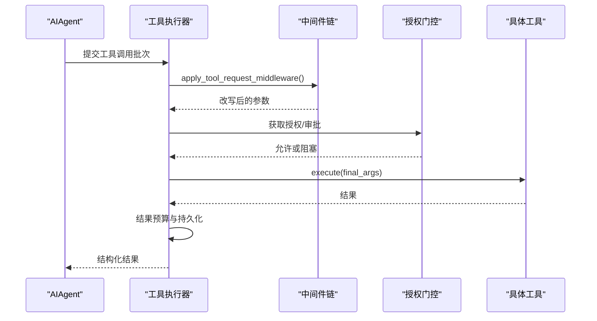
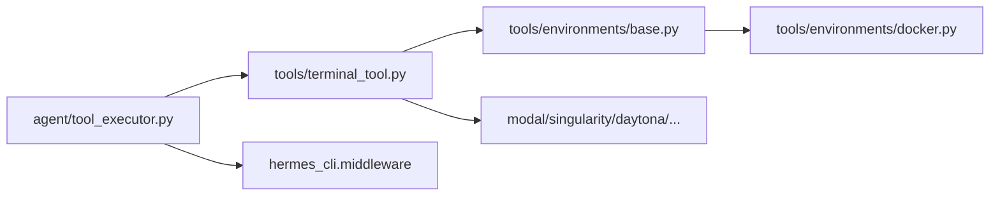

# 技能执行环境

<cite>
**本文引用的文件**
- [tools/terminal_tool.py](file://tools/terminal_tool.py)
- [tools/environments/base.py](file://tools/environments/base.py)
- [tools/environments/docker.py](file://tools/environments/docker.py)
- [agent/tool_executor.py](file://agent/tool_executor.py)
- [hermes_bootstrap.py](file://hermes_bootstrap.py)
- [tests/tools/test_terminal_error_redaction.py](file://tests/tools/test_terminal_error_redaction.py)
</cite>

## 目录
1. [简介](#简介)
2. [项目结构](#项目结构)
3. [核心组件](#核心组件)
4. [架构总览](#架构总览)
5. [详细组件分析](#详细组件分析)
6. [依赖关系分析](#依赖关系分析)
7. [性能考量](#性能考量)
8. [故障排查指南](#故障排查指南)
9. [结论](#结论)
10. [附录](#附录)

## 简介
本文件系统性说明“技能执行环境”的隔离机制、执行上下文管理、多后端支持（本地终端、Docker 容器、云端沙箱等）、安全边界、以及性能与错误隔离策略。重点围绕命令执行的统一抽象、会话快照与环境注入、工作目录与进程间通信、资源限制与网络出口控制，以及输出脱敏与错误隔离展开。

## 项目结构
技能执行由“工具层入口 + 环境抽象基类 + 具体后端实现”构成：
- 工具入口：终端工具负责接收命令、选择后端、安全检查、结果脱敏与返回。
- 环境抽象：定义统一的执行流程（会话快照、CWD 跟踪、超时、中断）。
- 后端实现：本地、Docker、Modal、Singularity、Daytona、Vercel Sandbox、SSH 等。
- 执行编排：工具调用执行器负责并发调度、预算与中间件拦截、结果持久化。
- 启动引导：Windows UTF-8 引导、路径加固、惰性安装目标激活。

图表来源
- [tools/terminal_tool.py:1-34](file://tools/terminal_tool.py#L1-L34)
- [tools/environments/base.py:553-619](file://tools/environments/base.py#L553-L619)
- [tools/environments/docker.py:1-6](file://tools/environments/docker.py#L1-L6)
- [agent/tool_executor.py:1-12](file://agent/tool_executor.py#L1-L12)
- [hermes_bootstrap.py:1-48](file://hermes_bootstrap.py#L1-L48)

章节来源
- [tools/terminal_tool.py:1-34](file://tools/terminal_tool.py#L1-L34)
- [tools/environments/base.py:553-619](file://tools/environments/base.py#L553-L619)
- [tools/environments/docker.py:1-6](file://tools/environments/docker.py#L1-L6)
- [agent/tool_executor.py:1-12](file://agent/tool_executor.py#L1-L12)
- [hermes_bootstrap.py:1-48](file://hermes_bootstrap.py#L1-L48)

## 核心组件
- 终端工具（tools/terminal_tool.py）
  - 统一入口，解析配置、选择后端、执行命令、处理后台任务、输出脱敏与安全校验。
  - 支持多种执行后端：本地、Docker、Modal、Vercel Sandbox、Singularity、Daytona、SSH。
- 环境抽象基类（tools/environments/base.py）
  - 定义 BaseEnvironment 接口与通用执行流程：会话快照、CWD 标记、超时、中断、输出收集与溢出转储。
  - 提供进程句柄协议 ProcessHandle 与线程化适配 _ThreadedProcessHandle。
- Docker 后端（tools/environments/docker.py）
  - 容器安全参数、资源限制探测、代理出口强制、标签与清理、用户权限与 tmpfs 挂载。
- 工具执行器（agent/tool_executor.py）
  - 工具调用的并发调度、中间件链、授权门控、结果预算与持久化、取消与中断。
- 启动引导（hermes_bootstrap.py）
  - Windows UTF-8 引导、平台版本查询抑制、导入路径加固、惰性安装目标激活。

章节来源
- [tools/terminal_tool.py:1-34](file://tools/terminal_tool.py#L1-L34)
- [tools/environments/base.py:553-619](file://tools/environments/base.py#L553-L619)
- [tools/environments/docker.py:1-6](file://tools/environments/docker.py#L1-L6)
- [agent/tool_executor.py:1-12](file://agent/tool_executor.py#L1-L12)
- [hermes_bootstrap.py:1-48](file://hermes_bootstrap.py#L1-L48)

## 架构总览
技能执行从工具调用进入，经中间件与授权门控后，选择具体执行后端；后端以“每次命令生成一个 bash 子进程”的统一模型运行，并通过会话快照维持环境变量、函数与别名；工作目录通过内带标记或临时文件在远程后端保持；输出采用有界收集器并支持溢出转储到磁盘；Docker 后端提供强隔离与资源限制，并可通过代理强制出站流量。

图表来源
- [agent/tool_executor.py:482-662](file://agent/tool_executor.py#L482-L662)
- [tools/terminal_tool.py:1-34](file://tools/terminal_tool.py#L1-L34)
- [tools/environments/base.py:553-619](file://tools/environments/base.py#L553-L619)
- [tools/environments/docker.py:322-351](file://tools/environments/docker.py#L322-L351)

## 详细组件分析

### 终端工具（命令入口与安全）
- 功能要点
  - 多后端选择：根据配置与环境变量选择 local、docker、modal、vercel_sandbox 等。
  - 危险命令审批与守卫：整合命令守卫与 CLI 回调，必要时要求人工批准。
  - 工作目录校验：白名单字符过滤，防止注入。
  - sudo 交互与缓存：按会话/回调/线程作用域缓存密码，失败时自动失效。
  - 输出脱敏：错误与追踪信息强制脱敏，成功输出可配置是否脱敏。
- 关键流程
  - 解析配置 -> 选择后端 -> 检查守卫 -> 执行命令 -> 结果脱敏 -> 返回结构化结果。

图表来源
- [tools/terminal_tool.py:1-34](file://tools/terminal_tool.py#L1-L34)
- [tools/terminal_tool.py:375-420](file://tools/terminal_tool.py#L375-L420)
- [tools/terminal_tool.py:423-483](file://tools/terminal_tool.py#L423-L483)
- [tests/tools/test_terminal_error_redaction.py:1-154](file://tests/tools/test_terminal_error_redaction.py#L1-L154)

章节来源
- [tools/terminal_tool.py:1-34](file://tools/terminal_tool.py#L1-L34)
- [tools/terminal_tool.py:375-420](file://tools/terminal_tool.py#L375-L420)
- [tools/terminal_tool.py:423-483](file://tools/terminal_tool.py#L423-L483)
- [tests/tools/test_terminal_error_redaction.py:1-154](file://tests/tools/test_terminal_error_redaction.py#L1-L154)

### 环境抽象基类（会话快照、CWD、超时、中断、输出收集）
- 统一执行模型
  - 每次命令以 bash -c 形式运行，首次 init_session 捕获登录 shell 的环境、函数、别名与工作目录，后续命令 source 快照以提升性能。
  - 会话快照排除 per-session 桥接变量，避免跨会话泄漏。
- 工作目录跟踪
  - 通过内带标记 __HERMES_CWD_{session_id}__ 在远程后端传递当前工作目录。
- 输出收集与溢出
  - 使用有界收集器保留头部与尾部片段，超过阈值时写入 spill 文件，保护内存与磁盘。
- 中断与心跳
  - 支持 is_interrupted 检测与周期性活动回调，便于网关感知长任务进度。
- 进程句柄协议
  - 对 SDK 后端（Modal、Daytona）通过 _ThreadedProcessHandle 适配为统一接口。

图表来源
- [tools/environments/base.py:553-619](file://tools/environments/base.py#L553-L619)
- [tools/environments/base.py:382-467](file://tools/environments/base.py#L382-L467)
- [tools/environments/base.py:660-782](file://tools/environments/base.py#L660-L782)

章节来源
- [tools/environments/base.py:553-619](file://tools/environments/base.py#L553-L619)
- [tools/environments/base.py:382-467](file://tools/environments/base.py#L382-L467)
- [tools/environments/base.py:660-782](file://tools/environments/base.py#L660-L782)

### Docker 后端（容器隔离、资源限制、网络出口）
- 安全与隔离
  - 默认丢弃所有能力，仅添加最小必要能力；启用 no-new-privileges；tmpfs 限制 /tmp 与 /var/tmp；/run 按需 exec/noexec。
  - 支持以宿主用户身份运行或特权降级场景下的额外能力。
- 资源限制
  - 探测 cgroup 控制器可用性，按需启用 --cpus、--memory、--pids-limit；shm 大小可调以避免共享内存不足。
- 网络出口控制
  - 可选 iron-proxy 强制出站代理，注入 HTTPS_PROXY/HTTP_PROXY/NO_PROXY 与 CA 证书路径，合并 NODE_OPTIONS，阻止覆盖关键环境变量。
- 生命周期管理
  - 清理孤儿容器、基于标签与状态筛选；支持 profile 隔离与任务复用指纹。

图表来源
- [tools/environments/docker.py:322-351](file://tools/environments/docker.py#L322-L351)
- [tools/environments/docker.py:397-555](file://tools/environments/docker.py#L397-L555)
- [tools/environments/docker.py:720-769](file://tools/environments/docker.py#L720-L769)
- [tools/environments/docker.py:148-239](file://tools/environments/docker.py#L148-L239)

章节来源
- [tools/environments/docker.py:322-351](file://tools/environments/docker.py#L322-L351)
- [tools/environments/docker.py:397-555](file://tools/environments/docker.py#L397-L555)
- [tools/environments/docker.py:720-769](file://tools/environments/docker.py#L720-L769)
- [tools/environments/docker.py:148-239](file://tools/environments/docker.py#L148-L239)

### 工具执行器（并发调度、中间件、授权门控、结果预算）
- 并发与限流
  - 使用线程池并行执行工具调用，限制最大工作线程数；图像生成请求单独限速。
- 中间件与授权
  - 在工具执行前应用请求中间件与执行中间件；授权门控序列化审批提示，排除人类等待时间计入批处理截止时间。
- 结果预算与持久化
  - 根据上下文窗口计算工具结果预算，避免单次结果过大导致请求超限；增量持久化工具调用进度，确保破坏性但有效调用后的转录存活。
- 取消与中断
  - 支持用户中断导致的批量取消，记录取消原因与指标。

图表来源
- [agent/tool_executor.py:482-662](file://agent/tool_executor.py#L482-L662)
- [agent/tool_executor.py:758-800](file://agent/tool_executor.py#L758-L800)

章节来源
- [agent/tool_executor.py:482-662](file://agent/tool_executor.py#L482-L662)
- [agent/tool_executor.py:758-800](file://agent/tool_executor.py#L758-L800)

### 启动引导（Windows UTF-8、路径加固、惰性安装）
- Windows UTF-8 引导
  - 设置 PYTHONUTF8 与 PYTHONIO_ENCODING，重配置 stdout/stderr/stdin 为 UTF-8，避免子进程编码崩溃。
- 平台版本查询抑制
  - 屏蔽 platform._syscmd_ver 以避免控制台闪烁与解码崩溃。
- 导入路径加固
  - 移除当前目录优先，将 Hermes 源码根置于 sys.path 首位，防止被同名包遮蔽。
- 惰性安装目标激活
  - 在不可变镜像中激活数据卷上的惰性安装目录，使之前安装的包可被导入。

章节来源
- [hermes_bootstrap.py:1-48](file://hermes_bootstrap.py#L1-L48)
- [hermes_bootstrap.py:59-122](file://hermes_bootstrap.py#L59-L122)
- [hermes_bootstrap.py:125-165](file://hermes_bootstrap.py#L125-L165)
- [hermes_bootstrap.py:168-202](file://hermes_bootstrap.py#L168-L202)
- [hermes_bootstrap.py:204-226](file://hermes_bootstrap.py#L204-L226)

## 依赖关系分析
- 模块耦合
  - 终端工具依赖环境抽象基类与各后端实现；执行器依赖终端工具与中间件；Docker 后端依赖基础环境与系统工具。
- 外部依赖
  - Docker/Podman CLI、iron-proxy（可选）、Modal/Daytona/Vercel SDK（按需）。
- 潜在循环依赖
  - 通过延迟导入与模块化设计避免；例如终端工具在需要时才导入代理与配置模块。

图表来源
- [agent/tool_executor.py:482-662](file://agent/tool_executor.py#L482-L662)
- [tools/terminal_tool.py:1-34](file://tools/terminal_tool.py#L1-L34)
- [tools/environments/base.py:553-619](file://tools/environments/base.py#L553-L619)
- [tools/environments/docker.py:1-6](file://tools/environments/docker.py#L1-L6)

章节来源
- [agent/tool_executor.py:482-662](file://agent/tool_executor.py#L482-L662)
- [tools/terminal_tool.py:1-34](file://tools/terminal_tool.py#L1-L34)
- [tools/environments/base.py:553-619](file://tools/environments/base.py#L553-L619)
- [tools/environments/docker.py:1-6](file://tools/environments/docker.py#L1-L6)

## 性能考量
- 会话快照
  - 首次捕获登录 shell 环境并 source 快照，减少每命令启动开销；原子写入快照避免并发竞争。
- 输出收集
  - 有界收集器保留头尾片段，溢出时转储至磁盘文件，避免内存膨胀；支持关闭转储以节省 I/O。
- 并发与超时
  - 工具调用并发受线程池上限限制；图像生成请求单独限速；全局超时与授权门控超时防止饥饿。
- 资源限制
  - Docker 后端探测 cgroup 可用性并应用 CPU/内存/PID 限制；tmpfs 限制临时空间；共享内存大小可调。
- 网络出口
  - 可选代理强制，避免绕过出站控制；合并 NODE_OPTIONS 以减少逃逸面。

[本节提供一般性指导，无需特定文件引用]

## 故障排查指南
- 常见错误与定位
  - 后端不可达（SSH/Docker/远程服务）：抛出 EnvironmentConnectionError，建议检查网络与服务状态并重试。
  - 容器未找到或权限不足：检查 docker/podman 可用性与权限；确认代理配置与 CA 证书存在。
  - 输出过长：查看 spill 文件路径以恢复完整输出；调整 max_chars 或关闭转储。
  - 超时与中断：检查 HERMES_CONCURRENT_TOOL_TIMEOUT_S 与授权门控超时；确认用户中断信号。
- 调试开关
  - 启用 HERMES_DEBUG_INTERRUPT=1 以记录中断与心跳细节；检查日志中的警告与调试信息。
- 脱敏与隐私
  - 错误与追踪信息强制脱敏；如需禁用脱敏，可在测试环境中调整相关标志。

章节来源
- [tools/environments/base.py:55-79](file://tools/environments/base.py#L55-L79)
- [tools/environments/base.py:81-231](file://tools/environments/base.py#L81-L231)
- [tools/environments/docker.py:772-800](file://tools/environments/docker.py#L772-L800)
- [tests/tools/test_terminal_error_redaction.py:1-154](file://tests/tools/test_terminal_error_redaction.py#L1-L154)

## 结论
该执行环境通过统一抽象与多后端实现，提供了强大的隔离、安全与性能保障。会话快照与有界输出收集提升了效率，Docker 后端的资源限制与网络出口控制强化了安全边界，工具执行器的中间件与授权门控确保了可控的执行流程。建议在部署时结合代理强制与资源限制，并根据实际需求调整超时与输出策略。

[本节总结内容，无需特定文件引用]

## 附录
- 环境变量参考
  - TERMINAL_ENV：选择执行后端（local/docker/modal/vercel_sandbox）。
  - TERMINAL_MAX_FOREGROUND_TIMEOUT：前台命令最大超时。
  - TERMINAL_DISK_WARNING_GB：磁盘使用告警阈值。
  - HERMES_CONCURRENT_TOOL_TIMEOUT_S：工具并发超时。
  - HERMES_DOCKER_BINARY：指定 Docker/Podman 二进制路径。
  - HERMES_EGRESS_PROXY：标识代理感知模式。
- 最佳实践
  - 在生产环境启用 Docker 后端与代理强制；合理设置资源限制与超时；定期清理孤儿容器；监控磁盘使用与输出溢出。

[本节提供补充信息，无需特定文件引用]